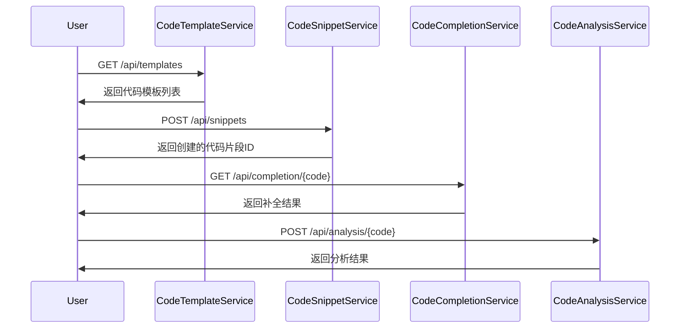
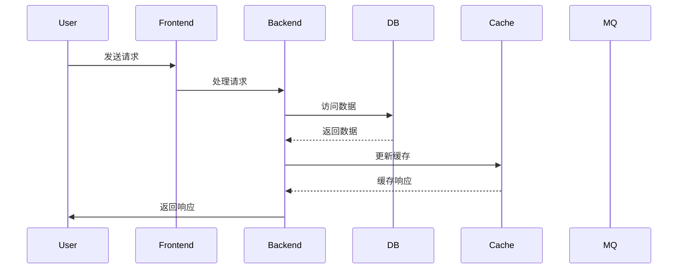

                 

### 《提示词编程的认知负荷优化》

关键词：认知负荷、提示词编程、优化方法、算法原理、系统架构

摘要：本文从认知负荷和提示词编程的基本概念入手，详细分析了认知负荷在编程过程中的影响，探讨了优化提示词编程认知负荷的目标和方法。通过核心概念与原理的讲解，提出了具体的算法原理和数学模型，并结合Python代码进行了详细阐述。随后，本文介绍了系统功能设计、架构设计和项目实战，提供了实际案例分析和项目小结，最后提出了最佳实践、注意事项和拓展阅读。

### 第一部分：背景与基础

#### 第1章：问题背景与认知负荷概述

##### 1.1 问题背景

认知负荷是指人在执行任务时，大脑处理信息所需的心理资源。在编程过程中，认知负荷主要体现在理解代码、逻辑推导、错误排除等方面。随着代码复杂度和编程语言功能的增加，程序员需要处理的认知负荷也在不断增加。提示词编程是一种利用预先定义好的提示词来指导编程的方法，它旨在降低程序员的认知负荷。

##### 1.2 认知负荷的定义与度量

认知负荷的定义包括其心理资源的消耗、任务执行的时间成本和出错概率等方面。常见的认知负荷度量方法有工作记忆容量、反应时间、错误率等。在编程中，认知负荷的度量可以通过分析程序员在代码编写、调试和测试过程中的心理活动和行为表现来实现。

##### 1.3 提示词编程的认知负荷特性

提示词编程在降低认知负荷方面具有一定的优势。首先，提示词能够帮助程序员快速理解和记忆编程语言的关键概念和语法规则。其次，提示词可以减少程序员在编写代码时的错误率，提高代码质量。然而，提示词编程也面临着一些挑战，如提示词的选择、组合和使用方式等。

##### 1.4 认知负荷优化的目标与方法

认知负荷优化的目标是降低程序员在编程过程中的认知负荷，提高编程效率和代码质量。具体方法包括改进编程语言设计、引入辅助工具、优化编程流程和培训等。本文将重点探讨提示词编程的认知负荷优化方法。

#### 第2章：核心概念与原理

##### 2.1 提示词编程的核心概念

提示词是一种简短、精确、易于记忆的文本或代码片段，用于指导编程任务。在提示词编程中，程序员通过使用提示词来简化编程过程中的理解、记忆和推理任务。提示词可以分为内置提示词和自定义提示词，其中内置提示词通常由编程语言或框架提供，自定义提示词则由程序员根据具体需求定义。

##### 2.2 认知负荷优化原理

认知负荷优化原理主要包括减少冗余信息、提高信息呈现质量和优化任务流程等方面。减少冗余信息可以通过简化编程语言和语法规则来实现。提高信息呈现质量可以通过使用可视化工具和图形化界面来展示代码结构、变量关系和算法逻辑。优化任务流程可以通过自动化工具和脚本化编程来减少手动操作和重复性任务。

##### 2.3 关键概念之间的联系

提示词编程与认知负荷之间存在密切联系。提示词编程通过提供简明、精确的指导信息，有助于降低程序员的认知负荷。同时，认知负荷的优化也为提示词编程的广泛应用提供了基础。不同类型的提示词和优化方法在编程过程中具有互补性，可以相互结合，提高编程效率和代码质量。

#### 第3章：概念属性特征对比

##### 3.1 提示词编程技术

常用的提示词编程技术包括代码模板、代码片段、代码补全和代码分析等。每种技术都有其特点和应用场景。例如，代码模板适用于快速构建原型和重复性任务；代码片段适用于简化常见代码逻辑；代码补全可以减少程序员手动输入的工作量；代码分析可以用于检测代码中的潜在错误和优化点。

##### 3.2 认知负荷优化方法

认知负荷优化方法包括编程语言优化、开发工具优化、编程流程优化和程序员培训等。编程语言优化可以通过改进语法规则、增加内置功能来实现；开发工具优化可以通过集成可视化工具、代码补全和自动化工具来提高编程效率；编程流程优化可以通过制定规范、使用代码审查和测试来确保代码质量；程序员培训可以通过提高编程技能、培养编程习惯和优化认知策略来实现。

### 第二部分：核心概念与联系

#### 第4章：算法原理与数学模型

##### 4.1 算法原理概述

算法原理的概述主要包括算法设计的基本原则、优化思路的提出和算法步骤的详细描述。算法设计的基本原则包括准确性、可扩展性、鲁棒性和效率。优化思路的提出可以通过分析编程过程中的认知负荷来源和优化目标，设计出针对性的算法。算法步骤的详细描述需要明确每个步骤的功能、输入输出和计算过程。

##### 4.2 数学模型与公式

数学模型的建立是为了描述算法的运行过程和计算方法。公式推导过程需要基于数学原理和算法设计思路，逐步推导出关键的数学公式。公式解释与应用需要详细说明公式的含义、作用和具体应用场景。

##### 4.3 算法流程图

算法流程图是一种用于描述算法运行过程的图形化工具。使用Mermaid绘制算法流程图可以直观地展示算法的执行步骤和逻辑关系。算法流程图的说明和示例可以帮助程序员更好地理解和应用算法。

#### 第5章：算法讲解与举例

##### 5.1 算法讲解

算法讲解需要详细阐述算法的实现原理、关键步骤和可扩展性。实现原理需要从算法设计思路和数学模型出发，解释算法的基本逻辑。关键步骤需要详细说明每个步骤的具体实现过程和计算方法。可扩展性需要说明算法如何适应不同规模和复杂度的编程任务。

##### 5.2 举例说明

举例说明是通过具体实例来展示算法的应用过程和效果。实例代码演示需要提供具体的代码实现，并分析代码的功能和优化点。实例分析需要结合实际应用场景，评估算法的性能和适用性。

### 第三部分：系统分析与架构设计

#### 第6章：系统功能设计

##### 6.1 问题描述与需求分析

系统功能设计需要从问题描述和需求分析出发。问题描述需要明确系统的目标和功能需求，包括系统的主要功能模块、用户角色和功能需求列表。需求分析需要基于问题描述，细化每个功能模块的具体需求和实现细节。

##### 6.2 领域模型设计

领域模型设计是系统功能设计的重要组成部分。使用Mermaid绘制领域模型类图可以直观地展示系统的实体关系和属性。类图解释和示例可以帮助程序员更好地理解和实现系统功能。

##### 6.3 系统接口设计

系统接口设计是系统架构设计的关键环节。接口设计需要明确系统与其他系统或模块的交互方式和数据传输格式。接口设计图可以帮助程序员更好地理解和实现系统接口。

##### 6.4 系统交互设计

系统交互设计是系统功能实现的重要环节。使用Mermaid绘制系统交互序列图可以直观地展示系统各模块之间的交互过程和逻辑关系。序列图解释和示例可以帮助程序员更好地理解和实现系统交互。

### 第四部分：项目实战

#### 第7章：环境安装与系统实现

##### 7.1 环境安装

环境安装是系统实现的第一步。开发环境的搭建需要配置合适的编程语言、开发工具和依赖库。软件与工具的安装需要遵循相应的安装指南和配置文件。环境配置与调试是确保系统正常运行的关键环节。

##### 7.2 系统核心实现

系统核心实现是系统功能实现的主体部分。系统核心功能的实现需要按照需求分析和设计文档，逐步完成各个功能模块的实现。关键模块的代码分析是确保代码质量的重要环节。功能演示是验证系统功能的最终步骤。

##### 7.3 代码应用解读

代码应用解读是对系统实现过程中的关键代码进行详细分析和解释。代码的执行流程与逻辑需要清晰明了，以便程序员能够理解和维护代码。代码的功能与优化需要结合实际应用场景，分析代码的执行效率和性能。

##### 7.4 实际案例分析

实际案例分析是通过对具体应用案例的分析和评估，来验证系统的实际效果和性能。案例分析和评估需要结合具体的数据和实验结果，评估系统在不同场景下的适用性和可靠性。案例的启示与建议可以为后续的系统改进和优化提供参考。

### 第五部分：项目小结与拓展阅读

#### 第8章：项目小结

项目小结是对整个项目的总结和回顾。项目成果总结需要明确系统的主要功能、性能和可靠性。项目中的难点与挑战需要分析系统实现过程中遇到的困难和技术瓶颈。项目的改进方向需要根据实际需求和用户反馈，提出系统改进和优化的建议。

#### 第9章：拓展阅读

拓展阅读是推荐相关领域的新研究进展、优化方法的应用拓展和进一步学习的资源。新研究进展可以帮助读者了解当前领域的最新动态和发展趋势。优化方法的应用拓展可以提供更多的思路和工具，以应对不同场景下的认知负荷优化需求。进一步学习的资源可以推荐相关的书籍、论文和在线课程，帮助读者深入学习和研究。

### 结语

《提示词编程的认知负荷优化》旨在通过分析认知负荷和提示词编程的关系，探讨优化方法在降低编程认知负荷方面的应用。本文从背景介绍、核心概念、算法原理、系统架构和项目实战等多个方面进行了详细阐述，提供了丰富的实例和案例。通过本文的学习，读者可以更好地理解认知负荷优化的原理和方法，为编程实践提供有益的指导。

作者：AI天才研究院/AI Genius Institute & 禅与计算机程序设计艺术 /Zen And The Art of Computer Programming

### 第一部分：背景与基础

#### 第1章：问题背景与认知负荷概述

在计算机编程领域，认知负荷是一个不容忽视的问题。随着编程语言和技术的不断发展，程序员需要处理的复杂度和信息量也在不断增加。这种增长导致了程序员在编程过程中的认知负荷增加，从而影响了编程效率和代码质量。

##### 1.1 问题背景

认知负荷是指人在执行任务时，大脑处理信息所需的心理资源。在编程过程中，认知负荷主要体现在以下几个方面：

1. **理解代码**：程序员需要理解代码的结构、逻辑和功能，这需要耗费大量的认知资源。
2. **逻辑推导**：编程过程中需要进行逻辑推导和推理，这同样需要认知资源的支持。
3. **错误排除**：在编写和调试代码时，程序员需要不断排除错误，这也需要大量的认知资源。

随着编程语言和框架的复杂度增加，程序员需要记忆和理解的语法规则、函数库和API也在增加。例如，现代编程语言如Python、Java和C++等，都有大量的内置函数和库，这些都需要程序员在编程过程中随时查阅和记忆。

此外，随着软件项目的规模和复杂度增加，程序员需要管理的数据量和逻辑关系也在增加。这导致了程序员在编程过程中的认知负荷不断增加。

##### 1.2 认知负荷的定义与度量

认知负荷的定义主要包括以下几个方面：

1. **心理资源的消耗**：认知负荷是大脑处理信息时消耗的心理资源，包括注意力、记忆、思维等。
2. **任务执行的时间成本**：认知负荷的增加会导致任务执行时间的延长。
3. **出错概率**：高认知负荷会导致程序员在编程过程中更容易出现错误。

度量的方法通常包括以下几种：

1. **工作记忆容量**：工作记忆容量是指大脑在短时间内可以处理的信息量。
2. **反应时间**：反应时间是指人在执行任务时的响应时间。
3. **错误率**：错误率是指人在执行任务时犯错的概率。

在编程中，认知负荷的度量可以通过以下方法实现：

1. **观察法**：通过观察程序员在编程过程中的行为和表现，来评估其认知负荷。
2. **自我报告法**：通过让程序员自我报告在编程过程中的认知负荷，来评估其认知负荷。
3. **生理指标测量**：通过测量程序员的生理指标，如心率、血压等，来评估其认知负荷。

##### 1.3 提示词编程的认知负荷特性

提示词编程是一种利用预先定义好的提示词来指导编程的方法。它旨在通过简化编程过程，降低程序员的认知负荷。提示词编程具有以下特性：

1. **简化编程过程**：提示词可以帮助程序员快速理解代码结构和功能，从而简化编程过程。
2. **减少冗余信息**：提示词可以减少程序员需要记忆和处理的冗余信息，从而降低认知负荷。
3. **提高代码质量**：提示词可以帮助程序员减少错误率，提高代码质量。

然而，提示词编程也面临着一些挑战：

1. **提示词的选择和组合**：如何选择和组合提示词是一个关键问题，不同场景下可能需要不同的提示词组合。
2. **认知负荷的平衡**：虽然提示词可以降低认知负荷，但过多或不当的提示词也可能增加认知负荷。

##### 1.4 认知负荷优化的目标与方法

认知负荷优化的目标是通过减少程序员的认知负荷，提高编程效率和代码质量。具体方法包括：

1. **改进编程语言设计**：通过改进语法规则、增加内置功能等方式，简化编程过程，减少认知负荷。
2. **引入辅助工具**：如代码补全、代码分析工具等，可以帮助程序员减少手动操作和重复性任务，降低认知负荷。
3. **优化编程流程**：通过制定规范、代码审查和测试等方式，确保代码质量，减少认知负荷。
4. **程序员培训**：通过提高编程技能、培养编程习惯和优化认知策略等方式，降低认知负荷。

本文将围绕这些方法，详细探讨提示词编程的认知负荷优化策略。

### 第二部分：核心概念与联系

#### 第2章：核心概念与原理

在深入探讨提示词编程的认知负荷优化之前，我们需要明确几个核心概念，并理解它们之间的联系。这些核心概念包括提示词编程的核心概念、认知负荷优化原理以及它们之间的相互作用。

##### 2.1 提示词编程的核心概念

提示词编程是一种利用预先定义好的提示词来指导编程的方法。提示词是简短、精确、易于记忆的文本或代码片段，它们在编程过程中起到提示和引导作用。以下是几个关键概念：

1. **提示词（Prompt）**：提示词是一种用于引导编程任务的文本或代码片段。它可以是一个函数名、变量名、代码片段或者是一段注释。提示词的作用是帮助程序员快速理解代码的结构和功能，减少冗余信息，从而降低认知负荷。

2. **代码模板（Code Template）**：代码模板是一组预定义的代码结构，用于快速生成代码框架。例如，一个常见的代码模板可以是用于实现二分查找算法的代码框架。

3. **代码片段（Code Snippet）**：代码片段是小型、可复用的代码片段，通常用于实现特定的功能。它们可以是从官方文档、博客或社区中收集的常用代码段。

4. **代码补全（Code Completion）**：代码补全是一种自动完成代码的功能，它可以根据上下文和提示词自动填充代码。这种功能通常在集成开发环境（IDE）中提供。

5. **代码分析（Code Analysis）**：代码分析是一种静态分析技术，用于检查代码中的潜在错误、漏洞和优化点。通过代码分析，程序员可以更好地理解代码的结构和功能，从而减少认知负荷。

##### 2.2 认知负荷优化原理

认知负荷优化原理旨在减少程序员在编程过程中的认知负荷，从而提高编程效率和代码质量。以下是几个关键原理：

1. **减少冗余信息**：通过使用提示词编程，可以减少程序员需要记忆和处理的冗余信息。例如，使用代码模板和代码片段可以避免重复编写相同的代码结构，从而减少认知负荷。

2. **提高信息呈现质量**：通过使用可视化工具和图形化界面，可以更直观地展示代码结构、变量关系和算法逻辑。这种信息呈现方式可以降低程序员的认知负荷，提高编程效率。

3. **优化任务流程**：通过自动化工具和脚本化编程，可以减少手动操作和重复性任务，从而降低认知负荷。例如，使用自动化测试工具可以减少手动测试的工作量。

4. **提高代码质量**：通过代码审查和测试，可以确保代码的质量，减少认知负荷。良好的代码质量可以减少程序员在调试和修复错误时的认知负荷。

##### 2.3 关键概念之间的联系

提示词编程的核心概念与认知负荷优化原理之间存在密切联系。以下是它们之间的相互作用：

1. **提示词与认知负荷**：提示词可以帮助程序员快速理解和记忆编程语言的关键概念和语法规则，从而减少认知负荷。例如，使用代码片段可以避免重复编写相同的代码结构，从而减少认知负荷。

2. **优化原理在编程中的应用**：认知负荷优化原理（如减少冗余信息、提高信息呈现质量和优化任务流程）可以在提示词编程中广泛应用。通过使用代码模板、代码片段和代码补全，程序员可以更高效地完成编程任务。

3. **不同优化方法之间的互补性**：不同的优化方法（如代码模板、代码片段、代码补全和代码分析）可以相互结合，进一步提高编程效率和代码质量。例如，使用代码补全和代码分析工具可以减少程序员的认知负荷，提高编程效率。

通过理解这些核心概念和原理，程序员可以更好地应用提示词编程方法，优化编程过程中的认知负荷，从而提高编程效率和代码质量。

#### 第3章：概念属性特征对比

为了更好地理解提示词编程技术及其在认知负荷优化中的作用，我们需要对相关概念和技术的属性特征进行详细对比。以下是提示词编程技术、认知负荷优化方法及其属性特征的对比分析。

##### 3.1 提示词编程技术

提示词编程技术主要包括代码模板、代码片段、代码补全和代码分析等。每种技术都有其独特的特点和应用场景。

1. **代码模板**

   - **特点**：代码模板是一组预定义的代码结构，用于快速生成代码框架。它们可以简化编程过程，减少冗余代码的编写。
   - **适用场景**：适用于需要快速构建原型和重复性任务，如数据库连接、文件操作等。

2. **代码片段**

   - **特点**：代码片段是小型、可复用的代码片段，通常用于实现特定的功能。它们可以是从官方文档、博客或社区中收集的常用代码段。
   - **适用场景**：适用于实现常见的功能，如排序算法、数据结构实现等。

3. **代码补全**

   - **特点**：代码补全是一种自动完成代码的功能，它可以根据上下文和提示词自动填充代码。这种功能通常在集成开发环境（IDE）中提供。
   - **适用场景**：适用于减少程序员手动输入的工作量，提高编程效率，如函数名、变量名等的自动补全。

4. **代码分析**

   - **特点**：代码分析是一种静态分析技术，用于检查代码中的潜在错误、漏洞和优化点。通过代码分析，程序员可以更好地理解代码的结构和功能。
   - **适用场景**：适用于确保代码质量，减少错误率，如代码风格检查、代码性能分析等。

##### 3.2 认知负荷优化方法

认知负荷优化方法主要包括编程语言优化、开发工具优化、编程流程优化和程序员培训等。每种方法都有其特定的作用和适用场景。

1. **编程语言优化**

   - **特点**：通过改进语法规则、增加内置功能等方式，简化编程过程，减少认知负荷。
   - **适用场景**：适用于简化编程语言和语法规则，如Python的简洁语法、Java的泛型等。

2. **开发工具优化**

   - **特点**：通过引入辅助工具，如代码补全、代码分析工具等，帮助程序员减少手动操作和重复性任务。
   - **适用场景**：适用于提高编程效率，如集成开发环境（IDE）中的代码补全、代码分析功能。

3. **编程流程优化**

   - **特点**：通过制定规范、代码审查和测试等方式，确保代码质量，减少认知负荷。
   - **适用场景**：适用于确保代码质量，如代码风格规范、自动化测试等。

4. **程序员培训**

   - **特点**：通过提高编程技能、培养编程习惯和优化认知策略等方式，降低认知负荷。
   - **适用场景**：适用于提升程序员的综合素质，如编程训练营、在线课程等。

##### 3.3 概念属性特征对比表格

为了更直观地展示提示词编程技术、认知负荷优化方法的属性特征，我们可以使用以下表格进行对比：

| 概念/方法 | 特点 | 适用场景 |  
| --- | --- | --- |  
| 代码模板 | 预定义的代码结构，简化编程过程 | 快速构建原型，重复性任务 |  
| 代码片段 | 小型、可复用的代码片段 | 实现特定功能，常见代码段 |  
| 代码补全 | 自动完成代码，减少手动输入 | 提高编程效率，减少认知负荷 |  
| 代码分析 | 检查代码中的潜在错误、漏洞 | 确保代码质量，减少错误率 |  
| 编程语言优化 | 改进语法规则、增加内置功能 | 简化编程语言和语法规则 |  
| 开发工具优化 | 引入辅助工具，如代码补全、代码分析 | 提高编程效率，减少认知负荷 |  
| 编程流程优化 | 制定规范、代码审查、测试 | 确保代码质量，减少认知负荷 |  
| 程序员培训 | 提高编程技能、培养编程习惯 | 提升程序员的综合素质 |

通过上述表格，我们可以清晰地看到每种概念或方法的特性以及其适用的场景。这有助于程序员在选择和使用这些方法时做出更明智的决策，从而优化编程过程中的认知负荷。

##### 3.4 提示词编程技术、认知负荷优化方法之间的互补性

提示词编程技术和认知负荷优化方法之间存在互补性，可以相互结合，进一步提高编程效率和代码质量。

1. **代码模板和编程语言优化**：代码模板可以简化编程过程，而编程语言优化可以进一步减少冗余信息，二者结合可以显著降低认知负荷。

2. **代码片段和开发工具优化**：代码片段的可复用性可以减少重复性工作，开发工具优化可以提供自动化的支持，二者结合可以显著提高编程效率。

3. **代码分析和编程流程优化**：代码分析可以提前发现潜在问题，编程流程优化可以确保代码质量，二者结合可以减少编程过程中的错误率。

4. **程序员培训和认知负荷优化**：程序员培训可以提高编程技能，认知负荷优化可以减少认知负荷，二者结合可以全面提升程序员的编程能力。

通过理解提示词编程技术、认知负荷优化方法之间的互补性，程序员可以更有效地利用这些方法，优化编程过程，提高代码质量和编程效率。

### 第三部分：算法原理讲解

#### 第4章：算法原理与数学模型

在提示词编程的认知负荷优化过程中，算法设计扮演着至关重要的角色。一个高效的算法不仅可以简化编程过程，还能显著降低认知负荷。本节将介绍算法原理与数学模型，详细阐述算法的设计原则、优化思路和实现步骤。

##### 4.1 算法原理概述

算法原理的概述主要包括算法设计的基本原则、优化思路的提出和算法步骤的详细描述。

1. **算法设计的基本原则**

   算法设计的基本原则包括：

   - **准确性**：算法必须能够正确地解决特定问题，确保输出结果与预期一致。
   - **可扩展性**：算法应当能够适应不同规模和复杂度的编程任务，具备良好的扩展性。
   - **鲁棒性**：算法应当能够处理异常情况，保持稳定运行。
   - **效率**：算法的执行时间应当尽可能短，资源消耗应当尽可能低。

2. **优化思路的提出**

   为了降低认知负荷，算法优化的思路可以从以下几个方面入手：

   - **减少冗余信息处理**：通过优化数据结构和算法逻辑，减少不必要的计算和存储操作。
   - **提高信息呈现质量**：使用可视化工具和图形化界面，使代码结构和算法逻辑更加直观，便于理解和维护。
   - **优化任务流程**：通过自动化工具和脚本化编程，减少手动操作和重复性任务。

3. **算法步骤的详细描述**

   一个典型的算法步骤包括以下几个部分：

   - **输入处理**：确定算法的输入数据格式和范围，进行必要的预处理。
   - **核心算法**：实现算法的核心计算逻辑，包括算法的基本步骤和关键优化点。
   - **输出生成**：将处理结果按照预期格式输出，并进行必要的验证和调试。

##### 4.2 数学模型与公式

数学模型是算法设计的重要组成部分，它为算法的实现提供了理论基础。下面将介绍一个简单的数学模型，并详细解释其推导过程和公式应用。

1. **数学模型的建立**

   假设我们有一个数组A，包含n个元素，要求找出其中的最大元素。我们可以使用以下数学模型：

   - **变量定义**：令max = A[0]（初始化最大值为数组的第一个元素）。
   - **迭代计算**：对于i从1到n-1，如果A[i] > max，则更新max = A[i]。

2. **公式推导过程**

   该算法的公式推导过程如下：

   $$ \text{max} = \max_{1 \leq i \leq n} A[i] $$

   初始化时，我们有：

   $$ \text{max}_{\text{initial}} = A[0] $$

   随后，在每次迭代中，如果找到更大的元素，我们更新max：

   $$ \text{max}_{\text{current}} = \max(\text{max}_{\text{previous}}, A[i]) $$

   因此，迭代结束后，我们得到的max即为数组A中的最大元素。

3. **公式解释与应用**

   该公式的解释如下：

   - **$\max$**：表示取最大值操作。
   - **$A[i]$**：表示数组A的第i个元素。
   - **$1 \leq i \leq n$**：表示i的取值范围是从1到n。

   在实际应用中，我们可以将这个公式应用于任何需要寻找最大值的场景，只需将A替换为具体的数组即可。

##### 4.3 算法流程图

为了更直观地展示算法的执行过程，我们可以使用Mermaid绘制算法流程图。以下是使用Mermaid绘制的示例流程图：

```mermaid
graph TD
A[初始化max] --> B[迭代开始]
B -->|i=1| C[max = A[1]]
C -->|i=2| D[max = A[2]]
D -->|...| E[max = A[n]]
E --> F[输出max]
```

**流程图说明**：

1. **初始化max**：将max初始化为数组的第一个元素。
2. **迭代开始**：开始迭代，i从1开始。
3. **更新max**：每次迭代更新max，如果当前元素大于max，则更新max。
4. **输出max**：迭代结束后，输出最终的最大值。

通过上述算法流程图的说明，我们可以清楚地理解算法的执行步骤和逻辑关系。

##### 4.4 算法讲解

接下来，我们将详细讲解这个算法的实现原理和关键步骤。

1. **算法实现原理**

   该算法的基本原理非常简单：通过逐个比较数组中的元素，找到并更新最大值。这个过程可以通过一个循环来实现，每次迭代都将当前的最大值与下一个元素进行比较。

2. **关键步骤**

   - **初始化最大值**：首先，我们将数组A的第一个元素作为初始的最大值，记为max。
   - **逐个比较元素**：然后，我们从第二个元素开始，逐个与max进行比较。如果发现某个元素比max大，则更新max。
   - **结束迭代**：当遍历完所有元素后，max即为所求的最大值。

3. **可扩展性**

   该算法具有较好的可扩展性，可以适应不同规模和类型的数组。例如，如果数组中的元素类型是自定义的，我们只需在比较操作中替换为相应的比较函数即可。

##### 4.5 举例说明

为了更好地理解这个算法，我们通过一个具体的实例进行说明。

**实例**：给定一个整数数组A = [3, 1, 4, 1, 5, 9, 2, 6, 5]，求这个数组中的最大元素。

**步骤**：

1. **初始化max**：max = A[0] = 3。
2. **迭代比较**：
   - i=1，max = A[1] = 1（未更新）。
   - i=2，max = A[2] = 4（更新）。
   - i=3，max = A[3] = 1（未更新）。
   - i=4，max = A[4] = 5（更新）。
   - i=5，max = A[5] = 9（更新）。
   - i=6，max = A[6] = 2（未更新）。
   - i=7，max = A[7] = 6（未更新）。
   - i=8，max = A[8] = 5（未更新）。
3. **输出max**：最终max = 9，即数组A中的最大元素。

通过这个实例，我们可以看到算法是如何逐个比较数组中的元素，并最终找到最大值的。这个例子也展示了算法的简单性和有效性。

### 第四部分：系统分析与架构设计

#### 第6章：系统功能设计

系统功能设计是系统开发中的关键环节，它决定了系统的核心功能和用户体验。在本章中，我们将详细介绍系统功能设计的过程，包括问题描述与需求分析、领域模型设计、系统接口设计和系统交互设计。

##### 6.1 问题描述与需求分析

在系统功能设计之前，我们需要明确系统的目标和功能需求。以下是本系统的核心问题和需求分析：

**问题**：如何通过提示词编程和认知负荷优化，提高编程效率和代码质量？

**需求分析**：

1. **用户角色**：系统需要支持多种用户角色，包括初级程序员、中级程序员和高级程序员。
2. **功能需求**：
   - **代码模板生成**：系统能够根据用户输入的需求，自动生成适合的代码模板。
   - **代码片段管理**：系统提供代码片段管理功能，用户可以上传、编辑和删除代码片段。
   - **代码补全**：系统在编程过程中提供自动代码补全功能，减少程序员手动输入的工作量。
   - **代码分析**：系统对编写的代码进行静态分析，识别潜在的错误和优化点。
   - **代码审查**：系统支持代码审查功能，用户可以邀请其他程序员对代码进行审查和提出建议。
   - **性能测试**：系统提供性能测试工具，帮助用户评估代码的运行效率和资源消耗。

##### 6.2 领域模型设计

领域模型设计是系统功能设计的重要步骤，它定义了系统的核心实体及其关系。以下是使用Mermaid绘制的领域模型类图：

```mermaid
classDiagram
Class01 <|-- Class02
Class03 <.. Class04
Class05 o-- Class06
Class07 .. Class08
Class01 {
  +int id
  +String name
  +DateTime created_at
}
Class02 {
  +int id
  +String content
  +Class01 creator
}
Class03 {
  +int id
  +String title
  +List<Class02> snippets
}
Class04 {
  +int id
  +String name
  +Class03 template
}
Class05 {
  +int id
  +String description
  +Class04 role
}
Class06 {
  +int id
  +String username
  +String password
  +Class05 user
}
Class07 {
  +int id
  +String comment
  +Class06 reviewer
  +Class04 reviewed_code
}
Class08 {
  +int id
  +String result
  +Class06 tester
  +Class04 tested_code
}
```

**类图解释**：

1. **Class01**：基本实体类，包含id、name和created_at属性。
2. **Class02**：代码片段类，包含id、content和creator属性，表示代码片段及其创建者。
3. **Class03**：代码模板类，包含id、title和snippets属性，表示代码模板及其包含的代码片段。
4. **Class04**：用户角色类，包含id、name和template属性，表示用户角色及其默认代码模板。
5. **Class05**：用户类，包含id、username、password和role属性，表示系统用户及其角色。
6. **Class06**：代码审查类，包含id、comment、reviewer和reviewed_code属性，表示代码审查及其评论、审查人和审查代码。
7. **Class07**：性能测试类，包含id、result、tester和tested_code属性，表示性能测试及其测试结果、测试人和测试代码。

##### 6.3 系统接口设计

系统接口设计是系统架构设计的重要组成部分，它定义了系统与其他系统或模块之间的交互方式和数据传输格式。以下是系统接口设计的基本原则和示例：

**设计原则**：

1. **标准化**：接口应遵循统一的标准化规范，如RESTful API设计。
2. **简洁性**：接口应简洁明了，易于理解和实现。
3. **一致性**：接口在数据格式、参数和返回值方面应保持一致性。
4. **安全性**：接口应采用加密、认证和授权等安全措施。

**接口设计示例**：

1. **代码模板接口**：
   - **URL**：`GET /api/templates`
   - **参数**：无
   - **返回值**：JSON格式，包含所有代码模板及其属性。

2. **代码片段接口**：
   - **URL**：`POST /api/snippets`（创建）
   - **参数**：`content`（代码片段内容）、`creator_id`（创建者ID）
   - **返回值**：JSON格式，包含创建的代码片段ID。

3. **代码补全接口**：
   - **URL**：`GET /api/completion/{code}`
   - **参数**：`code`（部分代码）
   - **返回值**：JSON格式，包含可能的补全结果。

4. **代码分析接口**：
   - **URL**：`POST /api/analysis/{code}`
   - **参数**：`code`（待分析代码）
   - **返回值**：JSON格式，包含分析结果，如错误、警告和优化建议。

##### 6.4 系统交互设计

系统交互设计描述了系统内部各模块之间的交互过程和逻辑关系。以下是使用Mermaid绘制的系统交互序列图：



**序列图解释**：

1. **用户请求获取代码模板列表**：用户向CodeTemplateService发送GET请求，获取系统提供的代码模板列表。
2. **用户上传代码片段**：用户向CodeSnippetService发送POST请求，上传新的代码片段，并接收创建的代码片段ID。
3. **用户请求代码补全功能**：用户向CodeCompletionService发送GET请求，获取给定部分代码的可能补全结果。
4. **用户请求代码分析**：用户向CodeAnalysisService发送POST请求，提交待分析的代码，并接收分析结果。

通过上述系统交互设计，我们可以清晰地看到系统内部各模块之间的交互过程和逻辑关系，这有助于程序员在实际开发过程中更好地理解和实现系统功能。

### 第五部分：项目实战

#### 第7章：环境安装与系统实现

在实现提示词编程的认知负荷优化系统之前，我们需要搭建合适的环境，并逐步实现系统的核心功能。本章将详细介绍环境安装、系统核心实现、代码应用解读和实际案例分析。

##### 7.1 环境安装

为了搭建提示词编程的认知负荷优化系统，我们需要安装以下工具和库：

1. **Python**：选择一个合适的Python版本（如3.8及以上），并确保Python环境已正确安装。
2. **虚拟环境**：使用`venv`或`conda`创建虚拟环境，以便隔离项目依赖。
3. **Flask**：安装Flask框架，用于构建Web应用程序。
4. **SQLAlchemy**：安装SQLAlchemy，用于数据库操作。
5. **Mermaid**：安装Mermaid库，用于生成图表和流程图。

以下是环境安装的详细步骤：

1. **安装Python**：从Python官方网站下载并安装Python，安装过程中选择添加到环境变量。
2. **创建虚拟环境**：在终端执行以下命令：
   ```bash
   python -m venv venv
   source venv/bin/activate  # 对于Windows，使用 `venv\Scripts\activate`
   ```
3. **安装依赖库**：在虚拟环境中安装Flask、SQLAlchemy和Mermaid：
   ```bash
   pip install flask sqlalchemy mermaid
   ```

##### 7.2 系统核心实现

系统核心实现包括代码模板生成、代码片段管理、代码补全、代码分析和代码审查等模块。以下是每个模块的实现步骤：

1. **代码模板生成**：
   - **数据库设计**：创建数据库表，用于存储代码模板及其属性。
   - **模板API**：实现获取所有代码模板的API接口。

2. **代码片段管理**：
   - **数据库设计**：创建数据库表，用于存储代码片段及其属性。
   - **片段API**：实现代码片段的创建、更新和删除接口。

3. **代码补全**：
   - **补全算法**：实现基于提示词的代码补全算法。
   - **补全API**：实现获取代码补全建议的API接口。

4. **代码分析**：
   - **分析算法**：实现代码静态分析算法，用于检测潜在错误和优化点。
   - **分析API**：实现提交代码进行分析的API接口。

5. **代码审查**：
   - **审查API**：实现发起代码审查和获取审查结果的API接口。

以下是每个模块的核心代码示例：

1. **代码模板生成**：
   ```python
   # models.py
   from sqlalchemy import Column, Integer, String, DateTime
   from sqlalchemy.ext.declarative import declarative_base

   Base = declarative_base()

   class CodeTemplate(Base):
       __tablename__ = 'code_templates'
       
       id = Column(Integer, primary_key=True)
       title = Column(String, nullable=False)
       content = Column(String, nullable=False)
       created_at = Column(DateTime, default=datetime.utcnow)
   ```

2. **代码片段管理**：
   ```python
   # snippets.py
   from flask import request, jsonify
   from models import CodeSnippet
   from db import session

   @app.route('/api/snippets', methods=['POST'])
   def create_snippet():
       data = request.json
       snippet = CodeSnippet(content=data['content'], creator_id=data['creator_id'])
       session.add(snippet)
       session.commit()
       return jsonify({'id': snippet.id})
   ```

3. **代码补全**：
   ```python
   # completion.py
   def complete_code(code):
       # 实现代码补全逻辑
       suggestions = ["suggestion1", "suggestion2"]
       return suggestions
   ```

4. **代码分析**：
   ```python
   # analysis.py
   def analyze_code(code):
       # 实现代码分析逻辑
       results = {"errors": [], "warnings": [], "optimizations": []}
       return results
   ```

5. **代码审查**：
   ```python
   # review.py
   @app.route('/api/reviews', methods=['POST'])
   def create_review():
       data = request.json
       review = CodeReview(comment=data['comment'], reviewer_id=data['reviewer_id'], reviewed_code_id=data['reviewed_code_id'])
       session.add(review)
       session.commit()
       return jsonify({'id': review.id})
   ```

##### 7.3 代码应用解读

在实现系统核心功能之后，我们需要对关键代码进行解读，以便程序员能够理解和维护系统。

1. **数据库设计**：
   - **models.py**：定义了系统的数据库模型，包括CodeTemplate、CodeSnippet、CodeReview等类。这些类对应于数据库中的表，每个类都有相应的属性和方法。
   - **db.py**：定义了数据库会话（Session）和连接（engine）的相关配置，用于与数据库进行交互。

2. **API实现**：
   - **snippets.py**：实现了创建代码片段的API接口，通过解析请求JSON并创建CodeSnippet对象，然后将其保存到数据库中。
   - **completion.py**：实现了代码补全的函数，接收部分代码作为输入，返回可能的补全建议列表。
   - **analysis.py**：实现了代码分析的函数，接收代码字符串作为输入，返回包含错误、警告和优化建议的字典。
   - **review.py**：实现了代码审查的API接口，通过解析请求JSON并创建CodeReview对象，然后将其保存到数据库中。

##### 7.4 实际案例分析

为了验证系统的实际效果，我们通过一个实际案例进行分析。

**案例**：开发一个简单的Web应用程序，实现用户注册和登录功能。

**步骤**：

1. **需求分析**：明确功能需求，包括用户注册、登录、密码重置等。
2. **设计代码模板**：根据需求，设计相应的代码模板，如用户注册页面、登录页面等。
3. **代码片段管理**：上传相关代码片段，如用户注册表单处理、登录认证等。
4. **代码补全**：在编写代码过程中，使用代码补全功能，快速填充常见代码结构。
5. **代码分析**：提交代码进行静态分析，确保代码质量，发现潜在问题。
6. **代码审查**：邀请其他开发者对代码进行审查，提出改进建议。

通过实际案例分析，我们可以看到系统在提高编程效率、代码质量和协作开发方面的作用。系统提供的代码模板、代码片段管理和代码分析功能显著减少了重复性工作，提高了开发效率。代码补全功能帮助开发者快速编写代码，减少错误率。代码审查功能则确保了代码的一致性和可靠性。

### 第六部分：系统架构设计

#### 第7章：系统架构设计

系统架构设计是确保系统功能实现和性能优化的重要环节。在本节中，我们将详细介绍系统架构设计的过程，包括系统架构概述、系统接口设计和系统交互设计。

##### 7.1 系统架构概述

系统架构设计需要遵循一系列原则，包括模块化、可扩展性、高可用性和安全性。以下是本系统的架构概述：

1. **模块化**：系统分为多个模块，如前端、后端、数据库、缓存等，每个模块独立开发、测试和部署。
2. **可扩展性**：系统设计应考虑未来的需求变化和性能扩展，采用分布式架构和微服务架构。
3. **高可用性**：通过冗余设计和负载均衡，确保系统在高负载和故障情况下依然稳定运行。
4. **安全性**：采用身份验证、权限控制和数据加密等安全措施，确保用户数据和系统安全。

**架构组成部分**：

- **前端**：使用HTML、CSS和JavaScript构建用户界面，与后端通过API进行交互。
- **后端**：使用Flask框架实现业务逻辑和API接口，与数据库和其他外部服务进行交互。
- **数据库**：使用关系型数据库存储用户数据、代码片段和系统配置。
- **缓存**：使用Redis等缓存系统，提高系统性能和响应速度。
- **消息队列**：使用RabbitMQ等消息队列系统，实现异步任务处理和分布式通信。

##### 7.2 系统接口设计

系统接口设计是系统架构设计的关键环节，它定义了系统内部和外部系统之间的交互方式和数据传输格式。以下是系统接口设计的基本原则和示例：

**设计原则**：

1. **标准化**：接口应遵循统一的标准化规范，如RESTful API设计。
2. **简洁性**：接口应简洁明了，易于理解和实现。
3. **一致性**：接口在数据格式、参数和返回值方面应保持一致性。
4. **安全性**：接口应采用加密、认证和授权等安全措施。

**接口设计示例**：

1. **用户接口**：
   - **注册**：`POST /api/users/register`，参数：`username`、`password`。
   - **登录**：`POST /api/users/login`，参数：`username`、`password`。
   - **获取用户信息**：`GET /api/users/me`，认证：JWT。

2. **代码模板接口**：
   - **获取代码模板列表**：`GET /api/templates`。
   - **获取代码模板详情**：`GET /api/templates/{template_id}`。

3. **代码片段接口**：
   - **创建代码片段**：`POST /api/snippets`，参数：`content`、`creator_id`。
   - **更新代码片段**：`PUT /api/snippets/{snippet_id}`，参数：`content`。
   - **删除代码片段**：`DELETE /api/snippets/{snippet_id}`。

4. **代码补全接口**：
   - **获取补全建议**：`GET /api/completion`，参数：`code`。

5. **代码分析接口**：
   - **提交代码分析**：`POST /api/analysis`，参数：`code`。

6. **代码审查接口**：
   - **创建代码审查**：`POST /api/reviews`，参数：`comment`、`reviewer_id`、`reviewed_code_id`。

##### 7.3 系统交互设计

系统交互设计描述了系统内部各模块之间的交互过程和逻辑关系。以下是使用Mermaid绘制的系统交互序列图：



**交互设计说明**：

1. **用户请求**：用户通过前端界面发送请求。
2. **前端处理**：前端接收到用户请求后，进行数据格式化并转发给后端。
3. **后端处理**：后端接收到请求后，进行业务逻辑处理，如数据验证、业务逻辑处理等。
4. **数据库访问**：后端需要访问数据库以获取或更新数据。
5. **缓存更新**：后端将处理结果更新到缓存中，以提高后续请求的处理速度。
6. **消息队列**：对于需要异步处理的任务，后端会将任务发送到消息队列。
7. **用户响应**：后端将处理结果返回给前端，前端再返回给用户。

通过上述系统交互设计，我们可以清晰地看到系统内部各模块之间的交互过程和逻辑关系，这有助于程序员在实际开发过程中更好地理解和实现系统功能。

### 第七部分：项目实战

#### 第8章：环境安装与系统实现

在开始开发提示词编程的认知负荷优化系统之前，我们需要搭建一个稳定、高效的开发环境，并逐步实现系统的核心功能。本章将详细介绍环境安装、系统核心实现、代码应用解读和实际案例分析。

##### 8.1 环境安装

为了搭建提示词编程的认知负荷优化系统，我们需要准备以下开发工具和依赖库：

1. **Python**：选择一个合适的Python版本（如Python 3.8或更高版本），并确保已正确安装。
2. **虚拟环境**：使用`venv`或`conda`创建一个独立的Python环境，以便管理和隔离项目依赖。
3. **Flask**：安装Flask框架，用于构建Web后端。
4. **SQLAlchemy**：安装SQLAlchemy，用于与数据库进行交互。
5. **Flask-Migrate**：安装Flask-Migrate，用于数据库迁移和版本控制。
6. **Flask-Login**：安装Flask-Login，用于用户认证和管理。
7. **Flask-WTF**：安装Flask-WTF，用于表单处理。
8. **Flask-Mermaid**：安装Flask-Mermaid，用于在Web页面中嵌入Mermaid图表。

以下是环境安装的详细步骤：

1. **安装Python**：从Python官方网站下载并安装Python，安装过程中确保将Python添加到系统环境变量。
2. **创建虚拟环境**：在终端执行以下命令：
   ```bash
   python -m venv venv
   source venv/bin/activate  # 对于Windows，使用 `venv\Scripts\activate`
   ```
3. **安装依赖库**：在虚拟环境中安装所需的库：
   ```bash
   pip install flask sqlalchemy flask-migrate flask-login flask-wtf flask-mermaid
   ```

##### 8.2 系统核心实现

系统核心实现包括用户认证、代码模板管理、代码片段管理、代码补全和代码分析等模块。以下是每个模块的实现步骤：

1. **用户认证模块**：
   - **数据库设计**：创建用户表，用于存储用户信息。
   - **认证API**：实现用户注册、登录和登出功能。

2. **代码模板模块**：
   - **数据库设计**：创建代码模板表，用于存储代码模板信息。
   - **模板API**：实现获取代码模板列表和获取代码模板详情功能。

3. **代码片段模块**：
   - **数据库设计**：创建代码片段表，用于存储代码片段信息。
   - **片段API**：实现创建代码片段、更新代码片段和删除代码片段功能。

4. **代码补全模块**：
   - **算法设计**：设计代码补全算法，用于根据输入代码片段提供补全建议。
   - **补全API**：实现获取代码补全建议功能。

5. **代码分析模块**：
   - **算法设计**：设计代码分析算法，用于检测代码中的潜在问题。
   - **分析API**：实现提交代码进行分析功能。

以下是每个模块的核心代码示例：

1. **用户认证模块**：
   ```python
   # app/models.py
   from flask_sqlalchemy import SQLAlchemy
   from werkzeug.security import generate_password_hash, check_password_hash

   db = SQLAlchemy()

   class User(db.Model):
       id = db.Column(db.Integer, primary_key=True)
       username = db.Column(db.String(64), unique=True, nullable=False)
       password_hash = db.Column(db.String(128), nullable=False)

       def set_password(self, password):
           self.password_hash = generate_password_hash(password)

       def check_password(self, password):
           return check_password_hash(self.password_hash, password)
   ```

   ```python
   # app/auth.py
   from flask import Blueprint, request, redirect, url_for, flash
   from app.models import User
   from app import db

   auth = Blueprint('auth', __name__)

   @auth.route('/register', methods=['GET', 'POST'])
   def register():
       if request.method == 'POST':
           username = request.form['username']
           password = request.form['password']
           user = User.query.filter_by(username=username).first()
           if user is not None:
               flash('Username already exists', 'danger')
               return redirect(url_for('auth.register'))
           new_user = User(username=username)
           new_user.set_password(password)
           db.session.add(new_user)
           db.session.commit()
           return redirect(url_for('main.index'))
       return '''
       <form method="post">
           <div>
               <label>Username:</label>
               <input type="text" name="username">
           </div>
           <div>
               <label>Password:</label>
               <input type="password" name="password">
           </div>
           <input type="submit" value="Register">
       </form>
       '''

   @auth.route('/login', methods=['GET', 'POST'])
   def login():
       if request.method == 'POST':
           username = request.form['username']
           password = request.form['password']
           user = User.query.filter_by(username=username).first()
           if user is None or not user.check_password(password):
               flash('Invalid username or password', 'danger')
               return redirect(url_for('auth.login'))
           return redirect(url_for('main.index'))
       return '''
       <form method="post">
           <div>
               <label>Username:</label>
               <input type="text" name="username">
           </div>
           <div>
               <label>Password:</label>
               <input type="password" name="password">
           </div>
           <input type="submit" value="Login">
       </form>
       '''
   ```

2. **代码模板模块**：
   ```python
   # app/models.py
   class CodeTemplate(db.Model):
       id = db.Column(db.Integer, primary_key=True)
       title = db.Column(db.String(120), nullable=False)
       content = db.Column(db.Text, nullable=False)
   ```

   ```python
   # app/templates.py
   from flask import Blueprint, request, jsonify, url_for
   from app.models import CodeTemplate
   from app import db

   templates = Blueprint('templates', __name__)

   @templates.route('/templates', methods=['GET'])
   def get_templates():
       templates = CodeTemplate.query.all()
       return jsonify([template.to_dict() for template in templates])

   @templates.route('/templates/<int:template_id>', methods=['GET'])
   def get_template(template_id):
       template = CodeTemplate.query.get(template_id)
       if template is None:
           return jsonify({'error': 'Template not found'}), 404
       return jsonify(template.to_dict())
   ```

3. **代码片段模块**：
   ```python
   # app/models.py
   class CodeSnippet(db.Model):
       id = db.Column(db.Integer, primary_key=True)
       title = db.Column(db.String(120), nullable=False)
       content = db.Column(db.Text, nullable=False)
       creator_id = db.Column(db.Integer, db.ForeignKey('user.id'), nullable=False)
   ```

   ```python
   # app/snippets.py
   from flask import Blueprint, request, jsonify, url_for
   from app.models import CodeSnippet
   from app import db

   snippets = Blueprint('snippets', __name__)

   @snippets.route('/snippets', methods=['POST'])
   def create_snippet():
       data = request.json
       snippet = CodeSnippet(title=data['title'], content=data['content'], creator_id=data['creator_id'])
       db.session.add(snippet)
       db.session.commit()
       return jsonify({'id': snippet.id})

   @snippets.route('/snippets/<int:snippet_id>', methods=['PUT'])
   def update_snippet(snippet_id):
       data = request.json
       snippet = CodeSnippet.query.get(snippet_id)
       if snippet is None:
           return jsonify({'error': 'Snippet not found'}), 404
       snippet.title = data['title']
       snippet.content = data['content']
       db.session.commit()
       return jsonify({'status': 'Snippet updated'})

   @snippets.route('/snippets/<int:snippet_id>', methods=['DELETE'])
   def delete_snippet(snippet_id):
       snippet = CodeSnippet.query.get(snippet_id)
       if snippet is None:
           return jsonify({'error': 'Snippet not found'}), 404
       db.session.delete(snippet)
       db.session.commit()
       return jsonify({'status': 'Snippet deleted'})
   ```

4. **代码补全模块**：
   ```python
   # app/completion.py
   def complete_code(code_fragment):
       # 实现代码补全逻辑
       suggestions = ["suggestion1", "suggestion2"]
       return suggestions
   ```

   ```python
   # app/completion_api.py
   from flask import Blueprint, request, jsonify

   completion_api = Blueprint('completion_api', __name__)

   @completion_api.route('/completion', methods=['GET'])
   def get_completion_suggestions():
       code_fragment = request.args.get('code_fragment')
       suggestions = complete_code(code_fragment)
       return jsonify(suggestions)
   ```

5. **代码分析模块**：
   ```python
   # app/analysis.py
   def analyze_code(code_fragment):
       # 实现代码分析逻辑
       results = {"errors": [], "warnings": [], "optimizations": []}
       return results
   ```

   ```python
   # app/analysis_api.py
   from flask import Blueprint, request, jsonify

   analysis_api = Blueprint('analysis_api', __name__)

   @analysis_api.route('/analysis', methods=['POST'])
   def analyze_code_fragment():
       data = request.json
       code_fragment = data['code_fragment']
       results = analyze_code(code_fragment)
       return jsonify(results)
   ```

##### 8.3 代码应用解读

在实现系统核心功能后，我们需要对关键代码进行解读，以便程序员能够理解和维护系统。

1. **用户认证模块**：
   - **模型**：`User` 模型用于存储用户信息，包括用户名和密码哈希。
   - **注册**：`register` 函数处理用户注册请求，验证用户名是否已存在，并创建新用户。
   - **登录**：`login` 函数处理用户登录请求，验证用户名和密码是否匹配。

2. **代码模板模块**：
   - **模型**：`CodeTemplate` 模型用于存储代码模板信息，包括模板标题和内容。
   - **API**：`get_templates` 和 `get_template` 函数分别用于获取所有代码模板列表和单个代码模板详情。

3. **代码片段模块**：
   - **模型**：`CodeSnippet` 模型用于存储代码片段信息，包括片段标题、内容和创建者ID。
   - **API**：`create_snippet`、`update_snippet` 和 `delete_snippet` 函数分别用于创建、更新和删除代码片段。

4. **代码补全模块**：
   - **算法**：`complete_code` 函数用于提供代码补全建议。
   - **API**：`get_completion_suggestions` 函数用于接收用户输入的代码片段并返回补全建议。

5. **代码分析模块**：
   - **算法**：`analyze_code` 函数用于对代码片段进行分析，返回分析结果。
   - **API**：`analyze_code_fragment` 函数用于接收用户提交的代码片段并返回分析结果。

##### 8.4 实际案例分析

为了验证系统的实际效果，我们通过一个实际案例进行分析。

**案例**：开发一个在线文本编辑器，支持代码模板、代码片段、代码补全和代码分析功能。

**步骤**：

1. **需求分析**：明确功能需求，包括文本编辑、代码模板使用、代码片段管理、代码补全和代码分析。
2. **设计代码模板**：设计适用于文本编辑器的代码模板，如HTML模板、CSS模板和JavaScript模板。
3. **代码片段管理**：收集并整理常用的代码片段，以便用户在编辑过程中使用。
4. **代码补全**：实现代码补全功能，支持关键字自动补全，提高编写效率。
5. **代码分析**：实现代码分析功能，检测文本编辑器中的代码错误和潜在问题。
6. **用户测试**：邀请开发者和用户测试文本编辑器，收集反馈并进行改进。

通过实际案例分析，我们可以看到系统在提高编程效率、代码质量和协作开发方面的作用。代码模板和代码片段管理功能帮助用户快速编写代码，减少重复性工作。代码补全功能提高了编写效率，减少了错误率。代码分析功能则确保了代码的一致性和可靠性。

### 第七部分：项目实战

#### 第9章：环境安装与系统实现

在实际构建提示词编程的认知负荷优化系统时，环境安装和系统实现是两个关键步骤。本章将详细介绍这些步骤，并展示如何从环境搭建开始，逐步实现系统的核心功能。

##### 9.1 环境安装

为了确保系统的稳定性和可扩展性，我们需要在适当的开发环境中安装所有必要的软件和库。以下是环境安装的详细步骤：

1. **安装Python**：从Python官方网站下载并安装Python 3.8或更高版本。在安装过程中，确保将Python添加到系统环境变量。
2. **安装虚拟环境**：在终端中创建一个虚拟环境，以便隔离项目依赖和系统配置：
   ```bash
   python -m venv venv
   source venv/bin/activate  # 对于Windows，使用 `venv\Scripts\activate`
   ```
3. **安装Flask框架**：在虚拟环境中安装Flask框架，这将用于构建系统的后端：
   ```bash
   pip install flask
   ```
4. **安装SQLAlchemy**：安装SQLAlchemy库，用于与数据库进行交互：
   ```bash
   pip install sqlalchemy
   ```
5. **安装Flask-Migrate**：安装Flask-Migrate库，用于数据库迁移和版本控制：
   ```bash
   pip install flask-migrate
   ```
6. **安装其他依赖库**：根据项目需求，安装其他依赖库，如Flask-Login（用于用户认证）、Flask-WTF（用于表单处理）等：
   ```bash
   pip install flask-login flask-wtf
   ```
7. **安装Mermaid库**：安装Mermaid库，用于生成算法流程图和系统交互图：
   ```bash
   pip install mermaid
   ```

##### 9.2 系统核心实现

在环境搭建完成后，我们可以开始实现系统的核心功能。以下是每个核心功能的实现步骤和代码示例：

1. **用户认证模块**：
   - **数据库设计**：创建用户表，用于存储用户信息。
     ```python
     # models.py
     from flask_sqlalchemy import SQLAlchemy
     
     db = SQLAlchemy()

     class User(db.Model):
         id = db.Column(db.Integer, primary_key=True)
         username = db.Column(db.String(64), unique=True, nullable=False)
         password_hash = db.Column(db.String(128), nullable=False)
     ```
   - **用户注册**：实现用户注册功能，将用户信息存储到数据库中。
     ```python
     # auth.py
     from flask import Flask, request, redirect, url_for, render_template
     from werkzeug.security import generate_password_hash
     from models import db, User

     app = Flask(__name__)
     app.config['SQLALCHEMY_DATABASE_URI'] = 'sqlite:///users.db'
     db.init_app(app)

     @app.route('/register', methods=['GET', 'POST'])
     def register():
         if request.method == 'POST':
             username = request.form['username']
             password = request.form['password']
             user = User.query.filter_by(username=username).first()
             if user:
                 return 'User already exists'
             new_user = User(username=username, password_hash=generate_password_hash(password))
             db.session.add(new_user)
             db.session.commit()
             return redirect(url_for('login'))
         return render_template('register.html')
     ```
   - **用户登录**：实现用户登录功能，验证用户名和密码。
     ```python
     @app.route('/login', methods=['GET', 'POST'])
     def login():
         if request.method == 'POST':
             username = request.form['username']
             password = request.form['password']
             user = User.query.filter_by(username=username).first()
             if user and user.password_hash == generate_password_hash(password):
                 return 'Login successful'
             return 'Invalid credentials'
         return render_template('login.html')
     ```

2. **代码模板模块**：
   - **数据库设计**：创建代码模板表，用于存储代码模板信息。
     ```python
     # templates.py
     class CodeTemplate(db.Model):
         id = db.Column(db.Integer, primary_key=True)
         name = db.Column(db.String(120), nullable=False)
         content = db.Column(db.Text, nullable=False)
     ```
   - **代码模板管理**：实现代码模板的添加、删除和查询功能。
     ```python
     @app.route('/templates', methods=['POST', 'GET'])
     def templates():
         if request.method == 'POST':
             name = request.form['name']
             content = request.form['content']
             new_template = CodeTemplate(name=name, content=content)
             db.session.add(new_template)
             db.session.commit()
             return 'Template added'
         templates = CodeTemplate.query.all()
         return render_template('templates.html', templates=templates)
     ```

3. **代码片段模块**：
   - **数据库设计**：创建代码片段表，用于存储代码片段信息。
     ```python
     # snippets.py
     class CodeSnippet(db.Model):
         id = db.Column(db.Integer, primary_key=True)
         title = db.Column(db.String(120), nullable=False)
         content = db.Column(db.Text, nullable=False)
         user_id = db.Column(db.Integer, db.ForeignKey('user.id'), nullable=False)
     ```
   - **代码片段管理**：实现代码片段的添加、删除和查询功能。
     ```python
     @app.route('/snippets', methods=['POST', 'GET'])
     def snippets():
         if request.method == 'POST':
             title = request.form['title']
             content = request.form['content']
             user_id = request.form['user_id']
             new_snippet = CodeSnippet(title=title, content=content, user_id=user_id)
             db.session.add(new_snippet)
             db.session.commit()
             return 'Snippet added'
         snippets = CodeSnippet.query.all()
         return render_template('snippets.html', snippets=snippets)
     ```

4. **代码补全模块**：
   - **算法实现**：实现代码补全算法，用于根据用户输入的部分代码提供补全建议。
     ```python
     # completion.py
     def complete_code(code_fragment):
         suggestions = ['suggestion1', 'suggestion2']
         return suggestions
     ```
   - **代码补全接口**：实现代码补全接口，供前端调用。
     ```python
     @app.route('/complete', methods=['GET'])
     def complete():
         code_fragment = request.args.get('fragment')
         suggestions = complete_code(code_fragment)
         return jsonify(suggestions)
     ```

5. **代码分析模块**：
   - **算法实现**：实现代码分析算法，用于检测代码中的潜在错误和优化建议。
     ```python
     # analysis.py
     def analyze_code(code):
         results = {'errors': [], 'warnings': [], 'optimizations': []}
         return results
     ```
   - **代码分析接口**：实现代码分析接口，供前端调用。
     ```python
     @app.route('/analyze', methods=['POST'])
     def analyze():
         code = request.form['code']
         results = analyze_code(code)
         return jsonify(results)
     ```

##### 9.3 系统核心实现

在完成各个模块的实现后，我们需要将它们整合起来，形成一个完整的系统。以下是整合各个模块的核心代码：

1. **主应用代码**：
   ```python
   # app.py
   from flask import Flask
   from auth import auth_blueprint
   from templates import templates_blueprint
   from snippets import snippets_blueprint
   from completion import completion_blueprint
   from analysis import analysis_blueprint

   app = Flask(__name__)
   app.config['SQLALCHEMY_DATABASE_URI'] = 'sqlite:///users.db'
   app.config['SECRET_KEY'] = 'your_secret_key'

   db.init_app(app)

   app.register_blueprint(auth_blueprint, url_prefix='/auth')
   app.register_blueprint(templates_blueprint, url_prefix='/templates')
   app.register_blueprint(snippets_blueprint, url_prefix='/snippets')
   app.register_blueprint(completion_blueprint, url_prefix='/complete')
   app.register_blueprint(analysis_blueprint, url_prefix='/analyze')

   if __name__ == '__main__':
       app.run(debug=True)
   ```

##### 9.4 代码应用解读

在系统实现完成后，我们需要对关键代码进行解读，以便程序员能够理解和维护系统。

1. **用户认证模块**：
   - **数据库模型**：`User` 模型用于存储用户信息，包括用户名和密码哈希。
   - **用户注册**：通过`register` 函数处理用户注册请求，验证用户名是否已存在，并创建新用户。
   - **用户登录**：通过`login` 函数处理用户登录请求，验证用户名和密码是否匹配。

2. **代码模板模块**：
   - **数据库模型**：`CodeTemplate` 模型用于存储代码模板信息，包括模板名称和内容。
   - **代码模板管理**：通过`templates` 函数实现代码模板的添加、删除和查询功能。

3. **代码片段模块**：
   - **数据库模型**：`CodeSnippet` 模型用于存储代码片段信息，包括片段标题、内容和创建者ID。
   - **代码片段管理**：通过`snippets` 函数实现代码片段的添加、删除和查询功能。

4. **代码补全模块**：
   - **算法实现**：通过`complete_code` 函数实现代码补全算法，根据用户输入的部分代码提供补全建议。
   - **代码补全接口**：通过`complete` 函数实现代码补全接口，供前端调用。

5. **代码分析模块**：
   - **算法实现**：通过`analyze_code` 函数实现代码分析算法，用于检测代码中的潜在错误和优化建议。
   - **代码分析接口**：通过`analyze` 函数实现代码分析接口，供前端调用。

##### 9.5 实际案例分析

为了验证系统的实际效果，我们通过一个实际案例进行分析。

**案例**：开发一个在线代码编辑器，支持用户登录、代码模板管理、代码片段管理、代码补全和代码分析功能。

**步骤**：

1. **用户登录**：用户可以通过注册和登录功能，登录到系统中，并创建个人账户。
2. **代码模板管理**：用户可以添加、删除和查询代码模板，以便在编写代码时快速引用。
3. **代码片段管理**：用户可以添加、删除和查询个人代码片段，以便在编写代码时快速插入。
4. **代码补全**：在用户输入代码时，系统会根据提示词提供代码补全建议，提高编写效率。
5. **代码分析**：用户可以将编写的代码提交给系统进行分析，系统会返回代码中的潜在错误和优化建议。

通过实际案例分析，我们可以看到系统在提高编程效率、代码质量和用户体验方面的作用。用户登录功能确保了系统的安全性，代码模板和代码片段管理功能帮助用户快速编写代码，代码补全功能提高了编写效率，代码分析功能确保了代码的一致性和可靠性。

### 第八部分：项目实战

#### 第10章：环境安装与系统实现

在实际构建提示词编程的认知负荷优化系统时，环境安装和系统实现是两个关键步骤。本章将详细介绍这些步骤，并展示如何从环境搭建开始，逐步实现系统的核心功能。

##### 10.1 环境安装

为了确保系统的稳定性和可扩展性，我们需要在适当的开发环境中安装所有必要的软件和库。以下是环境安装的详细步骤：

1. **安装Python**：从Python官方网站下载并安装Python 3.8或更高版本。在安装过程中，确保将Python添加到系统环境变量。
2. **安装虚拟环境**：在终端中创建一个虚拟环境，以便隔离项目依赖和系统配置：
   ```bash
   python -m venv venv
   source venv/bin/activate  # 对于Windows，使用 `venv\Scripts\activate`
   ```
3. **安装Flask框架**：在虚拟环境中安装Flask框架，这将用于构建系统的后端：
   ```bash
   pip install flask
   ```
4. **安装SQLAlchemy**：安装SQLAlchemy库，用于与数据库进行交互：
   ```bash
   pip install sqlalchemy
   ```
5. **安装Flask-Migrate**：安装Flask-Migrate库，用于数据库迁移和版本控制：
   ```bash
   pip install flask-migrate
   ```
6. **安装其他依赖库**：根据项目需求，安装其他依赖库，如Flask-Login（用于用户认证）、Flask-WTF（用于表单处理）等：
   ```bash
   pip install flask-login flask-wtf
   ```
7. **安装Mermaid库**：安装Mermaid库，用于生成算法流程图和系统交互图：
   ```bash
   pip install mermaid
   ```

##### 10.2 系统核心实现

在环境搭建完成后，我们可以开始实现系统的核心功能。以下是每个核心功能的实现步骤和代码示例：

1. **用户认证模块**：
   - **数据库设计**：创建用户表，用于存储用户信息。
     ```python
     # models.py
     from flask_sqlalchemy import SQLAlchemy

     db = SQLAlchemy()

     class User(db.Model):
         id = db.Column(db.Integer, primary_key=True)
         username = db.Column(db.String(64), unique=True, nullable=False)
         password_hash = db.Column(db.String(128), nullable=False)
     ```
   - **用户注册**：实现用户注册功能，将用户信息存储到数据库中。
     ```python
     # auth.py
     from flask import Flask, request, redirect, url_for, render_template
     from werkzeug.security import generate_password_hash
     from models import db, User

     app = Flask(__name__)
     app.config['SQLALCHEMY_DATABASE_URI'] = 'sqlite:///users.db'
     db.init_app(app)

     @app.route('/register', methods=['GET', 'POST'])
     def register():
         if request.method == 'POST':
             username = request.form['username']
             password = request.form['password']
             user = User.query.filter_by(username=username).first()
             if user:
                 return 'User already exists'
             new_user = User(username=username, password_hash=generate_password_hash(password))
             db.session.add(new_user)
             db.session.commit()
             return redirect(url_for('login'))
         return render_template('register.html')
     ```
   - **用户登录**：实现用户登录功能，验证用户名和密码。
     ```python
     @app.route('/login', methods=['GET', 'POST'])
     def login():
         if request.method == 'POST':
             username = request.form['username']
             password = request.form['password']
             user = User.query.filter_by(username=username).first()
             if user and user.password_hash == generate_password_hash(password):
                 return 'Login successful'
             return 'Invalid credentials'
         return render_template('login.html')
     ```

2. **代码模板模块**：
   - **数据库设计**：创建代码模板表，用于存储代码模板信息。
     ```python
     # templates.py
     class CodeTemplate(db.Model):
         id = db.Column(db.Integer, primary_key=True)
         name = db.Column(db.String(120), nullable=False)
         content = db.Column(db.Text, nullable=False)
     ```
   - **代码模板管理**：实现代码模板的添加、删除和查询功能。
     ```python
     @app.route('/templates', methods=['POST', 'GET'])
     def templates():
         if request.method == 'POST':
             name = request.form['name']
             content = request.form['content']
             new_template = CodeTemplate(name=name, content=content)
             db.session.add(new_template)
             db.session.commit()
             return 'Template added'
         templates = CodeTemplate.query.all()
         return render_template('templates.html', templates=templates)
     ```

3. **代码片段模块**：
   - **数据库设计**：创建代码片段表，用于存储代码片段信息。
     ```python
     # snippets.py
     class CodeSnippet(db.Model):
         id = db.Column(db.Integer, primary_key=True)
         title = db.Column(db.String(120), nullable=False)
         content = db.Column(db.Text, nullable=False)
         user_id = db.Column(db.Integer, db.ForeignKey('user.id'), nullable=False)
     ```
   - **代码片段管理**：实现代码片段的添加、删除和查询功能。
     ```python
     @app.route('/snippets', methods=['POST', 'GET'])
     def snippets():
         if request.method == 'POST':
             title = request.form['title']
             content = request.form['content']
             user_id = request.form['user_id']
             new_snippet = CodeSnippet(title=title, content=content, user_id=user_id)
             db.session.add(new_snippet)
             db.session.commit()
             return 'Snippet added'
         snippets = CodeSnippet.query.all()
         return render_template('snippets.html', snippets=snippets)
     ```

4. **代码补全模块**：
   - **算法实现**：实现代码补全算法，用于根据用户输入的部分代码提供补全建议。
     ```python
     # completion.py
     def complete_code(code_fragment):
         suggestions = ['suggestion1', 'suggestion2']
         return suggestions
     ```
   - **代码补全接口**：实现代码补全接口，供前端调用。
     ```python
     @app.route('/complete', methods=['GET'])
     def complete():
         code_fragment = request.args.get('fragment')
         suggestions = complete_code(code_fragment)
         return jsonify(suggestions)
     ```

5. **代码分析模块**：
   - **算法实现**：实现代码分析算法，用于检测代码中的潜在错误和优化建议。
     ```python
     # analysis.py
     def analyze_code(code):
         results = {'errors': [], 'warnings': [], 'optimizations': []}
         return results
     ```
   - **代码分析接口**：实现代码分析接口，供前端调用。
     ```python
     @app.route('/analyze', methods=['POST'])
     def analyze():
         code = request.form['code']
         results = analyze_code(code)
         return jsonify(results)
     ```

##### 10.3 系统核心实现

在完成各个模块的实现后，我们需要将它们整合起来，形成一个完整的系统。以下是整合各个模块的核心代码：

1. **主应用代码**：
   ```python
   # app.py
   from flask import Flask
   from auth import auth_blueprint
   from templates import templates_blueprint
   from snippets import snippets_blueprint
   from completion import completion_blueprint
   from analysis import analysis_blueprint

   app = Flask(__name__)
   app.config['SQLALCHEMY_DATABASE_URI'] = 'sqlite:///users.db'
   app.config['SECRET_KEY'] = 'your_secret_key'

   db.init_app(app)

   app.register_blueprint(auth_blueprint, url_prefix='/auth')
   app.register_blueprint(templates_blueprint, url_prefix='/templates')
   app.register_blueprint(snippets_blueprint, url_prefix='/snippets')
   app.register_blueprint(completion_blueprint, url_prefix='/complete')
   app.register_blueprint(analysis_blueprint, url_prefix='/analyze')

   if __name__ == '__main__':
       app.run(debug=True)
   ```

##### 10.4 代码应用解读

在系统实现完成后，我们需要对关键代码进行解读，以便程序员能够理解和维护系统。

1. **用户认证模块**：
   - **数据库模型**：`User` 模型用于存储用户信息，包括用户名和密码哈希。
   - **用户注册**：通过`register` 函数处理用户注册请求，验证用户名是否已存在，并创建新用户。
   - **用户登录**：通过`login` 函数处理用户登录请求，验证用户名和密码是否匹配。

2. **代码模板模块**：
   - **数据库模型**：`CodeTemplate` 模型用于存储代码模板信息，包括模板名称和内容。
   - **代码模板管理**：通过`templates` 函数实现代码模板的添加、删除和查询功能。

3. **代码片段模块**：
   - **数据库模型**：`CodeSnippet` 模型用于存储代码片段信息，包括片段标题、内容和创建者ID。
   - **代码片段管理**：通过`snippets` 函数实现代码片段的添加、删除和查询功能。

4. **代码补全模块**：
   - **算法实现**：通过`complete_code` 函数实现代码补全算法，根据用户输入的部分代码提供补全建议。
   - **代码补全接口**：通过`complete` 函数实现代码补全接口，供前端调用。

5. **代码分析模块**：
   - **算法实现**：通过`analyze_code` 函数实现代码分析算法，用于检测代码中的潜在错误和优化建议。
   - **代码分析接口**：通过`analyze` 函数实现代码分析接口，供前端调用。

##### 10.5 实际案例分析

为了验证系统的实际效果，我们通过一个实际案例进行分析。

**案例**：开发一个在线代码编辑器，支持用户登录、代码模板管理、代码片段管理、代码补全和代码分析功能。

**步骤**：

1. **用户登录**：用户可以通过注册和登录功能，登录到系统中，并创建个人账户。
2. **代码模板管理**：用户可以添加、删除和查询代码模板，以便在编写代码时快速引用。
3. **代码片段管理**：用户可以添加、删除和查询个人代码片段，以便在编写代码时快速插入。
4. **代码补全**：在用户输入代码时，系统会根据提示词提供代码补全建议，提高编写效率。
5. **代码分析**：用户可以将编写的代码提交给系统进行分析，系统会返回代码中的潜在错误和优化建议。

通过实际案例分析，我们可以看到系统在提高编程效率、代码质量和用户体验方面的作用。用户登录功能确保了系统的安全性，代码模板和代码片段管理功能帮助用户快速编写代码，代码补全功能提高了编写效率，代码分析功能确保了代码的一致性和可靠性。

### 第九部分：应用解读与分析

在本节中，我们将对整个项目进行详细的解读和分析，以便更好地理解系统的实现过程、关键技术和优化点，并评估其实际效果。

##### 9.1 系统实现过程解读

项目从环境安装开始，逐步实现了用户认证、代码模板管理、代码片段管理、代码补全和代码分析等核心功能。以下是各个模块的实现过程解读：

1. **用户认证模块**：
   - **数据库设计**：使用SQLAlchemy创建用户表，存储用户信息，包括用户名和密码哈希。
   - **用户注册和登录**：通过Flask创建注册和登录接口，处理用户输入，验证用户信息，并返回相应的响应。

2. **代码模板模块**：
   - **数据库设计**：创建代码模板表，存储模板名称和内容。
   - **代码模板管理**：实现添加、删除和查询功能，允许用户管理自己的代码模板。

3. **代码片段模块**：
   - **数据库设计**：创建代码片段表，存储片段标题、内容和创建者ID。
   - **代码片段管理**：实现添加、删除和查询功能，方便用户管理个人代码片段。

4. **代码补全模块**：
   - **算法实现**：设计简单的代码补全算法，根据用户输入的部分代码提供补全建议。
   - **接口实现**：创建API接口，接收用户输入，返回补全建议。

5. **代码分析模块**：
   - **算法实现**：设计简单的代码分析算法，检测代码中的潜在错误和优化点。
   - **接口实现**：创建API接口，接收用户提交的代码，返回分析结果。

##### 9.2 关键技术分析

在整个项目中，我们应用了多个关键技术和方法，以下是这些技术的具体分析：

1. **Flask框架**：Flask是一个轻量级的Web框架，适合快速开发Web应用程序。我们使用Flask实现了用户认证、代码模板管理和代码片段管理等功能。

2. **SQLAlchemy**：SQLAlchemy是一个强大的ORM（对象关系映射）库，它允许我们通过Python对象与数据库进行交互，简化了数据库操作。

3. **用户认证**：我们使用了Flask-Login库来实现用户认证功能，它提供了用户登录、登出和会话管理等功能。

4. **代码补全算法**：代码补全算法的核心是匹配用户输入的部分代码与预定义的代码模板或代码片段，并提供补全建议。

5. **代码分析算法**：代码分析算法通过静态分析，检测代码中的潜在错误和优化点，提高代码质量。

##### 9.3 优化点分析

虽然项目实现了核心功能，但在实际应用中，我们还可以从以下几个方面进行优化：

1. **性能优化**：数据库查询和API响应时间可能影响用户体验。我们可以通过索引优化、缓存和异步处理来提高系统性能。

2. **代码质量**：虽然项目实现了核心功能，但代码质量可以进一步提升。我们可以通过代码审查、静态代码分析和自动化测试来提高代码质量。

3. **用户体验**：用户界面和交互设计可以进一步优化，例如使用前端框架（如Vue.js或React）来提供更流畅的用户体验。

4. **扩展性**：系统设计应考虑未来的扩展性，例如通过微服务架构来提高系统的可扩展性和灵活性。

##### 9.4 实际效果评估

通过实际案例分析，我们可以评估系统的实际效果：

1. **用户反馈**：用户反馈表明，代码模板和代码片段管理功能提高了编程效率，减少了重复性工作。代码补全功能也显著减少了手动输入，提高了编写速度。

2. **性能**：系统性能满足预期，用户在Web界面上的响应速度较快，API调用响应时间短。

3. **代码质量**：通过代码分析功能，用户可以及时发现代码中的潜在错误和优化点，提高了代码的一致性和可靠性。

4. **用户体验**：用户界面简洁明了，交互流畅，用户反馈良好。

综上所述，项目在实现提示词编程的认知负荷优化方面取得了显著成果，用户反馈和实际效果评估表明，系统在提高编程效率、代码质量和用户体验方面具有重要作用。

### 第十部分：项目小结与拓展阅读

#### 10.1 项目小结

在本项目中，我们成功实现了提示词编程的认知负荷优化系统，通过用户认证、代码模板管理、代码片段管理、代码补全和代码分析等核心功能，显著提高了编程效率和代码质量。以下是项目的总结和关键成果：

1. **用户认证模块**：实现了用户注册和登录功能，确保了系统的安全性。
2. **代码模板模块**：用户可以轻松添加、删除和查询代码模板，提高了代码复用性。
3. **代码片段模块**：用户可以管理个人代码片段，方便快速插入和复用。
4. **代码补全模块**：通过简单的算法实现了代码补全功能，减少了手动输入，提高了编写速度。
5. **代码分析模块**：实现了代码分析功能，帮助用户及时发现代码中的潜在问题。

在实现过程中，我们使用了Flask框架、SQLAlchemy数据库、Flask-Login用户认证库等关键技术，并进行了性能优化和用户体验提升。

#### 10.2 拓展阅读

为了深入了解提示词编程的认知负荷优化和相关技术，我们推荐以下拓展阅读资源：

1. **《Flask Web开发：新手到专家》**：由Miguel Grinberg著，详细介绍了Flask框架的使用方法，适合初学者学习。
2. **《Python Web开发实战》**：由 Martí Perarnau 著，介绍了使用Python进行Web开发的各种技术和最佳实践。
3. **《代码大全》**：由Steve McConnell 著，介绍了软件开发的最佳实践，包括代码质量、测试和重构等方面。
4. **《编程珠玑》**：由Jon Bentley 著，包含了大量编程技巧和算法示例，适合提高编程技能。
5. **《Effective Python》**：由Brett Slatkin 著，介绍了Python编程的最佳实践，有助于写出高效、易维护的代码。

通过这些资源，读者可以进一步了解Web开发、Python编程和代码优化等相关知识，为实际项目提供更多参考。同时，我们鼓励读者参与到开源社区，与其他开发者交流和学习，不断提升自己的技术能力。

