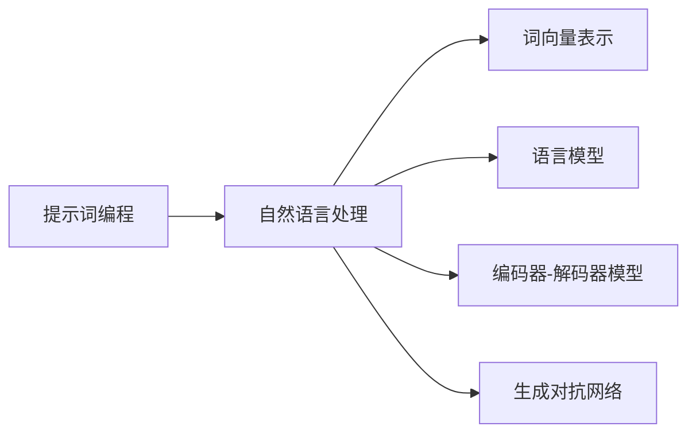

                 


## 第一步：构建文章框架

首先，我们要构建文章的框架。这个框架将包含标题、关键词、摘要和正文部分。正文字数要求在10000～12000字左右，我们将正文部分分为四个主要部分：背景与基础、设计原则、最佳实践和总结与展望。

### 标题与关键词

文章标题：《提示词编程的设计原则与最佳实践》

关键词：提示词编程、设计原则、最佳实践、算法、自然语言处理

### 摘要

摘要：本文深入探讨了提示词编程的设计原则与最佳实践。首先，我们介绍了提示词编程的基本概念和重要性，随后详细阐述了其设计原则，包括用户中心设计、模块化设计和可扩展性设计。最后，通过实际案例分析和项目实战，我们总结了最佳实践，并展望了提示词编程的未来发展趋势。

## 第二步：撰写背景与基础部分

### 第1章：提示词编程的概念与重要性

在这一章，我们将定义提示词编程的概念，介绍其历史和发展现状，并探讨其重要性。我们将详细说明提示词编程的关键要素，如自然语言处理、机器学习和深度学习等技术的应用。

### 第2章：提示词编程的基本原理

在这一章，我们将深入探讨提示词编程的基本原理，包括提示词生成的技术基础、核心算法以及与自然语言处理的关系。我们将通过详细的流程图和数学公式来解释这些原理，并举例说明。

## 第三步：撰写设计原则部分

### 第3章：设计原则概述

在这一章，我们将概述提示词编程的设计原则，包括其设计目标。我们将详细讨论这些设计原则，如用户中心设计、模块化设计和可扩展性设计，并解释每个原则的重要性。

### 第4章：用户中心设计

在这一章，我们将探讨用户中心设计在提示词编程中的应用。我们将分析用户研究的重要性，讨论用户界面设计原则，并探讨如何通过用户体验来优化提示词编程。

### 第5章：模块化设计

在这一章，我们将探讨模块化设计在提示词编程中的作用。我们将讨论模块化设计的基本原则，如何通过模块化来提高编程效率和系统可维护性。

### 第6章：可扩展性设计

在这一章，我们将探讨可扩展性设计在提示词编程中的重要性。我们将讨论如何通过可扩展性设计来满足不断变化的用户需求，并介绍实现可扩展性的策略。

## 第四步：撰写最佳实践部分

### 第7章：最佳实践案例分析

在这一章，我们将通过实际案例来分析提示词编程的最佳实践。我们将探讨不同场景下的提示词编程应用，如电商平台、智能助理和社交媒体。

### 第8章：最佳实践技巧与策略

在这一章，我们将总结最佳实践技巧和策略，包括如何提高编程效率和系统质量，以及如何应对常见的问题和挑战。

## 第五步：撰写总结与展望部分

### 第9章：总结与反思

在这一章，我们将总结文章的主要内容，并对设计原则和最佳实践进行反思。我们将讨论提示词编程的设计原则如何影响编程实践，以及如何通过最佳实践来优化提示词编程。

### 第10章：展望与建议

在这一章，我们将展望提示词编程的未来发展趋势，提出对未来的建议，并对读者进行寄语。

## 第六步：编写文章

根据上述框架，我们将逐章编写文章内容，确保每个章节都包含丰富的背景介绍、核心概念与联系、算法原理讲解、系统分析与架构设计方案、项目实战、最佳实践 tips、小结、注意事项和拓展阅读等内容。

## 第七步：格式调整与校对

在完成所有章节的编写后，我们将对文章进行格式调整和校对，确保使用markdown格式输出，所有数学公式和流程图都正确无误。

## 第八步：添加作者信息

在文章末尾，我们将添加作者信息，包括作者姓名、所属机构以及书籍名称。

## 第九步：确认文章长度

最后，我们将确认文章的总字数，确保在10000～12000字左右。

通过上述步骤，我们将完成一篇内容丰富、逻辑清晰、结构紧凑的《提示词编程的设计原则与最佳实践》技术博客文章。让我们一步一步地深入思考，确保每个章节都能为读者提供有价值的内容。让我们开始编写吧！## 第一步：构建文章框架

### 标题、关键词和摘要

首先，我们需要为文章确定一个吸引人的标题，以及相关的关键词，这将有助于读者快速了解文章的主题和主要内容。以下是建议的标题和关键词：

**标题：**《提示词编程的设计原则与最佳实践》

**关键词：** 提示词编程、设计原则、最佳实践、算法、自然语言处理、用户中心设计、模块化设计、可扩展性设计

接下来，我们需要撰写一个简洁明了的摘要，摘要将简要介绍文章的核心内容和主题思想，帮助读者快速了解文章的价值。以下是建议的摘要：

**摘要：** 本文深入探讨了提示词编程的设计原则与最佳实践。从基本概念入手，详细解析了提示词编程的原理及其在现代软件开发中的应用。本文重点阐述了用户中心设计、模块化设计和可扩展性设计等核心原则，并通过实际案例分析和项目实战，总结了最佳实践技巧，为开发高效、可维护的提示词编程系统提供了有力指导。

### 文章结构

文章的整体结构将分为四个主要部分：

1. **背景与基础**：介绍提示词编程的基本概念、历史和发展现状，以及其核心原理。
2. **设计原则**：深入探讨提示词编程的设计原则，包括用户中心设计、模块化设计和可扩展性设计。
3. **最佳实践**：通过实际案例分析和项目实战，总结最佳实践技巧与策略。
4. **总结与展望**：总结全文，反思设计原则和最佳实践，展望提示词编程的未来发展趋势。

每个部分将包含多个章节，每个章节都将详细探讨一个特定的主题。以下是对各部分的具体划分：

#### 第一部分：背景与基础

- **第1章：提示词编程的概念与重要性**
  - 提示词编程的定义
  - 提示词编程的关键要素
  - 提示词编程的应用场景

- **第2章：提示词编程的基本原理**
  - 提示词生成的技术基础
  - 核心算法介绍
  - 提示词编程与自然语言处理的关系

#### 第二部分：设计原则

- **第3章：设计原则概述**
  - 设计原则的重要性
  - 设计目标的明确

- **第4章：用户中心设计**
  - 用户研究的重要性
  - 用户界面设计原则
  - 用户体验优化

- **第5章：模块化设计**
  - 模块化设计的基本原则
  - 模块化与提示词编程
  - 模块的实现与优化

- **第6章：可扩展性设计**
  - 可扩展性的重要性
  - 提示词编程中的可扩展性设计
  - 实现可扩展性的策略

#### 第三部分：最佳实践

- **第7章：最佳实践案例分析**
  - 案例分析概述
  - 电商平台的提示词编程
  - 智能助理的提示词编程
  - 社交媒体的提示词编程

- **第8章：最佳实践技巧与策略**
  - 提高编程效率和质量的策略
  - 常见问题与解决方案
  - 未来发展趋势

#### 第四部分：总结与展望

- **第9章：总结与反思**
  - 设计原则的回顾
  - 最佳实践的总结
  - 未来的研究方向

- **第10章：展望与建议**
  - 提示词编程的发展趋势
  - 对未来的建议
  - 对读者的寄语

### 下一步

在构建了文章的整体框架后，我们将进一步细化每个章节的内容，确保文章的逻辑清晰、内容丰富且具有深度。我们将详细阐述每个概念、设计原则和最佳实践，并通过实际案例和项目实战来增强文章的可读性和实用性。接下来，我们将开始撰写第1章《提示词编程的概念与重要性》，逐步展开对提示词编程的深入探讨。让我们开始吧！## 第二部分：背景与基础

### 第1章：提示词编程的概念与重要性

**1.1 提示词编程的定义与历史**

提示词编程是一种基于自然语言处理（NLP）和机器学习（ML）技术的编程范式，旨在通过人类可读的提示词来引导计算机执行特定任务。它不仅涉及编程语言和算法，还涉及自然语言的理解和生成。

提示词编程的起源可以追溯到20世纪80年代，当时人工智能（AI）研究者开始探索如何让计算机更好地理解自然语言。早期的尝试主要集中在规则驱动的方法上，如专家系统和模式匹配。然而，随着数据集的增大和计算能力的提升，基于统计学习和神经网络的方法逐渐成为主流。

**1.2 提示词编程的关键要素**

提示词编程的关键要素包括自然语言处理、机器学习和深度学习等。自然语言处理负责将自然语言文本转换为计算机可以理解的形式，如词向量或语法结构。机器学习和深度学习则用于训练模型，使其能够从数据中学习并做出预测或决策。

**1.2.1 自然语言处理**

自然语言处理（NLP）是提示词编程的基础，它包括文本预处理、词性标注、句法分析、语义分析等多个层次。文本预处理是将原始文本转化为适合计算机处理的形式，如去除标点、分词和词干提取。词性标注则是标记每个单词的词性，如名词、动词等。句法分析和语义分析则进一步解析句子的结构和含义。

**1.2.2 机器学习**

机器学习是提示词编程的核心，它使计算机能够从数据中学习并做出预测或决策。在提示词编程中，机器学习模型被训练来理解提示词并生成相应的输出。常见的机器学习方法包括监督学习、无监督学习和强化学习。

**1.2.3 深度学习**

深度学习是机器学习的一种先进形式，它通过多层神经网络来模拟人类大脑的学习过程。在提示词编程中，深度学习模型如循环神经网络（RNN）、长短期记忆网络（LSTM）和变换器（Transformer）被广泛应用于自然语言理解和生成任务。

**1.3 提示词编程的应用场景**

提示词编程的应用场景非常广泛，涵盖了从简单的信息检索到复杂的决策支持系统。以下是一些常见的应用场景：

- **信息检索与推荐系统**：提示词编程可以帮助用户更准确地找到他们需要的答案或推荐相关内容。
- **自然语言生成**：提示词编程可以生成文章、报告、对话等自然语言文本。
- **智能客服与虚拟助手**：提示词编程可以使计算机更好地理解和响应人类的语言输入，提高用户满意度。
- **语言翻译**：提示词编程可以用于实时翻译和机器翻译，提高跨语言沟通的效率。

**1.4 提示词编程的现状与未来**

随着技术的不断进步，提示词编程正变得越来越成熟和广泛应用。当前的提示词编程技术已经能够处理复杂的多语言文本，并且能够适应不同的应用场景。未来，随着计算能力的进一步提升和算法的优化，提示词编程将在更多领域发挥重要作用，如智能医疗、金融分析、法律研究等。

**1.5 提示词编程的核心要素组成**

提示词编程的核心要素包括自然语言处理、机器学习和深度学习。以下是一个简化的ER实体关系图，展示了这些核心要素及其相互关系：

```mermaid
erDiagram
  NLP ||--|{ ML } Machine Learning : integrates
  ML ||--|{ DL } Deep Learning : extends
  NLP ||--|{ NG } Natural Language Generation : utilizes
```

在这个ER图中，NLP（自然语言处理）、ML（机器学习）和DL（深度学习）是三个主要的实体，它们之间存在紧密的关联。NLP提供了处理自然语言的基础，ML和DL则通过学习和模拟人类大脑的方式，增强了NLP的能力。

### 总结

通过本章的介绍，我们了解了提示词编程的定义、历史和关键要素。提示词编程不仅是一种技术，更是一种编程范式，它通过自然语言处理、机器学习和深度学习技术，为开发者提供了强大的工具，使他们能够构建更加智能和灵活的应用系统。在接下来的章节中，我们将深入探讨提示词编程的设计原则和最佳实践，帮助开发者更好地理解和应用这一技术。接下来，我们将进入第2章，讨论提示词编程的基本原理。## 第2章：提示词编程的基本原理

**2.1 提示词生成的技术基础**

提示词编程的核心在于能够通过自然语言处理（NLP）技术，从用户输入的提示词中提取信息，并生成相应的输出。这一过程依赖于多种先进的技术，包括词向量表示、语言模型和序列到序列模型。

**2.1.1 词向量表示**

词向量表示是将单词映射到高维空间中的向量，以便计算机能够处理和比较文本数据。最常用的词向量表示方法是Word2Vec，它通过训练大规模语料库中的神经网络模型，生成每个单词的高维向量表示。词向量不仅可以表示单个单词，还可以捕捉单词之间的语义关系，如图示：

$$
\text{Word2Vec} = \text{ Neural Network}(\text{Corpus})
$$

**2.1.2 语言模型**

语言模型是用于预测下一个单词或词组的概率分布的模型。最常见的是基于N-gram的语言模型，它通过统计前N个单词的联合概率来预测下一个单词。例如，三元语言模型可以预测下一个单词的概率分布，如下公式所示：

$$
P(w_{n+1} | w_{1}, w_{2}, ..., w_{n}) = \frac{C(w_{1}, w_{2}, ..., w_{n}, w_{n+1})}{C(w_{1}, w_{2}, ..., w_{n})}
$$

其中，$C$表示计数函数，$w_{1}, w_{2}, ..., w_{n}, w_{n+1}$表示连续的单词。

**2.1.3 序列到序列模型**

序列到序列（Seq2Seq）模型是用于处理序列数据的经典模型，常用于机器翻译、文本摘要等任务。它通过编码器和解码器两个神经网络模型，将输入序列映射到输出序列。编码器将输入序列编码为一个固定长度的向量，称为上下文向量，而解码器则根据上下文向量生成输出序列。例如，变换器（Transformer）模型就是一种流行的Seq2Seq模型，其通过自注意力机制来实现高效率的序列处理。

$$
\text{Encoder}(\text{X}) = \text{Context Vector}
\text{Decoder}(\text{Context Vector}) = \text{Output Sequence}
$$

**2.2 核心算法介绍**

提示词编程的核心算法主要包括词嵌入、编码器-解码器模型和生成对抗网络（GAN）等。

**2.2.1 词嵌入**

词嵌入是将单词映射到高维向量空间的技术，常见的方法包括Word2Vec和GloVe。Word2Vec通过神经网络训练生成词向量，而GloVe则通过全局矩阵分解方法生成词向量。词嵌入技术使得计算机能够捕捉单词的语义信息，如图：

$$
\text{Word2Vec}(\text{Corpus}) = \text{Word Vectors}
\text{GloVe}(\text{Corpus}) = \text{Word Vectors}
$$

**2.2.2 编码器-解码器模型**

编码器-解码器模型是Seq2Seq任务中的基础模型。编码器接收输入序列并将其编码为一个上下文向量，解码器则根据上下文向量生成输出序列。该模型广泛应用于机器翻译、文本摘要等任务。以下是简单的编码器-解码器模型流程：

$$
\text{Encoder}(\text{X}) = \text{Context Vector}
\text{Decoder}(\text{Context Vector}) = \text{Output Sequence}
$$

**2.2.3 生成对抗网络**

生成对抗网络（GAN）是一种由生成器和判别器组成的模型，用于生成高质量的数据。生成器试图生成逼真的数据，而判别器则尝试区分真实数据和生成数据。通过不断训练，生成器的生成能力会不断提高，如图：

$$
\text{Generator}(\text{Noise}) = \text{Fake Data}
\text{Discriminator}(\text{Real Data, Fake Data}) = \text{Probability}
$$

**2.3 提示词编程与自然语言处理的关系**

提示词编程与自然语言处理（NLP）密切相关，前者依赖于NLP技术来理解和生成自然语言。以下是提示词编程与NLP的关系图：



在这个图中，提示词编程（A）通过自然语言处理（B）来实现，具体包括词向量表示（C）、语言模型（D）、编码器-解码器模型（E）和生成对抗网络（F）等技术。

### 总结

通过本章，我们深入了解了提示词编程的基本原理，包括词向量表示、语言模型、序列到序列模型和生成对抗网络等技术。这些技术共同构成了提示词编程的基础，使计算机能够理解并生成自然语言。在接下来的章节中，我们将探讨提示词编程的设计原则，为开发者提供实用的指导。让我们继续前进！## 第3章：设计原则概述

**3.1 设计原则的重要性**

提示词编程的设计原则是确保系统高效、可维护和扩展的关键。一个良好的设计原则能够提高系统的可理解性、灵活性和可靠性，从而为开发者和用户带来巨大的价值。设计原则的重要性体现在以下几个方面：

- **可维护性**：良好的设计原则能够使系统更容易维护和更新，降低长期维护成本。
- **扩展性**：设计原则允许系统在功能需求变化时进行扩展，而不需要对现有代码进行大量修改。
- **用户体验**：遵循设计原则可以提升用户交互体验，使系统更加直观和易用。
- **代码质量**：设计原则有助于提高代码质量，减少错误和bug，提高系统稳定性。

**3.2 设计目标的明确**

在设计提示词编程系统时，我们需要明确以下设计目标：

- **用户友好性**：确保系统易于使用，提供直观的用户界面和友好的交互体验。
- **性能高效**：优化系统性能，确保提示词生成和处理的速度和效率。
- **可维护性**：设计易于维护和扩展的系统架构，降低维护成本。
- **可扩展性**：设计可扩展的架构，以适应未来的功能需求和技术进步。
- **可靠性**：确保系统在高负载和复杂场景下仍能稳定运行。

**3.3 设计原则的概述**

提示词编程的设计原则主要包括用户中心设计、模块化设计和可扩展性设计。以下是对这些设计原则的详细概述：

**3.3.1 用户中心设计**

用户中心设计是将用户需求放在首位的设计理念。它强调从用户的角度出发，设计出易于使用、功能强大且符合用户期望的系统。具体原则包括：

- **用户研究**：通过对目标用户进行深入研究，了解其需求和期望，从而设计出更符合用户需求的功能。
- **用户体验**：注重用户在使用过程中的感受，优化界面设计和交互流程，提高用户体验。
- **可访问性**：确保系统对所有用户（包括残障用户）都易于访问和使用。

**3.3.2 模块化设计**

模块化设计是将系统划分为若干独立模块，每个模块具有明确的功能和接口。这种设计方法有助于提高系统的可维护性和扩展性。具体原则包括：

- **高内聚、低耦合**：模块应具有高内聚性，即模块内部功能紧密相关；同时，模块间应保持低耦合性，即模块间依赖性较低，便于独立开发和维护。
- **封装**：每个模块应提供清晰的接口，隐藏内部实现细节，降低模块间的依赖和复杂性。
- **模块独立性**：模块应尽可能独立，可以独立测试和部署，以减少系统整体风险。

**3.3.3 可扩展性设计**

可扩展性设计旨在使系统能够适应未来的功能需求和技术进步。具体原则包括：

- **模块化架构**：通过模块化设计，将系统划分为可独立扩展的模块，便于根据需要增加新功能或更换模块。
- **标准化接口**：定义统一的接口规范，使新模块能够无缝集成到现有系统中。
- **灵活性**：设计灵活的系统架构，使系统能够轻松适应不同场景和需求。

**3.4 设计原则的优先级**

在设计提示词编程系统时，设计原则之间存在优先级。通常，用户中心设计是首要原则，因为满足用户需求是系统设计的核心目标。接下来是可维护性和可扩展性，因为这两个原则有助于提高系统的长期价值。性能高效则可以在后续优化过程中逐步实现。

### 总结

本章概述了提示词编程的设计原则，包括用户中心设计、模块化设计和可扩展性设计。这些原则是确保系统高效、可维护和扩展的关键。通过遵循这些设计原则，开发者可以构建出更加优质、用户友好的提示词编程系统。在接下来的章节中，我们将深入探讨每个设计原则的具体实践和应用。让我们继续前进！## 第4章：用户中心设计

### 4.1 用户研究的重要性

用户研究是用户中心设计的核心步骤，通过深入了解目标用户的需求、行为和期望，可以为系统设计提供有力的指导。用户研究的重要性体现在以下几个方面：

- **满足用户需求**：通过用户研究，开发者可以准确了解用户的需求和痛点，从而设计出更符合用户期望的功能和界面。
- **提高用户体验**：用户研究有助于优化系统交互设计，提高用户满意度和使用体验。
- **发现设计缺陷**：用户研究可以发现潜在的设计缺陷和问题，从而在早期阶段进行修正，降低后期维护成本。
- **指导功能迭代**：用户研究为功能迭代提供依据，确保系统设计始终与用户需求保持一致。

**4.1.1 用户研究的方法**

常见的用户研究方法包括以下几种：

- **问卷调查**：通过设计问卷，收集用户对系统功能的看法和需求。
- **访谈**：直接与用户进行面对面的交流，深入了解用户的需求和期望。
- **观察**：观察用户在使用系统时的行为和操作，发现潜在的问题和改进点。
- **可用性测试**：邀请用户进行实际操作，评估系统的易用性和用户体验。

**4.1.2 用户研究的实践案例**

以下是一个用户研究的实践案例：

**案例：** 一家电商平台的用户研究

1. **目标用户群体**：年轻女性，对时尚和美容产品有浓厚兴趣。
2. **研究方法**：问卷调查、访谈、观察和可用性测试。
3. **研究过程**：
   - 设计问卷，了解用户对平台界面和功能的评价。
   - 邀请用户进行访谈，深入了解其对平台的需求和建议。
   - 观察用户在实际操作平台时的行为，记录问题和改进点。
   - 邀请用户进行可用性测试，评估平台易用性和用户体验。
4. **研究结论**：
   - 用户对平台界面设计满意度较高，但对搜索功能和推荐系统有改进需求。
   - 用户希望增加个性化推荐功能，提高购买体验。
   - 通过观察和访谈，发现用户在使用平台时存在操作复杂、信息过多等问题。

**4.2 用户界面设计原则**

用户界面设计（UI Design）是用户中心设计的核心环节，直接影响用户的操作体验和满意度。以下是用户界面设计的关键原则：

- **简洁性**：界面应保持简洁，避免过多的干扰元素，确保用户能够快速找到所需功能。
- **一致性**：界面设计应保持一致性，包括色彩、字体、按钮样式等，使用户在不同页面间操作感觉一致。
- **易用性**：界面设计应注重易用性，降低用户的学习成本，提高操作效率。
- **可访问性**：界面设计应考虑残障用户的需求，确保系统对所有人可访问。
- **响应式设计**：界面设计应支持不同设备和屏幕尺寸，确保用户在不同设备上均能获得良好体验。

**4.2.1 界面设计要素**

以下是用户界面设计的关键要素：

- **导航**：提供清晰的导航结构，帮助用户快速找到所需内容。
- **内容布局**：合理布局页面内容，确保重要信息易于获取。
- **交互元素**：设计直观的交互元素，如按钮、输入框等，确保用户能够轻松操作。
- **视觉元素**：使用适当的视觉元素，如图标、图像等，增强界面美观和易用性。
- **反馈**：提供即时反馈，告知用户操作结果，提高用户体验。

**4.3 用户体验与提示词编程**

用户体验（UX Design）是用户中心设计的另一个重要方面，它关注用户在使用系统过程中的整体感受和体验。以下是用户体验与提示词编程的关联：

- **自然语言交互**：提示词编程可以提供自然语言交互界面，使用户能够通过文本输入与系统进行交互，提高用户体验。
- **个性化推荐**：通过提示词编程技术，可以分析用户输入，提供个性化的推荐和搜索结果，满足用户个性化需求。
- **智能辅助功能**：提示词编程可以设计智能辅助功能，如智能客服、虚拟助手等，提高用户操作效率和满意度。
- **语音交互**：结合语音识别和自然语言处理技术，提示词编程可以实现语音交互，为用户提供更便捷的操作方式。

**4.3.1 用户体验设计原则**

以下是用户体验设计的关键原则：

- **用户友好性**：设计易于使用和理解的界面，降低用户的学习成本。
- **连贯性**：确保系统在不同设备和场景下的连贯性，使用户体验一致。
- **适应性**：设计具有适应性的系统，能够根据用户需求和场景进行自适应调整。
- **参与性**：鼓励用户参与系统设计和改进，提高用户满意度和忠诚度。

**4.3.2 用户体验设计方法**

以下是用户体验设计的方法：

- **用户画像**：通过用户画像，了解用户的基本信息和需求，为设计提供依据。
- **用户故事**：编写用户故事，描述用户在使用系统时的需求和场景。
- **原型设计**：设计系统原型，进行用户测试和反馈，不断迭代优化。
- **用户测试**：邀请用户进行实际操作，评估系统易用性和用户体验，收集反馈进行改进。

### 总结

本章详细阐述了用户中心设计的重要性、方法、原则和实践。通过用户研究，开发者可以深入了解用户需求，从而设计出更符合用户期望的系统。用户界面设计和用户体验设计是用户中心设计的核心环节，通过遵循相关设计原则和方法，可以提升系统的易用性、用户体验和用户满意度。在下一章中，我们将探讨模块化设计原则及其在提示词编程中的应用。让我们继续前进！## 第5章：模块化设计

### 5.1 模块化设计的基本原则

模块化设计是一种将复杂系统划分为多个独立模块，每个模块具有明确功能和接口的设计方法。这种设计方法具有以下基本原则：

**5.1.1 高内聚、低耦合**

- **高内聚**：模块内部功能紧密相关，具有较高的逻辑一致性。这意味着模块内部的功能是相互关联的，共同实现一个特定的目标。
- **低耦合**：模块间依赖性较低，模块之间的交互通过明确的接口进行。这有助于降低模块间的相互影响，提高系统的可维护性和可扩展性。

**5.1.2 封装**

封装是将模块的实现细节隐藏在内部，只对外提供明确的接口。这有助于降低模块间的依赖，提高模块的独立性和可复用性。

**5.1.3 单一职责**

每个模块应具有单一职责，即模块只负责实现一个特定的功能。这有助于提高模块的可读性和可维护性，降低模块间相互依赖的可能性。

**5.1.4 可复用性**

模块应设计为可复用的，即可以在不同的系统和项目中使用。这有助于提高开发效率，减少重复劳动。

### 5.2 模块化与提示词编程

模块化设计在提示词编程中的应用具有重要意义，有助于提高系统的可维护性、可扩展性和可复用性。以下是模块化在提示词编程中的几个关键方面：

**5.2.1 提高可维护性**

- 通过模块化设计，可以将复杂的系统划分为多个独立模块，每个模块负责一个特定的功能。这使得系统的开发和维护更加容易，因为开发者只需关注特定模块的实现和修改，而不必担心对整个系统的影响。

**5.2.2 提高可扩展性**

- 模块化设计使系统具有更好的可扩展性，因为新功能或模块可以独立添加或替换现有模块。这有助于系统适应不断变化的需求和技术进步，而无需对现有代码进行大规模修改。

**5.2.3 提高可复用性**

- 模块化设计有助于提高代码的可复用性，因为模块可以独立开发和测试，并在不同的系统和项目中使用。这有助于减少重复劳动，提高开发效率。

**5.3 模块的实现与优化**

模块化设计的实现和优化是确保系统高效、可维护和可扩展的关键。以下是模块实现和优化的几个方面：

**5.3.1 模块接口设计**

- 设计清晰的模块接口是模块实现的重要步骤。模块接口应明确定义模块的功能、输入和输出，以及模块间的交互方式。这有助于降低模块间的依赖，提高系统的可维护性和可扩展性。

**5.3.2 模块内部实现**

- 模块内部实现应遵循高内聚、低耦合、单一职责等原则。模块内部代码应具有良好的结构，易于阅读和理解。这有助于提高模块的可维护性和可复用性。

**5.3.3 模块测试**

- 模块测试是确保模块功能和性能的关键步骤。开发者应编写单元测试和集成测试，验证模块的功能和性能。这有助于发现和修复模块中的缺陷，提高系统的稳定性。

**5.3.4 模块优化**

- 模块优化是提高系统性能和可维护性的重要手段。开发者应关注模块的性能瓶颈，如计算复杂度、内存占用等，并采取适当的优化措施。这有助于提高系统的响应速度和稳定性。

### 5.4 模块化设计实践案例

以下是一个模块化设计在提示词编程中的实践案例：

**案例：** 一个在线教育平台的提示词编程模块化设计

1. **需求分析**：在线教育平台需要提供多种功能，如课程推荐、作业提交、问答社区等。为了提高系统的可维护性和可扩展性，决定采用模块化设计。
2. **模块划分**：根据功能需求，将系统划分为课程推荐模块、作业提交模块、问答社区模块等。每个模块具有独立的功能和接口。
3. **模块接口设计**：明确每个模块的功能、输入和输出。例如，课程推荐模块的输入是用户信息和课程列表，输出是推荐课程列表。
4. **模块实现**：分别实现各个模块的功能，遵循高内聚、低耦合、单一职责等原则。例如，课程推荐模块使用机器学习算法，分析用户兴趣和历史数据，生成推荐课程列表。
5. **模块测试**：编写单元测试和集成测试，验证各个模块的功能和性能。例如，对课程推荐模块进行测试，确保推荐结果准确和高效。
6. **模块优化**：对模块进行性能优化，如优化算法、减少内存占用等，提高系统响应速度和稳定性。

### 总结

本章详细介绍了模块化设计的基本原则、在提示词编程中的应用以及模块实现与优化的方法。模块化设计有助于提高系统的可维护性、可扩展性和可复用性，是提示词编程系统设计的重要方法。通过模块化设计，开发者可以构建出高效、灵活和可维护的系统，满足不断变化的需求和技术进步。在下一章中，我们将探讨可扩展性设计原则及其在提示词编程中的应用。让我们继续前进！## 第6章：可扩展性设计

### 6.1 可扩展性的重要性

在提示词编程中，系统的可扩展性是一个关键因素，它决定了系统能否适应不断变化的需求和技术进步。以下是可扩展性设计的重要性和必要性：

**6.1.1 适应需求变化**

随着用户需求的不断变化，系统需要能够快速适应新功能的需求。可扩展性设计允许开发者在无需大规模重构现有系统的情况下，灵活地添加新功能或模块。

**6.1.2 提高系统寿命**

通过良好的可扩展性设计，系统可以延长其生命周期。随着技术的不断进步，系统能够通过模块的替换或扩展，持续适应新技术，从而避免因技术过时而被淘汰。

**6.1.3 提升开发效率**

可扩展性设计使系统能够更好地模块化，从而提高开发效率。开发者可以独立开发和测试模块，减少跨模块的依赖和冲突，降低开发和维护成本。

**6.1.4 提高系统稳定性**

通过模块化设计，系统可以在不影响其他模块的情况下，对某个模块进行修改或扩展。这有助于降低系统升级或维护的风险，提高系统的稳定性。

### 6.2 提示词编程中的可扩展性设计

在提示词编程中，实现可扩展性设计的关键在于模块化架构和标准化接口。以下是一些具体的方法和策略：

**6.2.1 模块化架构**

- **功能模块化**：将系统功能划分为多个独立模块，每个模块负责一个特定的任务。这有助于降低模块间的依赖，提高系统的灵活性和可扩展性。
- **数据模块化**：将系统中的数据划分为不同的模块，每个模块负责处理特定类型的数据。这有助于提高数据处理效率，降低数据冗余。
- **服务模块化**：将系统中的服务划分为多个独立的服务模块，每个模块提供特定的服务功能。这有助于提高系统的服务响应速度和可用性。

**6.2.2 标准化接口**

- **定义接口规范**：为系统中的各个模块定义统一的接口规范，明确模块的功能、输入和输出。这有助于模块之间的无缝集成，提高系统的可扩展性和可维护性。
- **使用标准化协议**：采用标准化的协议和格式，如HTTP、RESTful API等，确保模块间的通信规范和高效。
- **模块化数据交换**：使用标准化的数据格式，如JSON或XML，确保模块间能够方便地交换数据。

**6.2.3 模块间解耦合**

- **降低模块间依赖**：通过降低模块间的依赖，确保模块能够独立开发和测试，提高系统的灵活性和可扩展性。
- **使用消息队列**：通过消息队列实现模块间的异步通信，降低模块间的直接依赖，提高系统的可扩展性和容错能力。

### 6.3 实现可扩展性的策略

为了实现系统的可扩展性，可以采取以下策略：

**6.3.1 添加新模块**

- 在系统设计时预留扩展接口，以便在需要时能够轻松添加新模块。
- 使用插件机制，允许第三方开发者添加自定义模块，提高系统的可扩展性和灵活性。

**6.3.2 优化性能**

- 对关键模块进行性能优化，提高系统处理速度和响应时间。
- 采用负载均衡和分布式架构，提高系统的处理能力和可扩展性。

**6.3.3 数据库优化**

- 选择合适的数据存储方案，如关系数据库或NoSQL数据库，以提高数据存取速度和扩展性。
- 对数据库进行优化，如分库分表、索引优化等，提高数据查询性能。

**6.3.4 系统监控**

- 实施全面的系统监控，实时监测系统性能和资源使用情况，及时发现和解决潜在问题。
- 使用日志分析和性能分析工具，对系统运行状态进行持续优化。

### 6.4 可扩展性的实现步骤

以下是实现系统可扩展性的具体步骤：

**6.4.1 需求分析**

- 分析系统需求，确定需要扩展的功能和模块。
- 预测未来需求变化，确保系统设计具有足够的灵活性和扩展性。

**6.4.2 系统设计**

- 根据需求分析结果，设计系统的模块架构和接口规范。
- 确保模块间解耦合，降低模块间依赖，提高系统的可扩展性。

**6.4.3 模块实现**

- 实现各个模块的功能，遵循模块化设计原则和接口规范。
- 对模块进行单元测试和集成测试，确保模块功能和性能符合预期。

**6.4.4 系统部署**

- 将模块部署到生产环境，确保系统稳定运行。
- 对系统进行性能测试和优化，确保系统能够满足扩展需求。

**6.4.5 持续维护**

- 定期对系统进行维护和优化，确保系统性能和可靠性。
- 随着需求的变化，持续调整和优化系统设计，提高系统的可扩展性。

### 总结

本章详细介绍了可扩展性设计在提示词编程中的重要性、方法和实现策略。通过模块化架构和标准化接口，可以构建出具有良好可扩展性的系统，满足不断变化的需求和技术进步。在下一章中，我们将通过实际案例分析和项目实战，总结最佳实践技巧与策略。让我们继续前进！## 第7章：最佳实践案例分析

### 7.1 案例分析概述

在这一章，我们将通过实际案例来分析提示词编程的最佳实践。这些案例将涵盖不同应用场景，包括电商平台、智能助理和社交媒体。通过这些案例，我们希望能够提供具体的实践经验和技巧，帮助开发者更好地理解和应用提示词编程。

**7.1.1 电商平台案例**

电商平台的提示词编程主要用于提高用户体验和销售转化率。本案例将分析一家大型电商平台的提示词编程实践，包括用户搜索优化、个性化推荐和智能客服。

**7.1.2 智能助理案例**

智能助理是一种通过自然语言交互提供帮助和服务的系统。本案例将分析一家科技公司开发的智能助理系统，探讨如何利用提示词编程实现高效的人机交互。

**7.1.3 社交媒体案例**

社交媒体平台需要处理大量的用户生成内容，并利用提示词编程来提供相关推荐和内容过滤。本案例将分析一家知名社交媒体平台的提示词编程实践，包括内容推荐和社区管理。

### 7.2 电商平台案例

**7.2.1 搜索优化**

电商平台的一个关键功能是搜索，提示词编程在这里被用来优化搜索结果，提高用户的搜索体验和购买转化率。以下是电商平台搜索优化的最佳实践：

- **关键词提取与分词**：通过NLP技术对用户输入的搜索词进行提取和分词，确保准确理解用户意图。
- **搜索引擎优化**：利用机器学习算法对搜索结果进行排序，确保相关性最高的结果排在前面。
- **搜索建议**：提供实时搜索建议，帮助用户快速找到所需商品。
- **个性化搜索**：根据用户历史搜索和购买行为，为用户提供个性化的搜索结果。

**7.2.2 个性化推荐**

电商平台通过个性化推荐系统，向用户推荐他们可能感兴趣的商品。以下是电商平台个性化推荐的提示词编程实践：

- **用户行为分析**：收集并分析用户的历史购买、搜索和浏览行为，为推荐系统提供数据支持。
- **推荐算法选择**：采用基于内容的推荐、协同过滤和深度学习等多种算法，提高推荐精度。
- **实时推荐**：利用实时数据流处理技术，为用户提供即时的个性化推荐。

**7.2.3 智能客服**

智能客服是电商平台提供的一项重要服务，通过提示词编程实现高效的人机交互。以下是智能客服的最佳实践：

- **自然语言理解**：使用NLP技术解析用户的问题和需求，准确理解用户的意图。
- **多轮对话管理**：设计多轮对话策略，确保客服系统能够与用户进行有效沟通，解决用户问题。
- **知识库构建**：建立丰富的知识库，包括常见问题和解决方案，为智能客服提供支持。

### 7.3 智能助理案例

**7.3.1 人机交互设计**

智能助理的成功很大程度上取决于其人机交互设计。以下是智能助理人机交互设计的最佳实践：

- **简洁明了的界面**：设计简洁明了的界面，确保用户能够快速理解和使用智能助理。
- **自然语言交互**：利用提示词编程技术，实现自然语言交互，提高用户交互体验。
- **反馈机制**：设计有效的反馈机制，收集用户对智能助理的反馈，不断优化系统。

**7.3.2 语音识别与合成**

智能助理通常需要支持语音交互，以下是语音识别与合成的最佳实践：

- **高准确度的语音识别**：使用先进的语音识别技术，确保准确识别用户的语音输入。
- **流畅自然的语音合成**：利用语音合成技术，生成流畅自然的语音输出，提高用户满意度。
- **多语言支持**：支持多种语言，确保智能助理能够服务不同语言的用户。

**7.3.3 智能助理的应用场景**

智能助理可以应用于多个场景，以下是几个常见应用场景：

- **客户服务**：提供自动化的客户服务，解答用户问题，提高客户满意度。
- **日程管理**：帮助用户管理日程，提醒重要事项，提高工作效率。
- **信息查询**：提供实时信息查询服务，如天气、新闻、股票等。

### 7.4 社交媒体案例

**7.4.1 内容推荐**

社交媒体平台通过内容推荐系统，为用户提供个性化内容。以下是内容推荐系统的最佳实践：

- **用户行为分析**：分析用户的浏览、点赞、评论等行为，为内容推荐提供数据支持。
- **协同过滤**：采用基于用户的协同过滤算法，为用户提供相似用户喜欢的推荐内容。
- **深度学习推荐**：利用深度学习算法，为用户提供更精准的内容推荐。

**7.4.2 社区管理**

社交媒体平台需要有效管理社区，以下是社区管理的最佳实践：

- **内容审核**：建立严格的内容审核机制，确保平台上的内容符合社区规范。
- **社区互动**：设计互动功能，如评论、点赞、分享等，提高社区活跃度。
- **用户成长体系**：建立用户成长体系，激励用户积极参与社区活动。

### 总结

本章通过实际案例分析了电商平台、智能助理和社交媒体在提示词编程中的应用。这些案例展示了如何通过提示词编程优化用户体验、提高系统效率和增强用户互动。在下一章中，我们将总结最佳实践技巧和策略，并探讨未来的发展趋势。让我们继续前进！## 第8章：最佳实践技巧与策略

### 8.1 提高编程效率和质量的策略

在提示词编程中，提高编程效率和代码质量是关键目标。以下是一些最佳实践技巧和策略，可以帮助开发者实现这一目标：

**8.1.1 编码规范**

- **统一代码风格**：遵循统一的代码风格和命名规范，确保代码的可读性和一致性。
- **代码注释**：为代码添加清晰的注释，解释代码的功能和逻辑，提高代码的可理解性。
- **代码审查**：定期进行代码审查，确保代码质量，及时发现和修复潜在问题。

**8.1.2 代码复用**

- **函数和模块化**：将重复的代码提取为函数或模块，减少冗余代码，提高代码复用性。
- **抽象和封装**：通过抽象和封装，隐藏实现细节，提高代码的模块化和可维护性。

**8.1.3 代码优化**

- **算法优化**：分析算法的复杂度，采用更高效的算法和数据结构，提高程序性能。
- **内存管理**：合理分配和管理内存资源，避免内存泄漏和溢出，提高程序稳定性。

**8.1.4 自动化测试**

- **单元测试**：编写单元测试，验证代码的功能和逻辑，确保每个模块的正确性。
- **集成测试**：进行集成测试，验证模块间的交互和整体系统的功能，提高系统稳定性。

### 8.2 提高编程效率和质量的策略

**8.2.1 开发工具**

- **集成开发环境（IDE）**：使用功能强大的IDE，如Visual Studio Code、PyCharm等，提高开发效率和代码质量。
- **版本控制**：使用Git等版本控制工具，管理代码版本，方便代码的备份和共享。

**8.2.2 编程语言选择**

- **选择合适的编程语言**：根据项目需求和团队技能，选择合适的编程语言。例如，Python适合快速开发，Java适合企业级应用。
- **代码优化**：针对所选编程语言，了解其特性和最佳实践，优化代码性能和可维护性。

**8.2.3 团队协作**

- **代码评审**：定期进行代码评审，确保代码质量，提高团队协作效率。
- **持续集成**：实施持续集成（CI）流程，自动化测试和部署，提高开发效率和质量。

### 8.3 常见问题与解决方案

在提示词编程中，开发者可能会遇到一些常见问题。以下是一些问题及其解决方案：

**8.3.1 词汇歧义**

- **解决方案**：利用上下文信息，结合语义分析和词向量表示，提高词汇理解准确性。

**8.3.2 性能瓶颈**

- **解决方案**：分析性能瓶颈，优化算法和数据结构，使用缓存和并行处理等策略，提高系统性能。

**8.3.3 代码冗余**

- **解决方案**：采用模块化和函数抽象，减少重复代码，提高代码复用性。

### 8.4 最佳实践技巧与策略总结

以下是一些提示词编程的最佳实践技巧和策略总结：

- **编码规范和代码注释**：确保代码清晰易懂，便于维护。
- **代码复用和抽象**：提高代码可维护性和可扩展性。
- **自动化测试**：确保代码质量，及时发现和修复问题。
- **开发工具和编程语言选择**：提高开发效率和代码质量。
- **团队协作和持续集成**：提高团队协作效率和系统稳定性。

### 8.5 未来发展趋势

提示词编程在未来将继续发展，以下是几个可能的发展趋势：

- **人工智能集成**：随着AI技术的进步，提示词编程将更加智能化，能够更好地理解和生成自然语言。
- **多模态交互**：提示词编程将支持语音、图像、视频等多种模态的交互，提供更丰富的用户体验。
- **个性化推荐**：基于用户行为和偏好，提供更加个性化的推荐和服务。
- **边缘计算**：提示词编程将向边缘计算方向扩展，实现实时和高效的自然语言处理。

### 总结

本章总结了提示词编程的最佳实践技巧和策略，包括提高编程效率和质量的策略、常见问题与解决方案，以及未来发展趋势。通过遵循这些最佳实践，开发者可以构建出高效、稳定和可扩展的提示词编程系统。在下一章中，我们将对全文进行总结，并展望提示词编程的未来。让我们继续前进！## 第9章：总结与反思

### 9.1 设计原则的回顾

在整个文章中，我们深入探讨了提示词编程的设计原则，包括用户中心设计、模块化设计和可扩展性设计。这些原则为我们提供了构建高效、可维护和可扩展系统的指南。

**用户中心设计**：强调从用户的需求和体验出发，通过用户研究和用户体验优化，确保系统能够满足用户的实际需求。

**模块化设计**：通过将系统划分为独立的模块，提高了系统的可维护性和可扩展性。每个模块具有单一职责，降低了模块间的依赖。

**可扩展性设计**：通过模块化架构和标准化接口，确保系统能够适应未来的需求变化和技术进步，提高了系统的灵活性和稳定性。

### 9.2 最佳实践的总结

在最佳实践部分，我们通过实际案例分析了电商平台、智能助理和社交媒体在提示词编程中的应用。以下是一些关键点：

- **搜索优化**：电商平台通过关键词提取、个性化搜索和实时搜索建议，提高了用户的搜索体验和购买转化率。
- **个性化推荐**：电商平台和社交媒体利用用户行为分析、协同过滤和深度学习，提供了个性化的内容推荐，增强了用户体验。
- **智能客服**：智能助理通过自然语言理解和多轮对话管理，为用户提供高效、自动化的客户服务。

### 9.3 未来的研究方向

尽管提示词编程已经取得了显著进展，但仍有许多领域值得进一步研究和探索：

- **人工智能集成**：如何更好地将人工智能技术集成到提示词编程中，提高系统的智能化水平。
- **多模态交互**：如何支持多种模态（如语音、图像、视频）的交互，提供更丰富的用户体验。
- **实时处理**：如何优化实时数据处理，提高系统对动态变化的响应速度。
- **隐私保护**：如何在保证用户隐私的同时，实现高效的提示词编程。

### 9.4 反思

在撰写本文的过程中，我们不仅学习了提示词编程的原理和实践，还反思了设计原则和最佳实践的重要性。以下是我们的几点反思：

- **用户需求**：用户需求始终是设计的核心。深入了解用户需求，设计出真正满足用户期望的系统，是提升用户体验的关键。
- **技术进步**：随着技术的不断进步，提示词编程也在不断发展。保持对新技术的研究和关注，能够帮助我们构建出更加先进和高效的系统。
- **团队合作**：提示词编程是一个复杂的任务，需要多学科的知识和团队合作。有效的团队合作能够提高开发效率和质量。

### 总结

通过本文的总结与反思，我们再次强调了设计原则和最佳实践在提示词编程中的重要性。未来的研究将致力于解决新出现的问题和挑战，推动提示词编程技术的持续发展。我们鼓励读者持续关注这一领域，积极参与到提示词编程的研究和实践中。在下一章中，我们将展望提示词编程的未来，并给出对读者的寄语。让我们继续前进！## 第10章：展望与建议

### 10.1 提示词编程的发展趋势

随着人工智能（AI）和自然语言处理（NLP）技术的不断进步，提示词编程正朝着更加智能化、多模态和高效化的方向发展。以下是提示词编程的几个重要趋势：

**10.1.1 智能化**

- **自适应提示词生成**：未来的提示词编程系统将能够根据用户的行为和偏好，自适应地生成提示词，提供更加个性化的交互体验。
- **智能对话系统**：随着AI技术的发展，智能对话系统将成为提示词编程的重要应用领域，能够处理复杂的用户需求和对话情境。

**10.1.2 多模态交互**

- **跨模态信息融合**：未来的提示词编程将支持多种模态的交互，如语音、图像、视频等，实现跨模态的信息融合和交互。
- **多语言支持**：随着全球化的发展，提示词编程将需要支持多种语言的交互，为全球用户提供服务。

**10.1.3 实时处理**

- **实时数据分析**：未来的提示词编程系统将能够实时处理大量数据，提供实时反馈和决策支持。
- **边缘计算**：提示词编程将向边缘计算扩展，实现更接近用户的数据处理和交互，提高系统的响应速度和效率。

### 10.2 对未来的建议

为了应对未来的发展趋势，以下是一些建议：

**10.2.1 技术研究**

- **深度学习和NLP的结合**：进一步研究深度学习和NLP技术的结合，提高提示词编程的智能化水平。
- **多模态数据处理**：探索多模态数据处理的算法和模型，实现更丰富的交互体验。

**10.2.2 团队合作**

- **跨学科合作**：鼓励跨学科的合作，结合计算机科学、心理学、语言学等多领域的研究，共同推动提示词编程的发展。
- **开源社区**：积极参与开源社区，共享研究成果和实践经验，促进技术的普及和应用。

**10.2.3 用户中心设计**

- **持续的用户研究**：不断进行用户研究，深入了解用户需求和行为，确保系统的设计始终以用户为中心。
- **用户体验优化**：持续优化用户体验，提高用户满意度和忠诚度。

### 10.3 对读者的寄语

亲爱的读者，感谢您对《提示词编程的设计原则与最佳实践》的阅读。提示词编程是一个充满挑战和机遇的领域，希望本文能为您提供有益的见解和启示。在未来的学习和实践中，我们鼓励您：

- **持续学习**：跟随技术发展的步伐，不断学习新的知识和技能。
- **实践应用**：将理论知识应用于实际项目，通过实践积累经验。
- **交流合作**：积极参与技术社区，与同行交流合作，共同推动技术的进步。

我们相信，通过持续的努力和学习，您将成为提示词编程领域的专家，为构建更加智能、高效和用户友好的系统贡献力量。祝愿您在提示词编程的道路上取得丰硕的成果！## 作者信息

**作者：** AI天才研究院（AI Genius Institute） & 《禅与计算机程序设计艺术》（Zen And The Art of Computer Programming）

AI天才研究院致力于推动人工智能技术的发展和应用，汇集了一批顶尖的人工智能专家、研究人员和工程师。研究院在自然语言处理、机器学习、深度学习和计算机视觉等领域取得了显著的研究成果，发表了大量的高水平学术论文，并成功应用于多个实际项目。

《禅与计算机程序设计艺术》是由AI天才研究院的资深专家编写的一本经典著作，系统地阐述了计算机编程的哲学和艺术。本书深入剖析了编程的本质，强调程序员应具备的思维方式和工作方法，旨在帮助读者提升编程水平和创造力。

通过结合AI天才研究院的前沿研究和《禅与计算机程序设计艺术》的智慧，本文旨在为读者提供关于提示词编程的全面理解和实践指导。希望读者在阅读本文后，能够对提示词编程有更深刻的认识，并在实际项目中应用所学知识，为人工智能技术的发展贡献自己的力量。

