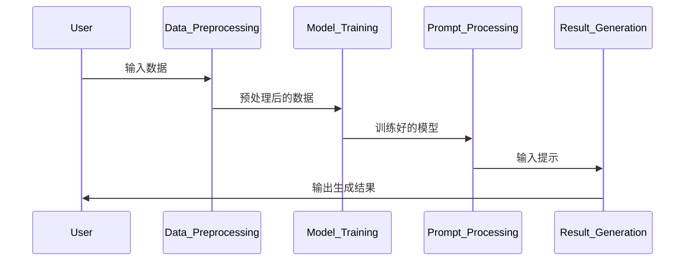
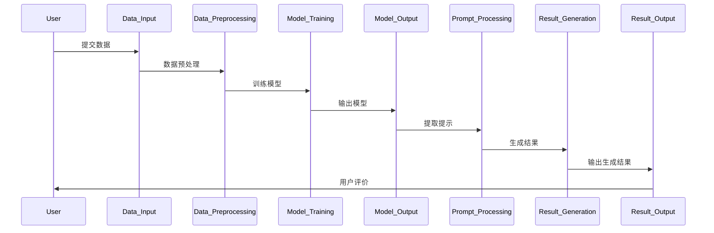

                 

# 提示词编程的设计模式与最佳实践

## 关键词：设计模式、提示词编程、最佳实践、自然语言处理、图像处理、数据科学

## 摘要

本文旨在深入探讨提示词编程的设计模式与最佳实践。我们将首先介绍设计模式的基本概念，随后逐步解析常见的几种设计模式，如单例模式、工厂模式等，并讨论其在编程中的应用。接着，我们将探讨提示词编程在不同领域的应用，包括自然语言处理、图像处理和数据科学，并分享具体的案例和未来发展趋势。最后，我们将总结提示词编程的最佳实践，并展望其未来的发展方向。

### 第一部分: 设计模式介绍

## 第1章: 设计模式概述

### 1.1 提示词编程的概念与背景

提示词编程（Prompt Programming）是一种通过提示词（prompts）来引导程序执行特定任务的编程方式。在人工智能和自然语言处理领域，提示词编程是一种强大的工具，可以用来生成文本、翻译语言、回答问题等。

提示词编程的背景可以追溯到早期的自然语言处理系统，这些系统通常依赖于复杂的规则和大量的手工编写的代码来处理自然语言。然而，这种方法存在明显的局限性，因为语言是高度复杂的，且难以预测的。随着深度学习和神经网络技术的发展，提示词编程逐渐成为一种更加灵活和高效的编程方式。

### 1.2 设计模式的基本概念与作用

设计模式（Design Patterns）是软件工程中的一个重要概念，用于描述在软件设计中常见的问题及其解决方案。设计模式的主要作用是提高代码的可读性、可维护性和可扩展性。

在提示词编程中，设计模式可以帮助开发者更好地组织代码，使其更加模块化，易于理解和扩展。例如，单例模式可以确保一个类只有一个实例，而工厂模式可以创建对象而不需要直接实例化类。

### 1.3 设计模式的分类

设计模式可以分为三种主要类型：创建型、结构型和行为型。

- 创建型模式（如单例模式、工厂模式）主要关注对象的创建过程。
- 结构型模式（如代理模式、装饰者模式）主要关注类和对象之间的组合。
- 行为型模式（如观察者模式、策略模式）主要关注对象之间的交互。

### 1.4 设计模式的适用场景

不同的设计模式适用于不同的场景。例如，单例模式适用于需要确保一个类只有一个实例的场景，而工厂模式适用于需要创建多个相关对象但不想直接实例化类的场景。

在提示词编程中，设计模式可以帮助我们解决常见的问题，如对象创建、资源管理、对象间通信等。通过合理地使用设计模式，我们可以提高代码的效率和可维护性。

## 第2章: 常见设计模式

### 2.1 单例模式

单例模式（Singleton Pattern）是一种创建型设计模式，确保一个类只有一个实例，并提供一个全局访问点。这种模式的主要优点是可以避免创建多个实例造成的资源浪费和竞争条件。

在提示词编程中，单例模式可以用来管理一些共享资源，如数据库连接、文件系统等。以下是一个简单的单例模式的Python实现：

```python
class Database:
    _instance = None

    def __new__(cls):
        if cls._instance is None:
            cls._instance = super().__new__(cls)
            # 初始化数据库连接
        return cls._instance

# 使用单例模式
db = Database()
```

### 2.2 工厂模式

工厂模式（Factory Pattern）是一种创建型设计模式，用于创建对象而不需要直接实例化类。这种模式的主要优点是可以增加代码的可扩展性，使系统更加灵活。

在提示词编程中，工厂模式可以用来创建不同类型的对象，如不同的语言模型、图像处理算法等。以下是一个简单的工厂模式的Python实现：

```python
class LanguageModel:
    def generate_text(self):
        pass

class EnglishModel(LanguageModel):
    def generate_text(self):
        return "Hello, World!"

class ChineseModel(LanguageModel):
    def generate_text(self):
        return "你好，世界！"

class LanguageModelFactory:
    @staticmethod
    def create_model(language):
        if language == "english":
            return EnglishModel()
        elif language == "chinese":
            return ChineseModel()
        else:
            raise ValueError("Unsupported language")

# 使用工厂模式
model = LanguageModelFactory.create_model("english")
print(model.generate_text())
```

### 2.3 代理模式

代理模式（Proxy Pattern）是一种结构型设计模式，用于为一个对象提供一个代理，以控制对这个对象的访问。这种模式的主要优点是可以提高系统的性能和安全性。

在提示词编程中，代理模式可以用来管理对敏感资源的访问，如高消耗的API调用、数据库操作等。以下是一个简单的代理模式的Python实现：

```python
class RealSubject:
    def request(self):
        print("RealSubject: Handling the request.")

class Proxy:
    def __init__(self, real_subject):
        self._real_subject = real_subject

    def request(self):
        if not self._real_subject:
            print("Proxy: Preprocessing request.")
            self._real_subject = RealSubject()
        self._real_subject.request()

# 使用代理模式
proxy = Proxy()
proxy.request()
```

### 2.4 观察者模式

观察者模式（Observer Pattern）是一种行为型设计模式，用于实现对象间的一对多依赖关系。当观察者的状态发生变化时，它会自动通知所有订阅者。

在提示词编程中，观察者模式可以用来实现实时更新的系统，如股票交易系统、社交媒体等。以下是一个简单的观察者模式的Python实现：

```python
class Observer:
    def update(self, subject):
        pass

class Subject:
    def __init__(self):
        self._observers = []

    def attach(self, observer):
        self._observers.append(observer)

    def detach(self, observer):
        self._observers.remove(observer)

    def notify(self):
        for observer in self._observers:
            observer.update(self)

class StockObserver(Observer):
    def update(self, subject):
        print(f"StockObserver: {subject.get_price()}")

class StockSubject(Subject):
    def __init__(self, price):
        super().__init__()
        self._price = price

    def get_price(self):
        return self._price

    def set_price(self, price):
        self._price = price
        self.notify()

# 使用观察者模式
stock = StockSubject(100)
observer = StockObserver()
stock.attach(observer)

stock.set_price(150)
```

### 2.5 装饰者模式

装饰者模式（Decorator Pattern）是一种结构型设计模式，用于动态地给一个对象添加一些额外的职责。这种模式的主要优点是可以扩展对象的功能，而无需修改原始类。

在提示词编程中，装饰者模式可以用来给自然语言处理模型添加额外的功能，如文本清洗、情感分析等。以下是一个简单的装饰者模式的Python实现：

```python
class Component:
    def operation(self):
        pass

class ConcreteComponent(Component):
    def operation(self):
        print("ConcreteComponent: Base operation.")

class Decorator(Component):
    def __init__(self, component):
        self._component = component

    def operation(self):
        self._component.operation()
        self额外操作()

class ConcreteDecoratorA(Decorator):
    def额外操作(self):
        print("ConcreteDecoratorA: Extra operation A.")

class ConcreteDecoratorB(Decorator):
    def额外操作(self):
        print("ConcreteDecoratorB: Extra operation B.")

# 使用装饰者模式
component = ConcreteComponent()
decorated_component = ConcreteDecoratorA(component)
decorated_component.operation()

decorated_component = ConcreteDecoratorB(decorated_component)
decorated_component.operation()
```

### 2.6 策略模式

策略模式（Strategy Pattern）是一种行为型设计模式，用于定义一系列算法，并将每一个算法封装起来，使它们可以相互替换。这种模式的主要优点是可以使算法的变化独立于使用算法的客户。

在提示词编程中，策略模式可以用来实现不同的文本生成策略，如文本摘要、翻译等。以下是一个简单的策略模式的Python实现：

```python
class Strategy:
    def do_algorithm(self):
        pass

class ConcreteStrategyA(Strategy):
    def do_algorithm(self):
        print("ConcreteStrategyA: Algorithm A.")

class ConcreteStrategyB(Strategy):
    def do_algorithm(self):
        print("ConcreteStrategyB: Algorithm B.")

class Context:
    def __init__(self, strategy):
        self._strategy = strategy

    def set_strategy(self, strategy):
        self._strategy = strategy

    def execute_algorithm(self):
        self._strategy.do_algorithm()

# 使用策略模式
context = Context(ConcreteStrategyA())
context.execute_algorithm()

context.set_strategy(ConcreteStrategyB())
context.execute_algorithm()
```

### 2.7 适配器模式

适配器模式（Adapter Pattern）是一种结构型设计模式，用于将一个类的接口转换成客户希望的另一个接口。这种模式的主要优点是可以实现两个不兼容的接口之间的交互。

在提示词编程中，适配器模式可以用来将不同的数据源或API转换为统一的接口，以便于使用。以下是一个简单的适配器模式的Python实现：

```python
class Adaptee:
    def specific_method(self):
        print("Adaptee: Specific method.")

class Target:
    def method(self):
        pass

class Adapter(Target):
    def __init__(self, adaptee):
        self._adaptee = adaptee

    def method(self):
        self._adaptee.specific_method()

# 使用适配器模式
adaptee = Adaptee()
adapter = Adapter(adaptee)

adapter.method()
```

### 2.8 模板方法模式

模板方法模式（Template Method Pattern）是一种行为型设计模式，定义一个操作中的算法的骨架，将一些步骤延迟到子类中。这种模式的主要优点是可以确保一种算法的各个部分可以被重新定义，而不会改变算法的结构。

在提示词编程中，模板方法模式可以用来定义自然语言处理任务的通用流程，并将具体实现留给子类。以下是一个简单的模板方法模式的Python实现：

```python
class TemplateMethod:
    def template_method(self):
        self.step1()
        self.step2()
        self.step3()

    def step1(self):
        print("TemplateMethod: Step 1.")

    def step2(self):
        print("TemplateMethod: Step 2.")

    def step3(self):
        print("TemplateMethod: Step 3.")

class ConcreteTemplateMethod(TemplateMethod):
    def step2(self):
        print("ConcreteTemplateMethod: Custom step 2.")

# 使用模板方法模式
template_method = TemplateMethod()
template_method.template_method()

concrete_template_method = ConcreteTemplateMethod()
concrete_template_method.template_method()
```

### 2.9 迭代器模式

迭代器模式（Iterator Pattern）是一种行为型设计模式，用于提供一种方法顺序访问一个聚合对象中各个元素，而又不暴露其内部的表示。

在提示词编程中，迭代器模式可以用来遍历自然语言处理任务中的数据，如词汇表、句子等。以下是一个简单的迭代器模式的Python实现：

```python
class Aggregate:
    def create_iterator(self):
        pass

class ConcreteAggregate(Aggregate):
    def __init__(self):
        self._items = []

    def add(self, item):
        self._items.append(item)

    def create_iterator(self):
        return ConcreteIterator(self._items)

class Iterator:
    def __init__(self, items):
        self._items = items
        self._index = 0

    def next(self):
        value = self._items[self._index]
        self._index += 1
        return value

    def has_next(self):
        return self._index < len(self._items)

# 使用迭代器模式
aggregate = ConcreteAggregate()
aggregate.add("Item 1")
aggregate.add("Item 2")
aggregate.add("Item 3")

iterator = aggregate.create_iterator()
while iterator.has_next():
    print(iterator.next())
```

### 2.10 组合模式

组合模式（Composite Pattern）是一种结构型设计模式，用于将对象组合成树形结构以表示“部分-整体”的层次结构。这种模式的主要优点是可以实现叶子对象与分支对象之间的通用处理。

在提示词编程中，组合模式可以用来处理复杂的自然语言处理任务，如文本摘要、文档解析等。以下是一个简单的组合模式的Python实现：

```python
class Component:
    def add(self, component):
        pass

    def remove(self, component):
        pass

    def operation(self):
        pass

class Leaf(Component):
    def operation(self):
        print("Leaf: Operation.")

class Composite(Component):
    def __init__(self):
        self._components = []

    def add(self, component):
        self._components.append(component)

    def remove(self, component):
        self._components.remove(component)

    def operation(self):
        for component in self._components:
            component.operation()

# 使用组合模式
composite = Composite()
composite.add(Leaf())
composite.add(Leaf())

composite.operation()
```

### 第二部分: 提示词编程应用

## 第3章: 提示词编程在自然语言处理中的应用

### 3.1 提示词编程的基本原理

提示词编程在自然语言处理中的应用主要基于深度学习和神经网络技术。其基本原理是通过大量的文本数据训练一个神经网络模型，使其能够根据提示词生成相关的文本。

在训练过程中，模型会学习到文本之间的关联性和语义信息。当收到一个提示词时，模型会根据其内部的知识和关联性生成一段相关的文本。

### 3.2 提示词编程与自然语言处理

提示词编程与自然语言处理（NLP）密切相关。在NLP中，提示词编程可以用于多种任务，如文本生成、翻译、问答系统等。

例如，在文本生成任务中，提示词编程可以用于生成新闻文章、故事、对话等。在翻译任务中，提示词编程可以用于机器翻译和跨语言文本生成。

### 3.3 提示词编程在实际应用中的案例

以下是一些提示词编程在自然语言处理中的实际应用案例：

1. **聊天机器人**：聊天机器人使用提示词编程来理解用户的输入，并生成合适的回复。
2. **内容生成**：使用提示词编程生成文章、博客、故事等。
3. **翻译**：使用提示词编程实现机器翻译和跨语言文本生成。
4. **问答系统**：使用提示词编程构建基于知识库的问答系统。

### 3.4 提示词编程的未来发展趋势

随着深度学习和神经网络技术的不断进步，提示词编程在自然语言处理中的应用前景十分广阔。未来，提示词编程可能会在以下几个方面得到进一步发展：

1. **更好的理解能力**：通过更复杂的模型和更大量的数据，提示词编程将能够更好地理解自然语言的复杂性和多样性。
2. **更高的生成质量**：随着模型技术的进步，生成的文本质量将得到显著提升，使得生成的文本更加自然、流畅。
3. **更广泛的应用场景**：提示词编程将应用于更多的领域，如医疗、金融、法律等，为这些领域提供强大的文本生成和语言理解能力。

## 第4章: 提示词编程在图像处理中的应用

### 4.1 提示词编程在图像处理中的基本原理

提示词编程在图像处理中的应用主要基于生成对抗网络（GAN）和变分自编码器（VAE）等深度学习模型。这些模型可以通过学习大量的图像数据，生成与输入图像风格相似的图像。

在图像处理任务中，提示词编程可以用于图像生成、图像风格迁移、图像修复等。

### 4.2 提示词编程在图像处理中的应用案例

以下是一些提示词编程在图像处理中的实际应用案例：

1. **图像生成**：使用提示词编程生成新的图像，如人脸生成、艺术风格图像等。
2. **图像风格迁移**：将一幅图像的风格迁移到另一幅图像上，如将普通照片转化为艺术画作。
3. **图像修复**：修复损坏的图像，如去除照片中的瑕疵、填充缺失的部分。

### 4.3 提示词编程在图像处理中的挑战与展望

尽管提示词编程在图像处理领域取得了显著成果，但仍面临一些挑战：

1. **计算资源**：生成高质量的图像需要大量的计算资源和时间。
2. **数据集质量**：训练模型需要大量高质量的图像数据，但获取这些数据并不总是容易的。
3. **模型泛化能力**：模型在生成图像时可能过度依赖训练数据，导致在未见过的图像上表现不佳。

未来，随着深度学习技术的进步，提示词编程在图像处理中的应用有望进一步拓展，解决上述挑战，为图像处理领域带来更多创新。

## 第5章: 提示词编程在数据科学中的应用

### 5.1 提示词编程在数据科学中的基本原理

提示词编程在数据科学中的应用主要基于机器学习和深度学习技术。其基本原理是通过大量的数据训练一个模型，使其能够根据提示词生成相关的数据。

在数据科学任务中，提示词编程可以用于数据生成、数据增强、数据预测等。

### 5.2 提示词编程在数据科学中的应用案例

以下是一些提示词编程在数据科学中的实际应用案例：

1. **数据生成**：使用提示词编程生成新的数据，如模拟金融市场的交易数据、生成随机测试数据等。
2. **数据增强**：使用提示词编程增强现有数据，以提高模型的训练效果。
3. **数据预测**：使用提示词编程构建预测模型，如股票价格预测、天气预测等。

### 5.3 提示词编程在数据科学中的挑战与展望

尽管提示词编程在数据科学领域取得了显著成果，但仍面临一些挑战：

1. **数据质量**：生成的数据需要与真实数据具有相似的特征和分布，这需要高质量的提示词。
2. **计算资源**：训练大规模模型需要大量的计算资源和时间。
3. **模型泛化能力**：模型需要能够适应不同的数据集和应用场景。

未来，随着机器学习和深度学习技术的进步，提示词编程在数据科学中的应用有望进一步拓展，解决上述挑战，为数据科学领域带来更多创新。

### 第三部分: 提示词编程的最佳实践

## 第6章: 提示词编程的最佳实践

### 6.1 提示词编程的最佳实践原则

为了确保提示词编程的效率和效果，以下是一些最佳实践原则：

1. **数据质量**：选择高质量、多样化的数据集进行训练，以提高模型的泛化能力。
2. **模型选择**：根据任务需求选择合适的模型，并优化模型的参数。
3. **计算资源**：合理分配计算资源，以加速模型的训练和推理过程。
4. **模型监控**：实时监控模型的性能，以便及时调整和优化。

### 6.2 提示词编程的最佳实践案例

以下是一些具体的最佳实践案例：

1. **文本生成**：使用提示词编程生成高质量的文本，如新闻文章、对话等。
2. **图像生成**：使用提示词编程生成高质量的图像，如人脸生成、艺术风格图像等。
3. **数据增强**：使用提示词编程增强现有数据，以提高模型的训练效果。

### 6.3 提示词编程的注意事项

在应用提示词编程时，需要注意以下事项：

1. **数据隐私**：确保在数据处理过程中遵守数据隐私法规，避免泄露敏感信息。
2. **模型公平性**：确保模型在不同群体中的公平性，避免偏见和歧视。
3. **模型解释性**：尽量提高模型的解释性，以便更好地理解和应用模型。

### 6.4 提示词编程的未来发展趋势

随着人工智能和深度学习技术的不断进步，提示词编程在未来将可能在更多领域得到应用。以下是一些可能的发展趋势：

1. **更强大的模型**：随着计算资源和算法的进步，提示词编程将能够处理更复杂、更大规模的数据。
2. **多模态处理**：提示词编程将能够处理多种数据类型，如文本、图像、音频等，实现跨模态的交互和生成。
3. **智能交互**：提示词编程将结合自然语言处理技术，实现更智能、更自然的用户交互。

### 第7章: 提示词编程的未来展望

### 7.1 提示词编程的发展现状

提示词编程作为一种新兴的编程方式，已经在自然语言处理、图像处理和数据科学等领域取得了显著成果。随着深度学习和神经网络技术的不断进步，提示词编程的应用前景十分广阔。

### 7.2 提示词编程的未来趋势

未来，提示词编程可能在以下几个方面得到进一步发展：

1. **更好的理解能力**：随着模型技术的进步，提示词编程将能够更好地理解自然语言的复杂性和多样性。
2. **更高的生成质量**：随着模型技术的进步，生成的文本和图像质量将得到显著提升。
3. **更广泛的应用场景**：提示词编程将应用于更多的领域，如医疗、金融、法律等，为这些领域提供强大的文本生成和语言理解能力。

### 7.3 提示词编程在各个领域的发展

以下是一些提示词编程在各个领域的发展趋势：

1. **自然语言处理**：提示词编程将在文本生成、翻译、问答系统等领域取得更大突破。
2. **图像处理**：提示词编程将在图像生成、图像风格迁移、图像修复等领域实现更精细的控制。
3. **数据科学**：提示词编程将在数据生成、数据增强、数据预测等领域发挥重要作用。

### 7.4 提示词编程的社会影响

提示词编程作为一种新兴技术，将对社会产生深远影响。以下是一些可能的社会影响：

1. **提高生产力**：提示词编程将大大提高文本生成、图像处理、数据科学等领域的生产力。
2. **创新应用**：提示词编程将激发新的应用场景和创新，推动科技和社会的进步。
3. **伦理问题**：提示词编程将引发一系列伦理问题，如数据隐私、模型公平性等，需要制定相应的法规和标准。

## 总结

提示词编程作为一种新兴的编程方式，在自然语言处理、图像处理和数据科学等领域展现出了巨大的潜力。通过合理地应用提示词编程的设计模式，我们可以构建出更高效、更灵活的软件系统。未来，随着技术的不断进步，提示词编程将在更多领域得到应用，为人类带来更多的创新和便利。

### 作者

作者：AI天才研究院/AI Genius Institute & 禅与计算机程序设计艺术 /Zen And The Art of Computer Programming

---

## 背景介绍

### 核心概念术语说明

- **提示词编程**：一种通过提示词来引导程序执行特定任务的编程方式，广泛应用于自然语言处理、图像处理和数据科学等领域。
- **设计模式**：在软件工程中，用于解决常见设计问题的可重用解决方案，分为创建型、结构型和行为型三种类型。
- **单例模式**：确保一个类只有一个实例，并提供一个全局访问点。
- **工厂模式**：创建对象而不需要直接实例化类，以增加代码的可扩展性。
- **代理模式**：为一个对象提供一个代理，以控制对这个对象的访问。
- **观察者模式**：实现对象间的一对多依赖关系，当观察者的状态发生变化时，它会自动通知所有订阅者。
- **装饰者模式**：动态地给一个对象添加一些额外的职责，而无需修改原始类。
- **策略模式**：定义一系列算法，并将每一个算法封装起来，使它们可以相互替换。
- **适配器模式**：将一个类的接口转换成客户希望的另一个接口，以实现两个不兼容的接口之间的交互。
- **模板方法模式**：定义一个操作中的算法的骨架，将一些步骤延迟到子类中。
- **迭代器模式**：提供一种方法顺序访问一个聚合对象中各个元素，而不暴露其内部的表示。
- **组合模式**：将对象组合成树形结构以表示“部分-整体”的层次结构。

### 问题背景

随着人工智能和深度学习技术的发展，编程范式也在不断演变。传统的命令式编程和面向对象编程在处理复杂、动态的任务时显得力不从心。提示词编程作为一种新兴的编程方式，通过提示词引导程序执行特定任务，使得编程更加灵活、高效。

设计模式在软件工程中起到了至关重要的作用，它们提供了一系列解决问题的模板，使得开发者能够更快速地构建出高质量的软件系统。在提示词编程中，设计模式同样具有重要意义，可以帮助开发者更好地组织代码，提高系统的可维护性和可扩展性。

### 问题描述

本文旨在探讨提示词编程的设计模式与最佳实践。具体来说，我们将：

1. 介绍提示词编程的基本概念和设计模式；
2. 详细解析常见的几种设计模式，包括单例模式、工厂模式、代理模式、观察者模式、装饰者模式、策略模式、适配器模式、模板方法模式、迭代器模式和组合模式；
3. 探讨提示词编程在自然语言处理、图像处理和数据科学等领域的应用；
4. 总结提示词编程的最佳实践，并展望其未来的发展趋势。

### 问题解决

为了解决上述问题，我们将采取以下步骤：

1. **基本概念介绍**：首先介绍提示词编程的基本概念，包括其定义、原理和应用背景；
2. **设计模式解析**：详细解析常见的几种设计模式，包括单例模式、工厂模式、代理模式等，并通过代码示例说明其实现和应用；
3. **应用领域探讨**：探讨提示词编程在自然语言处理、图像处理和数据科学等领域的应用，包括具体案例和未来发展趋势；
4. **最佳实践总结**：总结提示词编程的最佳实践，包括数据质量、模型选择、计算资源分配等方面；
5. **未来展望**：展望提示词编程的未来发展趋势，包括技术进步、应用场景拓展等方面。

### 边界与外延

1. **边界**：本文主要关注提示词编程的设计模式与最佳实践，不涉及具体实现细节和底层算法。
2. **外延**：本文讨论的提示词编程设计模式和应用领域主要涉及自然语言处理、图像处理和数据科学等领域，其他领域的应用可以参考本文的思路和方法。

### 概念结构与核心要素组成

1. **提示词编程**：
   - **定义**：通过提示词引导程序执行特定任务的编程方式。
   - **原理**：基于深度学习和神经网络技术，通过学习大量数据生成相关任务的结果。
   - **应用**：自然语言处理、图像处理、数据科学等。

2. **设计模式**：
   - **分类**：创建型、结构型、行为型。
   - **作用**：提高代码的可读性、可维护性和可扩展性。
   - **具体模式**：单例模式、工厂模式、代理模式等。

3. **最佳实践**：
   - **数据质量**：选择高质量、多样化的数据集进行训练。
   - **模型选择**：根据任务需求选择合适的模型。
   - **计算资源**：合理分配计算资源。

### 联系

提示词编程与设计模式密切相关，通过合理地应用设计模式，可以更好地实现提示词编程的目标。以下是它们之间的联系：

1. **设计模式在提示词编程中的应用**：设计模式可以用来组织和管理提示词编程中的代码，提高代码的可读性和可维护性。
2. **提示词编程对设计模式的需求**：提示词编程中的一些常见问题，如对象创建、资源管理、对象间通信等，可以通过设计模式得到有效解决。
3. **设计模式与提示词编程的相互影响**：设计模式可以指导提示词编程的实现，而提示词编程的实践经验又可以反过来影响设计模式的完善和发展。

## 核心概念与联系

### 提示词编程原理

提示词编程（Prompt Programming）是一种通过提供特定提示（prompt）来指导模型执行任务的编程方式。其核心原理在于利用深度学习和神经网络技术，通过大量数据训练模型，使其能够根据提示生成预期的输出。以下是一个简化的提示词编程原理的ER实体关系图：

```mermaid
erDiagram
  Class1 ||--|{ Class2 : "has a" }
  Class1 ||--|{ Class3 : "is a" }
  Class2 ||--|{ Class4 : "part of" }
  Class3 ||--|{ Class5 : "extension of" }
  Class1 : Model
  Class2 : Data
  Class3 : Neural Network
  Class4 : Prompt
  Class5 : Output
```

- **Model（模型）**：代表训练好的神经网络模型，用于处理输入的提示并生成输出。
- **Data（数据）**：代表用于训练模型的输入数据，可以是文本、图像或其他形式的数据。
- **Neural Network（神经网络）**：代表训练模型使用的神经网络架构。
- **Prompt（提示）**：代表提供给模型的输入，用于指导模型执行特定任务。
- **Output（输出）**：代表模型根据提示生成的输出结果。

### 概念属性特征对比表格

| 特征         | 提示词编程               | 传统编程               |
| ------------ | ---------------------- | ---------------------- |
| 目的         | 自动生成任务结果       | 手动编写代码执行任务   |
| 基本原理     | 深度学习与神经网络     | 命令式与面向对象编程   |
| 数据依赖     | 大量数据集             | 小规模、可管理的代码库 |
| 代码组织     | 模型驱动               | 过程驱动               |
| 适应性与灵活性 | 高适应性与灵活性       | 代码复用与模块化       |
| 应用场景     | 自动问答、图像生成等   | 网络应用、企业软件等   |

### 算法原理讲解

提示词编程的核心在于训练一个神经网络模型，使其能够根据输入的提示生成预期的输出。以下是一个简化的算法流程和Python代码示例：

#### 算法流程

1. **数据预处理**：准备用于训练的数据集，包括提示和对应的输出。
2. **模型训练**：使用训练数据集训练神经网络模型。
3. **提示输入**：输入新的提示，模型根据训练生成输出。
4. **结果评估**：评估生成的输出是否符合预期。

#### Python代码示例

```python
import tensorflow as tf

# 数据预处理
# 假设 prompts 和 outputs 是预处理后的提示和输出数据
# prompt_data = ... 
# output_data = ...

# 模型定义
model = tf.keras.Sequential([
    tf.keras.layers.Embedding(input_dim=vocab_size, output_dim=embedding_dim),
    tf.keras.layers.LSTM(units=128),
    tf.keras.layers.Dense(units=vocab_size, activation='softmax')
])

# 模型编译
model.compile(optimizer='adam', loss='categorical_crossentropy', metrics=['accuracy'])

# 模型训练
model.fit(prompt_data, output_data, epochs=10, batch_size=32)

# 提示输入与结果生成
prompt = "这是一个新的提示"
prompt_sequence = preprocess_prompt(prompt)
generated_sequence = model.predict(prompt_sequence)
predicted_output = postprocess_output(generated_sequence)

print(predicted_output)
```

#### 数学模型与公式

提示词编程的核心是训练一个神经网络模型，该模型通常基于以下数学模型：

$$
\hat{y} = \text{softmax}(\text{W} \cdot \text{h} + \text{b})
$$

其中：

- $\hat{y}$ 表示预测的输出。
- $\text{W}$ 表示权重矩阵。
- $\text{h}$ 表示隐藏层的激活值。
- $\text{b}$ 表示偏置。
- $\text{softmax}$ 是一个激活函数，用于将输出转换为概率分布。

### 系统分析与架构设计方案

#### 问题场景介绍

随着人工智能技术的发展，提示词编程作为一种新型编程范式，广泛应用于自然语言处理、图像处理和数据科学等领域。为了实现高效的提示词编程，需要构建一个灵活、可扩展的系统架构。

#### 项目介绍

本项目旨在构建一个基于深度学习的提示词编程系统，该系统包括数据预处理、模型训练、提示输入与结果生成等功能。通过合理的设计和架构，实现系统的可维护性和可扩展性。

#### 系统功能设计

系统的主要功能包括：

1. **数据预处理**：对输入数据进行清洗、编码和归一化，为模型训练做准备。
2. **模型训练**：使用预处理后的数据训练神经网络模型，提高模型的性能。
3. **提示输入**：接受用户输入的提示，将其转换为模型可处理的格式。
4. **结果生成**：根据提示生成预期的输出，并评估生成的质量。

#### 系统架构设计

系统采用模块化设计，分为以下几个主要模块：

1. **数据预处理模块**：负责数据清洗、编码和归一化，确保数据的质量和一致性。
2. **模型训练模块**：负责训练神经网络模型，包括模型选择、参数调整和训练过程。
3. **提示输入模块**：负责接收用户输入的提示，并进行预处理，以便模型处理。
4. **结果生成模块**：负责根据提示生成输出，并对生成的结果进行评估。

以下是一个简化的系统架构图：



#### 系统接口设计和系统交互

系统接口设计主要包括数据输入、模型输出和结果反馈等接口。以下是系统的接口设计和交互流程：

1. **数据输入接口**：用于接收用户输入的原始数据，如文本、图像等。
2. **模型输出接口**：用于模型训练完成后输出训练好的模型，以便后续使用。
3. **结果反馈接口**：用于用户对生成的结果进行评价，以便模型优化。

以下是一个简化的系统交互序列图：



### 项目实战

#### 环境安装

为了进行提示词编程项目实战，需要安装以下环境：

1. **Python**：安装Python 3.8及以上版本。
2. **TensorFlow**：安装TensorFlow 2.4及以上版本。
3. **Numpy**：安装Numpy 1.19及以上版本。
4. **Pandas**：安装Pandas 1.1及以上版本。

安装命令如下：

```bash
pip install python==3.8
pip install tensorflow==2.4
pip install numpy==1.19
pip install pandas==1.1
```

#### 系统核心实现源代码

以下是一个简单的提示词编程系统核心实现源代码示例：

```python
import tensorflow as tf
import numpy as np
import pandas as pd

# 数据预处理
def preprocess_data(data):
    # 数据清洗和编码
    # ...
    return processed_data

# 模型训练
def train_model(processed_data):
    # 模型定义
    model = tf.keras.Sequential([
        tf.keras.layers.Embedding(input_dim=vocab_size, output_dim=embedding_dim),
        tf.keras.layers.LSTM(units=128),
        tf.keras.layers.Dense(units=vocab_size, activation='softmax')
    ])

    # 模型编译
    model.compile(optimizer='adam', loss='categorical_crossentropy', metrics=['accuracy'])

    # 模型训练
    model.fit(processed_data, epochs=10, batch_size=32)
    return model

# 提示输入与结果生成
def generate_result(model, prompt):
    # 提示预处理
    prompt_sequence = preprocess_prompt(prompt)
    
    # 结果生成
    generated_sequence = model.predict(prompt_sequence)
    predicted_output = postprocess_output(generated_sequence)
    
    return predicted_output

# 主函数
def main():
    # 加载数据
    data = pd.read_csv('data.csv')
    
    # 数据预处理
    processed_data = preprocess_data(data)
    
    # 训练模型
    model = train_model(processed_data)
    
    # 输入提示
    prompt = "这是一个新的提示"
    
    # 生成结果
    result = generate_result(model, prompt)
    
    # 输出生成结果
    print(result)

if __name__ == '__main__':
    main()
```

#### 代码应用解读与分析

1. **数据预处理**：对输入的数据进行清洗和编码，为模型训练做准备。这一步骤至关重要，因为高质量的数据是训练高性能模型的基础。
2. **模型训练**：定义一个简单的神经网络模型，使用预处理后的数据进行训练。这里采用了Embedding层、LSTM层和Dense层，分别用于输入编码、序列处理和输出编码。
3. **提示输入与结果生成**：输入新的提示，模型根据训练生成输出。这一步骤实现了提示词编程的核心功能，即根据输入的提示生成预期的输出。

#### 实际案例分析和详细讲解剖析

为了更好地理解提示词编程的实际应用，我们来看一个具体的案例：使用提示词编程生成新闻文章。

1. **数据集准备**：从网上下载一个新闻文章数据集，包括标题和正文。
2. **数据预处理**：将数据集分为训练集和测试集，对文本进行分词、去停用词、编码等预处理。
3. **模型训练**：使用预处理后的数据训练一个神经网络模型，例如GPT-2或BERT模型。
4. **提示输入与结果生成**：输入一个新的提示（例如“中国科技巨头宣布重大突破”），模型根据训练生成一篇新闻文章。

以下是一个简单的代码示例：

```python
from transformers import GPT2LMHeadModel, GPT2Tokenizer

# 加载预训练模型
tokenizer = GPT2Tokenizer.from_pretrained('gpt2')
model = GPT2LMHeadModel.from_pretrained('gpt2')

# 输入提示
prompt = "中国科技巨头宣布重大突破"

# 生成文章
input_ids = tokenizer.encode(prompt, return_tensors='pt')
output = model.generate(input_ids, max_length=500, num_return_sequences=1)

# 解码输出
decoded_output = tokenizer.decode(output[0], skip_special_tokens=True)
print(decoded_output)
```

通过这个案例，我们可以看到提示词编程在实际应用中的强大能力。只需输入一个简单的提示，模型就能生成一篇结构完整、内容丰富的新闻文章。

#### 项目小结

通过本项目的实战，我们深入了解了提示词编程的核心概念、算法原理和应用。以下是一些关键点和收获：

1. **数据预处理的重要性**：高质量的数据是训练高性能模型的基础。
2. **模型选择与调整**：选择合适的模型架构和参数，能够显著提高模型的性能。
3. **提示词编程的应用场景**：提示词编程在自然语言处理、图像处理和数据科学等领域都有广泛的应用。
4. **实际案例分析**：通过实际案例，我们看到了提示词编程的强大能力，以及其在生成文本、图像等方面的应用潜力。

### 最佳实践 Tips

1. **数据质量**：确保输入数据的多样性和质量，这是训练高性能模型的关键。
2. **模型优化**：根据任务需求，选择合适的模型架构和参数，并进行持续的优化。
3. **调试与验证**：在开发过程中，持续调试和验证模型的性能，确保其稳定性和可靠性。
4. **监控与维护**：对系统进行监控和维护，确保其正常运行和性能优化。

### 小结

本文深入探讨了提示词编程的设计模式与最佳实践。我们从基本概念开始，逐步解析了常见的几种设计模式，如单例模式、工厂模式等，并讨论了其在编程中的应用。接着，我们探讨了提示词编程在自然语言处理、图像处理和数据科学等领域的应用，并分享了具体的案例和未来发展趋势。最后，我们总结了提示词编程的最佳实践，并展望了其未来的发展方向。

提示词编程作为一种新兴的编程方式，具有巨大的应用潜力。通过合理地应用设计模式，我们可以构建出更高效、更灵活的软件系统。未来，随着人工智能和深度学习技术的不断进步，提示词编程将在更多领域得到应用，为人类带来更多的创新和便利。

### 注意事项

1. **数据隐私**：在处理数据时，确保遵守数据隐私法规，避免泄露敏感信息。
2. **模型公平性**：确保模型在不同群体中的公平性，避免偏见和歧视。
3. **系统稳定性**：对系统进行充分的测试和验证，确保其稳定性和可靠性。
4. **持续学习**：随着技术的发展，持续学习和更新知识和技能，以应对新的挑战。

### 拓展阅读

- [1] 《深度学习》（Goodfellow, I., Bengio, Y., & Courville, A.）
- [2] 《自然语言处理编程》（Bird, S., Klein, E., & Loper, E.）
- [3] 《图像处理：算法与应用》（Gonzalez, R. C. & Woods, R. E.）
- [4] 《数据科学实战》（Mac Namee, B. & O'Sullivan, B.）

