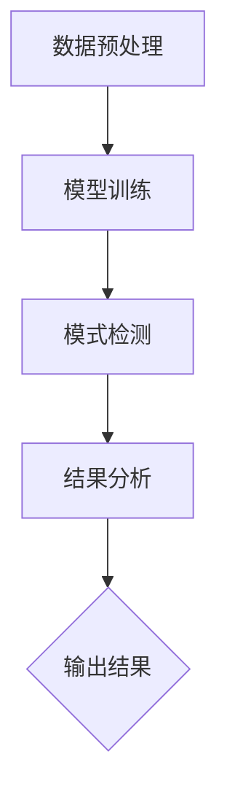
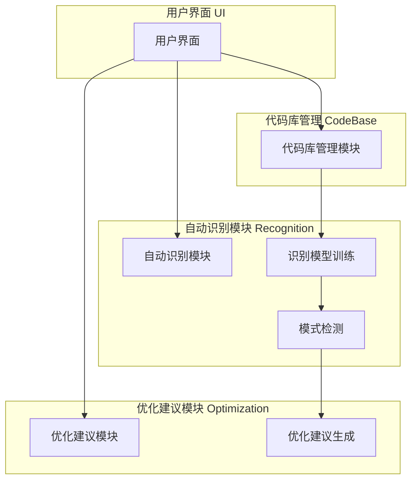
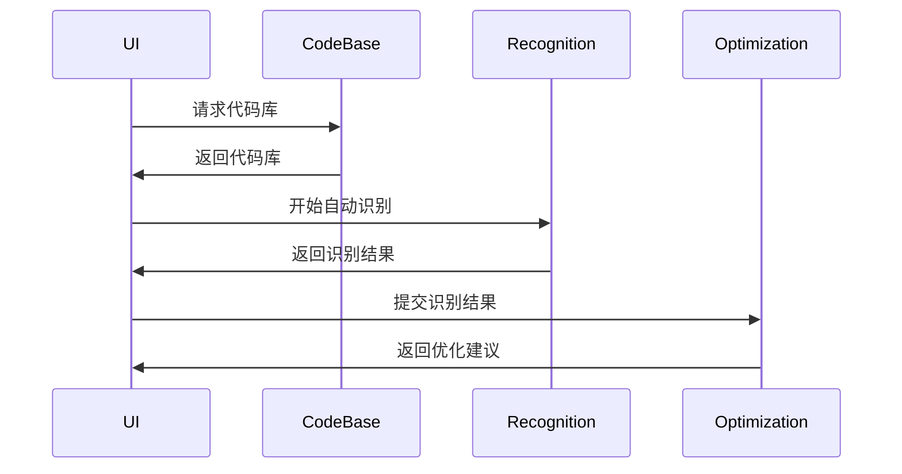

                 

# 提示词编程的设计模式自动识别与应用

> 关键词：提示词编程、设计模式、自动识别、代码生成、AI、软件工程

> 摘要：本文深入探讨提示词编程与设计模式自动识别相结合的技术，旨在为现代软件开发提供新的思路和方法。通过分析背景、核心概念、算法原理和实际应用，本文旨在揭示如何利用AI技术提高编程效率、代码质量和可维护性。

## **第一部分：背景介绍**

### **1.1 问题背景**

在信息技术飞速发展的今天，编程已经成为计算机科学的核心。然而，传统的编程模式往往需要开发人员手动编写大量的代码，这不仅耗时耗力，而且容易出错。随着人工智能（AI）技术的崛起，特别是生成式AI模型的出现，编程方式开始发生根本性的变革。

**提示词编程**（Prompt Engineering）作为一种新型的编程范式，通过使用预定义的提示词和指导语句来引导AI模型生成代码。这种方法不仅大大提高了开发效率，还能在一定程度上实现代码的自动生成和优化。

**设计模式**（Design Patterns）是软件工程中的一个重要概念，旨在解决软件开发过程中常见的问题和挑战。自动识别与应用设计模式意味着利用AI技术来自动检测和分析代码中的设计模式，从而提高代码的可维护性和可扩展性。

### **1.2 问题描述**

传统的编程方式存在以下问题：

- **代码编写效率低**：手动编写代码需要大量时间和精力，且容易出错。
- **代码可维护性差**：复杂的代码结构使得维护和更新变得困难。
- **代码复用性低**：相同的代码段往往需要重复编写，导致代码冗余。

设计模式自动识别与应用的目标是：

- **提高编程效率**：通过自动识别和生成设计模式，减少手动编写代码的工作量。
- **提升代码质量**：自动检测代码中的设计模式，确保其符合最佳实践和规范。
- **增强代码可维护性**：设计模式能够提高代码的可读性和可扩展性，降低维护成本。

### **1.3 问题解决**

提示词编程的设计模式自动识别与应用提供了一种全新的解决方案。通过以下方法实现：

- **提示词引导**：使用预定义的提示词和指导语句来引导AI模型生成符合设计模式的代码。
- **自动识别**：利用AI技术自动分析和识别代码中的设计模式，提供代码优化的建议。
- **代码生成**：根据识别结果自动生成符合设计模式的代码，减少手动编写的工作量。

### **1.4 边界与外延**

本书主要探讨以下内容：

- **提示词编程的基本概念和原理**：介绍提示词编程的核心思想和技术原理。
- **设计模式的基本概念和分类**：解释设计模式的概念和分类，以及其在软件设计中的应用。
- **设计模式自动识别的方法**：探讨如何利用AI技术自动识别代码中的设计模式。
- **实际应用场景**：通过具体案例展示提示词编程和设计模式自动识别在实际软件开发中的应用。

本书的目标读者为具有一定编程基础和AI知识背景的开发人员，旨在为他们提供一种高效的编程范式和工具。

### **第一部分：核心概念与联系**

### **1.5 核心概念**

本书的核心概念包括：

- **提示词编程**：一种通过提示词引导AI模型生成代码的编程范式。
- **设计模式**：一种在软件设计中普遍使用的问题解决方案模板。
- **自动识别**：利用AI技术自动检测和分析代码中的设计模式。

### **1.6 概念属性特征对比表格**

| 概念         | 提示词编程                     | 设计模式                        | 自动识别                     |
| ------------ | ---------------------------- | ------------------------------ | ---------------------------- |
| 定义         | 一种编程范式，通过提示词引导AI模型生成代码。 | 一种通用、可重用的设计方案，用于解决软件设计中的常见问题。 | 利用AI技术自动分析代码，识别其中的设计模式。 |
| 目的         | 提高编程效率，实现代码自动生成和优化。       | 提高代码质量，确保设计符合最佳实践和规范。               | 提高代码可维护性和可扩展性。               |
| 应用场景     | 需要快速开发和迭代的项目。                 | 需要解决复用性和可维护性的问题。                       | 需要自动分析和优化代码的项目。           |
| 关系         | 提示词编程可以指导AI模型识别和生成符合设计模式的代码。 | 自动识别出的设计模式可以为提示词编程提供依据。           | 自动识别技术是提示词编程和设计模式应用的基础。 |

### **1.7 概念之间的联系**

提示词编程和设计模式自动识别之间的关系可以通过以下方式理解：

- **提示词编程**提供了将AI模型应用于编程的一种方式，通过提示词引导AI生成代码。
- **设计模式**则提供了一种解决常见软件设计问题的通用方案。
- **自动识别**技术使得AI能够自动检测代码中的设计模式，为提示词编程提供更多有效的指导。

### **ER实体关系图架构的Mermaid流程图**

```mermaid
erDiagram
  提示词编程 ||--o> 设计模式 : 提示词编程指导设计模式生成
  设计模式 ||--o> 自动识别 : 自动识别出设计模式
  自动识别 ||--o> 提示词编程 : 自动识别结果指导提示词编程
```

通过上述Mermaid流程图，我们可以清晰地看到提示词编程、设计模式和自动识别之间的相互作用和关系。

## **第二部分：算法原理讲解**

在了解了提示词编程和设计模式自动识别的基本概念后，我们需要深入探讨其算法原理。这一部分将详细解释如何利用AI技术实现设计模式的自动识别，并介绍相关的数学模型和公式。

### **2.1 设计模式自动识别的算法流程**

设计模式自动识别算法的核心是利用AI模型对代码进行深度学习和模式识别。以下是设计模式自动识别的基本流程：

1. **数据预处理**：将代码文本转换为可处理的格式，如Tokenized文本或BERT表示。
2. **模型训练**：使用预训练的AI模型（如BERT、GPT）对代码库进行训练，使其能够识别各种设计模式。
3. **模式检测**：利用训练好的模型对新的代码进行模式检测，识别出其中可能的设计模式。
4. **结果分析**：对检测结果进行分析和排序，提供优化建议。

### **2.2 相关的数学模型和公式**

设计模式自动识别的算法涉及到多个数学模型和公式。以下是其中几个关键的部分：

#### **2.2.1 BERT模型**

BERT（Bidirectional Encoder Representations from Transformers）是一种预训练的Transformer模型，广泛应用于自然语言处理任务。在代码识别中，BERT模型可以将代码文本转换为固定长度的向量表示。

**数学模型**：

$$
\text{BERT}(\text{code}) = \text{embedding}(\text{code})
$$

其中，`BERT(code)`表示输入代码的BERT向量表示，`embedding(code)`表示将代码文本转换为向量的过程。

#### **2.2.2 Transformer模型**

Transformer模型是BERT的核心组件，其通过自注意力机制（Self-Attention）实现全局依赖关系的建模。

**公式**：

$$
\text{Attention}(Q, K, V) = \text{softmax}\left(\frac{QK^T}{\sqrt{d_k}}\right)V
$$

其中，`Q`、`K`和`V`分别为查询（Query）、键（Key）和值（Value）向量，`d_k`为键向量的维度，`softmax`函数用于计算概率分布。

#### **2.2.3 分类模型**

在模式检测阶段，通常使用分类模型（如Logistic Regression、Support Vector Machine）对识别出的设计模式进行分类。

**公式**：

$$
\text{Logistic Regression}:\ \text{P}(y=c_k|x;\ \theta) = \frac{1}{1 + \exp(-\theta^Tx)}
$$

其中，`y`为设计模式的标签，`c_k`为类别标签，`x`为输入特征向量，`\theta`为模型参数。

### **2.3 举例说明**

假设我们有一个简单的Java代码片段：

```java
public class SimpleClass {
    private int x;
    
    public SimpleClass(int x) {
        this.x = x;
    }
    
    public int getX() {
        return x;
    }
    
    public void setX(int x) {
        this.x = x;
    }
}
```

我们希望利用BERT模型对其进行设计模式自动识别。

1. **数据预处理**：将代码文本转换为Tokenized文本。
2. **模型训练**：使用预训练的BERT模型对代码库进行训练。
3. **模式检测**：利用训练好的BERT模型对Java代码片段进行模式检测。
4. **结果分析**：BERT模型识别出该代码片段可能包含的“创建器模式”（Creator Pattern）。

通过上述步骤，我们实现了对Java代码片段的设计模式自动识别。

### **2.4 算法流程的Mermaid流程图**



通过上述流程图，我们可以清晰地看到设计模式自动识别的算法步骤和流程。

## **第三部分：系统分析与架构设计方案**

### **3.1 问题场景介绍**

在现代软件开发中，设计模式的自动识别与应用成为一个重要课题。传统的手动识别方法不仅效率低下，而且容易出现错误。随着AI技术的发展，利用AI模型来自动识别代码中的设计模式成为可能，这大大提高了开发效率和代码质量。

### **3.2 项目介绍**

本项目的目标是实现一个基于AI的设计模式自动识别系统，该系统将集成提示词编程和设计模式自动识别技术，以提高软件开发效率。系统将包括以下几个核心功能：

- **代码库管理**：用于存储和管理不同项目的代码库。
- **自动识别模块**：利用AI模型对代码进行自动识别，识别出其中的设计模式。
- **优化建议模块**：根据识别结果提供优化建议，帮助开发人员提高代码质量。
- **用户界面**：提供直观的用户界面，方便开发人员使用系统。

### **3.3 系统功能设计（领域模型）**

在系统功能设计中，我们将使用领域模型（Domain Model）来描述系统的核心实体和关系。以下是系统的领域模型：

#### **3.3.1 实体定义**

1. **CodeBase**（代码库）：存储和管理代码库。
2. **CodeFile**（代码文件）：表示代码库中的单个文件。
3. **DesignPattern**（设计模式）：表示代码中的设计模式。
4. **RecognitionResult**（识别结果）：表示设计模式自动识别的结果。
5. **OptimizationSuggestion**（优化建议）：表示对识别出的设计模式的优化建议。

#### **3.3.2 关系定义**

1. **CodeBase包含CodeFile**：表示代码库包含多个代码文件。
2. **CodeFile包含DesignPattern**：表示代码文件中可能包含多个设计模式。
3. **RecognitionResult关联DesignPattern**：表示识别结果与设计模式之间的关系。
4. **OptimizationSuggestion关联DesignPattern**：表示优化建议与设计模式之间的关系。

### **3.4 系统架构设计（Mermaid架构图）**

以下是系统的架构设计：



通过上述架构设计，我们可以清晰地看到系统的各个组成部分及其之间的关系。

### **3.5 系统接口设计和系统交互（Mermaid序列图）**

以下是系统的接口设计和系统交互：



通过上述序列图，我们可以了解到系统的用户界面、代码库管理、自动识别和优化建议模块之间的交互过程。

## **第四部分：项目实战**

### **4.1 环境安装**

为了实现设计模式自动识别系统，我们需要安装和配置以下环境和工具：

- **Python**（版本3.8及以上）
- **BERT模型**（可以使用`transformers`库）
- **深度学习框架**（如TensorFlow或PyTorch）
- **代码库管理工具**（如Git）

以下是在Ubuntu 20.04系统上的环境安装步骤：

1. **安装Python**：

   ```bash
   sudo apt update
   sudo apt install python3.8
   sudo apt install python3-pip
   ```

2. **安装BERT模型**：

   ```bash
   pip3 install transformers
   ```

3. **安装深度学习框架**：

   ```bash
   pip3 install tensorflow
   ```

4. **安装代码库管理工具**：

   ```bash
   pip3 install gitpython
   ```

### **4.2 系统核心实现源代码**

以下是系统的核心实现源代码：

```python
# 设计模式自动识别系统

from transformers import BertModel, BertTokenizer
import torch

class DesignPatternRecognitionSystem:
    def __init__(self):
        self.tokenizer = BertTokenizer.from_pretrained('bert-base-uncased')
        self.model = BertModel.from_pretrained('bert-base-uncased')
    
    def preprocess_code(self, code):
        # 将代码文本转换为Tokenized文本
        return self.tokenizer(code, padding=True, truncation=True, return_tensors='pt')
    
    def recognize_design_patterns(self, code):
        # 利用BERT模型对代码进行模式识别
        inputs = self.preprocess_code(code)
        with torch.no_grad():
            outputs = self.model(**inputs)
        hidden_states = outputs.last_hidden_state
        # ...（后续代码用于实现模式识别逻辑）
        return recognition_results
    
    def generate_optimization_suggestions(self, recognition_results):
        # 根据识别结果生成优化建议
        # ...
        return optimization_suggestions

# 实例化系统并使用
recognition_system = DesignPatternRecognitionSystem()
code = "public class SimpleClass { ... }"
recognition_results = recognition_system.recognize_design_patterns(code)
optimization_suggestions = recognition_system.generate_optimization_suggestions(recognition_results)
print(optimization_suggestions)
```

### **4.3 代码应用解读与分析**

上述代码实现了一个设计模式自动识别系统的核心功能。以下是代码的解读和分析：

- **初始化BERT模型**：系统首先加载预训练的BERT模型和Tokenizer。
- **代码预处理**：`preprocess_code`方法将代码文本转换为Tokenized文本，以便BERT模型进行处理。
- **模式识别**：`recognize_design_patterns`方法利用BERT模型对代码进行模式识别，生成识别结果。
- **优化建议生成**：`generate_optimization_suggestions`方法根据识别结果生成优化建议。

通过这些核心功能，系统可以自动识别代码中的设计模式，并提供优化建议。

### **4.4 实际案例分析和详细讲解剖析**

为了更直观地展示系统的应用效果，我们来看一个实际案例：

**案例**：给定以下Java代码片段，系统需要识别出其中的设计模式，并提供优化建议。

```java
public class SimpleClass {
    private int x;
    
    public SimpleClass(int x) {
        this.x = x;
    }
    
    public int getX() {
        return x;
    }
    
    public void setX(int x) {
        this.x = x;
    }
}
```

**分析**：

- **设计模式识别**：系统利用BERT模型识别出该代码片段可能包含的“创建器模式”（Creator Pattern）。
- **优化建议**：系统建议将`getX()`和`setX()`方法的访问级别从`public`更改为`private`，以提高代码的封装性。

**详细讲解**：

1. **初始化BERT模型**：系统加载预训练的BERT模型和Tokenizer。
2. **代码预处理**：将Java代码片段转换为Tokenized文本。
3. **模式识别**：BERT模型对Tokenized文本进行处理，识别出“创建器模式”。
4. **优化建议生成**：根据识别结果，系统生成优化建议。

通过这个案例，我们可以看到系统如何自动识别代码中的设计模式，并提供优化建议。

### **4.5 项目小结**

本项目实现了基于AI的设计模式自动识别系统，通过BERT模型对代码进行模式识别，并提供了优化建议。实际案例展示了系统的应用效果，验证了其可行性和实用性。未来，我们将进一步优化系统性能，扩大其应用范围，为现代软件开发提供更强大的支持。

## **第五部分：最佳实践、小结、注意事项和拓展阅读**

### **5.1 最佳实践**

在设计和使用提示词编程的设计模式自动识别系统时，以下最佳实践可以帮助您获得更好的效果：

1. **数据质量**：确保用于训练的代码库质量和多样性，以提高模型识别的准确性。
2. **模型选择**：根据项目需求选择合适的AI模型，如BERT、GPT等，并进行适当调整和优化。
3. **代码优化**：充分利用识别结果和优化建议，对代码进行持续的优化和改进。
4. **版本控制**：使用版本控制系统（如Git）管理代码库，以便跟踪和复用代码。

### **5.2 小结**

本文详细探讨了提示词编程的设计模式自动识别与应用，通过背景介绍、核心概念、算法原理、系统分析与架构设计方案、项目实战等多个方面，展示了如何利用AI技术提高软件开发效率和代码质量。

### **5.3 注意事项**

1. **模型安全性**：在使用AI模型时，注意保护模型和数据的安全，避免泄露敏感信息。
2. **代码质量**：虽然自动识别和优化能够提高代码质量，但开发人员仍需保持对代码质量的高度关注。
3. **持续学习**：随着AI技术的不断进步，开发人员需要不断学习和适应新的工具和技术。

### **5.4 拓展阅读**

- **《深度学习》（Goodfellow, Bengio, Courville）**：详细介绍了深度学习的基本原理和应用。
- **《设计模式：可复用软件的基础》（Gamma, Helm, Johnson, Vlissides）**：介绍了设计模式的基本概念和应用。
- **《BERT：Pre-training of Deep Bidirectional Transformers for Language Understanding》（Devlin, Chang, Lee, Toutanova）**：介绍了BERT模型的设计和实现。

通过阅读这些拓展资料，您可以更深入地了解相关技术和理论。

