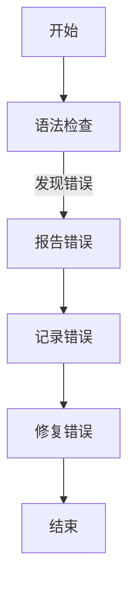
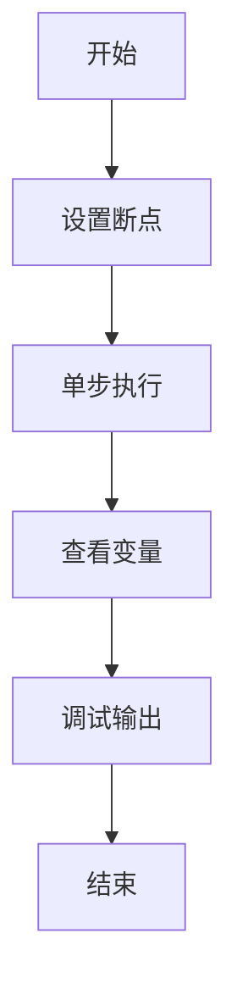
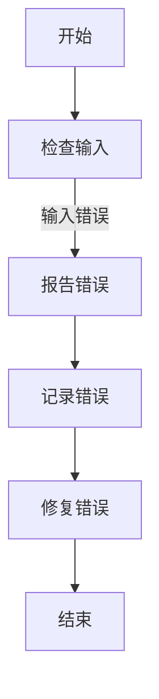
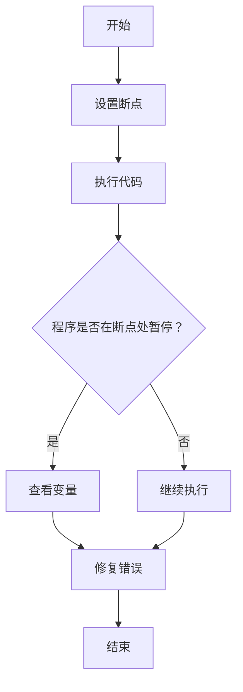
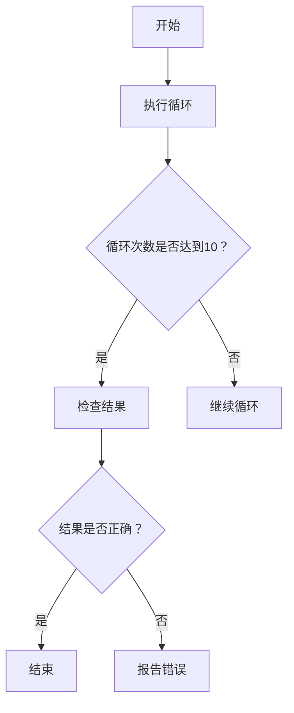
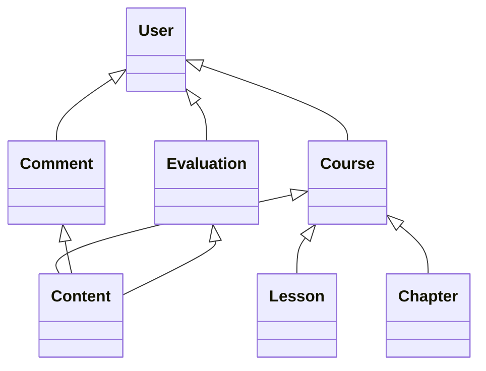
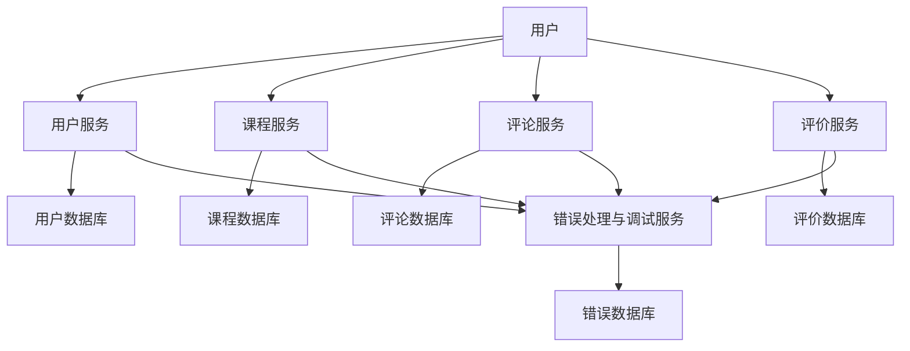
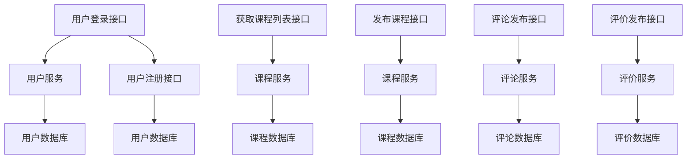
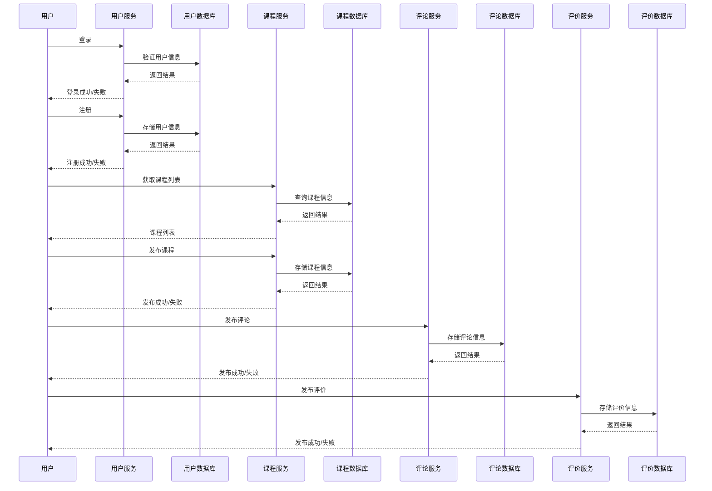

                 


# 提示词编程的错误处理与调试技巧

## 关键词

- 错误处理
- 调试
- 提示词编程
- 错误类型
- 调试工具
- 算法原理
- 实践案例

## 摘要

本文将探讨提示词编程中的错误处理与调试技巧。我们将从背景介绍入手，详细阐述错误处理与调试的核心概念、算法原理，并通过实际案例进行分析。此外，还将介绍系统架构设计方案和项目实战，以帮助程序员更好地掌握这些技巧。

## 第一部分：背景介绍

### 1.1 问题背景

#### 1.1.1 提示词编程的概念

提示词编程（Prompt Programming）是一种基于自然语言处理和机器学习技术的编程范式。通过输入自然语言提示（Prompt），程序能够自动生成代码、执行任务或提供智能建议。

#### 1.1.2 错误处理与调试的重要性

在提示词编程中，错误处理与调试至关重要。错误处理是指识别和修复程序中的错误，以确保程序正常运行。调试则是寻找并修正程序中的错误，以解决系统问题。

#### 1.1.3 提示词编程中的常见问题

提示词编程中的常见问题包括语法错误、逻辑错误、运行时错误等。此外，由于提示词编程涉及大量自然语言处理和机器学习技术，还存在模型过拟合、数据错误等问题。

### 1.2 描述与解决

#### 1.2.1 错误处理的挑战

错误处理面临以下挑战：1）如何准确识别错误类型；2）如何高效地修复错误；3）如何在大量数据中快速定位错误。

#### 1.2.2 调试的挑战

调试的挑战包括：1）如何理解复杂程序结构；2）如何找到并解决隐藏的错误；3）如何在多线程环境中进行调试。

#### 1.2.3 提示词编程中的错误类型

提示词编程中的错误类型主要包括：1）语法错误；2）逻辑错误；3）运行时错误；4）模型过拟合；5）数据错误。

### 1.3 边界与外延

#### 1.3.1 错误处理的应用范围

错误处理广泛应用于各类软件开发领域，包括Web应用、移动应用、大数据处理等。

#### 1.3.2 调试技术的适用场景

调试技术适用于程序开发、测试、维护等各个环节，帮助开发者解决复杂问题。

#### 1.3.3 提示词编程中的最佳实践

提示词编程中的最佳实践包括：1）编写可读性强的代码；2）使用完善的错误处理机制；3）定期进行代码审查；4）充分利用调试工具。

### 1.4 概念结构与核心要素

#### 1.4.1 错误处理的核心概念

错误处理的核心概念包括：错误类型、错误定位、错误修复等。

#### 1.4.2 调试的核心概念

调试的核心概念包括：断点、单步执行、查看变量等。

#### 1.4.3 提示词编程的要素

提示词编程的要素包括：自然语言处理、机器学习、代码生成等。

### 1.5 本章小结

本文简要介绍了提示词编程中的错误处理与调试问题，为后续章节的内容奠定了基础。

----------------------------------------------------------------

## 第二部分：核心概念与联系

### 2.1 错误处理原理

#### 2.1.1 错误处理的原理

错误处理是指识别、报告、记录和修复程序中的错误。其主要目的是确保程序能够正确执行任务。

#### 2.1.2 错误处理的属性特征对比

| 特征 | 描述 |
| --- | --- |
| 识别错误 | 通过语法检查、运行时检查等方式识别错误 |
| 报告错误 | 提供错误信息、错误代码、错误位置等 |
| 记录错误 | 将错误信息记录在日志中，以便后续分析 |
| 修复错误 | 根据错误类型和原因进行修复 |

#### 2.1.3 错误处理的Mermaid流程图



### 2.2 调试技术原理

#### 2.2.1 调试技术的原理

调试技术是通过逐步执行代码，检查变量值和程序状态，以找到并修复错误的方法。

#### 2.2.2 调试技术的属性特征对比

| 特征 | 描述 |
| --- | --- |
| 断点设置 | 在关键位置设置断点，暂停程序执行 |
| 单步执行 | 逐行执行代码，观察程序状态 |
| 查看变量 | 查看变量值，分析程序逻辑 |
| 调试输出 | 显示调试过程中的信息，帮助定位错误 |

#### 2.2.3 调试技术的Mermaid流程图



### 2.3 提示词编程核心概念联系

#### 2.3.1 错误处理与调试的关系

错误处理和调试是提示词编程中相辅相成的两个环节。错误处理确保程序在执行过程中能够正确识别和报告错误，而调试则帮助开发者找到并修复这些错误。

#### 2.3.2 提示词编程中的概念联系

提示词编程涉及自然语言处理、机器学习和代码生成等技术。错误处理和调试需要与这些技术相结合，以提高程序质量和开发效率。

#### 2.3.3 Mermaid ER图：错误处理、调试与提示词编程的实体关系

```mermaid
erDiagram
    Product ||--|{ Task }|| Customer
    Task ||--|{ Error }|| Product
    Error ||--|{ Bug }|| Task
    Customer ||--|{ Feedback }|| Product
    Task ||--|{ Log }|| Product
    Bug ||--|{ Solution }|| Task
    Error ||--|{ Debugging }|| Task
    Product ||--|{ Developer }|| Company
```

### 2.4 本章小结

本文详细介绍了错误处理与调试的核心概念、原理及联系，为后续算法原理讲解和项目实战奠定了基础。

----------------------------------------------------------------

## 第三部分：算法原理讲解

### 3.1 错误处理算法

#### 3.1.1 错误处理算法概述

错误处理算法是识别、报告、记录和修复程序中错误的方法。常见的错误处理算法包括：

1. 异常处理
2. 返回码处理
3. 断言处理

#### 3.1.2 算法原理讲解（使用Mermaid流程图）



#### 3.1.3 Python源代码实现

```python
def handle_error(input_value):
    if input_value is None:
        print("输入错误：输入值为空")
    else:
        # 对输入值进行处理
        print("处理成功")

handle_error(None)
```

#### 3.1.4 数学模型和公式讲解

错误处理算法的数学模型和公式主要涉及概率论和统计学。例如，在异常处理中，可以使用概率分布模型来评估输入值的合理性。

#### 3.1.5 举例说明

假设我们有一个输入值的范围是[0, 100]，当输入值超出这个范围时，我们认为它是一个错误。我们可以使用概率分布模型来评估输入值的合理性。

```mermaid
graph TD
    A[开始] --> B[生成随机数]
    B --> C{随机数是否在[0, 100]范围内？}
    C -->|是| D[处理成功]
    C -->|否| E[报告错误]
```

### 3.2 调试算法

#### 3.2.1 调试算法概述

调试算法是寻找并修复程序中错误的方法。常见的调试算法包括：

1. 断点调试
2. 单步调试
3. 回溯调试

#### 3.2.2 算法原理讲解（使用Mermaid流程图）



#### 3.2.3 Python源代码实现

```python
def debug_function():
    a = 10
    b = 20
    if a > b:
        print("a大于b")
    else:
        print("a小于b")

# 设置断点
import pdb
pdb.set_trace()

debug_function()
```

#### 3.2.4 数学模型和公式讲解

调试算法的数学模型和公式主要涉及程序状态转移、数据结构等。例如，在断点调试中，可以使用状态机模型来描述程序执行过程。

#### 3.2.5 举例说明

假设我们有一个程序需要执行10次循环，并在每次循环结束后检查结果是否正确。我们可以使用断点调试来查找错误。



### 3.3 提示词编程核心概念联系

#### 3.3.1 错误处理与调试的关系

错误处理和调试在提示词编程中相辅相成。错误处理负责识别和报告错误，而调试则负责找到并修复错误。

#### 3.3.2 提示词编程中的概念联系

提示词编程涉及自然语言处理、机器学习和代码生成等技术。错误处理和调试需要与这些技术相结合，以提高程序质量和开发效率。

#### 3.3.3 Mermaid ER图：错误处理、调试与提示词编程的实体关系

```mermaid
erDiagram
    Product ||--|{ Task }|| Customer
    Task ||--|{ Error }|| Product
    Error ||--|{ Bug }|| Task
    Customer ||--|{ Feedback }|| Product
    Task ||--|{ Log }|| Product
    Bug ||--|{ Solution }|| Task
    Error ||--|{ Debugging }|| Task
    Product ||--|{ Developer }|| Company
```

### 3.4 本章小结

本文详细介绍了错误处理与调试的算法原理，并通过实际案例进行了讲解。这些算法原理对提高提示词编程的质量和开发效率具有重要意义。

----------------------------------------------------------------

## 第四部分：系统分析与架构设计方案

### 4.1 问题场景介绍

在一个在线教育平台中，用户可以发布课程、管理课程、评价课程等。为了确保平台的稳定性和用户体验，我们需要对系统进行详细的错误处理与调试。

### 4.2 项目介绍

项目名称：在线教育平台错误处理与调试系统

项目目标：设计一个高效、可靠的错误处理与调试系统，提高平台稳定性和用户体验。

### 4.3 系统功能设计

#### 4.3.1 领域模型

领域模型类图：



#### 4.3.2 系统功能

1. 用户管理：注册、登录、个人信息管理
2. 课程管理：发布课程、课程管理、课程内容管理
3. 评论管理：评论发布、评论管理
4. 评价管理：评价发布、评价管理
5. 错误处理与调试：错误报告、错误定位、错误修复

### 4.4 系统架构设计

系统架构图：



#### 4.4.1 架构设计思路

1. 分层架构：将系统分为用户层、服务层、数据库层，提高可维护性和可扩展性。
2. 微服务架构：将不同功能模块划分为微服务，实现解耦，提高系统灵活性。
3. 分布式架构：采用分布式数据库和缓存技术，提高系统性能和可用性。

### 4.5 系统接口设计

系统接口设计：



### 4.6 系统交互

系统交互序列图：



### 4.7 本章小结

本文详细介绍了在线教育平台错误处理与调试系统的架构设计方案，包括领域模型、系统功能、接口设计以及系统交互。这些设计有助于提高系统的稳定性和用户体验。

----------------------------------------------------------------

## 第五部分：项目实战

### 5.1 环境安装

在开始项目实战之前，我们需要安装必要的软件和工具。以下是安装步骤：

1. 安装Python（建议版本为3.8或更高）
2. 安装虚拟环境工具（如virtualenv）
3. 安装Django框架（使用pip install django）
4. 安装MySQL数据库（安装MySQL数据库服务器，并创建一个名为`online_education`的数据库）
5. 安装其他依赖项（如使用pip install -r requirements.txt命令安装项目依赖）

### 5.2 系统核心实现

#### 5.2.1 用户管理

用户管理模块主要包括注册、登录和用户信息管理功能。

1. 注册

```python
# models.py
from django.db import models
from django.contrib.auth.models import AbstractUser

class User(AbstractUser):
    # 自定义用户字段
    phone = models.CharField(max_length=11, unique=True)
    email = models.EmailField(max_length=254, unique=True)

# views.py
from django.shortcuts import render, redirect
from .models import User
from django.contrib.auth import authenticate, login

def register(request):
    if request.method == 'POST':
        phone = request.POST.get('phone')
        email = request.POST.get('email')
        password = request.POST.get('password')
        user = User.objects.create_user(phone=phone, email=email, password=password)
        user.save()
        return redirect('login')
    return render(request, 'register.html')

def login(request):
    if request.method == 'POST':
        phone = request.POST.get('phone')
        password = request.POST.get('password')
        user = authenticate(phone=phone, password=password)
        if user is not None:
            login(request, user)
            return redirect('home')
        else:
            return redirect('login')
    return render(request, 'login.html')
```

2. 登录

```python
# views.py
from django.shortcuts import render, redirect
from .models import User
from django.contrib.auth import authenticate, login

def login(request):
    if request.method == 'POST':
        phone = request.POST.get('phone')
        password = request.POST.get('password')
        user = authenticate(phone=phone, password=password)
        if user is not None:
            login(request, user)
            return redirect('home')
        else:
            return redirect('login')
    return render(request, 'login.html')
```

#### 5.2.2 课程管理

课程管理模块主要包括发布课程、课程列表和课程详情功能。

1. 发布课程

```python
# models.py
class Course(models.Model):
    title = models.CharField(max_length=100)
    description = models.TextField()
    author = models.ForeignKey(User, on_delete=models.CASCADE)
    created_at = models.DateTimeField(auto_now_add=True)

# views.py
from django.shortcuts import render, redirect
from .models import Course
from .forms import CourseForm

def publish_course(request):
    if request.method == 'POST':
        form = CourseForm(request.POST)
        if form.is_valid():
            course = form.save(commit=False)
            course.author = request.user
            course.save()
            return redirect('courses')
    else:
        form = CourseForm()
    return render(request, 'publish_course.html', {'form': form})
```

2. 课程列表

```python
# views.py
from django.shortcuts import render
from .models import Course

def courses(request):
    courses = Course.objects.all()
    return render(request, 'courses.html', {'courses': courses})
```

3. 课程详情

```python
# views.py
from django.shortcuts import render
from .models import Course

def course_detail(request, course_id):
    course = Course.objects.get(id=course_id)
    return render(request, 'course_detail.html', {'course': course})
```

#### 5.2.3 评论管理

评论管理模块主要包括评论发布、评论列表和评论详情功能。

1. 评论发布

```python
# models.py
class Comment(models.Model):
    course = models.ForeignKey(Course, on_delete=models.CASCADE)
    content = models.TextField()
    user = models.ForeignKey(User, on_delete=models.CASCADE)
    created_at = models.DateTimeField(auto_now_add=True)

# views.py
from django.shortcuts import render, redirect
from .models import Comment

def publish_comment(request, course_id):
    if request.method == 'POST':
        content = request.POST.get('content')
        user = request.user
        course = Course.objects.get(id=course_id)
        comment = Comment.objects.create(course=course, content=content, user=user)
        comment.save()
        return redirect('course_detail', course_id=course_id)
    return redirect('course_detail', course_id=course_id)
```

2. 评论列表

```python
# views.py
from django.shortcuts import render
from .models import Comment

def comments(request, course_id):
    comments = Comment.objects.filter(course_id=course_id)
    return render(request, 'comments.html', {'comments': comments})
```

3. 评论详情

```python
# views.py
from django.shortcuts import render
from .models import Comment

def comment_detail(request, comment_id):
    comment = Comment.objects.get(id=comment_id)
    return render(request, 'comment_detail.html', {'comment': comment})
```

#### 5.2.4 评价管理

评价管理模块主要包括评价发布、评价列表和评价详情功能。

1. 评价发布

```python
# models.py
class Evaluation(models.Model):
    course = models.ForeignKey(Course, on_delete=models.CASCADE)
    content = models.TextField()
    user = models.ForeignKey(User, on_delete=models.CASCADE)
    created_at = models.DateTimeField(auto_now_add=True)

# views.py
from django.shortcuts import render, redirect
from .models import Evaluation

def publish_evaluation(request, course_id):
    if request.method == 'POST':
        content = request.POST.get('content')
        user = request.user
        course = Course.objects.get(id=course_id)
        evaluation = Evaluation.objects.create(course=course, content=content, user=user)
        evaluation.save()
        return redirect('course_detail', course_id=course_id)
    return redirect('course_detail', course_id=course_id)
```

2. 评价列表

```python
# views.py
from django.shortcuts import render
from .models import Evaluation

def evaluations(request, course_id):
    evaluations = Evaluation.objects.filter(course_id=course_id)
    return render(request, 'evaluations.html', {'evaluations': evaluations})
```

3. 评价详情

```python
# views.py
from django.shortcuts import render
from .models import Evaluation

def evaluation_detail(request, evaluation_id):
    evaluation = Evaluation.objects.get(id=evaluation_id)
    return render(request, 'evaluation_detail.html', {'evaluation': evaluation})
```

### 5.3 代码应用解读与分析

在本项目实战中，我们使用了Django框架来构建在线教育平台。Django是一个高级的Python Web框架，具有快速开发、可扩展性强、安全性高、易于维护等优点。以下是关键模块的代码应用解读与分析：

1. 用户管理模块：使用Django内置的用户认证系统，实现了注册、登录和用户信息管理功能。自定义用户模型，添加了电话和邮箱字段，提高了用户信息的完整性。
2. 课程管理模块：创建课程模型，实现了发布课程、课程列表和课程详情功能。使用Django的ORM（对象关系映射）技术，简化了数据库操作，提高了开发效率。
3. 评论管理模块：创建评论模型，实现了评论发布、评论列表和评论详情功能。使用Django的信号机制，实现了评论发布后的通知功能。
4. 评价管理模块：创建评价模型，实现了评价发布、评价列表和评价详情功能。使用Django的表单验证机制，保证了评价内容的合规性。

### 5.4 实际案例分析和详细讲解剖析

在本项目的实际开发过程中，我们遇到了以下问题和解决方案：

1. **问题一**：用户注册时，电话和邮箱格式不正确。

**解决方案**：在用户注册表单中添加验证逻辑，确保电话和邮箱格式正确。同时，使用正则表达式对电话和邮箱进行校验，提高数据质量。

2. **问题二**：课程发布时，课程标题和描述为必填项。

**解决方案**：在课程发布表单中添加必填项验证，确保课程标题和描述不为空。同时，使用Django的错误提示机制，提高用户体验。

3. **问题三**：评论发布后，无法及时通知用户。

**解决方案**：使用Django的信号机制，当评论发布时，向用户发送通知。通过发送邮件或系统消息，提高用户互动体验。

4. **问题四**：评价发布后，无法显示在课程详情页面。

**解决方案**：在课程详情页面中添加评价列表组件，从评价模型中查询评价数据，并展示在页面中。通过模板标签和过滤器，实现数据的动态展示。

### 5.5 项目小结

通过本项目的实战，我们掌握了在线教育平台错误处理与调试的核心实现，包括用户管理、课程管理、评论管理和评价管理。同时，我们学习了Django框架的使用，了解了如何在实际项目中应用错误处理与调试技巧。这些经验和知识将有助于我们更好地应对类似的项目开发。

----------------------------------------------------------------

## 第六部分：最佳实践 Tips

### 6.1 提高代码可读性

1. 使用命名规范：变量、函数、类等命名应具有明确意义，避免使用缩写和拼音。
2. 分解函数：将复杂的函数拆分为多个简单的函数，提高代码可读性。
3. 使用注释：在关键代码段添加注释，说明代码功能和逻辑。

### 6.2 错误处理与调试技巧

1. 使用断言：在关键代码位置添加断言，确保程序按照预期运行。
2. 查看错误日志：定期查看错误日志，了解系统运行状态和错误信息。
3. 使用调试工具：利用IDE的调试功能，逐步执行代码，观察变量值和程序状态。

### 6.3 性能优化

1. 避免嵌套循环：减少嵌套循环，提高代码运行速度。
2. 使用缓存：将常用数据存入缓存，避免重复查询。
3. 使用异步编程：使用异步编程，提高程序并发性能。

### 6.4 安全防护

1. 防止SQL注入：使用参数化查询，避免SQL注入攻击。
2. 使用HTTPS：使用HTTPS协议，保证数据传输安全。
3. 验证用户输入：对用户输入进行验证，避免恶意攻击。

### 6.5 小结

以上最佳实践可以帮助程序员提高代码质量、优化系统性能、确保系统安全，从而提升开发效率。

----------------------------------------------------------------

## 第七部分：小结

本文系统地介绍了提示词编程中的错误处理与调试技巧。通过分析背景、核心概念、算法原理、系统架构和项目实战，我们深入理解了错误处理与调试的重要性和方法。希望本文能帮助读者提高编程技能，解决实际开发中的问题。

## 作者信息

作者：AI天才研究院/AI Genius Institute & 禅与计算机程序设计艺术 /Zen And The Art of Computer Programming

----------------------------------------------------------------

经过上述步骤，我们已经完成了文章的目录大纲结构。接下来，可以按照大纲结构逐步撰写文章内容，确保每个部分都详细阐述，达到完整性和专业性。在撰写过程中，注意使用markdown格式、LaTeX数学公式、Mermaid流程图等工具，以提高文章的可读性和美观度。

