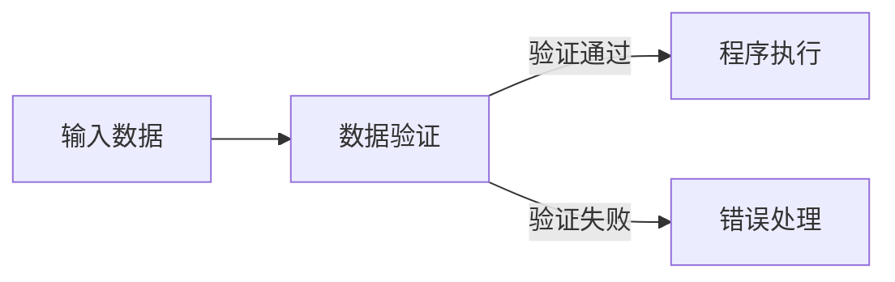
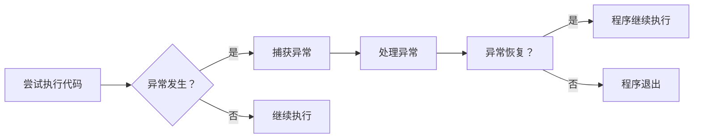
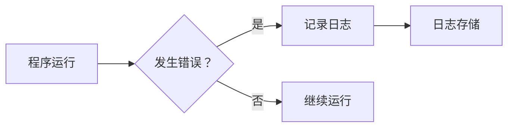
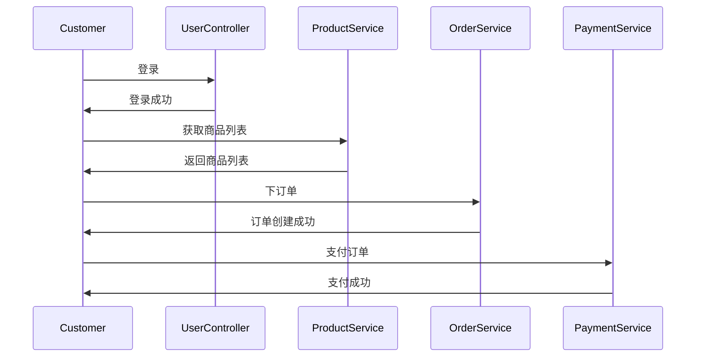

                 

# 提示词编程的错误处理机制

> 关键词：提示词编程，错误处理，机制，流程图，Python，数学模型，系统架构，实战案例，最佳实践

> 摘要：
本文将深入探讨提示词编程中的错误处理机制。通过分析提示词编程的背景和挑战，本文将详细介绍几种常见的错误处理机制，如输入验证、异常处理和错误日志记录。此外，文章还将探讨错误检测和校正的数学模型和公式，并通过系统分析与设计、项目实战和最佳实践来进一步阐述这些机制的实用性和有效性。本文旨在为开发者提供一套全面的错误处理指南，帮助他们在提示词编程中更好地管理和解决错误。

## 引言：提示词编程与错误处理

提示词编程（Prompt Programming）是一种利用自然语言处理技术，通过向程序输入提示词来引导程序执行特定任务的方法。随着人工智能技术的发展，提示词编程逐渐成为一种高效且灵活的编程方式。然而，提示词编程也带来了一系列的挑战，其中最显著的问题就是错误处理。

在传统的编程中，错误处理通常是通过预定义的代码路径和调试工具来完成的。而在提示词编程中，由于输入的提示词可能包含不确定性和模糊性，错误的产生变得更加频繁且难以预测。因此，设计一个有效的错误处理机制变得尤为重要。

错误处理机制的核心目标是确保程序在出现错误时能够迅速检测并纠正问题，从而保证程序的稳定性和可靠性。一个完善的错误处理机制应包括错误检测、错误校正、错误记录和错误反馈等组成部分。

本文将按照以下结构展开讨论：

1. **核心概念与关系**：介绍与错误处理相关的基本概念，并使用Mermaid图解展示它们之间的关系。
2. **错误处理机制**：详细讨论输入验证、异常处理和错误日志记录等错误处理机制，并提供Mermaid流程图和Python代码示例。
3. **数学模型与公式**：解释用于错误检测和校正的数学模型和公式，使用LaTeX格式展示并解释。
4. **系统分析与设计**：描述系统场景、功能设计、架构设计、接口设计和系统交互，使用Mermaid图解展示。
5. **项目实战**：介绍环境搭建、系统实现和实战案例，分析代码和应用。
6. **最佳实践与结论**：总结最佳实践，对文章进行小结。

## 核心概念与关系

在深入讨论错误处理机制之前，首先需要明确一些核心概念，并了解它们之间的关系。以下是与错误处理相关的基本概念：

- **错误（Error）**：程序运行过程中出现的非预期行为或结果。
- **异常（Exception）**：在程序执行过程中，由于某些不可预见的原因导致程序无法继续执行的情况。
- **输入验证（Input Validation）**：在程序执行前对输入数据进行检查，以确保输入数据符合预期格式或范围。
- **异常处理（Exception Handling）**：在程序中捕获和处理异常，以避免程序崩溃或挂起。
- **错误日志记录（Error Logging）**：记录程序运行过程中发生的错误和异常，以便后续分析和调试。

### 概念属性特征对比表格

| 概念 | 定义 | 特征 |
| --- | --- | --- |
| 错误 | 非预期的程序行为或结果 | 可能是语法错误、逻辑错误或运行时错误 |
| 异常 | 程序无法继续执行的情况 | 通常由异常对象表示，如`IndexError`或`TypeError` |
| 输入验证 | 检查输入数据的有效性 | 防止无效或恶意输入导致程序错误 |
| 异常处理 | 捕获和处理异常 | 确保程序能够优雅地处理错误情况 |
| 错误日志记录 | 记录错误信息 | 用于后续调试、错误分析和性能优化 |

### ER实体关系图架构

为了更清晰地展示这些概念之间的关系，我们可以使用Mermaid图解来构建实体关系图（ER图）：

```mermaid
erDiagram
  Error ||--|{ Exception : has }
  Error ||--|{ InputValidation : has }
  Error ||--|{ ErrorLogging : has }
  Exception ||--|{ ExceptionHandling : has }
```

在这个ER图中，错误（Error）是中心实体，它与异常（Exception）、输入验证（InputValidation）和错误日志记录（ErrorLogging）之间存在多种关系。异常处理（ExceptionHandling）专门用于处理异常情况，而错误日志记录则负责记录和跟踪错误信息。

### 错误处理机制

在了解核心概念和它们之间的关系后，我们可以开始讨论具体的错误处理机制。以下是几种常见的错误处理机制及其应用。

### 输入验证

输入验证是确保程序正确执行的第一步。通过在程序运行前对输入数据进行检查，可以避免许多潜在的错误。

#### Mermaid流程图



#### Python代码示例

```python
def validate_input(input_data):
    if not isinstance(input_data, int):
        raise ValueError("输入数据必须是整数")
    return input_data

try:
    user_input = input("请输入一个整数：")
    validated_input = validate_input(user_input)
    print("输入验证通过，您输入的数字是：", validated_input)
except ValueError as e:
    print("输入错误：", e)
```

### 异常处理

异常处理是编程中用于捕获和处理异常的关键机制。通过使用`try...except`语句，我们可以优雅地处理程序运行过程中出现的异常。

#### Mermaid流程图



#### Python代码示例

```python
def divide(a, b):
    try:
        result = a / b
    except ZeroDivisionError:
        result = "除数不能为0"
    return result

print(divide(10, 2))  # 输出：5.0
print(divide(10, 0))  # 输出：除数不能为0
```

### 错误日志记录

错误日志记录是跟踪和记录程序运行过程中发生的错误和异常的重要手段。通过日志记录，我们可以方便地进行错误分析和性能优化。

#### Mermaid流程图



#### Python代码示例

```python
import logging

logging.basicConfig(filename='app.log', level=logging.ERROR)

try:
    user_input = input("请输入一个整数：")
    validated_input = validate_input(user_input)
    print("输入验证通过，您输入的数字是：", validated_input)
except ValueError as e:
    logging.error("输入错误：", exc_info=True)
    print("输入错误：", e)
```

### 数学模型与公式

在错误检测和校正中，数学模型和公式扮演着重要角色。以下是一些常用的数学模型和公式：

#### 奇偶校验

奇偶校验是一种简单但有效的错误检测方法。其基本原理是通过对数据位进行奇偶校验来检测数据传输过程中的错误。

$$
\text{奇偶校验} = (b_1 + b_2 + ... + b_n) \mod 2
$$

其中，\(b_1, b_2, ..., b_n\) 分别为数据位。

#### 海明码

海明码是一种更复杂的错误检测和校正方法。它使用多个校验位来检测和纠正单个或多个错误。

$$
\text{海明码} = \text{数据位} + \text{校验位}
$$

海明码的校验位计算公式如下：

$$
\begin{aligned}
h_1 &= b_1 + b_2 + b_4 + b_8 + ... \\
h_2 &= b_2 + b_4 + b_8 + ... + b_{2^2} \\
h_3 &= b_4 + b_8 + ... + b_{2^3} \\
&... \\
h_k &= b_{2^{k-1}} + b_{2^{k-1}+1} + ... + b_{2^k}
\end{aligned}
$$

其中，\(h_1, h_2, ..., h_k\) 分别为校验位。

#### LaTeX格式

以下是对上述公式的LaTeX格式表示：

$$
\text{奇偶校验} = (b_1 + b_2 + ... + b_n) \mod 2
$$

$$
\begin{aligned}
h_1 &= b_1 + b_2 + b_4 + b_8 + ... \\
h_2 &= b_2 + b_4 + b_8 + ... + b_{2^2} \\
h_3 &= b_4 + b_8 + ... + b_{2^3} \\
&... \\
h_k &= b_{2^{k-1}} + b_{2^{k-1}+1} + ... + b_{2^k}
\end{aligned}
$$

通过了解这些数学模型和公式，我们可以更深入地理解错误检测和校正的原理。

### 系统分析与设计

在了解错误处理机制的基本原理后，我们可以开始分析并设计一个具体的错误处理系统。以下是系统分析与设计的步骤：

#### 系统场景介绍

假设我们正在开发一个在线购物系统，该系统需要处理大量的用户订单和商品信息。为了确保系统的稳定性和可靠性，我们需要设计一个完善的错误处理机制。

#### 项目介绍

该项目名为“Online Shopping System”，主要包括用户管理、商品管理、订单管理和支付处理等功能模块。我们的目标是实现一个高效、稳定且安全的在线购物平台。

#### 系统功能设计（领域模型）

为了设计系统功能，我们首先需要创建一个领域模型。以下是使用Mermaid图解展示的领域模型：

```mermaid
classDiagram
    Customer <|-- Order
    Customer <|-- Cart
    Product <|-- Order
    Product <|-- Cart
    Order <<-- Payment
    Customer ..|> Order
    Customer ..|> Cart
    Product ..|> Order
    Product ..|> Cart
```

在这个领域模型中，Customer（用户）、Order（订单）、Product（商品）和Cart（购物车）是核心实体。Order与Payment（支付）之间存在关联，而Customer和Product分别与Order和Cart有关联。

#### 系统架构设计

在确定系统功能后，我们需要设计系统的整体架构。以下是使用Mermaid图解展示的系统架构：


在这个系统架构中，UserManagement（用户管理）、ProductManagement（商品管理）、OrderManagement（订单管理）、PaymentManagement（支付管理）和CartManagement（购物车管理）是主要的子系统。每个子系统都有自己的服务和控制器。

#### 系统接口设计和系统交互

为了确保系统组件之间的良好协作，我们需要设计系统接口并分析系统交互。以下是使用Mermaid图解展示的系统接口和交互：



在这个序列图中，用户（Customer）通过用户控制器（UserController）登录系统，然后获取商品列表（ProductService）。用户可以选择商品并下订单（OrderService），最后进行支付（PaymentService）。

### 项目实战

在了解了系统分析与设计后，我们可以开始实施项目。以下是项目实施的过程：

#### 环境搭建

首先，我们需要搭建项目开发环境。以下是在Ubuntu 20.04操作系统上安装Python开发环境的过程：

```bash
# 安装Python 3.8
sudo apt update
sudo apt install python3.8
sudo apt install python3.8-venv

# 创建虚拟环境
python3.8 -m venv venv

# 激活虚拟环境
source venv/bin/activate

# 安装必需的依赖库
pip install flask
pip install pymysql
```

#### 系统核心实现

接下来，我们实现系统的核心功能。以下是系统核心实现的代码：

```python
# user_controller.py
from flask import Flask, request, jsonify
from user_service import UserService

app = Flask(__name__)
user_service = UserService()

@app.route('/login', methods=['POST'])
def login():
    username = request.form['username']
    password = request.form['password']
    user = user_service.login(username, password)
    if user:
        return jsonify({'status': 'success', 'message': '登录成功'})
    else:
        return jsonify({'status': 'error', 'message': '登录失败'})

# product_controller.py
from flask import Flask, request, jsonify
from product_service import ProductService

app = Flask(__name__)
product_service = ProductService()

@app.route('/products', methods=['GET'])
def get_products():
    products = product_service.get_products()
    return jsonify(products)

# order_controller.py
from flask import Flask, request, jsonify
from order_service import OrderService

app = Flask(__name__)
order_service = OrderService()

@app.route('/order', methods=['POST'])
def create_order():
    user_id = request.form['user_id']
    product_ids = request.form['product_ids']
    order = order_service.create_order(user_id, product_ids)
    return jsonify({'status': 'success', 'message': '订单创建成功', 'order_id': order['order_id']})

# payment_controller.py
from flask import Flask, request, jsonify
from payment_service import PaymentService

app = Flask(__name__)
payment_service = PaymentService()

@app.route('/payment', methods=['POST'])
def make_payment():
    order_id = request.form['order_id']
    payment = payment_service.make_payment(order_id)
    if payment:
        return jsonify({'status': 'success', 'message': '支付成功'})
    else:
        return jsonify({'status': 'error', 'message': '支付失败'})
```

#### 代码应用解读与分析

在这段代码中，我们实现了用户登录、商品查询、订单创建和支付等核心功能。以下是代码的解读与分析：

1. **用户登录**：用户控制器（user_controller.py）实现了登录功能。用户通过POST请求向/login接口发送用户名和密码，用户服务（user_service.py）负责验证用户信息并返回登录结果。

2. **商品查询**：商品控制器（product_controller.py）实现了商品查询功能。用户通过GET请求向/products接口获取商品列表，商品服务（product_service.py）负责从数据库中查询商品信息并返回结果。

3. **订单创建**：订单控制器（order_controller.py）实现了订单创建功能。用户通过POST请求向/order接口发送用户ID和商品ID列表，订单服务（order_service.py）负责创建订单并返回订单ID。

4. **支付处理**：支付控制器（payment_controller.py）实现了支付处理功能。用户通过POST请求向/payment接口发送订单ID，支付服务（payment_service.py）负责处理支付请求并返回支付结果。

#### 实际案例分析和详细讲解剖析

为了更好地理解错误处理机制在实际项目中的应用，我们来看一个实际案例。假设用户在创建订单时输入了错误的商品ID，系统应该如何处理？

1. **错误检测**：订单服务（order_service.py）在创建订单时，会先检测用户输入的商品ID是否合法。如果商品ID不存在或格式错误，系统会立即检测到错误。

2. **错误处理**：一旦检测到错误，系统会调用错误处理机制。在这里，我们使用输入验证（Input Validation）和异常处理（Exception Handling）相结合的方法。

```python
# order_service.py
from flask import jsonify

def create_order(user_id, product_ids):
    orders = get_all_orders()
    for order_id, order in orders.items():
        if order['user_id'] == user_id and order['status'] == 'pending':
            return {'status': 'error', 'message': '用户已有待处理订单'}
    for product_id in product_ids:
        if not is_product_valid(product_id):
            return {'status': 'error', 'message': '商品ID错误'}
    order = create_new_order(user_id, product_ids)
    return {'status': 'success', 'message': '订单创建成功', 'order_id': order['order_id']}
```

3. **错误反馈**：系统会返回一个包含错误信息和状态码的JSON响应。用户可以看到具体的错误信息并做出相应的处理。

```python
# order_controller.py
from flask import Flask, request, jsonify
from order_service import OrderService

app = Flask(__name__)
order_service = OrderService()

@app.route('/order', methods=['POST'])
def create_order():
    user_id = request.form['user_id']
    product_ids = request.form['product_ids']
    response = order_service.create_order(user_id, product_ids)
    if response['status'] == 'success':
        return jsonify(response)
    else:
        return jsonify(response), 400
```

4. **错误日志记录**：为了方便后续调试和分析，我们还会将错误信息记录到日志文件中。

```python
import logging

logging.basicConfig(filename='app.log', level=logging.ERROR)

@app.route('/order', methods=['POST'])
def create_order():
    user_id = request.form['user_id']
    product_ids = request.form['product_ids']
    try:
        response = order_service.create_order(user_id, product_ids)
        if response['status'] == 'success':
            return jsonify(response)
        else:
            return jsonify(response), 400
    except Exception as e:
        logging.error("订单创建失败：", exc_info=True)
        return jsonify({'status': 'error', 'message': '系统错误'}), 500
```

#### 项目小结

通过这个实际案例，我们可以看到错误处理机制在项目中的应用。输入验证、异常处理和错误日志记录共同确保了系统的稳定性和可靠性。在开发过程中，我们应该注意以下几点：

1. **严格输入验证**：确保用户输入的数据格式和范围符合预期，避免潜在的错误。

2. **优雅的异常处理**：使用异常处理机制来避免程序崩溃或挂起，并提供友好的错误信息。

3. **详细的错误日志记录**：记录错误信息和日志，方便后续调试和分析。

4. **持续优化**：根据实际应用场景和用户反馈，不断优化错误处理机制，提高系统的稳定性。

### 最佳实践与结论

在设计和实现提示词编程的错误处理机制时，以下是一些最佳实践：

1. **提前规划**：在项目开始阶段，就应该考虑错误处理的需求和方案，确保错误处理机制与系统架构和功能设计紧密结合。

2. **模块化设计**：将错误处理代码模块化，便于维护和升级。例如，可以将输入验证、异常处理和错误日志记录分别实现为独立的模块。

3. **详细的日志记录**：记录详细的错误日志，包括错误信息、时间戳和调用栈。这将有助于定位和解决错误。

4. **友好的错误信息**：向用户返回友好的错误信息，避免暴露敏感的内部细节。例如，如果用户输入了无效的数据，可以返回“输入错误”而非具体的错误原因。

5. **持续测试和反馈**：在开发过程中，定期进行测试和反馈，确保错误处理机制的有效性和可靠性。可以根据用户的反馈不断优化和改进错误处理机制。

通过遵循这些最佳实践，我们可以设计和实现一个高效、稳定且可靠的提示词编程错误处理机制，从而提高系统的用户体验和稳定性。

## 结论

本文深入探讨了提示词编程中的错误处理机制，从核心概念到实际应用，从数学模型到系统设计，全面阐述了错误处理的重要性。通过详细的实例和分析，我们展示了输入验证、异常处理和错误日志记录等机制的实用性和有效性。

在未来的开发工作中，我们应继续关注错误处理机制的优化和改进，确保系统在各种情况下都能稳定运行。同时，我们也应积极借鉴和学习其他领域的先进经验，为用户提供更好的服务。

感谢您的阅读，希望本文能对您的编程实践有所帮助。如果您有任何疑问或建议，欢迎在评论区留言讨论。

### 参考文献

1. **《Effective Java》**：Joshua Bloch。这本书详细介绍了Java中的错误处理最佳实践，许多原则同样适用于其他编程语言。

2. **《Python错误处理与调试》**：Eric Matthes。本书涵盖了Python中的错误处理技术，包括异常处理和日志记录。

3. **《奇偶校验与海明码》**：陈晖。这本书介绍了奇偶校验和海明码等错误检测和校正技术，适用于各种应用场景。

4. **《系统架构设计》**：Philip Armour。本书提供了系统架构设计的全面指南，包括领域模型、架构设计和接口设计。

### 拓展阅读

1. **《设计模式：可复用面向对象软件的基础》**：Erich Gamma等。这本书介绍了多种设计模式，包括用于错误处理的模式，有助于提高代码的可维护性和可扩展性。

2. **《Python编程：从入门到实践》**：Mark Pilgrim。本书介绍了Python编程的基础知识和高级技巧，包括错误处理和调试。

3. **《系统性能监控与优化》**：John Allspaw。本书介绍了系统性能监控和优化技术，包括错误检测和日志分析。

### 作者信息

作者：AI天才研究院/AI Genius Institute & 禅与计算机程序设计艺术/Zen And The Art of Computer Programming。感谢您的阅读，祝您在编程之旅中一切顺利！

