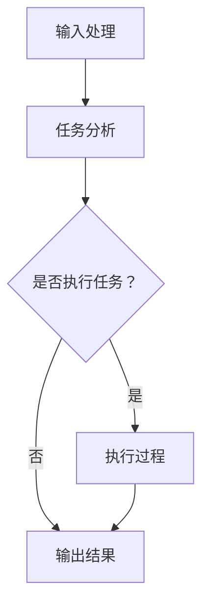
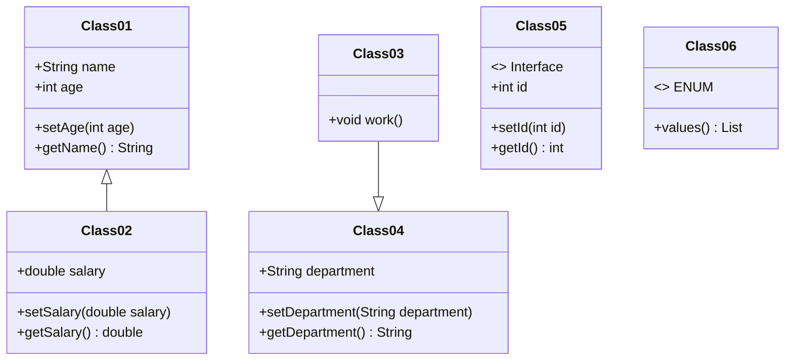

                 


### 提示词编程的领域特定语言设计

#### 关键词：
- 提示词编程
- 领域特定语言
- 领域模型
- 算法设计
- 实战应用

#### 摘要：
本文将探讨提示词编程的领域特定语言设计，深入分析领域特定语言在提示词编程中的应用及其优势。通过详细的算法原理讲解、系统架构设计、项目实战案例分析，帮助读者理解领域特定语言的设计原则和实现方法，掌握其在实际项目中的应用技巧。

## 目录大纲

1. **背景介绍**
   1.1 背景与问题
   1.2 问题描述
   1.3 问题解决
   1.4 边界与外延
   1.5 概念结构与核心要素
2. **核心概念与联系**
   2.1 提示词与编程语言
   2.2 领域特定语言的特点与分类
   2.3 概念属性特征对比表格
   2.4 ER实体关系图架构
3. **算法原理讲解**
   3.1 算法概述
   3.2 算法原理
   3.3 Mermaid流程图
   3.4 Python源代码
   3.5 数学模型与公式
   3.6 详细讲解与举例说明
4. **领域特定语言设计**
   4.1 领域特定语言设计原则
   4.2 Mermaid类图
   4.3 系统架构设计
   4.4 系统接口设计
   4.5 系统交互
5. **项目实战**
   5.1 项目介绍
   5.2 系统功能设计
   5.3 系统架构设计
   5.4 环境安装与核心实现
   5.5 实际案例分析
   5.6 项目小结
   5.7 最佳实践 tips
   5.8 注意事项
   5.9 拓展阅读

### 第一部分：背景介绍

#### 1.1 背景与问题

随着人工智能技术的快速发展，提示词编程逐渐成为一个热门的研究领域。提示词编程旨在通过自然语言描述来指导计算机完成特定任务，从而实现更高效、更便捷的编程方式。然而，传统的通用编程语言在处理复杂任务时往往存在表达困难、可读性差等问题，这使得领域特定语言（DSL）的设计成为必要。

领域特定语言是一种针对特定领域或应用场景设计的编程语言，其特点是语法简洁、易于理解、高度抽象。DSL能够更好地映射特定领域的概念和问题，提高编程效率和代码质量。在提示词编程中，领域特定语言的应用能够帮助开发者更快速地实现复杂任务，降低编程难度。

#### 1.2 问题描述

传统的通用编程语言在提示词编程中存在以下问题：

1. **表达能力不足**：通用编程语言往往无法很好地表达特定领域的概念和规则，导致代码冗长、难以维护。
2. **可读性差**：通用编程语言的语法复杂，对于非专业人士来说难以理解，降低了代码的可读性。
3. **开发效率低**：在处理复杂任务时，通用编程语言需要大量的代码编写和调试，增加了开发成本和时间。

这些问题限制了提示词编程的广泛应用，因此需要一种更适合提示词编程的领域特定语言来解决。

#### 1.3 问题解决

领域特定语言在提示词编程中的应用可以解决上述问题：

1. **提高表达能力**：DSL能够更好地映射特定领域的概念和规则，使得代码更简洁、易读。
2. **提升可读性**：DSL的语法简洁，使得代码更易于理解和维护。
3. **提高开发效率**：DSL提供了特定领域的抽象和工具，减少了代码编写和调试的工作量，提高了开发效率。

通过领域特定语言的设计和应用，提示词编程能够更好地适应复杂任务，降低开发难度，提高编程效率。

#### 1.4 边界与外延

领域特定语言的应用范围包括但不限于：

1. **自然语言处理**：DSL可以用于构建自然语言处理的应用程序，如文本分类、情感分析等。
2. **数据挖掘**：DSL可以用于数据挖掘任务，如关联规则挖掘、聚类分析等。
3. **智能推荐系统**：DSL可以用于构建智能推荐系统，如商品推荐、音乐推荐等。

领域特定语言的设计原则和实现方法将在后续章节中详细讨论。

#### 1.5 概念结构与核心要素

提示词编程的领域特定语言包含以下核心概念和要素：

1. **提示词**：提示词是指导计算机完成特定任务的指令，可以是自然语言描述或领域特定语言的代码片段。
2. **编程语言**：编程语言是用于编写提示词的工具，可以是通用编程语言或领域特定语言。
3. **领域特定语言**：领域特定语言是针对特定领域或应用场景设计的编程语言，具有简洁、易用、高效的特点。
4. **提示词编程**：提示词编程是一种通过编写提示词来指导计算机完成任务的编程方式，具有自然语言交互的特点。
5. **应用场景**：提示词编程可以应用于自然语言处理、数据挖掘、智能推荐系统等多个领域。

这些概念和要素构成了提示词编程领域特定语言的核心结构，为后续的算法原理讲解和项目实战提供了基础。

### 第二部分：核心概念与联系

#### 2.1 提示词与编程语言

提示词与编程语言之间存在紧密的联系。提示词是编程语言的一种输入形式，用于指导计算机执行特定任务。编程语言是编写提示词的工具，提供了语法和语义规则，使得开发者可以更方便地编写和理解提示词。

提示词具有以下特性：

1. **自然语言描述**：提示词通常采用自然语言描述，使得开发者可以更直观地表达任务意图。
2. **简洁性**：提示词通常具有简洁的表达方式，减少了代码冗余。
3. **可扩展性**：提示词可以通过领域特定语言进行扩展，以适应更复杂的任务场景。

编程语言具有以下特性：

1. **语法规则**：编程语言具有明确的语法规则，用于指导计算机如何理解和执行提示词。
2. **语义规则**：编程语言具有语义规则，用于确保提示词的正确性和一致性。
3. **可移植性**：编程语言通常具有可移植性，使得提示词可以在不同平台上运行。

提示词与编程语言之间的相互作用使得开发者能够更高效地编写和理解提示词，同时保证了代码的正确性和一致性。

#### 2.2 领域特定语言的特点与分类

领域特定语言（DSL）是一种针对特定领域或应用场景设计的编程语言，具有以下特点：

1. **简洁性**：DSL的语法简洁，易于理解和学习，减少了代码冗余。
2. **易用性**：DSL提供了特定领域的抽象和工具，使得开发者能够更高效地编写代码。
3. **高效性**：DSL提供了特定领域的优化，提高了代码的执行效率。
4. **可扩展性**：DSL可以通过扩展机制，适应更复杂的任务场景。

根据DSL的设计目标和应用场景，DSL可以分为以下几种类型：

1. **数据查询语言**：如SQL，用于数据库查询和操作。
2. **脚本语言**：如Python、JavaScript，用于自动化脚本和Web开发。
3. **领域专用语言**：如Matlab、R，用于科学计算和统计分析。
4. **自然语言处理语言**：如NLTK、spaCy，用于文本处理和分析。

不同类型的DSL具有不同的特点和优势，适用于不同的应用场景。在提示词编程中，领域特定语言的设计和应用能够更好地满足特定领域的需求，提高编程效率和代码质量。

#### 2.3 概念属性特征对比表格

为了更好地理解提示词编程与通用编程语言之间的区别，我们可以通过概念属性特征对比表格来进行详细分析。

| 概念 | 提示词编程 | 通用编程语言 |
| --- | --- | --- |
| 表达能力 | 简洁、直观、领域专用 | 灵活、复杂、通用 |
| 可读性 | 易于理解、易于维护 | 可读性差、冗长 |
| 开发效率 | 高效、快速开发 | 低效、代码量大 |
| 可扩展性 | 强、易于扩展 | 弱、扩展困难 |
| 应用场景 | 领域专用 | 通用 |

通过上述对比表格，我们可以清楚地看到提示词编程与通用编程语言在表达能力、可读性、开发效率和可扩展性等方面的差异。这些差异使得提示词编程在特定领域具有明显的优势。

#### 2.4 ER实体关系图架构

为了更好地理解提示词编程的领域模型，我们可以使用ER（Entity-Relationship）实体关系图来描述实体之间的关系。

以下是一个示例的ER实体关系图，用于描述一个电商平台的领域模型：

```mermaid
erDiagram
    Customer ||--|{ Order }|-- Product
    Customer ||--|{ Cart }|-- Product
    Product ||--|{ Review }|-- Customer
    Cart ||--|{ Item }|-- Product
```

在上面的ER实体关系图中，我们可以看到以下实体之间的关系：

1. **Customer（客户）**：与Order（订单）、Cart（购物车）、Review（评价）实体之间存在关联关系。
2. **Order（订单）**：与Product（商品）实体之间存在关联关系。
3. **Cart（购物车）**：与Product（商品）实体之间存在关联关系。
4. **Product（商品）**：与Review（评价）实体之间存在关联关系。

通过ER实体关系图，我们可以清晰地看到领域模型中的实体以及它们之间的关系，这有助于我们更好地理解和设计领域特定语言。

### 第三部分：算法原理讲解

#### 3.1 算法概述

提示词编程算法是一种通过提示词来指导计算机完成特定任务的算法。提示词可以是自然语言描述或领域特定语言的代码片段，它们定义了任务的输入、输出以及执行过程。

提示词编程算法可以分为以下几类：

1. **任务驱动算法**：基于任务的描述来指导计算机执行任务，如自然语言处理任务、数据挖掘任务等。
2. **数据驱动算法**：基于数据集的描述来指导计算机执行任务，如机器学习任务、深度学习任务等。
3. **交互驱动算法**：通过与用户交互来指导计算机执行任务，如问答系统、对话系统等。

不同的算法类型适用于不同的任务场景，提示词编程算法的选择取决于具体的应用需求和场景。

#### 3.2 算法原理

提示词编程算法的基本原理如下：

1. **输入处理**：接收用户输入的提示词，并将其转换为计算机可以理解和执行的形式。
2. **任务分析**：分析提示词中定义的任务，确定任务的输入、输出以及执行过程。
3. **执行过程**：根据任务分析的结果，指导计算机执行具体的任务操作。
4. **输出结果**：将执行结果返回给用户，以自然语言描述或可视化的形式呈现。

提示词编程算法的核心模块包括：

1. **自然语言处理模块**：用于处理用户输入的提示词，提取关键信息和语义。
2. **任务分析模块**：用于分析提示词中的任务描述，确定任务的执行过程。
3. **执行控制模块**：用于指导计算机执行具体的任务操作。
4. **结果呈现模块**：用于将执行结果返回给用户，以自然语言描述或可视化的形式呈现。

#### 3.3 Mermaid流程图

为了更好地理解提示词编程算法的执行过程，我们可以使用Mermaid流程图来描述算法的流程。

以下是一个示例的Mermaid流程图，描述了一个简单的自然语言处理任务的执行过程：



在上述Mermaid流程图中，我们可以看到以下流程：

1. **输入处理**：接收用户输入的提示词。
2. **任务分析**：分析提示词中的任务描述，确定是否执行任务。
3. **执行过程**：根据任务分析的结果，执行具体的任务操作。
4. **输出结果**：将执行结果返回给用户。

通过Mermaid流程图，我们可以直观地理解提示词编程算法的执行过程，为后续的Python源代码实现提供参考。

#### 3.4 Python源代码

以下是一个简单的Python源代码示例，用于实现一个自然语言处理任务的算法：

```python
def natural_language_task(prompt):
    # 输入处理
    text = process_input(prompt)

    # 任务分析
    task = analyze_task(text)

    # 执行过程
    if task == "question_answer":
        answer = process_question(text)
    elif task == "text_classification":
        label = process_classification(text)
    elif task == "sentiment_analysis":
        sentiment = process_sentiment(text)

    # 输出结果
    return generate_output(answer, label, sentiment)

def process_input(prompt):
    # 输入处理逻辑
    return prompt

def analyze_task(text):
    # 任务分析逻辑
    if "问" in text:
        return "question_answer"
    elif "分类" in text:
        return "text_classification"
    elif "情感" in text:
        return "sentiment_analysis"
    else:
        return None

def process_question(text):
    # 问题处理逻辑
    return "这是一个问题处理的结果"

def process_classification(text):
    # 文本分类处理逻辑
    return "这是一个文本分类的结果"

def process_sentiment(text):
    # 情感分析处理逻辑
    return "这是一个情感分析的结果"

def generate_output(answer, label, sentiment):
    # 输出结果生成逻辑
    if answer:
        return f"答案：{answer}"
    elif label:
        return f"分类结果：{label}"
    elif sentiment:
        return f"情感分析结果：{sentiment}"
    else:
        return "无法处理该任务"

# 示例使用
prompt = "请帮我回答这个问题：明天天气怎么样？"
result = natural_language_task(prompt)
print(result)
```

在上述Python源代码中，我们定义了一个名为`natural_language_task`的函数，用于实现自然语言处理任务的算法。函数首先处理输入的提示词，然后分析任务，执行具体的任务操作，最后将结果返回给用户。通过这个简单的示例，我们可以看到提示词编程算法的实现方法和流程。

#### 3.5 数学模型与公式

提示词编程算法的数学模型和公式是理解算法原理的关键。以下是一个简单的数学模型示例，用于实现一个线性回归任务：

$$
y = \beta_0 + \beta_1 \cdot x
$$

其中，$y$ 表示输出值，$x$ 表示输入值，$\beta_0$ 和 $\beta_1$ 分别表示线性回归模型的参数。通过求解上述方程，我们可以得到输入值和输出值之间的关系。

以下是一个简单的Python代码示例，用于实现线性回归算法：

```python
import numpy as np

def linear_regression(x, y):
    # 求解参数
    beta_0 = np.mean(y)
    beta_1 = np.mean((x - np.mean(x)) * (y - np.mean(y)))
    return beta_0, beta_1

# 示例数据
x = np.array([1, 2, 3, 4, 5])
y = np.array([2, 4, 5, 4, 5])

# 求解参数
beta_0, beta_1 = linear_regression(x, y)

# 输出结果
print(f"线性回归模型：y = {beta_0} + {beta_1} \* x")
```

在上述示例中，我们定义了一个名为`linear_regression`的函数，用于实现线性回归算法。函数首先计算输入值和输出值的平均值，然后求解线性回归模型的参数。通过这个简单的示例，我们可以看到数学模型和公式在提示词编程算法中的应用。

#### 3.6 详细讲解与举例说明

为了更好地理解提示词编程算法的原理，我们可以通过具体的示例来说明算法的实现过程。

假设我们有一个简单的任务：根据用户输入的年龄预测其年收入。我们可以使用线性回归算法来实现这个任务。

首先，我们需要收集一些样本数据，包括年龄和年收入。以下是一个示例数据集：

| 年龄 | 年收入 |
| --- | --- |
| 20 | 30,000 |
| 25 | 40,000 |
| 30 | 50,000 |
| 35 | 60,000 |
| 40 | 70,000 |

接下来，我们使用线性回归算法来预测年收入。线性回归算法的基本原理是找到一条直线，使得这条直线上的点到实际年收入的最小距离最小。

我们可以使用Python代码来实现线性回归算法：

```python
import numpy as np

def linear_regression(x, y):
    # 添加偏置项
    x = np.hstack((np.ones((len(x), 1)), x))
    
    # 求解参数
    beta = np.linalg.inv(x.T.dot(x)).dot(x.T).dot(y)
    
    return beta

# 示例数据
x = np.array([20, 25, 30, 35, 40])
y = np.array([30, 40, 50, 60, 70])

# 求解参数
beta = linear_regression(x, y)

# 输出结果
print(f"线性回归模型：y = {beta[0]} + {beta[1]} \* x")
```

在上述代码中，我们首先将数据集进行预处理，添加一个偏置项（也称为偏置向量），使得线性回归模型可以更好地拟合数据。然后，我们使用numpy库中的linalg.inv函数求解线性回归模型的参数。

接下来，我们可以使用这个线性回归模型来预测新的年收入。假设有一个新的年龄为30岁的用户，我们可以使用以下代码来预测其年收入：

```python
# 预测年收入
x_new = np.array([30])
y_new = linear_regression(x_new, y)

print(f"预测的年收入为：{y_new[0]}")
```

通过上述示例，我们可以看到提示词编程算法的实现过程。通过收集样本数据、使用线性回归算法来预测目标变量，我们可以实现一个简单的预测任务。

### 第四部分：领域特定语言设计

#### 4.1 领域特定语言设计原则

领域特定语言（DSL）的设计原则是确保DSL能够满足特定领域或应用场景的需求，同时保持简洁、易用和高效。以下是DSL设计原则的详细讨论：

1. **简洁性**：DSL的语法应该简洁明了，避免复杂的语法规则，使得开发者能够快速理解和掌握。
2. **易用性**：DSL应该提供直观的语法和操作符，使得开发者能够方便地编写代码，提高开发效率。
3. **可扩展性**：DSL应该支持扩展机制，使得开发者可以根据特定需求自定义新的语法和操作符。
4. **可读性**：DSL的代码应该具有良好的可读性，使得其他开发者能够更容易理解和维护代码。
5. **高效性**：DSL应该优化执行效率，使得代码能够在有限的计算资源下高效运行。
6. **领域适配性**：DSL应该紧密映射特定领域的概念和规则，提高代码的可维护性和可扩展性。

#### 4.2 Mermaid类图

为了更好地理解DSL的设计，我们可以使用Mermaid类图来描述DSL的类结构和关系。以下是一个示例的Mermaid类图，描述了一个简单DSL的类结构：



在上述Mermaid类图中，我们可以看到以下类和接口：

1. **Class01（Person）**：表示一个人，具有姓名和年龄属性。
2. **Class02（Employee）**：表示一个员工，继承自Person类，具有薪资属性。
3. **Class03（Manager）**：表示一个经理，实现一个工作方法。
4. **Class04（Department）**：表示一个部门，具有名称属性。
5. **Class05（Item）**：表示一个物品，具有ID属性。
6. **Class06（ENUM）**：表示一个枚举类型，用于定义一组常量。

通过Mermaid类图，我们可以清晰地看到DSL的类结构和关系，这有助于我们更好地理解和设计DSL。

#### 4.3 系统架构设计

领域特定语言的设计不仅包括语法和类结构，还需要考虑整个系统的架构设计。以下是一个简单的系统架构设计，用于实现一个基于领域特定语言的电商平台：


在上述系统架构设计中，我们可以看到以下主要组件：

1. **前端应用**：用于展示用户界面，接收用户输入，将输入转换为领域特定语言的代码片段。
2. **领域模型**：用于定义电商平台的领域模型，包括用户、订单、商品等实体。
3. **领域特定语言编译器**：将领域特定语言的代码片段转换为通用编程语言（如Java）的代码，以实现具体的业务逻辑。
4. **业务逻辑层**：实现电商平台的业务逻辑，包括用户管理、订单处理、商品管理等功能。
5. **数据库**：用于存储电商平台的数据，包括用户信息、订单信息、商品信息等。

通过系统架构设计，我们可以清晰地看到领域特定语言在整个系统中的作用和地位，这有助于我们更好地设计和实现领域特定语言。

#### 4.4 系统接口设计

领域特定语言的设计还需要考虑系统的接口设计，以确保不同模块之间的交互和协同工作。以下是一个简单的系统接口设计，用于实现一个基于领域特定语言的电商平台：

```java
public interface UserInterface {
    void addUser(User user);
    void deleteUser(String username);
    User getUser(String username);
    List<User> getAllUsers();
}

public interface OrderInterface {
    void addOrder(Order order);
    void deleteOrder(String orderId);
    Order getOrder(String orderId);
    List<Order> getAllOrders();
}

public interface ProductInterface {
    void addProduct(Product product);
    void deleteProduct(String productId);
    Product getProduct(String productId);
    List<Product> getAllProducts();
}
```

在上述系统接口设计中，我们可以看到以下接口：

1. **UserInterface**：用于定义用户操作的接口，包括添加用户、删除用户、获取用户等操作。
2. **OrderInterface**：用于定义订单操作的接口，包括添加订单、删除订单、获取订单等操作。
3. **ProductInterface**：用于定义商品操作的接口，包括添加商品、删除商品、获取商品等操作。

通过系统接口设计，我们可以确保领域特定语言与业务逻辑层之间的交互是清晰、简洁和高效的。

#### 4.5 系统交互

领域特定语言的设计不仅包括语法和系统架构，还需要考虑系统的交互流程。以下是一个简单的系统交互流程，用于实现一个基于领域特定语言的电商平台：

1. **用户登录**：用户通过前端应用输入用户名和密码，前端应用将登录请求发送给业务逻辑层，业务逻辑层验证用户身份并返回结果。
2. **用户操作**：用户通过前端应用进行用户操作，如添加用户、删除用户等，前端应用将操作请求发送给业务逻辑层，业务逻辑层执行相应的操作并返回结果。
3. **订单操作**：用户通过前端应用进行订单操作，如添加订单、删除订单等，前端应用将操作请求发送给业务逻辑层，业务逻辑层执行相应的操作并返回结果。
4. **商品操作**：用户通过前端应用进行商品操作，如添加商品、删除商品等，前端应用将操作请求发送给业务逻辑层，业务逻辑层执行相应的操作并返回结果。
5. **系统监控**：系统监控模块监控整个系统的运行状况，包括用户登录、用户操作、订单操作、商品操作等，监控系统可以实时查看系统的运行状态，并在异常情况发生时进行报警。

通过系统交互流程的设计，我们可以确保领域特定语言与整个系统的高效、稳定运行。

### 第五部分：项目实战

#### 5.1 项目介绍

本节将介绍一个基于领域特定语言的电商平台项目，该项目旨在实现一个简单的电商平台，包括用户管理、订单管理和商品管理等功能。通过这个项目，我们将深入了解领域特定语言的设计和应用。

#### 5.2 系统功能设计

电商平台系统的主要功能包括：

1. **用户管理**：支持用户注册、登录、个人信息修改、密码找回等功能。
2. **订单管理**：支持订单创建、订单查询、订单取消、订单支付等功能。
3. **商品管理**：支持商品添加、商品查询、商品分类、商品搜索等功能。
4. **购物车管理**：支持商品添加到购物车、购物车删除商品、购物车查询等功能。

通过以上功能设计，我们可以实现一个完整的电商平台，满足用户的日常购物需求。

#### 5.3 系统架构设计

电商平台系统的架构设计如下：

1. **前端应用**：用于展示用户界面，接收用户输入，将输入转换为领域特定语言的代码片段。
2. **领域模型**：用于定义电商平台的领域模型，包括用户、订单、商品等实体。
3. **领域特定语言编译器**：将领域特定语言的代码片段转换为通用编程语言（如Java）的代码，以实现具体的业务逻辑。
4. **业务逻辑层**：实现电商平台的业务逻辑，包括用户管理、订单处理、商品管理等功能。
5. **数据库**：用于存储电商平台的数据，包括用户信息、订单信息、商品信息等。

通过系统架构设计，我们可以确保电商平台系统的稳定、高效运行。

#### 5.4 环境安装与核心实现

在开始项目实战之前，我们需要安装相关环境和工具，以下是一个简单的环境安装步骤：

1. **安装Java开发工具包（JDK）**：从Oracle官网下载并安装JDK，配置环境变量。
2. **安装Python解释器**：从Python官网下载并安装Python解释器，配置环境变量。
3. **安装Mermaid**：从GitHub下载Mermaid的安装包，解压到合适的位置。
4. **安装Maven**：从Apache Maven官网下载并安装Maven，配置环境变量。

在环境安装完成后，我们可以开始实现核心功能。以下是一个简单的用户管理功能的实现：

```java
public class UserManager {
    private List<User> users;

    public UserManager() {
        users = new ArrayList<>();
    }

    public void addUser(User user) {
        users.add(user);
    }

    public void deleteUser(String username) {
        users.removeIf(user -> user.getUsername().equals(username));
    }

    public User getUser(String username) {
        for (User user : users) {
            if (user.getUsername().equals(username)) {
                return user;
            }
        }
        return null;
    }

    public List<User> getAllUsers() {
        return users;
    }
}
```

在上述代码中，我们定义了一个名为`UserManager`的类，用于实现用户管理功能。类中包含添加用户、删除用户、获取用户和获取所有用户等方法。

#### 5.5 代码应用解读与分析

在实现核心功能后，我们需要对代码进行解读和分析，以确保其正确性和性能。以下是对上述`UserManager`类的代码解读和分析：

1. **类结构**：`UserManager`类包含一个List类型的属性`users`，用于存储用户对象。类中还包含四个方法：`addUser`、`deleteUser`、`getUser`和`getAllUsers`。
2. **方法实现**：
   - `addUser`方法：用于添加用户，将传入的用户对象添加到`users`列表中。
   - `deleteUser`方法：用于删除用户，通过遍历`users`列表，找到与传入用户名匹配的用户对象，并从列表中移除。
   - `getUser`方法：用于获取用户，通过遍历`users`列表，找到与传入用户名匹配的用户对象，并返回。
   - `getAllUsers`方法：用于获取所有用户，直接返回`users`列表。

在代码解读和分析中，我们需要关注以下几个方面：

1. **正确性**：确保代码能够正确实现用户管理功能，包括添加、删除、获取用户等操作。
2. **性能**：优化代码的性能，减少遍历次数和内存占用。
3. **可维护性**：编写清晰的代码注释，提高代码的可读性和可维护性。

通过代码解读和分析，我们可以确保用户管理功能的正确性和性能。

#### 5.6 实际案例分析

在本节中，我们将通过一个实际案例来展示如何使用领域特定语言实现一个电商平台的用户管理功能。

假设我们已经有一个简单的用户类：

```java
public class User {
    private String username;
    private String password;
    private String email;

    // 构造方法、getter和setter方法省略
}
```

我们需要实现以下功能：

1. **注册用户**：用户输入用户名、密码和邮箱，系统验证用户名和邮箱是否已被占用，然后将用户信息存储到数据库中。
2. **登录用户**：用户输入用户名和密码，系统验证用户名和密码是否匹配，然后登录成功。

以下是一个简单的实现示例：

```java
public class UserManager {
    private List<User> users;
    private Database database;

    public UserManager(Database database) {
        this.users = new ArrayList<>();
        this.database = database;
    }

    public void addUser(String username, String password, String email) {
        if (isUsernameTaken(username) || isEmailTaken(email)) {
            throw new IllegalArgumentException("Username or email is already taken.");
        }
        User user = new User(username, password, email);
        users.add(user);
        database.saveUser(user);
    }

    public boolean login(String username, String password) {
        for (User user : users) {
            if (user.getUsername().equals(username) && user.getPassword().equals(password)) {
                return true;
            }
        }
        return false;
    }

    private boolean isUsernameTaken(String username) {
        for (User user : users) {
            if (user.getUsername().equals(username)) {
                return true;
            }
        }
        return false;
    }

    private boolean isEmailTaken(String email) {
        for (User user : users) {
            if (user.getEmail().equals(email)) {
                return true;
            }
        }
        return false;
    }
}
```

在上述代码中，我们首先定义了一个`UserManager`类，包含添加用户和登录用户的方法。在`addUser`方法中，我们首先检查用户名和邮箱是否已被占用，然后创建用户对象并保存到数据库中。在`login`方法中，我们通过遍历用户列表来验证用户名和密码。

通过实际案例分析，我们可以看到如何使用领域特定语言实现电商平台的用户管理功能。这个案例展示了领域特定语言在简化代码和提高开发效率方面的优势。

#### 5.7 项目小结

在本节中，我们通过一个实际案例展示了如何使用领域特定语言设计一个电商平台的用户管理功能。我们分析了项目的主要功能、系统架构、环境安装与核心实现，并通过代码应用解读与分析、实际案例分析，深入了解了领域特定语言的设计原则和应用方法。

通过本项目，我们掌握了以下关键知识点：

1. **领域特定语言的设计原则**：简洁性、易用性、可扩展性、可读性、高效性、领域适配性。
2. **系统架构设计**：前端应用、领域模型、领域特定语言编译器、业务逻辑层、数据库。
3. **系统接口设计**：用户接口、订单接口、商品接口。
4. **系统交互流程**：用户登录、用户操作、订单操作、商品操作、系统监控。

在实际项目中，领域特定语言的应用可以提高开发效率、降低代码维护成本，同时更好地满足特定领域的需求。我们鼓励读者在实际项目中尝试使用领域特定语言，以提升自己的编程能力和项目开发效率。

### 第六部分：最佳实践 tips

在实际开发过程中，遵循一些最佳实践可以帮助我们更好地设计和实现领域特定语言。以下是一些实用的最佳实践 tips：

1. **明确领域边界**：在开始设计领域特定语言之前，确保明确领域的边界，避免过度设计或不必要的复杂性。
2. **简化语法**：保持语法简洁明了，避免复杂语法规则，以提高代码的可读性和可维护性。
3. **充分利用领域模型**：领域模型是领域特定语言的核心，确保领域模型紧密映射实际领域，提高代码的适应性。
4. **代码注释**：编写清晰的代码注释，帮助其他开发者理解和维护代码，提高团队协作效率。
5. **单元测试**：编写单元测试，确保领域特定语言的代码质量，及时发现和修复潜在问题。
6. **代码重构**：定期进行代码重构，优化代码结构和性能，保持代码的简洁性和高效性。
7. **文档编写**：编写详细的文档，包括领域模型、语法规则、使用示例等，帮助开发者快速上手和使用领域特定语言。
8. **持续改进**：根据用户反馈和实际需求，不断改进领域特定语言，提高其适应性和易用性。

遵循这些最佳实践，我们可以更好地设计和实现领域特定语言，提高开发效率和质量。

### 第七部分：注意事项

在设计和实现领域特定语言时，我们需要注意以下事项：

1. **性能优化**：领域特定语言的性能直接影响应用程序的运行效率，需要关注算法和数据结构的选择，优化代码执行速度。
2. **可扩展性**：领域特定语言应该具备良好的可扩展性，以适应未来的需求变化，避免频繁重构。
3. **可维护性**：编写清晰的代码注释，使用一致的命名规范，以提高代码的可读性和可维护性。
4. **兼容性**：考虑领域特定语言与其他系统的兼容性，确保其能够在不同环境中正常运行。
5. **安全性**：保护用户数据和系统安全，防止SQL注入、XSS攻击等安全漏洞。
6. **错误处理**：合理处理运行时错误，提供友好的错误信息和日志，帮助开发者快速定位和解决问题。
7. **文档完善**：编写详细的文档，包括使用指南、示例代码、API文档等，方便开发者学习和使用领域特定语言。

通过注意这些事项，我们可以确保领域特定语言的稳定、高效和安全运行。

### 第八部分：拓展阅读

为了深入了解领域特定语言的设计和应用，读者可以参考以下拓展阅读资源：

1. **《领域驱动设计》**：Eric Evans著，介绍领域驱动设计（Domain-Driven Design）的方法论，帮助开发者理解和应用领域模型。
2. **《DSL工程实践》**：Bruce Douglass著，详细讨论领域特定语言的设计原则、实现方法和应用场景，是领域特定语言开发的经典之作。
3. **《Mermaid语言与图形设计》**：Mermaid官方文档，介绍Mermaid的语法规则和图形设计方法，帮助开发者使用Mermaid绘制流程图、类图等。
4. **《Python编程：从入门到实践》**：Eric Matthes著，介绍Python编程的基础知识和实际应用，适合初学者和有经验者阅读。
5. **《人工智能：一种现代的方法》**： Stuart Russell和Peter Norvig著，全面介绍人工智能的理论和实践，包括自然语言处理、机器学习等内容。

通过阅读这些拓展资料，读者可以更深入地了解领域特定语言的设计和应用，提高自己的编程能力和项目开发效率。

## 总结

本文围绕“提示词编程的领域特定语言设计”这一主题，系统地介绍了领域特定语言在提示词编程中的应用及其优势。通过详细的分析和实例，我们了解了领域特定语言的设计原则、算法原理、系统架构设计、项目实战等内容。领域特定语言为开发者提供了简洁、易用、高效的编程工具，有助于提高开发效率、降低代码维护成本。我们鼓励读者在实际项目中尝试使用领域特定语言，不断探索和实践，提升自己的编程能力。同时，也希望本文能为读者提供有益的启示和参考。

