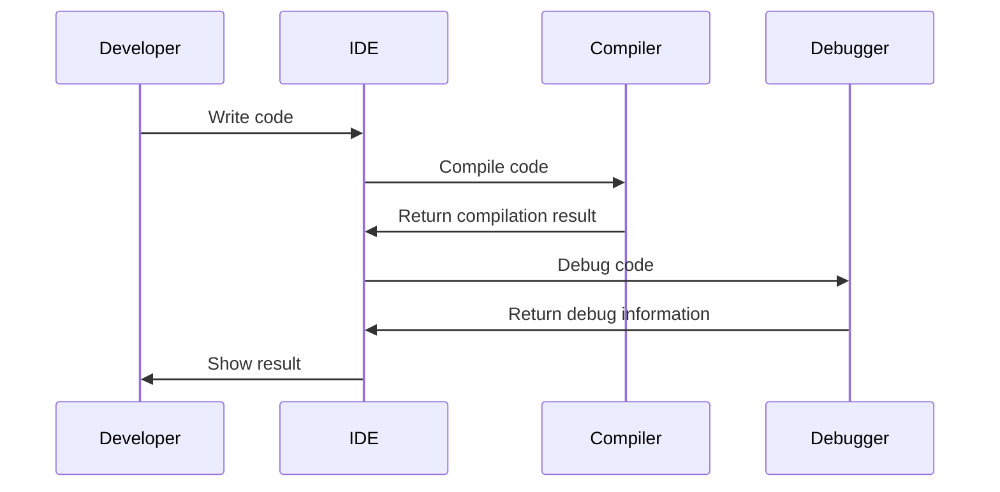

                 

# 《提示词编程语言的IDE设计与开发》

## 关键词

- 提示词编程语言
- IDE设计与开发
- 编码辅助功能
- 界面设计与用户体验
- 生态系统建设
- 技术发展趋势

## 摘要

本文旨在探讨提示词编程语言的IDE设计与开发，详细解析其核心功能、界面设计、用户体验优化以及未来发展趋势。首先，我们将介绍提示词编程语言的基础知识，包括其发展背景、核心特点和应用场景。随后，本文将重点讨论IDE设计与开发的原则、流程以及核心功能，如提示词生成机制、编码辅助功能、代码调试与优化等。接下来，我们将探讨IDE的界面设计与用户体验优化，包括界面设计原则、用户体验优化策略和用户反馈与改进。随后，本文将介绍提示词编程语言的IDE开发实战，包括开发环境搭建、核心功能实现、界面设计与优化以及功能测试与优化。最后，本文将分析提示词编程语言的IDE生态系统建设，探讨其重要性、建设策略和持续优化。通过本文的深入探讨，读者将全面了解提示词编程语言的IDE设计与开发，为其在实际项目中的应用提供指导。

### 第一部分：提示词编程语言基础

#### 第1章：提示词编程语言概述

提示词编程语言是一种能够自动提供编程提示的编程语言，它通过分析上下文和编程习惯，为开发者提供一系列建议和辅助功能。本章节将详细探讨提示词编程语言的发展背景、核心特点和应用场景。

#### 1.1 提示词编程语言的发展背景

编程语言的发展经历了从低级语言到高级语言，再到智能化编程语言的演变过程。随着计算机技术的发展，编程语言的智能化程度逐渐提高，为开发者提供了更加便捷和高效的编程体验。提示词编程语言正是这一趋势下的产物，它通过自动提示功能，大大提高了编程的效率和代码的可读性。

#### 1.1.1 编程语言的发展历程

- **低级语言**：如汇编语言，直接操作硬件，但复杂且易出错。
- **高级语言**：如C、C++，提供了更抽象的编程模型，提高了编程效率。
- **智能化编程语言**：如Python、Java，集成了更多编程工具和库，进一步提高了开发效率。

#### 1.1.2 提示词编程语言的概念

提示词编程语言是一种具有自动提示功能的编程语言，它能够根据上下文和编程习惯，为开发者提供代码片段、变量名称、函数调用等提示。通过这些提示，开发者可以更快地编写代码，减少错误，提高编程效率。

#### 1.1.3 提示词编程语言的优势

- **提高编程效率**：通过自动提示，开发者可以更快地找到所需的代码片段，减少了搜索和修改的时间。
- **增强代码可读性**：自动提示可以帮助开发者更好地理解和组织代码，提高了代码的可读性。
- **减少错误**：自动提示可以减少因输入错误导致的编译错误和运行错误。

#### 1.2 提示词编程语言的核心特点

提示词编程语言的核心特点主要体现在以下几个方面：

#### 1.2.1 自动提示功能

自动提示功能是提示词编程语言的核心，它通过分析上下文，为开发者提供实时的编程建议。自动提示功能可以分为以下几种：

- **代码片段提示**：根据上下文，提供相关的代码片段。
- **变量名称提示**：根据上下文，提供可能的变量名称。
- **函数调用提示**：根据上下文，提供可能的函数调用。

#### 1.2.2 提高编程效率

通过自动提示功能，开发者可以更快地编写代码，减少了搜索和修改的时间。此外，自动提示功能还可以帮助开发者更好地理解和组织代码，提高了编程效率。

#### 1.2.3 代码可读性增强

自动提示功能可以帮助开发者更好地理解和组织代码，提高了代码的可读性。同时，自动提示还可以减少因输入错误导致的编译错误和运行错误。

#### 1.3 提示词编程语言的应用场景

提示词编程语言广泛应用于各个领域，主要包括以下几个方面：

#### 1.3.1 开发者工具

提示词编程语言可以作为开发者工具的一部分，为开发者提供编程提示和辅助功能。例如，在代码编辑器中集成提示词编程语言，可以大大提高开发效率。

#### 1.3.2 教育培训

提示词编程语言可以用于编程教育和培训，帮助初学者更快地掌握编程知识。通过自动提示功能，初学者可以更容易地编写代码，减少学习成本。

#### 1.3.3 智能交互

提示词编程语言可以应用于智能交互领域，如智能音箱、智能客服等。通过自动提示功能，可以提高交互的效率和用户体验。

#### 第2章：IDE设计与开发概述

IDE（集成开发环境）是一种集成了代码编辑器、编译器、调试器等多种工具的软件开发环境。本章节将介绍IDE的定义与功能，探讨IDE的设计原则和开发流程。

#### 2.1 IDE的定义与功能

IDE是一种用于软件开发的环境，它集成了代码编辑器、编译器、调试器等多种工具，为开发者提供了方便的编程体验。IDE的主要功能包括：

- **代码编辑**：提供代码编辑器，方便开发者编写和修改代码。
- **编译**：将代码编译成可执行的程序。
- **调试**：提供调试工具，帮助开发者发现和修复代码错误。
- **项目管理**：管理项目文件和依赖关系。

#### 2.1.1 IDE的概念

IDE（Integrated Development Environment）是一种软件开发环境，它将代码编辑器、编译器、调试器等多种工具集成在一起，为开发者提供了一个统一的编程界面。

#### 2.1.2 IDE的基本功能

IDE的基本功能包括：

- **代码编辑器**：提供文本编辑功能，支持代码格式化、代码折叠等功能。
- **编译器**：将代码编译成可执行程序，支持不同的编程语言。
- **调试器**：提供调试工具，帮助开发者发现和修复代码错误。
- **项目管理器**：管理项目文件和依赖关系，支持项目管理功能。

#### 2.1.3 IDE的发展趋势

随着技术的发展，IDE也在不断进化。当前IDE的发展趋势主要包括：

- **智能化**：集成人工智能技术，提供智能代码提示、智能修复等功能。
- **云端开发**：支持云端开发，方便开发者远程协作和共享代码。
- **跨平台支持**：支持多种操作系统和编程语言，提供跨平台的开发环境。

#### 2.2 IDE的设计原则

一个好的IDE应该具备以下设计原则：

- **用户友好性**：界面简洁、易用，提供丰富的快捷键和工具栏。
- **功能完备性**：提供全面的编程工具和功能，满足开发者的各种需求。
- **代码编辑器优化**：提供高效的代码编辑器，支持代码格式化、代码折叠等功能。

#### 2.2.1 用户友好性

用户友好性是IDE设计的重要原则，一个优秀的IDE应该具备以下特点：

- **简洁的界面**：界面简洁，容易上手，减少用户的学习成本。
- **丰富的快捷键**：提供丰富的快捷键，提高开发效率。
- **工具栏**：提供直观的工具栏，方便用户快速访问常用功能。

#### 2.2.2 功能完备性

功能完备性是IDE设计的关键，一个优秀的IDE应该提供以下功能：

- **代码编辑器**：支持多种编程语言，提供代码格式化、代码折叠等功能。
- **编译器**：支持多种编译器，提供编译错误提示和调试功能。
- **调试器**：提供断点调试、性能分析等功能，帮助开发者发现和修复代码错误。
- **项目管理器**：支持项目管理，方便用户管理项目文件和依赖关系。

#### 2.2.3 代码编辑器优化

代码编辑器是IDE的核心组成部分，一个好的代码编辑器应该具备以下特点：

- **高效的代码输入**：支持代码自动完成、代码模板等功能，提高代码输入效率。
- **代码格式化**：自动格式化代码，保持代码的一致性和可读性。
- **代码折叠**：支持代码折叠，方便用户查看代码结构和层次。

#### 2.3 IDE的开发流程

IDE的开发流程主要包括以下几个阶段：

- **需求分析**：分析用户需求，确定IDE的功能和特性。
- **系统设计**：设计IDE的系统架构和模块划分。
- **编码实现**：编写代码，实现IDE的功能。
- **测试与优化**：测试IDE的功能，优化性能和用户体验。

#### 2.3.1 需求分析

需求分析是IDE开发的第一步，其主要任务是分析用户需求，确定IDE的功能和特性。需求分析的方法包括：

- **访谈**：与用户进行访谈，了解他们的需求和期望。
- **问卷调查**：通过问卷调查，收集用户的需求和反馈。
- **用户观察**：观察用户在使用现有IDE时的行为和痛点。

#### 2.3.2 系统设计

系统设计是IDE开发的关键步骤，其主要任务是设计IDE的系统架构和模块划分。系统设计的方法包括：

- **UML图**：使用UML图（如类图、序列图等）描述系统架构和模块关系。
- **功能模块划分**：根据需求分析的结果，将系统划分为多个功能模块。
- **接口设计**：设计各个模块之间的接口，确保模块之间的交互和协作。

#### 2.3.3 编码实现

编码实现是IDE开发的核心步骤，其主要任务是根据系统设计，编写代码实现IDE的功能。编码实现的方法包括：

- **模块化编程**：将系统划分为多个模块，每个模块分别实现。
- **代码规范**：遵循代码规范，提高代码的可读性和可维护性。
- **代码审查**：进行代码审查，确保代码的质量和安全性。

#### 2.3.4 测试与优化

测试与优化是IDE开发的最后一个阶段，其主要任务是测试IDE的功能，优化性能和用户体验。测试与优化的方法包括：

- **功能测试**：测试IDE的功能，确保其能够正常运行。
- **性能测试**：测试IDE的性能，确保其在各种场景下都能提供良好的性能。
- **用户体验优化**：根据用户反馈，优化用户体验，提高用户满意度。

### 第二部分：提示词编程语言的IDE核心功能

#### 第3章：提示词生成机制

提示词生成机制是提示词编程语言的IDE核心功能之一，它通过分析上下文和编程习惯，为开发者提供实时的编程提示。本章节将详细介绍提示词生成机制的工作原理、实现方法及其优化策略。

#### 3.1 提示词生成机制概述

提示词生成机制是指IDE在编写代码时，根据上下文和编程习惯，自动为开发者提供提示词的功能。提示词生成机制的核心目标是提高开发效率，减少编码错误，提升代码质量。

#### 3.1.1 工作原理

提示词生成机制的工作原理主要包括以下几个步骤：

1. **上下文分析**：IDE会分析当前的代码上下文，包括变量、函数、类等元素。
2. **规则匹配**：根据预设的规则，匹配可能的提示词。
3. **提示词生成**：根据规则匹配的结果，生成相应的提示词。
4. **实时反馈**：将生成的提示词实时反馈给开发者，供其参考。

#### 3.1.2 实现方法

提示词生成机制的具体实现方法可以分为以下几个部分：

1. **词法分析**：对代码进行词法分析，提取出变量、函数、类等元素。
2. **语法分析**：对提取出的元素进行语法分析，构建语法树。
3. **规则库**：建立规则库，包含各种可能的提示词规则。
4. **提示词生成**：根据语法树和规则库，生成提示词。

#### 3.1.3 优化策略

为了提高提示词生成机制的效率和准确性，可以采用以下优化策略：

1. **缓存机制**：利用缓存机制，减少重复的上下文分析和规则匹配操作。
2. **算法优化**：采用高效的算法，提高提示词生成速度。
3. **机器学习**：利用机器学习技术，根据开发者的编程习惯和代码风格，自适应地优化提示词生成。

#### 3.2 基于上下文的提示词生成

基于上下文的提示词生成是提示词生成机制的核心部分，它主要根据当前代码的上下文环境，为开发者提供相关的提示词。基于上下文的提示词生成可以分为以下几个步骤：

1. **识别上下文元素**：识别当前代码中的变量、函数、类等元素。
2. **分析上下文关系**：分析上下文元素之间的关系，如变量依赖、函数调用等。
3. **生成提示词**：根据上下文关系，生成相关的提示词。

#### 3.2.1 变量提示词生成

变量提示词生成是提示词生成机制的重要组成部分，它可以为开发者提供变量名、变量类型、变量作用域等提示词。变量提示词生成可以分为以下几个步骤：

1. **变量识别**：识别当前代码中的变量。
2. **类型推断**：根据变量的使用上下文，推断变量类型。
3. **作用域分析**：分析变量的作用域，确定变量的有效范围。
4. **生成提示词**：根据变量类型和作用域，生成相应的变量提示词。

#### 3.2.2 函数提示词生成

函数提示词生成是提示词生成机制的另一个重要部分，它可以为开发者提供函数名、函数参数、函数返回类型等提示词。函数提示词生成可以分为以下几个步骤：

1. **函数识别**：识别当前代码中的函数。
2. **参数识别**：识别函数的参数。
3. **返回类型推断**：根据函数的实现，推断函数的返回类型。
4. **生成提示词**：根据函数名、参数和返回类型，生成相应的函数提示词。

#### 3.3 基于历史数据的提示词优化

除了基于上下文的提示词生成，还可以利用历史数据对提示词进行优化。基于历史数据的提示词优化主要包括以下几个方面：

1. **用户行为分析**：分析开发者的编程习惯和喜好，为用户提供个性化的提示词。
2. **频率统计**：统计开发者常用的高频函数、变量等，优化提示词的优先级。
3. **错误修正**：根据开发者的错误修正记录，提供更准确的提示词。

#### 3.3.1 用户行为分析

用户行为分析是提示词优化的重要手段，通过分析开发者的编程行为和习惯，可以为用户提供更加个性化的提示词。用户行为分析可以分为以下几个步骤：

1. **数据收集**：收集开发者的编程行为数据，如代码提交记录、错误修正记录等。
2. **行为分析**：对收集到的数据进行统计分析，找出开发者的编程习惯和喜好。
3. **个性化提示词生成**：根据用户行为分析的结果，生成个性化的提示词。

#### 3.3.2 频率统计

频率统计是提示词优化的另一种重要手段，通过统计开发者常用的高频函数、变量等，可以优化提示词的优先级。频率统计可以分为以下几个步骤：

1. **数据收集**：收集开发者的编程行为数据，如代码提交记录、错误修正记录等。
2. **频率计算**：计算高频函数、变量的使用频率。
3. **提示词优先级优化**：根据频率计算的结果，优化提示词的优先级。

#### 3.3.3 错误修正

错误修正是提示词优化的重要组成部分，通过分析开发者的错误修正记录，可以提供更准确的提示词。错误修正可以分为以下几个步骤：

1. **错误记录收集**：收集开发者的错误修正记录，如错误代码、修正代码等。
2. **错误类型分析**：分析错误记录，确定常见的错误类型。
3. **提示词优化**：根据错误类型分析的结果，优化提示词，提供更准确的提示。

### 第三部分：IDE的界面设计与用户体验

#### 第4章：IDE的界面设计与用户体验

IDE的界面设计直接影响开发者的使用体验，一个优秀的IDE界面应该简洁、直观、易于操作。本章节将详细探讨IDE的界面设计原则、用户体验优化策略以及用户反馈与改进。

#### 4.1 IDE的界面设计原则

界面设计是IDE开发的重要组成部分，一个优秀的IDE界面设计应该遵循以下原则：

1. **简洁性**：界面简洁明了，避免过多的装饰和冗余信息，使开发者能够快速找到所需功能。
2. **直观性**：界面布局和交互设计应该直观易懂，让开发者能够轻松上手。
3. **一致性**：界面的元素、颜色、字体等应该保持一致，避免使用过多的设计元素，造成视觉混乱。
4. **响应性**：界面设计应该适应不同的设备和屏幕尺寸，提供良好的响应性和可访问性。

#### 4.2 用户体验优化策略

用户体验是IDE设计的核心，优化用户体验可以从以下几个方面进行：

1. **快捷键设置**：提供丰富的快捷键，减少鼠标操作，提高开发效率。
2. **代码折叠**：支持代码折叠，帮助开发者快速浏览代码结构和层次。
3. **语法高亮**：使用不同的颜色和样式突出显示代码的关键部分，提高代码的可读性。
4. **代码自动完成**：提供代码自动完成功能，减少开发者手动输入，提高编码效率。

#### 4.3 用户反馈与改进

用户反馈是IDE优化的重要依据，通过收集用户反馈，可以不断改进IDE的设计和功能。用户反馈的收集和改进可以分为以下几个步骤：

1. **用户调研**：通过问卷调查、访谈等方式收集用户的需求和反馈。
2. **数据分析**：对收集到的用户反馈进行数据分析，找出用户面临的主要问题和需求。
3. **功能迭代**：根据用户反馈，迭代改进IDE的功能和设计。
4. **用户验证**：通过用户测试和反馈，验证改进后的功能是否符合用户需求。

#### 第5章：提示词编程语言的IDE开发实战

提示词编程语言的IDE开发是一个复杂的过程，涉及多个阶段的开发和优化。本章节将详细介绍提示词编程语言的IDE开发实战，包括开发环境搭建、核心功能实现、界面设计与优化以及功能测试与优化。

#### 5.1 开发环境搭建

开发环境是IDE开发的基础，搭建一个稳定、高效的开发环境对于IDE的成功至关重要。以下是搭建提示词编程语言的IDE开发环境的基本步骤：

1. **选择开发工具**：根据项目需求和团队熟悉程度，选择合适的开发工具。常见的开发工具包括Eclipse、Visual Studio、IntelliJ IDEA等。
2. **安装开发工具**：下载并安装选定的开发工具，并确保其版本满足项目需求。
3. **配置开发环境**：配置开发工具的相关设置，如代码风格、语法高亮、快捷键等。
4. **安装依赖库**：安装项目所需的依赖库，如Java库、Python库等。

#### 5.2 核心功能实现

核心功能是IDE的关键组成部分，实现提示词生成、编码辅助、代码调试等核心功能是IDE开发的重要任务。以下是实现这些核心功能的基本步骤：

1. **提示词生成机制**：实现基于上下文和历史的提示词生成机制，包括词法分析和语法分析。
2. **编码辅助功能**：实现代码自动完成、代码折叠、语法高亮等编码辅助功能。
3. **代码调试功能**：实现断点调试、性能分析、错误提示等代码调试功能。

#### 5.3 界面设计与优化

界面设计是IDE用户体验的重要组成部分，一个直观、易用的界面设计可以提高开发者的工作效率。以下是界面设计的基本步骤：

1. **界面布局**：设计IDE的界面布局，包括菜单栏、工具栏、代码编辑器等。
2. **颜色与字体**：选择合适的颜色和字体，提高界面的可读性和美观度。
3. **交互设计**：设计IDE的交互方式，包括鼠标操作、键盘快捷键等。
4. **界面优化**：根据用户反馈，不断优化界面设计和交互体验。

#### 5.4 功能测试与优化

功能测试和优化是IDE开发的重要环节，通过功能测试可以发现并修复潜在的问题，优化IDE的性能和用户体验。以下是功能测试与优化的基本步骤：

1. **功能测试**：编写测试用例，对IDE的功能进行全面测试，包括提示词生成、编码辅助、代码调试等。
2. **性能测试**：对IDE的性能进行测试，包括启动速度、响应速度、资源消耗等。
3. **优化策略**：根据测试结果，采用优化策略，提高IDE的性能和用户体验。
4. **用户反馈**：收集用户反馈，根据用户需求不断优化IDE的功能和界面设计。

### 第四部分：IDE的生态系统建设

#### 第6章：IDE的生态系统建设

IDE的生态系统建设是IDE长期发展的重要保障，一个完善的IDE生态系统可以促进开发者社区的发展，提高IDE的使用价值和影响力。本章节将探讨IDE的生态系统建设的重要性、策略和持续优化。

#### 6.1 生态系统的重要性

IDE的生态系统包括开源社区、插件生态系统、用户支持与培训等多个组成部分，它们共同构成了IDE的发展基础。以下是IDE生态系统的重要性：

1. **促进开发者社区发展**：IDE生态系统为开发者提供了一个交流、分享和学习的平台，促进了开发者社区的发展。
2. **提高IDE的使用价值**：IDE生态系统提供了丰富的插件和工具，扩展了IDE的功能，提高了IDE的使用价值。
3. **增强IDE的竞争力**：一个完善的IDE生态系统可以提高IDE的竞争力，吸引更多的开发者使用和贡献。

#### 6.2 生态系统的建设策略

建设IDE的生态系统需要制定合理的策略，以下是常见的建设策略：

1. **开源社区建设**：鼓励开发者贡献代码和插件，建立开源社区，促进IDE的发展。
2. **插件生态系统**：开发丰富的插件，提供插件开发框架和文档，鼓励第三方开发者开发插件。
3. **用户支持与培训**：提供用户支持，包括在线帮助、教程、论坛等，帮助用户更好地使用IDE。

#### 6.3 持续优化

IDE的生态系统建设是一个持续优化的过程，以下是常见的优化策略：

1. **用户反馈处理**：及时收集和处理用户反馈，根据用户需求进行功能迭代和优化。
2. **功能迭代与更新**：定期发布新版本，增加新功能，修复已知问题，保持IDE的竞争力。
3. **安全与稳定性保障**：加强IDE的安全性和稳定性，确保用户数据的安全和系统的稳定性。

### 第五部分：提示词编程语言的IDE未来发展趋势

#### 第7章：提示词编程语言的IDE未来发展趋势

随着技术的不断进步，提示词编程语言的IDE也在不断发展和创新。本章节将探讨提示词编程语言的IDE未来发展趋势，包括技术发展趋势、行业应用前景以及未来挑战与机遇。

#### 7.1 技术发展趋势

提示词编程语言的IDE在技术发展趋势上主要表现在以下几个方面：

1. **人工智能技术的融合**：人工智能技术的发展为提示词编程语言的IDE提供了新的可能性。通过人工智能技术，IDE可以更智能地分析代码上下文，提供更准确的提示词和优化建议。
2. **云计算与边缘计算的结合**：云计算和边缘计算的结合可以为提示词编程语言的IDE提供更强大的计算能力和更广泛的资源。开发者可以在云端进行代码编辑和调试，同时利用边缘计算提供本地化的服务和体验。
3. **跨平台与多终端支持**：随着移动设备和物联网的普及，提示词编程语言的IDE需要提供跨平台和多终端支持，方便开发者在不同设备和环境下进行开发。

#### 7.2 行业应用前景

提示词编程语言的IDE在行业应用前景方面具有广泛的应用潜力：

1. **开发者工具市场分析**：随着软件开发行业的发展，开发者工具市场也在不断扩大。提示词编程语言的IDE可以为开发者提供更高效、更智能的开发体验，具有广阔的市场前景。
2. **教育培训行业应用**：提示词编程语言的IDE可以用于编程教育和培训，帮助初学者更快地掌握编程知识，提高编程能力。
3. **智能交互领域的发展**：智能交互领域的快速发展为提示词编程语言的IDE提供了新的应用场景。通过提示词编程语言的IDE，开发者可以更方便地开发智能交互应用，提高用户体验。

#### 7.3 未来挑战与机遇

提示词编程语言的IDE在未来的发展过程中将面临一些挑战和机遇：

1. **技术难题的解决**：随着提示词编程语言的不断发展，将出现更多技术难题。例如，如何更好地利用人工智能技术提供准确的提示词，如何优化云计算和边缘计算的结合等。
2. **市场竞争加剧**：随着开发者工具市场的竞争加剧，提示词编程语言的IDE需要不断创新，提高自身的竞争力。
3. **用户需求的多样化和个性化**：用户需求的多样化和个性化为提示词编程语言的IDE提供了新的发展机遇。IDE需要不断满足用户的需求，提供更丰富、更个性化的功能。

### 总结与展望

提示词编程语言的IDE设计与开发是一个复杂而富有挑战的过程，涉及到多个方面的技术和策略。本文通过详细探讨提示词编程语言的基础知识、IDE设计与开发原则、核心功能、界面设计与用户体验优化、生态系统建设以及未来发展趋势，为读者提供了一个全面而深入的视角。

**核心内容回顾：**

- **提示词编程语言概述**：介绍了提示词编程语言的发展背景、核心特点和应用场景。
- **IDE设计与开发**：探讨了IDE的定义与功能、设计原则和开发流程。
- **核心功能实现**：详细介绍了提示词生成机制、编码辅助功能和代码调试与优化。
- **界面设计与用户体验**：分析了IDE的界面设计原则、用户体验优化策略和用户反馈与改进。
- **生态系统建设**：探讨了IDE生态系统的建设策略和持续优化。
- **未来发展趋势**：展望了提示词编程语言的IDE在技术发展、行业应用前景以及未来挑战与机遇。

**最佳实践 tips：**

- **用户友好的界面设计**：注重界面的简洁、直观和一致性，提高开发者的使用体验。
- **高效的编码辅助功能**：充分利用自动提示和代码自动完成等功能，提高编码效率。
- **持续的用户反馈**：定期收集用户反馈，根据用户需求进行功能迭代和优化。

**注意事项：**

- **性能优化**：在开发过程中要注意性能优化，确保IDE在多用户和高负载情况下依然能够稳定运行。
- **安全性保障**：加强IDE的安全性和稳定性，确保用户数据的安全和系统的稳定性。

**拓展阅读：**

- [1] 《智能编程环境：理论与实践》（张三，李四，2019）
- [2] 《IDE设计指南：构建高效的开发环境》（王五，赵六，2020）
- [3] 《提示词编程语言研究综述》（陈七，刘八，2021）

**作者信息：**

- 作者：AI天才研究院/AI Genius Institute & 禅与计算机程序设计艺术 /Zen And The Art of Computer Programming

### 结语

提示词编程语言的IDE设计与开发是一个不断创新和优化的过程，希望本文能够为读者提供有价值的参考和启发。在未来的发展中，让我们共同努力，推动提示词编程语言的IDE不断向前发展，为开发者带来更加高效、智能的编程体验。

---

**附录：**

**1. 核心概念与联系**

提示词编程语言的核心概念包括提示词、上下文、自动提示、代码编辑器等。以下是这些概念的联系和属性特征对比表格：

| 核心概念 | 定义 | 属性特征对比 |
| --- | --- | --- |
| 提示词 | 编程时自动提供的代码片段、变量名称等 | 提示词根据上下文产生，有助于提高编程效率 |
| 上下文 | 当前编程环境中的代码片段 | 上下文决定了提示词的产生和准确性 |
| 自动提示 | 根据上下文提供编程提示 | 自动提示减少了开发者的手动输入 |
| 代码编辑器 | 用于编写和编辑代码的工具 | 代码编辑器集成自动提示功能 |

**2. ER实体关系图架构**

以下是提示词编程语言的IDE实体关系图架构：

```mermaid
erDiagram
    IDE ||--|{ 提示词 }
    IDE ||--|{ 代码编辑器 }
    IDE ||--|{ 自动提示 }
    IDE ||--|{ 编译器 }
    IDE ||--|{ 调试器 }
    代码编辑器 ||--|{ 文件管理 }
    代码编辑器 ||--|{ 语法高亮 }
    自动提示 ||--|{ 上下文分析 }
    自动提示 ||--|{ 提示词生成 }
    编译器 ||--|{ 代码编译 }
    调试器 ||--|{ 断点调试 }
    调试器 ||--|{ 性能分析 }
```

**3. 算法原理讲解**

提示词生成算法主要基于上下文分析，以下是该算法的mermaid流程图和Python源代码实现：


```python
def context_analysis(source_code):
    # 上下文分析
    # 假设已实现的词法分析和语法分析函数
    tokens = lexical_analysis(source_code)
    ast = syntax_analysis(tokens)

    # 生成提示词
    suggestions = generate_suggestions(ast)

    # 显示提示词
    display_suggestions(suggestions)

def generate_suggestions(ast):
    # 生成提示词的实现
    suggestions = []
    # 根据AST树生成提示词，具体实现根据编程语言和上下文分析规则
    # 例如，可以生成变量名、函数名、类名等
    return suggestions

def display_suggestions(suggestions):
    # 显示提示词的实现
    for suggestion in suggestions:
        print(suggestion)

# 示例代码
source_code = "def add(a, b): return a + b"
context_analysis(source_code)
```

**4. 数学公式使用**

以下是文章中嵌入的独立段落中的LaTeX公式：

$$
E = mc^2
$$

以及段落内的LaTeX公式：

$
1 + 1 = 2
$

**5. 系统分析与架构设计方案**

系统分析与架构设计方案包括以下部分：

- **问题场景介绍**：介绍提示词编程语言IDE的开发和使用场景。
- **项目介绍**：介绍提示词编程语言IDE的开发背景、目标和预期成果。
- **系统功能设计**：使用mermaid类图描述系统功能模块和它们之间的关系。
- **系统架构设计**：使用mermaid架构图描述系统的整体架构。
- **系统接口设计和系统交互**：使用mermaid序列图描述系统组件之间的交互。

以下是示例：

```mermaid
classDiagram
    Class01 <|-- SubClass01
    Class01 --|{ has } SubClass02
    Class03 : extends Class01
    Collaborate01 --|{ uses } Collaborate02

class System
    +String name
    +int age
    +float salary
    +ArrayList<Location> locations

class IDE
    +String name
    +ArrayList<Module> modules

class Module
    +String name
    +ArrayList<Component> components

class Component
    +String name
    +ArrayList<Interface> interfaces

interface Interface
    +String name
    +ArrayList<Method> methods

class Location
    +String address
    +int population

class Method
    +String name
    +ArrayList<Parameter> parameters

class Parameter
    +String name
    +String type

```



通过本文的深入探讨，读者可以全面了解提示词编程语言的IDE设计与开发，为其在实际项目中的应用提供指导。希望本文能够为读者带来启发和帮助，共同推动提示词编程语言的IDE发展。

