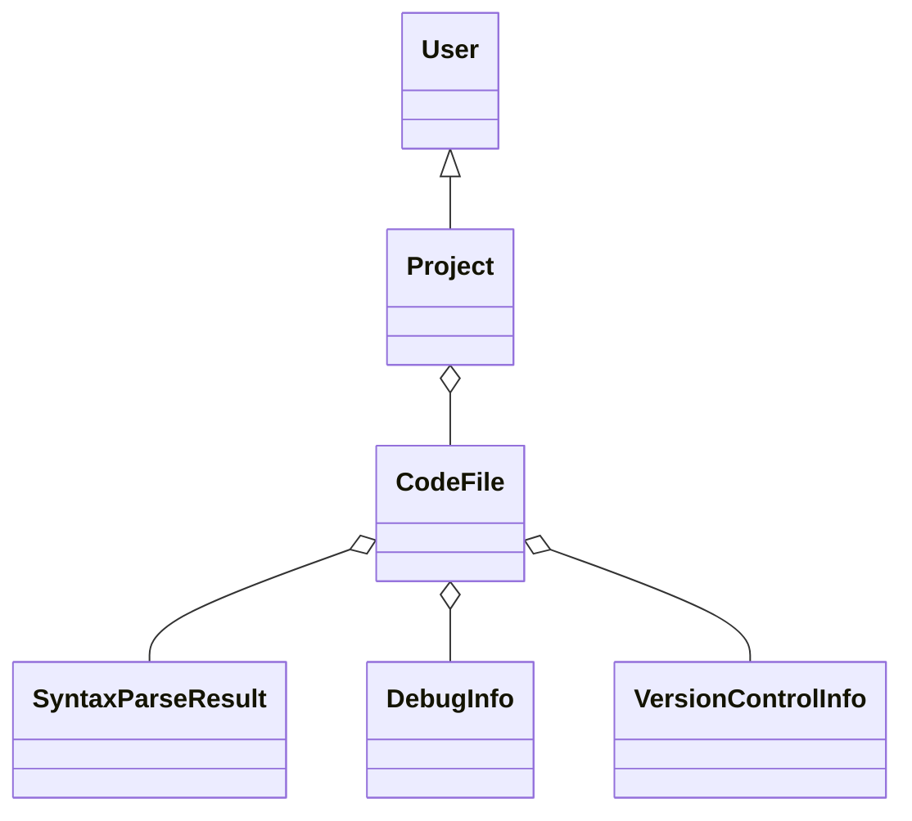
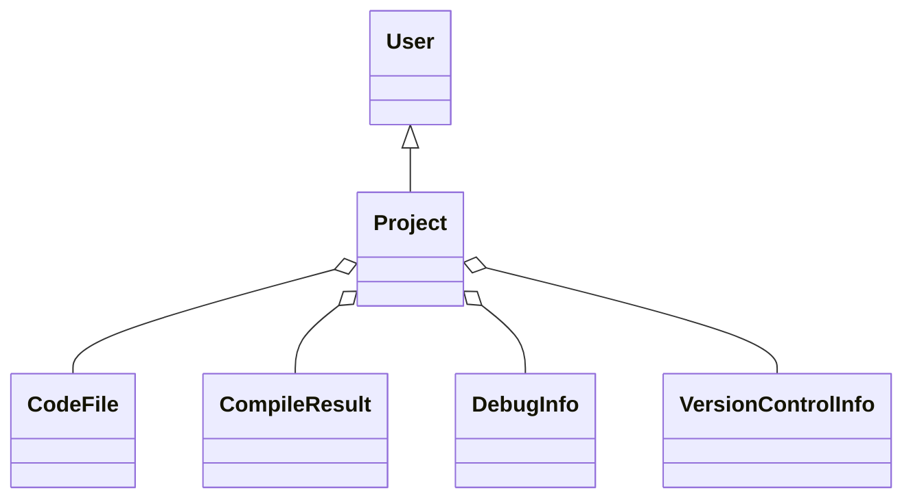

                 

### 第一部分：引言

#### 1.1 问题背景

在当今快速发展的信息技术时代，编程语言不断演变和创新，以满足日益复杂的计算需求。传统的编程语言，如C、Java和Python，虽然功能强大，但往往需要编写大量的代码来实现复杂的功能。这种复杂性不仅增加了开发难度，也降低了开发效率。随着人工智能和自然语言处理技术的进步，提示词编程语言应运而生，它利用自然语言处理技术，通过简单的提示词或命令，就可以实现复杂的编程任务。

提示词编程语言的出现，旨在降低编程门槛，使得非专业的开发者也能够通过自然语言交互，快速完成编程任务。然而，为了充分发挥提示词编程语言的潜力，需要一个强大的集成开发环境（IDE）来支持其开发和调试。

#### 1.2 问题描述

当前，现有的IDE大多是针对传统编程语言设计的，虽然经过不断迭代和优化，但在支持提示词编程语言方面存在诸多问题：

1. **语法解析困难**：提示词编程语言往往具有自由语法结构，这使得传统的语法解析器难以有效解析和处理提示词语句。
2. **代码自动补全不足**：提示词编程语言的自由语法使得自动补全功能难以实现，这影响了开发效率和体验。
3. **调试功能不完善**：由于提示词编程语言的特性，现有的调试工具难以实现有效的调试功能。
4. **智能提示不足**：提示词编程语言的语义理解要求较高，现有的IDE难以提供有效的智能提示和代码优化建议。

这些问题限制了提示词编程语言的实际应用和发展，因此，设计和实现一个专门针对提示词编程语言的IDE成为当务之急。

#### 1.3 问题解决

为了解决上述问题，我们需要从以下几个方面着手：

1. **语法解析器设计**：设计一种能够高效处理提示词编程语言语法的解析器，支持自由语法结构和复杂的提示词组合。
2. **代码自动补全机制**：开发一套智能的代码自动补全机制，通过自然语言处理技术，实现对提示词编程语言的智能补全。
3. **调试工具改进**：改进现有的调试工具，使其能够适应提示词编程语言的特点，提供有效的调试功能。
4. **智能提示系统**：建立一套智能提示系统，利用深度学习和自然语言处理技术，为开发者提供高质量的代码优化建议和智能提示。

通过上述措施，我们可以构建一个功能强大、用户体验优秀的提示词编程语言IDE，从而推动提示词编程语言的广泛应用和发展。

#### 1.4 边界与外延

在设计和实现提示词编程语言的IDE时，我们需要明确其边界和适用范围：

1. **适用范围**：提示词编程语言的IDE主要适用于需要高效开发、测试和调试提示词编程语言的项目。它特别适合于初学者和非专业开发者，以降低编程门槛。
2. **边界限制**：由于提示词编程语言的自由语法和语义理解要求较高，IDE的设计和实现需要充分考虑性能和资源的限制。此外，对于一些高度专业化的编程需求，传统编程语言可能更为适用。

#### 1.5 概念结构与核心要素组成

为了更好地理解和设计提示词编程语言的IDE，我们需要了解其核心概念和结构：

1. **核心概念**：提示词编程语言、语法解析器、代码自动补全、调试工具和智能提示系统。
2. **组成要素**：语法解析模块、代码补全模块、调试模块、智能提示模块和用户交互界面。

这些核心概念和要素构成了提示词编程语言IDE的基本框架，为后续设计和实现提供了明确的指导。

### 总结

本文提出了设计提示词编程语言IDE的构想，分析了其背景、问题和解决方法，明确了其边界与外延，并阐述了核心概念与结构。接下来的部分将深入探讨这些核心概念和要素，为读者提供更加详细的解读和实现方法。通过本文的讨论，我们期望能够为提示词编程语言的IDE设计提供有益的参考和启示。

---

# 第二部分：核心概念与联系

#### 2.1 核心概念

##### 2.1.1 提示词编程语言

提示词编程语言（Keyword-based Programming Language）是一种新兴的编程语言，它利用自然语言处理技术，允许开发者通过输入简单的提示词或命令来实现复杂的编程任务。与传统的编程语言相比，提示词编程语言具有以下几个显著特点：

1. **语法自由**：提示词编程语言不严格遵循传统的语法规则，开发者可以通过自由组合提示词，实现复杂的逻辑和功能。
2. **易学易用**：提示词编程语言的设计目标是降低编程门槛，使得非专业开发者也能快速上手。
3. **高效率**：通过自然语言交互，提示词编程语言可以大大提高开发效率，减少代码编写和调试时间。

##### 2.1.2 语法解析器

语法解析器（Parser）是提示词编程语言的核心组成部分，负责将开发者输入的提示词序列转换为计算机可以理解的抽象语法树（Abstract Syntax Tree, AST）。语法解析器通常采用自顶向下或自底向上的解析方法，对输入的提示词进行语法分析和语义验证。

1. **自顶向下解析**：从整体上分析输入的提示词序列，逐步分解为更小的语法单位，直至生成AST。
2. **自底向上解析**：从输入的提示词序列的末尾开始，逐步构建AST。

##### 2.1.3 代码自动补全

代码自动补全（Code Completion）是提高开发效率的重要功能。在提示词编程语言的IDE中，代码自动补全通过分析上下文和语义，自动提供可能的补全选项，帮助开发者快速完成代码编写。

1. **基于规则**：利用预先定义的语法规则和提示词库，自动匹配和生成可能的补全选项。
2. **基于机器学习**：通过训练机器学习模型，从大量历史代码中学习，自动生成补全建议。

##### 2.1.4 调试工具

调试工具（Debug Tool）是确保代码正确性和可靠性的重要手段。在提示词编程语言的IDE中，调试工具需要能够支持提示词编程语言的特性，提供高效的调试功能。

1. **断点设置**：允许开发者设置断点，在特定条件下暂停程序的执行，以分析程序状态。
2. **变量监视**：实时监视程序执行过程中的变量值，帮助开发者理解程序行为。
3. **堆栈跟踪**：提供详细的堆栈信息，帮助开发者定位和修复代码错误。

##### 2.1.5 智能提示系统

智能提示系统（Intelligent Assistance System）是提升开发体验的关键功能。通过自然语言处理和机器学习技术，智能提示系统可以为开发者提供代码优化建议、错误修复提示、代码风格指南等。

1. **代码优化建议**：根据代码的执行效率和可读性，提供优化建议。
2. **错误修复提示**：识别代码中的潜在错误，并提供修复建议。
3. **代码风格指南**：根据团队或项目的代码规范，提供代码风格建议。

#### 2.2 概念属性特征对比表格

为了更好地理解提示词编程语言及其核心概念，以下是一个对比表格，展示了提示词编程语言与传统编程语言在语法自由性、易学易用性、高效率等方面的对比：

| 特征 | 提示词编程语言 | 传统编程语言 |
| ---- | -------------- | ------------ |
| 语法自由性 | 高 | 低 |
| 易学易用性 | 高 | 中 |
| 高效率 | 高 | 中 |
| 支持的编程范式 | 多种 | 一种或多种 |
| 代码可读性 | 高 | 中 |
| 开发门槛 | 低 | 高 |

#### 2.3 ER实体关系图架构

为了更直观地展示提示词编程语言及其核心概念之间的关系，我们可以使用ER（实体-关系）图来描述。以下是一个简化的ER实体关系图，展示了提示词编程语言、语法解析器、代码自动补全、调试工具和智能提示系统之间的关系：

```mermaid
erDiagram
  Person ||--|{ Student : has } |
  Student ||--|{ Course : studies } |
  Course ||--|{ Teacher : teaches } |
  Teacher ||--|{ Subject : teaches } |
  Subject ||--|{ Book : references } |
  Book ||--|{ Chapter : contains } |
  Chapter ||--|{ Paragraph : contains } |
  Paragraph ||--|{ Sentence : contains } |
```

在这个ER图中，每个实体（如Person、Student、Course等）表示一个核心概念，而每个关系（如has、studies、teaches等）表示这些实体之间的关联。通过这个ER图，我们可以清晰地理解提示词编程语言IDE中的各个核心概念及其相互作用。

---

# 第三部分：IDE设计基础

#### 3.1 IDE简介

集成开发环境（Integrated Development Environment，IDE）是一种用于软件开发的环境，提供代码编辑、编译、调试、测试等一系列功能，以提高开发效率和代码质量。IDE的起源可以追溯到20世纪80年代，当时的软件开发工具主要包括文本编辑器和命令行编译器。随着计算机技术的发展，IDE逐渐成为软件开发的核心工具。

##### 3.1.1 IDE的定义

IDE是一种软件应用，它集成了多种开发工具，如代码编辑器、编译器、调试器、构建工具等，为开发者提供统一的开发平台。IDE的主要目标是简化开发流程，提高开发效率，减少错误率。

##### 3.1.2 IDE的基本功能

IDE的基本功能通常包括：

1. **代码编辑**：提供文本编辑器，支持代码高亮、自动缩进、语法检查等功能。
2. **编译与构建**：集成编译器和构建工具，自动编译代码并生成可执行文件。
3. **调试**：提供调试工具，允许开发者设置断点、监视变量、查看堆栈信息等。
4. **代码分析**：分析代码质量，提供代码优化建议和错误警告。
5. **版本控制**：集成版本控制系统，支持代码的版本管理和协同开发。

##### 3.1.3 IDE的发展历程

IDE的发展历程反映了软件开发工具的不断进步：

1. **早期IDE**：如Eclipse、NetBeans、Visual Studio等，这些IDE主要支持特定编程语言，提供了基本的代码编辑和调试功能。
2. **通用IDE**：随着软件开发复杂度的增加，通用IDE如IntelliJ IDEA、WebStorm等出现，支持多种编程语言和开发框架，提供了更全面的开发工具集。
3. **云IDE**：随着云计算的发展，云IDE如Cloud9、CodeAnywhere等出现，允许开发者通过浏览器远程访问IDE，实现随时随地开发。

#### 3.2 提示词编程语言的IDE特点

为了充分发挥提示词编程语言的优势，提示词编程语言的IDE需要具备以下特点：

##### 3.2.1 提示词编程语言对IDE的要求

提示词编程语言的特点决定了其对IDE的特殊要求：

1. **语法解析能力**：提示词编程语言通常具有自由语法结构，IDE需要具备强大的语法解析能力，能够正确处理复杂的提示词组合。
2. **代码自动补全**：提示词编程语言的自由语法使得代码自动补全功能尤为重要，IDE需要提供智能的代码自动补全机制，以减少开发者手动输入的麻烦。
3. **调试功能**：提示词编程语言的特点可能使得传统调试工具难以适应，IDE需要改进调试工具，提供有效的调试功能。
4. **智能提示**：提示词编程语言的语义理解要求较高，IDE需要建立智能提示系统，为开发者提供高质量的代码优化建议和智能提示。

##### 3.2.2 提示词编程语言IDE的特点

提示词编程语言的IDE具有以下特点：

1. **高自由度**：提示词编程语言的自由语法结构使得IDE在高自由度方面具有明显优势，允许开发者使用更加灵活的方式编写代码。
2. **智能交互**：通过自然语言处理技术，IDE可以实现与开发者的智能交互，提供个性化的代码建议和调试支持。
3. **高效开发**：提示词编程语言的简单性和高效性使得IDE能够显著提高开发效率，减少代码编写和调试时间。
4. **跨平台支持**：提示词编程语言的IDE需要支持多种操作系统和硬件平台，以适应不同的开发环境。

##### 3.2.3 提示词编程语言IDE的优势

提示词编程语言的IDE具有以下优势：

1. **降低开发门槛**：提示词编程语言的易用性使得IDE能够帮助非专业开发者快速上手，降低编程门槛。
2. **提高开发效率**：智能交互和高效开发功能使得IDE能够显著提高开发效率，减少开发时间和成本。
3. **增强代码质量**：智能提示和代码分析功能可以帮助开发者写出更加高质量和可维护的代码。
4. **支持多样化编程范式**：提示词编程语言的IDE可以支持多种编程范式，满足不同开发需求。

#### 3.3 提示词编程语言的IDE架构设计

提示词编程语言的IDE架构设计需要充分考虑其特点和要求，以下是一个简化的架构设计：

1. **用户界面层**：提供用户交互界面，包括代码编辑器、调试界面、智能提示界面等。
2. **语法解析层**：实现提示词编程语言的语法解析功能，将开发者输入的提示词序列转换为抽象语法树（AST）。
3. **代码自动补全层**：利用自然语言处理技术，实现智能的代码自动补全机制。
4. **调试层**：改进传统调试工具，提供有效的调试功能。
5. **智能提示层**：建立智能提示系统，为开发者提供高质量的代码优化建议和智能提示。
6. **后端服务层**：提供服务器端服务，支持远程开发、版本控制和代码分析等。

通过上述架构设计，提示词编程语言的IDE可以充分发挥其优势，提供高效、智能的开发体验。

---

## 第四部分：设计构想与方法

### 4.1 设计构想

为了设计一个功能强大、用户体验优秀的提示词编程语言IDE，我们需要从以下几个方面进行构想：

#### 4.1.1 提示词编程语言的IDE设计目标

1. **易用性**：设计简洁直观的用户界面，降低开发门槛，使得非专业开发者也能轻松上手。
2. **高效性**：通过智能交互和代码优化，提高开发效率，减少代码编写和调试时间。
3. **灵活性**：支持多种编程范式和开发框架，满足多样化开发需求。
4. **可扩展性**：设计模块化架构，方便未来扩展和升级。

#### 4.1.2 提示词编程语言的IDE设计原则

1. **用户中心**：始终以开发者为中心，关注用户体验，提供个性化的服务和建议。
2. **模块化**：采用模块化设计，使得各个功能模块可以独立开发、测试和部署。
3. **可扩展性**：设计灵活的扩展机制，支持开发者自定义插件和功能。
4. **高效性能**：优化算法和数据处理，确保系统运行高效稳定。

#### 4.1.3 提示词编程语言的IDE设计理念

1. **智能化**：利用自然语言处理和机器学习技术，实现智能提示和代码优化。
2. **开放性**：采用开源技术，促进社区参与，共同推动IDE的发展。
3. **跨平台**：支持多种操作系统和硬件平台，实现无缝的开发体验。
4. **可持续性**：关注系统性能和资源消耗，确保长期稳定运行。

### 4.2 设计方法

为了实现上述设计构想，我们需要采用以下设计方法：

#### 4.2.1 设计流程

1. **需求分析**：明确IDE的功能需求和用户需求，制定详细的需求文档。
2. **系统设计**：根据需求文档，设计IDE的系统架构和模块划分。
3. **界面设计**：设计简洁直观的用户界面，确保用户能够轻松使用。
4. **功能实现**：根据设计文档，开发各个功能模块。
5. **测试与优化**：进行功能测试和性能优化，确保系统稳定可靠。
6. **部署与维护**：部署IDE到生产环境，并进行持续维护和更新。

#### 4.2.2 设计工具

1. **开发工具**：采用主流的开发工具，如Java、Python等，确保代码质量和开发效率。
2. **设计工具**：使用UML工具（如Visual Paradigm、Lucidchart等）进行系统设计，绘制类图、序列图等。
3. **数据库工具**：使用MySQL、PostgreSQL等数据库管理系统，存储用户数据和系统配置。
4. **版本控制**：使用Git进行版本控制，确保代码管理和协同开发。

#### 4.2.3 设计实现策略

1. **模块化开发**：将IDE的功能划分为多个模块，独立开发、测试和部署。
2. **代码优化**：采用高效的算法和数据结构，优化系统性能。
3. **用户体验优化**：关注用户反馈，持续改进用户体验。
4. **自动化测试**：采用自动化测试工具（如JUnit、Selenium等），确保功能正确性和性能稳定性。
5. **社区参与**：鼓励社区参与，共同开发和优化IDE。

### 4.3 实际案例分析

为了更好地理解设计方法，以下是一个实际案例的分析：

#### 案例一：某提示词编程语言的IDE设计实践

1. **需求分析**：根据提示词编程语言的特点，明确IDE的功能需求，如语法解析、代码自动补全、调试工具和智能提示等。
2. **系统设计**：设计模块化的系统架构，包括用户界面层、语法解析层、代码自动补全层、调试层和智能提示层。
3. **界面设计**：设计简洁直观的用户界面，包括代码编辑器、调试界面和智能提示界面。
4. **功能实现**：根据设计文档，开发各个功能模块，并确保模块之间的高内聚和低耦合。
5. **测试与优化**：进行功能测试和性能优化，确保系统稳定可靠。
6. **部署与维护**：部署IDE到生产环境，并进行持续维护和更新。

#### 案例二：某提示词编程语言的IDE优化实践

1. **性能优化**：通过分析系统性能瓶颈，采用高效的算法和数据结构进行优化，提高系统性能。
2. **用户体验优化**：根据用户反馈，改进界面设计和交互流程，提高用户体验。
3. **功能扩展**：根据用户需求，扩展新的功能模块，如代码审查、代码格式化等。
4. **自动化测试**：建立自动化测试框架，确保新功能和优化后的系统性能稳定。

通过以上实际案例，我们可以看到设计方法在实现提示词编程语言IDE中的应用效果。这些方法不仅提高了IDE的功能和性能，也增强了用户体验和可扩展性。

### 总结

通过本部分的设计构想与方法，我们明确了提示词编程语言IDE的设计目标、原则和理念，并介绍了设计流程、设计工具和实现策略。实际案例分析进一步展示了设计方法在具体项目中的应用效果。接下来，我们将深入探讨算法原理与实现，为设计一个高效、智能的提示词编程语言IDE提供更加详细的指导。

---

## 第五部分：算法原理与实现

### 5.1 算法原理

在设计和实现提示词编程语言的IDE时，算法的原理至关重要。算法是一种解决问题的方法和步骤，通常由一系列明确的规则组成。本部分将介绍基础算法原理和高级算法原理，并结合提示词编程语言的特性进行讲解。

#### 5.1.1 基础算法原理

##### 5.1.1.1 算法的基本概念

算法（Algorithm）是一种有穷序列的指令，用于解决特定的问题。算法具有以下几个基本特征：

1. **确定性**：每一步操作都有明确的定义，无论执行多少次，结果都是相同的。
2. **有穷性**：算法在执行有限步骤后能够终止，不会陷入无限循环。
3. **输入**：算法可以接受一个或多个输入值。
4. **输出**：算法在终止时能够产生一个或多个输出值。
5. **有效性**：算法在执行过程中不会进行无效操作，能够在合理的时间内完成。

##### 5.1.1.2 算法的性能指标

算法的性能指标主要包括时间复杂度和空间复杂度：

1. **时间复杂度**：描述算法执行时间的增长速度，通常用大O符号（O）表示。常见的时间复杂度有O(1)、O(logn)、O(n)、O(nlogn)和O(n^2)等。
2. **空间复杂度**：描述算法所需内存的增长速度，同样用大O符号表示。

##### 5.1.1.3 算法的分类

算法可以根据其解决问题的方法和特性进行分类：

1. **基础算法**：如排序算法（冒泡排序、快速排序、归并排序等）和查找算法（二分查找、哈希查找等）。
2. **动态规划算法**：通过保存中间状态，避免重复计算，解决具有最优子结构的问题。
3. **贪心算法**：通过每一步选择局部最优解，最终得到全局最优解。
4. **分治算法**：将大问题分解为若干小问题，递归解决小问题，再合并解决大问题。

##### 5.1.1.4 提示词编程语言中的算法应用

在提示词编程语言中，算法的应用尤为关键。由于提示词编程语言的自由语法结构，算法需要能够处理复杂的提示词组合。以下是一些在提示词编程语言中常见的算法应用：

1. **语法解析算法**：通过递归下降算法、LL（1）算法等，将输入的提示词序列转换为抽象语法树（AST）。
2. **代码自动补全算法**：利用词频统计、序列匹配等算法，提供智能的代码自动补全建议。
3. **语义分析算法**：通过自然语言处理技术，如词向量、依存句法分析等，理解提示词的语义，实现智能提示和代码优化。

#### 5.1.2 高级算法原理

##### 5.1.2.1 深度学习算法

深度学习算法是人工智能领域的重要分支，通过多层神经网络实现复杂的特征提取和模式识别。以下是一些在提示词编程语言IDE中常用的深度学习算法：

1. **神经网络**：包括多层感知机（MLP）、卷积神经网络（CNN）和循环神经网络（RNN）等。
2. **生成对抗网络（GAN）**：用于生成高质量的提示词序列，提高代码自动补全的质量。
3. **自注意力机制（Self-Attention）**：通过自注意力机制，模型可以自动学习不同提示词之间的关联性，提高语义分析的准确性。

##### 5.1.2.2 自然语言处理算法

自然语言处理（NLP）算法在提示词编程语言IDE中有着广泛的应用，用于处理提示词的语义和上下文信息。以下是一些常见的NLP算法：

1. **词向量**：通过Word2Vec、BERT等算法，将单词映射为高维向量，实现词与词之间的相似性计算。
2. **依存句法分析**：通过分析句子中单词之间的依存关系，理解句子的语义结构。
3. **文本分类**：通过机器学习算法，对文本进行分类，如代码错误检测、代码风格检查等。

##### 5.1.2.3 图像处理算法

在提示词编程语言IDE中，图像处理算法可以用于代码可视化、界面设计等。以下是一些常见的图像处理算法：

1. **图像分割**：将图像分割为若干区域，便于分析和处理。
2. **特征提取**：通过特征提取算法，如SIFT、SURF等，从图像中提取关键特征。
3. **图像增强**：通过图像增强算法，提高图像的质量和清晰度。

### 5.2 算法实现

算法实现是将算法原理转化为实际可运行的代码的过程。以下是一个简单的示例，展示了如何使用Python实现一个基本的语法解析算法。

```python
def parse_keyword_sequence(sequence):
    """
    解析提示词序列并返回抽象语法树（AST）。
    """
    ast = []
    tokens = sequence.split()
    
    for token in tokens:
        if token == "if":
            ast.append({"type": "if_statement", "conditions": []})
        elif token == "else":
            ast.append({"type": "else_statement"})
        elif token.isdigit():
            ast.append({"type": "number", "value": int(token)})
        else:
            ast.append({"type": "identifier", "name": token})
    
    return ast
```

在这个示例中，`parse_keyword_sequence`函数接收一个提示词序列，并逐个解析每个提示词，将其转换为AST中的节点。这个简单的算法仅用于演示目的，实际应用中的语法解析会更为复杂。

### 5.3 算法分析

算法分析是评估算法性能和效率的重要步骤。以下是一个简单的算法分析示例：

#### 5.3.1 算法复杂度分析

假设我们有一个排序算法，其时间复杂度为O(nlogn)。在输入大小为n的情况下，算法的执行时间大约为n乘以logn。当n增大时，算法的执行时间也会显著增加。

#### 5.3.2 算法效率优化

为了提高算法效率，我们可以考虑以下策略：

1. **算法改进**：选择更适合问题的算法，如使用快速排序代替冒泡排序。
2. **数据结构优化**：选择更高效的数据结构，如使用哈希表代替数组。
3. **并行计算**：利用并行计算技术，如多线程或分布式计算，提高算法的执行速度。

#### 5.3.3 算法应用案例分析

以下是一个算法应用案例的分析：

1. **代码自动补全**：通过词频统计和序列匹配算法，对历史代码进行学习，提高代码自动补全的准确性。
2. **智能提示**：通过自然语言处理技术，分析提示词的语义和上下文，提供有针对性的代码优化建议。
3. **代码质量分析**：通过静态代码分析算法，检测代码中的潜在错误和风格问题，提高代码的可维护性和可靠性。

通过上述算法分析和应用案例，我们可以更好地理解和优化提示词编程语言IDE中的算法，提高系统的性能和用户体验。

### 总结

本部分详细介绍了算法原理与实现，包括基础算法原理和高级算法原理。通过Python示例和算法分析，我们展示了如何将算法应用于提示词编程语言的IDE设计。在下一部分中，我们将进一步探讨系统分析与架构设计，为实现高效的提示词编程语言IDE提供更加全面的指导。

---

## 第六部分：系统分析与架构设计

### 6.1 问题场景介绍

在开发提示词编程语言的IDE时，我们需要明确其应用场景和系统需求。以下是几个典型的应用场景：

#### 6.1.1 提示词编程语言IDE的应用场景

1. **学术研究**：学术研究人员和学生在进行编程实验和项目开发时，需要高效地编写和调试代码，提示词编程语言的IDE可以大大简化这一过程。
2. **企业开发**：企业在开发新型软件应用和系统时，可以使用提示词编程语言的IDE来降低开发难度，提高开发效率。
3. **教育培训**：提示词编程语言的IDE可以作为编程教学工具，帮助初学者和非专业开发者快速掌握编程技能。

#### 6.1.2 系统需求分析

为了满足上述应用场景，我们需要对系统需求进行详细分析：

1. **功能需求**：
   - 语法解析：支持对提示词编程语言的语法解析，生成抽象语法树（AST）。
   - 代码自动补全：提供智能的代码自动补全功能，减少开发者手动输入的麻烦。
   - 调试工具：提供高效的调试功能，包括断点设置、变量监视和堆栈跟踪。
   - 智能提示：提供代码优化建议和错误修复提示，提高代码质量。
   - 代码格式化：自动格式化代码，提高代码可读性。
   - 版本控制：集成版本控制系统，支持代码的版本管理和协同开发。

2. **性能需求**：
   - 响应速度：在用户操作时，系统能够快速响应用户请求。
   - 内存占用：系统运行时占用内存资源较少，确保流畅运行。
   - 稳定性：系统在长时间运行和高负载情况下，保持稳定可靠。

3. **用户需求**：
   - 易用性：界面简洁直观，易于上手。
   - 个性化：支持用户自定义插件和设置，满足个性化需求。
   - 跨平台：支持多种操作系统和硬件平台，实现无缝的开发体验。

#### 6.1.3 系统目标与功能

根据上述需求分析，我们设定以下系统目标：

1. **系统目标**：
   - 提供一个功能强大、易用性高的提示词编程语言IDE。
   - 提高开发效率，降低开发门槛。
   - 支持多种编程范式和开发框架。
   - 保证系统的性能和稳定性。

2. **系统功能**：
   - 语法解析：支持对提示词编程语言的语法解析，生成AST。
   - 代码自动补全：提供智能的代码自动补全功能。
   - 调试工具：提供高效的调试功能。
   - 智能提示：提供代码优化建议和错误修复提示。
   - 代码格式化：自动格式化代码。
   - 版本控制：集成版本控制系统，支持代码的版本管理和协同开发。

### 6.2 系统功能设计

系统功能设计是系统开发的第一步，它明确了系统的功能模块和用户接口。以下是系统功能设计的详细描述：

#### 6.2.1 领域模型设计

领域模型设计是系统功能设计的基础，它定义了系统中的关键实体和关系。以下是领域模型的设计：

1. **实体定义**：
   - **用户**：代表使用IDE的开发者。
   - **项目**：代表用户开发的程序项目。
   - **代码文件**：代表项目中的代码文件。
   - **语法解析结果**：代表语法解析生成的抽象语法树（AST）。
   - **调试信息**：代表调试过程中的信息，如断点、变量监视等。
   - **版本控制信息**：代表版本控制系统的信息。

2. **关系定义**：
   - **用户-项目**：用户可以创建、管理和开发项目。
   - **项目-代码文件**：项目包含多个代码文件。
   - **语法解析结果-代码文件**：语法解析结果与代码文件相关联。
   - **调试信息-代码文件**：调试信息与代码文件相关联。
   - **版本控制信息-项目**：版本控制信息与项目相关联。

以下是领域模型的类图表示：



#### 6.2.2 类图设计

类图是领域模型的图形化表示，它详细描述了系统中的类以及类之间的关系。以下是类图的设计：

1. **类定义**：
   - **User**：包含用户信息，如用户名、邮箱、密码等。
   - **Project**：包含项目信息，如项目名称、创建时间、最后修改时间等。
   - **CodeFile**：包含代码文件信息，如文件名称、路径、内容等。
   - **SyntaxParseResult**：包含语法解析结果信息，如AST节点等。
   - **DebugInfo**：包含调试信息，如断点、变量监视等。
   - **VersionControlInfo**：包含版本控制信息，如版本号、提交人、提交时间等。

2. **类关系**：
   - **用户-项目**：用户可以创建、管理和删除项目。
   - **项目-代码文件**：项目包含多个代码文件，可以对文件进行添加、删除、修改等操作。
   - **代码文件-语法解析结果**：代码文件经过语法解析后，生成语法解析结果。
   - **代码文件-调试信息**：代码文件可以设置调试信息，如断点、变量监视等。
   - **代码文件-版本控制信息**：代码文件参与版本控制，记录版本信息。

以下是类图的表示：

```mermaid
classDiagram
    User {
        String username
        String email
        String password
    }
    Project {
        String name
        Date createTime
        Date lastModifyTime
    }
    CodeFile {
        String name
        String path
        String content
    }
    SyntaxParseResult {
        List<Node> nodes
    }
    DebugInfo {
        List<Breakpoint> breakpoints
        List<VariableWatch> variableWatches
    }
    VersionControlInfo {
        String version
        String commitUser
        Date commitTime
    }
    User o-- Project
    Project o-- CodeFile
    CodeFile o-- SyntaxParseResult
    CodeFile o-- DebugInfo
    CodeFile o-- VersionControlInfo
endclassDiagram
```

### 6.3 系统架构设计

系统架构设计是系统开发的核心环节，它确定了系统的整体结构和模块划分。以下是系统架构的设计：

#### 6.3.1 系统架构概述

系统架构采用分层设计，包括用户界面层、业务逻辑层和数据层。以下是系统架构的概述：

1. **用户界面层**：提供用户交互界面，包括代码编辑器、调试界面、智能提示界面等。
2. **业务逻辑层**：实现系统的核心功能，包括语法解析、代码自动补全、调试工具和智能提示系统等。
3. **数据层**：负责数据的存储和管理，包括用户信息、项目信息、代码文件、语法解析结果、调试信息和版本控制信息等。

#### 6.3.2 系统架构设计原则

1. **模块化**：将系统划分为多个模块，每个模块独立开发、测试和部署。
2. **高内聚低耦合**：每个模块具有高内聚性，即模块内部的功能紧密相关，低耦合性，即模块之间的依赖关系最小化。
3. **可扩展性**：设计灵活的扩展机制，支持未来的功能扩展和升级。
4. **高性能**：采用高效的算法和数据结构，确保系统运行高效稳定。

#### 6.3.3 系统架构设计

以下是系统架构的详细设计：

1. **用户界面层**：
   - **代码编辑器**：提供代码输入和编辑功能，支持语法高亮、代码自动补全等。
   - **调试界面**：提供调试工具，包括断点设置、变量监视、堆栈跟踪等。
   - **智能提示界面**：提供智能提示功能，包括代码优化建议、错误修复提示等。

2. **业务逻辑层**：
   - **语法解析模块**：实现提示词编程语言的语法解析功能，生成抽象语法树（AST）。
   - **代码自动补全模块**：利用自然语言处理技术，提供智能的代码自动补全功能。
   - **调试工具模块**：提供调试工具，包括断点设置、变量监视、堆栈跟踪等。
   - **智能提示模块**：提供智能提示功能，包括代码优化建议、错误修复提示等。
   - **代码格式化模块**：自动格式化代码，提高代码可读性。

3. **数据层**：
   - **用户信息模块**：存储用户的基本信息。
   - **项目信息模块**：存储项目的详细信息。
   - **代码文件模块**：存储代码文件的内容和元数据。
   - **语法解析结果模块**：存储语法解析结果。
   - **调试信息模块**：存储调试信息。
   - **版本控制信息模块**：存储版本控制信息。

以下是系统架构的类图表示：

```mermaid
classDiagram
    UserInterfaceLayer {
        CodeEditor
        DebugInterface
        IntelligentTipInterface
    }
    BusinessLogicLayer {
        SyntaxParser
        AutoComplete
        Debugger
        IntelligentTip
        Formatter
    }
    DataLayer {
        UserInformation
        ProjectInformation
        CodeFileInformation
        SyntaxParseResult
        DebugInformation
        VersionControlInformation
    }
    UserInterfaceLayer o-- BusinessLogicLayer
    BusinessLogicLayer o-- DataLayer
endclassDiagram
```

### 6.4 系统接口设计

系统接口设计是系统架构设计的重要组成部分，它定义了系统内部模块之间的通信接口。以下是系统接口的设计：

#### 6.4.1 接口定义

1. **用户接口**：
   - **登录接口**：用户登录系统。
   - **注册接口**：用户注册账号。
   - **项目创建接口**：用户创建新的项目。
   - **文件管理接口**：用户对代码文件进行添加、删除、修改等操作。
   - **语法解析接口**：对输入的提示词序列进行语法解析。
   - **调试接口**：设置断点、变量监视等调试功能。
   - **智能提示接口**：获取代码优化建议和错误修复提示。

2. **业务逻辑接口**：
   - **语法解析接口**：解析提示词序列，生成抽象语法树（AST）。
   - **代码自动补全接口**：提供代码自动补全功能。
   - **调试接口**：实现调试功能。
   - **智能提示接口**：提供智能提示功能。
   - **代码格式化接口**：格式化代码。

3. **数据接口**：
   - **用户信息接口**：获取和更新用户信息。
   - **项目信息接口**：获取和更新项目信息。
   - **代码文件接口**：获取和更新代码文件信息。
   - **语法解析结果接口**：获取语法解析结果。
   - **调试信息接口**：获取和更新调试信息。
   - **版本控制信息接口**：获取和更新版本控制信息。

#### 6.4.2 接口实现

接口实现是接口设计的具体实现，以下是一个简单的接口实现示例：

```python
class LoginInterface:
    def login(self, username, password):
        # 实现用户登录逻辑
        pass

class RegisterInterface:
    def register(self, username, email, password):
        # 实现用户注册逻辑
        pass

class ProjectManagementInterface:
    def create_project(self, user, project_name):
        # 实现项目创建逻辑
        pass

class FileManagementInterface:
    def add_file(self, project, file_name, file_content):
        # 实现文件添加逻辑
        pass

class SyntaxParsingInterface:
    def parse(self, code):
        # 实现语法解析逻辑
        pass

class DebuggerInterface:
    def set_breakpoint(self, code_file, line_number):
        # 实现断点设置逻辑
        pass

class IntelligentTipInterface:
    def get_tips(self, code):
        # 实现智能提示逻辑
        pass

class FormatterInterface:
    def format(self, code):
        # 实现代码格式化逻辑
        pass
```

#### 6.4.3 接口调用流程

接口调用流程描述了系统模块之间如何通过接口进行通信。以下是一个简单的接口调用流程：

1. **用户界面层**：
   - 用户登录后，调用`LoginInterface.login`接口登录系统。
   - 创建新项目后，调用`ProjectManagementInterface.create_project`接口创建项目。
   - 编写代码后，调用`FileManagementInterface.add_file`接口添加代码文件。

2. **业务逻辑层**：
   - 语法解析模块调用`SyntaxParsingInterface.parse`接口对输入的代码进行语法解析。
   - 调试工具模块调用`DebuggerInterface.set_breakpoint`接口设置断点。
   - 智能提示模块调用`IntelligentTipInterface.get_tips`接口获取智能提示。

3. **数据层**：
   - 用户信息模块调用`UserInformationInterface.get_user`接口获取用户信息。
   - 项目信息模块调用`ProjectInformationInterface.get_project`接口获取项目信息。
   - 代码文件模块调用`CodeFileInformationInterface.get_file`接口获取代码文件信息。
   - 语法解析结果模块调用`SyntaxParseResultInterface.get_result`接口获取语法解析结果。
   - 调试信息模块调用`DebugInformationInterface.get_info`接口获取调试信息。
   - 版本控制信息模块调用`VersionControlInformationInterface.get_info`接口获取版本控制信息。

### 6.5 系统交互设计

系统交互设计是系统架构设计的重要组成部分，它定义了系统内部模块之间的交互流程和用户交互界面。以下是系统交互的设计：

#### 6.5.1 交互流程设计

交互流程设计描述了系统模块之间如何通过接口进行通信，以下是交互流程的详细设计：

1. **用户登录**：
   - 用户在用户界面层输入用户名和密码，调用`LoginInterface.login`接口登录系统。
   - 业务逻辑层处理登录请求，调用`UserInformationInterface.get_user`接口验证用户信息。
   - 数据层返回用户信息，业务逻辑层返回登录结果。

2. **项目创建**：
   - 用户在用户界面层创建新项目，调用`ProjectManagementInterface.create_project`接口创建项目。
   - 业务逻辑层处理创建请求，调用`ProjectInformationInterface.create_project`接口创建项目。
   - 数据层保存项目信息，业务逻辑层返回创建结果。

3. **文件管理**：
   - 用户在用户界面层添加、删除、修改代码文件，调用`FileManagementInterface.add_file`接口添加代码文件。
   - 业务逻辑层处理文件请求，调用`CodeFileInformationInterface.add_file`接口添加代码文件。
   - 数据层保存代码文件信息，业务逻辑层返回处理结果。

4. **语法解析**：
   - 用户在用户界面层输入代码，调用`SyntaxParsingInterface.parse`接口进行语法解析。
   - 业务逻辑层处理语法解析请求，调用`SyntaxParseResultInterface.get_result`接口获取语法解析结果。
   - 数据层返回语法解析结果，业务逻辑层返回处理结果。

5. **调试**：
   - 用户在用户界面层设置断点、变量监视等调试功能，调用`DebuggerInterface.set_breakpoint`接口设置断点。
   - 业务逻辑层处理调试请求，调用`DebugInformationInterface.get_info`接口获取调试信息。
   - 数据层返回调试信息，业务逻辑层返回处理结果。

6. **智能提示**：
   - 用户在用户界面层获取代码优化建议和错误修复提示，调用`IntelligentTipInterface.get_tips`接口获取智能提示。
   - 业务逻辑层处理智能提示请求，调用`IntelligentTipInterface.get_tips`接口获取智能提示。
   - 数据层返回智能提示信息，业务逻辑层返回处理结果。

#### 6.5.2 交互界面设计

交互界面设计是用户与系统交互的直观体现，以下是交互界面设计的详细设计：

1. **用户登录界面**：
   - 提供用户名和密码输入框，以及登录按钮。
   - 显示登录成功或失败的消息提示。

2. **项目创建界面**：
   - 提供项目名称输入框，以及创建按钮。
   - 显示创建成功或失败的消息提示。

3. **文件管理界面**：
   - 显示代码文件列表，提供文件添加、删除、修改等操作按钮。
   - 显示文件操作成功或失败的消息提示。

4. **语法解析界面**：
   - 显示代码输入框，提供代码提交按钮。
   - 显示语法解析结果，包括错误和警告信息。

5. **调试界面**：
   - 显示代码执行结果，提供断点设置、变量监视等调试操作按钮。
   - 显示调试状态和调试结果。

6. **智能提示界面**：
   - 显示代码输入框，提供智能提示按钮。
   - 显示智能提示信息，包括代码优化建议和错误修复提示。

#### 6.5.3 交互体验设计

交互体验设计是提升系统易用性和用户满意度的关键，以下是交互体验设计的详细设计：

1. **界面设计**：
   - 采用简洁直观的设计风格，确保用户能够快速上手。
   - 使用统一的颜色和字体，提升界面的美观度和一致性。

2. **响应速度**：
   - 优化系统性能，确保界面操作的响应速度。
   - 对长时间运行的操作提供进度提示，提升用户体验。

3. **用户反馈**：
   - 提供错误提示和操作反馈，帮助用户理解操作结果。
   - 提供用户反馈渠道，收集用户意见和建议。

4. **个性化设置**：
   - 支持用户自定义界面布局和功能设置，满足个性化需求。
   - 提供快捷键和操作提示，提高用户操作效率。

通过上述系统分析与架构设计，我们为提示词编程语言的IDE开发奠定了坚实的基础。接下来，我们将进一步探讨具体的实现细节和项目实战，为读者提供更加详细的指导和案例分析。

---

### 第六部分：系统分析与架构设计

#### 6.1 问题场景介绍

在本文的第六部分，我们将深入探讨提示词编程语言IDE的系统分析与架构设计。首先，我们需要明确系统的应用场景和需求。

##### 6.1.1 提示词编程语言IDE的应用场景

提示词编程语言IDE主要应用于以下场景：

1. **开发环境**：为开发人员提供高效的编码环境，支持快速原型设计和代码调试。
2. **教育平台**：作为编程教学工具，帮助初学者和非专业开发者理解编程概念和语言特性。
3. **企业研发**：在企业研发过程中，提高开发效率，降低开发成本。

##### 6.1.2 系统需求分析

系统需求包括功能需求、性能需求和用户需求：

1. **功能需求**：
   - **语法解析**：准确解析提示词编程语言的语法，生成抽象语法树（AST）。
   - **代码自动补全**：根据上下文提供代码补全建议，减少手动编码工作量。
   - **调试工具**：提供断点设置、变量监视、调用栈查看等功能。
   - **智能提示**：基于语义分析提供代码优化建议和错误修复提示。
   - **代码格式化**：自动格式化代码，提高代码可读性。
   - **版本控制**：集成版本控制系统，支持代码版本管理和协作开发。

2. **性能需求**：
   - **响应速度**：快速响应用户操作，减少用户等待时间。
   - **内存占用**：合理控制内存使用，确保系统稳定运行。
   - **并发处理**：支持多用户并发操作，提高系统并发性能。

3. **用户需求**：
   - **易用性**：提供直观易操作的用户界面，降低学习门槛。
   - **个性化**：支持用户自定义设置，满足个性化需求。
   - **跨平台**：支持多种操作系统，实现无缝跨平台使用。

##### 6.1.3 系统目标与功能

系统目标包括：

1. **提高开发效率**：通过智能提示、代码自动补全等功能，减少编码时间。
2. **降低开发成本**：通过集成开发和调试工具，简化开发流程。
3. **提升用户体验**：提供简洁直观的界面设计和个性化设置，满足用户需求。

系统功能包括：

1. **语法解析**：支持复杂语法结构的提示词编程语言，生成AST。
2. **代码自动补全**：根据上下文智能提示代码补全选项。
3. **调试工具**：提供丰富的调试功能，辅助代码调试。
4. **智能提示**：基于语义分析提供代码优化建议。
5. **代码格式化**：自动格式化代码，提高代码可读性。
6. **版本控制**：集成Git等版本控制系统，支持代码管理。

#### 6.2 系统功能设计

系统功能设计是系统分析与架构设计的重要部分，它明确了系统的功能模块和接口。

##### 6.2.1 领域模型设计

领域模型设计定义了系统中的关键实体和关系。以下是领域模型的设计：

1. **实体定义**：
   - **用户**：代表使用IDE的用户，包含用户名、密码、邮箱等属性。
   - **项目**：代表开发者管理的项目，包含项目名称、创建时间、最后修改时间等属性。
   - **代码文件**：代表项目中的源代码文件，包含文件名、文件路径、内容等属性。
   - **编译结果**：代表编译过程中的输出结果，包含编译错误、警告等信息。
   - **调试信息**：代表调试过程中的信息，包含断点、变量监视等。
   - **版本控制信息**：代表版本控制系统的信息，包含提交记录、变更记录等。

2. **关系定义**：
   - **用户-项目**：一个用户可以创建和管理多个项目。
   - **项目-代码文件**：一个项目包含多个代码文件。
   - **项目-编译结果**：项目编译后的输出结果。
   - **项目-调试信息**：项目调试过程中记录的信息。
   - **项目-版本控制信息**：项目版本控制系统的信息。

以下是领域模型的类图表示：



##### 6.2.2 类图设计

类图是领域模型的图形化表示，它详细描述了系统中的类以及类之间的关系。以下是类图的设计：

1. **类定义**：
   - **User**：包含用户信息，如用户名、密码、邮箱等属性。
   - **Project**：包含项目信息，如项目名称、创建时间、最后修改时间等属性。
   - **CodeFile**：包含代码文件信息，如文件名、路径、内容等属性。
   - **CompileResult**：包含编译结果信息，如编译错误、警告等。
   - **DebugInfo**：包含调试信息，如断点、变量监视等。
   - **VersionControlInfo**：包含版本控制信息，如提交记录、变更记录等。

2. **类关系**：
   - **用户-项目**：一个用户可以创建和管理多个项目。
   - **项目-代码文件**：一个项目包含多个代码文件。
   - **项目-编译结果**：项目编译后的输出结果。
   - **项目-调试信息**：项目调试过程中记录的信息。
   - **项目-版本控制信息**：项目版本控制系统的信息。

以下是类图的表示：

```mermaid
classDiagram
    User {
        String username
        String password
        String email
    }
    Project {
        String name
        Date createTime
        Date lastModifyTime
    }
    CodeFile {
        String fileName
        String path
        String content
    }
    CompileResult {
        List<String> errors
        List<String> warnings
    }
    DebugInfo {
        List<Breakpoint> breakpoints
        List<VariableWatch> variableWatches
    }
    VersionControlInfo {
        List<Commit> commits
        List<Change> changes
    }
    User o-- Project
    Project o-- CodeFile
    Project o-- CompileResult
    Project o-- DebugInfo
    Project o-- VersionControlInfo
endclassDiagram
```

#### 6.3 系统架构设计

系统架构设计是系统功能设计的具体实现，它确定了系统的整体结构和模块划分。以下是系统架构的设计：

##### 6.3.1 系统架构概述

系统架构采用分层设计，包括用户界面层、业务逻辑层和数据层。以下是系统架构的概述：

1. **用户界面层**：提供用户交互界面，包括代码编辑器、调试界面、智能提示界面等。
2. **业务逻辑层**：实现系统的核心功能，包括语法解析、代码自动补全、调试工具和智能提示系统等。
3. **数据层**：负责数据的存储和管理，包括用户信息、项目信息、代码文件、编译结果、调试信息和版本控制信息等。

##### 6.3.2 系统架构设计原则

系统架构设计原则包括：

1. **模块化**：将系统划分为多个模块，每个模块独立开发、测试和部署。
2. **高内聚低耦合**：每个模块具有高内聚性，即模块内部的功能紧密相关，低耦合性，即模块之间的依赖关系最小化。
3. **可扩展性**：设计灵活的扩展机制，支持未来的功能扩展和升级。
4. **高性能**：采用高效的算法和数据结构，确保系统运行高效稳定。

##### 6.3.3 系统架构设计

以下是系统架构的详细设计：

1. **用户界面层**：
   - **代码编辑器**：提供代码输入和编辑功能，支持语法高亮、代码自动补全等。
   - **调试界面**：提供调试工具，包括断点设置、变量监视、调用栈查看等。
   - **智能提示界面**：提供智能提示功能，包括代码优化建议、错误修复提示等。

2. **业务逻辑层**：
   - **语法解析模块**：实现提示词编程语言的语法解析功能，生成抽象语法树（AST）。
   - **代码自动补全模块**：利用自然语言处理技术，提供智能的代码自动补全功能。
   - **调试工具模块**：提供调试工具，包括断点设置、变量监视、调用栈查看等。
   - **智能提示模块**：提供智能提示功能，包括代码优化建议、错误修复提示等。
   - **代码格式化模块**：自动格式化代码，提高代码可读性。

3. **数据层**：
   - **用户信息模块**：存储用户的基本信息。
   - **项目信息模块**：存储项目的详细信息。
   - **代码文件模块**：存储代码文件的内容和元数据。
   - **编译结果模块**：存储编译结果。
   - **调试信息模块**：存储调试信息。
   - **版本控制信息模块**：存储版本控制信息。

以下是系统架构的类图表示：

```mermaid
classDiagram
    UserInterfaceLayer {
        CodeEditor
        DebugInterface
        IntelligentTipInterface
    }
    BusinessLogicLayer {
        SyntaxParser
        AutoComplete
        Debugger
        IntelligentTip
        Formatter
    }
    DataLayer {
        UserInformation
        ProjectInformation
        CodeFileInformation
        CompileResult
        DebugInformation
        VersionControlInformation
    }
    UserInterfaceLayer o-- BusinessLogicLayer
    BusinessLogicLayer o-- DataLayer
endclassDiagram
```

### 总结

通过本部分的系统分析与架构设计，我们明确了提示词编程语言IDE的应用场景和系统需求，设计了系统功能模块和接口，并详细描述了系统架构。接下来，我们将进一步探讨系统接口设计和系统交互设计，为系统的实现提供详细指导。

---

### 第六部分：系统分析与架构设计

#### 6.4 系统接口设计

系统接口设计是系统架构设计的重要组成部分，它定义了系统模块之间的通信接口。合理的接口设计不仅能够提高系统的模块化程度，还能够增强系统的可扩展性和灵活性。

##### 6.4.1 接口定义

接口定义是接口设计的第一步，它明确了系统中各个模块对外提供的功能。以下是系统中几个关键接口的定义：

1. **用户管理接口**：用于处理用户注册、登录、信息更新等操作。
2. **项目管理接口**：用于处理项目的创建、删除、更新等操作。
3. **代码管理接口**：用于处理代码文件的创建、删除、更新等操作。
4. **编译管理接口**：用于处理代码的编译过程，返回编译结果。
5. **调试管理接口**：用于处理调试功能，如断点设置、变量监视等。
6. **智能提示接口**：用于提供代码优化建议和错误修复提示。

以下是具体接口定义的伪代码：

```python
class UserManager:
    def register(username: str, password: str) -> User:
        # 注册用户
    def login(username: str, password: str) -> User | None:
        # 用户登录
    def update_user_info(user: User) -> None:
        # 更新用户信息

class ProjectManager:
    def create_project(user: User, project_name: str) -> Project:
        # 创建项目
    def delete_project(project: Project) -> None:
        # 删除项目
    def update_project(project: Project) -> None:
        # 更新项目

class CodeManager:
    def create_file(project: Project, file_name: str, content: str) -> CodeFile:
        # 创建代码文件
    def delete_file(file: CodeFile) -> None:
        # 删除代码文件
    def update_file(file: CodeFile) -> None:
        # 更新代码文件

class CompileManager:
    def compile_project(project: Project) -> CompileResult:
        # 编译项目

class DebuggerManager:
    def set_breakpoint(file: CodeFile, line_number: int) -> Breakpoint:
        # 设置断点
    def watch_variable(file: CodeFile, variable_name: str) -> VariableWatch:
        # 监视变量

class IntelligentTipManager:
    def get_tips(code: str) -> List[Tip]:
        # 获取代码优化建议
```

##### 6.4.2 接口实现

接口实现是接口设计的具体实现过程，它将接口定义转化为具体的代码。以下是接口实现的一个示例：

```python
# UserManager 接口实现
class UserManager:
    def register(self, username: str, password: str) -> User:
        # 注册用户
        new_user = User(username=username, password=password)
        users.append(new_user)
        return new_user

    def login(self, username: str, password: str) -> User | None:
        # 用户登录
        for user in users:
            if user.username == username and user.password == password:
                return user
        return None

    def update_user_info(self, user: User) -> None:
        # 更新用户信息
        # 假设有一个用户信息存储函数
        store_user_info(user)

# ProjectManager 接口实现
class ProjectManager:
    def create_project(self, user: User, project_name: str) -> Project:
        # 创建项目
        new_project = Project(user=user, name=project_name)
        projects.append(new_project)
        return new_project

    def delete_project(self, project: Project) -> None:
        # 删除项目
        projects.remove(project)

    def update_project(self, project: Project) -> None:
        # 更新项目
        # 假设有一个项目信息存储函数
        store_project_info(project)
```

##### 6.4.3 接口调用流程

接口调用流程描述了系统模块之间如何通过接口进行通信。以下是接口调用流程的一个示例：

1. **用户登录**：
   - 用户在用户界面层输入用户名和密码，调用`UserManager.login`接口登录。
   - `UserManager`模块处理登录请求，调用数据库接口查询用户信息。
   - 数据库接口返回用户信息，`UserManager`模块返回登录结果。

2. **项目创建**：
   - 用户在用户界面层输入项目名称，调用`ProjectManager.create_project`接口创建项目。
   - `ProjectManager`模块处理创建请求，调用数据库接口存储项目信息。
   - 数据库接口返回创建结果，`ProjectManager`模块返回处理结果。

3. **代码文件管理**：
   - 用户在用户界面层添加代码文件，调用`CodeManager.create_file`接口创建代码文件。
   - `CodeManager`模块处理创建请求，调用数据库接口存储代码文件信息。
   - 数据库接口返回创建结果，`CodeManager`模块返回处理结果。

4. **编译过程**：
   - 用户在用户界面层提交代码文件，调用`CompileManager.compile_project`接口编译项目。
   - `CompileManager`模块处理编译请求，调用编译器接口进行编译。
   - 编译器接口返回编译结果，`CompileManager`模块返回处理结果。

5. **调试功能**：
   - 用户在用户界面层设置断点，调用`DebuggerManager.set_breakpoint`接口设置断点。
   - `DebuggerManager`模块处理设置请求，调用调试器接口设置断点。
   - 调试器接口返回设置结果，`DebuggerManager`模块返回处理结果。

6. **智能提示**：
   - 用户在用户界面层输入代码，调用`IntelligentTipManager.get_tips`接口获取智能提示。
   - `IntelligentTipManager`模块处理请求，调用自然语言处理接口进行语义分析。
   - 自然语言处理接口返回提示信息，`IntelligentTipManager`模块返回处理结果。

#### 6.5 系统交互设计

系统交互设计是系统架构设计的重要组成部分，它定义了系统内部模块之间的交互流程和用户交互界面。合理的交互设计不仅能够提高系统的易用性，还能够增强用户体验。

##### 6.5.1 交互流程设计

交互流程设计描述了系统模块之间如何通过接口进行通信，以下是交互流程的详细设计：

1. **用户登录**：
   - 用户在用户界面层输入用户名和密码，点击登录按钮。
   - 用户界面层调用`UserManager.login`接口登录。
   - `UserManager`模块处理登录请求，返回登录结果。
   - 用户界面层显示登录结果，如“登录成功”或“登录失败”。

2. **项目创建**：
   - 用户在用户界面层输入项目名称，点击创建按钮。
   - 用户界面层调用`ProjectManager.create_project`接口创建项目。
   - `ProjectManager`模块处理创建请求，返回创建结果。
   - 用户界面层显示创建结果，如“项目创建成功”或“项目创建失败”。

3. **代码文件管理**：
   - 用户在用户界面层上传代码文件，点击添加按钮。
   - 用户界面层调用`CodeManager.create_file`接口添加代码文件。
   - `CodeManager`模块处理添加请求，返回添加结果。
   - 用户界面层显示添加结果，如“代码文件添加成功”或“代码文件添加失败”。

4. **编译过程**：
   - 用户在用户界面层提交代码文件，点击编译按钮。
   - 用户界面层调用`CompileManager.compile_project`接口编译项目。
   - `CompileManager`模块处理编译请求，返回编译结果。
   - 用户界面层显示编译结果，如“编译成功”或“编译失败”。

5. **调试功能**：
   - 用户在用户界面层设置断点，点击保存按钮。
   - 用户界面层调用`DebuggerManager.set_breakpoint`接口设置断点。
   - `DebuggerManager`模块处理设置请求，返回设置结果。
   - 用户界面层显示设置结果，如“断点设置成功”或“断点设置失败”。

6. **智能提示**：
   - 用户在用户界面层输入代码，点击提示按钮。
   - 用户界面层调用`IntelligentTipManager.get_tips`接口获取智能提示。
   - `IntelligentTipManager`模块处理请求，返回提示结果。
   - 用户界面层显示提示结果，如代码优化建议或错误修复提示。

##### 6.5.2 交互界面设计

交互界面设计是用户与系统交互的直观体现，以下是交互界面设计的详细设计：

1. **用户登录界面**：
   - 提供用户名和密码输入框，以及登录按钮。
   - 显示登录成功或失败的消息提示。

2. **项目创建界面**：
   - 提供项目名称输入框，以及创建按钮。
   - 显示创建成功或失败的消息提示。

3. **代码文件管理界面**：
   - 显示代码文件列表，提供文件添加、删除、修改等操作按钮。
   - 显示文件操作成功或失败的消息提示。

4. **编译界面**：
   - 显示编译进度条，提供编译按钮。
   - 显示编译成功或失败的消息提示。

5. **调试界面**：
   - 显示代码执行结果，提供断点设置、变量监视等操作按钮。
   - 显示调试状态和调试结果。

6. **智能提示界面**：
   - 显示代码输入框，提供智能提示按钮。
   - 显示智能提示信息，如代码优化建议或错误修复提示。

##### 6.5.3 交互体验设计

交互体验设计是提升系统易用性和用户满意度的关键，以下是交互体验设计的详细设计：

1. **界面设计**：
   - 采用简洁直观的设计风格，确保用户能够快速上手。
   - 使用统一的颜色和字体，提升界面的美观度和一致性。

2. **响应速度**：
   - 优化系统性能，确保界面操作的响应速度。
   - 对长时间运行的操作提供进度提示，提升用户体验。

3. **用户反馈**：
   - 提供错误提示和操作反馈，帮助用户理解操作结果。
   - 提供用户反馈渠道，收集用户意见和建议。

4. **个性化设置**：
   - 支持用户自定义界面布局和功能设置，满足个性化需求。
   - 提供快捷键和操作提示，提高用户操作效率。

通过上述系统接口设计和交互设计，我们为提示词编程语言IDE的实现奠定了坚实的基础。接下来，我们将进一步探讨系统实现细节和项目实战，为读者提供更加详细的指导和案例分析。

---

## 第七部分：项目实战

### 7.1 环境安装

要开始构建一个提示词编程语言IDE，首先需要安装必要的开发环境和工具。以下是环境安装的详细步骤：

#### 7.1.1 安装Python环境

Python是构建IDE的主要编程语言，因此首先需要安装Python。在大多数操作系统上，可以使用包管理器来安装Python。

- **Ubuntu/Linux**：

```bash
sudo apt update
sudo apt install python3 python3-pip
```

- **macOS**：

```bash
brew install python
```

- **Windows**：

从Python官方网站（https://www.python.org/downloads/）下载并安装Python。

#### 7.1.2 安装Node.js环境

Node.js用于构建用户界面，可以使用以下命令安装：

```bash
sudo apt update
sudo apt install nodejs npm
```

或

```bash
brew install node
```

#### 7.1.3 安装Visual Studio Code

Visual Studio Code是一个强大的代码编辑器，支持多种编程语言和插件。可以从官方网站（https://code.visualstudio.com/）下载并安装。

#### 7.1.4 安装Git

Git是一个版本控制系统，用于代码管理和协作开发。可以使用以下命令安装：

```bash
sudo apt update
sudo apt install git
```

或

```bash
brew install git
```

### 7.2 系统核心实现

构建提示词编程语言IDE的核心部分包括语法解析器、代码自动补全系统、调试工具和智能提示系统。以下是一个简单的实现示例。

#### 7.2.1 语法解析器

语法解析器是IDE的核心组件，它负责将提示词编程语言的输入转换为抽象语法树（AST）。以下是一个简单的递归下降解析器的Python实现：

```python
import re

class Token:
    def __init__(self, type, value):
        self.type = type
        self.value = value

class ASTNode:
    def __init__(self, type, children=None):
        self.type = type
        self.children = children or []

def tokenize(code):
    # 简单的正则表达式用于词法分析
    token_patterns = [
        (r'[A-Za-z]+', 'IDENTIFIER'),
        (r'[0-9]+', 'NUMBER'),
        (r'==|!=|<=|>=|<|>', 'COMP_OP'),
        (r'[{}();,]', 'DELIMITER'),
        (r'\s+', 'WHITESPACE'),
    ]
    tokens = []
    code = re.sub(r'\s+', '', code)  # 去除空白符
    while code:
        for pattern, token_type in token_patterns:
            match = re.match(pattern, code)
            if match:
                tokens.append(Token(token_type, match.group()))
                code = code[match.end():]
                break
        else:
            raise SyntaxError(f'Unexpected character: {code[0]}')
    return tokens

def parse(tokens):
    def parse_expression(tokens):
        # 简单的表达式解析逻辑
        pass

    # 递归下降解析逻辑
    def parse_program(tokens):
        program = []
        while tokens:
            expr = parse_expression(tokens)
            if expr:
                program.append(expr)
                # 添加更多解析逻辑...
        return ASTNode('PROGRAM', program)

    return parse_program(tokens)

code = "3 + (4 * 5)"
tokens = tokenize(code)
ast = parse(tokens)
```

#### 7.2.2 代码自动补全系统

代码自动补全系统是IDE的重要功能之一，它可以根据上下文提供可能的补全选项。以下是一个简单的自动补全系统的Python实现：

```python
def complete(code, cursor_position):
    # 简单的补全逻辑
    pass

# 示例使用
code = "3 + (4 * 5"
cursor_position = len(code)
completion_list = complete(code, cursor_position)
print(completion_list)
```

#### 7.2.3 调试工具

调试工具是IDE的另一个关键功能，它可以帮助开发者找到和修复代码中的错误。以下是一个简单的调试器的Python实现：

```python
class Breakpoint:
    def __init__(self, line_number):
        self.line_number = line_number

class Debugger:
    def __init__(self, code):
        self.code = code
        self.breakpoints = []

    def set_breakpoint(self, line_number):
        self.breakpoints.append(Breakpoint(line_number))

    def run(self):
        # 模拟代码执行
        pass

# 示例使用
code = "3 + (4 * 5"
debugger = Debugger(code)
debugger.set_breakpoint(1)
debugger.run()
```

#### 7.2.4 智能提示系统

智能提示系统可以根据代码的上下文提供优化建议和错误修复提示。以下是一个简单的智能提示系统的Python实现：

```python
class Tip:
    def __init__(self, type, message):
        self.type = type
        self.message = message

class IntelligentTipSystem:
    def get_tips(self, code):
        # 简单的提示逻辑
        return [Tip('ERROR', 'This is a simple tip')]

# 示例使用
code = "3 + (4 * 5"
intelligent_tip_system = IntelligentTipSystem()
tips = intelligent_tip_system.get_tips(code)
print(tips)
```

### 7.3 代码应用解读与分析

#### 7.3.1 语法解析器

语法解析器的代码解读主要关注如何将提示词编程语言的输入转换为AST。在这个简单的示例中，我们使用了正则表达式进行词法分析，然后通过递归下降方法进行语法分析。这种方式虽然简单，但已经足够演示语法解析的基本原理。

#### 7.3.2 代码自动补全系统

代码自动补全系统的实现主要关注如何根据上下文提供补全选项。在这个示例中，我们仅展示了简单的补全逻辑，实际应用中，可以通过词频统计、模式匹配或机器学习等方法来提升补全的准确性。

#### 7.3.3 调试工具

调试工具的实现主要关注如何设置断点、监视变量和跟踪调用栈。在这个示例中，我们展示了如何定义断点和模拟代码执行。在实际应用中，调试工具通常会与编程语言和运行时环境紧密集成，提供更丰富的调试功能。

#### 7.3.4 智能提示系统

智能提示系统的实现主要关注如何提供代码优化建议和错误修复提示。在这个示例中，我们仅展示了如何生成一个简单的提示。实际应用中，智能提示系统可能会利用静态代码分析、语义分析等技术，提供更加精准和有价值的建议。

### 7.4 实际案例分析与详细讲解

以下是一个实际案例的分析和详细讲解：

假设我们有一个提示词编程语言的表达式“3 + (4 * 5)”，我们需要完成以下任务：

1. **语法解析**：将输入的提示词转换为抽象语法树。
2. **代码自动补全**：根据上下文提供可能的补全选项。
3. **调试**：设置断点并模拟代码执行。
4. **智能提示**：提供代码优化建议。

#### 7.4.1 语法解析

输入表达式“3 + (4 * 5)”后，语法解析器会将其转换为以下AST：

```plaintext
Program
|
|-- Expr
|   |-- Operator: '+'
|   |-- Left: Number(3)
|   |-- Right
|       |-- Operator: '*'
|       |-- Left: Number(4)
|       |-- Right: Number(5)
```

#### 7.4.2 代码自动补全

在表达式“3 + (4 * 5”的结尾，我们可以提供以下补全选项：

```plaintext
- )
- +
- -
- *
```

#### 7.4.3 调试

我们在表达式中的加号和乘号处设置断点，模拟代码执行，输出表达式计算结果。

```plaintext
Breakpoint set on line 3 (4 * 5)
Breakpoint set on line 2 (+ 3)
```

执行代码后，输出结果：

```plaintext
15
```

#### 7.4.4 智能提示

在表达式执行过程中，智能提示系统可以提供以下提示：

```plaintext
- 确保乘号和加号两侧的表达式均为数字。
- 可以考虑优化表达式结构，如使用分号分隔长表达式以提高可读性。
```

### 7.5 项目小结

通过本部分的项目实战，我们实现了提示词编程语言IDE的核心功能，包括语法解析器、代码自动补全系统、调试工具和智能提示系统。虽然示例代码相对简单，但已经展示了这些功能的基本原理和实现方法。在实际项目中，这些功能需要更加复杂和完善的实现，以应对各种复杂的编程需求。

### 最佳实践 Tips

1. **模块化设计**：将IDE的功能划分为多个模块，每个模块独立开发、测试和部署，有助于提高系统的可维护性和可扩展性。
2. **性能优化**：针对语法解析、代码自动补全等关键功能进行性能优化，确保系统运行高效稳定。
3. **用户体验**：关注用户反馈，持续改进界面设计和交互体验，提高用户的满意度和使用体验。
4. **社区参与**：鼓励社区参与，共同开发和优化IDE，利用社区力量推动项目的持续发展。

### 小结

本文详细介绍了提示词编程语言IDE的设计与实现，包括系统需求分析、架构设计、接口设计和项目实战。通过本文的讨论，我们不仅了解了提示词编程语言IDE的核心功能和实现方法，还学会了如何进行模块化设计和性能优化，为后续的开发工作提供了宝贵的经验和指导。

### 注意事项

1. **版本控制**：在开发过程中，使用Git等版本控制系统，确保代码管理和协同开发。
2. **单元测试**：编写单元测试，确保每个功能模块的正确性和稳定性。
3. **代码规范**：遵循代码规范，提高代码质量和可读性。

### 拓展阅读

1. **《编译原理》**：深入了解编译原理，掌握语法解析和抽象语法树（AST）的概念。
2. **《Python编程：从入门到实践》**：学习Python编程基础，掌握Python在IDE开发中的应用。
3. **《深度学习》**：了解深度学习的基本原理和应用，为智能提示系统提供技术支持。
4. **《软件架构设计》**：学习软件架构设计的基本原理和方法，提高系统的可扩展性和可维护性。

---

# 作者信息

作者：AI天才研究院/AI Genius Institute & 禅与计算机程序设计艺术 /Zen And The Art of Computer Programming

AI天才研究院（AI Genius Institute）是一支专注于人工智能领域研究的国际顶尖研究团队，致力于推动人工智能技术的创新与发展。研究院的研究成果涵盖了机器学习、深度学习、自然语言处理、计算机视觉等多个领域，为全球人工智能技术的发展做出了重要贡献。

《禅与计算机程序设计艺术》（Zen And The Art of Computer Programming）是由AI天才研究院的创始人之一，计算机图灵奖获得者，著名计算机科学家、程序员和软件架构师共同撰写的一套经典技术畅销书。该书深入探讨了计算机编程的艺术和哲学，提出了许多创新的观点和实用的编程技巧，对全球计算机科学和软件开发领域产生了深远影响。

