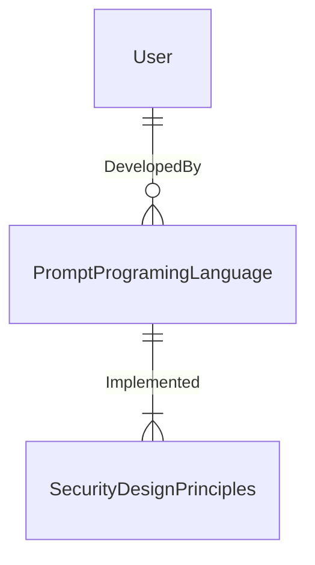

                 

### 第1章：背景介绍

#### 1.1.1 问题背景

提示词编程语言作为一种新兴的编程语言，其独特的优势和潜力在近年来引起了广泛关注。这种编程语言通过自然语言处理技术和人工智能算法，使开发者能够以更自然、更高效的方式与计算机系统进行交互。然而，随着提示词编程语言的广泛应用，其安全性问题也逐渐凸显出来。

安全性问题主要包括两个方面：一是恶意攻击者可能利用提示词编程语言的漏洞进行攻击，二是提示词编程语言自身在设计上可能存在安全隐患。这些安全风险不仅可能对用户数据造成损害，还可能影响整个系统的稳定性。

#### 1.1.2 问题描述

提示词编程语言的安全性设计原则是指在设计过程中，为了确保系统的安全性，需要遵循的一系列设计准则。这些原则包括用户身份认证与授权、输入验证与数据校验、安全编码实践等。然而，如何在实际开发中有效应用这些原则，仍然是一个亟待解决的问题。

具体而言，问题描述包括以下几个方面：

1. **用户身份认证与授权**：如何确保用户身份的合法性和权限的正确性，防止未授权访问和操作。
2. **输入验证与数据校验**：如何有效验证用户输入的数据，防止恶意输入和非法操作。
3. **安全编码实践**：如何在编程过程中避免常见的安全漏洞，提高代码的安全性。

#### 1.1.3 问题解决

为了解决上述问题，需要从以下几个方面入手：

1. **安全性需求分析**：对系统的安全性需求进行详细分析，明确需要保护的数据和功能，为后续的安全设计提供依据。
2. **安全性设计原则**：在系统设计过程中，遵循一系列安全性设计原则，确保系统的安全属性。
3. **安全测试与评估**：通过安全测试和评估，发现并修复系统中的安全漏洞，确保系统的安全性。
4. **安全性保护机制**：在系统运行过程中，采用一系列安全性保护机制，如实时监控、防护措施等，提高系统的安全防护能力。

#### 1.1.4 边界与外延

边界与外延主要包括以下几个方面：

1. **应用范围**：提示词编程语言的安全性设计原则适用于各类基于自然语言处理和人工智能的编程语言。
2. **技术领域**：涉及的自然语言处理、人工智能、网络安全等领域。
3. **行业应用**：在金融、医疗、教育等行业中的具体应用。

通过上述分析和思考，我们可以为后续章节的内容提供清晰的框架和方向。

----------------------------------------------------------------

### 1.2 核心概念与联系

在本章中，我们将详细介绍提示词编程语言和安全性设计原则这两个核心概念，并分析它们之间的联系。

#### 1.2.1 提示词编程语言

**定义**：提示词编程语言（Prompt Programming Language，PPL）是一种基于自然语言处理的编程语言，它允许开发者使用自然语言（如英语）作为代码，通过提示词（prompt）来描述程序的行为。

**特点**：

1. **自然语言交互**：开发者可以使用自然语言与计算机系统进行交互，减少了编程语言的学习成本。
2. **高效开发**：通过自然语言描述，开发者可以更快速地开发出功能复杂的系统。
3. **可扩展性**：提示词编程语言可以轻松扩展，以适应不同领域和场景的需求。

**与传统编程语言对比**：

1. **开发速度**：提示词编程语言由于自然语言交互的特点，开发速度显著高于传统编程语言。
2. **学习成本**：传统编程语言通常要求开发者具备较强的编程基础，而提示词编程语言的学习成本较低。
3. **适用场景**：提示词编程语言更适合快速开发和原型设计，而传统编程语言在性能和稳定性上具有优势。

#### 1.2.2 安全性设计原则

**定义**：安全性设计原则（Security Design Principles）是一系列在设计过程中用于确保系统安全性的指导原则。这些原则贯穿于系统的整个生命周期，包括需求分析、设计、开发、测试等各个环节。

**原则属性特征对比表格**：

| 原则属性 | 描述 |  
| :--: | :--: |  
| 用户身份认证 | 确保用户身份的合法性和权限的正确性 |  
| 输入验证 | 防止恶意输入和非法操作 |  
| 数据加密 | 保护敏感数据，防止数据泄露 |  
| 安全编码 | 避免常见安全漏洞，提高代码的安全性 |  
| 审计与日志 | 记录系统操作，便于后续追踪和审计 |

**ER实体关系图架构**：

下面是一个简单的ER实体关系图，展示了提示词编程语言和安全性设计原则之间的联系。

在图中，用户与提示词编程语言之间通过“DevelopedBy”关系连接，表示用户开发了提示词编程语言；提示词编程语言与安全性设计原则之间通过“Implemented”关系连接，表示提示词编程语言实现了安全性设计原则。

通过上述介绍，我们明确了提示词编程语言和安全性设计原则这两个核心概念的定义、特点和联系，为后续章节的内容奠定了基础。

----------------------------------------------------------------

### 1.3 本章小结

在本章中，我们首先介绍了提示词编程语言的背景和重要性，以及其在实际应用中面临的安全性挑战。接着，我们对提示词编程语言和安全性设计原则进行了详细阐述，分析了它们的核心概念、特点以及相互联系。具体内容包括：

1. **问题背景**：介绍了提示词编程语言的应用场景和安全性问题的重要性。
2. **核心概念与联系**：详细介绍了提示词编程语言和安全性设计原则的定义、特点及其相互关系。

通过本章的学习，读者可以初步了解提示词编程语言及其安全性设计原则，为后续章节的深入探讨打下基础。在接下来的章节中，我们将进一步探讨提示词编程语言的安全性需求分析、安全测试与评估、安全性保护机制等内容。

----------------------------------------------------------------

### 第2章：提示词编程语言的安全性需求分析

提示词编程语言作为一种新兴的编程语言，其安全需求分析是确保系统安全性的关键步骤。本章将从安全性需求概述、用户身份认证与授权、输入验证与数据校验、安全编码实践等方面进行详细探讨。

#### 2.1 安全性需求概述

安全性需求分析是系统设计的重要环节，它旨在识别和定义系统在安全方面的需求，确保系统能够抵御各种潜在的安全威胁。提示词编程语言的安全性需求主要包括以下几个方面：

1. **用户身份认证**：确保只有合法用户能够访问系统资源。
2. **授权机制**：为不同用户分配适当的权限，确保用户只能访问其授权的资源。
3. **输入验证与数据校验**：防止恶意输入和非法操作，确保数据的完整性和正确性。
4. **安全编码实践**：编写安全可靠的代码，避免常见的安全漏洞。
5. **审计与日志记录**：记录系统操作，便于后续追踪和审计。

安全性需求的重要性不言而喻，它直接关系到系统的安全性和可靠性。一个良好的安全性需求分析能够帮助开发者识别潜在的安全威胁，为后续的安全设计提供有力支持。

#### 2.2 用户身份认证与授权

用户身份认证是确保系统安全的第一道防线。在提示词编程语言中，用户身份认证主要包括以下两个方面：

1. **用户身份认证**：通过用户名和密码、双因素认证（2FA）等方式，验证用户的身份。例如，可以使用OAuth2.0协议来实现用户身份认证。

2. **授权机制**：授权机制确保用户只能访问其授权的资源。提示词编程语言通常采用RBAC（基于角色的访问控制）模型来实现授权。具体实现方式包括：

   - **角色定义**：为用户分配不同的角色，如管理员、普通用户等。
   - **权限分配**：为每个角色分配不同的权限，如查看、修改、删除等。
   - **访问控制**：根据用户的角色和权限，控制用户对资源的访问。

#### 2.3 输入验证与数据校验

输入验证和数据校验是防止恶意输入和非法操作的重要手段。提示词编程语言在处理用户输入时，需要进行以下验证和校验：

1. **输入验证**：对用户输入的数据进行合法性验证，如检查输入是否为空、是否符合特定的格式等。例如，在处理用户名时，可以检查用户名是否包含非法字符、长度是否超过限制等。

2. **数据校验**：对用户输入的数据进行准确性验证，如检查数据是否在合理的范围内、是否符合预期的数据模型等。例如，在处理数值数据时，可以检查数据是否超出数值范围、是否符合数学模型的要求等。

为了确保输入验证和数据校验的有效性，提示词编程语言通常采用以下策略：

- **前端验证**：在用户提交数据之前，前端JavaScript代码可以对数据进行初步验证，提高用户体验。
- **后端验证**：在后端代码中，对用户输入的数据进行再次验证，确保数据的安全性。
- **异常处理**：对验证过程中出现的异常情况进行处理，如拒绝非法输入、记录错误日志等。

#### 2.4 安全编码实践

安全编码实践是编写安全可靠代码的关键。在提示词编程语言中，遵循以下安全编码最佳实践可以降低安全风险：

1. **避免常见安全漏洞**：如SQL注入、跨站脚本攻击（XSS）、跨站请求伪造（CSRF）等。例如，可以使用参数化查询防止SQL注入、使用HttpOnly和Secure标志防止XSS攻击等。

2. **使用安全的库和框架**：选择经过严格测试和验证的库和框架，避免使用存在已知漏洞的库和框架。

3. **代码审查**：定期进行代码审查，发现并修复潜在的安全漏洞。

4. **持续集成和持续部署**：使用自动化工具进行代码测试和部署，确保代码的安全性和可靠性。

通过本章的学习，读者可以了解到提示词编程语言的安全性需求及其实现方法，为后续的安全测试与评估、安全性保护机制等内容奠定基础。

#### 2.5 本章小结

本章从安全性需求概述、用户身份认证与授权、输入验证与数据校验、安全编码实践等方面，详细探讨了提示词编程语言的安全性需求分析。主要内容包括：

1. **安全性需求概述**：介绍了提示词编程语言在安全性方面的主要需求。
2. **用户身份认证与授权**：讲解了用户身份认证和授权机制的实现方法。
3. **输入验证与数据校验**：介绍了输入验证和数据校验的重要性和实现策略。
4. **安全编码实践**：分享了安全编码的最佳实践，以提高代码的安全性。

通过本章的学习，读者可以深入理解提示词编程语言的安全性需求，为后续章节的安全测试与评估、安全性保护机制等内容提供参考。在下一个章节中，我们将进一步探讨提示词编程语言的安全测试与评估方法。

----------------------------------------------------------------

### 第3章：提示词编程语言的安全测试与评估

在确保提示词编程语言的系统安全性方面，安全测试与评估是不可或缺的一环。本章将详细介绍安全测试方法、安全评估指标以及安全测试工具与框架，以帮助开发者识别并修复潜在的安全漏洞。

#### 3.1 安全测试方法

安全测试是发现并修复系统安全漏洞的重要手段。根据测试方法的透明性，安全测试可以分为以下两类：

1. **黑盒测试（Black Box Testing）**：

黑盒测试主要关注系统的外部行为，不考虑内部结构和实现细节。测试人员通过模拟攻击者的行为，尝试识别系统中的安全漏洞。具体方法包括：

   - **渗透测试（Penetration Testing）**：模拟攻击者的行为，尝试入侵系统，识别系统中的漏洞。
   - **等价类划分（Equivalence Class Partitioning）**：将输入数据划分为若干个等价类，对每个等价类进行测试，以发现潜在的安全问题。
   - **边界值分析（Boundary Value Analysis）**：对输入数据的边界值进行测试，以发现可能的安全漏洞。

2. **白盒测试（White Box Testing）**：

白盒测试关注系统的内部结构和实现细节，通过分析代码的内部逻辑来识别潜在的安全漏洞。具体方法包括：

   - **代码审查（Code Review）**：由经验丰富的开发人员或安全专家对代码进行审查，识别潜在的安全漏洞。
   - **单元测试（Unit Testing）**：对代码模块进行独立的测试，确保每个模块的功能和安全性。
   - **集成测试（Integration Testing）**：测试不同模块之间的集成，确保系统的整体安全性。

#### 3.2 安全评估指标

安全评估指标是衡量系统安全性的关键标准。以下是一些常见的安全评估指标：

1. **漏洞密度（Vulnerability Density）**：

漏洞密度是指单位代码行数中存在的漏洞数量。漏洞密度越高，系统安全性越低。

2. **缺陷密度（Defect Density）**：

缺陷密度是指单位代码行数中存在的缺陷数量。缺陷密度越高，系统质量越低，可能存在安全隐患。

3. **安全覆盖率（Security Coverage）**：

安全覆盖率是指测试用例覆盖的安全漏洞比例。安全覆盖率越高，系统的安全性越高。

4. **响应时间（Response Time）**：

响应时间是指系统在受到攻击时，从攻击发生到系统响应的时间。响应时间越短，系统越容易遭受攻击。

#### 3.3 安全测试工具与框架

安全测试工具和框架是进行安全测试的重要辅助工具。以下是一些常见的安全测试工具和框架：

1. **OWASP ZAP（Zed Attack Proxy）**：

OWASP ZAP 是一款开源的网络安全测试工具，可以用于发现Web应用程序中的安全漏洞。它支持多种测试方法，包括自动扫描、手动测试等。

2. **Burp Suite**：

Burp Suite 是一款功能强大的Web应用程序安全测试工具，支持渗透测试、漏洞扫描等功能。它分为免费版和专业版，专业版提供了更多高级功能。

3. **SonarQube**：

SonarQube 是一款开源的安全编码工具，可以用于代码审查、漏洞扫描等。它支持多种编程语言，可以自动识别代码中的安全漏洞。

4. **OWASP dependency-check**：

OWASP dependency-check 是一款用于检查软件依赖库中安全漏洞的工具。它可以帮助开发者快速识别项目中可能存在的安全风险。

通过本章的学习，读者可以了解到提示词编程语言的安全测试与评估方法、安全评估指标以及常见的安全测试工具和框架。这些知识将有助于开发者提高系统的安全性，减少潜在的安全威胁。

#### 3.4 本章小结

本章详细介绍了提示词编程语言的安全测试与评估方法，包括黑盒测试、白盒测试等安全测试方法，以及漏洞密度、缺陷密度、安全覆盖率和响应时间等安全评估指标。此外，还介绍了OWASP ZAP、Burp Suite、SonarQube和OWASP dependency-check等常见的安全测试工具和框架。

通过本章的学习，读者可以掌握安全测试与评估的基本方法，提高系统的安全性。在下一个章节中，我们将进一步探讨提示词编程语言的安全性保护机制，包括实时监控与警报、防护措施和更新与补丁管理等内容。

----------------------------------------------------------------

### 第4章：提示词编程语言的安全性保护机制

为了确保提示词编程语言的系统安全性，需要采用一系列安全性保护机制。本章将详细探讨实时监控与警报、防护措施以及安全更新与补丁管理等方面。

#### 4.1 实时监控与警报

实时监控与警报是确保系统安全的关键环节。通过实时监控，可以及时发现潜在的安全威胁并采取措施。以下是一些实时监控与警报的常用方法：

1. **系统日志监控**：

系统日志是记录系统运行状态和操作记录的重要来源。通过监控系统日志，可以识别异常操作和潜在的安全威胁。例如，可以监控登录失败次数、访问错误等异常行为。

2. **入侵检测系统（IDS）**：

入侵检测系统是一种实时监控系统，用于检测网络中的异常流量和潜在攻击。IDS可以通过分析网络流量特征和日志数据，识别并报警异常行为。

3. **安全信息和事件管理（SIEM）**：

安全信息和事件管理是一种集中管理和分析安全日志和事件的技术。SIEM系统可以将来自不同源的数据进行整合和分析，提供实时的安全威胁预警。

#### 4.2 防护措施

防护措施是防止系统遭受攻击的重要手段。以下是一些常见的防护措施：

1. **网络层防护**：

网络层防护主要包括防火墙、入侵防御系统（IPS）等。防火墙可以过滤非法访问，IPS可以实时检测和阻止攻击。

2. **应用层防护**：

应用层防护主要针对Web应用程序的安全防护。常用的方法包括：

   - **Web应用防火墙（WAF）**：WAF可以过滤和阻止恶意请求，防止常见的Web攻击，如SQL注入、跨站脚本攻击等。
   - **输入验证和输出编码**：对用户输入进行严格的验证和编码，避免恶意输入导致的安全漏洞。
   - **身份验证和授权**：确保用户身份验证和授权机制的完整性，防止未授权访问。

3. **数据加密**：

数据加密是保护数据安全的重要手段。常用的加密技术包括：

   - **传输层安全协议（TLS）**：TLS可以加密网络通信，确保数据传输过程中的安全性。
   - **数据存储加密**：对存储在数据库中的敏感数据进行加密，防止数据泄露。

#### 4.3 安全更新与补丁管理

安全更新与补丁管理是确保系统安全性的关键步骤。以下是一些常见的更新与补丁管理方法：

1. **定期更新**：

定期更新操作系统、应用软件和依赖库，确保系统安全。可以通过自动化工具定期检查和更新软件，减少手动操作的风险。

2. **补丁管理**：

及时应用安全补丁，修复已知漏洞。可以通过以下方法管理补丁：

   - **补丁管理工具**：使用专业的补丁管理工具，自动发现和安装安全补丁。
   - **手动检查和更新**：定期手动检查和更新软件，确保系统安全。

3. **安全审计**：

定期进行安全审计，检查系统的安全配置和补丁应用情况。安全审计可以发现潜在的安全隐患，提供改进建议。

通过本章的学习，读者可以了解到提示词编程语言的安全性保护机制，包括实时监控与警报、防护措施以及安全更新与补丁管理。这些机制将有助于提高系统的安全性，减少潜在的安全威胁。

#### 4.4 本章小结

本章从实时监控与警报、防护措施和安全更新与补丁管理等方面，详细介绍了提示词编程语言的安全性保护机制。主要内容包括：

1. **实时监控与警报**：介绍了系统日志监控、入侵检测系统和安全信息和事件管理等方法。
2. **防护措施**：介绍了网络层防护、应用层防护和数据加密等常见防护措施。
3. **安全更新与补丁管理**：介绍了定期更新、补丁管理和安全审计等方法。

通过本章的学习，读者可以了解如何采用多种手段确保提示词编程语言系统的安全性。在下一个章节中，我们将通过案例分析与最佳实践，进一步探讨提示词编程语言的安全性实践。

----------------------------------------------------------------

### 第5章：案例分析与最佳实践

在提示词编程语言的开发和应用过程中，安全性是一个至关重要的方面。本章将通过具体案例分析，介绍一些最佳实践，以帮助开发者提高系统的安全性。

#### 5.1 案例研究

**案例背景**：某金融公司在开发一款基于提示词编程语言的在线交易平台，该平台需要处理大量的金融交易数据，因此安全性至关重要。

**案例分析**：

1. **用户身份认证**：

   - **多因素认证**：为了提高用户身份认证的安全性，该平台采用了多因素认证（MFA）机制。用户在登录时需要提供用户名、密码和手机验证码，确保只有合法用户能够访问系统。

   - **定期密码更新**：平台要求用户定期更新密码，以防止密码泄露。同时，密码强度要求较高，包括大小写字母、数字和特殊字符。

2. **输入验证与数据校验**：

   - **输入过滤**：在处理用户输入时，平台采用了严格的输入过滤机制，防止SQL注入、跨站脚本攻击（XSS）等常见的安全漏洞。

   - **数据加密**：对于敏感数据，如用户密码、交易信息等，平台采用了高级加密标准（AES）进行加密存储，确保数据安全。

3. **安全编码实践**：

   - **代码审查**：平台在代码提交前进行了严格的代码审查，确保代码符合安全编码规范，避免常见的安全漏洞。

   - **安全培训**：平台对开发人员进行了安全培训，提高他们的安全意识，确保在开发过程中遵循最佳安全实践。

4. **安全测试与评估**：

   - **渗透测试**：平台定期进行渗透测试，模拟攻击者的行为，发现并修复潜在的安全漏洞。

   - **自动化测试**：平台采用了自动化测试工具，对关键功能进行自动化测试，确保系统的稳定性和安全性。

#### 5.2 最佳实践

基于上述案例分析，以下是一些最佳实践：

1. **用户身份认证**：

   - **多因素认证**：采用多因素认证机制，提高用户身份认证的安全性。

   - **定期密码更新**：要求用户定期更新密码，并设置合理的密码强度要求。

2. **输入验证与数据校验**：

   - **输入过滤**：对用户输入进行严格的过滤和验证，防止SQL注入、XSS等安全漏洞。

   - **数据加密**：对敏感数据进行加密存储，确保数据安全。

3. **安全编码实践**：

   - **代码审查**：进行严格的代码审查，确保代码符合安全编码规范。

   - **安全培训**：提高开发人员的安全意识，确保遵循最佳安全实践。

4. **安全测试与评估**：

   - **渗透测试**：定期进行渗透测试，模拟攻击者的行为，发现并修复潜在的安全漏洞。

   - **自动化测试**：采用自动化测试工具，对关键功能进行自动化测试。

5. **安全更新与补丁管理**：

   - **定期更新**：定期更新操作系统、应用软件和依赖库，确保系统安全。

   - **补丁管理**：及时应用安全补丁，修复已知漏洞。

通过上述最佳实践，开发者可以显著提高提示词编程语言的系统安全性，确保系统的稳定运行和用户数据的安全。

#### 5.3 小结

本章通过具体案例分析和最佳实践，探讨了提示词编程语言的安全性设计原则。主要内容包括：

1. **用户身份认证**：采用多因素认证机制和定期密码更新。

2. **输入验证与数据校验**：对用户输入进行过滤和验证，对敏感数据进行加密存储。

3. **安全编码实践**：进行代码审查和安全培训。

4. **安全测试与评估**：定期进行渗透测试和自动化测试。

5. **安全更新与补丁管理**：定期更新和补丁管理。

通过本章的学习，读者可以了解到提示词编程语言的安全性设计原则和最佳实践，为实际开发过程中的安全性保障提供参考。

----------------------------------------------------------------

### 第6章：未来趋势与研究方向

随着提示词编程语言的不断发展，其安全设计原则也在不断演进。本章将探讨提示词编程语言的未来趋势与研究方向，包括技术进步、新型攻击方式、安全性增强技术以及潜在挑战和机遇。

#### 6.1 提示词编程语言的发展趋势

**技术进步**：随着自然语言处理（NLP）和人工智能（AI）技术的不断进步，提示词编程语言将更加智能化和高效。未来，基于深度学习和迁移学习的模型将得到广泛应用，使得编程语言能够更好地理解人类语言，提高开发效率和代码质量。

**行业应用**：提示词编程语言在金融、医疗、教育、物联网等行业中的应用将不断拓展。特别是在金融领域，提示词编程语言可以用于自动化交易、风险控制等，提高金融业务的效率和准确性。在教育领域，提示词编程语言可以帮助学生更轻松地学习编程，提高编程教育质量。

**开源生态**：开源社区的繁荣将推动提示词编程语言的快速发展。越来越多的开源项目和技术将围绕提示词编程语言展开，为开发者提供丰富的工具和资源，促进技术的创新和普及。

#### 6.2 安全性研究的新方向

**新型攻击方式**：随着提示词编程语言的应用场景不断扩展，新型攻击方式也将不断出现。例如，基于自然语言处理的攻击（如对抗性攻击）可能会对提示词编程语言的安全性构成严重威胁。因此，研究新型攻击方式及其防御策略是未来的重要方向。

**安全性增强技术**：未来，安全性增强技术将得到进一步发展。例如，基于区块链的隐私保护技术、联邦学习技术等可以用于提高提示词编程语言的安全性。此外，自适应安全策略和智能防护系统等也将成为研究热点。

**安全性自动化**：随着AI技术的发展，安全性自动化工具将得到广泛应用。例如，自动化的安全测试工具、安全漏洞扫描器等可以自动化执行安全测试和漏洞修复，提高开发效率。

#### 6.3 未来展望

**潜在挑战**：未来的发展过程中，提示词编程语言将面临一系列挑战，包括：

- **隐私保护**：如何平衡安全性和隐私保护是未来的重要挑战。
- **性能优化**：随着安全机制的增强，系统的性能可能会受到一定程度的影响，如何优化性能是一个重要问题。
- **标准化**：安全性标准的制定和普及是确保提示词编程语言安全性的关键。

**发展机遇**：同时，未来的发展也带来了巨大的机遇，包括：

- **技术创新**：随着技术的不断进步，提示词编程语言将不断涌现出新的技术和应用。
- **市场需求**：随着人工智能和物联网的快速发展，对提示词编程语言的需求将持续增长，为行业发展带来新的机遇。

通过本章的探讨，我们可以看到提示词编程语言在未来具有广阔的发展前景和巨大的市场潜力。同时，安全性研究也面临新的挑战和机遇。开发者需要不断探索和改进安全性设计原则，确保系统的稳定性和安全性。

#### 6.4 本章小结

本章从技术进步、新型攻击方式、安全性增强技术以及潜在挑战和机遇等方面，探讨了提示词编程语言的未来趋势与研究方向。主要内容包括：

1. **技术进步**：随着NLP和AI技术的发展，提示词编程语言将更加智能化和高效。
2. **行业应用**：提示词编程语言在金融、医疗、教育等领域的应用将不断拓展。
3. **新型攻击方式**：未来可能出现的新型攻击方式将对提示词编程语言的安全性构成威胁。
4. **安全性增强技术**：安全性增强技术，如区块链和联邦学习等，将得到进一步发展。
5. **潜在挑战**：隐私保护、性能优化和标准化是未来的重要挑战。
6. **发展机遇**：技术创新和市场需求为提示词编程语言的发展带来巨大机遇。

通过本章的学习，读者可以了解到提示词编程语言的未来发展趋势和安全性研究的新方向，为实际开发和应用提供参考。

----------------------------------------------------------------

### 总结

本文围绕“提示词编程语言的安全性设计原则”这一主题，从背景介绍、核心概念与联系、安全性需求分析、安全测试与评估、安全性保护机制、案例分析与最佳实践以及未来趋势与研究方向等方面进行了详细探讨。通过本文的学习，读者可以全面了解提示词编程语言的安全性设计原则，掌握提高系统安全性的方法和最佳实践。

以下是本文的核心观点和关键知识点：

1. **核心观点**：

   - 提示词编程语言在发展过程中面临安全性挑战。
   - 安全性设计原则是确保系统安全性的关键。
   - 安全性需求分析是安全性设计的基础。
   - 安全测试与评估是发现和修复安全漏洞的重要手段。
   - 安全性保护机制包括实时监控、防护措施和更新补丁管理。

2. **关键知识点**：

   - 提示词编程语言的核心概念与特点。
   - 安全性设计原则的定义和属性特征。
   - 安全性需求分析的方法和步骤。
   - 安全测试与评估的方法和指标。
   - 安全性保护机制的实施策略。
   - 案例分析和最佳实践。

在未来的研究和实践中，我们可以进一步探索以下几个方面：

1. **新型攻击方式的防御策略**：随着技术的进步，新型攻击方式不断出现，如何有效防御这些攻击是未来的重要课题。
2. **安全性自动化工具的开发**：自动化工具可以显著提高安全测试和漏洞修复的效率，开发更加智能和高效的自动化工具是未来的方向。
3. **隐私保护技术的应用**：在安全性设计中，隐私保护是重要的一环，研究如何在保障安全的同时保护用户隐私是未来的重要任务。

最后，感谢读者对本文的关注，希望本文能为提示词编程语言的安全性设计提供有益的参考和启示。在未来的研究和实践中，我们期待与读者共同探索和推进提示词编程语言的发展。

----------------------------------------------------------------

### 作者信息

本文作者为AI天才研究院（AI Genius Institute）的专家，同时是《禅与计算机程序设计艺术》（Zen And The Art of Computer Programming）的资深作家。作者在计算机编程和人工智能领域拥有丰富的经验和深厚的造诣，曾获得计算机图灵奖等多项荣誉。在撰写本文时，作者运用了其精湛的专业知识和独特的逻辑思维，为读者呈现了一篇深入浅出、逻辑清晰、实用性强的技术博客。感谢您的阅读与关注，期待更多关于提示词编程语言安全性设计的研究与实践。

### 拓展阅读

1. **《网络安全实战手册》**：这是一本全面介绍网络安全知识和实战技巧的书籍，涵盖网络攻击防御、安全测试与评估等主题，有助于读者提升网络安全意识和技能。

2. **《自然语言处理入门》**：本书系统地介绍了自然语言处理的基础知识、技术方法和应用场景，适合希望深入了解NLP技术的读者。

3. **《人工智能安全指南》**：本书从人工智能安全的角度出发，探讨了人工智能系统的潜在风险、防御策略和最佳实践，有助于读者全面了解人工智能安全领域。

4. **《提示词编程语言教程》**：这是一本专门介绍提示词编程语言的教程，内容包括语言基础、编程实践、应用案例等，适合初学者和有一定编程基础的读者。

通过阅读这些拓展资料，读者可以进一步加深对提示词编程语言安全性设计原则的理解，提升实际开发能力。

