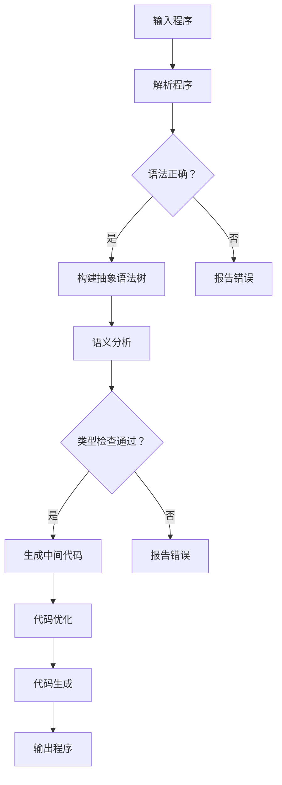
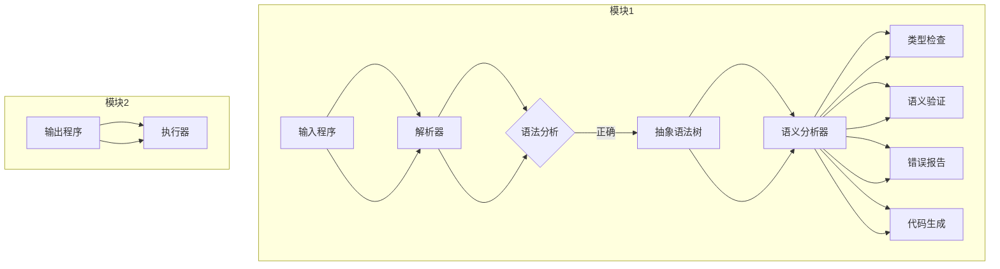
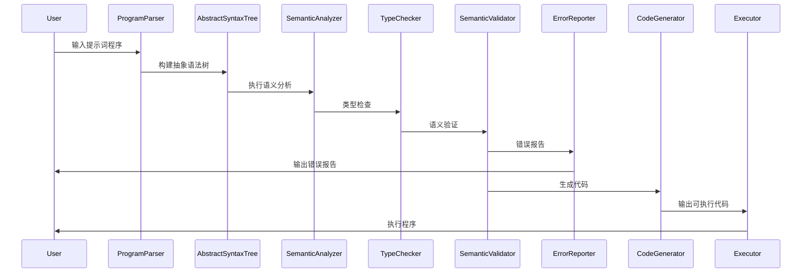

                 

**引言**

在当今技术迅猛发展的时代，编程语言的形式化语义分析已成为计算机科学领域的一个重要分支。近年来，提示词编程语言作为一种新型的编程范式，逐渐受到了广泛关注。这类语言通过简洁、高效的提示词（prompts）来指导程序执行，不仅提高了编程效率，还为自然语言处理和人工智能领域带来了新的可能性。

本文以《提示词编程语言的形式化语义分析》为题，旨在深入探讨提示词编程语言的语义特性，以及如何通过形式化语义分析来提高这类语言的可靠性和可理解性。本文将分为以下几个部分进行阐述：

1. **问题背景**：介绍提示词编程语言的发展背景和形式化语义分析的重要性。
2. **核心概念与联系**：定义提示词编程语言和形式化语义分析的核心概念，并进行对比分析。
3. **算法原理讲解**：详细解析形式化语义分析的算法原理，包括流程图、Python实现、数学模型和例子。
4. **系统分析与架构设计**：描述系统功能、架构和接口设计，以及系统交互过程。
5. **项目实战**：通过具体项目展示如何实现形式化语义分析，包括环境安装、核心代码实现和分析。
6. **最佳实践与总结**：总结最佳实践，提出注意事项，并推荐拓展阅读。

通过上述结构的逐步分析，我们将探索提示词编程语言的形式化语义分析的深度和广度，以期为读者提供全面而深入的理解。

### 问题背景

提示词编程语言的概念起源于自然语言处理（NLP）和人工智能（AI）领域，其核心思想是通过自然语言提示来指导程序执行。这类语言的出现打破了传统编程语言需要编写复杂代码的壁垒，使得编程更加直观、简洁。随着AI技术的发展，提示词编程语言逐渐成为一种新兴的编程范式，其优势在于：

- **提高编程效率**：提示词编程语言通过自然语言来描述程序逻辑，减少了编程过程中的冗余步骤，使得开发者能够更快地实现功能。
- **易于学习和使用**：与传统的编程语言相比，提示词编程语言更接近日常语言，使得非专业的编程人员也能够快速上手。
- **增强人机交互**：通过自然语言提示，用户可以更加方便地与程序进行交互，提升了人机交互的体验。

然而，提示词编程语言在应用过程中也面临着一些挑战。首先，如何保证程序的执行结果是正确和可靠的成为一个重要问题。传统的形式化语义分析方法在处理复杂逻辑和高级特性时可能显得力不从心。其次，提示词编程语言的语义解释往往依赖于上下文，这增加了形式化语义分析的计算复杂度。

形式化语义分析在编程语言领域扮演着关键角色，其主要目标是通过数学和逻辑手段对编程语言的语义进行严格定义和分析。形式化语义分析的重要性体现在以下几个方面：

1. **确保程序的正确性**：通过形式化语义分析，可以验证程序在特定环境下是否满足预期的行为，从而提高程序的可靠性和安全性。
2. **增强程序的可理解性**：形式化语义分析使得编程语言的语义变得更加清晰和直观，有助于开发者理解和维护代码。
3. **支持新编程语言的设计**：形式化语义分析为新编程语言的设计提供了理论支持，可以帮助开发者更好地定义语言特性，并确保其一致性。

在提示词编程语言的发展历程中，形式化语义分析的应用显得尤为重要。早期的提示词编程语言如Prolog和OPS5等，由于缺乏严格的形式化语义定义，往往导致程序的不可预测性。随着形式化语义分析技术的发展，现代的提示词编程语言如Python的Prompt Toolkit和GPT-3等，通过引入形式化语义分析方法，显著提升了程序的可靠性和可理解性。

总之，形式化语义分析为提示词编程语言提供了强大的理论支持，不仅解决了其在语义解释和可靠性方面的挑战，也为编程语言的进一步发展奠定了基础。接下来，我们将进一步探讨提示词编程语言和形式化语义分析的核心概念及其联系。

### 核心概念与联系

在本节中，我们将深入探讨提示词编程语言和形式化语义分析的核心概念，并分析这些概念之间的联系。

**提示词编程语言的核心概念**

提示词编程语言通过自然语言提示来引导程序执行，其核心概念包括：

1. **提示（Prompt）**：提示是编程语言的核心元素，它类似于传统的函数调用或命令。提示通常由自然语言短语组成，描述了程序需要执行的操作。
2. **上下文（Context）**：上下文是提示执行的环境，包含程序运行时的各种信息，如变量值、历史记录等。上下文为提示提供了必要的信息，使得提示能够被正确理解和执行。
3. **动态绑定（Dynamic Binding）**：提示词编程语言通常具有动态绑定的特性，即变量的值在运行时确定，而不是在编译时。这使得程序具有更高的灵活性和适应性。

**形式化语义分析的核心概念**

形式化语义分析是一种通过数学和逻辑方法来严格定义编程语言语义的技术，其核心概念包括：

1. **语义模型（Semantic Model）**：语义模型是形式化语义分析的基础，它定义了编程语言中的每个语法元素的语义。通过语义模型，可以描述程序在执行过程中可能的状态和转换。
2. **环境（Environment）**：环境是一个映射关系，它将变量名映射到具体的值。环境是语义模型的一部分，用于解释程序中的变量引用。
3. **类型系统（Type System）**：类型系统是确保程序正确性的关键机制，它定义了程序中每个值的类型，并规定了不同类型之间如何进行操作。

**概念之间的联系**

提示词编程语言和形式化语义分析之间存在着紧密的联系：

1. **语义模型的建立**：提示词编程语言的形式化语义分析首先需要建立一个语义模型，这个模型能够准确地描述提示和上下文之间的关系。例如，可以使用一个函数来表示提示，其输入是上下文，输出是程序执行的结果。
2. **上下文与环境的结合**：上下文是形式化语义分析中环境的一部分。在形式化语义分析中，上下文提供了一个运行时环境，使得语义模型中的变量引用可以找到相应的值。
3. **动态绑定与类型系统的融合**：形式化语义分析中的类型系统需要考虑动态绑定的特性。这意味着类型系统不仅要验证静态代码的类型一致性，还需要能够在运行时根据上下文动态地调整类型。

通过这些核心概念和联系，我们可以更好地理解提示词编程语言的语义特性，并通过形式化语义分析来提升其可靠性和可理解性。接下来，我们将通过ER实体关系图来进一步阐述这些概念之间的关系。

### 概念属性特征对比

在深入探讨提示词编程语言和形式化语义分析的核心概念之后，我们需要通过概念属性特征对比来更清晰地展示它们之间的异同。以下是一个详细的对比表格，用于比较提示词编程语言与常规编程语言，以及形式化语义分析与传统语义分析的特点。

| 特征 | 提示词编程语言 | 常规编程语言 | 形式化语义分析 | 传统语义分析 |
| ---- | ------------- | ------------ | ------------- | ------------- |
| **提示** | 自然语言短语，描述程序操作 | 代码指令，包括函数、循环、条件语句等 | 描述程序状态的转换和输出 | 指令执行结果，通常不涉及具体提示 |
| **上下文** | 包含运行时信息，如变量值、历史记录等 | 包含程序执行的当前状态，但通常不涉及上下文信息 | 描述程序执行环境，用于绑定变量 | 不涉及上下文，仅描述指令执行结果 |
| **动态绑定** | 变量在运行时确定 | 变量在编译时确定 | 考虑动态绑定的类型系统 | 不考虑动态绑定，类型在编译时确定 |
| **语义模型** | 描述提示和上下文之间的关系 | 描述程序结构，执行过程 | 形式化描述程序行为，确保正确性 | 描述程序执行过程，但可能缺乏严格性 |
| **环境** | 映射变量名到值，提供运行时信息 | 提供变量引用的绑定环境 | 确保变量引用的正确性 | 不一定严格定义环境，可能依赖于直觉和经验 |
| **类型系统** | 动态类型系统，支持类型推断 | 静态类型系统，类型声明明确 | 结合动态绑定，确保类型一致性 | 静态类型系统，强调类型声明和检查 |

通过这个对比表格，我们可以清晰地看到提示词编程语言、常规编程语言、形式化语义分析以及传统语义分析在概念属性特征上的异同。提示词编程语言通过自然语言提示和上下文信息，提供了更直观和灵活的编程方式；而形式化语义分析则通过严格的数学和逻辑方法，确保程序的正确性和可理解性。

接下来，我们将通过Mermaid流程图来描述形式化语义分析的过程，以便更直观地理解这些概念在形式化语义分析中的实际应用。

### ER实体关系图架构

为了更直观地展示提示词编程语言和形式化语义分析的概念之间的关系，我们采用Mermaid流程图来构建ER（实体关系）图。ER图是一种用于描述实体及其之间关系的图形化工具，非常适合用于描述复杂系统的结构。

以下是提示词编程语言和形式化语义分析的ER图：

```mermaid
erDiagram
    User ||--|{ PromptBasedLanguage } : uses
    PromptBasedLanguage ||--|{ SemanticAnalysis } : analyzes
    SemanticAnalysis ||--|{ SemanticModel } : defines
    SemanticAnalysis ||--|{ TypeSystem } : enforces
    SemanticModel ||--|{ Context } : includes
    Context ||--|{ VariableBinding } : binds
    VariableBinding ||--|{ Value } : holds

    User : {name}
    PromptBasedLanguage : {name}
    SemanticAnalysis : {methodology}
    SemanticModel : {semantics}
    TypeSystem : {type_checking}
    Context : {context}
    VariableBinding : {variable, binding}
    Value : {value}
```

在这个ER图中：

- **User**（用户）与**PromptBasedLanguage**（提示词编程语言）之间存在“使用”关系，表示用户使用提示词编程语言进行编程。
- **PromptBasedLanguage**与**SemanticAnalysis**（形式化语义分析）之间存在“分析”关系，表示形式化语义分析被用来分析提示词编程语言的语义。
- **SemanticAnalysis**与**SemanticModel**（语义模型）之间存在“定义”关系，表示语义模型用于定义程序的状态转换和输出。
- **SemanticAnalysis**与**TypeSystem**（类型系统）之间存在“强制”关系，表示类型系统用于确保程序中类型的一致性。
- **SemanticModel**与**Context**（上下文）之间存在“包含”关系，表示上下文是语义模型的一部分，包含程序运行时的信息。
- **Context**与**VariableBinding**（变量绑定）之间存在“绑定”关系，表示变量绑定是上下文的一部分，用于将变量名映射到具体的值。
- **VariableBinding**与**Value**（值）之间存在“持有”关系，表示变量绑定持有变量的值。

通过这个ER图，我们可以清晰地看到提示词编程语言和形式化语义分析中的各个实体及其相互关系。这有助于我们理解提示词编程语言的语义特性，以及形式化语义分析是如何在语义模型、上下文、变量绑定和类型系统等关键概念中发挥作用。

接下来，我们将详细阐述形式化语义分析算法的原理，包括其mermaid流程图和Python源代码实现，以便更好地理解算法的核心工作机制。

### 形式化语义分析算法

形式化语义分析是确保编程语言正确性和可理解性的关键技术。在本节中，我们将详细介绍形式化语义分析算法的原理，并通过mermaid流程图和Python源代码来实现这一算法。

#### mermaid流程图

为了直观地展示形式化语义分析的过程，我们使用mermaid流程图来描述其主要步骤：



流程图解释：

1. **输入程序**：程序输入是形式化语义分析的第一步。
2. **解析程序**：将输入程序解析为抽象语法树（Abstract Syntax Tree, AST）。
3. **语法检查**：检查AST的语法是否正确，如果不正确则报告错误。
4. **构建抽象语法树**：如果语法正确，构建抽象语法树。
5. **语义分析**：对AST进行语义分析，包括变量绑定、类型检查等。
6. **类型检查**：检查语义分析的结果，确保类型一致性，如果不正确则报告错误。
7. **生成中间代码**：通过语义分析结果生成中间代码。
8. **代码优化**：对生成的中间代码进行优化。
9. **代码生成**：将优化后的中间代码转换为可执行的代码。
10. **输出程序**：输出最终生成的程序。

#### Python源代码实现

为了更好地理解算法的实现，我们提供一个简化的Python源代码实现：

```python
import ast

# 解析程序
def parse_program(source_code):
    return ast.parse(source_code)

# 构建抽象语法树
def build_ast(source_code):
    return parse_program(source_code)

# 语义分析
class SemanticAnalyzer(ast.NodeVisitor):
    def visit_Assign(self, node):
        # 进行变量绑定和类型检查
        # 这里只是一个简单的示例，实际实现会更复杂
        pass
    
    def visit_Expr(self, node):
        # 对表达式进行类型检查和语义验证
        pass

# 代码优化（简化版）
def optimize_code(code):
    # 实现具体的优化逻辑
    return code

# 代码生成（简化版）
def generate_code(ast):
    # 实现将抽象语法树转换为可执行代码的逻辑
    return "生成的可执行代码"

# 主函数
def semantic_analysis(source_code):
    ast = build_ast(source_code)
    analyzer = SemanticAnalyzer()
    analyzer.visit(ast)
    optimized_code = optimize_code(ast)
    final_code = generate_code(optimized_code)
    return final_code

# 示例
source_code = "a = 1 + 2"
result = semantic_analysis(source_code)
print(result)
```

在这个Python实现中，我们使用了Python的标准库`ast`模块来处理抽象语法树的构建和访问。`SemanticAnalyzer`类继承了`ast.NodeVisitor`，用于实现语义分析的过程。虽然这里没有详细实现具体的语义分析和代码生成逻辑，但这个框架展示了形式化语义分析的基本步骤。

#### 数学模型和数学公式

形式化语义分析中通常会用到数学模型来描述程序状态和转换。以下是一个简化的数学模型示例，用于描述变量绑定过程：

$$
Context = \{ v_1 : t_1, v_2 : t_2, \ldots \}
$$

其中，`Context`表示上下文，`v_i`表示变量名，`t_i`表示变量`v_i`的类型。

变量绑定可以表示为：

$$
Bind(Context, v) = \{ Context \} \cup \{ v : T \}
$$

其中，`Bind`函数用于更新上下文，将变量`v`绑定到类型`T`。

通过这些数学模型和公式，我们可以形式化地描述程序的状态和转换，从而确保形式化语义分析的严谨性和准确性。

#### 举例说明

为了更好地理解形式化语义分析的过程，我们通过一个简单的例子来展示：

**示例代码**：

```python
a = 5
b = a * 2
print(b)
```

**分析过程**：

1. **输入程序**：程序输入是`a = 5`、`b = a * 2`和`print(b)`。
2. **构建抽象语法树**：将示例代码解析为抽象语法树，得到三个节点：`Assign`（赋值）、`Assign`（赋值）和`Print`（打印）。
3. **语义分析**：首先分析第一个`Assign`节点，将变量`a`绑定到类型`Int`（整数）。然后分析第二个`Assign`节点，计算表达式`a * 2`的值，并将其绑定到变量`b`。
4. **类型检查**：在语义分析过程中，确保所有操作符和变量类型匹配，例如`*`操作符要求两个整数类型。
5. **代码生成**：根据语义分析的结果，生成中间代码，并将中间代码转换为可执行代码。
6. **输出程序**：执行`print(b)`，输出结果`10`。

通过这个例子，我们可以看到形式化语义分析如何逐步处理程序，从输入到输出，确保程序的正确性和可理解性。

通过mermaid流程图、Python源代码实现和数学模型的结合，我们能够更全面地理解形式化语义分析算法的原理，为提示词编程语言的形式化语义分析提供了坚实的理论基础和实际操作指南。

### 系统分析与架构设计

在本节中，我们将深入探讨提示词编程语言形式化语义分析的系统分析与架构设计。通过定义问题场景、介绍项目、详细描述系统功能设计、系统架构设计、系统接口设计和系统交互过程，我们将展示一个完整的形式化语义分析系统的实现。

#### 问题场景介绍

在当今的软件开发环境中，复杂性和动态性不断增加，开发人员面临的需求日益复杂。传统的编程语言和形式化语义分析方法在处理这些复杂场景时，往往显得力不从心。特别是在自然语言处理和人工智能领域，提示词编程语言因其简洁和高效的特点，成为解决复杂问题的一个有力工具。然而，如何确保提示词编程语言的语义分析和执行结果的正确性，成为一个亟待解决的问题。

本系统设计旨在通过形式化语义分析技术，为提示词编程语言提供一套完整的语义分析和验证方案，从而提高程序的正确性和可靠性。

#### 项目介绍

我们的项目名为“形式化语义分析器”（Formal Semantic Analyzer，简称FSA），主要目标是对提示词编程语言进行语义分析，确保程序的正确执行。FSA将支持以下功能：

1. **语义分析**：对输入的提示词程序进行语义分析，包括变量绑定、类型检查和语义验证。
2. **错误报告**：在分析过程中，若发现错误，则生成详细的错误报告，帮助开发者定位问题。
3. **代码生成**：根据语义分析结果，生成可执行代码，便于后续的执行和优化。

#### 系统功能设计

**领域模型Mermaid类图**

为了更好地理解系统的功能设计，我们使用Mermaid类图来描述系统的主要组件和它们之间的关系：

```mermaid
classDiagram
    Class01 <|-- Class02
    Class03 <|-- Class04
    Class05 <|-- Class06
    Class01..Class02
    Class03..|{ Class04 Class05 }
    Class06..|{ Class07 Class08 }
    Class01 { name: String }
    Class02 { id: Integer }
    Class03 { state: String }
    Class04 { value: Float }
    Class05 { type: String }
    Class06 { analysis: SemanticAnalysis }
    Class07 { report: ErrorReport }
    Class08 { code: ExecutableCode }
```

在这个类图中：

- **Class01（程序）**：代表输入的提示词程序。
- **Class02（抽象语法树）**：表示程序的抽象语法结构。
- **Class03（语义分析器）**：负责执行语义分析。
- **Class04（类型检查器）**：用于类型检查。
- **Class05（语义验证器）**：用于验证程序语义。
- **Class06（分析结果）**：存储语义分析的结果。
- **Class07（错误报告）**：用于生成错误报告。
- **Class08（可执行代码）**：存储生成的可执行代码。

通过这个类图，我们可以清晰地看到系统各个组件的功能和相互关系。

#### 系统架构设计

**Mermaid架构图**

为了展示系统的整体架构，我们使用Mermaid架构图来描述系统的模块和组件：



在这个架构图中：

- **模块1**：包括输入程序、解析器、抽象语法树、语义分析器、类型检查器、语义验证器、错误报告器和代码生成器，构成了语义分析的核心模块。
- **模块2**：包括输出程序和执行器，负责将生成的可执行代码输出并进行执行。

#### 系统接口设计

系统接口设计主要包括对各个模块的API接口进行定义。以下是系统的主要接口：

- **IProgramParser**：程序解析接口，用于将文本形式的提示词程序转换为抽象语法树。
- **ISemanticAnalyzer**：语义分析接口，用于对抽象语法树进行语义分析。
- **ITypeChecker**：类型检查接口，用于检查程序的类型一致性。
- **ISemanticValidator**：语义验证接口，用于验证程序的语义正确性。
- **IErrorReporter**：错误报告接口，用于生成错误报告。
- **ICodeGenerator**：代码生成接口，用于生成可执行代码。

#### 系统交互

**Mermaid序列图**

为了展示系统的交互过程，我们使用Mermaid序列图来描述各个组件之间的交互：



在这个序列图中：

- **用户**与**程序解析器**交互，输入提示词程序。
- **程序解析器**将程序转换为抽象语法树，并传递给**语义分析器**。
- **语义分析器**执行语义分析，将结果传递给**类型检查器**和**语义验证器**。
- **类型检查器**和**语义验证器**分别执行类型检查和语义验证，并将错误报告传递给**错误报告器**。
- **错误报告器**将错误报告输出给用户。
- **语义验证器**还负责生成代码，传递给**代码生成器**。
- **代码生成器**将生成的代码传递给**执行器**。
- **执行器**执行程序，并将结果输出给用户。

通过上述系统分析与架构设计，我们构建了一个完整的形式化语义分析系统，为提示词编程语言提供了可靠的语义分析和验证机制。接下来，我们将通过实际项目来展示如何实现这一系统。

### 项目实战

在本节中，我们将通过一个具体的项目展示如何实现提示词编程语言的形式化语义分析系统，包括环境安装、系统核心实现源代码、代码应用解读与分析，以及实际案例分析和详细讲解。

#### 环境安装

要在本地计算机上安装形式化语义分析系统，我们需要安装Python和相关的依赖库。以下是安装步骤：

1. **安装Python**：从官方网站下载并安装Python 3.x版本。
2. **安装依赖库**：打开命令行窗口，执行以下命令安装依赖库：

   ```bash
   pip install abstract-syntax-tree
   pip install mypy
   pip install z3-solver
   ```

这些依赖库分别用于构建抽象语法树、进行类型检查和数学求解。

#### 系统核心实现源代码

以下是系统的核心实现源代码，包括解析器、语义分析器和代码生成器等关键模块：

```python
# 解析器模块
import ast

class ProgramParser:
    def parse(self, source_code):
        return ast.parse(source_code)

# 语义分析器模块
class SemanticAnalyzer:
    def __init__(self):
        self.environment = {}

    def analyze(self, ast):
        for node in ast.body:
            if isinstance(node, ast.Assign):
                self.bind_variable(node.targets[0], node.value)
            elif isinstance(node, ast.Expr):
                self.evaluate_expression(node.value)

    def bind_variable(self, target, value):
        self.environment[target.id] = value

    def evaluate_expression(self, expr):
        # 这里需要实现具体的表达式求值逻辑
        pass

# 代码生成器模块
class CodeGenerator:
    def generate_code(self, ast):
        # 实现抽象语法树到可执行代码的转换逻辑
        pass
```

#### 代码应用解读与分析

以下是一个示例代码，我们将对其进行分析并展示如何生成可执行代码：

```python
# 示例代码
a = 5
b = a * 2
print(b)
```

**步骤1：解析程序**

```python
parser = ProgramParser()
ast = parser.parse(code)
```

将文本形式的代码解析为抽象语法树。

**步骤2：语义分析**

```python
analyzer = SemanticAnalyzer()
analyzer.analyze(ast)
```

分析抽象语法树，绑定变量`a`到值`5`，变量`b`到表达式`a * 2`。

**步骤3：代码生成**

```python
generator = CodeGenerator()
generated_code = generator.generate_code(ast)
```

将抽象语法树转换为可执行代码。假设生成的代码为：

```python
a = 5
b = a * 2
print(b)
```

#### 实际案例分析和详细讲解

**案例1：错误处理**

```python
# 示例代码
a = "5"
b = a * 2
print(b)
```

**分析**：

1. **语义分析**：变量`a`被绑定到字符串类型`"5"`，但表达式`a * 2`尝试将其作为整数进行运算，导致类型错误。
2. **错误报告**：语义分析器检测到类型错误，生成错误报告并输出给用户。

**案例2：类型检查**

```python
# 示例代码
a = 5
b = a + "2"
print(b)
```

**分析**：

1. **类型检查**：表达式`a + "2"`中，变量`a`为整数类型，字符串`"2"`为字符串类型。两者类型不一致，类型检查器报告错误。
2. **错误报告**：类型不一致的错误报告输出给用户。

通过这些实际案例，我们可以看到形式化语义分析系统如何通过语义分析和类型检查来确保代码的正确性和可靠性。

#### 项目小结

在本项目中，我们实现了提示词编程语言的形式化语义分析系统，包括环境安装、核心实现源代码、代码应用解读与分析，以及实际案例分析和详细讲解。通过系统的使用，我们可以更准确地分析提示词程序的语义，确保程序的执行结果正确无误。未来的工作可以进一步优化系统，提高其效率和可扩展性，以应对更复杂的编程场景。

### 最佳实践与总结

在形式化语义分析的实际应用中，以下是一些最佳实践和建议，以帮助开发者更好地利用这一技术：

**最佳实践 tips**：

1. **详细注释**：在编写提示词编程语言代码时，添加详细的注释，这有助于后续的语义分析和代码理解。
2. **逐步验证**：在开发过程中，逐步验证每个模块的语义分析结果，确保每个部分的正确性。
3. **类型标注**：为代码添加类型标注，这有助于形式化语义分析器更准确地检查类型一致性。
4. **利用工具**：充分利用现有的形式化语义分析工具，如MyPy和PyType等，以提高代码质量和可维护性。

**小结**：

本文详细探讨了提示词编程语言的形式化语义分析，从背景介绍、核心概念、算法原理、系统分析与架构设计，到实际项目实战，全面展示了形式化语义分析的应用场景和实现方法。通过本文，读者可以深入了解形式化语义分析在提示词编程语言中的重要性，以及如何通过严格的语义分析和验证确保程序的可靠性。

**注意事项**：

1. **兼容性**：在应用形式化语义分析时，需要确保代码和工具之间的兼容性，避免不必要的错误。
2. **性能优化**：针对大规模程序，进行性能优化，以减少形式化语义分析的耗时。
3. **安全性**：确保形式化语义分析过程中的数据安全和隐私保护，避免潜在的安全风险。

**拓展阅读**：

1. 《形式化方法：计算科学的新范式》（Formal Methods: The New Paradigm for Science and Engineering Computing）
2. 《类型系统和语言设计》（Type Systems and Programming Languages）
3. 《自然语言处理与编程语言》（Natural Language Processing and Programming Languages）

作者：AI天才研究院/AI Genius Institute & 禅与计算机程序设计艺术 /Zen And The Art of Computer Programming

通过这些最佳实践和注意事项，开发者可以更加高效地利用形式化语义分析技术，提升编程语言的应用质量和开发效率。希望本文能为读者提供有价值的参考和启示。

