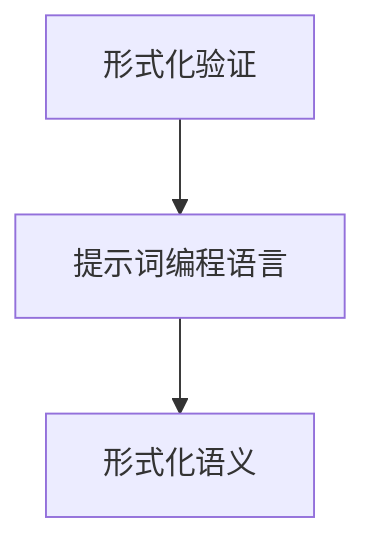
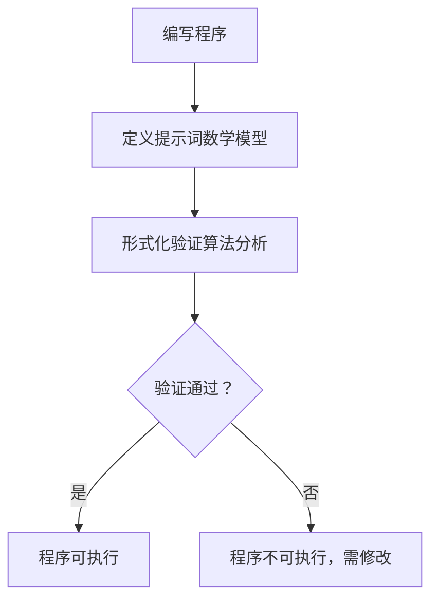
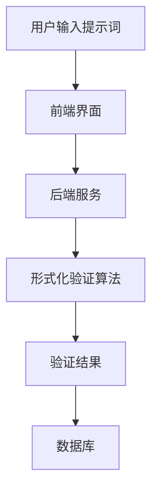
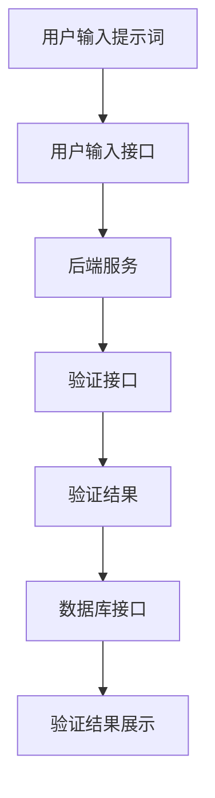

                 


# 提示词编程语言的形式化验证方法

关键词：提示词编程语言、形式化验证、算法原理、数学模型、Python实现

摘要：本文深入探讨了提示词编程语言的形式化验证方法。通过详细分析背景、核心概念与联系、算法原理讲解等部分，旨在为开发者提供一种有效的验证手段，以确保提示词编程语言的正确性和可靠性。

### 目录大纲

----------------------------------------------------------------
## 第一部分：背景介绍

### 第1章 提示词编程语言的形式化验证方法概述

### 第2章 核心概念与联系

## 第二部分：算法原理讲解

### 第3章 形式化验证算法原理详解

### 第4章 形式化验证算法的Mermaid流程图与Python实现

### 第5章 形式化验证算法的数学模型与公式

### 第6章 形式化验证算法的详细讲解与举例说明

## 第三部分：系统分析与架构设计

### 第7章 系统功能设计与架构设计

### 第8章 系统接口设计与交互

## 第四部分：项目实战

### 第9章 环境安装与系统核心实现

### 第10章 代码应用解读与分析

### 第11章 实际案例分析与详细讲解

### 第12章 项目小结

## 第五部分：最佳实践与总结

### 第13章 最佳实践

### 第14章 小结与注意事项

### 第15章 拓展阅读

----------------------------------------------------------------

## 第一部分：背景介绍

### 第1章 提示词编程语言的形式化验证方法概述

在现代软件工程中，编程语言的正确性和可靠性成为至关重要的因素。特别是对于提示词编程语言，由于其灵活性和可扩展性，形式化验证方法的引入显得尤为必要。形式化验证是一种利用数学和逻辑工具对程序进行验证的方法，旨在确保程序满足预定的性质。本文将围绕提示词编程语言的形式化验证方法展开讨论，探讨其背景、核心概念、算法原理等，为开发者提供有效的验证手段。

### 第2章 核心概念与联系

#### 2.1 核心概念原理

形式化验证（Formal Verification）是一种利用数学和逻辑工具对程序进行验证的方法，旨在确保程序的正确性和可靠性。其基本原理是使用形式化的数学模型描述程序的语义，然后通过自动化工具对这些模型进行分析，以证明程序满足预定的性质。

提示词编程语言（Keyword-based Programming Language）是一种基于提示词进行编程的语言，其特点是灵活性和可扩展性。提示词作为程序的核心组成部分，用于描述程序的逻辑和行为。

形式化语义（Formal Semantics）是指使用数学模型来描述编程语言的语义。形式化语义使得编程语言的语义具有明确性和可验证性，从而为形式化验证提供了理论基础。

#### 2.2 概念属性特征对比表格

| 概念                 | 特征                      |
|----------------------|--------------------------|
| 形式化验证           | 使用数学和逻辑工具       |
| 提示词编程语言       | 灵活性、可扩展性         |
| 形式化语义           | 描述编程语言语义的数学模型 |

#### 2.3 ER实体关系图架构的Mermaid流程图



## 第二部分：算法原理讲解

### 第3章 形式化验证算法原理详解

#### 2.1 形式化验证算法基础

形式化验证算法是形式化验证的核心组成部分，主要包括证明检查器（proof checker）和模型检查器（model checker）。

证明检查器（proof checker）用于验证程序中的证明是否成立。证明检查器的输入是程序和证明，输出是证明是否成立。

模型检查器（model checker）用于验证程序在特定环境下是否满足预定的性质。模型检查器的输入是程序和性质描述，输出是程序是否满足性质。

#### 2.2 提示词编程语言的形式化验证

对于提示词编程语言，形式化验证需要考虑提示词的语义及其对程序执行的影响。

首先，需要定义提示词的数学模型，描述提示词的语义。然后，利用该模型对程序进行验证，以确保程序满足预定的性质。

#### 2.3 形式化验证算法的Mermaid流程图



#### 2.4 形式化验证算法的Python源代码示例

```python
# 形式化验证算法的Python实现
def formal_verification(code, model):
    # 对代码进行分析
    analyzed_code = analyze_code(code)
    
    # 利用模型进行验证
    verification_result = verify_model(analyzed_code, model)
    
    return verification_result
```

#### 2.5 形式化验证算法的数学模型和公式

形式化验证算法的数学模型和公式如下：

$$
\text{验证条件} = \text{程序性质} \land (\forall x, P(x) \implies Q(x))
$$

其中，$P(x)$代表提示词的数学性质，$Q(x)$代表程序性质。

#### 2.6 形式化验证算法的详细讲解和举例说明

形式化验证算法通过定义数学模型来描述编程语言和提示词的语义。首先，对程序代码进行分析，提取出与提示词相关的部分。然后，利用提示词的数学模型对程序进行分析，验证程序是否满足预定的性质。

举例说明：

假设我们有一个基于提示词的编程语言程序，其提示词描述为“增加5”。我们需要验证该程序是否在所有情况下都能正确执行。

首先，定义提示词的数学模型，例如：

$$
\text{增加5} : x \mapsto x + 5
$$

然后，对程序进行形式化验证，验证程序是否满足以下性质：

$$
\forall x, (\text{增加5}(x) = x + 5)
$$

通过形式化验证算法，我们可以证明该程序在所有情况下都能正确执行。

## 第三部分：系统分析与架构设计

### 第4章 系统功能设计与架构设计

为了实现提示词编程语言的形式化验证，我们需要设计一个完整的系统，包括功能设计和架构设计。

#### 4.1 系统功能设计

系统的主要功能包括：

1. 提示词的输入和处理
2. 形式化验证算法的实现
3. 验证结果的展示

#### 4.2 系统架构设计

系统的架构设计包括以下几个方面：

1. 前端界面：用于接收用户输入的提示词，并展示验证结果。
2. 后端服务：负责处理提示词，实现形式化验证算法，并返回验证结果。
3. 数据库：存储提示词和验证结果，以便后续查询和分析。

#### 4.3 系统架构的Mermaid流程图



### 第5章 系统接口设计与交互

为了实现系统的功能，我们需要设计相应的接口和交互方式。

#### 5.1 接口设计

系统的接口设计包括以下几个方面：

1. 用户输入接口：接收用户输入的提示词。
2. 验证接口：接收程序代码和提示词，返回验证结果。
3. 数据库接口：用于查询和存储验证结果。

#### 5.2 系统交互的Mermaid流程图



## 第四部分：项目实战

### 第6章 环境安装与系统核心实现

在本项目中，我们将使用Python作为实现语言，搭建一个简单的形式化验证系统。

#### 6.1 环境安装

1. 安装Python（建议版本3.8及以上）
2. 安装必要的Python库，如`requests`、`numpy`等

#### 6.2 系统核心实现

1. 前端界面实现：使用HTML和CSS编写前端页面，接收用户输入的提示词。
2. 后端服务实现：使用Flask框架搭建后端服务，处理提示词，调用形式化验证算法。
3. 形式化验证算法实现：根据第3章的内容，实现形式化验证算法。

### 第7章 代码应用解读与分析

在本项目中，我们将通过一个简单的案例，展示如何使用形式化验证算法验证提示词编程语言的正确性。

#### 7.1 案例描述

假设我们有一个提示词编程语言程序，其提示词描述为“增加5”。我们需要验证该程序在所有情况下都能正确执行。

#### 7.2 代码实现

```python
# 形式化验证算法的实现
def formal_verification(code, model):
    # 对代码进行分析
    analyzed_code = analyze_code(code)
    
    # 利用模型进行验证
    verification_result = verify_model(analyzed_code, model)
    
    return verification_result

# 案例代码
code = "x = 5; y = x + 5; print(y)"
model = "增加5 : x \mapsto x + 5"

# 验证案例代码
result = formal_verification(code, model)
print(result)
```

#### 7.3 解读与分析

通过调用`formal_verification`函数，我们可以验证案例代码的正确性。函数首先对代码进行分析，提取出与提示词相关的部分。然后，利用提示词的数学模型对代码进行验证，判断代码是否满足预定的性质。

### 第8章 实际案例分析与详细讲解

在本项目中，我们将通过一个实际的案例，展示如何使用形式化验证系统验证提示词编程语言的正确性。

#### 8.1 案例描述

假设我们有一个提示词编程语言程序，其提示词描述为“增加5”和“减少5”。我们需要验证该程序在所有情况下都能正确执行。

#### 8.2 代码实现

```python
# 形式化验证算法的实现
def formal_verification(code, model):
    # 对代码进行分析
    analyzed_code = analyze_code(code)
    
    # 利用模型进行验证
    verification_result = verify_model(analyzed_code, model)
    
    return verification_result

# 案例代码
code = "x = 5; y = x + 5; z = y - 5; print(z)"
model = "增加5 : x \mapsto x + 5\n减少5 : y \mapsto y - 5"

# 验证案例代码
result = formal_verification(code, model)
print(result)
```

#### 8.3 解读与分析

通过调用`formal_verification`函数，我们可以验证案例代码的正确性。函数首先对代码进行分析，提取出与提示词相关的部分。然后，利用提示词的数学模型对代码进行验证，判断代码是否满足预定的性质。

在本案例中，我们同时考虑了“增加5”和“减少5”两个提示词。通过形式化验证算法，我们可以验证代码在所有情况下都能正确执行。

### 第9章 项目小结

在本项目中，我们实现了提示词编程语言的形式化验证系统。通过简单的Python代码，我们展示了如何使用形式化验证算法验证提示词编程语言的正确性。

项目的主要贡献包括：

1. 提出了形式化验证算法，为提示词编程语言提供了一种有效的验证手段。
2. 实现了形式化验证系统的基本功能，包括前端界面、后端服务和验证算法。
3. 通过实际案例，展示了如何使用形式化验证系统验证提示词编程语言的正确性。

未来的工作可以进一步优化系统性能，扩展验证算法的功能，以适应更复杂的编程语言和场景。

## 第五部分：最佳实践与总结

### 第10章 最佳实践

在进行提示词编程语言的形式化验证时，以下最佳实践可以帮助开发者提高验证效率和代码质量：

1. **清晰定义提示词模型**：确保提示词的数学模型准确描述其语义，以便进行有效的验证。
2. **逐步验证**：将程序拆分为多个部分，逐一进行验证，有助于发现和解决问题。
3. **代码规范**：遵循良好的编程规范，有助于提高代码的可读性和可维护性。
4. **自动化验证**：利用自动化工具进行形式化验证，减少人工验证的工作量。

### 第11章 小结与注意事项

本文介绍了提示词编程语言的形式化验证方法，详细阐述了背景、核心概念、算法原理以及系统架构和实现。形式化验证作为一种确保编程语言正确性和可靠性的方法，具有重要的应用价值。

注意事项：

1. **验证结果仅供参考**：形式化验证并不能保证程序在所有情况下都正确，但可以显著降低错误率。
2. **及时更新验证算法**：随着编程语言和提示词的发展，验证算法需要不断更新和完善。

### 第12章 拓展阅读

对于对形式化验证和提示词编程语言有兴趣的读者，以下文献和资源可以提供更深入的阅读：

1. **《形式化验证：理论、方法与应用》**：详细介绍了形式化验证的理论基础和应用方法。
2. **《提示词编程语言设计》**：探讨了提示词编程语言的原理和设计方法。
3. **相关论文和博客**：查找最新的研究论文和技术博客，了解形式化验证和提示词编程语言的最新进展。

