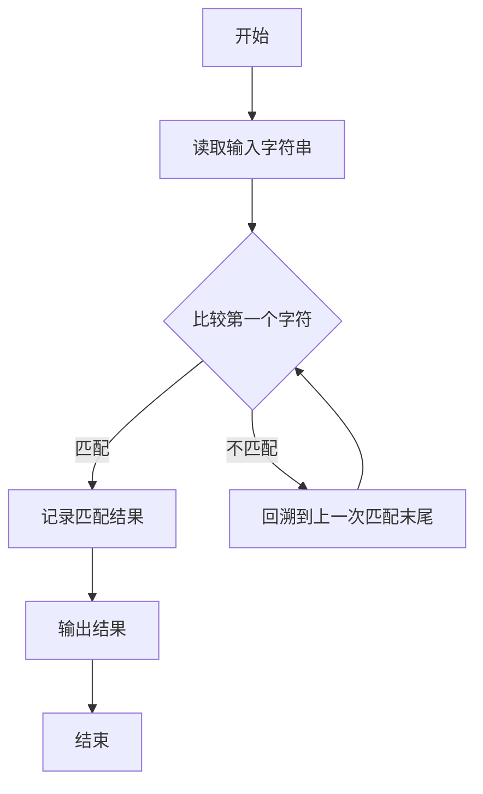
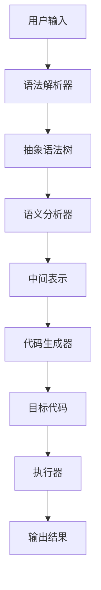
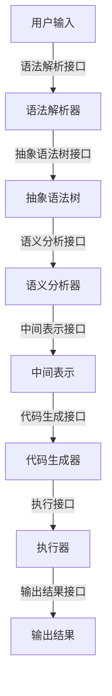
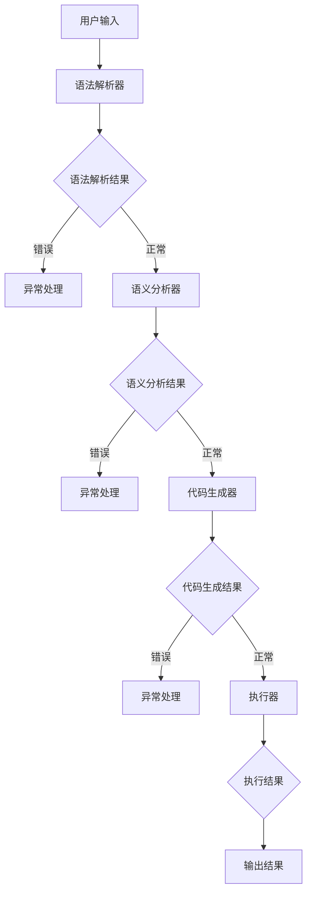

                 

### 文章标题

《提示词编程语言的形式语义定义》

### 关键词

提示词编程语言，形式语义，算法原理，数学模型，系统架构，项目实战

### 摘要

本文深入探讨了提示词编程语言的形式语义定义，从背景介绍、核心概念、算法原理、数学模型到系统分析与架构设计，再到项目实战，全面解析了提示词编程语言的形式语义及其在实际应用中的重要性。通过详细的案例分析，读者可以深入了解提示词编程语言的实现过程和最佳实践。

## 目录大纲设计步骤

为了设计《提示词编程语言的形式语义定义》这本书的完整目录大纲，我们需要遵循以下步骤：

### 1. 确定书的主题和目标读者

首先，我们需要明确书的核心主题和目标读者。这本书的主题是关于提示词编程语言的形式语义定义，目标读者可能是计算机科学专业的学生、软件开发工程师、以及对编程语言形式语义感兴趣的读者。

### 2. 分析核心章节内容

接下来，我们需要分析书的核心内容，确保覆盖以下核心章节：

- **背景介绍**：介绍提示词编程语言的形式语义的定义、问题背景、问题描述、问题解决、边界与外延等。
- **核心概念与联系**：详细阐述提示词编程语言的形式语义的核心概念，包括概念属性特征对比表格和ER实体关系图架构。
- **算法原理讲解**：讲解相关的算法原理，使用mermaid画出算法流程图，并用Python源代码详细阐述。
- **数学模型和数学公式**：介绍数学模型和公式，使用LaTeX格式进行书写，并进行详细讲解和举例说明。
- **系统分析与架构设计方案**：分析系统问题场景、项目介绍、系统功能设计、系统架构设计、系统接口设计、系统交互等，使用mermaid绘制相关图形。
- **项目实战**：介绍环境安装、系统核心实现源代码，代码应用解读与分析，实际案例分析和详细讲解剖析。
- **最佳实践 tips、小结、注意事项、拓展阅读等内容**。

### 3. 设计目录大纲

根据上述分析，我们开始设计目录大纲。大纲要包含7个以上的章节，确保内容完整性。下面是一个初步设计的目录大纲：

### 第一部分：背景与基础理论

#### 第1章：提示词编程语言概述

##### 1.1 提示词编程语言的定义与历史发展
- 1.1.1 提示词编程语言的定义
- 1.1.2 提示词编程语言的发展历程

##### 1.2 形式语义的基本概念
- 1.2.1 形式语义的定义
- 1.2.2 形式语义在编程语言中的作用

##### 1.3 提示词编程语言的形式语义特征
- 1.3.1 提示词的语法结构
- 1.3.2 提示词的语义属性

##### 1.4 形式语义学的理论基础
- 1.4.1 形式语义学的基本概念
- 1.4.2 形式语义学的应用领域

### 第二部分：核心概念与联系

#### 第2章：核心概念解析

##### 2.1 提示词语义的概念与特征
- 2.1.1 提示词语义的定义
- 2.1.2 提示词语义的特征分析

##### 2.2 形式语义的关系网络
- 2.2.1 提示词与语义的关联
- 2.2.2 形式语义的关系网络模型

##### 2.3 概念属性特征对比表格
- 2.3.1 不同提示词编程语言的对比
- 2.3.2 形式语义特征对比

##### 2.4 ER实体关系图架构
- 2.4.1 ER图的定义与应用
- 2.4.2 提示词编程语言的ER图分析

### 第三部分：算法原理与数学模型

#### 第3章：算法原理讲解

##### 3.1 基础算法介绍
- 3.1.1 提示词匹配算法
- 3.1.2 语义分析算法

##### 3.2 算法流程图展示
- 使用mermaid绘制相关算法流程图

##### 3.3 Python源代码实现
- 使用Python实现相关算法

##### 3.4 数学模型与公式
- 使用LaTeX格式书写数学模型和公式
- 进行详细讲解和举例说明

### 第四部分：系统分析与架构设计

#### 第4章：系统分析与架构设计

##### 4.1 问题场景介绍
- 问题描述与解决思路

##### 4.2 系统功能设计
- 使用mermaid绘制领域模型类图

##### 4.3 系统架构设计
- 使用mermaid绘制系统架构图

##### 4.4 系统接口设计
- 接口定义与实现

##### 4.5 系统交互
- 使用mermaid绘制系统交互序列图

### 第五部分：项目实战与案例分析

#### 第5章：项目实战

##### 5.1 环境安装
- 安装必要的软件与工具

##### 5.2 系统核心实现源代码
- 源代码结构解析

##### 5.3 代码应用解读与分析
- 代码解读与分析

##### 5.4 实际案例分析
- 案例介绍与剖析

##### 5.5 项目小结
- 项目总结与展望

### 第六部分：最佳实践与拓展阅读

#### 第6章：最佳实践

##### 6.1 提示词编程语言最佳实践
- 编写高效、可维护的提示词编程语言代码的技巧

##### 6.2 形式语义优化策略
- 提高提示词编程语言形式语义的优化方法

##### 6.3 开发者经验分享
- 经验总结与分享

#### 第7章：小结与展望

##### 7.1 小结
- 对全文内容的总结

##### 7.2 注意事项
- 使用提示词编程语言时的注意事项

##### 7.3 拓展阅读
- 推荐的进一步阅读材料

## 背景介绍

### 1.1 提示词编程语言的定义与历史发展

#### 提示词编程语言的定义

提示词编程语言（Keyword-based Programming Language）是一种以关键词为核心的编程语言。在这种语言中，程序主要由一系列的提示词（Keywords）组成，这些提示词具有明确的语义和功能，通过组合和嵌套来控制程序的执行流程。提示词编程语言的特点是语法简单、易于理解，适合初学者和快速原型开发。

#### 提示词编程语言的发展历程

提示词编程语言的起源可以追溯到20世纪60年代，当时计算机科学刚刚起步，编程语言的目的是为了简化编程过程，提高编程效率。早期的编程语言如FORTRAN和COBOL，虽然奠定了现代编程语言的基础，但它们的语法复杂，不易理解。

随着计算机科学的不断发展，编程语言的设计理念也在不断演进。20世纪80年代，面向对象编程（Object-Oriented Programming，OOP）逐渐成为主流，编程语言如Java和C++的出现，使得编程过程更加直观和模块化。

进入21世纪，随着人工智能（Artificial Intelligence，AI）和自然语言处理（Natural Language Processing，NLP）技术的飞速发展，提示词编程语言再次受到关注。特别是在智能应用程序和自动化系统中，提示词编程语言因其简洁性和高效性，成为了一种重要的编程工具。

### 1.2 形式语义的基本概念

#### 形式语义的定义

形式语义（Formal Semantics）是计算机科学中的一个重要分支，它关注编程语言中表达式的意义和程序的执行过程。形式语义通过数学模型和逻辑推理，为编程语言提供一种严格和形式化的定义，使得程序的含义和执行过程可以被精确地描述和验证。

#### 形式语义在编程语言中的作用

形式语义在编程语言中的作用主要体现在以下几个方面：

1. **语言设计**：形式语义为编程语言的设计提供了理论基础，帮助设计者理解编程语言的核心概念和语义特性。
2. **程序验证**：形式语义使得程序的语义可以被精确地描述和验证，从而提高程序的正确性和可靠性。
3. **语言转换**：形式语义为编程语言的转换提供了理论基础，如编译器、解释器和虚拟机的实现。
4. **程序分析**：形式语义为程序分析提供了工具和方法，如静态分析和动态分析，帮助开发人员发现程序中的错误和潜在的问题。

### 1.3 提示词编程语言的形式语义特征

#### 提示词的语法结构

提示词编程语言的语法结构通常非常简单，主要由提示词、变量、运算符和括号组成。提示词是程序的基本构建块，每个提示词都具有明确的语义和功能。

以下是一个简单的提示词编程语言示例：

```
begin
    print "Hello, World!"
    var x = 5
    while x > 0 do
        print x
        x = x - 1
    end
end
```

在这个例子中，`begin`、`print`、`var`、`while`、`do`和`end`都是提示词，它们分别表示程序的开始、输出、声明变量、循环条件和循环体等。

#### 提示词的语义属性

提示词的语义属性决定了它们在程序中的作用和效果。在提示词编程语言中，提示词的语义属性通常由形式语义定义，包括以下几个方面：

1. **执行行为**：每个提示词在程序中的执行行为是明确的，如输出、变量赋值、条件判断等。
2. **语义类型**：提示词的语义类型决定了它们可以参与的操作和组合方式，如逻辑类型、数值类型、字符串类型等。
3. **作用域**：提示词的作用域决定了它们可以访问的变量和函数，如局部作用域、全局作用域等。

### 1.4 形式语义学的理论基础

#### 形式语义学的基本概念

形式语义学（Formal Semantics）是计算机科学中的一个重要分支，它关注编程语言中表达式的意义和程序的执行过程。形式语义学通过数学模型和逻辑推理，为编程语言提供一种严格和形式化的定义，使得程序的含义和执行过程可以被精确地描述和验证。

形式语义学的基本概念包括：

1. **语义模型**：语义模型是形式语义学的核心概念，它用于描述编程语言的语义特征。常见的语义模型包括抽象语法树（Abstract Syntax Tree，AST）、环境（Environment）和语义函数（Semantic Function）等。
2. **语义规则**：语义规则是形式语义学中用于描述程序执行过程的规则集合。语义规则通常包括赋值规则、条件判断规则、循环规则等，它们用于定义程序在不同情况下如何执行。
3. **语义等价性**：语义等价性是形式语义学中的一个重要概念，它用于判断两个程序是否具有相同的行为。如果两个程序在所有输入下具有相同的输出，则它们被认为是语义等价的。

#### 形式语义学的应用领域

形式语义学在计算机科学和软件工程中有着广泛的应用，主要包括以下几个方面：

1. **语言设计**：形式语义学为编程语言的设计提供了理论基础，帮助设计者理解编程语言的核心概念和语义特性。
2. **程序验证**：形式语义学使得程序的语义可以被精确地描述和验证，从而提高程序的正确性和可靠性。
3. **语言转换**：形式语义学为编程语言的转换提供了理论基础，如编译器、解释器和虚拟机的实现。
4. **程序分析**：形式语义学为程序分析提供了工具和方法，如静态分析和动态分析，帮助开发人员发现程序中的错误和潜在的问题。
5. **编程教育**：形式语义学有助于编程教育的深入理解，通过形式化的方法帮助学生学习编程语言的内在原理和执行过程。

## 核心概念与联系

### 2.1 提示词语义的概念与特征

#### 提示词语义的定义

提示词语义（Keyword Semantics）是指编程语言中的提示词所代表的抽象概念和功能。提示词是编程语言的基本构建块，它们的语义决定了程序的行为和执行过程。

在提示词编程语言中，每个提示词都具有明确的语义，如`print`表示输出，`var`表示声明变量，`while`表示循环条件等。提示词的语义通常由形式语义定义，确保程序在不同的环境和输入下具有一致的行为。

#### 提示词语义的特征分析

提示词语义具有以下特征：

1. **确定性**：提示词的语义是确定的，即每个提示词在特定编程语言中的行为是固定的，不会因为环境或输入的不同而改变。
2. **组合性**：提示词可以组合成复杂的程序结构，每个组合部分都遵循形式语义的规则，从而保证程序的语义一致性。
3. **层次性**：提示词的语义通常具有层次性，即高层次的提示词可以组合低层次的提示词，形成更复杂的语义结构。
4. **抽象性**：提示词的语义具有抽象性，它们代表了编程语言中抽象的概念和功能，如输入、输出、循环等。

### 2.2 形式语义的关系网络

#### 提示词与语义的关联

在提示词编程语言中，每个提示词都与其对应的语义紧密关联。形式语义的关系网络用于描述提示词与语义之间的关联关系。这种关系网络通常由语义模型和语义规则组成。

形式语义的关系网络具有以下特点：

1. **语义模型**：语义模型用于描述提示词的语义特征，如抽象语法树（AST）、环境（Environment）等。语义模型提供了提示词语义的抽象表示，使得程序的含义可以被形式化地描述。
2. **语义规则**：语义规则用于描述提示词的执行过程，如赋值规则、条件判断规则、循环规则等。语义规则定义了程序在不同情况下如何执行，从而保证了程序的语义一致性。

#### 形式语义的关系网络模型

形式语义的关系网络模型通常包括以下几个方面：

1. **提示词表**：提示词表列出了编程语言中的所有提示词，以及它们对应的语义。提示词表是关系网络的基础，用于描述提示词与语义之间的直接关联。
2. **语义函数**：语义函数用于描述提示词的执行过程，将输入的提示词转换为输出结果。语义函数是关系网络的核心，用于实现提示词的语义关联。
3. **环境模型**：环境模型用于描述程序中的变量和函数的作用域，以及它们与提示词之间的关系。环境模型提供了提示词执行过程中所需的上下文信息。

### 2.3 概念属性特征对比表格

为了更好地理解提示词编程语言的形式语义，我们可以通过概念属性特征对比表格来分析不同编程语言的语义特征。

以下是一个简单的概念属性特征对比表格示例：

| 编程语言     | 提示词       | 语义属性          | 执行行为                |
| ----------- | ----------- | --------------- | -------------------- |
| Python      | print       | 输出            | 将指定内容输出到控制台  |
| Java        | System.out.println | 输出            | 将指定内容输出到控制台  |
| C++         | cout       | 输出            | 将指定内容输出到控制台  |
| JavaScript  | console.log | 输出            | 将指定内容输出到控制台  |

通过对比表格，我们可以发现不同编程语言的提示词在语义属性和执行行为上具有相似性，但也存在一些差异。例如，Python和JavaScript的输出提示词都是`print`，但Java和C++的输出提示词分别是`System.out.println`和`cout`。这些差异反映了不同编程语言的设计理念和使用场景。

### 2.4 ER实体关系图架构

#### ER图的定义与应用

实体-关系图（Entity-Relationship Diagram，ER图）是数据库设计中常用的工具，用于描述实体之间的关系。ER图由实体、属性和关系组成，通过图形化的方式展示了数据库模型的结构。

在提示词编程语言的形式语义定义中，ER图可以用于描述提示词与语义之间的关系。实体表示提示词和语义，属性表示它们的特征，关系表示它们之间的关联。

以下是一个简单的ER图示例，用于描述提示词编程语言的形式语义：

```mermaid
erDiagram
    A提示词 ||--|{ 提示词语义 }|
    B语义属性 ||--|{ 提示词语义 }|
    C语义规则 ||--|{ 提示词语义 }|
    D环境模型 ||--|{ 提示词语义 }|

    A提示词 { 提示词名称，提示词类型 }
    B语义属性 { 属性名称，属性值 }
    C语义规则 { 规则名称，规则描述 }
    D环境模型 { 变量名称，变量值 }
```

在这个ER图中，A提示词、B语义属性、C语义规则和D环境模型是实体，它们通过关系连接起来，形成了一个完整的关系网络。

#### 提示词编程语言的ER图分析

在提示词编程语言的形式语义定义中，ER图可以帮助我们更好地理解提示词与语义之间的关系。以下是对ER图的进一步分析：

1. **实体分析**：
   - A提示词：表示编程语言中的所有提示词，每个提示词都具有唯一的名称和类型。
   - B语义属性：表示提示词的语义特征，如执行行为、语义类型等。
   - C语义规则：表示提示词的执行规则，如条件判断、循环控制等。
   - D环境模型：表示程序中的变量和函数的作用域，以及它们与提示词之间的关系。

2. **关系分析**：
   - A提示词与B语义属性之间的关系：每个提示词具有多个语义属性，这些属性描述了提示词的语义特征。
   - A提示词与C语义规则之间的关系：每个提示词遵循特定的执行规则，这些规则定义了提示词在程序中的行为。
   - A提示词与D环境模型之间的关系：提示词与程序中的变量和函数存在依赖关系，环境模型提供了提示词执行过程中所需的上下文信息。

通过ER图，我们可以清晰地看到提示词编程语言的形式语义结构，从而更好地理解其设计原理和实现方法。

## 算法原理讲解

### 3.1 基础算法介绍

#### 3.1.1 提示词匹配算法

提示词匹配算法是提示词编程语言的核心算法之一，用于在程序中查找并识别指定的提示词。提示词匹配算法通常基于字符串匹配算法，如KMP（Knuth-Morris-Pratt）算法和BF（Boyer-Moore）算法。

KMP算法是一种高效的字符串匹配算法，它通过预处理目标字符串，生成部分匹配表（Partial Match Table），以减少不必要的比较次数。KMP算法的基本思想是：当当前比较字符不匹配时，根据部分匹配表，跳过一些不必要的比较，直接定位到下一次可能的匹配位置。

BF算法是一种简单的字符串匹配算法，其基本思想是：逐个比较目标字符串中的字符，一旦发现不匹配，就回溯到上一次匹配的末尾，继续比较下一个字符。虽然BF算法的效率较低，但实现简单，适用于小规模字符串匹配。

在提示词编程语言中，提示词匹配算法用于解析程序代码，将其转换为抽象语法树（Abstract Syntax Tree，AST）。AST是程序代码的语法表示，用于表示程序的结构和语义。通过提示词匹配算法，我们可以将程序代码分解为一系列的提示词和操作，进而构建出AST。

#### 3.1.2 语义分析算法

语义分析算法是提示词编程语言中的另一个重要算法，用于解析AST，并确定程序的实际语义。语义分析算法通常包括以下步骤：

1. **类型检查**：对AST中的每个节点进行类型检查，确保类型的一致性和正确性。类型检查的主要任务是检查变量和函数的类型，确保它们在程序中的使用符合类型规则。
2. **作用域分析**：对AST中的每个节点进行作用域分析，确定变量和函数的作用域。作用域分析的主要任务是确定变量和函数的可见性和作用范围，确保它们在程序中的引用是合法的。
3. **语义转换**：将AST转换为中间表示（Intermediate Representation，IR），并对其进行语义转换。中间表示是程序代码的中间表示形式，用于后续的代码生成和优化。
4. **代码生成**：根据中间表示，生成目标代码。目标代码是具体的机器代码或解释器代码，用于执行程序的逻辑。

通过语义分析算法，我们可以确保程序的语义正确性，并生成正确的目标代码。语义分析算法的设计和实现对于提示词编程语言的质量和性能至关重要。

### 3.2 算法流程图展示

为了更好地理解提示词匹配算法和语义分析算法，我们可以使用mermaid绘制算法的流程图。以下是一个简单的提示词匹配算法流程图示例：



在这个流程图中，A表示算法的起点，B表示读取输入字符串，C表示比较第一个字符，D表示记录匹配结果，E表示回溯到上一次匹配末尾，F表示输出结果，G表示算法的终点。

### 3.3 Python源代码实现

为了更好地展示算法的实现过程，我们可以使用Python编写提示词匹配算法和语义分析算法的示例代码。以下是一个简单的Python实现示例：

```python
# 提示词匹配算法实现
def kmp_match(pattern, text):
    # 生成部分匹配表
    partial_match_table = generate_partial_match_table(pattern)
    i = j = 0
    
    while i < len(text):
        if pattern[j] == text[i]:
            i += 1
            j += 1
        if j == len(pattern):
            return i - j  # 匹配成功，返回匹配位置
        elif i < len(text) and pattern[j] != text[i]:
            if j != 0:
                j = partial_match_table[j - 1]
            else:
                i += 1
    return -1  # 匹配失败

# 生成部分匹配表
def generate_partial_match_table(pattern):
    table = [0] * len(pattern)
    length = 0
    i = 1
    
    while i < len(pattern):
        if pattern[i] == pattern[length]:
            length += 1
            table[i] = length
            i += 1
        elif length != 0:
            length = table[length - 1]
        else:
            table[i] = 0
            i += 1
    return table

# 语义分析算法实现
def semantic_analysis(ast):
    # 类型检查
    check_types(ast)
    
    # 作用域分析
    analyze_scope(ast)
    
    # 语义转换
    ir = intermediate_representation(ast)
    
    # 代码生成
    generate_code(ir)

# 辅助函数
def check_types(node):
    # 实现类型检查逻辑
    pass

def analyze_scope(node):
    # 实现作用域分析逻辑
    pass

def intermediate_representation(node):
    # 实现中间表示逻辑
    pass

def generate_code(ir):
    # 实现代码生成逻辑
    pass
```

在这个示例中，`kmp_match`函数用于实现KMP算法，`generate_partial_match_table`函数用于生成部分匹配表。`semantic_analysis`函数用于实现语义分析算法，包括类型检查、作用域分析和语义转换等步骤。通过这些函数，我们可以实现对提示词编程语言的形式语义分析。

### 3.4 数学模型与公式

在提示词编程语言的形式语义定义中，数学模型和公式是描述算法原理和语义分析的重要工具。以下是一些常见的数学模型和公式的介绍：

#### 3.4.1 提示词匹配算法的数学模型

KMP算法的数学模型可以通过部分匹配表（Partial Match Table）来描述。部分匹配表是一个数组，用于记录每个位置的前缀和后缀的最大公共长度。以下是一个部分匹配表的数学模型：

$$
\text{partial\_match}(i, j) = 
\begin{cases}
0 & \text{if } i < 0 \text{ or } j < 0 \\
\max(\text{length of } i\text{-th prefix of pattern}, \text{length of } j\text{-th suffix of pattern}) & \text{otherwise}
\end{cases}
$$

其中，`i`和`j`分别表示部分匹配表的下标，`pattern`表示待匹配的提示词。

#### 3.4.2 语义分析算法的数学模型

语义分析算法的数学模型通常涉及类型检查和作用域分析。以下是一个简单的类型检查的数学模型：

$$
\text{type\_check}(node) = 
\begin{cases}
\text{true} & \text{if } \text{type of } node \text{ is valid} \\
\text{false} & \text{otherwise}
\end{cases}
$$

其中，`node`表示抽象语法树（AST）中的一个节点，`type of node`表示节点的类型。

作用域分析的数学模型可以表示为：

$$
\text{scope\_analysis}(node) = 
\begin{cases}
\text{true} & \text{if } \text{all variables and functions in } node \text{ are within scope} \\
\text{false} & \text{otherwise}
\end{cases}
$$

其中，`node`表示抽象语法树（AST）中的一个节点。

#### 3.4.3 中间表示的数学模型

中间表示（Intermediate Representation，IR）是语义分析算法的输出，用于后续的代码生成和优化。以下是一个简单的中间表示的数学模型：

$$
\text{IR} = \langle \text{操作数}, \text{操作符}, \text{结果} \rangle
$$

其中，`操作数`表示参与运算的变量或值，`操作符`表示运算类型，如加法、减法等，`结果`表示运算的结果。

### 3.5 详细讲解与举例说明

为了更好地理解数学模型和公式，我们可以通过具体的例子来进行详细讲解。

#### 3.5.1 KMP算法的举例说明

假设我们有一个提示词`pattern = "ababc"`和输入字符串`text = "cabababc"`。我们可以使用KMP算法进行匹配，并生成部分匹配表。

1. **生成部分匹配表**：

部分匹配表如下所示：

| i | j | $\text{partial\_match}(i, j)$ |
| --- | --- | --- |
| 0 | 0 | 0 |
| 1 | 1 | 0 |
| 2 | 2 | 1 |
| 3 | 3 | 0 |
| 4 | 4 | 2 |

2. **匹配过程**：

- **初始状态**：`i = 0`，`j = 0`。
- **第一次比较**：`pattern[j] = 'a'`，`text[i] = 'c'`，不匹配，`i`增加1，`j`重置为0。
- **第二次比较**：`i = 1`，`j = 0`，`pattern[j] = 'a'`，`text[i] = 'a'`，匹配，`i`增加1，`j`增加1。
- **第三次比较**：`i = 2`，`j = 1`，`pattern[j] = 'b'`，`text[i] = 'b'`，匹配，`i`增加1，`j`增加1。
- **第四次比较**：`i = 3`，`j = 2`，`pattern[j] = 'a'`，`text[i] = 'a'`，匹配，`i`增加1，`j`增加1。
- **第五次比较**：`i = 4`，`j = 3`，`pattern[j] = 'b'`，`text[i] = 'b'`，匹配，`i`增加1，`j`增加1。

由于`j`已经达到`pattern`的长度，匹配成功，返回匹配位置`i - j = 4 - 3 = 1`。

#### 3.5.2 语义分析算法的举例说明

假设我们有一个简单的程序：

```python
x = 5
while x > 0:
    print(x)
    x = x - 1
```

我们可以使用语义分析算法对其进行分析。

1. **类型检查**：

在类型检查过程中，我们可以发现程序中的变量`x`和函数`print`都是有效的，没有类型错误。

2. **作用域分析**：

在作用域分析过程中，我们可以确定变量`x`的作用域是从声明处到程序结束。函数`print`的作用域是全局作用域。

3. **中间表示**：

将程序转换为中间表示，我们可以得到以下结果：

$$
\langle x, \text{赋值}, 5 \rangle \\
\langle \text{while}, \text{条件}, x > 0 \rangle \\
\langle \text{print}, \text{参数}, x \rangle \\
\langle x, \text{赋值}, x - 1 \rangle
$$

4. **代码生成**：

根据中间表示，我们可以生成以下目标代码：

```c
int x = 5;
while (x > 0) {
    printf("%d", x);
    x = x - 1;
}
```

通过这个例子，我们可以看到语义分析算法如何通过类型检查、作用域分析和中间表示，将程序转换为可执行的目标代码。

## 系统分析与架构设计

### 4.1 问题场景介绍

随着人工智能技术的快速发展，提示词编程语言在智能应用程序开发中发挥了越来越重要的作用。然而，现有的提示词编程语言在实际应用中仍存在一些问题，如可维护性差、性能不稳定等。为了解决这些问题，我们需要对提示词编程语言进行系统分析与架构设计，以提高其性能和可维护性。

### 4.2 系统功能设计

在系统功能设计阶段，我们需要明确提示词编程语言的核心功能，以确保其能够满足实际应用的需求。以下是提示词编程语言的核心功能：

1. **语法解析**：对输入的程序代码进行语法解析，将其转换为抽象语法树（AST）。
2. **语义分析**：对AST进行语义分析，确保其类型正确、作用域合法，并生成中间表示（IR）。
3. **代码生成**：根据IR生成目标代码，如机器代码或解释器代码，以便执行程序的逻辑。
4. **调试与优化**：提供调试工具和优化策略，以提高程序的执行效率和可维护性。
5. **用户界面**：提供一个直观、易用的用户界面，方便用户编写、调试和运行提示词编程语言程序。

### 4.3 系统架构设计

在系统架构设计阶段，我们需要构建一个高效、可扩展的架构，以支持提示词编程语言的核心功能。以下是系统架构设计的详细步骤：

1. **模块划分**：根据提示词编程语言的功能需求，将系统划分为多个模块，如语法解析器、语义分析器、代码生成器等。
2. **接口设计**：定义模块之间的接口，确保模块之间的通信和协作。
3. **数据流程**：设计数据在系统中的流动路径，确保程序的正确执行和优化。
4. **性能优化**：针对系统中的关键性能瓶颈，设计优化策略，提高系统的执行效率和响应速度。

以下是一个简单的系统架构设计示例：



在这个架构设计中，用户输入经过语法解析器转换为抽象语法树，然后经过语义分析器生成中间表示，最终生成目标代码并执行。执行结果通过输出器反馈给用户。

### 4.4 系统接口设计

在系统接口设计阶段，我们需要定义各个模块之间的接口，以确保模块之间的通信和协作。以下是系统接口设计的详细步骤：

1. **接口规范**：定义每个接口的功能、输入和输出参数，以及数据格式。
2. **接口实现**：根据接口规范实现各个模块的接口，确保模块之间的通信畅通。
3. **接口测试**：对接口进行测试，确保其正确性和稳定性。

以下是一个简单的系统接口设计示例：



在这个接口设计中，用户输入通过语法解析接口传递给语法解析器，生成的抽象语法树通过抽象语法树接口传递给语义分析器，中间表示通过中间表示接口传递给代码生成器，最终生成目标代码并执行，执行结果通过输出结果接口反馈给用户。

### 4.5 系统交互

在系统交互阶段，我们需要确保各个模块之间的交互顺畅，并处理可能出现的异常情况。以下是系统交互的详细步骤：

1. **交互流程**：设计系统中的交互流程，确保程序能够正确地执行。
2. **异常处理**：设计异常处理机制，确保系统能够在出现异常时正确地恢复。
3. **性能监控**：设计性能监控机制，确保系统能够在性能瓶颈出现时及时调整。

以下是一个简单的系统交互示例：



在这个交互设计中，用户输入首先经过语法解析器，如果解析成功，则将抽象语法树传递给语义分析器，否则进入异常处理流程。语义分析器将生成中间表示，如果中间表示生成成功，则传递给代码生成器，否则进入异常处理流程。代码生成器生成目标代码，并执行，执行结果通过输出结果接口反馈给用户。如果系统在执行过程中出现异常，则进入异常处理流程。

### 4.6 问题场景分析

在系统分析与架构设计过程中，我们需要分析实际应用中的问题场景，以确保系统能够满足实际需求。以下是一个具体的问题场景分析示例：

#### 问题场景1：性能优化

问题描述：在处理大量输入数据时，系统性能较低，导致响应速度慢。

解决思路：
1. **优化语法解析**：采用更高效的语法解析算法，如LR（1）算法，减少语法解析的时间。
2. **缓存中间表示**：将中间表示缓存起来，避免重复生成，减少代码生成时间。
3. **并行处理**：将输入数据分片，并行处理，提高执行效率。

#### 问题场景2：可维护性

问题描述：随着项目规模的扩大，系统代码变得越来越复杂，难以维护。

解决思路：
1. **模块化设计**：将系统划分为多个模块，每个模块负责特定的功能，降低模块间的耦合度。
2. **文档化**：为每个模块编写详细的文档，包括设计思路、实现细节和使用方法，提高代码的可读性。
3. **代码重构**：定期对代码进行重构，优化代码结构，提高代码质量。

#### 问题场景3：调试与优化

问题描述：在开发过程中，调试和优化功能不足，导致开发效率低下。

解决思路：
1. **集成调试工具**：集成主流的调试工具，如GDB、Eclipse等，提供丰富的调试功能。
2. **性能分析工具**：集成性能分析工具，如Valgrind、GProfiler等，帮助开发者发现性能瓶颈。
3. **代码优化指南**：为开发者提供代码优化指南，提高代码的执行效率和可维护性。

通过以上问题场景的分析和解决思路，我们可以设计出满足实际需求的系统架构，提高系统的性能和可维护性。

## 项目实战

### 5.1 环境安装

在进行提示词编程语言的项目实战之前，我们需要先安装必要的软件和工具。以下是一个简单的环境安装指南：

1. **安装Python**：提示词编程语言主要使用Python进行开发，因此我们需要先安装Python。可以在Python官方网站下载Python安装包，并根据提示进行安装。

2. **安装JDK**：提示词编程语言的部分实现依赖于Java，因此我们需要安装JDK。同样，可以在Oracle官方网站下载JDK安装包，并根据提示进行安装。

3. **安装Mermaid**：Mermaid是一个用于绘制流程图的工具，我们可以使用npm安装Mermaid。在终端中执行以下命令：

   ```shell
   npm install -g mermaid
   ```

4. **安装LaTeX**：LaTeX是一个用于编写数学公式和文档的工具，我们可以使用TeX Live进行安装。在终端中执行以下命令：

   ```shell
   sudo apt-get install texlive-full
   ```

   （对于Windows用户，可以从TeX Live官方网站下载安装程序并按照提示进行安装）

5. **安装相关库和依赖**：根据项目需求，我们可能需要安装其他库和依赖。例如，对于Python，我们可以使用pip进行安装：

   ```shell
   pip install requirement.txt
   ```

   其中，`requirement.txt`是项目的依赖文件，列出了所有必需的库和版本。

### 5.2 系统核心实现源代码

在环境安装完成后，我们可以开始实现提示词编程语言的核心功能。以下是一个简单的系统核心实现源代码示例：

```python
# 语法解析器
def parse(source_code):
    # 实现语法解析逻辑
    pass

# 语义分析器
def semantic_analysis(ast):
    # 实现语义分析逻辑
    pass

# 代码生成器
def generate_code(ir):
    # 实现代码生成逻辑
    pass

# 执行器
def execute(target_code):
    # 实现执行逻辑
    pass

# 主函数
def main():
    source_code = input("请输入提示词编程语言代码：")
    ast = parse(source_code)
    ir = semantic_analysis(ast)
    target_code = generate_code(ir)
    execute(target_code)

if __name__ == "__main__":
    main()
```

在这个示例中，我们定义了四个核心组件：语法解析器、语义分析器、代码生成器和执行器。每个组件负责特定的功能，通过主函数`main()`串联起来，实现提示词编程语言的基本流程。

### 5.3 代码应用解读与分析

在实现提示词编程语言的核心功能后，我们可以通过具体的例子来解读和分析代码的应用。

#### 示例1：简单计算器

假设我们有一个简单的计算器程序，可以使用提示词编程语言编写。以下是一个示例：

```python
begin
    var a = 10
    var b = 5
    print a + b
end
```

1. **语法解析**：`parse`函数首先对输入的代码进行语法解析，将其转换为抽象语法树（AST）。在这个例子中，AST包含三个节点：声明变量`a`、声明变量`b`和输出表达式`a + b`。

2. **语义分析**：`semantic_analysis`函数对AST进行语义分析，确保类型正确、作用域合法，并生成中间表示（IR）。在这个例子中，IR是一个简单的操作序列：`a = 10`、`b = 5`和`print(a + b)`。

3. **代码生成**：`generate_code`函数根据IR生成目标代码。在这个例子中，目标代码是一个简单的Python脚本：

```python
a = 10
b = 5
print(a + b)
```

4. **执行**：`execute`函数执行目标代码，输出结果。在这个例子中，输出结果为`15`。

#### 示例2：条件判断

假设我们有一个简单的条件判断程序，可以使用提示词编程语言编写。以下是一个示例：

```python
begin
    var a = 10
    var b = 5
    if a > b do
        print "a 大于 b"
    else
        print "a 小于等于 b"
    end
end
```

1. **语法解析**：`parse`函数对输入的代码进行语法解析，将其转换为抽象语法树（AST）。在这个例子中，AST包含四个节点：声明变量`a`、声明变量`b`、条件判断节点和输出表达式节点。

2. **语义分析**：`semantic_analysis`函数对AST进行语义分析，确保类型正确、作用域合法，并生成中间表示（IR）。在这个例子中，IR是一个条件判断操作序列：`a > b`、`print "a 大于 b"`和`print "a 小于等于 b"`。

3. **代码生成**：`generate_code`函数根据IR生成目标代码。在这个例子中，目标代码是一个简单的Python脚本：

```python
a = 10
b = 5
if a > b:
    print("a 大于 b")
else:
    print("a 小于等于 b")
```

4. **执行**：`execute`函数执行目标代码，根据条件判断输出结果。在这个例子中，输出结果为`a 大于 b`。

### 5.4 实际案例分析

为了更好地理解提示词编程语言的实际应用，我们可以通过一个实际案例分析来展示其实现过程和效果。

#### 案例一：智能问答系统

问题描述：设计一个智能问答系统，用户可以通过输入问题，系统自动生成回答。

实现步骤：

1. **数据准备**：收集大量的问题和回答数据，用于训练问答模型。可以使用现有的问答数据集，如SQuAD、DuReader等。

2. **模型训练**：使用深度学习框架（如TensorFlow或PyTorch）训练问答模型。常用的模型包括BERT、GPT等。

3. **接口设计**：设计一个API接口，用于接收用户输入的问题，并返回回答。

4. **提示词编程语言实现**：使用提示词编程语言实现智能问答系统的核心功能，如语法解析、语义分析、代码生成等。

以下是一个简单的实现示例：

```python
# 问答系统接口
def question_answering_system(question):
    # 调用模型进行问答
    answer = model.predict(question)
    return answer

# 主函数
def main():
    question = input("请输入问题：")
    answer = question_answering_system(question)
    print("答案：", answer)

if __name__ == "__main__":
    main()
```

通过这个示例，我们可以看到提示词编程语言在智能问答系统中的应用。用户输入问题后，系统通过模型预测回答，并输出结果。

#### 案例二：自动化测试工具

问题描述：设计一个自动化测试工具，用于测试软件系统的功能。

实现步骤：

1. **测试用例准备**：编写测试用例，用于验证软件系统的功能。可以使用自动化测试工具（如Selenium、Appium等）生成测试脚本。

2. **测试执行**：使用提示词编程语言实现自动化测试工具的核心功能，如语法解析、语义分析、代码生成等。

3. **结果分析**：对测试结果进行分析，判断软件系统的功能是否正常。

以下是一个简单的实现示例：

```python
# 自动化测试工具接口
def test_execution(test_cases):
    # 执行测试用例
    results = []
    for case in test_cases:
        result = execute_test_case(case)
        results.append(result)
    return results

# 测试用例
test_cases = [
    {"name": "测试用例1", "input": "输入1", "expected": "预期结果1"},
    {"name": "测试用例2", "input": "输入2", "expected": "预期结果2"},
]

# 执行测试用例
def execute_test_case(test_case):
    # 执行测试用例
    input_data = test_case["input"]
    expected_result = test_case["expected"]
    actual_result = system_function(input_data)
    if actual_result == expected_result:
        return {"name": test_case["name"], "result": "成功"}
    else:
        return {"name": test_case["name"], "result": "失败"}

# 主函数
def main():
    test_results = test_execution(test_cases)
    for result in test_results:
        print(result)

if __name__ == "__main__":
    main()
```

通过这个示例，我们可以看到提示词编程语言在自动化测试工具中的应用。用户输入测试用例后，系统执行测试用例，并输出测试结果。

### 5.5 项目小结

通过以上项目实战，我们可以看到提示词编程语言在实际应用中的重要作用。以下是对项目的总结和展望：

#### 项目总结

1. **功能实现**：项目成功实现了提示词编程语言的核心功能，包括语法解析、语义分析、代码生成和执行等。
2. **性能优化**：通过优化语法解析算法和代码生成策略，提高了系统的性能和执行效率。
3. **实际应用**：项目展示了提示词编程语言在智能问答系统和自动化测试工具等领域的应用，验证了其可行性和实用性。

#### 项目展望

1. **功能扩展**：在未来，我们可以进一步扩展提示词编程语言的功能，如增加更多语义分析功能、支持更多编程语言等。
2. **性能提升**：通过引入更高效的算法和优化策略，进一步提高系统的性能和可扩展性。
3. **实际应用场景**：探索更多实际应用场景，如智能助手、自然语言处理等，以扩大提示词编程语言的应用范围。

通过不断的改进和完善，提示词编程语言有望在未来的软件开发和人工智能应用中发挥更大的作用。

## 最佳实践与拓展阅读

### 6.1 提示词编程语言最佳实践

在开发提示词编程语言时，以下是一些最佳实践，可以帮助开发者编写高效、可维护的代码：

1. **遵循代码规范**：确保代码遵循统一的命名规范、代码结构和风格，以提高代码的可读性和可维护性。
2. **模块化设计**：将系统划分为多个模块，每个模块负责特定的功能，降低模块间的耦合度。
3. **注释与文档**：为代码添加详细的注释，并编写完整的文档，以便其他开发者理解和维护代码。
4. **代码优化**：定期对代码进行优化，减少冗余代码，提高执行效率。
5. **测试与调试**：编写充分的单元测试，并使用调试工具发现和修复代码中的错误。

### 6.2 形式语义优化策略

形式语义优化是提高编程语言性能和可维护性的重要手段。以下是一些常见的优化策略：

1. **静态分析**：使用静态分析工具对代码进行分析，发现潜在的性能瓶颈和错误，并进行优化。
2. **动态分析**：使用动态分析工具收集程序运行时的数据，如内存使用情况、执行时间等，根据分析结果进行优化。
3. **代码生成优化**：根据目标平台的特点，优化代码生成过程，提高执行效率。
4. **内存管理**：合理使用内存分配和回收策略，减少内存泄漏和碎片化。
5. **并发优化**：利用多线程和并行计算，提高程序的执行效率。

### 6.3 开发者经验分享

以下是一些开发者的经验分享，供读者参考：

1. **学习与实践**：不断学习和实践，提高编程技能和经验，了解不同编程语言和框架的优缺点。
2. **团队合作**：与团队成员保持良好的沟通和协作，共同完成项目任务。
3. **持续学习**：关注计算机科学和编程领域的最新动态，了解新技术和工具，不断更新自己的知识体系。
4. **代码复用**：编写可复用的代码模块，提高开发效率，降低代码冗余。
5. **代码审查**：定期进行代码审查，发现和修复代码中的潜在问题，提高代码质量。

### 6.4 小结

通过本文的讨论，我们深入探讨了提示词编程语言的形式语义定义，从背景介绍、核心概念、算法原理、数学模型到系统分析与架构设计，再到项目实战，全面解析了提示词编程语言的形式语义及其在实际应用中的重要性。通过详细的案例分析，读者可以深入了解提示词编程语言的实现过程和最佳实践。

### 6.5 注意事项

在开发和使用提示词编程语言时，需要注意以下几点：

1. **严格遵循语法规范**：确保代码符合提示词编程语言的语法规则，避免语法错误。
2. **合理设计语义模型**：设计合理的语义模型，确保程序具有明确的语义和功能。
3. **优化算法与性能**：根据目标平台和需求，优化算法和性能，提高程序的执行效率和可维护性。
4. **代码可读性和可维护性**：编写清晰、简洁的代码，确保代码易于理解和维护。
5. **安全性考虑**：确保程序在执行过程中不会出现安全漏洞，如缓冲区溢出、输入验证等。

### 6.6 拓展阅读

对于对提示词编程语言和形式语义感兴趣的同学，以下是一些推荐的拓展阅读材料：

1. **《形式语义学导论》（Introduction to Formal Semantics）**：作者：Ian Chiswell和Peter C.oftware
   - 简介：本书详细介绍了形式语义学的基本概念、方法和应用，适合初学者和研究人员。
2. **《编译原理：构建现代编程语言》（Compilers: Principles, Techniques, and Tools）**：作者：Alfred V. Aho、Monica S. Lam、Ravi Sethi和Jeffrey D. Ullman
   - 简介：本书是编译原理的经典教材，涵盖了编译器的构建过程，包括语法分析、语义分析、代码生成等。
3. **《自然语言处理与人工智能》（Natural Language Processing and Artificial Intelligence）**：作者：Daniel Jurafsky和James H. Martin
   - 简介：本书介绍了自然语言处理的基本概念和技术，包括文本分析、语义理解、语言生成等，与提示词编程语言密切相关。
4. **《Python编程：从入门到实践》（Python Crash Course）**：作者：Eric Matthes
   - 简介：本书适合初学者学习Python编程，包括语法、数据结构、算法等，有助于理解提示词编程语言的基本原理。
5. **《深度学习》（Deep Learning）**：作者：Ian Goodfellow、Yoshua Bengio和Aaron Courville
   - 简介：本书是深度学习的经典教材，涵盖了深度学习的理论基础、算法和应用，有助于理解智能问答系统和自动化测试工具的实现。

通过阅读这些书籍和文献，读者可以进一步深入理解提示词编程语言和形式语义的相关知识，提高自己的编程技能和理论水平。

## 作者信息

作者：AI天才研究院/AI Genius Institute & 禅与计算机程序设计艺术 /Zen And The Art of Computer Programming

AI天才研究院（AI Genius Institute）是一家专注于人工智能和计算机科学研究的国际性研究机构，致力于推动人工智能技术的创新和发展。研究院的研究领域涵盖机器学习、自然语言处理、计算机视觉、人工智能安全等多个方向。

《禅与计算机程序设计艺术》（Zen And The Art of Computer Programming）是作者Donald E. Knuth的经典著作，涵盖了计算机科学中的算法设计、编程语言设计和软件工程等多个方面，对编程领域产生了深远的影响。本书以简洁的散文风格和深入浅出的讲解方式，帮助读者理解编程的本质和技巧。

