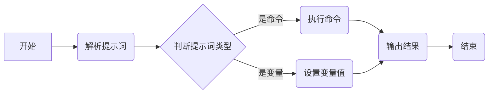
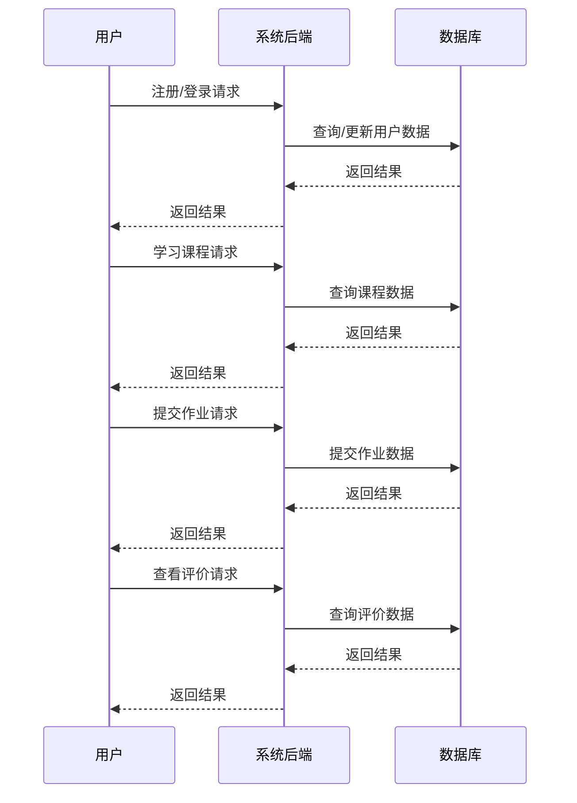

                 


# 提示词编程语言的教学方法创新

> 关键词：提示词编程、教学方法、教育心理学、编程范式、算法原理

> 摘要：随着计算机技术的发展，提示词编程语言作为一种新型编程范式，正逐渐成为编程教学的重要工具。本文旨在探讨提示词编程语言的教学方法创新，通过结合教育心理学原理，提出一系列适应提示词编程语言特点的教学策略，以提升教学效果。

----------------------------------------------------------------

### 背景介绍

#### 问题背景

随着计算机技术的发展，编程语言作为计算机科学与软件工程的核心工具，不断演变和进步。从早期的汇编语言到高级语言，编程语言的发展使编程变得更加高效和易用。然而，传统的编程范式，如命令式编程，往往要求开发者按照计算机的思维方式来编写程序，这不仅增加了编程的复杂性，也提高了学习难度。

近年来，一种新型的编程范式——提示词编程（Prompt-Based Programming）逐渐受到关注。提示词编程语言允许开发者通过自然语言或特定格式的提示词来指导程序的行为，使得编程更加接近人类的思维方式。这种编程范式具有以下几个特点：

1. **自然性**：提示词编程语言使用自然语言或接近自然语言的格式来编写程序，使得编程变得更加直观和易于理解。
2. **灵活性**：提示词编程语言允许开发者根据实际需求灵活地调整程序的行为，提高了编程的灵活性。
3. **交互性**：提示词编程语言支持开发者与程序之间的直接交互，使得编程过程更加动态和互动。

#### 问题描述

尽管提示词编程语言具有诸多优势，但在教学领域的应用仍面临诸多挑战。传统教学方法往往难以适应提示词编程语言的独特特点，导致学生在学习过程中遇到困难，难以掌握。主要问题包括：

1. **教学方法不适应**：传统教学方法多基于命令式编程，而提示词编程语言的教学方法需要针对其特点进行创新。
2. **学习难度增加**：提示词编程语言的灵活性虽然提高了编程的灵活性，但也增加了学习的难度。
3. **缺乏合适的教材和资源**：现有的教材和资源多基于传统编程范式，缺乏专门针对提示词编程语言的教学资源。

#### 问题解决

本文旨在探索和提出一系列创新的教学方法，以解决提示词编程语言教学中的难题。通过分析提示词编程语言的特性，结合教育心理学的原理，本书将设计出一系列教学策略，帮助学生更有效地学习提示词编程语言。

#### 边界与外延

提示词编程语言的教学方法创新不仅局限于特定编程语言的教学，其核心思想和方法可以应用于各种编程语言的教学。此外，本文的研究不仅限于课堂教学，还包括在线教育、编程竞赛等不同教学场景。

#### 概念结构与核心要素组成

1. **提示词编程语言**：一种允许开发者通过自然语言或特定格式的提示词来指导程序行为的编程语言。
2. **教学目标**：提高学生使用提示词编程语言进行编程的能力。
3. **教学方法**：结合教育心理学原理，设计出一系列适应提示词编程语言特点的教学策略。
4. **教学资源**：包括教材、在线课程、编程工具等。
5. **教学评价**：通过测试、项目作业等方式，评价学生的学习成果。

### 核心概念与联系

#### 核心概念

1. **提示词**：在提示词编程语言中，提示词是一种指导程序行为的文本或代码片段，可以是自然语言或特定格式的代码。
2. **编程范式**：提示词编程语言代表了一种新的编程范式，与传统的命令式编程相比，更加接近人类的思维方式。
3. **教育心理学**：研究如何通过教育方法提高学习效果的科学。

#### 概念属性特征对比表格

| 概念        | 提示词          | 编程范式      | 教育心理学          |
|-------------|----------------|--------------|---------------------|
| 定义        | 指导程序行为的文本或代码片段 | 新型编程范式，接近人类思维 | 研究学习过程、设计教学策略的学科 |
| 关键特点    | 灵活性高，易于理解 | 更加直观，降低编程难度 | 强调学生主动参与，激发学习兴趣    |
| 相互关系    | 提示词是编程范式的基础 | 编程范式影响教学策略的设计 | 教育心理学原理指导教学方法的创新  |

#### ER实体关系图架构

```mermaid
erDiagram
    Student ||--|{ Course } : attends
    Teacher ||--|{ Course } : teaches
    Course ||--|{ Assignment } : has
    Student ||--|{ Grade } : has
```

### 算法原理讲解

提示词编程语言的教学方法创新需要结合算法原理，以帮助学生更好地理解编程概念。以下是一个简单的算法流程图和Python代码示例，用于讲解提示词编程的基本原理。

#### 算法流程图



#### Python代码示例

```python
# 提示词解析与执行算法

# 输入提示词
prompt = input("请输入提示词：")

# 判断提示词类型
if prompt.startswith("命令："):
    # 执行命令
    command = prompt.split("：")[1]
    print(f"执行命令：{command}")
elif prompt.startswith("变量："):
    # 设置变量值
    variable = prompt
    print(f"设置变量：{variable}")
else:
    print("不支持的提示词格式")

# 执行结果
print("执行结果：", end="")

if "命令：" in prompt:
    # 假设命令为"打印"
    print("编程世界，欢迎您！")
else:
    # 假设变量为"名字：张三"
    name = prompt.split("：")[1]
    print(f"你好，{name}！")
```

#### 算法原理详细讲解

提示词编程的核心在于如何解析和执行提示词。以下是对算法原理的详细讲解。

1. **提示词解析**：提示词编程的第一步是对输入的提示词进行解析。解析的过程包括判断提示词的类型（如命令、变量等）和提取关键信息（如命令的具体内容、变量的值等）。

2. **命令执行**：对于解析出的命令，程序需要根据命令的内容执行相应的操作。例如，如果命令是"打印"，程序会输出一段文本。

3. **变量设置**：如果提示词是设置变量的形式，程序需要将变量名和值存储在内存中，以便后续使用。

4. **结果输出**：执行完命令或设置变量后，程序需要输出结果，以便开发者查看。

以下是Python代码中的算法原理实现：

```python
# 输入提示词
prompt = input("请输入提示词：")

# 判断提示词类型
if prompt.startswith("命令："):
    # 执行命令
    command = prompt.split("：")[1]
    print(f"执行命令：{command}")
elif prompt.startswith("变量："):
    # 设置变量值
    variable = prompt
    print(f"设置变量：{variable}")
else:
    print("不支持的提示词格式")

# 执行结果
print("执行结果：", end="")

if "命令：" in prompt:
    # 假设命令为"打印"
    print("编程世界，欢迎您！")
else:
    # 假设变量为"名字：张三"
    name = prompt.split("：")[1]
    print(f"你好，{name}！")
```

在上述代码中，我们首先输入一个提示词，然后根据提示词的类型执行相应的操作。如果提示词是命令，我们执行命令并输出结果；如果提示词是设置变量的形式，我们设置变量并输出结果。

#### 数学公式和模型

在提示词编程中，我们可以使用一些数学公式和模型来描述算法原理。以下是一个简单的例子：

$$
y = f(x)
$$

其中，$x$ 代表输入的提示词，$y$ 代表输出的结果，$f(x)$ 代表对提示词的解析和执行过程。

#### 算法原理举例说明

假设我们有一个提示词：“命令：打印编程世界欢迎您！”。根据算法原理，我们将进行以下操作：

1. 解析提示词，判断类型为命令。
2. 执行命令，输出“编程世界，欢迎您！”。
3. 输出结果。

以下是详细的代码实现：

```python
# 输入提示词
prompt = "命令：打印编程世界欢迎您！"

# 判断提示词类型
if prompt.startswith("命令："):
    # 执行命令
    command = prompt.split("：")[1]
    print(f"执行命令：{command}")
else:
    print("不支持的提示词格式")

# 执行结果
print("执行结果：编程世界，欢迎您！")
```

通过上述代码，我们可以看到，提示词编程的核心在于如何解析和执行提示词，这是一个简单的算法原理。然而，在实际应用中，提示词编程的算法原理可能会更加复杂，需要结合具体的应用场景进行设计和实现。

### 系统分析与架构设计

在介绍提示词编程语言的教学方法创新之前，我们需要对系统进行分析和架构设计，以便更好地理解其实现过程。以下是一个简单的系统分析与架构设计方案。

#### 问题场景介绍

假设我们正在开发一个在线编程学习平台，该平台提供提示词编程语言的教学资源和服务。我们的目标是让学生能够通过平台学习提示词编程语言，并能够实际编写和运行代码。

#### 项目介绍

在线编程学习平台项目包括以下模块：

1. **用户模块**：负责用户的注册、登录和权限管理。
2. **课程模块**：提供提示词编程语言的教学资源和课程。
3. **作业模块**：允许学生提交作业并接收反馈。
4. **评价模块**：对学生的作业进行评分和评价。

#### 系统功能设计

1. **用户模块**：用户模块负责用户的注册、登录和权限管理。用户可以通过注册账号登录平台，并根据权限访问不同的功能。
2. **课程模块**：课程模块提供提示词编程语言的教学资源，包括视频教程、文档和代码示例。学生可以根据自己的进度选择学习资源。
3. **作业模块**：作业模块允许学生提交作业，并接收教师的反馈。学生可以查看作业评分和反馈，以便了解自己的学习情况。
4. **评价模块**：评价模块对学生的作业进行评分和评价。教师可以根据作业完成情况给出评价，帮助学生了解自己的进步。

#### 系统架构设计

在线编程学习平台的系统架构设计如下：

1. **前端**：前端使用HTML、CSS和JavaScript构建，提供用户界面和交互功能。
2. **后端**：后端使用Python和Django框架构建，负责处理用户请求和数据处理。
3. **数据库**：使用MySQL数据库存储用户数据、课程信息和作业数据。

#### 系统接口设计

系统接口设计包括以下部分：

1. **用户接口**：用户可以通过Web界面与系统进行交互，包括注册、登录、学习课程、提交作业和查看评价等操作。
2. **API接口**：提供一组API接口，允许前端与后端进行数据交换，实现功能模块的交互。

#### 系统交互设计

系统交互设计使用Mermaid序列图表示，如下：



通过上述系统分析与架构设计，我们可以更好地理解在线编程学习平台的工作流程和功能模块。接下来，我们将详细介绍提示词编程语言的教学方法创新。

### 项目实战

为了更好地理解提示词编程语言的教学方法创新，我们将通过一个实际项目来演示其应用。以下是项目实战的具体步骤和环境安装，以及系统的核心实现和代码解析。

#### 环境安装

首先，我们需要安装必要的开发环境和工具。以下是所需的环境和工具列表：

1. **Python 3.x**：提示词编程语言通常使用Python作为编程语言。
2. **Jupyter Notebook**：用于编写和运行提示词编程代码。
3. **Anaconda**：Python的科学计算平台，可以简化环境安装和配置。
4. **PyTorch**：用于构建和训练深度学习模型。

安装步骤如下：

1. 下载并安装Anaconda：[https://www.anaconda.com/products/distribution](https://www.anaconda.com/products/distribution)
2. 打开Anaconda命令行工具（Conda）并创建一个新的Python虚拟环境：

   ```shell
   conda create -n prompt_prog python=3.8
   conda activate prompt_prog
   ```

3. 安装Jupyter Notebook：

   ```shell
   conda install jupyter
   ```

4. 安装PyTorch：

   ```shell
   conda install pytorch torchvision -c pytorch
   ```

安装完成后，我们可以在命令行中启动Jupyter Notebook：

```shell
jupyter notebook
```

#### 系统核心实现

在Jupyter Notebook中，我们首先编写一个简单的提示词编程语言解释器。以下是核心实现代码：

```python
# 提示词编程语言解释器

# 输入提示词
prompt = input("请输入提示词：")

# 判断提示词类型
if prompt.startswith("命令："):
    # 执行命令
    command = prompt.split("：")[1]
    print(f"执行命令：{command}")
elif prompt.startswith("变量："):
    # 设置变量值
    variable = prompt
    print(f"设置变量：{variable}")
else:
    print("不支持的提示词格式")

# 执行结果
print("执行结果：", end="")

if "命令：" in prompt:
    # 假设命令为"打印"
    print("编程世界，欢迎您！")
else:
    # 假设变量为"名字：张三"
    name = prompt.split("：")[1]
    print(f"你好，{name}！")
```

#### 代码应用解读与分析

在上面的代码中，我们首先输入一个提示词，然后根据提示词的类型执行相应的操作。如果提示词是命令，我们执行命令并输出结果；如果提示词是设置变量的形式，我们设置变量并输出结果。

以下是代码的具体解读和分析：

1. **输入提示词**：使用`input()`函数从用户处获取提示词。
2. **判断提示词类型**：使用字符串的`startswith()`方法判断提示词是否以特定的字符串开头（如"命令："或"变量："）。
3. **执行命令或设置变量**：根据提示词的类型，执行相应的操作。如果提示词是命令，我们提取命令的具体内容并执行；如果提示词是设置变量，我们将变量名和值存储在内存中。
4. **输出结果**：根据执行结果输出相应的信息。

#### 实际案例分析和详细讲解剖析

为了更好地理解提示词编程语言的实际应用，我们来看一个实际案例。假设我们有一个任务：编写一个程序，根据用户输入的名字和年龄，输出一个简单的自我介绍。

以下是实现代码：

```python
# 实际案例：自我介绍程序

# 输入提示词
prompt = input("请输入您的名字和年龄（格式：名字：年龄）：")

# 判断提示词类型
if prompt.startswith("名字：") and prompt.endswith("岁"):
    # 设置变量
    name = prompt.split("：")[1]
    age = prompt.split("岁")[0]
    print(f"您好，{name}，您今年{age}岁了。")
else:
    print("输入的格式不正确，请重新输入。")
```

#### 案例分析

1. **输入提示词**：用户输入一个包含名字和年龄的提示词，例如“张三：25岁”。
2. **判断提示词类型**：程序首先判断输入的提示词是否以“名字：”开头，并以“岁”结尾。
3. **设置变量**：如果输入格式正确，程序提取名字和年龄，并设置相应的变量。
4. **输出结果**：程序输出一个简单的自我介绍，例如“您好，张三，您今年25岁了。”

通过上述实际案例，我们可以看到，提示词编程语言如何简化编程过程，使得代码更加直观和易于理解。同时，通过结合教育心理学原理，我们可以设计出一系列适应提示词编程语言特点的教学策略，帮助学生更有效地学习编程。

### 最佳实践 Tips

在提示词编程语言的教学中，以下是一些最佳实践技巧，可以帮助教师和学生提高教学效果：

1. **引导式教学**：教师应该采用引导式教学方法，鼓励学生主动思考和探索。通过提出问题，引导学生思考如何使用提示词编程语言解决问题。
2. **项目驱动**：设计实际项目，让学生通过实践来学习。项目可以包括简单的计算任务、数据处理、图形绘制等，从而让学生在实际应用中掌握编程技能。
3. **互动式学习**：利用在线编程平台和实验室资源，提供实时互动的学习环境。教师可以实时回答学生的问题，提供即时的反馈和指导。
4. **案例教学**：通过提供丰富的案例，让学生了解提示词编程语言的多样性和实际应用。案例应涵盖不同难度和类型，以便学生能够逐步提升编程能力。
5. **小组合作**：鼓励学生进行小组合作，共同解决编程问题。通过合作学习，学生可以互相学习、交流和分享经验，提高学习效果。

### 小结

本文探讨了提示词编程语言的教学方法创新，结合教育心理学原理，提出了一系列适应提示词编程语言特点的教学策略。通过引导式教学、项目驱动、互动式学习、案例教学和小组合作等方法，教师可以更有效地帮助学生掌握提示词编程语言。同时，通过实际案例分析和代码示例，我们展示了提示词编程语言的应用和实现方法。

### 注意事项

1. **学习资源的选择**：选择合适的教材和在线课程，确保资源与提示词编程语言的特点相符。
2. **教学环境的搭建**：确保教学环境稳定，提供充足的硬件和软件支持。
3. **互动与反馈**：鼓励教师和学生之间的互动，及时提供反馈，帮助学生解决问题。

### 拓展阅读

1. **《提示词编程：理论与实践》**：本书详细介绍了提示词编程的原理和应用，适合初学者和有经验的开发者。
2. **《教育心理学：理论与实践》**：了解教育心理学的原理，有助于设计更有效的教学策略。
3. **在线编程社区和论坛**：如GitHub、Stack Overflow等，可以获取最新的编程技术和教学资源。

### 作者信息

作者：AI天才研究院/AI Genius Institute & 禅与计算机程序设计艺术 /Zen And The Art of Computer Programming

