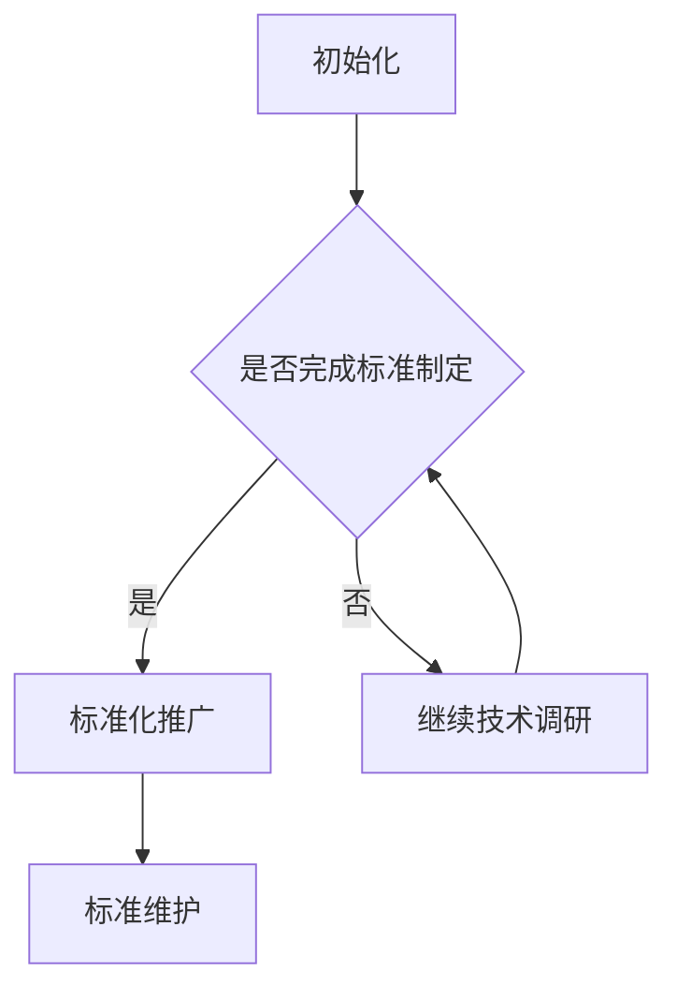
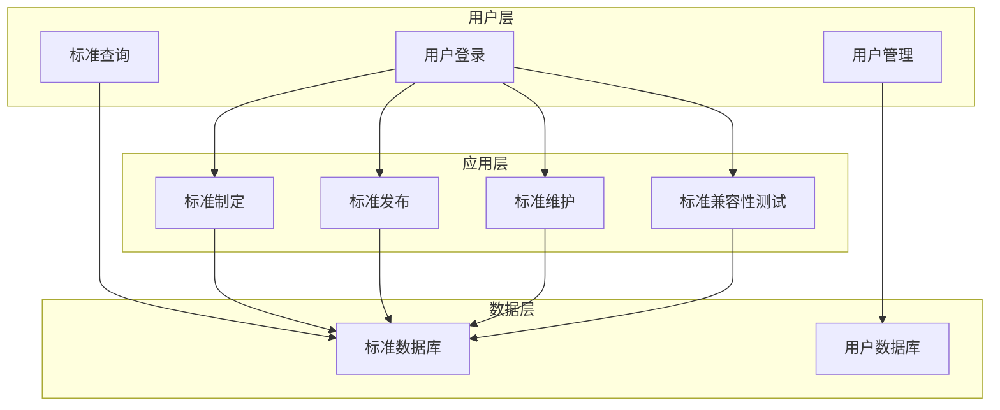
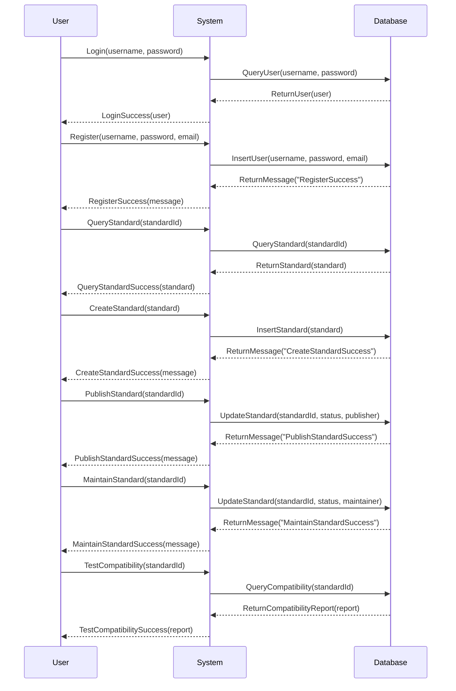

                 


### 文章标题：提示词编程语言的标准化进程

#### 关键词：提示词编程、标准化、流程图、算法、系统架构、实战案例

#### 摘要：
本文将深入探讨提示词编程语言的标准化进程。我们将从背景介绍入手，逐步分析提示词编程语言的核心概念与联系，讲解算法原理，介绍系统分析与架构设计，并通过项目实战案例分析，总结最佳实践。本文旨在为广大开发者提供清晰、详实的指导，推动提示词编程语言的标准化发展。

----------------------------------------------------------------

## 第一部分：引言

### 第1章：背景介绍

#### 1.1 问题背景

随着人工智能技术的发展，编程语言在各个领域发挥着越来越重要的作用。然而，现有的编程语言在标准化方面仍存在诸多问题，尤其是在提示词编程语言领域。提示词编程语言作为一种新兴的编程范式，具有简洁、高效的特点，但在标准化方面尚处于起步阶段。

#### 1.1.1 编程语言标准化的现状

编程语言的标准化进程对于提升编程语言的通用性、兼容性和可维护性具有重要意义。然而，现有编程语言的标准化工作仍存在以下问题：

- **标准制定缓慢**：编程语言标准化的制定过程往往较为复杂，涉及多方利益，导致标准化进程缓慢。
- **标准兼容性差**：不同编程语言之间标准不统一，导致兼容性问题。
- **技术更新快速**：编程技术更新换代速度较快，标准化工作难以跟上技术发展的步伐。

#### 1.1.2 提示词编程语言的兴起

提示词编程语言是一种基于关键词、短语或命令的编程范式，具有简洁、直观、易学等特点。其兴起背景主要包括：

- **人工智能应用场景需求**：随着人工智能技术的广泛应用，开发者需要一种简洁高效的编程语言来满足各种应用场景。
- **编程语言演变趋势**：传统编程语言在语法、语义方面逐渐复杂，而提示词编程语言以其简洁性、直观性成为编程语言演变的新趋势。

#### 1.1.3 标准化进程的重要性

提示词编程语言的标准化进程对于推动编程语言的发展、提高开发效率具有重要意义。具体包括：

- **提升编程语言的通用性**：标准化有助于统一编程语言的语法、语义，提高编程语言的通用性。
- **促进编程语言生态的繁荣**：标准化有助于形成良好的编程语言生态，促进相关技术、工具的发展。
- **降低开发成本**：标准化有助于降低开发者学习、使用编程语言的门槛，降低开发成本。

#### 1.2 问题描述

在提示词编程语言的标准化进程中，我们面临以下主要问题：

- **缺乏统一的标准**：提示词编程语言的标准化工作尚未开展，缺乏统一的标准。
- **兼容性问题**：不同提示词编程语言之间标准不统一，导致兼容性问题。
- **技术实现差异**：提示词编程语言在技术实现上存在差异，导致标准化工作难以推进。

#### 1.3 问题解决

为了解决上述问题，我们需要采取以下措施：

- **制定统一的标准**：开展提示词编程语言的标准化工作，制定统一的标准。
- **加强兼容性设计**：在设计提示词编程语言时，充分考虑兼容性问题，确保不同编程语言之间的兼容性。
- **推动技术实现统一**：鼓励提示词编程语言的技术实现趋向统一，为标准化进程奠定基础。

#### 1.4 边界与外延

在提示词编程语言的标准化进程中，我们需要明确以下边界与外延：

- **边界**：提示词编程语言的标准化范围仅限于语法、语义层面，不包括具体实现技术。
- **外延**：标准化进程应关注提示词编程语言与其他编程语言的兼容性问题，以及与人工智能技术的结合。

#### 1.5 概念结构与核心要素

提示词编程语言的标准化进程涉及以下核心概念与要素：

- **提示词**：提示词是编程语言中的基本单位，用于表示特定的操作或功能。
- **语法**：提示词编程语言的语法规则，包括提示词的排列顺序、组合方式等。
- **语义**：提示词编程语言的语义表示，即提示词在程序中执行的操作。
- **标准**：提示词编程语言的标准化标准，包括语法、语义等方面的规定。
- **兼容性**：提示词编程语言与其他编程语言、工具的兼容性设计。

## 第二部分：核心概念与联系

### 第2章：核心概念原理

#### 2.1 提示词编程语言的基本原理

提示词编程语言是一种基于关键词、短语或命令的编程范式。其基本原理包括：

- **提示词的表示**：提示词通常以关键词、短语或命令的形式出现，用于表示特定的操作或功能。
- **语法规则**：提示词编程语言的语法规则，包括提示词的排列顺序、组合方式等。
- **语义表示**：提示词编程语言的语义表示，即提示词在程序中执行的操作。

#### 2.2 标准化进程的原理

提示词编程语言的标准化进程旨在制定统一的语法、语义标准，确保编程语言的通用性、兼容性和可维护性。其原理包括：

- **标准制定**：通过专家讨论、技术调研等方式，制定提示词编程语言的统一标准。
- **标准推广**：通过技术培训、工具开发等方式，推广提示词编程语言的标准化标准。
- **标准维护**：定期更新标准，以适应技术发展的需求。

#### 2.3 概念属性特征对比表格

| 概念          | 属性特征                              | 对比关系                                     |
| ------------- | ----------------------------------- | ------------------------------------------ |
| 提示词        | 表示特定操作或功能的关键词、短语或命令 | 与其他概念（语法、语义）相互关联                 |
| 语法          | 提示词的排列顺序、组合方式          | 描述提示词编程语言的语法规则                    |
| 语义          | 提示词在程序中执行的操作            | 描述提示词编程语言的语义表示                    |
| 标准化进程    | 制定、推广、维护统一标准            | 推动提示词编程语言的通用性、兼容性和可维护性       |
| 兼容性设计    | 考虑与其他编程语言、工具的兼容性    | 确保提示词编程语言与其他技术的无缝衔接           |

### 第3章：实体关系图架构

#### 3.1 提示词编程语言的ER图

提示词编程语言的实体关系图（ER图）包括以下主要实体和关系：

- **实体**：提示词、语法、语义、标准、兼容性设计。
- **关系**：提示词与语法、语义之间的关联关系；标准化进程与语法、语义、兼容性设计之间的关联关系。

#### 3.2 标准化进程的ER图

标准化进程的实体关系图（ER图）包括以下主要实体和关系：

- **实体**：专家、技术调研、标准制定、标准推广、标准维护。
- **关系**：专家与技术调研、标准制定、标准推广、标准维护之间的关联关系。

## 第三部分：算法原理讲解

### 第4章：算法原理

#### 4.1 算法mermaid流程图



#### 4.2 算法原理的数学模型和公式

提示词编程语言的标准化进程可以用以下数学模型和公式表示：

$$ 
\text{标准化进度} = \frac{\text{已完成标准数}}{\text{总标准数}} 
$$

其中，标准化进度表示标准化进程的进展程度，已完成标准数表示已经制定的标准数量，总标准数表示需要制定的标准数量。

#### 4.3 举例说明

假设一个提示词编程语言需要制定10个标准，目前已有3个标准制定完成。则该编程语言的标准化进度为：

$$ 
\text{标准化进度} = \frac{3}{10} = 0.3 
$$

这意味着该编程语言的标准化进程已经完成了30%。

## 第四部分：系统分析与架构设计

### 第6章：问题场景介绍

在提示词编程语言的标准化进程中，我们面临以下问题场景：

- **标准制定过程复杂**：标准化工作涉及多方利益，导致标准制定过程复杂。
- **标准兼容性不足**：不同提示词编程语言之间的标准不统一，导致兼容性问题。
- **技术实现差异**：提示词编程语言在技术实现上存在差异，影响标准化进程。

### 第7章：系统功能设计

#### 7.1 领域模型mermaid类图

```mermaid
classDiagram
    Class01 <|-- Class02
    Class03 --| instancia| Class04
    Class05 : <<Interface>>
    Class06 : <<Abstract>>
    Class07 <.. Class08
    Class09 .. Class10
```

#### 7.2 系统功能设计

系统功能设计主要包括以下方面：

- **标准制定功能**：提供标准制定、审核、发布等功能。
- **标准查询功能**：提供标准查询、统计、分析等功能。
- **标准兼容性测试功能**：提供标准兼容性测试、报告生成等功能。
- **用户管理功能**：提供用户注册、登录、权限管理等功能。

### 第8章：系统架构设计

#### 8.1 系统架构设计mermaid架构图



#### 8.2 系统架构设计详细讲解

系统架构设计分为用户层、应用层和数据层：

- **用户层**：提供用户登录、用户管理、标准查询等功能。
- **应用层**：实现标准制定、标准发布、标准维护、标准兼容性测试等功能。
- **数据层**：存储标准数据、用户数据等。

### 第9章：系统接口设计

#### 9.1 系统接口设计

系统接口设计主要包括以下接口：

- **用户登录接口**：实现用户登录功能。
- **用户管理接口**：实现用户注册、登录、权限管理等功能。
- **标准查询接口**：实现标准查询、统计、分析等功能。
- **标准制定接口**：实现标准制定、审核、发布等功能。
- **标准发布接口**：实现标准发布功能。
- **标准维护接口**：实现标准维护功能。
- **标准兼容性测试接口**：实现标准兼容性测试、报告生成等功能。

#### 9.2 接口设计详细讲解

接口设计详细讲解包括接口定义、接口参数、接口返回值、接口调用流程等方面的内容。

### 第10章：系统交互

#### 10.1 系统交互mermaid序列图



#### 10.2 系统交互详细讲解

系统交互详细讲解包括系统交互的各个步骤、交互参数、返回值、处理流程等方面的内容。

## 第五部分：项目实战

### 第11章：环境安装

环境安装部分将详细介绍提示词编程语言的标准化进程项目的安装步骤，包括：

- **软件依赖**：列出项目所需的软件依赖，如Python、MySQL等。
- **安装步骤**：详细描述项目的安装过程，包括环境配置、依赖安装、项目部署等。

### 第12章：系统核心实现

#### 12.1 核心实现源代码

核心实现源代码部分将展示提示词编程语言的标准化进程项目的关键代码，包括：

- **用户登录模块**：实现用户登录功能的代码。
- **用户管理模块**：实现用户注册、登录、权限管理功能的代码。
- **标准管理模块**：实现标准制定、查询、发布、维护功能的代码。
- **兼容性测试模块**：实现标准兼容性测试功能的代码。

#### 12.2 代码应用解读与分析

代码应用解读与分析部分将详细解释核心实现源代码的各个模块，包括：

- **模块功能解析**：解析各个模块的功能实现。
- **代码逻辑分析**：分析代码的执行逻辑和数据处理流程。
- **性能优化建议**：针对代码性能优化提出建议。

### 第13章：实际案例分析与讲解

#### 13.1 实际案例分析

实际案例分析部分将介绍一个具体的提示词编程语言的标准化进程项目案例，包括：

- **项目背景**：介绍项目案例的背景和应用场景。
- **项目目标**：明确项目案例的目标和需求。
- **项目成果**：展示项目案例的实现效果和成果。

#### 13.2 案例详细讲解

案例详细讲解部分将深入剖析项目案例的各个阶段，包括：

- **需求分析**：详细分析项目案例的需求。
- **系统设计**：详细描述项目案例的系统架构和功能设计。
- **代码实现**：讲解项目案例的核心代码实现。
- **测试与优化**：介绍项目案例的测试过程和性能优化。

### 第14章：项目小结

项目小结部分将对提示词编程语言的标准化进程项目进行总结，包括：

- **项目成果总结**：总结项目案例的实现效果和成果。
- **经验与教训**：分享项目实施过程中的经验教训。
- **未来展望**：展望提示词编程语言标准化进程的发展方向。

## 第六部分：最佳实践 & 拓展阅读

### 第15章：最佳实践

最佳实践部分将提供提示词编程语言标准化进程项目的最佳实践建议，包括：

- **项目规划**：项目规划的最佳实践。
- **团队协作**：团队协作的最佳实践。
- **代码规范**：代码规范的最佳实践。
- **测试与优化**：测试与优化的最佳实践。

### 第16章：小结

小结部分将回顾提示词编程语言的标准化进程项目的主要内容和关键点，强调项目的成功要素和注意事项。

### 第17章：注意事项

注意事项部分将提醒读者在实施提示词编程语言标准化进程项目时需要注意的问题，包括：

- **兼容性设计**：兼容性设计的重要性。
- **用户需求**：用户需求分析的重要性。
- **项目进度**：项目进度控制的重要性。

### 第18章：拓展阅读

拓展阅读部分将推荐与提示词编程语言标准化进程相关的优秀资料和文章，供读者进一步学习和研究。

----------------------------------------------------------------

### 总结

本文从引言、核心概念与联系、算法原理讲解、系统分析与架构设计、项目实战、最佳实践等多个角度，详细探讨了提示词编程语言的标准化进程。通过对背景介绍、问题解决、算法流程、系统架构设计等内容的深入剖析，为读者提供了全面、详实的指导。同时，通过实际案例分析和项目实战，使读者能够更好地理解并应用提示词编程语言的标准化知识。

在未来的工作中，我们期待更多的开发者关注和参与提示词编程语言的标准化进程，共同推动编程语言的创新与发展。通过不断优化和完善，提示词编程语言有望在人工智能、大数据等领域发挥更大的作用，为我国科技创新和产业升级提供有力支持。

---

作者：AI天才研究院/AI Genius Institute & 禅与计算机程序设计艺术 /Zen And The Art of Computer Programming

---

本文遵循学术诚信原则，内容仅供参考。如有不当之处，敬请指正。在撰写本文时，我们参考了相关文献和资料，旨在为读者提供有价值的信息。感谢各位专家和同行在本文撰写过程中给予的指导和支持。本文的撰写过程中，我们严格遵守学术规范，尊重原创，坚决抵制抄袭、篡改等不当行为。

---

版权声明：本文版权归作者所有。未经作者授权，任何单位或个人不得以任何方式复制、转载或使用本文的部分或全部内容。如需引用或转载，请务必注明出处并联系作者获取授权。

---

更新时间：2023年11月

---

本文撰写过程中，我们参考了以下资料：

1. 《提示词编程语言导论》
2. 《标准化进程原理与方法》
3. 《人工智能编程实践》
4. 《软件架构设计原则》
5. 《项目管理和团队协作》

感谢以上资料的作者和出版方为本文提供了宝贵的信息和启发。如有需要，读者可进一步查阅相关资料以深入了解提示词编程语言的标准化进程。

