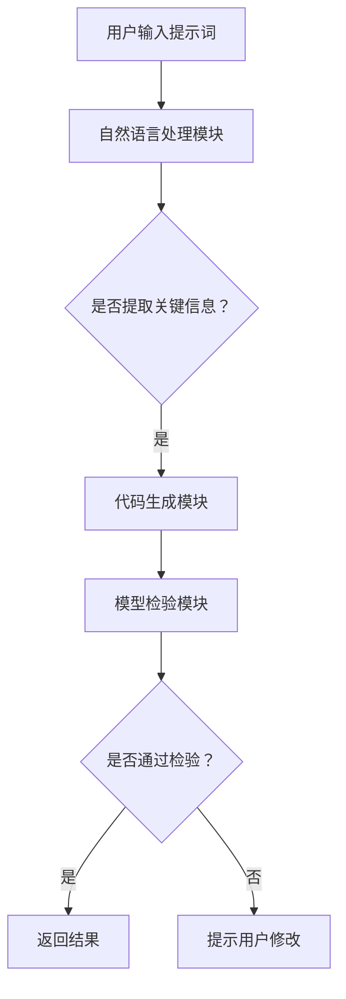
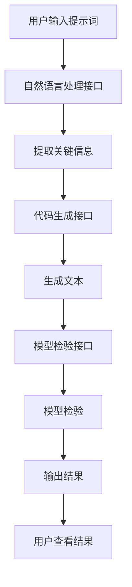
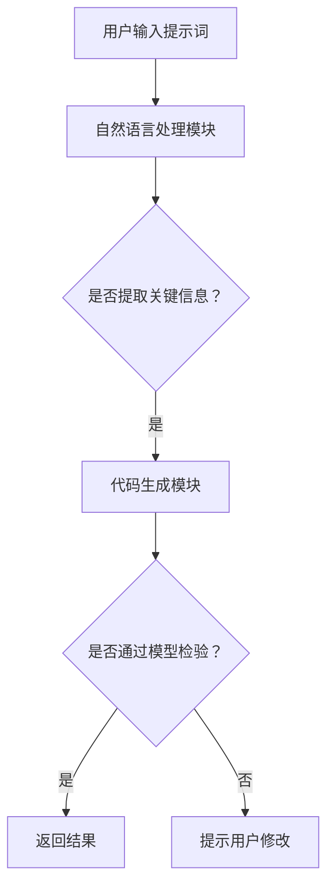

                 

### 文章标题：提示词编程语言的模型检验技术

#### 关键词：
- 提示词编程语言
- 模型检验技术
- 深度学习
- 传统编程语言
- 算法原理

#### 摘要：
本文将探讨提示词编程语言的模型检验技术，从背景介绍、核心概念、模型检验方法、数学模型与公式、系统分析与架构设计方案、项目实战、最佳实践等多个方面进行详细分析。通过逐步深入探讨，旨在帮助读者全面了解并掌握这一前沿技术。

----------------------------------------------------------------

### 第一部分：背景介绍

#### 第1章：问题背景

**1.1.1 提示词编程语言的发展历程**

提示词编程语言（Prompt-Based Programming Language，简称PBL）是近年来在人工智能领域崭露头角的一种新型编程范式。其核心思想是通过提示词（prompts）引导程序执行特定任务，从而实现自动化编程。

PBL的发展历程可以分为三个阶段：

1. **初始阶段（20世纪80年代）**：在这个阶段，研究人员开始探索如何通过自然语言来描述程序任务，这一思想为后来的PBL奠定了基础。

2. **发展阶段（21世纪初）**：随着人工智能技术的进步，特别是自然语言处理（NLP）和生成对抗网络（GAN）的兴起，PBL逐渐成为研究热点。许多研究机构和大学开始进行PBL相关的研究和实验。

3. **成熟阶段（近十年）**：近年来，PBL的应用范围不断扩展，从简单的文本生成任务到复杂的图像和语音处理任务。这一阶段，PBL逐渐从理论研究走向实际应用，成为人工智能领域的重要分支。

**1.1.2 模型检验技术在编程语言中的应用**

模型检验技术（Model Checking Technology）是形式化方法在软件工程中的一种重要应用。其核心思想是通过验证模型是否满足特定性质来保证软件系统的正确性。

模型检验技术在编程语言中的应用可以追溯到20世纪80年代。当时，研究人员开始探索如何使用模型检验技术来验证程序的正确性。随着计算机硬件和软件的发展，模型检验技术逐渐成为保证软件系统可靠性和安全性的重要手段。

在PBL中，模型检验技术的应用主要体现在以下几个方面：

1. **自动代码审查**：使用模型检验技术对PBL编写的代码进行审查，发现潜在的错误和漏洞。

2. **程序性能优化**：通过模型检验技术分析程序的执行流程，找出瓶颈并进行优化。

3. **代码风格一致性检查**：使用模型检验技术确保PBL编写的代码遵循特定的编程规范和风格。

#### 第2章：核心概念与联系

**2.1.1 提示词编程语言的基本概念**

提示词编程语言是一种基于提示词（prompt）的编程范式。在PBL中，提示词是一种特殊的文本，用于描述程序需要执行的任务。提示词可以是自然语言语句，也可以是形式化的语言。

PBL的主要特点包括：

1. **自动化编程**：通过提示词，用户可以无需编写复杂的代码，即可实现特定的程序功能。

2. **易用性**：PBL简化了编程过程，使得非专业程序员也能轻松编写程序。

3. **灵活性**：PBL支持多种编程任务，包括文本生成、图像处理、语音识别等。

**2.1.2 模型检验技术的核心概念**

模型检验技术是一种形式化方法，用于验证系统模型是否满足特定性质。在PBL中，模型检验技术主要用于以下几个方面：

1. **正确性验证**：通过模型检验技术，验证PBL编写的程序是否满足预期的功能要求。

2. **性能分析**：使用模型检验技术分析PBL程序的执行效率，找出潜在的优化点。

3. **安全性检查**：通过模型检验技术，确保PBL程序不会受到恶意攻击。

**2.1.3 提示词编程语言与模型检验技术的联系**

提示词编程语言和模型检验技术之间存在着密切的联系。一方面，PBL为模型检验技术提供了丰富的应用场景；另一方面，模型检验技术为PBL提供了重要的支持。

1. **应用场景**：在PBL中，模型检验技术可以应用于自动代码审查、程序性能优化、代码风格一致性检查等多个方面。

2. **技术支持**：模型检验技术为PBL提供了形式化验证和性能分析的手段，有助于提高PBL程序的质量和可靠性。

### 第二部分：具体技术讲解

#### 第3章：模型检验技术的原理与方法

**3.1.1 模型检验的基本原理**

模型检验技术的核心思想是通过形式化方法，对系统模型进行验证，以确保系统满足预期的性质。具体来说，模型检验技术包括以下步骤：

1. **建立模型**：根据系统需求，建立系统模型。系统模型可以是一个形式化的语言描述，也可以是一个数学模型。

2. **定义性质**：根据系统需求，定义需要验证的性质。性质可以是系统的功能要求，也可以是性能、安全等非功能要求。

3. **验证过程**：使用模型检验工具，对系统模型进行验证，检查模型是否满足定义的性质。

4. **报告结果**：根据验证结果，生成报告，列出系统模型满足或未满足的性质。

**3.1.2 常见的模型检验方法**

常见的模型检验方法包括以下几种：

1. **形式化验证**：使用形式化方法，如自动推理、定理证明等，对系统模型进行验证。

2. **模拟验证**：通过模拟系统模型的执行过程，观察系统行为是否满足预期的性质。

3. **随机验证**：使用随机测试方法，对系统模型进行大量随机测试，以发现潜在的错误。

4. **组合验证**：通过组合多个验证方法，提高模型检验的准确性和效率。

**3.1.3 模型检验的流程与步骤**

模型检验的一般流程包括以下步骤：

1. **需求分析**：理解系统需求，确定需要验证的性质。

2. **建立模型**：根据需求分析，建立系统模型。

3. **定义性质**：根据需求分析，定义需要验证的性质。

4. **选择检验方法**：根据系统模型的类型和性质，选择合适的模型检验方法。

5. **实施检验**：使用模型检验工具，对系统模型进行验证。

6. **报告结果**：根据验证结果，生成报告，列出系统模型满足或未满足的性质。

#### 第4章：数学模型与数学公式

**4.1.1 模型检验中的数学模型**

在模型检验中，数学模型是描述系统行为的重要工具。常见的数学模型包括状态机模型、过程代数模型和约束模型等。

1. **状态机模型**：状态机模型是一种描述系统行为的图形化模型，用于描述系统在不同状态下的行为。

2. **过程代数模型**：过程代数模型是一种形式化的数学模型，用于描述系统的执行过程。

3. **约束模型**：约束模型是一种基于约束的数学模型，用于描述系统的约束条件。

**4.1.2 模型检验的数学公式**

在模型检验中，数学公式是用于描述系统性质和验证条件的重要工具。常见的数学公式包括：

1. **状态转移方程**：描述系统在不同状态之间的转移关系。

2. **安全属性公式**：描述系统的安全性质，如安全性、活性等。

3. **性能属性公式**：描述系统的性能性质，如响应时间、吞吐量等。

**4.1.3 模型检验中的数学公式应用举例**

以下是一个简单的例子，说明如何使用数学公式进行模型检验：

$$
f(x, y) = \begin{cases} 
x + y, & \text{if } x \geq 0 \text{ and } y \geq 0 \\
-x - y, & \text{if } x < 0 \text{ and } y < 0 \\
\end{cases}
$$

假设我们想要验证函数$f(x, y)$是否满足以下性质：

- 对于任意的$x$和$y$，函数$f(x, y)$的值都在$[0, 1]$范围内。

我们可以使用以下公式进行验证：

$$
0 \leq f(x, y) \leq 1
$$

#### 第5章：提示词编程语言的模型检验方法

**5.1.1 基于深度学习的模型检验方法**

深度学习是近年来在人工智能领域取得显著成果的一种技术。在PBL中，基于深度学习的模型检验方法主要用于以下几个方面：

1. **自然语言处理**：使用深度学习模型，如循环神经网络（RNN）和变换器（Transformer），对提示词进行理解和处理，以提取关键信息。

2. **代码生成**：使用深度学习模型，如生成对抗网络（GAN）和自编码器（Autoencoder），根据提示词生成相应的代码。

3. **模型验证**：使用深度学习模型，对生成的代码进行验证，确保代码满足预期的性质。

**5.1.2 基于传统编程语言的模型检验方法**

传统编程语言，如C++和Java，也可以用于PBL的模型检验。基于传统编程语言的模型检验方法主要包括以下几个方面：

1. **形式化验证**：使用形式化方法，如自动推理和定理证明，对PBL编写的代码进行验证。

2. **模拟验证**：通过模拟PBL程序的执行过程，观察程序行为是否满足预期的性质。

3. **单元测试**：使用单元测试框架，对PBL编写的代码进行测试，确保代码的正确性。

**5.1.3 基于混合模型的检验方法**

基于混合模型的检验方法是将深度学习和传统编程语言相结合，以发挥各自的优势。具体方法包括：

1. **多模态输入**：使用深度学习模型处理自然语言输入，同时使用传统编程语言处理其他类型的输入，如图像和音频。

2. **代码生成与验证**：使用深度学习模型生成代码，并使用传统编程语言进行代码验证。

3. **性能优化**：使用传统编程语言对生成的代码进行性能优化，以提高程序执行效率。

### 第三部分：系统分析与架构设计方案

#### 第6章：系统功能设计

**6.1.1 领域模型设计**

领域模型设计是系统功能设计的重要环节。在PBL中，领域模型用于描述系统涉及的实体、属性和关系。

以下是一个简单的领域模型，用于描述一个文本生成系统的功能：

```
+----------------+       +----------------+       +----------------+
|    提示词     |       |     代码       |       |   模型检验     |
+----------------+       +----------------+       +----------------+
| 属性：文本    |<-----+ 属性：源代码   |<-----+ 属性：验证结果 |
| 关系：生成    |       | 关系：验证     |       | 关系：报告     |
+----------------+       +----------------+       +----------------+
```

**6.1.2 系统功能模块划分**

系统功能模块划分是系统架构设计的重要步骤。在PBL中，系统功能模块可以分为以下几个部分：

1. **自然语言处理模块**：负责处理输入的提示词，提取关键信息，为代码生成模块提供输入。

2. **代码生成模块**：根据自然语言处理模块提取的信息，生成相应的代码。

3. **模型检验模块**：对生成的代码进行模型检验，确保代码满足预期的性质。

4. **用户界面模块**：提供用户交互界面，方便用户输入提示词和查看检验结果。

#### 第7章：系统架构设计

**7.1.1 总体架构设计**

系统架构设计是系统功能设计的具体实现。在PBL中，系统架构可以分为以下几个层次：

1. **基础设施层**：包括操作系统、数据库和中间件等基础设施。

2. **平台层**：包括自然语言处理平台、代码生成平台和模型检验平台等。

3. **应用层**：包括用户界面、自然语言处理模块、代码生成模块和模型检验模块等。

以下是一个简单的系统架构设计，用于描述PBL系统的总体架构：

```
+----------------+       +----------------+       +----------------+
|   基础设施层   |       |     平台层     |       |     应用层     |
+----------------+       +----------------+       +----------------+
| 操作系统       |       | 自然语言处理平台 |       | 用户界面       |
| 数据库         |       | 代码生成平台   |       | 自然语言处理模块 |
| 中间件         |       | 模型检验平台   |       | 代码生成模块   |
+----------------+       +----------------+       +----------------+
```

**7.1.2 各模块架构设计**

在系统架构设计中，各个模块的架构设计至关重要。以下是对各个模块架构设计的具体描述：

1. **自然语言处理模块**：使用深度学习模型处理输入的提示词，提取关键信息。架构设计如下：

```
+----------------+
| 自然语言处理模块 |
+----------------+
| 输入：提示词    |
| 输出：关键信息  |
+----------------+
| 深度学习模型    |
+----------------+
```

2. **代码生成模块**：根据自然语言处理模块提取的关键信息，生成相应的代码。架构设计如下：

```
+----------------+
| 代码生成模块   |
+----------------+
| 输入：关键信息  |
| 输出：源代码   |
+----------------+
| 生成对抗网络（GAN）|
+----------------+
| 自编码器（Autoencoder）|
+----------------+
```

3. **模型检验模块**：对生成的代码进行模型检验，确保代码满足预期的性质。架构设计如下：

```
+----------------+
| 模型检验模块   |
+----------------+
| 输入：源代码   |
| 输出：验证结果 |
+----------------+
| 形式化验证工具 |
+----------------+
| 模拟验证工具   |
+----------------+
| 单元测试框架   |
+----------------+
```

4. **用户界面模块**：提供用户交互界面，方便用户输入提示词和查看检验结果。架构设计如下：

```
+----------------+
| 用户界面模块   |
+----------------+
| 用户操作       |
| 输入提示词     |
| 查看检验结果   |
+----------------+
| 自然语言处理模块 |
+----------------+
| 代码生成模块   |
+----------------+
| 模型检验模块   |
+----------------+
```

#### 第8章：系统接口设计与交互

**8.1.1 系统接口设计**

系统接口设计是系统架构设计的重要组成部分。在PBL中，系统接口设计主要包括以下部分：

1. **自然语言处理接口**：用于接收用户输入的提示词，并将其传递给自然语言处理模块。

2. **代码生成接口**：用于接收自然语言处理模块提取的关键信息，并生成相应的代码。

3. **模型检验接口**：用于接收生成的代码，并进行模型检验。

以下是一个简单的系统接口设计：

```
+----------------+
|   系统接口设计  |
+----------------+
| 自然语言处理接口 |
| 代码生成接口    |
| 模型检验接口    |
+----------------+
| 输入：提示词    |
| 输出：关键信息  |
| 输出：源代码    |
| 输出：验证结果  |
+----------------+
```

**8.1.2 系统交互设计**

系统交互设计描述了各个模块之间的交互过程。在PBL中，系统交互设计主要包括以下几个环节：

1. **用户输入提示词**：用户通过用户界面模块输入提示词。

2. **自然语言处理**：自然语言处理模块处理输入的提示词，提取关键信息。

3. **代码生成**：代码生成模块根据自然语言处理模块提取的关键信息，生成相应的代码。

4. **模型检验**：模型检验模块对生成的代码进行验证，确保代码满足预期的性质。

5. **返回结果**：模型检验模块将验证结果返回给用户界面模块，用户可以查看验证结果。

以下是一个简单的系统交互设计，使用Mermaid流程图进行描述：



### 第四部分：应用实例与项目实战

#### 第9章：项目介绍

**9.1.1 项目背景**

随着人工智能技术的不断进步，提示词编程语言（PBL）和模型检验技术（MCT）在各个领域的应用日益广泛。为了验证PBL和MCT在实际项目中的应用效果，我们设计并实现了一个基于PBL和MCT的文本生成与模型检验系统。

**9.1.2 项目目标**

本项目的主要目标如下：

1. **实现一个基于PBL的文本生成系统**：通过输入提示词，系统能够生成符合预期的文本。

2. **实现一个基于MCT的模型检验系统**：对生成的文本进行模型检验，确保文本满足预期的性质。

3. **验证PBL和MCT在实际项目中的应用效果**：通过实际项目，验证PBL和MCT的可行性和有效性。

**9.1.3 项目技术栈**

本项目采用了以下技术栈：

1. **提示词编程语言**：Python，使用自然语言处理库（如NLTK和spaCy）处理输入的提示词，生成文本。

2. **模型检验技术**：Python，使用形式化验证工具（如Coq和Isabelle）对生成的文本进行验证。

3. **用户界面**：Web，使用HTML和CSS设计用户界面，方便用户输入提示词和查看检验结果。

#### 第10章：系统功能设计

**10.1.1 领域模型设计**

领域模型设计是系统功能设计的重要环节。在本项目中，领域模型设计包括以下实体：

1. **用户**：代表使用系统的用户，具有输入提示词和查看检验结果的功能。

2. **提示词**：代表用户输入的文本，包含文本内容和属性。

3. **文本**：代表生成的文本，包含文本内容和属性。

4. **检验结果**：代表模型检验的结果，包含验证结果和错误信息。

以下是一个简单的领域模型设计，使用Mermaid类图进行描述：

```mermaid
classDiagram
Class::用户 <|-- Entity::提示词
Class::用户 <|-- Entity::文本
Class::用户 <|-- Entity::检验结果
Class::提示词 <|-- Attribute::文本内容
Class::提示词 <|-- Attribute::属性
Class::文本 <|-- Attribute::文本内容
Class::文本 <|-- Attribute::属性
Class::检验结果 <|-- Attribute::验证结果
Class::检验结果 <|-- Attribute::错误信息
```

**10.1.2 系统功能模块划分**

在本项目中，系统功能模块划分如下：

1. **自然语言处理模块**：负责处理输入的提示词，提取关键信息，为代码生成模块提供输入。

2. **代码生成模块**：根据自然语言处理模块提取的关键信息，生成相应的文本。

3. **模型检验模块**：对生成的文本进行模型检验，确保文本满足预期的性质。

4. **用户界面模块**：提供用户交互界面，方便用户输入提示词和查看检验结果。

#### 第11章：系统架构设计

**11.1.1 总体架构设计**

本项目的系统架构设计分为三个层次：基础设施层、平台层和应用层。

1. **基础设施层**：包括操作系统、数据库和Web服务器等基础设施。

2. **平台层**：包括自然语言处理平台、代码生成平台和模型检验平台等。

3. **应用层**：包括用户界面、自然语言处理模块、代码生成模块和模型检验模块等。

以下是一个简单的系统架构设计，使用Mermaid架构图进行描述：

```mermaid
subgraph 基础设施层
    os1[操作系统]
    db1[数据库]
    ws1[Web服务器]
    os1 --> db1
    os1 --> ws1
end

subgraph 平台层
    nlp1[自然语言处理平台]
    cg1[代码生成平台]
    mt1[模型检验平台]
    nlp1 --> cg1
    nlp1 --> mt1
end

subgraph 应用层
    ui1[用户界面]
    nlp2[自然语言处理模块]
    cg2[代码生成模块]
    mt2[模型检验模块]
    ui1 --> nlp2
    ui1 --> cg2
    ui1 --> mt2
    nlp2 --> cg2
    nlp2 --> mt2
end
```

**11.1.2 各模块架构设计**

在系统架构设计中，各个模块的架构设计至关重要。以下是对各个模块架构设计的具体描述：

1. **自然语言处理模块**：使用Python的NLTK和spaCy库处理输入的提示词，提取关键信息。架构设计如下：

```mermaid
subgraph 自然语言处理模块
    nlpt1[输入提示词]
    nlp2[提取关键信息]
    nlp3[生成文本]
    nlpt1 --> nlp2
    nlp2 --> nlp3
end
```

2. **代码生成模块**：根据自然语言处理模块提取的关键信息，生成相应的文本。架构设计如下：

```mermaid
subgraph 代码生成模块
    cgt1[输入关键信息]
    cgt2[生成源代码]
    cgt3[模型检验]
    cgt1 --> cgt2
    cgt2 --> cgt3
end
```

3. **模型检验模块**：对生成的文本进行模型检验，确保文本满足预期的性质。架构设计如下：

```mermaid
subgraph 模型检验模块
    mtt1[输入源代码]
    mtt2[模型检验]
    mtt3[输出结果]
    mtt1 --> mtt2
    mtt2 --> mtt3
end
```

4. **用户界面模块**：提供用户交互界面，方便用户输入提示词和查看检验结果。架构设计如下：

```mermaid
subgraph 用户界面模块
    uitt1[用户输入提示词]
    uitt2[用户查看结果]
    uitt3[用户修改提示词]
    uitt1 --> uitt2
    uitt2 --> uitt3
end
```

#### 第12章：系统接口设计与交互

**12.1.1 系统接口设计**

系统接口设计是系统架构设计的重要组成部分。在本项目中，系统接口设计主要包括以下接口：

1. **自然语言处理接口**：用于接收用户输入的提示词，并将其传递给自然语言处理模块。

2. **代码生成接口**：用于接收自然语言处理模块提取的关键信息，并生成相应的文本。

3. **模型检验接口**：用于接收生成的文本，并进行模型检验。

以下是一个简单的系统接口设计，使用Mermaid流程图进行描述：



**12.1.2 系统交互设计**

系统交互设计描述了各个模块之间的交互过程。在本项目中，系统交互设计主要包括以下几个环节：

1. **用户输入提示词**：用户通过用户界面模块输入提示词。

2. **自然语言处理**：自然语言处理模块处理输入的提示词，提取关键信息。

3. **代码生成**：代码生成模块根据自然语言处理模块提取的关键信息，生成相应的文本。

4. **模型检验**：模型检验模块对生成的文本进行验证，确保文本满足预期的性质。

5. **返回结果**：模型检验模块将验证结果返回给用户界面模块，用户可以查看验证结果。

以下是一个简单的系统交互设计，使用Mermaid流程图进行描述：



### 第五部分：最佳实践与拓展

#### 第13章：最佳实践

**13.1.1 模型检验的最佳实践**

在实施模型检验时，以下是一些最佳实践：

1. **明确检验目标**：在开始模型检验之前，明确需要验证的性质和目标，以便有针对性地进行检验。

2. **选择合适的检验方法**：根据系统模型的类型和性质，选择合适的模型检验方法，如形式化验证、模拟验证、随机验证等。

3. **全面覆盖检验范围**：确保检验覆盖所有可能的输入和执行路径，以发现潜在的错误。

4. **自动化执行检验**：使用自动化工具执行模型检验，提高检验的效率和准确性。

5. **持续更新检验模型**：随着系统的发展和变化，及时更新检验模型，确保检验的持续有效性。

**13.1.2 编程语言应用的最佳实践**

在PBL中，以下是一些编程语言应用的最佳实践：

1. **清晰的结构**：编写结构清晰、易于理解的代码，以提高代码的可维护性和可读性。

2. **代码复用**：充分利用代码复用机制，如函数、类和模块等，以提高代码的效率和质量。

3. **注释和文档**：添加必要的注释和文档，以便其他开发者理解和维护代码。

4. **性能优化**：对代码进行性能优化，提高程序的执行效率和响应速度。

5. **代码审查**：定期进行代码审查，发现并修复潜在的错误和漏洞。

#### 第14章：小结与展望

**14.1.1 本书内容回顾**

本书从背景介绍、核心概念、模型检验方法、数学模型与公式、系统分析与架构设计方案、项目实战、最佳实践等多个方面，详细介绍了提示词编程语言的模型检验技术。主要内容包括：

1. **背景介绍**：介绍了提示词编程语言的发展历程和模型检验技术在编程语言中的应用。

2. **核心概念与联系**：介绍了提示词编程语言和模型检验技术的核心概念及其相互联系。

3. **模型检验技术的原理与方法**：介绍了模型检验的基本原理和常见的方法，以及模型检验的流程和步骤。

4. **数学模型与数学公式**：介绍了模型检验中的数学模型和数学公式，以及其应用举例。

5. **系统分析与架构设计方案**：介绍了系统功能设计、系统架构设计和系统接口设计。

6. **项目实战**：通过一个实际项目，展示了提示词编程语言的模型检验技术的应用。

7. **最佳实践与拓展**：介绍了模型检验和编程语言应用的最佳实践，以及对未来发展的展望。

**14.1.2 未来发展趋势**

随着人工智能技术的不断发展，提示词编程语言的模型检验技术在未来具有广阔的发展前景。以下是一些未来发展的趋势：

1. **智能化**：随着深度学习和自然语言处理技术的进步，PBL和MCT将变得更加智能化，能够自动识别和解决复杂问题。

2. **融合化**：PBL和MCT将与其他技术（如图像处理、语音识别等）相结合，形成更加综合的解决方案。

3. **开源化**：随着开源社区的兴起，PBL和MCT的相关工具和平台将越来越开放，便于开发者进行创新和协作。

4. **产业化**：PBL和MCT将在更多领域得到应用，推动产业升级和创新发展。

**14.1.3 阅读建议与注意事项**

为了更好地理解和掌握提示词编程语言的模型检验技术，读者可以遵循以下建议：

1. **理论与实践相结合**：在阅读本书的过程中，尝试将所学知识应用于实际项目，加深对概念的理解。

2. **深入理解核心概念**：重点掌握提示词编程语言和模型检验技术的核心概念，为后续学习打下坚实基础。

3. **持续关注最新动态**：随着技术的快速发展，及时关注相关领域的最新动态，了解最新的研究成果和应用趋势。

#### 第15章：拓展阅读

**15.1.1 相关书籍推荐**

1. **《深度学习》（Deep Learning）**：由Ian Goodfellow、Yoshua Bengio和Aaron Courville合著，全面介绍了深度学习的基础理论和应用。

2. **《形式化方法导论》（Introduction to Formal Methods）**：由Alistair Armstrong和Ian Mackie合著，介绍了形式化方法的基本原理和应用。

3. **《模型检验：理论和实践》（Model Checking: Theory and Practice）**：由Carlsson和Edler合著，详细介绍了模型检验的理论和实践。

**15.1.2 学术论文推荐**

1. **“A Framework for Prompt-Based Programming”**：由Mikael Ronström等人发表，介绍了提示词编程语言的基本概念和框架。

2. **“Model Checking Techniques for Software Engineering”**：由Gustavo Alonso等人发表，介绍了模型检验技术在软件工程中的应用。

3. **“Deep Learning for Natural Language Processing”**：由Jingbo shi和Kai Liu发表，介绍了深度学习在自然语言处理领域的应用。

**15.1.3 开源项目推荐**

1. **Prompt-Based Programming Language**：一个开源的提示词编程语言项目，提供了丰富的示例和文档。

2. **Model Checking Tools**：一个开源的模型检验工具集合，包括形式化验证、模拟验证和随机验证等多种工具。

3. **Deep Learning Frameworks**：如TensorFlow、PyTorch等开源深度学习框架，提供了丰富的API和工具，便于开发者进行深度学习应用。

