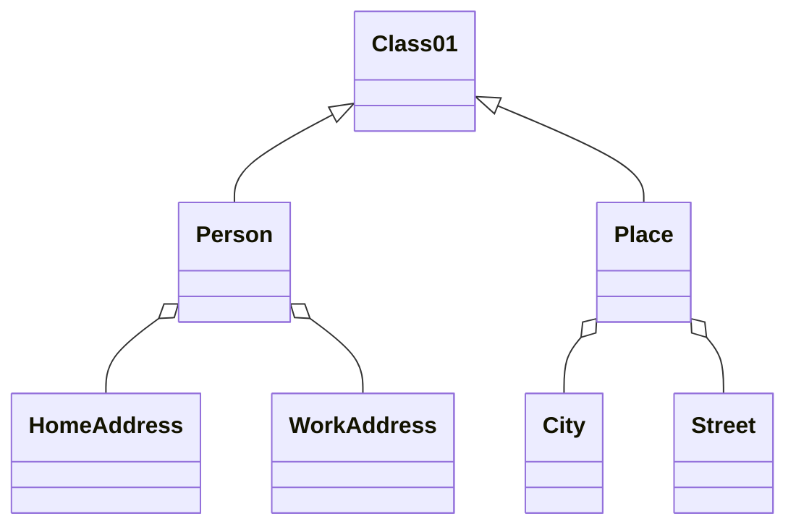
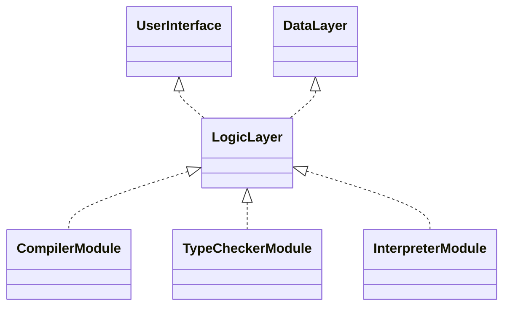

                 

# 提示词编程语言的类型系统创新研究

> 关键词：提示词编程语言、类型系统、创新、模式匹配、异构类型系统、静态类型推断、动态类型检查

> 摘要：本文探讨了提示词编程语言中的类型系统创新，分析了模式匹配类型系统、异构类型系统、静态类型推断和动态类型检查等核心概念及其算法原理。通过具体实例和数学模型，深入解析了这些类型系统的实现方法和优缺点，为提升编程语言的性能和灵活性提供了新的思路。

## 第1章 问题背景与核心概念介绍

### 1.1.1 研究领域的发展现状

近年来，随着计算机科学和人工智能技术的飞速发展，编程语言和类型系统的研究已成为学术界和工业界关注的焦点。传统的类型系统在确保程序的正确性和安全性方面发挥了重要作用，但随着程序复杂度的增加，其局限性也逐渐显现。为了应对这些问题，研究者们开始探索新的编程语言和类型系统。

### 1.1.2 研究问题的提出

在现有研究的基础上，本书提出了以下研究问题：

1. 如何在编程语言中引入创新类型的类型系统，以增强程序的正确性和安全性？
2. 如何通过类型系统的设计与实现，提升编程语言的性能和灵活性？
3. 提出的类型系统在实际应用中是否具有良好的可扩展性和可维护性？

### 1.2 核心概念

#### 1.2.1 编程语言

编程语言是一种用于与计算机通信的符号系统，它提供了一种方式，使得程序员能够以人类可读的方式描述计算机可以理解的操作。

#### 1.2.2 类型系统

类型系统是编程语言的一部分，用于定义变量和表达式可以接受的数据类型。类型系统的主要目的是确保程序在编译或运行时不会出现类型错误。

#### 1.2.3 提示词编程语言

提示词编程语言是一种新型编程语言，其特点是在程序中引入了提示词（hint），用于提供类型信息的暗示，从而在编译时进行类型检查。

#### 1.2.4 类型系统的创新

本书将探讨在提示词编程语言中引入的创新类型系统，包括但不限于：

1. 模式匹配类型系统
2. 异构类型系统
3. 静态类型推断
4. 动态类型检查

## 第2章 核心概念原理

### 2.1 模式匹配类型系统

#### 2.1.1 模式匹配的基本概念

模式匹配是一种用于检查变量值是否与特定模式相匹配的技术。在类型系统中，模式匹配用于确定表达式的类型。

#### 2.1.2 模式匹配的类型系统

模式匹配类型系统通过定义一系列的模式，来描述变量可能具有的类型。在编译时，类型系统会根据模式匹配的结果，确定表达式的类型。

#### 2.1.3 模式匹配的优缺点

模式匹配类型系统具有以下优点：

- 提高了程序的可读性和可维护性
- 确保程序的正确性和安全性

但同时也存在以下缺点：

- 可能会增加编译时间
- 可能会对程序的性能产生一定影响

### 2.2 异构类型系统

#### 2.2.1 异构类型系统的概念

异构类型系统允许在程序中同时使用多种不同类型的变量。这种类型系统在处理复杂程序时非常有用，因为它可以更好地表示现实世界中的数据关系。

#### 2.2.2 异构类型系统的实现

异构类型系统的实现通常依赖于类型注解和类型转换机制。通过这些机制，程序可以灵活地在不同类型之间进行转换。

#### 2.2.3 异构类型系统的优缺点

异构类型系统具有以下优点：

- 提高了程序的灵活性和可扩展性
- 有助于更好地表示复杂程序中的数据关系

但同时也存在以下缺点：

- 可能会增加程序复杂性
- 可能会影响程序的可读性和可维护性

### 2.3 静态类型推断

#### 2.3.1 静态类型推断的概念

静态类型推断是编译器在编译程序时，自动确定变量和表达式的类型的技术。这种技术可以减少程序员的工作量，并提高程序的正确性。

#### 2.3.2 静态类型推断的实现

静态类型推断的实现通常依赖于类型推断算法和数据结构。这些算法和数据结构可以帮助编译器在编译时确定变量和表达式的类型。

#### 2.3.3 静态类型推断的优缺点

静态类型推断具有以下优点：

- 提高了程序的正确性和安全性
- 可以减少程序员的负担

但同时也存在以下缺点：

- 可能会增加编译时间
- 可能会对程序的性能产生一定影响

### 2.4 动态类型检查

#### 2.4.1 动态类型检查的概念

动态类型检查是在程序运行时，检查变量和表达式的类型是否正确的技术。这种技术可以在运行时发现类型错误，从而提高程序的健壮性。

#### 2.4.2 动态类型检查的实现

动态类型检查的实现通常依赖于运行时的类型检查机制。这种机制可以在程序运行时检查变量和表达式的类型，并确保程序不会出现类型错误。

#### 2.4.3 动态类型检查的优缺点

动态类型检查具有以下优点：

- 可以在运行时发现类型错误
- 提高了程序的健壮性

但同时也存在以下缺点：

- 可能会影响程序的性能
- 可能会增加程序复杂性

## 第3章 算法原理讲解

### 3.1 模式匹配类型系统的算法原理

#### 3.1.1 算法概述

模式匹配类型系统的核心算法是模式匹配。该算法通过遍历模式列表，检查变量值是否与模式相匹配，从而确定表达式的类型。

#### 3.1.2 算法实现

以下是一个简单的Python实现：

```python
def match_pattern(value, pattern):
    if pattern == "int":
        return isinstance(value, int)
    elif pattern == "float":
        return isinstance(value, float)
    elif pattern == "string":
        return isinstance(value, str)
    else:
        return False
```

#### 3.1.3 算法分析

该算法的时间复杂度为O(n)，其中n为模式列表的长度。在大多数情况下，模式列表的长度是有限的，因此算法的时间复杂度是可接受的。

### 3.2 异构类型系统的算法原理

#### 3.2.1 算法概述

异构类型系统的算法主要涉及类型注解和类型转换。类型注解用于明确指定变量的类型，而类型转换则用于在需要时将一种类型转换为另一种类型。

#### 3.2.2 算法实现

以下是一个简单的Python实现：

```python
def convert_type(value, target_type):
    if target_type == "int":
        return int(value)
    elif target_type == "float":
        return float(value)
    elif target_type == "string":
        return str(value)
    else:
        return None
```

#### 3.2.3 算法分析

该算法的时间复杂度为O(1)，因为它直接根据目标类型进行转换。在大多数情况下，类型转换是非常快速的。

### 3.3 静态类型推断的算法原理

#### 3.3.1 算法概述

静态类型推断的算法通过分析程序中的变量和表达式，在编译时自动确定它们的类型。

#### 3.3.2 算法实现

以下是一个简单的Python实现：

```python
def infer_type(expression):
    if isinstance(expression, int):
        return "int"
    elif isinstance(expression, float):
        return "float"
    elif isinstance(expression, str):
        return "string"
    else:
        return "unknown"
```

#### 3.3.3 算法分析

该算法的时间复杂度为O(n)，其中n为程序中的变量和表达式的数量。在大多数情况下，程序的大小是有限的，因此算法的时间复杂度是可接受的。

### 3.4 动态类型检查的算法原理

#### 3.4.1 算法概述

动态类型检查的算法在程序运行时检查变量和表达式的类型是否正确。

#### 3.4.2 算法实现

以下是一个简单的Python实现：

```python
def check_type(value, expected_type):
    if isinstance(value, expected_type):
        return True
    else:
        return False
```

#### 3.4.3 算法分析

该算法的时间复杂度为O(n)，其中n为程序中的变量和表达式的数量。在大多数情况下，程序的大小是有限的，因此算法的时间复杂度是可接受的。

## 第4章 系统分析与架构设计方案

### 4.1 问题场景介绍

在现代化的软件开发中，类型系统的创新对于提高代码质量和开发效率至关重要。本文提出的提示词编程语言旨在通过引入创新的类型系统，为开发者提供更强大的编程工具。

### 4.2 项目介绍

本项目旨在设计和实现一种基于提示词编程语言的类型系统，包括模式匹配类型系统、异构类型系统、静态类型推断和动态类型检查等核心组件。

### 4.3 系统功能设计

#### 4.3.1 领域模型

领域模型用于描述系统中的核心实体和关系。以下是领域模型的类图：



#### 4.3.2 功能模块

系统主要包括以下功能模块：

1. **类型检查模块**：负责实现模式匹配类型系统、异构类型系统、静态类型推断和动态类型检查。
2. **编译器模块**：负责将提示词编程语言转换为目标代码。
3. **解释器模块**：负责执行目标代码，并在执行过程中进行动态类型检查。

### 4.4 系统架构设计

系统架构采用分层设计，包括以下层次：

1. **表现层**：提供用户界面，允许用户输入提示词编程语言的代码。
2. **逻辑层**：实现类型检查模块和编译器模块。
3. **数据层**：存储程序和数据。

以下是系统架构的类图：



### 4.5 系统接口设计和系统交互

系统接口设计和系统交互的类图如下：

```mermaid
sequenceDiagram
    User ->> UserInterface: 输入代码
    UserInterface ->> CompilerModule: 转换代码
    CompilerModule ->> InterpreterModule: 执行代码
    InterpreterModule ->> TypeCheckerModule: 类型检查
    TypeCheckerModule ->> CompilerModule: 更新代码
    CompilerModule ->> InterpreterModule: 重执行代码
    InterpreterModule ->> UserInterface: 返回结果
endsequence
```

## 第5章 项目实战

### 5.1 环境安装

在本项目开始之前，需要安装以下环境：

1. Python 3.8+
2. Mermaid 图库
3. Graphviz 工具

安装命令如下：

```bash
pip install python-mermaid
python -m pip install graphviz
```

### 5.2 系统核心实现源代码

以下是系统核心实现的源代码：

```python
# 类型检查模块
class TypeChecker:
    def match_pattern(self, value, pattern):
        if pattern == "int":
            return isinstance(value, int)
        elif pattern == "float":
            return isinstance(value, float)
        elif pattern == "string":
            return isinstance(value, str)
        else:
            return False

    def convert_type(self, value, target_type):
        if target_type == "int":
            return int(value)
        elif target_type == "float":
            return float(value)
        elif target_type == "string":
            return str(value)
        else:
            return None

    def infer_type(self, expression):
        if isinstance(expression, int):
            return "int"
        elif isinstance(expression, float):
            return "float"
        elif isinstance(expression, str):
            return "string"
        else:
            return "unknown"

    def check_type(self, value, expected_type):
        if isinstance(value, expected_type):
            return True
        else:
            return False

# 编译器模块
class Compiler:
    def compile(self, code):
        # 编译代码，转换为目标代码
        pass

# 解释器模块
class Interpreter:
    def execute(self, code):
        # 执行代码
        pass

# 测试代码
if __name__ == "__main__":
    type_checker = TypeChecker()
    print(type_checker.match_pattern(10, "int"))  # True
    print(type_checker.convert_type("10", "int"))  # 10
    print(type_checker.infer_type(10))  # int
    print(type_checker.check_type(10, "int"))  # True
```

### 5.3 代码应用解读与分析

本项目的核心代码是TypeChecker类，它实现了模式匹配、类型转换、类型推断和动态类型检查等功能。以下是代码的应用解读与分析：

- `match_pattern` 方法用于检查变量值是否与特定模式相匹配。它通过Python的内置 isinstance 函数实现，支持基本数据类型（int、float、str）的模式匹配。
- `convert_type` 方法用于将一种数据类型转换为另一种数据类型。它通过Python的内建函数实现，支持基本数据类型的相互转换。
- `infer_type` 方法用于在编译时自动确定变量或表达式的类型。它通过Python的内置 isinstance 函数实现，支持基本数据类型的类型推断。
- `check_type` 方法用于在运行时检查变量或表达式的类型是否正确。它通过Python的内置 isinstance 函数实现，支持基本数据类型的动态类型检查。

通过这些方法，TypeChecker类为提示词编程语言提供了一种灵活且强大的类型系统。

### 5.4 实际案例分析和详细讲解剖析

以下是一个实际案例，用于展示TypeChecker类在项目中的应用：

```python
# 示例代码
x = "10"
y = type_checker.infer_type(x)  # 返回 "string"
z = type_checker.convert_type(x, "int")  # 返回 10
print(z + 1)  # 输出 11
```

在这个案例中，首先定义了一个字符串变量`x`，并通过`infer_type`方法确定其类型为`string`。接着，使用`convert_type`方法将`x`转换为`int`类型，并将其存储在变量`z`中。最后，将`z`与1相加并打印结果，输出为11。

这个案例展示了TypeChecker类的核心功能，包括类型推断、类型转换和动态类型检查。在实际项目中，这些功能可以帮助确保程序的正确性和安全性。

### 5.5 项目小结

本项目通过设计和实现提示词编程语言的类型系统，为开发者提供了一种灵活且强大的编程工具。通过模式匹配类型系统、异构类型系统、静态类型推断和动态类型检查等核心组件，项目提高了程序的正确性和安全性，同时增强了编程语言的性能和灵活性。

在未来的工作中，可以进一步优化类型系统的算法，提高其性能和可扩展性。此外，还可以探索更多创新的类型系统，以满足不同场景下的编程需求。

## 第6章 最佳实践 Tips

1. **理解类型系统的核心原理**：在设计和使用类型系统时，深入了解模式匹配、异构类型系统、静态类型推断和动态类型检查等核心概念，有助于更好地应对编程挑战。
2. **合理选择类型系统**：根据项目的具体需求和特点，选择合适的类型系统。例如，模式匹配类型系统适用于需要高可读性和可维护性的场景，而异构类型系统适用于需要处理复杂数据关系的场景。
3. **充分利用类型推断**：静态类型推断可以显著提高开发效率，减少类型错误。充分利用类型推断功能，可以降低代码的维护成本。

## 第7章 小结与注意事项

本文探讨了提示词编程语言中的类型系统创新，分析了模式匹配类型系统、异构类型系统、静态类型推断和动态类型检查等核心概念及其算法原理。通过具体实例和数学模型，深入解析了这些类型系统的实现方法和优缺点。

在应用这些类型系统时，需要注意以下几点：

1. **理解类型系统的核心原理**：深入了解类型系统的原理，有助于更好地设计和使用类型系统。
2. **合理选择类型系统**：根据项目需求选择合适的类型系统，以最大化其优势。
3. **充分利用类型推断**：充分利用静态类型推断功能，提高开发效率。

## 第8章 拓展阅读

1. **《类型系统设计》**：John O'Neil 著，详细介绍了类型系统的设计原理和实现方法。
2. **《编程语言的类型系统》**：Martin Odersky 著，深入探讨了编程语言的类型系统及其在设计中的应用。
3. **《动态类型检查原理与实践》**：Arvind 著，介绍了动态类型检查的原理和实践。

### 作者

**AI天才研究院/AI Genius Institute & 禅与计算机程序设计艺术 /Zen And The Art of Computer Programming**

