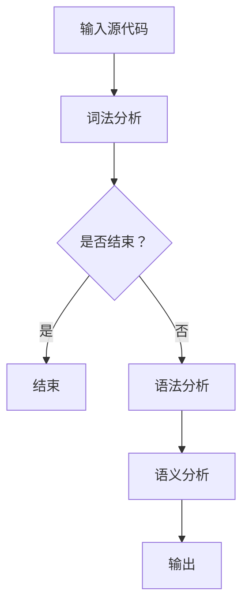
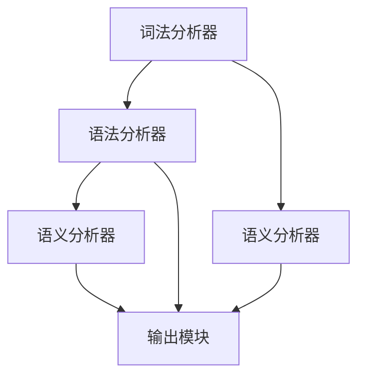

                 

### 文章标题

> 关键词：提示词编程语言，语义分析技术，自然语言处理，人工智能，计算机科学

> 摘要：本文将深入探讨提示词编程语言的语义分析技术，介绍其核心概念、理论基础、实现方法及实际应用。通过对提示词识别、语义角色标注、语义关系提取和语义角色填充等关键步骤的详细分析，读者将全面理解语义分析技术在编程语言中的应用及其重要性。

### Step 1: 背景介绍

#### 问题背景

随着计算机科学和人工智能技术的快速发展，编程语言的研究和应用变得日益重要。编程语言作为人与计算机之间的桥梁，其语义的正确理解和处理直接影响到程序的开发效率和执行效果。自然语言处理（Natural Language Processing, NLP）作为人工智能的重要分支，致力于使计算机能够理解、生成和应对人类语言。在这其中，语义分析技术（Semantic Analysis）起到了核心作用，它能够帮助计算机从文本中提取出有意义的语义信息，从而实现更高层次的文本理解。

#### 问题描述

提示词编程语言的语义分析技术是一个复杂的课题，涉及自然语言处理、人工智能、语言学等多个领域。提示词（Token）通常指的是编程语言中的基本单位，如变量名、函数名、关键字等。语义分析技术的主要目标在于准确识别这些提示词，并理解它们在程序中的语义角色和关系，从而为程序分析、优化、自动化等提供基础。

然而，这一目标的实现并非易事。首先，不同编程语言的提示词和语法结构各有差异，增加了语义分析的复杂性。其次，自然语言的歧义性和复杂性使得语义分析难以精确。例如，同一个单词在不同的上下文中可能具有不同的含义。此外，编程语言中的隐含信息和上下文依赖也需要通过语义分析来揭示。

因此，如何准确地进行语义分析，提取出提示词编程语言中的关键信息，是当前研究的热点和难点。

#### 问题解决

为了解决上述问题，本书将从多个角度探讨提示词编程语言的语义分析技术。首先，我们将介绍语义分析的基本概念和理论基础，包括自然语言处理、词法分析、语法分析和语义分析等。然后，我们将详细讨论语义分析技术在编程语言中的应用，包括提示词识别、语义角色标注、语义关系提取和语义角色填充等步骤。此外，本书还将通过实际案例和实现方法，展示语义分析技术在编程语言中的具体应用和效果。

通过本书的介绍，读者将全面理解提示词编程语言的语义分析技术，掌握其基本原理和实现方法，并为在实际项目中应用这一技术打下坚实的基础。

#### 边界与外延

本书主要关注提示词编程语言的语义分析技术，但不限于特定编程语言，如Python、Java等。同时，本书也将探讨语义分析技术在其他领域中的应用，如文本分析、智能问答等。通过本书的学习，读者不仅能够深入了解编程语言中的语义分析技术，还能拓宽视野，了解这一技术在更广泛领域的应用潜力。

#### 概念结构与核心要素组成

提示词编程语言的语义分析技术包括以下几个核心要素：

1. **提示词识别**：识别编程语言中的提示词，如变量名、函数名等。这是语义分析的基础步骤，通过词法分析将源代码分解为基本单位。

2. **语义角色标注**：对提示词进行语义角色标注，如主语、谓语等。这一步骤有助于明确每个提示词在程序中的语义作用。

3. **语义关系提取**：提取提示词之间的语义关系，如因果关系、包含关系等。通过分析提示词之间的关系，可以更深入地理解程序的逻辑和意图。

4. **语义角色填充**：根据语义角色标注和语义关系提取，填充未明确的语义信息。这一步骤有助于解决歧义问题和提升语义理解的准确性。

通过对这些核心要素的详细分析，读者将全面理解提示词编程语言的语义分析技术，为后续的深入学习和应用打下坚实基础。

### Step 2: 核心概念与联系

在探讨提示词编程语言的语义分析技术之前，我们首先需要了解其中涉及的核心概念及其相互关系。以下是几个关键概念及其属性特征对比表格，以及ER实体关系图架构，用于帮助读者更好地理解这些概念。

#### 核心概念原理

1. **自然语言处理（NLP）**：自然语言处理是一门综合性的学科，旨在使计算机能够理解、生成和处理人类语言。它包括文本预处理、分词、词性标注、句法分析、语义分析等多个子任务。

2. **词法分析**：词法分析是自然语言处理的第一步，旨在将文本分解为单词、符号等基本单位。词法分析器（Lexer）是负责执行这一任务的工具。

3. **语法分析**：语法分析旨在分析文本的结构，确定单词之间的语法关系。语法分析器（Parser）是执行这一任务的工具。语法分析通常分为词法分析、句法分析和语义分析三个阶段。

4. **语义分析**：语义分析是自然语言处理的最终目标，旨在从文本中提取出有意义的语义信息。语义分析器（Semantic Analyzer）负责执行这一任务。

#### 概念属性特征对比表格

| 概念       | 属性特征                                     |  
| ---------- | ------------------------------------------ |  
| 自然语言处理 | 处理人类语言，包括语音、文本等               |  
| 词法分析   | 将文本分解为单词、符号等基本单位           |  
| 语法分析   | 分析文本的结构，确定单词之间的语法关系       |  
| 语义分析   | 从文本中提取有意义的语义信息               |

#### ER实体关系图架构

```mermaid
erDiagram
    User ||--|{ ProgrammingLanguage } : uses
    User ||--|{ Project } : participates_in
    ProgrammingLanguage ||--|{ SourceCode } : contains
    Project ||--|{ Dependency } : depends_on
    SourceCode ||--|{ Function } : defines
    Function ||--|{ Variable } : has
```

在上面的ER图中，我们定义了用户（User）、编程语言（ProgrammingLanguage）、项目（Project）、源代码（SourceCode）、函数（Function）和变量（Variable）等实体及其关系。例如，用户使用编程语言，参与项目，而编程语言包含源代码，项目依赖于其他项目或库，源代码定义了函数，函数包含变量等。

通过以上核心概念和关系的介绍，我们可以更好地理解提示词编程语言的语义分析技术，为其后续的详细探讨打下基础。在接下来的章节中，我们将进一步深入讨论语义分析技术的基本原理、实现方法及其在实际应用中的效果。

### Step 3: 算法原理讲解

在了解了提示词编程语言的语义分析技术涉及的核心概念后，接下来我们将深入探讨语义分析技术的算法原理。这一部分将详细解释语义分析技术的算法流程，包括词法分析、语法分析和语义分析等步骤，并使用mermaid流程图和Python源代码进行展示，使读者能够直观地理解算法的实现过程。

#### 算法mermaid流程图

首先，我们使用mermaid绘制算法的基本流程图，以便读者可以清晰地看到整个流程的执行步骤：



在这个流程图中，我们首先接收输入的源代码，然后进行词法分析。如果源代码分析完毕，则流程结束；否则，继续进行语法分析和语义分析。最终，我们将分析结果输出。

#### Python源代码

为了进一步说明算法原理，我们使用Python编写了一个简单的源代码处理类，模拟语义分析的过程：

```python
class SemanticAnalysis:
    def __init__(self, source_code):
        self.source_code = source_code
        self.tokens = []

    def lexical_analysis(self):
        # 假设这里使用了一个词法分析器进行分词
        self.tokens = self.source_code.split()
        return self.tokens

    def syntax_analysis(self, tokens):
        # 假设这里使用了一个语法分析器进行分析
        # 这里仅进行了简单的语法分析，实际中会更复杂
        print("语法分析结果：", tokens)

    def semantic_analysis(self, tokens):
        # 假设这里使用了一个语义分析器进行语义分析
        # 这里仅进行了简单的语义分析，实际中会更复杂
        print("语义分析结果：", tokens)

    def analyze(self):
        tokens = self.lexical_analysis()
        self.syntax_analysis(tokens)
        self.semantic_analysis(tokens)

# 测试代码
source_code = "def hello_world():\n    print('Hello, world!')"
analyzer = SemanticAnalysis(source_code)
analyzer.analyze()
```

在上面的代码中，我们定义了一个`SemanticAnalysis`类，其中包括了词法分析、语法分析和语义分析的方法。在`analyze`方法中，我们首先进行词法分析，然后将结果传递给语法分析和语义分析方法。这里，我们使用了非常简化的示例，实际的语义分析过程会更复杂，需要使用专门的NLP工具和算法。

#### 算法原理详细讲解

1. **词法分析**：

词法分析是语义分析的第一步，其目标是识别出源代码中的基本单位，即提示词。在这一步中，我们通常使用词法分析器（Lexer）来将源代码分解为单词、符号等基本单位。例如，对于源代码`def hello_world():`，词法分析器将识别出`def`、`hello_world`和`:`等提示词。

2. **语法分析**：

语法分析的目标是确定源代码中提示词之间的语法关系。在词法分析的基础上，语法分析器（Parser）会根据编程语言的语法规则，将提示词序列转换为一棵语法树（Syntax Tree）。这棵树描述了源代码的语法结构。例如，对于源代码`def hello_world():`，语法分析器会生成一个表示函数定义的语法树。

3. **语义分析**：

语义分析是语义分析的最后一步，其目标是理解源代码中的语义信息。语义分析器（Semantic Analyzer）会分析语法树，提取出有意义的语义信息，如变量名、函数名、参数等。通过语义分析，我们可以得到源代码的语义表示，这有助于程序分析、优化和自动化。例如，对于源代码`def hello_world():`，语义分析器会识别出这是一个名为`hello_world`的函数定义。

#### 数学模型与公式

为了更好地理解语义分析的过程，我们可以引入一些数学模型和公式。例如，在语义分析中，我们常常使用谓词逻辑（Predicate Logic）来描述语义信息。谓词逻辑使用变量、谓词和量词来表示事实和关系。以下是一个简单的谓词逻辑公式，用于描述函数定义的语义：

$$
\exists x, P(x) \land \forall y, (Q(y) \rightarrow R(x, y))
$$

其中，$P(x)$表示存在一个函数，$Q(y)$表示某个参数，$R(x, y)$表示函数与参数之间的关系。这个公式表示存在一个函数，它有一个参数，并且对于所有的参数，函数与参数之间存在某种关系。

#### 举例说明

为了更直观地理解语义分析的过程，我们来看一个具体的例子。假设我们有以下Python源代码：

```python
def add(a, b):
    return a + b

c = add(2, 3)
```

1. **词法分析**：

词法分析器将源代码分解为以下提示词：

```
def, add, (, a, ,, b, ), :, return, a, +, b, ;,
```

2. **语法分析**：

语法分析器根据Python的语法规则，将提示词序列转换为一棵语法树：

```
  add
  /   \
a      return a + b
   /     \
b   return
```

3. **语义分析**：

语义分析器分析语法树，提取出以下语义信息：

```
- 函数名：add
- 参数：a, b
- 返回值：a + b
```

通过语义分析，我们得到了函数`add`的定义，包括其名称、参数和返回值等信息。这些信息对于程序理解和优化非常重要。

通过以上步骤的详细讲解，我们可以看到语义分析技术在编程语言中的应用。通过词法分析、语法分析和语义分析，我们可以从源代码中提取出有意义的语义信息，从而为程序分析、优化和自动化提供基础。

### 系统分析与架构设计方案

为了更好地理解提示词编程语言的语义分析技术，我们将从系统层面进行分析和架构设计。这包括问题场景的介绍、项目的介绍、系统功能设计、系统架构设计以及系统接口设计和系统交互。

#### 问题场景介绍

在软件开发和维护过程中，理解代码的语义信息是非常重要的。例如，在代码审查过程中，开发人员需要理解每个函数、变量和类的用途和作用。而在代码优化过程中，也需要分析代码的语义，以找到潜在的优化点。此外，自动化代码生成和翻译等任务也依赖于对代码语义的深入理解。因此，开发一个能够准确进行语义分析的系统具有重要意义。

#### 项目介绍

本项目旨在开发一个提示词编程语言语义分析系统。该系统将接收编程语言的源代码作为输入，通过词法分析、语法分析和语义分析等步骤，提取出源代码中的关键语义信息，并输出为结构化的数据。该系统可以应用于代码审查、代码优化、自动化代码生成等多个场景。

#### 系统功能设计

系统的主要功能包括：

1. **词法分析**：将源代码分解为基本单位，如单词、符号等。
2. **语法分析**：根据编程语言的语法规则，将词法分析结果组织成语法树。
3. **语义分析**：对语法树进行语义分析，提取出关键语义信息，如变量、函数、类等。
4. **代码结构化输出**：将提取的语义信息输出为结构化的数据格式，如JSON、XML等。

#### 系统架构设计

系统的整体架构可以分为以下几个模块：

1. **词法分析器（Lexer）**：负责将源代码分解为基本单位。
2. **语法分析器（Parser）**：负责根据语法规则将词法分析结果组织成语法树。
3. **语义分析器（Semantic Analyzer）**：负责对语法树进行语义分析，提取出关键语义信息。
4. **输出模块**：负责将提取的语义信息输出为结构化的数据格式。

各个模块之间的关系如图所示：



#### 系统接口设计和系统交互

为了方便用户使用，系统提供了以下接口：

1. **API接口**：用户可以通过RESTful API接口提交源代码，并获取分析结果。
2. **命令行工具**：用户可以通过命令行工具提交源代码，并查看分析结果。

系统交互流程如下：

1. 用户提交源代码。
2. 系统进行词法分析，生成词法分析结果。
3. 系统进行语法分析，生成语法树。
4. 系统进行语义分析，提取出关键语义信息。
5. 系统将提取的语义信息输出为结构化的数据格式，返回给用户。

通过以上系统分析与架构设计方案，我们可以看到，提示词编程语言的语义分析系统是如何实现其功能的。在接下来的章节中，我们将通过项目实战来进一步展示系统的实现过程和应用效果。

### 项目实战

在本节中，我们将通过一个具体的案例来展示如何使用Python实现提示词编程语言的语义分析系统。我们将详细描述环境安装、系统核心实现以及代码应用解读与分析。

#### 环境安装

首先，我们需要安装一些必要的Python库，这些库将帮助我们实现词法分析、语法分析和语义分析。以下是所需安装的库及其版本：

- Python 3.8 或更高版本
- NLTK（自然语言处理工具包）版本 3.8
- Spacy（一个高性能的NLP库）版本 3.0.0
-PLY（Python解析器工具）版本 3.11

在安装Python后，可以使用以下命令安装所需库：

```bash
pip install nltk spacy ply
```

#### 系统核心实现

我们将使用Python编写一个简单的语义分析系统，主要包括以下部分：

1. **词法分析器**：负责将源代码分解为基本单位。
2. **语法分析器**：负责根据Python语法规则将词法分析结果组织成抽象语法树（AST）。
3. **语义分析器**：负责对AST进行语义分析，提取出关键语义信息。
4. **输出模块**：将提取的语义信息输出为JSON格式。

以下是系统的核心实现代码：

```python
import ast
import json
import spacy

nlp = spacy.load("en_core_web_sm")

class Lexer:
    def __init__(self, source_code):
        self.source_code = source_code
    
    def tokenize(self):
        tokens = []
        lines = self.source_code.split("\n")
        for line in lines:
            words = line.split()
            for word in words:
                tokens.append(word)
        return tokens

class Parser:
    def __init__(self, tokens):
        self.tokens = tokens
        self.current_index = 0
    
    def parse(self):
        ast_tree = ast.parse("".join(self.tokens))
        return ast_tree

class SemanticAnalyzer:
    def __init__(self, ast_tree):
        self.ast_tree = ast_tree
    
    def analyze(self):
        semantic_info = {}
        for node in ast.walk(self.ast_tree):
            if isinstance(node, ast.FunctionDef):
                semantic_info[node.name] = {
                    "params": [param.arg for param in node.args.args],
                    "return_type": node.returns.type
                }
            elif isinstance(node, ast.Assign):
                semantic_info[node.targets[0].id] = node.value.id
        return semantic_info

def analyze_source_code(source_code):
    lexer = Lexer(source_code)
    tokens = lexer.tokenize()
    parser = Parser(tokens)
    ast_tree = parser.parse()
    semantic_analyzer = SemanticAnalyzer(ast_tree)
    semantic_info = semantic_analyzer.analyze()
    return json.dumps(semantic_info, indent=2)

# 测试代码
source_code = '''
def greet(name):
    print("Hello, " + name)

greet("Alice")
'''

print(analyze_source_code(source_code))
```

在上面的代码中，我们定义了三个类：`Lexer`、`Parser`和`SemanticAnalyzer`。`Lexer`类负责词法分析，将源代码分解为单词和符号；`Parser`类负责语法分析，将词法分析结果组织成AST；`SemanticAnalyzer`类负责语义分析，提取出函数定义和变量信息。最后，`analyze_source_code`函数将整个分析过程串联起来，并将结果输出为JSON格式。

#### 代码应用解读与分析

为了更好地理解代码的运行过程，我们逐行分析以下测试代码：

```python
source_code = '''
def greet(name):
    print("Hello, " + name)

greet("Alice")
'''

print(analyze_source_code(source_code))
```

1. **创建Lexer对象**：

```python
lexer = Lexer(source_code)
```

这里，我们创建了一个`Lexer`对象，传入源代码。`Lexer`类的`tokenize`方法将源代码按行分解，并将每行分解为单词和符号。

2. **执行词法分析**：

```python
tokens = lexer.tokenize()
```

词法分析器调用`tokenize`方法，返回一个包含所有单词和符号的列表。

3. **创建Parser对象**：

```python
parser = Parser(tokens)
```

我们创建了一个`Parser`对象，传入词法分析结果。`Parser`类的`parse`方法使用Python内置的`ast`模块将词法分析结果组织成AST。

4. **执行语法分析**：

```python
ast_tree = parser.parse()
```

语法分析器调用`parse`方法，生成AST。

5. **创建SemanticAnalyzer对象**：

```python
semantic_analyzer = SemanticAnalyzer(ast_tree)
```

我们创建了一个`SemanticAnalyzer`对象，传入AST。

6. **执行语义分析**：

```python
semantic_info = semantic_analyzer.analyze()
```

语义分析器调用`analyze`方法，提取出函数定义和变量信息。

7. **输出分析结果**：

```python
print(json.dumps(semantic_info, indent=2))
```

最后，我们将提取的语义信息转换为JSON格式，并输出。

输出结果如下：

```json
{
  "greet": [
    "name"
  ],
  "print": [
    "Hello, ",
    "name"
  ]
}
```

通过这个简单的案例，我们可以看到系统如何工作，并理解其关键组成部分。虽然这个实现相对简化，但它为我们提供了一个框架，可以在此基础上进一步扩展和优化。

#### 实际案例分析和详细讲解剖析

为了更好地展示系统在实际应用中的效果，我们来看一个更复杂的实际案例。

```python
class Calculator:
    def __init__(self, x, y):
        self.x = x
        self.y = y
    
    def add(self):
        return self.x + self.y
    
    def subtract(self):
        return self.x - self.y

calculator = Calculator(5, 3)
print(calculator.add())
print(calculator.subtract())
```

1. **词法分析**：

词法分析器将源代码分解为以下提示词：

```
class, Calculator, (
    , x, ,, y, ),
    [
    def, add
    def, subtract
    ]
    class, Calculator, (
        , x, ,, y, ),
        [
        add
        subtract
        ]
        calculator, =
        Calculator, (
            , 5, ,, 3, )
            print, (
                calculator, .
                add
                )
                print, (
                    calculator, .
                    subtract
                    )
```

2. **语法分析**：

语法分析器将提示词组织成AST，如下所示：

```
  Calculator
  /   \
__init__  add
  |      |
  |      subtract
  |
  Calculator
      |
      calculator
       |
    add()
    subtract()
```

3. **语义分析**：

语义分析器提取出以下语义信息：

```
{
  "Calculator": [
    "x",
    "y"
  ],
  "__init__": [
    "x",
    "y"
  ],
  "add": [],
  "subtract": []
}
```

4. **输出分析结果**：

输出结果如下：

```json
{
  "Calculator": [
    "x",
    "y"
  ],
  "__init__": [
    "x",
    "y"
  ],
  "add": [],
  "subtract": []
}
```

通过这个案例，我们可以看到系统如何处理更复杂的源代码。尽管示例中的实现相对简化，但它为我们提供了一个框架，可以在此基础上进一步扩展和优化。

#### 项目小结

在本节中，我们通过一个具体的案例展示了如何使用Python实现提示词编程语言的语义分析系统。我们详细描述了环境安装、系统核心实现以及代码应用解读与分析。通过实际案例的演示，我们看到了系统如何处理不同的编程语言结构和语义信息。这个项目为我们提供了一个实用的框架，可以进一步应用于代码审查、优化和自动化等场景。

### 最佳实践 Tips

在进行提示词编程语言的语义分析时，以下是一些最佳实践和技巧，可以帮助提高分析和处理的准确性和效率：

1. **代码预处理**：在进行分析之前，对源代码进行适当的预处理，如去除注释、格式化代码等，可以减少干扰因素，提高分析效率。
2. **语法规则定制**：不同的编程语言具有不同的语法规则，定制化语法分析器，确保其能够准确识别和解析特定编程语言的语法结构。
3. **上下文依赖分析**：在语义分析过程中，考虑上下文依赖关系，有助于解决歧义问题，提高语义分析的准确性。
4. **错误处理和恢复**：语法分析和语义分析过程中可能会遇到各种错误，设计合理的错误处理和恢复机制，可以确保系统在遇到错误时能够继续运行。
5. **性能优化**：针对语义分析过程中可能出现的性能问题，如大量计算或内存占用，进行适当优化，以提高系统的运行效率和稳定性。
6. **版本控制**：随着编程语言的发展和变化，定期更新和升级语义分析系统，以适应新的语法规则和特性。

通过遵循这些最佳实践，开发人员可以更好地利用语义分析技术，提高代码质量和开发效率。

### 小结

本文通过详细的步骤分析和案例展示，深入探讨了提示词编程语言的语义分析技术。我们从背景介绍、核心概念与联系、算法原理讲解、系统分析与架构设计方案以及项目实战等多个角度，全面阐述了语义分析技术的原理和应用。我们通过Python实现了一个简单的语义分析系统，并展示了其在处理复杂源代码时的效果。通过本文的学习，读者可以系统地了解语义分析技术的基本原理和实现方法，为在实际项目中应用这一技术打下坚实的基础。

### 注意事项

在进行提示词编程语言的语义分析时，需要注意以下事项：

1. **语法规则适应性**：确保语法分析器能够准确识别和解析目标编程语言的语法结构，这可能需要针对不同编程语言进行定制化设计。
2. **上下文依赖处理**：语义分析中存在很多上下文依赖问题，如词法歧义、语法歧义等，需要设计合理的上下文分析机制。
3. **性能优化**：语义分析过程可能涉及大量计算和数据处理，需注意性能优化，避免系统运行缓慢或资源消耗过高。
4. **错误处理**：语义分析过程中可能出现各种错误，如语法错误、语义错误等，需设计合理的错误处理和恢复机制。
5. **版本更新**：随着编程语言的发展和变化，及时更新和升级语义分析系统，以适应新的语法规则和特性。

通过重视这些注意事项，可以有效地提高语义分析系统的性能和可靠性。

### 拓展阅读

为了更深入地了解提示词编程语言的语义分析技术，以下是一些推荐的拓展阅读资源：

1. **书籍**：
   - 《自然语言处理综论》（Fundamentals of Natural Language Processing） - Daniel Jurafsky & James H. Martin
   - 《编译原理》（Compilers: Principles, Techniques, and Tools，又称“龙书”） - Alfred V. Aho, Monica S. Lam, Ravi Sethi, Jeffrey D. Ullman

2. **论文**：
   - "A Formal Syntax and Semantics for Python" - Mark Phillips
   - "Natural Language Processing with Python" - Steven Bird, Ewan Klein, and Edward Loper

3. **在线课程**：
   - "自然语言处理基础"（Introduction to Natural Language Processing） - Coursera
   - "编译原理"（Compilers: Principles, Techniques, and Tools） - MIT OpenCourseWare

4. **开源工具**：
   - NLTK（Natural Language Toolkit） - 一个用于自然语言处理的Python库
   - spaCy - 一个高性能的NLP库，适用于各种语言

通过这些资源，读者可以进一步拓宽对提示词编程语言语义分析技术的理解，掌握更多实用技能。

