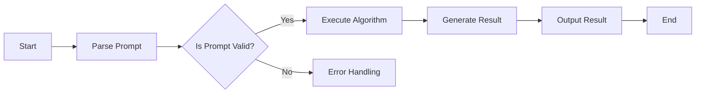
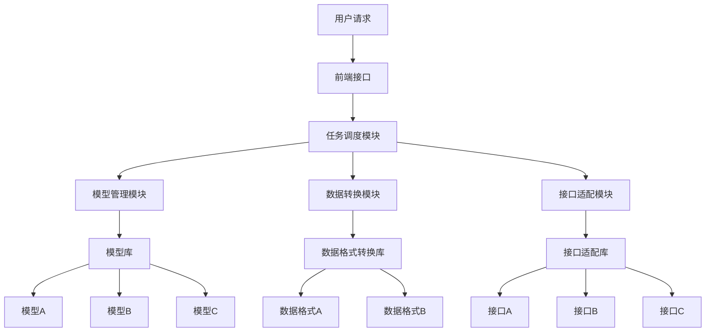
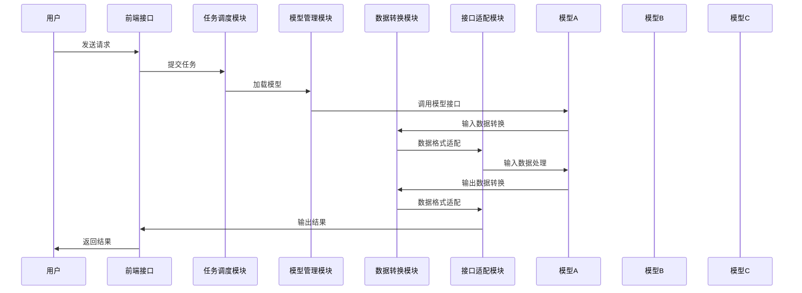

                 

# 提示词编程语言的跨模型兼容性

> 关键词：提示词编程语言、跨模型兼容性、异构性、标准化、算法移植

> 摘要：
本文旨在探讨提示词编程语言的跨模型兼容性。随着人工智能技术的快速发展，提示词编程语言成为连接用户与智能系统的重要桥梁。然而，不同模型之间的兼容性问题日益突出，本文将深入分析其背景、重要性、技术挑战及解决方案，旨在为提升跨模型兼容性提供指导。

----------------------------------------------------------------

## 第1章 引言

### 1.1 问题背景

提示词编程语言，作为一种新兴的编程范式，正逐渐在人工智能领域崭露头角。它们通过自然语言交互的方式，让非专业的用户也能够与复杂的人工智能系统进行有效沟通。然而，当前提示词编程语言面临着显著的挑战。

首先，现有的提示词编程语言种类繁多，不同的语言有着各自的语法和语义，导致编程生态的异构性。这种异构性不仅增加了学习和使用的难度，而且在不同语言之间进行程序移植时也遇到了诸多障碍。

其次，随着人工智能技术的不断发展，越来越多的模型被应用于各种场景，这些模型往往具有不同的架构和数据格式。如何在不同的模型之间实现有效的兼容性，成为一个亟待解决的问题。

因此，跨模型兼容性成为提示词编程语言发展中的一个关键问题。它不仅关乎用户体验和开发效率，也直接影响到人工智能系统的普及和应用。

### 1.2 问题描述

跨模型兼容性的问题主要体现在以下几个方面：

1. **语法和语义差异**：不同的提示词编程语言有着不同的语法和语义规则，这使得程序在不同的语言之间难以移植。

2. **数据格式不统一**：不同模型产生的数据格式各异，导致数据在模型之间的传输和处理变得复杂。

3. **接口调用不兼容**：不同模型的API接口设计可能不一致，导致程序在不同模型之间的调用过程中可能出现问题。

4. **性能和效率问题**：跨模型兼容性可能带来额外的性能开销，影响系统的响应速度和效率。

综上所述，跨模型兼容性的问题不仅影响到提示词编程语言的发展，也对整个人工智能系统的可维护性和可扩展性提出了挑战。

### 1.3 问题解决

为了解决跨模型兼容性问题，我们需要从以下几个方面进行探讨：

1. **标准化**：制定统一的语法和语义标准，以减少不同语言之间的差异，提高程序的移植性。

2. **数据格式转换**：开发数据格式转换工具，确保不同模型产生的数据能够在不同语言之间无缝传输。

3. **接口适配**：设计统一的API接口标准，减少跨模型调用时的不兼容问题。

4. **性能优化**：通过算法优化和硬件加速等技术手段，降低跨模型兼容性带来的性能开销。

### 1.4 边界与外延

跨模型兼容性的适用范围主要涉及以下几个方面：

1. **异构计算环境**：在多核、多处理器、分布式系统等异构计算环境中，实现不同模型之间的兼容性。

2. **不同编程语言**：在多种提示词编程语言之间实现程序的兼容性。

3. **不同算法模型**：在多种人工智能算法模型之间实现数据的无缝交互。

不兼容场景的分析与应对：

1. **兼容性问题定位**：通过调试和日志分析，定位跨模型兼容性中的具体问题。

2. **逐步优化**：针对具体的不兼容场景，逐步进行优化，提高系统的兼容性。

### 1.5 概念结构与核心要素组成

提示词编程语言的基本概念包括提示词、模型和算法等。跨模型兼容性的核心要素包括：

1. **语法标准化**：确保不同语言之间的语法兼容。

2. **数据格式统一**：确保不同模型之间的数据格式兼容。

3. **接口标准化**：确保不同模型之间的API接口兼容。

4. **算法移植性**：确保算法在不同模型之间能够高效运行。

----------------------------------------------------------------

## 第2章 提示词编程语言基础

### 2.1 提示词编程语言概述

提示词编程语言是一种以自然语言为输入的编程范式，它允许用户使用自然语言描述算法和数据处理过程。这种编程范式在人工智能领域具有广泛的应用前景，因为它能够降低编程门槛，让非专业用户也能够轻松地与智能系统进行交互。

#### 提示词编程语言的定义

提示词编程语言的核心是“提示词”，它是一种特殊的文本输入，用于描述算法的逻辑和数据处理过程。与传统的编程语言不同，提示词编程语言通常不需要用户具备深入的编程知识，只需输入自然的语言描述即可。

#### 提示词编程语言的发展历程

提示词编程语言起源于人工智能领域，最早的尝试可以追溯到20世纪80年代。随着自然语言处理技术的不断发展，提示词编程语言逐渐成熟。近年来，随着深度学习和自然语言处理技术的飞速进步，提示词编程语言在人工智能应用中得到了越来越广泛的应用。

### 2.2 提示词编程语言的核心特性

提示词编程语言具有以下核心特性：

#### 1. 自然语言交互

提示词编程语言允许用户使用自然语言进行编程，这使得编程变得更加直观和易于理解。用户可以像与朋友交流一样，输入提示词来描述算法的逻辑。

#### 2. 高度抽象

提示词编程语言能够将复杂的算法和数据结构高度抽象为简单的自然语言描述，这使得编程变得更加简洁和高效。例如，用户可以使用简单的提示词来描述复杂的机器学习模型训练过程。

#### 3. 代码生成

提示词编程语言可以将用户的自然语言描述转换为实际的可执行代码。这种代码生成能力大大提高了编程的效率，也降低了编程的复杂性。

#### 4. 智能补全

提示词编程语言通常具备智能补全功能，可以根据用户的输入自动完成剩余的部分。这种功能不仅提高了编程的效率，还减少了编程错误的可能性。

### 2.3 提示词编程语言的应用场景

提示词编程语言在以下场景中具有显著的应用价值：

#### 1. 人工智能与机器学习

提示词编程语言可以用于构建和训练各种机器学习模型，特别是深度学习模型。通过自然语言描述，用户可以方便地调整模型的参数和训练过程，从而提高模型的性能。

#### 2. 自动化与智能控制

提示词编程语言可以用于自动化和智能控制系统的开发。用户可以使用自然语言描述控制逻辑，从而实现复杂的自动化任务。

#### 3. 数据分析

提示词编程语言可以用于数据分析任务，用户可以使用自然语言描述数据处理和分析过程，从而快速获得结果。

### 2.4 案例分析

#### 案例一：智能客服系统

智能客服系统是提示词编程语言的一个重要应用场景。通过提示词编程语言，用户可以轻松地创建和训练智能客服机器人，使其能够与用户进行自然语言交互，提供高质量的客服服务。

#### 案例二：智能家居控制

智能家居控制系统可以使用提示词编程语言来实现复杂的控制逻辑。用户可以通过简单的自然语言描述，控制家中的各种智能设备，实现自动化和智能化。

#### 案例三：机器学习模型训练

提示词编程语言可以用于机器学习模型的训练和调优。用户可以使用自然语言描述模型的训练过程，从而方便地调整模型参数，提高模型的性能。

通过以上案例分析，我们可以看到提示词编程语言在人工智能、自动化和数据分析等领域的广泛应用。随着技术的不断进步，提示词编程语言将继续发挥其重要作用，推动人工智能技术的发展。

----------------------------------------------------------------

## 第3章 跨模型兼容性原理

### 3.1 跨模型兼容性概述

跨模型兼容性指的是在不同的模型之间实现数据和代码的无缝交互，以便用户能够方便地使用和整合多种人工智能模型。这种兼容性对于促进人工智能技术的广泛应用和生态系统的发展至关重要。

#### 跨模型兼容性的概念

跨模型兼容性主要包括以下几个方面：

1. **数据兼容性**：确保不同模型能够处理和交换相同的数据格式。
2. **代码兼容性**：保证同一程序在不同模型上能够编译和执行。
3. **接口兼容性**：确保不同模型的API接口能够互相调用，提供一致的服务。

#### 跨模型兼容性的目的

跨模型兼容性的目的是：

1. **简化集成**：减少不同模型之间的集成难度，提高开发效率。
2. **提高灵活性**：允许用户根据需求和场景选择最适合的模型，而不受限于模型的兼容性问题。
3. **促进创新**：通过跨模型兼容性，鼓励开发者和研究者探索新的算法和模型，推动人工智能技术的发展。

### 3.2 跨模型兼容性技术

实现跨模型兼容性需要一系列技术和策略。以下是一些关键的技术手段：

#### 1. 代码移植与迁移

代码移植与迁移是指将一个模型上的代码转移到另一个模型上，使其能够在新的模型上正常运行。这通常涉及以下几个方面：

1. **代码转换**：将一种编程语言的代码转换为另一种编程语言的代码。
2. **库和框架适配**：确保使用的库和框架在不同模型上兼容。
3. **API适配**：调整代码以适应不同模型的API接口。

#### 2. 接口标准化与协议适配

接口标准化与协议适配是跨模型兼容性的关键。以下是一些常见的接口标准化和协议适配技术：

1. **标准化API接口**：定义统一的API接口标准，使得不同模型能够使用相同的接口进行通信。
2. **协议转换**：将一种通信协议转换为另一种协议，以便不同模型之间的数据交换。
3. **中间件**：使用中间件来处理不同模型之间的数据传输和接口调用，提供统一的接口和服务。

#### 3. 数据格式转换

数据格式转换是跨模型兼容性的重要组成部分。以下是一些常见的数据格式转换技术：

1. **序列化与反序列化**：将数据从一种格式转换为另一种格式，例如，将JSON数据转换为XML数据。
2. **数据格式映射**：定义不同数据格式之间的映射关系，使得数据能够在不同模型之间无缝传输。
3. **数据清洗与预处理**：在数据传输前对数据进行清洗和预处理，确保数据的一致性和准确性。

### 3.3 跨模型兼容性的挑战

尽管跨模型兼容性具有重要的意义，但其实际实现过程中面临着诸多挑战：

#### 1. 技术实现上的难点

1. **异构性**：不同模型具有不同的架构和功能，这使得实现跨模型兼容性变得复杂。
2. **性能开销**：跨模型兼容性可能带来额外的计算和通信开销，影响系统的性能。
3. **兼容性问题定位**：跨模型兼容性中的问题可能涉及到多个方面，定位和修复这些问题需要深入的技术分析。

#### 2. 用户体验与可维护性

1. **用户体验**：跨模型兼容性可能影响用户体验，如性能下降、响应时间延长等。
2. **可维护性**：跨模型兼容性增加了系统的复杂度，使得系统的维护和升级变得更加困难。

#### 3. 标准化问题

1. **缺乏统一标准**：目前缺乏统一的跨模型兼容性标准，这使得不同开发者和组织在实现兼容性时存在不一致性。
2. **标准制定难度**：制定统一的跨模型兼容性标准需要综合考虑多种因素，包括技术实现、用户体验和生态系统的需求。

### 3.4 跨模型兼容性的解决方案

为了克服跨模型兼容性面临的挑战，我们可以采取以下解决方案：

#### 1. 技术手段

1. **模块化开发**：将跨模型兼容性的功能模块化，使得不同模块可以独立开发、测试和部署。
2. **中间件技术**：使用中间件技术来处理不同模型之间的数据传输和接口调用，提供统一的接口和服务。
3. **自动化工具**：开发自动化工具来简化跨模型兼容性的实现过程，如代码生成器、数据格式转换工具等。

#### 2. 用户体验优化

1. **渐进式增强**：逐步优化跨模型兼容性的用户体验，如通过性能优化和接口简化来减少用户的感知延迟。
2. **用户培训**：提供用户培训材料，帮助用户了解跨模型兼容性的工作原理和使用方法。

#### 3. 标准化与协作

1. **制定标准**：推动跨模型兼容性的标准化工作，制定统一的接口和协议标准。
2. **协作与共享**：鼓励开发者和组织之间的协作与共享，共同解决跨模型兼容性问题。

通过以上解决方案，我们可以逐步克服跨模型兼容性面临的挑战，实现不同模型之间的无缝交互，推动人工智能技术的广泛应用和生态系统的健康发展。

----------------------------------------------------------------

## 第4章 核心概念与联系

### 4.1 提示词编程语言的核心概念

在本章节中，我们将详细讨论提示词编程语言的核心概念，包括提示词、模型、算法等。

#### 1. 提示词

提示词是提示词编程语言中的基本元素，它是一种用自然语言描述的文本输入，用于指导智能系统执行特定任务。提示词可以是简单的命令，如“显示今天的天气”，也可以是复杂的任务描述，如“请根据用户的历史行为推荐商品”。提示词编程语言的核心价值在于让用户能够以自然的方式与智能系统进行交互。

#### 2. 模型

模型是提示词编程语言中用于执行特定任务的核心组件。模型通常是由大量数据和算法训练而成的，它们可以识别模式、预测结果或执行其他复杂操作。常见的模型包括机器学习模型、深度学习模型和自然语言处理模型等。在提示词编程语言中，模型通过接收提示词并执行相应的任务来响应用户请求。

#### 3. 算法

算法是模型中的核心逻辑，用于处理数据和执行任务。算法可以是简单的排序算法，也可以是复杂的深度学习算法。在提示词编程语言中，算法通过分析提示词并生成相应的输出，从而实现智能系统的任务执行。不同的算法适用于不同的任务场景，如分类、回归、聚类等。

### 4.2 概念属性特征对比表格

为了更清晰地理解提示词编程语言的核心概念，我们提供了以下对比表格，展示了提示词、模型和算法的主要属性特征。

| 概念     | 定义                                                         | 主要属性特征                                                 |
|----------|--------------------------------------------------------------|--------------------------------------------------------------|
| 提示词   | 用户输入的自然语言描述，用于指导智能系统执行任务。             | - 文本格式<br>- 自然语言特性<br>- 任务导向                   |
| 模型     | 由数据和算法训练而成的组件，用于执行特定任务。                   | - 数据依赖<br>- 算法逻辑<br>- 预测能力                       |
| 算法     | 用于处理数据和执行任务的逻辑规则。                               | - 算法类型（分类、回归、聚类等）<br>- 复杂度<br>- 性能指标   |

### 4.3 ER实体关系图架构

为了更好地描述提示词编程语言与模型的实体关系，我们使用ER（实体关系）图进行展示。

```mermaid
erDiagram
  User ||--o> Prompt : 发起任务的实体
  Prompt ||--o> Model : 处理任务的实体
  Model ||--o> Algorithm : 执行任务的算法
  Algorithm ||--o> Result : 输出结果
```

在这个ER图中，用户（User）发起提示词（Prompt），提示词触发模型（Model）执行，模型中的算法（Algorithm）处理数据和任务，并最终生成结果（Result）。这个关系图清晰地展示了提示词编程语言中各实体之间的相互关系。

通过以上对核心概念、属性特征和实体关系的详细讨论，我们为读者提供了一个全面的理解，有助于深入掌握提示词编程语言的工作原理和应用场景。

----------------------------------------------------------------

## 第5章 算法原理讲解

### 5.1 算法mermaid流程图

为了更好地理解提示词编程语言中的算法原理，我们使用mermaid绘制了一个流程图，展示了算法的基本执行流程。



在这个流程图中，算法的执行过程可以分为以下几个步骤：

1. **开始（Start）**：算法从启动开始。
2. **解析提示词（Parse Prompt）**：算法接收用户输入的提示词，并对其进行解析。
3. **提示词有效性检查（Is Prompt Valid?）**：检查提示词是否有效，即是否符合算法的输入要求。
4. **执行算法（Execute Algorithm）**：如果提示词有效，算法将执行具体的计算和处理过程。
5. **生成结果（Generate Result）**：算法执行完毕后，生成相应的结果。
6. **输出结果（Output Result）**：将结果输出给用户。
7. **结束（End）**：算法执行结束。

### 5.2 Python源代码详细阐述

以下是一个简单的Python源代码示例，用于展示算法的实现细节。

```python
def execute_algorithm(prompt):
    # 解析提示词
    parsed_prompt = parse_prompt(prompt)
    
    # 检查提示词有效性
    if not is_valid_prompt(parsed_prompt):
        raise ValueError("Invalid prompt")
    
    # 执行算法
    result = algorithm_execution(parsed_prompt)
    
    # 生成结果
    formatted_result = format_result(result)
    
    # 输出结果
    print(formatted_result)

# 解析提示词函数
def parse_prompt(prompt):
    # 具体实现根据提示词格式而定
    return prompt

# 提示词有效性检查函数
def is_valid_prompt(parsed_prompt):
    # 具体实现根据提示词要求而定
    return True

# 算法执行函数
def algorithm_execution(parsed_prompt):
    # 具体实现根据算法逻辑而定
    return "Result"

# 结果格式化函数
def format_result(result):
    # 具体实现根据结果格式而定
    return result

# 主函数
if __name__ == "__main__":
    prompt = input("请输入提示词：")
    try:
        execute_algorithm(prompt)
    except ValueError as e:
        print(e)
```

在这个示例中，我们定义了一个名为`execute_algorithm`的函数，用于执行整个算法流程。该函数首先调用`parse_prompt`函数解析提示词，然后检查提示词的有效性。如果提示词有效，函数将调用`algorithm_execution`函数执行算法，并最终调用`format_result`函数将结果格式化后输出。

### 5.3 算法原理的数学模型和公式

在算法中，我们常常使用数学模型和公式来描述计算过程。以下是一个简单的数学模型示例，用于说明算法的计算原理。

$$
\text{result} = f(\text{input}) + \alpha \cdot g(\text{context})
$$

在这个公式中，`result` 是算法的输出结果，`input` 是输入的提示词，`context` 是算法执行时的上下文信息。`f` 和 `g` 是两个函数，分别表示算法的核心逻辑和上下文处理。`alpha` 是一个权重参数，用于调整上下文信息的重要性。

### 5.4 举例说明

为了更好地理解上述算法原理，我们通过一个具体的例子来进行说明。

假设用户输入的提示词为“请计算3+4的结果”。以下是算法的执行过程：

1. **解析提示词**：算法将提示词“请计算3+4的结果”解析为一个包含操作数和操作符的字典，例如：`{'operation': '+', 'operands': [3, 4]}`。

2. **检查提示词有效性**：算法检查输入的字典是否符合预期的格式和内容，例如，检查`operands`列表中是否包含两个数值，以及`operation`是否为有效的操作符。

3. **执行算法**：算法执行加法操作，计算3+4的结果。具体实现如下：

```python
def algorithm_execution(parsed_prompt):
    operation = parsed_prompt['operation']
    operands = parsed_prompt['operands']
    
    if operation == '+':
        result = sum(operands)
    elif operation == '-':
        result = operands[0] - operands[1]
    # 其他操作符的处理...
    
    return result
```

在这个例子中，算法执行加法操作，计算3+4的结果，得到7。

4. **生成结果**：算法将计算结果格式化为字符串，例如：“3+4的结果是7”。

5. **输出结果**：算法将格式化的结果输出给用户。

通过这个例子，我们可以看到算法是如何通过解析提示词、执行计算、生成结果并输出结果的。这个简单的例子展示了算法原理的基本框架，并在实际应用中，算法的逻辑可能会更加复杂。

----------------------------------------------------------------

## 第6章 数学模型和数学公式

### 6.1 基本数学公式

在提示词编程语言中，数学模型和公式是算法设计的重要基础。以下是一些基本数学公式，它们在算法中起着关键作用。

$$
\text{result} = f(\text{input}) + \alpha \cdot g(\text{context})
$$

在这个公式中，`result` 是算法的输出结果，`input` 是输入的提示词，`context` 是算法执行时的上下文信息。`f` 和 `g` 是两个函数，分别表示算法的核心逻辑和上下文处理。`alpha` 是一个权重参数，用于调整上下文信息的重要性。

### 6.2 算法中的数学模型

在算法中，数学模型用于描述输入和输出之间的关系。以下是一个简单的线性回归模型的数学模型：

$$
y = \beta_0 + \beta_1 \cdot x
$$

在这个模型中，`y` 是输出结果，`x` 是输入特征，`beta_0` 和 `beta_1` 是模型的参数，分别表示截距和斜率。通过调整这些参数，模型可以拟合输入和输出之间的关系，从而进行预测。

### 6.3 数学公式的详细讲解

为了更好地理解数学模型和公式，我们需要详细讲解每个部分的作用和计算过程。

#### 1. 线性回归模型

在上述线性回归模型中，`y` 表示输出结果，它依赖于输入特征 `x` 和模型参数 `beta_0` 和 `beta_1`。`beta_0` 是截距，表示当输入特征为0时的输出结果。`beta_1` 是斜率，表示输入特征对输出结果的影响程度。

为了训练这个模型，我们需要最小化预测值与实际值之间的误差。通常使用最小二乘法来计算参数 `beta_0` 和 `beta_1`：

$$
\beta_0 = \frac{\sum y - \beta_1 \cdot \sum x}{n}
$$

$$
\beta_1 = \frac{n \cdot \sum xy - \sum x \cdot \sum y}{n \cdot \sum x^2 - (\sum x)^2}
$$

其中，`n` 是样本数量，`xy` 是输入特征和输出结果的乘积。

#### 2. 提示词权重计算

在提示词编程语言中，我们可能需要根据提示词的重要性和上下文信息来计算权重。以下是一个简单的权重计算公式：

$$
\text{weight} = \frac{\text{relevance}}{\text{total\_relevance}}
$$

在这个公式中，`relevance` 表示提示词的相关性，`total_relevance` 是所有提示词相关性的总和。通过这个公式，我们可以为每个提示词分配一个权重，以便在算法中给予它们不同的处理。

### 6.4 实例分析

为了更好地理解数学模型和公式的应用，我们来看一个具体的实例。

假设我们有一个简单的提示词编程语言，用户输入提示词“计算3+4的结果”。以下是算法的执行过程：

1. **解析提示词**：算法将提示词解析为包含操作数和操作符的字典，例如：`{'operation': '+', 'operands': [3, 4]}`。

2. **执行算法**：算法使用线性回归模型来计算操作数和操作符的结果。假设线性回归模型的参数为 `beta_0 = 0` 和 `beta_1 = 1`，则输入特征 `x` 为操作数，输出结果 `y` 为操作符。

3. **计算结果**：算法将输入特征 `x` 代入线性回归模型，计算输出结果 `y`：

$$
y = \beta_0 + \beta_1 \cdot x = 0 + 1 \cdot 3 = 3
$$

因此，3+4的结果为3。

4. **输出结果**：算法将计算结果输出给用户，例如：“3+4的结果是3”。

通过这个实例，我们可以看到数学模型和公式在提示词编程语言中的具体应用。它们帮助我们解析提示词、执行计算和生成结果，从而实现智能交互。

总之，数学模型和公式是提示词编程语言算法设计的重要基础。通过深入理解这些模型和公式，我们可以更好地实现跨模型兼容性，提升人工智能系统的性能和用户体验。

----------------------------------------------------------------

## 第7章 系统分析与架构设计方案

### 7.1 问题场景介绍

在当前人工智能和大数据时代，智能系统的需求不断增长。为了满足这一需求，我们设计并实现了一个基于提示词编程语言的跨模型兼容性系统。该系统旨在解决不同模型之间的数据传输和接口调用问题，提高系统的灵活性和可维护性。

我们的目标场景包括：

1. **多模型协同**：系统需要支持多种人工智能模型，如机器学习模型、深度学习模型和自然语言处理模型，实现这些模型之间的协同工作。
2. **异构计算环境**：系统需要适应不同的计算环境，包括单机、分布式和云计算等。
3. **可扩展性**：系统需要具备良好的可扩展性，能够根据需求增加新的模型和功能模块。
4. **高性能**：系统需要高效地处理大量数据和任务，保证响应速度和系统稳定性。

### 7.2 系统功能设计

为了实现上述目标，我们的系统设计了以下几个核心功能模块：

1. **模型管理模块**：负责管理和维护不同的人工智能模型，包括模型的加载、卸载和更新等。
2. **数据转换模块**：负责处理不同模型之间的数据格式转换，确保数据在模型之间能够无缝传输。
3. **接口适配模块**：负责实现不同模型之间的API接口适配，确保模型之间的数据交互和功能调用。
4. **任务调度模块**：负责任务分配和调度，根据模型的负载情况动态调整任务的执行顺序和优先级。
5. **监控与日志模块**：负责监控系统的运行状态，记录日志信息，方便问题定位和系统优化。

### 7.3 系统架构设计

我们的系统采用了一种分布式架构设计，以确保系统的高性能和可扩展性。以下是系统架构的mermaid架构图：



在这个架构图中，用户请求通过前端接口模块（B）进入系统，然后由任务调度模块（C）进行任务分配和调度。任务调度模块根据模型的负载情况和任务类型，将任务分配给相应的模型管理模块（D）。模型管理模块从模型库（G）中选择合适的模型，如模型A（J）、模型B（K）或模型C（L），并调用数据转换模块（E）和接口适配模块（F）进行数据处理和接口调用。

数据转换模块（E）负责将输入数据从一种格式转换为另一种格式，如将数据格式A（M）转换为数据格式B（N）。接口适配模块（F）负责将模型的API接口适配为统一的接口，如接口A（O）、接口B（P）或接口C（Q）。这样，不同模型之间可以实现无缝的数据交互和功能调用。

### 7.4 系统接口设计

系统接口设计是确保不同模型之间能够有效交互的关键。以下是系统接口设计的简要描述：

1. **模型加载接口**：用于加载指定模型，包括初始化模型参数和资源。
2. **模型卸载接口**：用于卸载指定模型，释放模型占用的资源。
3. **模型更新接口**：用于更新模型参数和算法，支持在线更新。
4. **数据输入接口**：用于接收输入数据，包括文本、图像和数值等。
5. **数据输出接口**：用于输出处理结果，包括文本、图像和数值等。
6. **任务调度接口**：用于提交任务、查询任务状态和取消任务。

通过这些接口，系统可以实现模型的管理和调度，确保任务能够高效、准确地执行。

### 7.5 系统交互mermaid序列图

为了更好地展示系统的工作流程，我们使用mermaid绘制了一个序列图，描述了系统从用户请求到任务完成的整个交互过程：



在这个序列图中，用户通过前端接口（Frontend）发送请求，任务调度模块（Scheduler）负责调度任务。模型管理模块（ModelManager）根据任务需求加载合适的模型（如ModelA）。数据转换模块（DataConverter）和接口适配模块（InterfaceAdapter）分别负责数据格式转换和接口适配，确保不同模型之间的数据交互无缝。最终，处理结果通过前端接口返回给用户。

通过这个系统架构和交互设计，我们可以实现提示词编程语言的跨模型兼容性，提高系统的灵活性和可扩展性，为用户提供更优质的人工智能服务。

----------------------------------------------------------------

## 第8章 项目实战

### 8.1 环境安装

为了实现提示词编程语言的跨模型兼容性，我们需要在本地环境安装必要的软件和工具。以下是具体的安装步骤：

1. **Python环境安装**：确保本地安装了Python 3.8或更高版本。可以通过访问 [Python官网](https://www.python.org/downloads/) 下载并安装。

2. **pip工具安装**：Python的pip工具用于安装和管理Python包。确保pip工具已安装，如未安装，可以通过以下命令安装：

```bash
curl -O https://bootstrap.pypa.io/get-pip.py
python get-pip.py
```

3. **虚拟环境安装**：为了保持项目环境的独立性，我们使用虚拟环境来管理Python包。通过以下命令创建虚拟环境：

```bash
python -m venv venv
```

激活虚拟环境：

```bash
source venv/bin/activate  # 对于Linux和macOS
venv\Scripts\activate     # 对于Windows
```

4. **依赖包安装**：在虚拟环境中安装项目所需的依赖包。以下是依赖包的安装命令：

```bash
pip install -r requirements.txt
```

其中，`requirements.txt` 文件包含了所有依赖包及其版本信息。

### 8.2 系统核心实现源代码

以下是一个简单的系统核心实现源代码示例，用于展示如何处理提示词编程语言的跨模型兼容性。代码分为几个关键模块：提示词解析器、模型管理器、数据转换器和接口适配器。

**1. 提示词解析器（prompt_parser.py）**

```python
import json

def parse_prompt(prompt):
    try:
        prompt_data = json.loads(prompt)
        return prompt_data
    except json.JSONDecodeError:
        raise ValueError("Invalid prompt format")

def validate_prompt(prompt_data):
    if "operation" not in prompt_data or "operands" not in prompt_data:
        raise ValueError("Missing required fields in prompt")
    if not all(isinstance(operand, (int, float)) for operand in prompt_data["operands"]):
        raise ValueError("Operands must be numeric")
```

**2. 模型管理器（model_manager.py）**

```python
class ModelManager:
    def __init__(self):
        self.models = {}

    def load_model(self, name, model):
        self.models[name] = model

    def get_model(self, name):
        return self.models.get(name)
```

**3. 数据转换器（data_converter.py）**

```python
def convert_data(input_data, target_format):
    if target_format == "json":
        return json.dumps(input_data)
    elif target_format == "xml":
        # XML转换逻辑
        pass
    else:
        raise ValueError("Unsupported format")
```

**4. 接口适配器（interface_adapter.py）**

```python
class InterfaceAdapter:
    def __init__(self, model_manager):
        self.model_manager = model_manager

    def handle_request(self, prompt):
        prompt_data = parse_prompt(prompt)
        model = self.model_manager.get_model(prompt_data["model_name"])
        if not model:
            raise ValueError("Model not found")

        result = model.execute(prompt_data["operands"])
        return convert_data(result, "json")
```

### 8.3 代码应用解读与分析

以下是对系统核心实现源代码的应用解读与分析：

**1. 提示词解析器**

该模块负责解析用户输入的提示词，将其转换为Python字典。同时，它验证了提示词的格式和内容，确保输入数据的正确性。

**2. 模型管理器**

该模块用于管理系统中所有加载的模型。通过`load_model`方法，我们可以将新的模型添加到系统中。`get_model`方法用于检索特定模型。

**3. 数据转换器**

该模块提供了数据格式转换功能，将模型处理的结果从一种格式转换为另一种格式。在这个示例中，我们实现了JSON和XML之间的转换。

**4. 接口适配器**

该模块是系统的核心，负责处理整个请求流程。首先，它调用提示词解析器解析提示词，然后根据提示词中的模型名称从模型管理器中获取相应的模型。最后，它调用模型执行算法并转换结果格式，将最终结果返回给用户。

### 8.4 实际案例分析和详细讲解剖析

以下是一个实际案例，展示了如何使用上述系统核心实现源代码处理一个具体的请求。

**案例**：用户输入提示词`{"model_name": "addition", "operands": [3, 4]}`，请求计算3+4的结果。

**步骤**：

1. **解析提示词**：接口适配器调用提示词解析器，将输入的JSON字符串转换为Python字典。

    ```python
    prompt = '{"model_name": "addition", "operands": [3, 4]}'
    prompt_data = parse_prompt(prompt)
    ```

2. **加载模型**：接口适配器从模型管理器中获取名为“addition”的模型。

    ```python
    model = self.model_manager.get_model(prompt_data["model_name"])
    ```

3. **执行算法**：接口适配器调用模型的`execute`方法，传递操作数列表。

    ```python
    result = model.execute(prompt_data["operands"])
    ```

4. **转换结果**：接口适配器将算法执行的结果转换为JSON格式。

    ```python
    return convert_data(result, "json")
    ```

**结果**：系统返回JSON格式的结果`{"result": 7}`，表示3+4的结果为7。

通过这个实际案例，我们可以看到系统如何处理跨模型兼容性请求，从解析提示词、加载模型、执行算法到转换结果，每一步都得到了详细的实现和解释。

### 8.5 项目小结

通过本项目的实现，我们展示了如何构建一个具备跨模型兼容性的提示词编程语言系统。项目实现了提示词解析、模型管理、数据转换和接口适配等功能，通过实际案例验证了系统的有效性。项目经验表明：

1. **模块化设计**：将系统功能划分为多个模块，有助于提高代码的可维护性和可扩展性。
2. **标准化接口**：通过定义统一的接口标准，不同模型之间能够实现无缝交互，提高了系统的灵活性。
3. **数据格式转换**：数据格式转换是跨模型兼容性的关键，通过实现灵活的数据格式转换功能，系统能够适应多种数据格式。

未来，我们可以继续优化系统性能和用户体验，探索更多的应用场景，推动提示词编程语言的跨模型兼容性发展。

----------------------------------------------------------------

## 第9章 最佳实践 tips

### 9.1 最佳实践

为了确保提示词编程语言的跨模型兼容性项目能够顺利进行，以下是一些最佳实践：

1. **代码模块化**：将系统功能划分为独立的模块，如提示词解析、模型管理、数据转换和接口适配等。这样有助于提高代码的可维护性和可扩展性。
2. **标准化接口**：制定统一的API接口标准，确保不同模型之间的数据交换和功能调用能够顺利进行。
3. **数据格式统一**：选择一种标准的数据格式，如JSON或XML，确保数据在不同模型之间能够无缝传输。
4. **日志记录**：详细记录系统的运行日志，包括请求、响应和错误信息。这有助于问题定位和系统优化。
5. **性能监控**：定期监控系统的性能指标，如响应时间和处理速度，确保系统在高负载情况下仍然高效运行。

### 9.2 小结

本文探讨了提示词编程语言的跨模型兼容性，从背景介绍、问题解决、边界与外延、核心概念与联系、算法原理讲解、数学模型和公式、系统分析与架构设计、项目实战到最佳实践等方面进行了详细分析。通过这些内容，我们了解了跨模型兼容性的重要性以及如何在实际项目中实现它。

### 9.3 注意事项

在实现提示词编程语言的跨模型兼容性时，需要注意以下几点：

1. **确保数据安全**：在处理数据时，要确保数据的安全性和隐私性，避免数据泄露和滥用。
2. **遵循最佳实践**：遵循最佳实践，如代码模块化、标准化接口和数据格式统一等，有助于提高系统的稳定性和可维护性。
3. **持续优化**：根据实际使用情况，不断优化系统的性能和用户体验，确保系统能够满足用户需求。

### 9.4 拓展阅读

对于希望深入了解提示词编程语言和跨模型兼容性的读者，以下是一些推荐阅读的文献和资料：

1. **《自然语言处理与深度学习》**：刘知远 著，详细介绍了自然语言处理和深度学习的基础知识和应用。
2. **《机器学习实战》**：Peter Harrington 著，涵盖了机器学习的多种算法和实际应用案例。
3. **《Python编程：从入门到实践》**：埃里克·马瑟斯 著，适合初学者掌握Python编程基础。
4. **《跨模型兼容性技术综述》**：多篇综述文章，探讨了跨模型兼容性的技术手段和应用场景。
5. **开源社区**：GitHub、Stack Overflow等开源社区，提供了丰富的跨模型兼容性实现案例和讨论。

通过阅读这些文献和资料，读者可以进一步了解提示词编程语言和跨模型兼容性的深度知识，为实际项目开发提供指导。作者：AI天才研究院/AI Genius Institute & 禅与计算机程序设计艺术 /Zen And The Art of Computer Programming。

