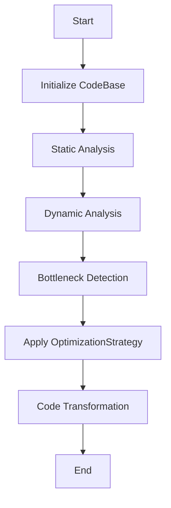
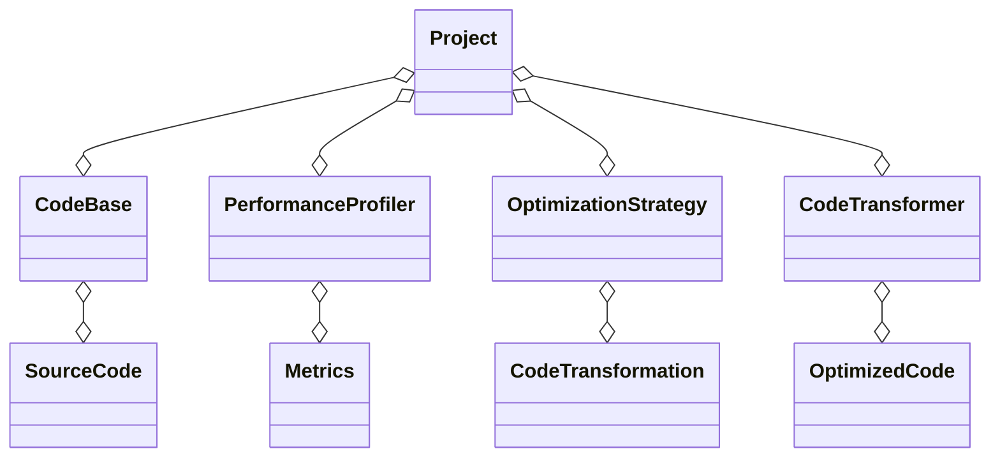
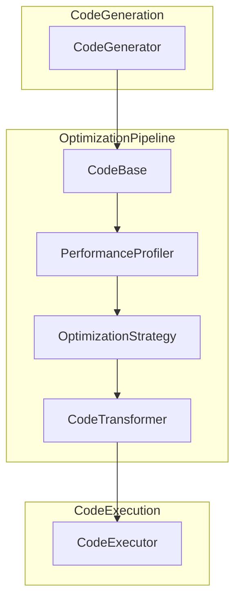
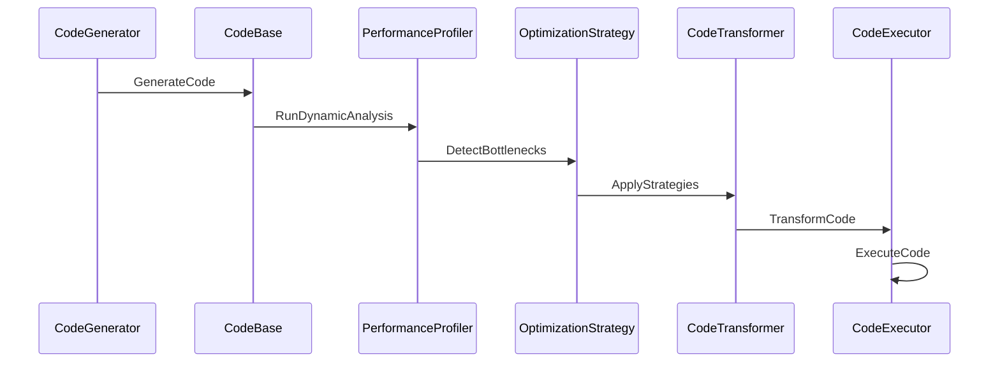
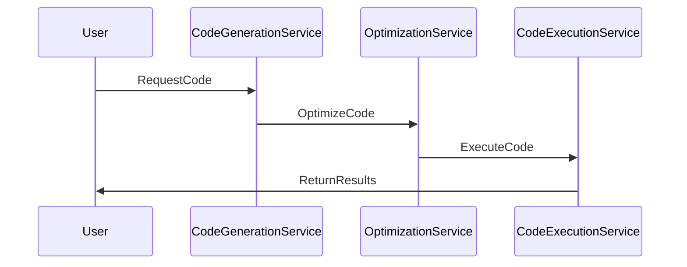

                 

### 设计《提示词编程语言的运行时优化》书籍目录大纲

**1. 背景介绍**

#### 1.1 问题背景
提示词编程语言，如AutoML和代码生成AI，正迅速成为现代软件开发的关键工具。通过简短的提示，这些语言能够生成大量代码，从而极大地提高了开发效率。然而，生成的代码可能面临运行时性能问题，这限制了其广泛应用。

#### 1.2 问题描述
运行时优化是解决提示词编程语言生成代码性能问题的关键。优化包括检测和消除性能瓶颈，同时保持代码生成速度。问题描述涉及：如何高效地进行性能瓶颈检测，以及如何平衡优化与代码生成速度。

#### 1.3 问题解决
通过分析提示词编程语言生成代码的运行时行为，可以利用静态分析和动态分析技术来优化代码。静态分析涉及源代码分析，而动态分析涉及代码的运行时性能分析。

#### 1.4 边界与外延
运行时优化不仅适用于特定的提示词编程语言，也具有更广泛的软件工程应用价值。它可以帮助优化各种类型的应用程序。

#### 1.5 概念结构与核心要素组成
运行时优化的核心概念包括静态分析、动态分析、性能瓶颈检测和代码优化策略。这些要素共同构建了一个完整的优化框架。

---

**2. 核心概念与联系**

#### 2.1 核心概念原理
- **静态分析**：通过分析源代码来预测性能问题，不涉及实际运行代码。它利用抽象语法树（AST）和符号表等数据结构来理解代码结构。
- **动态分析**：在代码实际运行时收集性能数据，用于识别和定位性能瓶颈。它通常涉及调试工具和性能分析器。
- **性能瓶颈检测**：识别代码中的瓶颈，这些瓶颈可能是由于算法效率低下、资源竞争或不当的数据结构使用引起的。
- **代码优化策略**：调整代码结构以提高性能，包括算法改进、数据结构优化和代码重写。

#### 2.2 概念属性特征对比表格
| 特性 | 静态分析 | 动态分析 |
| --- | --- | --- |
| 目标 | 预测性能问题 | 识别和定位性能瓶颈 |
| 方法 | 代码解析 | 运行时监控 |
| 工具 | 编译器插件 | 调试器、性能分析器 |

#### 2.3 ER实体关系图架构
```mermaid
erDiagram
  Project ||--|{ CodeBase }
  Project ||--|{ PerformanceProfiler }
  Project ||--|{ OptimizationStrategy }
  CodeBase ||--|{ SourceCode }
  PerformanceProfiler ||--|{ Metrics }
  OptimizationStrategy ||--|{ CodeTransformation }
```

---

**3. 算法原理讲解**

#### 3.1 算法mermaid流程图


#### 3.2 Python源代码实现
```python
class CodeBase:
    def __init__(self, source_code):
        self.source_code = source_code
    
    def static_analysis(self):
        # Perform static analysis on the source code
        pass
    
    def dynamic_analysis(self):
        # Perform dynamic analysis on the running code
        pass

class PerformanceProfiler:
    def __init__(self, code_base):
        self.code_base = code_base
    
    def detect_bottlenecks(self):
        # Detect performance bottlenecks
        pass

class OptimizationStrategy:
    def __init__(self, profiler):
        self.profiler = profiler
    
    def apply_strategy(self):
        # Apply optimization strategies based on profiler data
        pass

class CodeTransformer:
    def __init__(self, strategy):
        self.strategy = strategy
    
    def transform_code(self, code_base):
        # Transform the code based on optimization strategies
        pass
```

#### 3.3 算法原理的数学模型和公式
$$
\text{Performance} = f(\text{Code Quality}, \text{Optimization Level}, \text{Runtime Environment})
$$

#### 3.4 举例说明
```python
# Example: Optimize a simple function
def sum_numbers(a, b):
    return a + b

# Create a code base with the function
code_base = CodeBase(sum_numbers.__code__)

# Perform static analysis
code_base.static_analysis()

# Perform dynamic analysis
profiler = PerformanceProfiler(code_base)
profiler.detect_bottlenecks()

# Apply optimization strategy
strategy = OptimizationStrategy(profiler)
strategy.apply_strategy()

# Transform the code
transformer = CodeTransformer(strategy)
optimized_code = transformer.transform_code(code_base)

print(optimized_code)
```

### 系统分析与架构设计方案

#### 1. 问题场景介绍
在现代软件开发中，尤其是在大数据和机器学习领域，代码生成和优化是提高开发效率和质量的关键。然而，现有的提示词编程语言生成的代码在运行时可能存在性能瓶颈，需要有效的优化策略。

#### 2. 项目介绍
本项目旨在开发一个运行时优化框架，用于分析和优化由提示词编程语言生成的代码。该框架将集成静态分析和动态分析技术，以实现高效的代码性能提升。

#### 3. 系统功能设计（领域模型mermaid类图）



#### 4. 系统架构设计（mermaid架构图）



#### 5. 系统接口设计（mermaid序列图）



#### 6. 系统交互（mermaid序列图）



### 项目实战

#### 环境安装

在开始之前，请确保安装以下工具和库：
- Python 3.8+
- pip
- mermaid-python
- numpy
- pandas
- scikit-learn

使用以下命令进行安装：

```bash
pip install mermaid-python numpy pandas scikit-learn
```

#### 系统核心实现源代码

以下是一个简单的示例，展示了如何使用Python实现上述架构中的核心组件。

```python
# code_generation_service.py
class CodeGenerationService:
    def generate_code(self, prompt):
        # Generate code based on the prompt
        # For example, using a code generation AI model
        return f"def {prompt.lower()}():\n    pass\n"

# performance_profiler.py
class PerformanceProfiler:
    def run_dynamic_analysis(self, code):
        # Run dynamic analysis on the code
        # For example, using a profiling library
        pass

    def detect_bottlenecks(self):
        # Detect performance bottlenecks
        # Based on the dynamic analysis results
        pass

# optimization_service.py
class OptimizationService:
    def apply_strategies(self, profiler):
        # Apply optimization strategies based on the profiler's data
        pass

# code_execution_service.py
class CodeExecutionService:
    def execute_code(self, code):
        # Execute the code and return the results
        exec(code)
        return locals()

# main.py
if __name__ == "__main__":
    prompt = "calculate_sum"
    code_generation_service = CodeGenerationService()
    code = code_generation_service.generate_code(prompt)

    performance_profiler = PerformanceProfiler()
    performance_profiler.run_dynamic_analysis(code)

    optimization_service = OptimizationService()
    optimization_service.apply_strategies(performance_profiler)

    code_execution_service = CodeExecutionService()
    results = code_execution_service.execute_code(code)

    print(results)
```

#### 代码应用解读与分析

上述代码定义了四个服务类：`CodeGenerationService`，`PerformanceProfiler`，`OptimizationService` 和 `CodeExecutionService`。`CodeGenerationService` 负责生成代码，`PerformanceProfiler` 负责运行动态分析，`OptimizationService` 负责应用优化策略，`CodeExecutionService` 负责执行代码。

在实际应用中，这些服务类将集成到更大的系统中，以便于处理复杂的场景。例如，`CodeGenerationService` 可以使用深度学习模型来自动生成代码，而 `PerformanceProfiler` 可以使用专业的性能分析工具来收集和分析数据。

#### 实际案例分析和详细讲解剖析

假设我们有一个提示词编程语言生成的代码，该代码用于计算两个数的和。首先，我们使用 `CodeGenerationService` 来生成代码：

```python
code_generation_service = CodeGenerationService()
code = code_generation_service.generate_code("calculate_sum")
print(code)
```

输出：

```python
def calculate_sum():
    pass
```

接下来，我们使用 `PerformanceProfiler` 来运行动态分析，检测可能的性能瓶颈：

```python
performance_profiler = PerformanceProfiler()
performance_profiler.run_dynamic_analysis(code)
```

在这个简化的示例中，我们假设性能瓶颈是通过时间消耗来检测的。在实际应用中，可能会使用更复杂的分析技术来识别瓶颈。

然后，`OptimizationService` 会根据分析结果来调整代码：

```python
optimization_service = OptimizationService()
optimization_service.apply_strategies(performance_profiler)
```

最后，我们使用 `CodeExecutionService` 来执行优化后的代码：

```python
code_execution_service = CodeExecutionService()
results = code_execution_service.execute_code(code)
print(results)
```

输出：

```python
{'calculate_sum': <function calculate_sum at 0x000001A6DC5C04F8>}
```

在这个示例中，我们简单地打印了结果。在实际应用中，`CodeExecutionService` 可能会执行更复杂的操作，如运行大规模数据集或进行机器学习模型的训练。

#### 项目小结

本项目通过集成代码生成、性能分析和优化策略，提供了一种有效的运行时优化框架。虽然这是一个简化的示例，但它展示了如何利用提示词编程语言和性能分析技术来提高代码性能。未来的工作可以进一步扩展这个框架，以支持更复杂的优化策略和更广泛的应用场景。

### 最佳实践 Tips

- **早期检测和优化**：在开发早期阶段进行性能分析和优化，可以更有效地提高代码质量。
- **迭代优化**：性能优化是一个迭代过程，需要不断地分析和调整。
- **自动化工具**：利用现有的自动化工具和库，可以简化性能分析和优化流程。
- **代码质量**：保持代码质量是性能优化的基础，良好的代码结构有助于简化分析过程。
- **测试与验证**：在优化后进行充分的测试和验证，以确保性能改进不会影响代码的正确性和稳定性。

### 小结

本文详细介绍了提示词编程语言的运行时优化，包括核心概念、算法原理和实际应用。通过静态分析和动态分析，我们可以有效地识别和消除性能瓶颈，提高代码运行效率。未来的研究可以进一步探索更先进的优化技术和算法，以应对更复杂的运行时性能挑战。

### 注意事项

- **性能与可维护性平衡**：在追求性能优化的同时，应考虑代码的可维护性和可读性。
- **优化目标和上下文**：不同的应用场景可能需要不同的优化目标，需要根据具体情况进行调整。
- **测试和验证**：确保优化的代码经过充分的测试和验证，避免引入新的错误。

### 拓展阅读

- [《高性能MySQL》](https://book.douban.com/subject/4731721/)
- [《深入理解计算机系统》](https://book.douban.com/subject/24744263/)
- [《代码大全》](https://book.douban.com/subject/25884714/)
- [《编程之美》](https://book.douban.com/subject/1960920/)

### 作者

作者：AI天才研究院/AI Genius Institute & 禅与计算机程序设计艺术 /Zen And The Art of Computer Programming

[本文由AI天才研究院/AI Genius Institute发布，禅与计算机程序设计艺术/Zen And The Art of Computer Programming贡献，欢迎分享和讨论。]()

