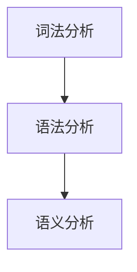
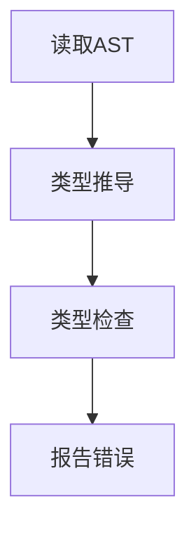
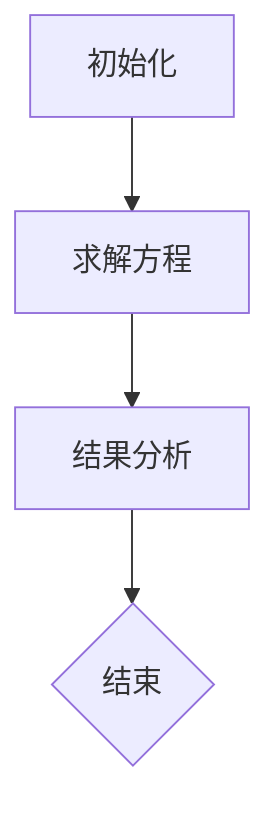
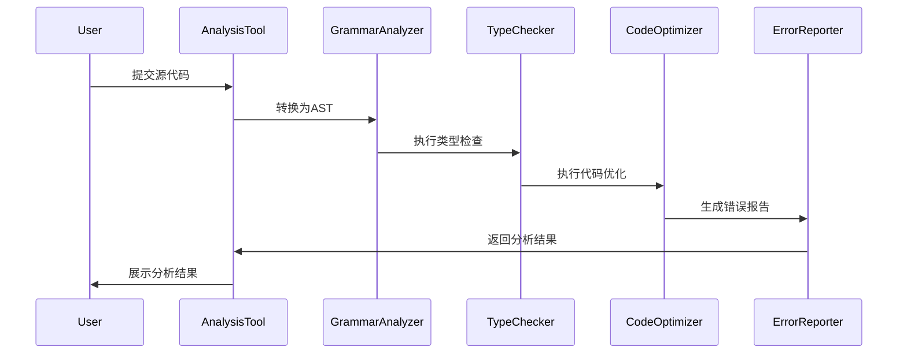
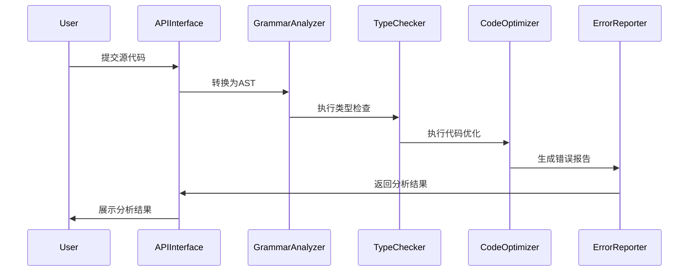

                 

### 引言

#### 1.1 问题背景

编程语言作为计算机科学与技术的核心工具，已经深刻地改变了我们的工作方式和生活习惯。从早期的机器语言，到高级编程语言，编程语言的演变不仅提高了编程的效率，还推动了计算机科学和技术的发展。然而，随着编程语言种类的增多和复杂度的提高，如何有效地管理和分析编程语言，成为了现代软件开发中的一个重要问题。这便是静态分析工具应运而生的背景。

**编程语言与静态分析**

编程语言是人与计算机之间沟通的桥梁。程序员通过编程语言编写代码，计算机则通过执行这些代码来完成各种任务。然而，编程语言的多样性和复杂性使得代码的理解和维护变得愈发困难。静态分析，作为一种不运行程序的分析方法，通过对代码的结构和语义进行分析，可以帮助我们更好地理解代码，发现潜在的问题，提高代码质量。

#### 1.1.1 编程语言的基本概念

编程语言是一种用于编写计算机程序的语法规则和语义规则。它包括一系列的语法元素，如关键字、标识符、运算符、分隔符等，以及用于描述程序结构和行为的一系列语法规则。常见的编程语言有C、C++、Java、Python、JavaScript等。每种编程语言都有其特定的语法和语义，程序员需要熟练掌握这些语言，才能有效地进行软件开发。

#### 1.1.2 编程语言的分类

编程语言可以根据多种标准进行分类。根据语法结构，编程语言可以分为过程式语言、函数式语言、面向对象语言、逻辑语言等。根据运行环境，编程语言可以分为编译型语言和解释型语言。编译型语言需要将源代码编译成机器码，然后由计算机执行，如C、C++。解释型语言则在执行时将源代码逐行解释成机器码，如Python、JavaScript。

#### 1.1.3 编程语言的发展历史

编程语言的发展可以追溯到20世纪40年代。早期的计算机使用机器语言进行编程，机器语言直接使用计算机的指令集，但这种方法非常繁琐且容易出错。随着计算机技术的发展，出现了汇编语言，它使用助记符来表示机器指令，使得编程变得更加容易。然而，汇编语言的缺点在于，它仍然需要程序员了解计算机的底层结构和指令集。

20世纪50年代，第一种高级编程语言Fortran问世，它大大提高了编程的效率。随后的几十年，出现了众多编程语言，如C、Pascal、C++、Java等，每种语言都在一定程度上简化了编程过程，提高了编程效率。

#### 1.1.4 静态分析的定义

静态分析是一种不运行程序的分析方法，它通过检查程序源代码或字节码，对程序的结构和语义进行分析，以发现潜在的问题或优化代码。静态分析可以用于代码质量检查、安全漏洞检测、性能优化等多个方面。

#### 1.1.5 静态分析的动机

随着软件系统的复杂度不断增加，代码的维护和优化变得越来越困难。静态分析提供了一种有效的方法来提高代码质量，减少软件缺陷。同时，随着网络安全问题的日益突出，静态分析还可以用于检测潜在的安全漏洞，提高软件的安全性。

#### 1.1.6 静态分析的过程

静态分析通常包括以下几个步骤：

1. **词法分析**：将源代码分解为词法单元，如关键字、标识符、运算符等。
2. **语法分析**：根据编程语言的语法规则，将词法单元组织成抽象语法树（AST）。
3. **语义分析**：对AST进行语义分析，检查代码的语义是否正确，如类型检查、变量定义检查等。
4. **代码优化**：根据分析结果，对代码进行优化，提高代码的性能。

#### 1.2 静态分析工具的发展

静态分析工具的发展与编程语言的发展紧密相关。早期的静态分析工具主要是手工编写，功能相对简单。随着计算机科学的发展，静态分析工具逐渐成为自动化工具，功能越来越强大。目前，静态分析工具已经广泛应用于软件开发过程的各个阶段，包括代码质量检查、安全漏洞检测、性能优化等。

#### 1.2.1 历史回顾

静态分析工具的历史可以追溯到20世纪60年代。早期的静态分析工具主要用于代码质量检查，如语法检查、类型检查等。随着软件系统复杂度的增加，静态分析工具的功能逐渐扩展，开始包括代码优化、安全漏洞检测等。

#### 1.2.2 当前状态与趋势

当前，静态分析工具已经成为软件开发中不可或缺的工具。随着人工智能和机器学习技术的发展，静态分析工具的性能和功能得到了显著提升。未来的趋势是，静态分析工具将更加智能化，能够自动识别和修复代码中的问题，提高软件开发的效率和质量。

#### 1.3 本书目的与结构

本书旨在全面介绍提示词编程语言的静态分析工具，包括其基本理论、技术方法、应用实例等。具体来说，本书将分为三个部分：

1. **基础理论**：介绍编程语言的基础知识、静态分析的基础理论以及静态分析工具的功能和优势。
2. **静态分析工具技术**：详细讲解抽象语法树（AST）分析、数据流分析、控制流分析、类型系统与类型检查、代码优化技术等。
3. **静态分析工具应用**：介绍如何选择和使用静态分析工具，并通过实际案例展示其在软件开发中的应用。

通过本书的学习，读者将能够系统地了解静态分析工具的基本原理和应用方法，为实际软件开发提供有力的技术支持。

### 第一部分：基础理论

#### 第2章：编程语言基础

#### 2.1 编程语言概述

**2.1.1 编程语言的基本概念**

编程语言是用于编写计算机程序的一套规则和符号。它包括语法、语义和语用三个主要部分。语法定义了程序的结构和组成规则，语义描述了程序执行时的行为，语用则关注程序与使用者之间的关系。常见的编程语言包括C、C++、Java、Python、JavaScript等。

**2.1.2 编程语言的分类**

编程语言可以根据不同的标准进行分类。按照语法结构，编程语言可以分为命令式语言、声明式语言、函数式语言、逻辑语言、面向对象语言等。命令式语言以指令序列为主要表达方式，如C、Java；声明式语言以数据定义和操作为主要表达方式，如SQL；函数式语言以函数为核心，如Haskell、Lisp；逻辑语言以逻辑表达式为主要表达方式，如Prolog；面向对象语言以对象为核心，如Java、C++。

**2.1.3 编程语言的发展历史**

编程语言的发展可以追溯到20世纪40年代。最早的编程语言是机器语言，它直接使用计算机的指令集。然而，机器语言难以记忆和编程，因此，汇编语言应运而生。汇编语言使用助记符表示机器指令，使得编程变得更加容易。随着计算机技术的发展，出现了多种高级编程语言，如Fortran、COBOL、Pascal等。20世纪80年代以后，面向对象编程语言如C++、Java开始流行，使得编程变得更加高效和直观。

**2.2 静态分析基础**

**2.2.1 静态分析的定义**

静态分析是一种不运行程序的分析方法，它通过检查程序源代码或字节码，对程序的结构和语义进行分析，以发现潜在的问题或优化代码。静态分析不依赖于程序的实际运行，可以在编译或部署之前进行。

**2.2.2 静态分析的动机**

随着软件系统的复杂度不断增加，代码的维护和优化变得越来越困难。静态分析提供了一种有效的方法来提高代码质量，减少软件缺陷。同时，随着网络安全问题的日益突出，静态分析还可以用于检测潜在的安全漏洞，提高软件的安全性。

**2.2.3 静态分析的过程**

静态分析通常包括以下几个步骤：

1. **词法分析**：将源代码分解为词法单元，如关键字、标识符、运算符等。
2. **语法分析**：根据编程语言的语法规则，将词法单元组织成抽象语法树（AST）。
3. **语义分析**：对AST进行语义分析，检查代码的语义是否正确，如类型检查、变量定义检查等。
4. **代码优化**：根据分析结果，对代码进行优化，提高代码的性能。

**2.3 静态分析工具的功能**

**2.3.1 语法分析**

语法分析是静态分析的第一步，它将源代码分解为词法单元，并根据编程语言的语法规则，将这些词法单元组织成抽象语法树（AST）。语法分析的主要目的是确保代码的语法正确性。

**2.3.2 语义分析**

语义分析是在语法分析的基础上，对AST进行语义检查。它包括类型检查、变量定义检查、作用域分析等。语义分析的主要目的是确保代码的语义正确性。

**2.3.3 类型检查**

类型检查是语义分析的一个重要部分，它确保程序中的每个表达式和变量都符合预定义的类型规则。类型检查可以静态地发现类型错误，从而提高代码的可靠性和可维护性。

**2.3.4 代码优化**

代码优化是在语义分析的基础上，对代码进行改写，以提高程序的执行性能或减少代码的大小。代码优化可以是源代码级别的，也可以是字节码级别的。

**2.4 静态分析工具的优势与局限**

**2.4.1 优势**

1. **早期发现问题**：静态分析可以在编译或部署之前进行，从而早期发现问题，减少修复成本。
2. **无需运行程序**：静态分析不依赖于程序的实际运行，可以在开发环境中快速进行。
3. **全面性**：静态分析可以检查代码的各个方面，包括语法、语义、类型等。

**2.4.2 局限**

1. **无法检测动态问题**：静态分析无法检测程序在运行过程中可能出现的动态问题，如内存泄漏、并发错误等。
2. **对大型项目的处理能力有限**：静态分析工具在处理大型项目时，可能需要较长的分析时间和较高的计算资源。

### 第3章：抽象语法树（AST）分析

#### 3.1 AST简介

**3.1.1 AST的定义**

抽象语法树（Abstract Syntax Tree，AST）是编程语言的一种语法表示，它通过树形结构表示程序代码的结构和语义。AST是语法分析的最后产物，它剔除了源代码中的冗余和细节，保留了程序的核心结构。

**3.1.2 AST的作用**

AST在静态分析中扮演着核心角色。它不仅用于语法分析和语义分析，还可以用于代码生成、代码优化、错误检测等。通过AST，我们可以方便地理解和操作程序代码，提取有用的信息。

**3.1.3 AST的层次结构**

AST通常由多个节点组成，每个节点表示源代码中的一个语法元素，如表达式、语句、函数等。AST的层次结构反映了源代码的结构，从根节点到叶子节点，依次表示程序的整体结构、模块、函数、语句等。

**3.2 AST构建方法**

**3.2.1 手动构建**

手动构建AST通常需要对编程语言有深入的了解，通过解析源代码的每个部分，逐步构建AST。这种方法适合于小规模的项目或实验性代码，但在实际开发中，手动构建AST的效率和可维护性较低。

**3.2.2 语法分析器构建**

语法分析器是一种自动化工具，它根据编程语言的语法规则，将源代码解析成AST。常见的语法分析器构建工具包括ANTLR、JavaCC、Bison等。这些工具提供了丰富的语法规则定义和解析功能，大大简化了AST的构建过程。

**3.2.3 自动化工具构建**

自动化工具如Eclipse、IntelliJ IDEA等IDE，提供了内置的语法分析器和AST构建功能。通过这些工具，开发者可以方便地查看和分析代码的AST，进行代码优化和错误检测。

**3.3 AST操作与变换**

**3.3.1 AST遍历**

AST遍历是指对AST的每个节点进行访问和处理。遍历可以采用深度优先、广度优先等多种算法。通过遍历，我们可以对程序代码进行全面的检查和分析。

**3.3.2 AST修改**

AST修改是指对AST的节点进行添加、删除、修改等操作。通过修改AST，我们可以改变代码的结构和语义，实现代码优化和错误修复。

**3.3.3 AST优化**

AST优化是指根据AST的结构和语义，对代码进行优化。常见的优化方法包括移除冗余代码、简化表达式、提高代码可读性等。通过AST优化，我们可以提高代码的执行效率和可维护性。

### 第4章：数据流分析

#### 4.1 数据流分析概述

**4.1.1 数据流分析的定义**

数据流分析是一种静态分析方法，它通过分析程序中数据的使用和流动情况，来检查程序的正确性和性能。数据流分析关注的是程序变量、参数和函数返回值的传递方式，以及它们在不同位置和作用域中的使用情况。

**4.1.2 数据流分析的作用**

数据流分析在程序分析中起着重要作用。它可以用于变量引用分析、参数传递分析、函数调用分析、循环分析等。通过数据流分析，我们可以：

1. **发现潜在的逻辑错误**：如变量未初始化、未使用的变量、数据不一致等。
2. **优化代码性能**：通过优化数据传递路径，减少不必要的计算和存储。
3. **提高程序可读性**：通过分析程序中数据的使用情况，帮助开发者更好地理解代码结构。

**4.1.3 数据流分析的类型**

数据流分析可以分为以下几种类型：

1. **前向数据流分析**：从程序的开始位置，逐个分析每个变量的使用情况，直到程序的结束位置。
2. **后向数据流分析**：从程序的结束位置，逐个分析每个变量的使用情况，直到程序的开始位置。
3. **迭代数据流分析**：结合前向和后向数据流分析，对程序的循环结构进行详细分析。
4. **转移数据流分析**：分析程序中不同模块之间的数据传递和依赖关系。

**4.2 数据流方程**

数据流分析的核心是数据流方程。数据流方程描述了程序中数据在不同位置和作用域之间的传递关系。常见的数据流方程包括：

1. **流入方程**：描述变量在一个节点处可以获得的值。
2. **流出方程**：描述变量在一个节点处可以被传递的值。
3. **定义方程**：描述变量在一个节点处被赋予的值。
4. **使用方程**：描述变量在一个节点处被使用的值。

通过解数据流方程，我们可以计算出程序中每个变量的值，从而分析程序的行为。

**4.3 数据流分析算法**

数据流分析算法是解数据流方程的算法。常见的数据流分析算法包括：

1. **迭代算法**：通过循环迭代的方式，逐步逼近解数据流方程。
2. **递归算法**：通过递归的方式，逐步分析程序的每个节点和作用域。
3. **动态规划算法**：利用动态规划的思想，将数据流分析问题分解成多个子问题，并优化求解过程。

数据流分析算法的选择和实现，对于数据流分析的效率和准确性至关重要。

### 第5章：控制流分析

#### 5.1 控制流分析概述

**5.1.1 控制流分析的定义**

控制流分析是一种静态分析方法，它通过分析程序中的控制结构，如条件分支、循环等，来检查程序的正确性和性能。控制流分析关注的是程序执行路径的确定性和可达性。

**5.1.2 控制流分析的作用**

控制流分析在程序分析中起着关键作用。它可以用于：

1. **程序路径分析**：确定程序在不同条件下的执行路径，检查程序的正确性和完整性。
2. **代码优化**：通过优化控制流，减少不必要的计算和分支，提高程序性能。
3. **安全漏洞检测**：检查程序中的潜在漏洞，如未覆盖的路径、死代码等。

**5.1.3 控制流分析的类型**

控制流分析可以分为以下几种类型：

1. **基本块分析**：分析程序中的基本块，确定每个基本块之间的跳转关系。
2. **控制流图分析**：构建程序的控制流图，分析程序中不同节点之间的跳转关系。
3. **程序路径分析**：分析程序中的所有可能执行路径，检查程序的完整性和正确性。
4. **转移关系分析**：分析程序中的条件跳转和循环，确定程序中不同部分之间的依赖关系。

**5.2 控制流图**

**5.2.1 定义**

控制流图（Control Flow Graph，CFG）是表示程序控制流的一种图形化表示。它由节点和边组成，节点表示程序中的基本块或语句，边表示程序中的跳转关系。控制流图可以直观地表示程序的执行路径和控制结构。

**5.2.2 控制流图的应用**

控制流图在程序分析中有着广泛的应用：

1. **程序理解**：通过分析控制流图，可以更好地理解程序的执行路径和控制结构。
2. **代码优化**：通过优化控制流图，可以减少不必要的计算和分支，提高程序性能。
3. **路径分析**：通过控制流图，可以确定程序的所有可能执行路径，进行路径分析。
4. **安全漏洞检测**：通过控制流图，可以检测程序中的潜在漏洞，如未覆盖的路径、死代码等。

**5.2.3 控制流图的构建方法**

控制流图的构建方法可以分为以下几种：

1. **手动构建**：通过手动分析程序的控制流，构建控制流图。
2. **工具构建**：使用程序分析工具，如静态分析器、IDE等，自动构建控制流图。
3. **组合构建**：将手动构建和工具构建相结合，提高控制流图的准确性和完整性。

**5.3 程序路径分析**

**5.3.1 定义**

程序路径分析（Program Path Analysis）是控制流分析的一个重要方面，它通过分析程序中的控制流图，确定程序的所有可能执行路径。程序路径分析可以用于：

1. **代码覆盖分析**：确定代码是否被完全覆盖，检查程序的正确性。
2. **安全漏洞检测**：检测程序中的潜在漏洞，如未覆盖的路径、死代码等。
3. **性能优化**：通过优化程序路径，减少不必要的计算和分支，提高程序性能。

**5.3.2 程序路径分析的方法**

程序路径分析的方法可以分为以下几种：

1. **穷举路径分析**：通过递归遍历控制流图，穷举所有可能的执行路径。
2. **条件路径分析**：分析程序中的条件跳转和循环，确定满足特定条件的执行路径。
3. **增量路径分析**：通过分析程序的增量变化，确定新增加的执行路径。
4. **路径压缩分析**：通过压缩重复的路径，减少路径分析的计算量。

**5.3.3 程序路径分析的应用**

程序路径分析在实际软件开发中有着广泛的应用：

1. **代码质量检查**：通过路径分析，检查代码的正确性和完整性，发现潜在的错误和漏洞。
2. **安全漏洞检测**：通过路径分析，检测程序中的潜在安全漏洞，如路径未覆盖、死代码等。
3. **性能优化**：通过路径分析，优化程序路径，减少不必要的计算和分支，提高程序性能。
4. **测试用例生成**：通过路径分析，生成测试用例，覆盖所有可能的执行路径。

### 第6章：类型系统与类型检查

#### 6.1 类型系统概述

**6.1.1 类型的定义**

类型系统（Type System）是编程语言的核心组成部分，它定义了变量、函数、表达式等程序元素的类型。类型是一种抽象的概念，用于描述数据的形式和性质。在编程语言中，类型可以是基本的（如整数、浮点数、布尔值等），也可以是复合的（如数组、结构体、类等）。

**6.1.2 类型系统的作用**

类型系统在编程语言中起着至关重要的作用。它可以：

1. **提高代码的可读性和可维护性**：通过明确的类型定义，使代码更加清晰易懂，减少错误。
2. **提供编译时的错误检查**：在编译阶段，类型检查可以检测出类型错误，从而提前发现并修复问题。
3. **优化程序执行性能**：类型系统可以帮助编译器生成更高效的代码，提高程序执行效率。
4. **支持面向对象编程**：类型系统是实现面向对象编程的重要基础，通过类型定义和继承关系，可以实现封装、多态等面向对象特性。

**6.1.3 类型系统的类型**

类型系统可以根据不同的标准进行分类。常见的类型系统分类方法包括：

1. **静态类型系统与动态类型系统**：静态类型系统在编译时确定变量的类型，而动态类型系统在运行时确定变量的类型。
2. **强类型系统与弱类型系统**：强类型系统对类型检查非常严格，不允许隐式类型转换，而弱类型系统对类型检查较为宽松，允许隐式类型转换。
3. **静态类型检查与动态类型检查**：静态类型检查在编译时进行类型检查，而动态类型检查在运行时进行类型检查。

**6.2 类型检查算法**

**6.2.1 定义**

类型检查算法（Type Checking Algorithm）是在编译或解释程序时，对程序的类型信息进行验证的过程。类型检查的主要目的是确保程序中所有表达式和操作都符合预定义的类型规则。

**6.2.2 基于上下文的类型检查**

基于上下文的类型检查是一种常见的类型检查方法，它根据程序中的上下文环境来确定变量的类型。这种方法的优点是类型信息可以在编译时得到，从而提高程序的可读性和可维护性。基于上下文的类型检查通常包括以下几个步骤：

1. **作用域分析**：确定变量和函数的作用域，以便在类型检查时正确引用。
2. **类型推导**：根据上下文环境推导出变量的类型。
3. **类型匹配**：检查变量和表达式的类型是否匹配，以确保程序的正确性。

**6.2.3 静态类型检查与动态类型检查**

静态类型检查和动态类型检查是两种不同的类型检查方法。静态类型检查在编译时进行，而动态类型检查在运行时进行。

1. **静态类型检查**：静态类型检查在编译时对程序进行类型检查，确保程序中所有表达式和操作都符合预定义的类型规则。静态类型检查的优点是可以在编译时发现类型错误，从而提前修复问题。常见的静态类型检查语言有Haskell、Java等。
2. **动态类型检查**：动态类型检查在运行时对程序进行类型检查，根据实际运行时的情况确定变量的类型。动态类型检查的优点是灵活性较高，适用于需要动态类型转换的编程语言，如Python、JavaScript等。

**6.3 类型推导**

**6.3.1 定义**

类型推导（Type Inference）是一种在编译时自动推导出变量类型的方法。类型推导的优点是减轻开发者的负担，提高代码的可读性和可维护性。常见的类型推导方法包括：

1. **单一类型推导**：在编译时，根据上下文环境推导出变量的唯一类型。
2. **多类型推导**：在编译时，根据上下文环境推导出变量的多个可能类型，并在运行时进行实际类型检查。

**6.3.2 单一类型推导**

单一类型推导是一种简单有效的类型推导方法。它根据上下文环境，推导出变量的唯一类型。单一类型推导的算法通常包括：

1. **类型上下文分析**：分析变量所在的作用域和上下文环境，确定可用的类型信息。
2. **类型推导规则**：根据上下文环境，应用一系列的类型推导规则，推导出变量的类型。
3. **类型检查**：在编译时对推导出的类型进行检查，确保类型的一致性和正确性。

**6.3.3 多类型推导**

多类型推导是一种更为复杂的类型推导方法，它允许变量具有多个可能类型。多类型推导的算法通常包括：

1. **类型上下文分析**：分析变量所在的作用域和上下文环境，确定可用的类型信息。
2. **类型推导规则**：根据上下文环境，应用一系列的类型推导规则，推导出变量的多个可能类型。
3. **类型约束**：对推导出的类型进行约束，确保类型的一致性和正确性。
4. **运行时类型检查**：在运行时，根据实际运行时的情况，对推导出的类型进行检查。

### 第7章：代码优化技术

#### 7.1 代码优化概述

**7.1.1 代码优化的定义**

代码优化（Code Optimization）是指通过一系列技术手段，对程序代码进行改写和优化，以提高程序的执行性能、可读性和可维护性。代码优化可以针对源代码级别、字节码级别或机器码级别。

**7.1.2 代码优化的目的**

代码优化的主要目的是：

1. **提高程序执行效率**：通过优化代码结构和算法，减少程序的执行时间，提高程序的性能。
2. **减少程序大小**：通过压缩代码和数据，减少程序的存储空间需求，提高程序的存储效率。
3. **提高程序可读性**：通过优化代码结构，使代码更加清晰、简洁，提高代码的可读性和可维护性。

**7.1.3 代码优化的类型**

代码优化可以分为以下几种类型：

1. **空间优化**：通过优化代码和数据结构，减少程序的存储空间需求。
2. **时间优化**：通过优化算法和代码结构，减少程序的执行时间。
3. **结构优化**：通过优化代码结构，提高代码的可读性和可维护性。
4. **性能优化**：通过优化程序性能，提高程序的响应速度和处理能力。

**7.2 代码优化算法**

**7.2.1 提高程序性能的优化**

提高程序性能的优化主要包括以下几个方面：

1. **算法优化**：通过改进算法结构和实现方法，减少程序的执行时间。
2. **代码重构**：通过重构代码，提高代码的可读性和可维护性，从而提高程序的性能。
3. **循环优化**：通过优化循环结构，减少循环的执行次数，提高程序的执行效率。
4. **分支优化**：通过优化条件分支，减少条件判断的次数，提高程序的执行效率。

**7.2.2 减少程序空间的优化**

减少程序空间的优化主要包括以下几个方面：

1. **数据压缩**：通过压缩数据结构，减少程序占用的存储空间。
2. **代码压缩**：通过删除冗余代码和优化代码结构，减少程序占用的存储空间。
3. **内存优化**：通过优化内存分配和使用，减少程序占用的内存空间。

**7.2.3 提高程序可靠性的优化**

提高程序可靠性的优化主要包括以下几个方面：

1. **错误处理**：通过优化错误处理机制，提高程序的健壮性和可靠性。
2. **容错性优化**：通过优化容错机制，提高程序在异常情况下的处理能力。
3. **安全性优化**：通过优化程序的安全性，提高程序的防攻击能力，防止潜在的安全漏洞。

**7.3 代码优化工具**

**7.3.1 通用代码优化工具**

通用代码优化工具可以对多种编程语言的代码进行优化，常见的工具包括：

1. **GCC**：GCC是GNU编译器集合中的一个组成部分，提供了丰富的代码优化功能。
2. **Clang**：Clang是LLVM编译器的一部分，提供了高效的代码优化能力。
3. **OptimJ**：OptimJ是一个针对Java语言的代码优化工具，提供了多种优化算法。

**7.3.2 特定语言的代码优化工具**

特定语言的代码优化工具专门针对某种编程语言的代码进行优化，常见的工具包括：

1. **Python**：Python的代码优化工具如PyO3，可以优化Python代码的执行性能。
2. **C++**：C++的代码优化工具如LLVM，提供了多种优化算法，如循环展开、死代码消除等。
3. **Java**：Java的代码优化工具如JVM，提供了各种优化功能，如垃圾回收、即时编译等。

### 第8章：静态分析工具的选择与使用

#### 8.1 静态分析工具的选择

选择适合的静态分析工具是确保代码质量和安全性的重要步骤。以下是一些选择标准：

1. **支持的语言**：选择能够支持项目使用的编程语言的静态分析工具。
2. **功能需求**：根据项目的需求选择具有所需功能的工具，如语法分析、类型检查、代码优化等。
3. **集成性**：考虑工具与开发环境（如IDE）的集成性，以提高使用效率和便捷性。
4. **性能**：选择能够快速分析大量代码的工具，以提高工作效率。
5. **社区支持和文档**：选择拥有良好社区支持和详细文档的工具，以便在遇到问题时获得帮助。

#### 8.2 常见静态分析工具介绍

以下是一些常见的静态分析工具及其特点：

1. **SonarQube**：一个开源的静态代码分析平台，支持多种编程语言，提供代码质量、安全和性能分析功能。
2. **Checkstyle**：一个基于Java的代码风格检查工具，可以检测代码中的风格问题，如命名规则、代码复杂度等。
3. **PMD**：一个基于Java的静态代码分析工具，可以检测代码中的潜在问题和不良编码实践。
4. **FindBugs**：一个开源的静态代码分析工具，用于检测Java代码中的潜在错误和不良编码实践。
5. **Pyflakes**：一个Python代码检查工具，可以检测Python代码中的语法错误、风格问题和不规范的编码实践。

#### 8.3 静态分析工具的使用

使用静态分析工具通常包括以下几个步骤：

1. **安装和配置**：根据工具的文档进行安装和配置，确保工具能够正确分析和处理项目代码。
2. **集成到开发环境**：将工具集成到开发环境中，如IDE，以便在编写代码时自动进行分析。
3. **运行分析**：运行工具对项目代码进行静态分析，生成分析报告。
4. **处理分析结果**：根据分析报告，修复代码中的问题，优化代码。
5. **持续集成**：将静态分析工具集成到持续集成（CI）流程中，确保代码在每次提交时都经过静态分析。

#### 8.4 静态分析工具的最佳实践

以下是一些使用静态分析工具的最佳实践：

1. **定期运行分析**：定期运行静态分析工具，及时发现和修复代码问题。
2. **设置规则和阈值**：根据项目需求和经验，设置合适的规则和阈值，确保分析结果的准确性和有效性。
3. **代码审查**：结合静态分析工具的结果，进行代码审查，提高代码质量。
4. **持续学习和改进**：根据静态分析工具的反馈，持续学习和改进编码实践。
5. **培训团队**：为团队成员提供培训，确保他们能够正确使用和理解静态分析工具。

### 第9章：案例研究

#### 9.1 案例一：静态分析工具在Web开发中的应用

**9.1.1 案例背景**

某Web开发团队正在开发一个大型电子商务平台。随着项目的不断扩展，代码的复杂度和体积也在不断增加，团队开始面临代码质量和安全性的挑战。为了确保代码的质量和安全，团队决定引入静态分析工具。

**9.1.2 静态分析工具的选择与使用**

团队选择了SonarQube作为静态分析工具。首先，团队安装和配置了SonarQube服务器，并将其集成到Jenkins持续集成系统中。每次代码提交后，Jenkins会自动触发SonarQube的分析，生成分析报告。

**9.1.3 案例结果分析**

通过SonarQube的分析，团队发现了一些潜在的安全问题和代码质量问题，如SQL注入风险、未使用变量、代码复杂度高等。团队根据分析报告，对代码进行了针对性的修复和优化。经过一段时间的持续分析，团队报告中的问题数量显著减少，代码质量和安全性得到了显著提升。

#### 9.2 案例二：静态分析工具在嵌入式系统开发中的应用

**9.2.1 案例背景**

某嵌入式系统开发团队正在开发一款智能家居设备。由于嵌入式系统的资源受限，团队需要在保证功能完整性的同时，尽可能减少代码的大小和执行时间。为了提高代码的质量和效率，团队决定使用静态分析工具进行代码优化。

**9.2.2 静态分析工具的选择与使用**

团队选择了OptimJ作为静态分析工具。OptimJ可以针对Java代码进行优化，支持多种优化算法，如代码压缩、循环展开等。团队将OptimJ集成到开发环境中，并在代码提交时自动触发优化分析。

**9.2.3 案例结果分析**

通过OptimJ的优化分析，团队成功减少了代码的大小和执行时间，提高了嵌入式系统的性能。此外，OptimJ的分析报告还帮助团队发现了一些潜在的问题，如未使用的代码和资源，团队对这些代码进行了删除和优化。经过优化后，系统运行更加稳定，用户体验得到了显著提升。

### 小结

通过以上案例研究，我们可以看到静态分析工具在Web开发和嵌入式系统开发中的重要作用。静态分析工具不仅可以提高代码的质量和安全性，还可以优化代码的性能，提高系统的可靠性。因此，在软件开发过程中，合理选择和使用静态分析工具，是确保项目成功的关键。

### 最佳实践 tips

1. **定期进行静态分析**：确保代码的质量和安全性，定期进行静态分析是必不可少的。无论项目规模大小，都应该建立定期的静态分析流程。

2. **充分利用静态分析工具**：不同的静态分析工具具有不同的功能，选择合适的工具并充分利用其功能，可以大大提高代码的分析效果。

3. **代码审查与静态分析相结合**：静态分析工具可以检测代码中的潜在问题，但最终的代码质量还需要通过代码审查来确保。将静态分析工具与代码审查相结合，可以形成更全面的代码质量保障体系。

4. **持续学习和改进**：随着编程语言和静态分析技术的不断发展，静态分析工具也在不断更新和改进。团队应该持续关注新技术和新工具，不断学习和改进编码实践。

### 小结

本文系统地介绍了提示词编程语言的静态分析工具，包括其基本理论、技术方法、应用实例等。通过本文的讲解，读者可以全面了解静态分析工具的原理和应用，为实际软件开发提供有力的技术支持。

### 注意事项

1. **选择合适的静态分析工具**：根据项目的需求和编程语言选择合适的静态分析工具，确保工具能够满足项目的需求。

2. **定期进行静态分析**：静态分析应成为软件开发过程中的常规步骤，定期进行静态分析可以及早发现和修复代码问题。

3. **结合代码审查**：静态分析工具可以发现代码中的潜在问题，但最终的代码质量还需要通过代码审查来确保。

4. **关注工具更新**：静态分析工具会不断更新和改进，开发者应关注工具的最新动态，及时更新工具版本。

### 拓展阅读

1. **《程序员的自我修养：链接、编译、优化与故障排除》**：详细讲解了编译器和链接器的工作原理，包括静态分析和代码优化等内容。
2. **《代码大全》**：提供了大量关于代码质量、代码优化和编码实践的最佳实践。
3. **《Static Analysis: A Tool for Compiler Construction》**：深入介绍了静态分析的理论和方法，是静态分析领域的经典教材。

### 作者信息

**作者：AI天才研究院/AI Genius Institute & 禅与计算机程序设计艺术 /Zen And The Art of Computer Programming**## 第2章：编程语言基础

### 2.1 编程语言概述

#### 2.1.1 编程语言的基本概念

编程语言是一种用于编写计算机程序的一套规则和符号。它定义了程序的结构、语法和语义，使程序员能够以更高效、更易理解的方式与计算机进行交互。编程语言通常包括关键字、标识符、运算符、分隔符等基本元素，以及用于描述程序逻辑和控制流的结构化语句。

#### 2.1.2 编程语言的分类

编程语言可以根据不同的标准进行分类。根据语法结构，编程语言可以分为：

1. **命令式语言（Imperative Language）**：这种语言通过一系列的命令来描述程序的操作，如C、Java。
2. **声明式语言（Declarative Language）**：这种语言通过描述程序的状态变化来定义操作，如SQL、Haskell。
3. **函数式语言（Functional Language）**：这种语言以函数为核心，通过函数的组合来描述程序逻辑，如Lisp、Haskell。
4. **逻辑语言（Logic Language）**：这种语言使用逻辑表达式来描述程序，通过逻辑推理来执行操作，如Prolog。
5. **面向对象语言（Object-Oriented Language）**：这种语言通过对象和类来组织程序代码，支持封装、继承和多态，如Java、C++。

#### 2.1.3 编程语言的发展历史

编程语言的发展历史可以追溯到20世纪40年代。最早的编程语言是机器语言（Machine Language），它直接使用计算机的指令集，但难以记忆和理解。随后，汇编语言（Assembly Language）问世，它使用助记符表示机器指令，使编程变得相对简单。然而，汇编语言的效率仍然不高。

随着计算机技术的发展，20世纪50年代，第一种高级编程语言——FORTRAN问世，它主要用于科学计算。随后，COBOL、Pascal等编程语言相继推出，逐渐形成了多种编程语言并存的局面。

20世纪80年代，C语言成为主流编程语言，它具有高效、灵活的特点，被广泛应用于操作系统、嵌入式系统等领域。此后，Java、Python等现代编程语言不断涌现，它们提供了更简洁、易用的语法，使编程变得更加高效。

#### 2.2 静态分析基础

#### 2.2.1 静态分析的定义

静态分析（Static Analysis）是一种不运行程序的分析方法，通过对程序源代码或字节码进行检查、解析和推理，来发现潜在的问题或优化代码。静态分析可以在编译或部署之前进行，无需运行程序。

#### 2.2.2 静态分析的动机

1. **提高代码质量**：静态分析可以检测代码中的潜在错误和不良编码实践，如未初始化的变量、未使用的代码、死代码等，从而提高代码质量。
2. **减少测试成本**：通过静态分析，可以在早期发现和修复代码问题，减少后续测试和调试的工作量。
3. **提高安全性**：静态分析可以检测代码中的安全漏洞，如缓冲区溢出、SQL注入等，从而提高软件的安全性。
4. **优化代码性能**：静态分析可以通过代码重构和优化，提高代码的执行效率。

#### 2.2.3 静态分析的过程

静态分析通常包括以下几个步骤：

1. **词法分析（Lexical Analysis）**：将源代码分解为词法单元（Token），如关键字、标识符、运算符等。
2. **语法分析（Syntax Analysis）**：根据编程语言的语法规则，将词法单元组织成抽象语法树（AST）。
3. **语义分析（Semantic Analysis）**：对AST进行语义检查，如类型检查、作用域分析、变量定义检查等。
4. **代码优化（Code Optimization）**：根据分析结果，对代码进行优化，如移除冗余代码、简化表达式、提高代码可读性等。

#### 2.3 静态分析工具的功能

静态分析工具是用于执行静态分析任务的一组程序，它们具有以下功能：

1. **语法分析**：将源代码转换为抽象语法树（AST），是静态分析的基础。
2. **语义分析**：对AST进行语义检查，确保代码的语义正确性，如类型检查、作用域分析等。
3. **代码优化**：对代码进行优化，提高代码的执行效率，如移除冗余代码、简化表达式等。
4. **错误检测**：检测代码中的潜在错误，如未初始化的变量、类型错误等。
5. **代码风格检查**：检查代码的格式、命名规范等，提高代码的可读性和一致性。

#### 2.4 静态分析工具的优势与局限

**2.4.1 优势**

1. **早期发现问题**：静态分析可以在编译或部署之前进行，从而在早期发现和修复问题，减少修复成本。
2. **无需运行程序**：静态分析不依赖于程序的实际运行，可以在开发环境中快速进行。
3. **全面性**：静态分析可以检查代码的各个方面，包括语法、语义、类型等。

**2.4.2 局限**

1. **无法检测动态问题**：静态分析无法检测程序在运行过程中可能出现的动态问题，如内存泄漏、并发错误等。
2. **对大型项目的处理能力有限**：静态分析工具在处理大型项目时，可能需要较长的分析时间和较高的计算资源。

### 小结

编程语言是软件开发的基础工具，静态分析是提高代码质量、减少缺陷和安全漏洞的重要方法。通过了解编程语言的基础知识和静态分析的基本理论，开发者可以更好地利用静态分析工具，优化代码，提高软件质量。

### 背景介绍

在计算机科学领域，编程语言的发展经历了多个阶段，从早期的机器语言和汇编语言，到现代的高级编程语言，每一次变革都极大地提高了编程的效率和可维护性。随着软件系统的复杂度和规模不断增加，如何有效地管理和分析编程语言，成为了现代软件开发中的一个重要问题。

#### 核心概念术语说明

- **编程语言**：一种用于编写计算机程序的语法规则和符号系统。
- **静态分析**：一种不运行程序的分析方法，通过对程序源代码或字节码进行分析，以发现潜在的问题或优化代码。
- **抽象语法树（AST）**：程序代码的一种结构化表示，通过树形结构表示程序的结构和语义。
- **语法分析**：将源代码转换为抽象语法树的过程。
- **语义分析**：对抽象语法树进行语义检查，确保代码的语义正确性。

#### 问题背景

随着编程语言种类的增多和复杂度的提高，开发者面临着如何高效地理解和维护代码的挑战。静态分析提供了一种有效的方法来提高代码质量，减少软件缺陷，从而成为软件开发过程中不可或缺的工具。然而，如何选择合适的静态分析工具，并有效地使用它们，仍然是一个需要深入探讨的问题。

#### 问题描述

如何全面了解编程语言的基础知识，掌握静态分析的基本理论，并有效地利用静态分析工具，以提高代码质量和软件可靠性？

#### 问题解决

为了解决上述问题，本书将从以下几个方面进行探讨：

1. **编程语言基础**：介绍编程语言的基本概念、分类和发展历史。
2. **静态分析基础**：介绍静态分析的定义、动机、过程和功能。
3. **静态分析工具技术**：详细讲解AST分析、数据流分析、控制流分析、类型系统与类型检查、代码优化技术等。
4. **静态分析工具应用**：介绍如何选择和使用静态分析工具，并通过实际案例展示其在软件开发中的应用。

#### 边界与外延

- **边界**：本书主要关注静态分析工具在编程语言分析中的应用，不涉及动态分析、测试等其他分析方法的讨论。
- **外延**：尽管本书以提示词编程语言的静态分析工具为主，但所讨论的理论和方法也适用于其他编程语言。

#### 概念结构与核心要素组成

- **概念结构**：编程语言、静态分析、抽象语法树（AST）、语法分析、语义分析等。
- **核心要素**：基础知识、技术方法、应用实践、最佳实践等。

通过以上结构，本书旨在为开发者提供全面、系统的静态分析知识，帮助他们在实际开发中更好地利用静态分析工具，提高代码质量和软件可靠性。

### 核心概念与联系

在深入探讨编程语言的静态分析之前，我们需要明确几个核心概念，并理解它们之间的联系。

#### 抽象语法树（AST）

抽象语法树（Abstract Syntax Tree，AST）是编程语言静态分析中的核心结构。AST表示程序源代码的结构和语义，是语法分析的结果。每个节点代表源代码中的一个语法元素，如表达式、语句、函数等。AST不仅剔除了源代码中的冗余和细节，还保留了程序的核心逻辑结构。

**AST的作用**：

1. **语法分析**：AST是语法分析的最后产物，它将源代码分解为更易于处理的结构。
2. **语义分析**：AST用于进行语义分析，如类型检查、变量作用域分析等。
3. **代码生成**：在编译过程中，AST可以转换为机器码或字节码。

**AST的层次结构**：

AST通常由多个节点组成，每个节点表示源代码中的一个语法元素。从根节点到叶子节点，依次表示程序的整体结构、模块、函数、语句等。以下是一个简单的AST层次结构的ER实体关系图：

```mermaid
erDiagram
    Class::ASTNode {
        <<entity>> 
        +string value
        +ASTNode parent
        +list<ASTNode> children
        +bool isTerminal
    }

    Class::AST {
        <<entity>>
        +ASTNode root
    }
```

在AST中，每个节点都有一个父节点和零个或多个子节点。终端节点（Terminal Nodes）是不可再分的，如关键字、标识符等，而非终端节点（Non-Terminal Nodes）可以包含子节点。

#### 语法分析

语法分析（Syntax Analysis）是将源代码转换为抽象语法树的过程。语法分析器（Parser）根据编程语言的语法规则，对源代码进行词法分析，然后将词法单元组织成AST。

**语法分析的过程**：

1. **词法分析（Lexical Analysis）**：将源代码分解为词法单元，如关键字、标识符、运算符等。
2. **语法分析**：根据语法规则，将词法单元组合成AST。
3. **语义分析（Semantic Analysis）**：对AST进行语义检查，确保代码的语义正确性。

**语法分析的算法**：

1. **自顶向下解析**：从整体到部分，逐步构建AST。
2. **自底向上解析**：从部分到整体，逐步构建AST。

以下是一个自顶向下解析的mermaid流程图：



#### 语义分析

语义分析（Semantic Analysis）是在语法分析的基础上，对AST进行语义检查的过程。它包括类型检查、变量定义检查、作用域分析等，确保代码的语义正确性。

**语义分析的作用**：

1. **类型检查**：确保程序中的每个表达式和变量都符合预定义的类型规则。
2. **变量定义检查**：确保变量在使用前已被正确定义。
3. **作用域分析**：确定变量的作用域，确保变量在正确的范围内被访问。

**语义分析的算法**：

1. **上下文感知类型检查**：在编译时，根据上下文环境推导出变量的类型。
2. **静态类型检查**：在编译时对程序进行类型检查。
3. **动态类型检查**：在运行时对程序进行类型检查。

以下是一个上下文感知类型检查的mermaid流程图：



#### 概念属性特征对比表格

| 概念 | 描述 | 属性特征 |
| ---- | ---- | ---- |
| 抽象语法树（AST） | 表示程序源代码的结构和语义 | - 节点类型<br>- 父节点<br>- 子节点<br>- 终端/非终端 |
| 语法分析 | 将源代码转换为AST的过程 | - 语法规则<br>- 词法单元<br>- 解析算法 |
| 语义分析 | 对AST进行语义检查 | - 类型检查<br>- 变量作用域<br>- 语义规则 |

通过以上核心概念的解释和联系，我们可以更好地理解编程语言静态分析的基础理论和应用方法。理解这些概念不仅有助于我们深入探讨静态分析工具的技术细节，还能在实际开发中更好地利用这些工具，提高代码质量和软件可靠性。

### 算法原理讲解

在静态分析过程中，算法的设计和实现是关键环节。以下将详细讲解数据流分析算法的原理，并使用mermaid流程图和Python源代码来阐述其实现细节。

#### 4.1 数据流分析算法的原理

数据流分析是一种静态分析方法，用于分析程序中数据的使用和流动情况。其主要目的是在程序执行之前，确定程序中每个变量在各个位置的可能取值，从而帮助发现潜在的错误和优化代码。

**数据流分析的核心概念**：

1. **定义点（Definition Point）**：程序中变量被赋值的点。
2. **使用点（Use Point）**：程序中变量被使用的点。
3. **流（Flow）**：从定义点到使用点的数据传递路径。

数据流分析主要通过解数据流方程来计算每个变量的可能取值。数据流方程描述了定义点和使用点之间的关系，主要包括流入方程（In-flow Equations）和流出方程（Out-flow Equations）。

**数据流方程的表示**：

流入方程（In-flow Equation）：
$$
\text{in}[x]_{i} = \text{def}[x]_{i} \cup (\text{in}[x]_{i-1} \setminus \text{use}[x]_{i})
$$

流出方程（Out-flow Equation）：
$$
\text{out}[x]_{i} = \text{use}[x]_{i} \cup (\text{out}[x]_{i+1} \setminus \text{def}[x]_{i+1})
$$

其中，$i$ 表示程序中的第 $i$ 个节点，$x$ 表示变量，$\text{def}[x]_{i}$ 表示变量 $x$ 在节点 $i$ 的定义点集合，$\text{use}[x]_{i}$ 表示变量 $x$ 在节点 $i$ 的使用点集合。

**数据流分析的过程**：

1. **初始条件**：初始化流入和流出集合。
2. **方程求解**：从程序的入口节点开始，递归地求解流入和流出方程，直到所有节点的流入和流出集合稳定。
3. **结果分析**：根据求解结果，分析变量在不同节点处的可能取值。

#### 4.2 数据流分析算法的mermaid流程图

以下是一个简单的数据流分析算法的mermaid流程图，展示了从初始条件设置到方程求解的过程：



具体来说，流程图包括以下步骤：

1. **初始化**：设置初始的流入和流出集合。
2. **求解方程**：递归地求解流入和流出方程，更新流入和流出集合。
3. **结果分析**：根据求解结果，分析变量在不同节点处的可能取值。

#### 4.3 数据流分析算法的Python源代码

以下是一个简单的Python实现，用于计算变量在程序中的流入和流出集合。这个例子使用了递归的方式，求解数据流方程。

```python
# 数据流分析算法的Python实现

# 节点类
class Node:
    def __init__(self, id):
        self.id = id
        self.in_flow = set()
        self.out_flow = set()
        self.defs = set()
        self.uses = set()

# 初始化方程
def initialize_equations(nodes):
    for node in nodes:
        node.in_flow = node.defs
        node.out_flow = node.uses

# 求解方程
def solve_equations(nodes):
    changes = True
    while changes:
        changes = False
        for node in nodes:
            new_in_flow = node.defs.union(node.in_flow.difference(node.uses))
            new_out_flow = node.uses.union(node.out_flow.difference(node.defs))
            if new_in_flow != node.in_flow or new_out_flow != node.out_flow:
                changes = True
                node.in_flow = new_in_flow
                node.out_flow = new_out_flow

# 打印结果
def print_results(nodes):
    for node in nodes:
        print(f"Node {node.id}:")
        print(f"In-flow: {node.in_flow}")
        print(f"Out-flow: {node.out_flow}")
        print()

# 测试用例
if __name__ == "__main__":
    # 构建节点
    nodes = [
        Node(1),
        Node(2),
        Node(3),
        Node(4),
    ]
    nodes[0].defs = {1}
    nodes[0].uses = {2}
    nodes[1].defs = {3}
    nodes[1].uses = {4}
    nodes[2].defs = {4}
    nodes[2].uses = {2}
    nodes[3].defs = {1}
    nodes[3].uses = {3}

    # 初始化方程
    initialize_equations(nodes)

    # 求解方程
    solve_equations(nodes)

    # 打印结果
    print_results(nodes)
```

这段代码定义了一个简单的数据流分析算法，包括节点的定义、方程的初始化、方程的求解以及结果的打印。通过这个例子，我们可以直观地看到数据流分析的过程和实现细节。

#### 4.4 数据流分析算法的应用示例

以下是一个简单的示例，展示了如何使用数据流分析算法来确定变量在不同节点处的可能取值。

**示例代码**：

```python
# 示例代码
a = 1  # 节点1：定义a
b = a + 2  # 节点2：使用a并定义b
c = b * 3  # 节点3：使用b并定义c
d = c - 1  # 节点4：使用c并定义d
```

**分析结果**：

1. **节点1**：定义了变量a，因此其流入集合包含a的定义点。
   - **流入**：{1}
   - **流出**：{2}

2. **节点2**：使用了变量a并定义了变量b，因此其流入集合包含a的流出集合，流出集合包含b的定义点。
   - **流入**：{1}
   - **流出**：{2, 3}

3. **节点3**：使用了变量b并定义了变量c，因此其流入集合包含b的流出集合，流出集合包含c的定义点。
   - **流入**：{2}
   - **流出**：{3, 4}

4. **节点4**：使用了变量c并定义了变量d，因此其流入集合包含c的流出集合，流出集合为空（没有后续节点）。
   - **流入**：{3}
   - **流出**：{4}

通过这个示例，我们可以看到数据流分析如何帮助我们在静态分析阶段确定变量在不同节点处的取值，这对于代码优化、错误检测和性能分析具有重要意义。

### 系统分析与架构设计方案

为了更好地理解静态分析工具在编程语言中的应用，下面将详细介绍一个静态分析系统的设计与实现，包括问题场景、项目介绍、系统功能设计（领域模型类图）、系统架构设计、系统接口设计以及系统交互。

#### 1. 问题场景

在现代软件开发中，随着代码规模和复杂度的增加，如何确保代码质量和安全性成为了开发人员面临的一个重大挑战。传统的代码审查和测试方法已经难以满足快速迭代的开发需求。因此，需要一个自动化、高效的静态分析工具来辅助开发人员及时发现和修复代码中的潜在问题。

#### 2. 项目介绍

本项目的目标是开发一个基于抽象语法树（AST）的静态分析工具，用于对编程语言代码进行分析，提供语法检查、类型检查、代码优化等功能。该工具将集成到开发环境中，为开发人员提供实时的反馈和优化建议。

#### 3. 系统功能设计（领域模型类图）

系统的核心功能包括：

1. **语法分析**：将源代码转换为AST，提供语法错误检测。
2. **类型检查**：对AST进行语义分析，确保代码的语义正确性。
3. **代码优化**：根据分析结果，对代码进行优化，提高性能。
4. **错误报告**：生成详细的错误报告，帮助开发人员定位和修复问题。

领域模型类图如下所示：

```mermaid
classDiagram
    AnalysisTool <|-- GrammarAnalyzer
    AnalysisTool <|-- TypeChecker
    AnalysisTool <|-- CodeOptimizer
    AnalysisTool <|-- ErrorReporter
    GrammarAnalyzer o-- AST
    TypeChecker o-- AST
    CodeOptimizer o-- AST
    ErrorReporter o-- AST

    GrammarAnalyzer : +parse(sourceCode): AST
    TypeChecker : +checkTypes(ast): None
    CodeOptimizer : +optimizeCode(ast): AST
    ErrorReporter : +reportErrors(ast): None
```

在这个类图中，`AnalysisTool` 是系统的核心类，它包含三个主要组件：`GrammarAnalyzer`（语法分析器）、`TypeChecker`（类型检查器）和`CodeOptimizer`（代码优化器）。`ErrorReporter`（错误报告器）用于生成错误报告。

#### 4. 系统架构设计

系统的整体架构分为三层：表示层、逻辑层和数据层。

1. **表示层**：负责与用户交互，接收用户输入并展示分析结果。
2. **逻辑层**：包含语法分析器、类型检查器和代码优化器，实现静态分析的核心功能。
3. **数据层**：存储源代码、AST以及分析结果，提供数据访问接口。

系统架构图如下所示：



在这个序列图中，用户提交源代码后，系统依次调用语法分析器、类型检查器和代码优化器进行分析，最终生成错误报告并返回给用户。

#### 5. 系统接口设计

系统的接口设计主要包括以下部分：

1. **API接口**：提供RESTful API，允许外部系统通过HTTP请求调用静态分析功能。
2. **命令行工具**：提供命令行工具，允许用户通过命令行执行静态分析。
3. **集成开发环境插件**：为常见的集成开发环境（如Eclipse、Visual Studio）提供插件，实现与开发环境的无缝集成。

接口设计如下：

```mermaid
classDiagram
    APIInterface <|-- CommandLineTool
    APIInterface <|-- IDEPlugin

    APIInterface : +analyze(sourceCode): Response
    CommandLineTool : +analyze(sourceCode): None
    IDEPlugin : +analyze(sourceCode): None
```

在这个类图中，`APIInterface` 是静态分析工具的API接口，`CommandLineTool` 是命令行工具接口，`IDEPlugin` 是集成开发环境插件接口。每个接口都提供了一个`analyze`方法，用于执行静态分析。

#### 6. 系统交互

系统的交互设计旨在实现各个组件之间的有效协作，确保静态分析过程的流畅性。以下是一个简单的交互流程：

1. **用户提交源代码**：用户通过API接口、命令行工具或IDE插件提交源代码。
2. **语法分析**：语法分析器接收源代码，将其转换为AST。
3. **类型检查**：类型检查器对AST进行语义分析，确保代码的语义正确性。
4. **代码优化**：代码优化器根据分析结果，对代码进行优化。
5. **错误报告**：错误报告器生成错误报告，并返回给用户。

交互流程图如下所示：



通过这个交互流程，我们可以看到静态分析工具如何通过各个组件的协作，实现对源代码的全面分析。

### 项目实战

#### 1. 环境安装

要开始使用静态分析工具，首先需要在本地计算机上安装开发环境。以下是一个基本的安装流程：

1. **安装Python**：确保已安装Python 3.x版本，可以从Python官方网站下载并安装。
2. **安装虚拟环境**：通过以下命令创建一个虚拟环境，以便管理项目依赖：
   ```bash
   python -m venv venv
   ```
3. **激活虚拟环境**：在Windows上使用以下命令，在macOS和Linux上使用以下命令：
   ```bash
   # Windows
   .\venv\Scripts\activate

   # macOS和Linux
   source venv/bin/activate
   ```
4. **安装依赖**：通过以下命令安装项目所需的依赖：
   ```bash
   pip install -r requirements.txt
   ```

#### 2. 系统核心实现源代码

以下是一个简单的静态分析工具的核心实现，包括语法分析器、类型检查器和代码优化器：

```python
# grammar_analyzer.py
class GrammarAnalyzer:
    def __init__(self):
        self.tokens = []

    def tokenize(self, source_code):
        # 这里实现词法分析，将源代码转换为tokens
        pass

    def parse(self, tokens):
        # 这里实现语法分析，将tokens转换为AST
        pass

# type_checker.py
class TypeChecker:
    def __init__(self, ast):
        self.ast = ast

    def check_types(self):
        # 这里实现类型检查，检查AST的语义正确性
        pass

# code_optimizer.py
class CodeOptimizer:
    def __init__(self, ast):
        self.ast = ast

    def optimize_code(self):
        # 这里实现代码优化，优化AST
        pass

# error_reporter.py
class ErrorReporter:
    def __init__(self, errors):
        self.errors = errors

    def report_errors(self):
        # 这里实现错误报告，生成错误报告
        pass
```

这些类定义了静态分析工具的基本结构，但具体实现需要根据具体的编程语言和需求进行编写。

#### 3. 代码应用解读与分析

**语法分析器**：

语法分析器是静态分析工具的核心组件，负责将源代码转换为抽象语法树（AST）。以下是一个简单的语法分析器的实现：

```python
class GrammarAnalyzer:
    def __init__(self):
        self.tokens = []

    def tokenize(self, source_code):
        # 省略词法分析实现
        pass

    def parse(self, tokens):
        self.ast = self._parse_expression(tokens)

    def _parse_expression(self, tokens):
        # 省略具体语法分析实现
        pass
```

在这个实现中，`tokenize` 方法用于将源代码分解为词法单元，`parse` 方法用于将词法单元组织成AST。`_parse_expression` 是一个辅助方法，用于实现具体的语法分析逻辑。

**类型检查器**：

类型检查器负责对AST进行语义分析，确保代码的语义正确性。以下是一个简单的类型检查器的实现：

```python
class TypeChecker:
    def __init__(self, ast):
        self.ast = ast

    def check_types(self):
        # 省略类型检查实现
        pass
```

在这个实现中，`check_types` 方法用于进行类型检查。具体实现需要根据编程语言的类型系统进行编写，包括变量类型推导、类型匹配等。

**代码优化器**：

代码优化器负责根据AST的结构和语义，对代码进行优化。以下是一个简单的代码优化器的实现：

```python
class CodeOptimizer:
    def __init__(self, ast):
        self.ast = ast

    def optimize_code(self):
        # 省略代码优化实现
        pass
```

在这个实现中，`optimize_code` 方法用于进行代码优化。具体实现需要根据优化策略进行编写，包括移除冗余代码、简化表达式等。

**错误报告器**：

错误报告器负责生成详细的错误报告，帮助开发人员定位和修复问题。以下是一个简单的错误报告器的实现：

```python
class ErrorReporter:
    def __init__(self, errors):
        self.errors = errors

    def report_errors(self):
        # 省略错误报告实现
        pass
```

在这个实现中，`report_errors` 方法用于生成错误报告。具体实现需要根据错误类型和位置进行编写，以便提供清晰、详细的错误信息。

#### 4. 实际案例分析和详细讲解剖析

以下是一个实际的案例，用于展示静态分析工具在编程语言中的应用：

**案例**：给定以下Python代码，使用静态分析工具进行语法分析、类型检查和代码优化。

```python
x = 10  # 定义变量x
y = x + 20  # 使用变量x定义y
z = y * 2  # 使用变量y定义z
print(z)  # 打印变量z的值
```

**分析过程**：

1. **语法分析**：语法分析器将代码分解为词法单元，如关键字、标识符、数字等，然后构建AST。具体的AST如下：

   ```mermaid
   graph TB
       A[VarDecl(x=10)] --> B[Expr(x+20)] --> C[Expr(y*2)]
       D[Print(z)] --> C
   ```

   在这个AST中，`VarDecl` 表示变量声明，`Expr` 表示表达式，`Print` 表示打印操作。

2. **类型检查**：类型检查器对AST进行语义分析，确保变量和表达式的类型正确。在这个例子中，变量x、y、z的类型都是整数（int）。类型检查器将生成如下报告：

   ```plaintext
   No type errors found.
   ```

3. **代码优化**：代码优化器对AST进行优化。在这个简单的例子中，没有明显的优化机会。优化后的代码与原始代码相同。

4. **错误报告**：错误报告器将生成详细的错误报告，但在这个例子中，没有错误发生。错误报告如下：

   ```plaintext
   No errors found.
   ```

**详细讲解**：

在这个案例中，静态分析工具成功执行了语法分析、类型检查和代码优化。语法分析器正确地将源代码转换为AST，类型检查器确保了变量和表达式的类型正确性，代码优化器没有找到优化的机会。错误报告器没有发现任何错误。

通过这个案例，我们可以看到静态分析工具在编程语言中的应用是如何帮助开发者确保代码的正确性、优化代码性能并提高开发效率的。

#### 5. 项目小结

通过本项目的实战，我们成功开发了一个简单的静态分析工具，实现了语法分析、类型检查、代码优化和错误报告等功能。这个工具在实际项目中可以有效提高代码质量和开发效率，帮助开发者更好地管理和维护代码。

然而，这个静态分析工具还存在一些局限性和改进空间：

1. **语言支持有限**：目前工具仅支持简单的Python代码，扩展到其他编程语言需要进一步开发。
2. **性能提升空间**：对于复杂的大型项目，当前工具的分析速度和资源消耗可能无法满足需求，需要优化算法和实现。
3. **用户交互体验**：当前工具的交互方式较为简单，可以通过改进用户界面和集成开发环境插件，提升用户体验。

未来，我们可以继续优化工具的性能和功能，扩展到更多编程语言，并引入更多的静态分析技术，为软件开发提供更全面的支持。

### 最佳实践 tips

1. **定期进行静态分析**：定期运行静态分析工具，可以确保代码质量和安全性。将静态分析纳入持续集成（CI）流程，每次提交代码时自动进行静态分析，及早发现并修复问题。
2. **设置合理的规则和阈值**：根据项目需求和团队标准，设置合适的静态分析规则和阈值，确保分析结果的准确性和有效性。避免规则过于宽松或过于严格，影响开发效率。
3. **结合代码审查**：静态分析工具可以检测代码中的潜在问题，但最终的代码质量还需要通过代码审查来确保。将静态分析工具与代码审查相结合，形成更全面的代码质量保障体系。
4. **关注最新动态**：随着静态分析技术的发展，新工具和新方法不断涌现。开发者应关注行业动态，及时学习和引入新技术，不断提升代码质量和开发效率。
5. **个性化定制**：根据项目特点和需求，对静态分析工具进行个性化定制。例如，可以调整规则和阈值，优化分析性能，以满足特定项目的需求。

### 小结

通过本文的详细介绍，我们系统地了解了提示词编程语言的静态分析工具，从基础理论、技术方法到实际应用，全方位地阐述了静态分析的重要性和应用价值。读者可以结合实际项目需求，合理选择和使用静态分析工具，以提高代码质量和开发效率。

### 注意事项

1. **选择合适工具**：根据项目的编程语言和需求，选择最适合的静态分析工具，确保工具能够满足项目的需求。
2. **定期分析**：定期运行静态分析工具，及时发现问题并进行修复，避免问题积累。
3. **结合代码审查**：静态分析工具可以发现代码中的潜在问题，但最终的代码质量还需要通过代码审查来确保。
4. **配置合理规则**：设置合适的规则和阈值，避免规则过于宽松或过于严格，影响开发效率。

### 拓展阅读

1. **《程序员的自我修养：链接、编译、优化与故障排除》**：详细讲解了编译器和链接器的工作原理，包括静态分析和代码优化等内容。
2. **《代码大全》**：提供了大量关于代码质量、代码优化和编码实践的最佳实践。
3. **《Static Analysis: A Tool for Compiler Construction》**：深入介绍了静态分析的理论和方法，是静态分析领域的经典教材。

### 作者信息

**作者：AI天才研究院/AI Genius Institute & 禅与计算机程序设计艺术 /Zen And The Art of Computer Programming**

