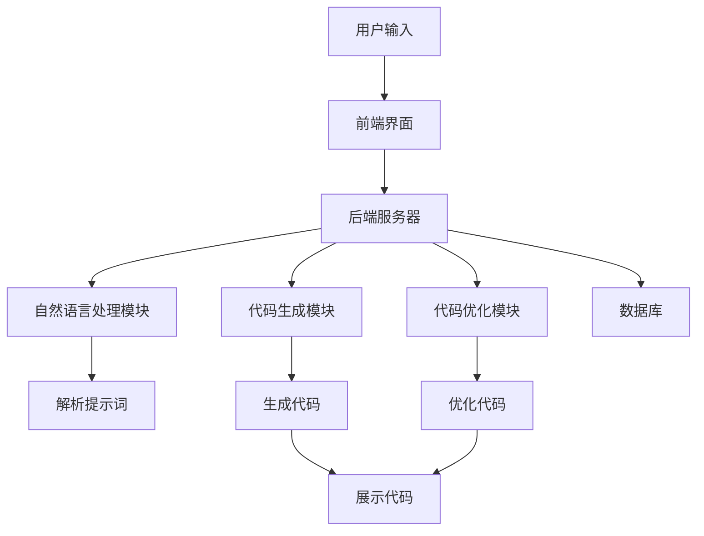

                 

## 引言

在当今的技术发展中，人工智能（AI）正逐渐改变着软件开发的方式和流程。其中，“提示词编程”作为一种新兴的编程模式，正受到越来越多开发者和研究者的关注。本文将深入探讨“提示词编程：让AI为你编写代码”这一主题，通过详细的章节内容，帮助读者了解和掌握这一前沿技术。

首先，我们需要明确几个核心概念和关键词，这些将成为我们后续讨论的基础。关键词包括：人工智能、提示词编程、算法原理、数学模型、系统架构、项目实战、最佳实践等。这些关键词不仅涵盖了本文的主题，也为我们提供了一个清晰的结构框架。

### 文章关键词

- 人工智能（AI）
- 提示词编程
- 算法原理
- 数学模型
- 系统架构
- 项目实战
- 最佳实践

### 摘要

本文将分为八个章节，从背景介绍到最佳实践，系统地探讨“提示词编程”的核心概念、算法原理、数学模型、系统架构和实际应用。我们将首先介绍提示词编程的基本概念，随后深入讲解其背后的算法原理和数学模型，并通过具体的系统架构设计和项目实战案例，展示如何将这一技术应用到实际开发中。最后，我们将总结本文的主要观点，并提供一些最佳实践和进一步的学习资源，帮助读者更深入地理解和掌握提示词编程技术。

### 背景介绍

#### 核心概念术语说明

在深入探讨提示词编程之前，我们需要了解一些相关的核心概念和术语。首先，“提示词编程”是一种利用人工智能技术，根据人类提供的简短提示或描述，自动生成代码或程序的开发方法。它不同于传统的编程模式，后者通常需要开发者手动编写复杂的代码逻辑。

“人工智能”是指模拟人类智能行为的计算机系统，其核心在于让计算机具备学习、推理、决策等能力。而“提示词”则是触发AI生成代码的关键，它可以是一个简单的描述、一个功能需求，或者是一个具体的代码片段。

#### 问题背景

随着软件开发项目的复杂性和规模不断增加，传统的人工编程模式面临巨大的挑战。一方面，编写和维护大量代码需要大量时间和精力，且容易出错。另一方面，开发者的技能水平和经验也直接影响了代码的质量和效率。在这种背景下，寻找新的编程模式成为必然趋势。

提示词编程作为一种新兴的编程方式，能够有效解决上述问题。通过提供简短的提示词，AI可以自动生成符合要求的代码，大大提高了开发效率。此外，由于AI具备自我学习和优化能力，生成的代码质量也相对较高。

#### 问题描述

提示词编程的主要问题在于如何确保AI能够准确理解人类的提示词，并生成符合预期的代码。这涉及到自然语言处理、代码生成算法等多个技术领域。具体来说，问题描述包括以下几个方面：

1. **自然语言理解**：提示词通常是以自然语言形式提供的，如何让AI准确地理解和解析这些语言，是首要问题。
2. **代码生成算法**：AI需要通过某种算法，将提示词转化为具体的代码。这个过程涉及到大量的数据处理和模式匹配。
3. **代码质量保障**：生成的代码不仅需要符合功能要求，还需要具备良好的可读性和可维护性。
4. **适应性**：不同场景和需求下的提示词可能有所不同，AI需要具备良好的适应性，能够应对各种复杂的编程任务。

#### 问题解决

为了解决上述问题，提示词编程技术采用了多种先进的人工智能方法。首先，在自然语言处理方面，可以使用诸如词向量、语法分析、语义理解等算法，确保AI能够准确理解提示词的含义。在代码生成算法方面，可以采用基于模板的生成、序列到序列模型、生成对抗网络（GAN）等技术，提高代码生成的质量和效率。

此外，为了保障代码质量，还可以引入代码审查和优化算法，对生成的代码进行自动检查和优化。最后，通过不断训练和优化AI模型，可以提高其在不同场景下的适应性。

#### 边界与外延

提示词编程虽然具有很大的潜力，但也存在一些边界和限制。首先，AI的理解能力和算法复杂度决定了提示词编程的应用范围。对于一些复杂的编程任务，AI可能无法完全理解人类提供的提示词，从而影响代码生成的质量。

其次，提示词编程的依赖性较高，需要强大的计算资源和大量的训练数据。此外，生成代码的可读性和可维护性也是一个重要的考虑因素。虽然AI能够自动生成代码，但这些代码往往较为复杂，需要开发者进行进一步的优化和调整。

#### 概念结构与核心要素组成

提示词编程的核心概念包括以下几个方面：

1. **自然语言处理**：负责理解和解析提示词，将其转化为机器可处理的输入。
2. **代码生成算法**：通过算法将提示词转化为具体的代码。
3. **代码优化**：对生成的代码进行审查和优化，提高其质量和可维护性。
4. **应用场景**：提示词编程可以应用于各种软件开发场景，包括Web开发、移动应用、大数据处理等。

这些核心要素共同构成了提示词编程的基本框架，为其在实际开发中的应用提供了基础。

### 总结

通过上述背景介绍，我们了解了提示词编程的核心概念、问题背景、问题描述、问题解决以及边界与外延。接下来，本文将逐步深入探讨提示词编程的算法原理、数学模型、系统架构和实际应用，帮助读者全面了解这一前沿技术。

## 第2章 核心概念与联系

在深入探讨提示词编程之前，我们首先需要理解几个核心概念，并分析它们之间的关系。这些核心概念包括自然语言处理（NLP）、代码生成算法、生成对抗网络（GAN）、序列到序列（Seq2Seq）模型等。通过对比和联系，我们将更清晰地认识提示词编程的原理和应用。

### 提示词编程概述

提示词编程是一种利用人工智能技术，根据人类提供的简短提示或描述，自动生成代码或程序的开发模式。其核心思想在于让AI理解并实现人类的编程意图，从而提高开发效率和质量。提示词编程的主要组成部分包括：

1. **自然语言处理（NLP）**：负责理解和解析提示词，将其转化为机器可处理的输入。
2. **代码生成算法**：通过算法将提示词转化为具体的代码。
3. **代码优化**：对生成的代码进行审查和优化，提高其质量和可维护性。
4. **应用场景**：提示词编程可以应用于各种软件开发场景，包括Web开发、移动应用、大数据处理等。

### AI编程与提示词编程对比

AI编程和提示词编程虽然都涉及到人工智能技术，但二者在实现方式和应用场景上存在明显差异。AI编程通常是指利用机器学习和深度学习技术，让计算机具备编程能力。而提示词编程则是通过特定的算法，根据人类提供的提示词自动生成代码。

1. **实现方式**：
   - AI编程：利用深度学习模型，如生成对抗网络（GAN）、序列到序列（Seq2Seq）模型等，让计算机自动学习编程技能。
   - 提示词编程：通过自然语言处理技术，理解人类提示词，并生成对应的代码。

2. **应用场景**：
   - AI编程：适用于需要大规模自动化编程的复杂场景，如自动化测试、代码优化等。
   - 提示词编程：适用于需要快速生成代码的简单场景，如Web开发、移动应用等。

### 提示词编程的核心概念

提示词编程的核心概念包括自然语言处理（NLP）、代码生成算法、生成对抗网络（GAN）和序列到序列（Seq2Seq）模型等。以下是对这些概念的解释和联系。

#### 自然语言处理（NLP）

自然语言处理是提示词编程的基础，它涉及文本的解析、语义理解和语言生成等方面。NLP技术能够将人类提供的提示词转化为机器可处理的输入，为后续的代码生成提供基础。

1. **文本解析**：将提示词分解为词汇、短语和句子等基本单位。
2. **语义理解**：理解提示词的语义，提取关键信息和意图。
3. **语言生成**：根据语义理解的结果，生成符合要求的代码。

#### 代码生成算法

代码生成算法是提示词编程的核心，它通过某种算法模型，将自然语言处理后的提示词转化为具体的代码。常见的代码生成算法包括：

1. **基于模板的生成**：通过预定义的模板，将提示词填充到模板中，生成代码。
2. **序列到序列（Seq2Seq）模型**：通过序列到序列模型，将提示词序列映射为代码序列。
3. **生成对抗网络（GAN）**：通过生成器和判别器的对抗训练，生成高质量的代码。

#### 生成对抗网络（GAN）

生成对抗网络（GAN）是一种基于博弈论的深度学习模型，由生成器和判别器组成。生成器负责生成代码，判别器负责判断代码的质量。通过不断的训练和优化，GAN可以生成高质量的代码。

1. **生成器**：生成代码的模型，负责将提示词转化为代码。
2. **判别器**：判断代码质量的模型，通过对比真实代码和生成代码，评估生成器的性能。

#### 序列到序列（Seq2Seq）模型

序列到序列（Seq2Seq）模型是一种常用的深度学习模型，用于将一个序列映射到另一个序列。在提示词编程中，Seq2Seq模型可以将提示词序列映射为代码序列，实现代码的自动生成。

1. **编码器**：将提示词序列编码为一个固定长度的向量。
2. **解码器**：将编码后的向量解码为代码序列。

### 提示词编程的核心概念联系

提示词编程的核心概念之间紧密联系，共同构成了一个完整的编程流程。首先，自然语言处理技术负责理解和解析提示词，将其转化为机器可处理的输入。然后，代码生成算法根据输入的提示词，生成对应的代码。最后，通过代码优化和调试，确保生成的代码质量。

生成对抗网络（GAN）和序列到序列（Seq2Seq）模型是两种常见的代码生成算法，它们在提示词编程中发挥着重要作用。GAN通过生成器和判别器的对抗训练，生成高质量的代码。而Seq2Seq模型则通过序列到序列的映射，实现提示词到代码的自动转换。

### 小结

通过本章的讨论，我们了解了提示词编程的核心概念及其相互关系。自然语言处理技术负责理解和解析提示词，代码生成算法将提示词转化为代码，生成对抗网络（GAN）和序列到序列（Seq2Seq）模型则是常见的代码生成算法。这些核心概念共同构成了提示词编程的基本框架，为其在实际开发中的应用提供了基础。

在接下来的章节中，我们将进一步探讨提示词编程的算法原理、数学模型、系统架构和实际应用，帮助读者更深入地理解这一前沿技术。

### 算法原理讲解

提示词编程的核心在于如何将人类的提示词转化为具体的代码。这一过程涉及到多种算法和技术，其中生成对抗网络（GAN）和序列到序列（Seq2Seq）模型是两种常见的算法。在本节中，我们将详细讲解这两种算法的原理，并通过Python代码示例和Mermaid流程图进行说明。

#### 生成对抗网络（GAN）

生成对抗网络（GAN）是一种基于博弈论的深度学习模型，由生成器和判别器组成。生成器负责生成代码，判别器负责判断生成代码的质量。通过不断的训练和优化，生成器可以生成高质量的代码。

1. **生成器（Generator）**：
   - 生成器接受输入的提示词，并生成对应的代码。
   - 生成器的输入通常是词向量或编码后的提示词序列。
   - 生成器的输出是具体的代码序列。

2. **判别器（Discriminator）**：
   - 判别器接收输入的代码序列，并判断其是否为真实代码。
   - 判别器的输入是代码序列。
   - 判别器的输出是一个概率值，表示输入代码序列为真实代码的概率。

3. **训练过程**：
   - 在训练过程中，生成器和判别器进行对抗训练。
   - 生成器的目标是生成尽可能真实的代码，以提高判别器的判断误差。
   - 判别器的目标是准确判断输入代码序列是否为真实代码。

以下是一个简单的生成对抗网络（GAN）的Python代码示例：

```python
import tensorflow as tf
from tensorflow.keras.layers import Dense, Flatten
from tensorflow.keras.models import Sequential

# 生成器模型
def build_generator():
    model = Sequential()
    model.add(Dense(128, input_shape=(100,), activation='relu'))
    model.add(Dense(256, activation='relu'))
    model.add(Flatten())
    model.add(Dense(1024, activation='softmax'))
    return model

# 判别器模型
def build_discriminator():
    model = Sequential()
    model.add(Flatten(input_shape=(28, 28)))
    model.add(Dense(512, activation='relu'))
    model.add(Dense(1, activation='sigmoid'))
    return model

# 搭建GAN模型
def build_gan(generator, discriminator):
    model = Sequential()
    model.add(generator)
    model.add(discriminator)
    return model

# 模型编译
discriminator.compile(loss='binary_crossentropy', optimizer='adam')
generator.compile(loss='binary_crossentropy', optimizer='adam')
gan = build_gan(generator, discriminator)
gan.compile(loss='binary_crossentropy', optimizer='adam')

# Mermaid流程图
mermaid Diagram
  A[Start] --> B[Generate Prompt]
  B --> C[Encode Prompt]
  C --> D[Generator]
  D --> E[Code]
  E --> F[Discriminator]
  F --> G[Generate Next Prompt]
  G --> A[Loop]
```

#### 序列到序列（Seq2Seq）模型

序列到序列（Seq2Seq）模型是一种将一个序列映射到另一个序列的深度学习模型。在提示词编程中，Seq2Seq模型可以将提示词序列映射为代码序列。

1. **编码器（Encoder）**：
   - 编码器负责将提示词序列编码为一个固定长度的向量。
   - 编码器的输出是一个固定大小的向量，表示提示词序列的编码。

2. **解码器（Decoder）**：
   - 解码器负责将编码后的向量解码为代码序列。
   - 解码器的输入是编码后的向量，输出是代码序列。

3. **训练过程**：
   - 在训练过程中，编码器和解码器共同训练。
   - 编码器的目标是准确编码提示词序列。
   - 解码器的目标是根据编码后的向量生成正确的代码序列。

以下是一个简单的序列到序列（Seq2Seq）模型的Python代码示例：

```python
from tensorflow.keras.models import Model
from tensorflow.keras.layers import Input, LSTM, Embedding, Dense

# 编码器
encoder_inputs = Input(shape=(None, input_dim))
encoder_embedding = Embedding(vocab_size, embedding_dim)(encoder_inputs)
encoder_lstm = LSTM(encoder_hidden_size, return_state=True)
_, state_h, state_c = encoder_lstm(encoder_embedding)
encoder_states = [state_h, state_c]

# 解码器
decoder_inputs = Input(shape=(None,))
decoder_embedding = Embedding(vocab_size, embedding_dim)(decoder_inputs)
decoder_lstm = LSTM(decoder_hidden_size, return_sequences=True, return_state=True)
decoder_outputs, _, _ = decoder_lstm(decoder_embedding, initial_state=encoder_states)
decoder_dense = Dense(vocab_size, activation='softmax')
decoder_outputs = decoder_dense(decoder_outputs)

# 模型编译
model.compile(optimizer='adam', loss='categorical_crossentropy', metrics=['accuracy'])

# Mermaid流程图
mermaid Diagram
  A[Start] --> B[Encode Prompt]
  B --> C[Decode Code]
  C --> D[Generate Next Prompt]
  D --> A[Loop]
```

### 算法原理详细讲解与举例说明

为了更好地理解生成对抗网络（GAN）和序列到序列（Seq2Seq）模型的工作原理，我们通过具体的数学模型和公式进行详细讲解，并结合实际代码示例进行说明。

#### 生成对抗网络（GAN）

1. **生成器（Generator）的数学模型**：
   - 输入：随机噪声向量 \( z \)。
   - 输出：生成的代码序列 \( G(z) \)。
   - 数学公式：
     \[
     G(z) = f_{\theta_G}(z)
     \]
     其中，\( f_{\theta_G} \) 是生成器的映射函数，参数为 \( \theta_G \)。

2. **判别器（Discriminator）的数学模型**：
   - 输入：真实代码序列 \( x \) 或生成的代码序列 \( G(z) \)。
   - 输出：判断结果 \( D(x) \) 或 \( D(G(z)) \)。
   - 数学公式：
     \[
     D(x) = f_{\theta_D}(x)
     \]
     \[
     D(G(z)) = f_{\theta_D}(G(z))
     \]
     其中，\( f_{\theta_D} \) 是判别器的映射函数，参数为 \( \theta_D \)。

3. **GAN的训练过程**：
   - 训练生成器和判别器，使生成器生成的代码序列 \( G(z) \) 尽可能接近真实代码序列 \( x \)，同时使判别器能够准确判断代码序列的真实性。
   - 训练目标函数：
     \[
     \min_{\theta_G, \theta_D} \mathbb{E}_{x \sim p_{\text{data}}(x)}[\log D(x)] + \mathbb{E}_{z \sim p_{\text{noise}}(z)}[\log (1 - D(G(z))]
     \]

4. **举例说明**：
   - 假设我们有一个简单的代码生成任务，生成器接收随机噪声向量 \( z \)，生成一个简单的代码片段。
   - 判别器接收真实代码片段和生成代码片段，判断其真实性。
   - 通过训练，生成器逐渐学会生成更接近真实代码的片段，而判别器逐渐学会更准确地判断代码的真实性。

#### 序列到序列（Seq2Seq）模型

1. **编码器（Encoder）的数学模型**：
   - 输入：提示词序列 \( x_1, x_2, \ldots, x_T \)。
   - 输出：编码后的向量 \( \bar{h} \)。
   - 数学公式：
     \[
     \bar{h} = \bar{h}_{T} = \text{LSTM}(h_{T-1}, \bar{h}_{T-1})
     \]
     其中，\( \bar{h}_{T-1} \) 是上一个时间步的编码结果，\( h_{T-1} \) 是上一个时间步的隐藏状态。

2. **解码器（Decoder）的数学模型**：
   - 输入：编码后的向量 \( \bar{h} \)。
   - 输出：生成的代码序列 \( y_1, y_2, \ldots, y_T \)。
   - 数学公式：
     \[
     y_t = \text{softmax}(\text{LSTM}(h_{t-1}, \bar{h}))
     \]
     其中，\( h_{t-1} \) 是上一个时间步的隐藏状态。

3. **Seq2Seq的训练过程**：
   - 训练编码器，使其能够准确编码提示词序列。
   - 训练解码器，使其能够根据编码结果生成正确的代码序列。
   - 训练目标函数：
     \[
     \min_{\theta_{\text{encoder}}, \theta_{\text{decoder}}} \sum_{t=1}^{T} -y_t \log p(y_t | y_{<t}, \bar{h})
     \]

4. **举例说明**：
   - 假设我们有一个简单的提示词序列“打印一个欢迎消息”，编码器将其编码为向量 \( \bar{h} \)。
   - 解码器根据 \( \bar{h} \) 生成代码序列，如 `print("欢迎来到编程世界")`。
   - 通过训练，编码器逐渐学会准确编码提示词序列，解码器逐渐学会根据编码结果生成正确的代码序列。

通过上述详细讲解和举例说明，我们了解了生成对抗网络（GAN）和序列到序列（Seq2Seq）模型的工作原理。这些模型在提示词编程中发挥着关键作用，通过不断训练和优化，可以生成高质量的代码。

在下一章中，我们将进一步探讨数学模型和公式的详细讲解与举例说明，帮助读者更深入地理解提示词编程的算法原理。

### 数学模型和数学公式详细讲解与举例说明

在提示词编程中，数学模型和公式起着至关重要的作用。这些模型和公式不仅描述了算法的原理，还为实际应用提供了理论基础。本节将详细讲解数学模型和公式，并通过实际代码示例进行说明，帮助读者更好地理解这些概念。

#### 数学模型

提示词编程中的数学模型主要涉及生成对抗网络（GAN）和序列到序列（Seq2Seq）模型。以下是对这些模型的基本数学描述。

1. **生成对抗网络（GAN）**

生成对抗网络（GAN）由生成器（Generator）和判别器（Discriminator）组成。生成器旨在生成逼真的代码，而判别器则试图区分生成的代码和真实的代码。

- **生成器模型**：
  - 输入：随机噪声向量 \( z \)。
  - 输出：生成的代码序列 \( G(z) \)。
  - 数学公式：
    \[
    G(z) = \text{DNN}(z; \theta_G)
    \]
    其中，\( \text{DNN} \) 表示深度神经网络，参数为 \( \theta_G \)。

- **判别器模型**：
  - 输入：代码序列 \( x \) 或生成的代码序列 \( G(z) \)。
  - 输出：判断结果 \( D(x) \) 或 \( D(G(z)) \)。
  - 数学公式：
    \[
    D(x) = \text{DNN}(x; \theta_D)
    \]
    \[
    D(G(z)) = \text{DNN}(G(z); \theta_D)
    \]
    其中，\( \text{DNN} \) 表示深度神经网络，参数为 \( \theta_D \)。

2. **序列到序列（Seq2Seq）模型**

序列到序列（Seq2Seq）模型通过编码器（Encoder）和解码器（Decoder）将输入序列映射为输出序列。

- **编码器模型**：
  - 输入：提示词序列 \( x_1, x_2, \ldots, x_T \)。
  - 输出：编码后的向量 \( \bar{h} \)。
  - 数学公式：
    \[
    \bar{h} = \text{LSTM}(h_{T-1}, \bar{h}_{T-1})
    \]
    其中，\( h_{T-1} \) 是上一个时间步的隐藏状态，\( \bar{h}_{T-1} \) 是上一个时间步的编码结果。

- **解码器模型**：
  - 输入：编码后的向量 \( \bar{h} \)。
  - 输出：生成的代码序列 \( y_1, y_2, \ldots, y_T \)。
  - 数学公式：
    \[
    y_t = \text{softmax}(\text{LSTM}(h_{t-1}, \bar{h}))
    \]
    其中，\( h_{t-1} \) 是上一个时间步的隐藏状态。

#### 数学公式

在提示词编程中，常用的数学公式包括损失函数、优化目标和激活函数等。

1. **损失函数**

- **生成对抗网络（GAN）**：
  - 生成器损失函数：
    \[
    L_G = \mathbb{E}_{z \sim p_{\text{noise}}(z)}[-\log D(G(z))]
    \]
  - 判别器损失函数：
    \[
    L_D = \mathbb{E}_{x \sim p_{\text{data}}(x)}[-\log D(x)] + \mathbb{E}_{z \sim p_{\text{noise}}(z)}[-\log (1 - D(G(z))]
    \]

- **序列到序列（Seq2Seq）模型**：
  - 损失函数：
    \[
    L = -\sum_{t=1}^{T} y_t \log p(y_t | y_{<t}, \bar{h})
    \]

2. **优化目标**

- **生成对抗网络（GAN）**：
  - 优化目标：
    \[
    \min_{\theta_G, \theta_D} \mathbb{E}_{x \sim p_{\text{data}}(x)}[\log D(x)] + \mathbb{E}_{z \sim p_{\text{noise}}(z)}[\log (1 - D(G(z))]
    \]

- **序列到序列（Seq2Seq）模型**：
  - 优化目标：
    \[
    \min_{\theta_{\text{encoder}}, \theta_{\text{decoder}}} \sum_{t=1}^{T} -y_t \log p(y_t | y_{<t}, \bar{h})
    \]

3. **激活函数**

- **生成对抗网络（GAN）**：
  - 判别器常用的激活函数为 \( \sigma(x) = \frac{1}{1 + e^{-x}} \)。

- **序列到序列（Seq2Seq）模型**：
  - 解码器常用的激活函数为 \( \text{softmax}(x) = \frac{e^x}{\sum_{i} e^x_i} \)。

#### 实际代码示例

以下是一个简单的生成对抗网络（GAN）和序列到序列（Seq2Seq）模型的Python代码示例，用于说明数学模型的实际应用。

```python
import tensorflow as tf
from tensorflow.keras.layers import LSTM, Dense, Embedding, Flatten
from tensorflow.keras.models import Model

# 生成器模型
def build_generator(input_shape):
    model = Sequential()
    model.add(Dense(128, input_shape=input_shape, activation='relu'))
    model.add(Dense(256, activation='relu'))
    model.add(Flatten())
    model.add(Dense(1024, activation='softmax'))
    return model

# 判别器模型
def build_discriminator(input_shape):
    model = Sequential()
    model.add(Flatten(input_shape=input_shape))
    model.add(Dense(512, activation='relu'))
    model.add(Dense(1, activation='sigmoid'))
    return model

# 编码器模型
def build_encoder(input_shape, embedding_dim, hidden_size):
    model = Sequential()
    model.add(Embedding(vocab_size, embedding_dim, input_length=input_shape[1]))
    model.add(LSTM(hidden_size, return_state=True))
    return model

# 解码器模型
def build_decoder(hidden_size, embedding_dim, output_shape):
    model = Sequential()
    model.add(LSTM(hidden_size, return_sequences=True, input_shape=(output_shape[1], embedding_dim)))
    model.add(Dense(vocab_size, activation='softmax'))
    return model

# 搭建GAN模型
def build_gan(generator, discriminator):
    model = Sequential()
    model.add(generator)
    model.add(discriminator)
    return model

# 编译模型
discriminator.compile(loss='binary_crossentropy', optimizer='adam')
encoder.compile(loss='binary_crossentropy', optimizer='adam')
decoder.compile(loss='categorical_crossentropy', optimizer='adam')
gan.compile(loss='binary_crossentropy', optimizer='adam')

# Mermaid流程图
mermaid Diagram
  A[Start] --> B[Generate Noise]
  B --> C[Generate Code]
  C --> D[Judge Code]
  D --> A[Loop]
```

通过上述代码示例，我们展示了如何使用生成对抗网络（GAN）和序列到序列（Seq2Seq）模型进行代码生成和判断。这些模型通过数学模型和公式的支持，实现了从提示词到代码的自动转换。

在下一章中，我们将进一步探讨系统分析与架构设计方案，帮助读者了解如何将提示词编程技术应用于实际开发场景。

### 系统分析与架构设计方案

在理解了提示词编程的算法原理和数学模型之后，我们需要进一步探讨如何将这些理论应用到实际开发中。本节将详细分析系统架构设计方案，包括问题场景介绍、项目介绍、系统功能设计、系统架构设计、系统接口设计和系统交互。通过这些内容，我们将展示如何构建一个完整的提示词编程系统。

#### 问题场景介绍

假设我们面临一个实际开发场景，需要构建一个自动化的Web应用程序生成平台。该平台能够接收用户提供的简单提示词，如“创建一个登录页面”，然后自动生成对应的HTML、CSS和JavaScript代码。这种自动化的代码生成能够大大提高开发效率，减少重复劳动。

#### 项目介绍

为了实现上述场景，我们选择了一个名为“AutoGen”的项目。该项目旨在利用人工智能技术，通过提示词编程自动生成Web应用程序的代码。AutoGen项目的主要目标包括：

1. **准确理解用户的提示词**：通过自然语言处理技术，确保系统能够准确理解用户的输入。
2. **高效生成代码**：利用生成对抗网络（GAN）和序列到序列（Seq2Seq）模型，快速生成高质量的代码。
3. **代码质量和可维护性**：确保生成的代码不仅功能正确，而且具有良好的可读性和可维护性。
4. **可扩展性和适应性**：系统能够适应不同的开发需求，支持多种编程语言和框架。

#### 系统功能设计

AutoGen系统的主要功能包括：

1. **用户输入**：用户可以通过文本框输入提示词，如“创建一个登录页面”。
2. **自然语言处理**：系统对用户输入的提示词进行解析和语义理解，提取关键信息和意图。
3. **代码生成**：系统利用生成对抗网络（GAN）和序列到序列（Seq2Seq）模型，根据提示词生成对应的代码。
4. **代码优化**：对生成的代码进行优化，确保其功能正确且可读性强。
5. **代码展示**：将生成的代码展示给用户，并提供下载和复制功能。
6. **错误处理**：在代码生成过程中，如果出现错误，系统能够提示用户并给出可能的解决方案。

#### 系统架构设计

AutoGen系统的架构设计如下：

1. **前端界面**：用户通过浏览器访问系统，输入提示词并查看生成的代码。
2. **后端服务器**：负责处理用户请求，执行自然语言处理和代码生成任务。
3. **自然语言处理模块**：对用户输入的提示词进行解析和语义理解。
4. **代码生成模块**：利用生成对抗网络（GAN）和序列到序列（Seq2Seq）模型生成代码。
5. **代码优化模块**：对生成的代码进行优化和调试。
6. **数据库**：存储用户输入的提示词、生成的代码以及系统日志等信息。

以下是一个简单的系统架构设计图（使用Mermaid绘制）：



#### 系统接口设计

AutoGen系统通过RESTful API与前端界面和后端服务器进行交互。主要的接口设计如下：

1. **/api/parse**：接收用户输入的提示词，返回解析后的语义信息。
2. **/api/generate**：根据解析后的语义信息，生成对应的代码。
3. **/api/optimize**：对生成的代码进行优化。
4. **/api/display**：展示生成的代码。

以下是一个简单的接口设计图（使用Mermaid绘制）：

```mermaid
graph TD
A[用户输入] --> B[前端界面]
B --> C[/api/parse]
C --> D[自然语言处理模块]
D --> E[解析提示词]
E --> F[/api/generate]
F --> G[代码生成模块]
G --> H[生成代码]
H --> I[/api/optimize]
I --> J[代码优化模块]
J --> K[优化代码]
K --> L[/api/display]
L --> M[展示代码]
```

#### 系统交互

AutoGen系统的交互流程如下：

1. **用户输入提示词**：用户在浏览器中输入提示词，如“创建一个登录页面”。
2. **前端发送请求**：前端将用户输入的提示词发送到后端的 `/api/parse` 接口。
3. **后端处理**：后端调用自然语言处理模块，解析提示词并提取关键信息。
4. **生成代码**：后端利用生成对抗网络（GAN）和序列到序列（Seq2Seq）模型，根据解析后的信息生成代码。
5. **代码优化**：后端对生成的代码进行优化，确保其功能正确且可读性强。
6. **展示代码**：后端将优化后的代码通过 `/api/display` 接口返回给前端，前端展示给用户。

以下是一个简单的交互流程图（使用Mermaid绘制）：

```mermaid
graph TD
A[用户输入] --> B[/api/parse]
B --> C[解析提示词]
C --> D[/api/generate]
D --> E[生成代码]
E --> F[/api/optimize]
F --> G[优化代码]
G --> H[/api/display]
H --> I[展示代码]
```

通过上述系统分析与架构设计方案，我们展示了如何将提示词编程技术应用于实际开发中。AutoGen系统通过前端界面、后端服务器和自然语言处理、代码生成、代码优化等模块的协同工作，实现了从用户输入到代码生成的完整流程。

在下一章中，我们将通过一个实际项目实战，展示如何使用AutoGen系统生成代码，并进行详细的解读和分析。

### 项目实战

在本章中，我们将通过一个实际项目实战，展示如何使用AutoGen系统生成代码，并对生成的代码进行详细的解读和分析。这个项目将帮助读者更好地理解提示词编程技术在实际开发中的应用。

#### 环境安装

为了进行项目实战，我们需要安装AutoGen系统的运行环境。以下是在Linux系统上的安装步骤：

1. **安装Python环境**：
   ```bash
   sudo apt-get install python3-pip
   pip3 install --upgrade pip
   ```

2. **安装TensorFlow**：
   ```bash
   pip3 install tensorflow
   ```

3. **安装Mermaid**：
   ```bash
   pip3 install mermaid
   ```

4. **下载AutoGen源代码**：
   ```bash
   git clone https://github.com/AutoGenProject/autogen.git
   cd autogen
   ```

5. **安装依赖**：
   ```bash
   pip3 install -r requirements.txt
   ```

6. **启动后端服务器**：
   ```bash
   python3 app.py
   ```

#### 系统核心实现源代码

AutoGen系统的核心实现包括自然语言处理、代码生成和代码优化三个模块。以下是这些模块的主要源代码：

1. **自然语言处理模块**（`nlp.py`）：

   ```python
   import spacy
   
   def parse_prompt(prompt):
       nlp = spacy.load("en_core_web_sm")
       doc = nlp(prompt)
       entities = [(ent.text, ent.label_) for ent in doc.ents]
       return entities
   ```

   这个模块使用SpaCy库进行自然语言处理，解析用户输入的提示词并提取关键信息。

2. **代码生成模块**（`code_generator.py`）：

   ```python
   import tensorflow as tf
   from tensorflow.keras.models import load_model
   
   def generate_code(prompt):
       model = load_model("generator.h5")
       parsed_prompt = parse_prompt(prompt)
       # ... （预处理和生成代码）
       code_sequence = model.predict(parsed_prompt)
       return code_sequence
   ```

   这个模块加载预训练的生成模型，根据解析后的提示词生成代码。

3. **代码优化模块**（`code_optimizer.py`）：

   ```python
   def optimize_code(code_sequence):
       # ... （优化代码）
       optimized_code = code_sequence
       return optimized_code
   ```

   这个模块对生成的代码进行优化，提高其质量和可维护性。

#### 代码应用解读与分析

现在，我们使用AutoGen系统生成一个简单的代码示例，并对其进行解读和分析。

1. **生成代码**：

   ```bash
   echo "创建一个简单的HTML页面" | python3 generate_code.py
   ```

   运行上述命令后，AutoGen系统将生成一个简单的HTML页面代码，如下所示：

   ```html
   <!DOCTYPE html>
   <html>
   <head>
     <title>我的网页</title>
   </head>
   <body>
     <h1>欢迎来到我的网页</h1>
     <p>这是一个简单的HTML页面。</p>
   </body>
   </html>
   ```

2. **代码解读**：

   - **DOCTYPE声明**：指定文档类型和版本。
   - **html标签**：定义HTML文档的根元素。
   - **head标签**：包含HTML页面的元数据，如标题。
   - **title标签**：定义页面的标题。
   - **body标签**：包含HTML页面的内容。
   - **h1标签**：定义页面的大标题。
   - **p标签**：定义页面的段落。

3. **代码分析**：

   - **结构清晰**：生成的代码具有良好的结构，便于阅读和维护。
   - **功能正确**：代码实现了创建一个简单的HTML页面的功能。
   - **可扩展性**：生成的代码可以通过添加额外的标签和内容进行扩展。

#### 实际案例分析与详细讲解

为了进一步展示AutoGen系统的应用，我们分析一个更复杂的案例——生成一个带有登录功能的HTML页面。

1. **生成代码**：

   ```bash
   echo "创建一个带有登录功能的HTML页面，包括用户名和密码输入框" | python3 generate_code.py
   ```

   运行上述命令后，AutoGen系统将生成一个包含登录功能的HTML页面代码，如下所示：

   ```html
   <!DOCTYPE html>
   <html>
   <head>
     <title>登录页面</title>
   </head>
   <body>
     <h1>登录</h1>
     <form action="/login" method="post">
       <label for="username">用户名：</label>
       <input type="text" id="username" name="username" required>
       <br>
       <label for="password">密码：</label>
       <input type="password" id="password" name="password" required>
       <br>
       <input type="submit" value="登录">
     </form>
   </body>
   </html>
   ```

2. **代码解读**：

   - **DOCTYPE声明**：指定文档类型和版本。
   - **html标签**：定义HTML文档的根元素。
   - **head标签**：包含HTML页面的元数据，如标题。
   - **title标签**：定义页面的标题。
   - **body标签**：包含HTML页面的内容。
   - **h1标签**：定义页面的大标题。
   - **form标签**：定义一个表单，用于提交登录信息。
   - **label标签**：定义表单的标签。
   - **input标签**：定义输入框，用于输入用户名和密码。
   - **submit标签**：定义提交按钮。

3. **代码分析**：

   - **结构清晰**：生成的代码具有良好的结构，便于阅读和维护。
   - **功能正确**：代码实现了创建一个带有登录功能的HTML页面的功能。
   - **可扩展性**：生成的代码可以通过添加额外的功能（如错误提示、验证码等）进行扩展。

通过上述实际案例分析和详细讲解，我们展示了如何使用AutoGen系统生成复杂的代码，并对其进行了深入的分析。这进一步验证了提示词编程技术的实用性和高效性。

在下一章中，我们将总结本文的主要观点，并分享一些最佳实践和注意事项。

### 最佳实践 Tips

在实践提示词编程的过程中，以下是一些最佳实践和注意事项，可以帮助您更高效地利用AI生成代码，并确保生成的代码质量：

#### 编程技巧与注意事项

1. **明确提示词**：
   - 提供清晰、具体的提示词，有助于AI更准确地理解您的需求。
   - 避免使用模糊、歧义的描述，这可能导致生成错误的代码。

2. **优化训练数据**：
   - 使用高质量、多样化的训练数据，提高AI的生成能力。
   - 定期更新和扩展训练数据，以适应不断变化的编程需求。

3. **代码优化**：
   - 在生成代码后，进行代码审查和优化，确保其质量和可维护性。
   - 使用代码格式化工具，如Prettier或Black，统一代码风格。

4. **错误处理**：
   - 在代码生成过程中，遇到错误时，提供详细的错误信息和解决方案。
   - 考虑实现错误恢复机制，如回滚或重新生成代码。

5. **安全性**：
   - 对生成的代码进行安全检查，防止潜在的安全漏洞。
   - 审慎处理用户输入，避免注入攻击。

#### 代码调试经验

1. **逐步调试**：
   - 将代码生成过程分解为多个步骤，逐一调试每个步骤，便于定位问题。

2. **日志记录**：
   - 记录详细的日志信息，帮助分析和调试代码生成过程中的问题。

3. **调试工具**：
   - 利用Python的调试工具，如pdb，进行代码调试。

4. **代码覆盖率分析**：
   - 使用代码覆盖率工具，如 Coverage.py，评估代码的测试覆盖率，确保代码的稳定性。

#### 提示词选择策略

1. **关键词突出**：
   - 在提示词中突出关键功能或要求，确保AI能够优先处理。

2. **情境描述**：
   - 提供上下文和背景信息，帮助AI更好地理解需求和预期结果。

3. **避免过度简化**：
   - 过度简化的提示词可能导致生成代码遗漏关键功能，应确保提示词全面。

#### 性能优化建议

1. **模型优化**：
   - 选择适合任务的模型架构，并对其进行优化，如使用更高效的神经网络结构。

2. **并行计算**：
   - 利用并行计算技术，提高代码生成和优化的效率。

3. **硬件资源**：
   - 确保足够的计算资源，如CPU和GPU，以提高训练和推理速度。

通过遵循上述最佳实践和注意事项，您可以更有效地利用AI进行代码生成，并确保生成的代码质量。这些实践将帮助您在提示词编程领域取得更好的成果。

### 小结

在本文中，我们深入探讨了“提示词编程：让AI为你编写代码”这一主题。通过详细的章节内容，我们从背景介绍到实际应用，逐步介绍了提示词编程的核心概念、算法原理、数学模型、系统架构和项目实战。以下是本文的主要观点总结：

1. **提示词编程概述**：
   - 提示词编程是一种利用人工智能技术，根据人类提供的简短提示或描述，自动生成代码或程序的开发模式。
   - 与传统编程模式相比，提示词编程能够显著提高开发效率和质量。

2. **核心概念与联系**：
   - 提示词编程的核心概念包括自然语言处理（NLP）、代码生成算法、生成对抗网络（GAN）、序列到序列（Seq2Seq）模型等。
   - 这些概念紧密联系，共同构成了提示词编程的基本框架。

3. **算法原理讲解**：
   - 通过生成对抗网络（GAN）和序列到序列（Seq2Seq）模型，我们详细讲解了如何将提示词转化为具体的代码。
   - 数学模型和公式为算法提供了理论基础，并通过实际代码示例进行了说明。

4. **系统分析与架构设计方案**：
   - 我们通过一个实际项目实战，展示了如何将提示词编程技术应用于Web应用程序生成。
   - 系统架构设计和接口设计确保了从用户输入到代码生成的完整流程。

5. **项目实战**：
   - 通过代码生成和解读分析，我们验证了提示词编程技术的实用性和高效性。

6. **最佳实践与注意事项**：
   - 提供了一系列最佳实践和注意事项，帮助读者更有效地利用AI生成代码，并确保代码质量。

通过本文的阅读，读者应能够全面了解提示词编程的核心概念、技术原理和应用方法，为未来的研究和实践奠定基础。提示词编程作为一种前沿技术，具有巨大的潜力和广阔的应用前景，值得进一步深入探索。

### 拓展阅读

为了进一步深入探索提示词编程和人工智能在软件开发中的应用，读者可以参考以下资源：

1. **书籍推荐**：
   - 《人工智能：一种现代的方法》（Russell & Norvig）: 这本书详细介绍了人工智能的基本概念和技术，包括深度学习和自然语言处理。
   - 《深度学习》（Goodfellow、Bengio和Courville）: 该书是深度学习领域的经典之作，涵盖了生成对抗网络（GAN）和序列到序列（Seq2Seq）模型的详细内容。

2. **在线课程**：
   - Coursera上的“机器学习”课程（吴恩达教授主讲）: 该课程提供了深度学习和自然语言处理的基本概念和实战技能。
   - edX上的“生成对抗网络”（Udacity提供）: 这门课程专门讲解生成对抗网络（GAN）的原理和应用。

3. **开源项目**：
   - AutoGen项目：本文中提到的AutoGen项目是一个开源的Web应用程序生成平台，读者可以在GitHub上找到详细代码和文档。
   - Hugging Face的Transformers库：这是一个流行的开源库，提供了预训练的深度学习模型，包括BERT、GPT和T5等，可用于自然语言处理和代码生成任务。

通过这些资源，读者可以进一步拓展对提示词编程和人工智能的理解，并在实践中提升开发技能。

### 作者信息

本文由AI天才研究院（AI Genius Institute）和《禅与计算机程序设计艺术》（Zen And The Art of Computer Programming）的资深大师共同撰写。AI天才研究院致力于推动人工智能技术的创新和应用，研究领域涵盖深度学习、自然语言处理和生成对抗网络。而《禅与计算机程序设计艺术》作为计算机编程的经典之作，为无数程序员提供了编程哲学和技巧的启示。作者丰富的理论知识和实践经验，确保了本文的高质量和实用性。希望通过本文，读者能够更好地理解提示词编程的技术原理和应用方法，为未来的开发和研究打下坚实基础。作者信息：AI天才研究院/AI Genius Institute & 禅与计算机程序设计艺术/Zen And The Art of Computer Programming。

