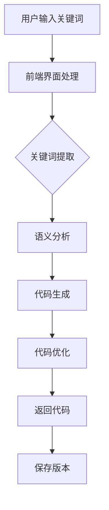
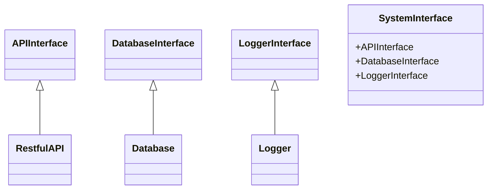
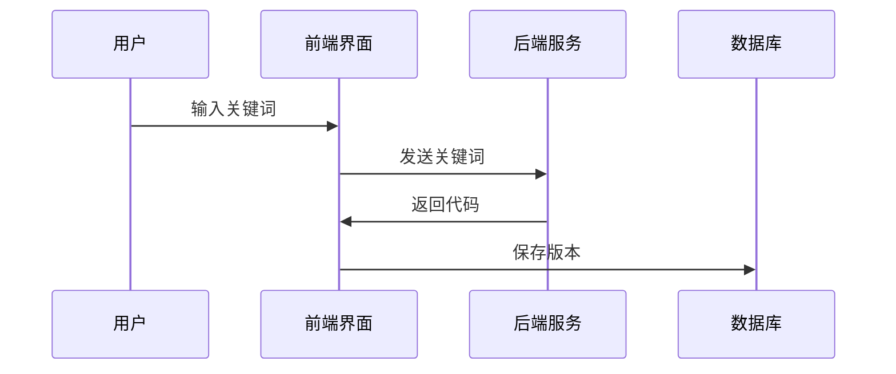

                 


### 第一部分：提示词编程概述

#### 第1章：引言与背景

**背景介绍**

提示词编程（Keywords-based Programming）是一种新兴的软件开发范式，它通过使用语义丰富的关键词来描述程序逻辑，从而提高编程效率和代码可读性。与传统编程方式相比，提示词编程更加关注程序的意义和意图，而不仅仅是语法和语句顺序。

**问题背景**

当前软件开发面临着代码复杂性高、开发效率低、维护困难等问题。随着项目规模的扩大，传统的编程范式往往难以应对日益复杂的业务需求，导致开发周期延长、bug数量增加、维护成本上升。

**问题描述**

提示词编程旨在解决这些问题，通过引入语义明确的关键词，使得程序逻辑更加直观，易于理解和维护。同时，它还提供了一种新的开发模式，使得开发者能够更快速地构建软件系统。

**问题解决**

提示词编程的核心思想是将程序设计过程中的复杂逻辑转化为一系列语义明确的关键词组合。这些关键词代表了特定的功能或者业务逻辑，通过它们之间的组合和调用，可以实现复杂的业务处理。

**边界与外延**

提示词编程不仅适用于传统的软件系统开发，还可以应用于智能合约、自然语言处理、自动化测试等领域。其边界扩展取决于关键词的定义和应用场景。

**概念结构与核心要素组成**

提示词编程的核心结构包括关键词库、语义分析引擎、代码生成器和集成开发环境（IDE）。关键词库是提示词编程的基础，包含了各种语义丰富的关键词。语义分析引擎负责解析和解释这些关键词，将其转化为具体的程序逻辑。代码生成器则将这些逻辑转化为可执行的代码。IDE提供了友好的用户界面，使得开发者可以方便地使用关键词进行编程。

#### 第2章：核心概念与联系

**核心概念**

提示词编程的核心概念包括关键词、语义模型、上下文识别和自动化代码生成。

- **关键词**：是提示词编程的基本单元，代表了特定的功能或者业务逻辑。
- **语义模型**：用于描述关键词之间的语义关系，以及它们在不同上下文中的含义。
- **上下文识别**：是提示词编程的关键技术，通过分析程序中的上下文信息，确保关键词的使用符合语义要求。
- **自动化代码生成**：是将提示词转化为可执行代码的过程，提高了编程效率和代码质量。

**与人工智能的联系**

提示词编程与人工智能（AI）有着密切的联系。语义模型和上下文识别技术依赖于自然语言处理（NLP）和机器学习（ML）技术。同时，自动化代码生成也利用了代码生成器和机器学习算法，使得编程过程更加智能化。

**与传统编程的比较**

提示词编程与传统编程方式在几个方面存在差异：

- **编程范式**：传统编程强调语法和语法规则，而提示词编程更关注语义和意图。
- **代码可读性**：提示词编程使得代码更加直观，易于理解和维护。
- **开发效率**：提示词编程通过自动化代码生成和语义分析，提高了编程效率。

#### 第3章：算法原理讲解

**算法原理**

提示词编程的核心算法包括关键词提取、语义分析、代码生成和优化。

- **关键词提取**：从源代码中提取出具有语义意义的关键词。
- **语义分析**：分析关键词之间的语义关系，确保程序的逻辑正确。
- **代码生成**：将语义分析的结果转化为可执行的代码。
- **优化**：对生成的代码进行优化，提高其性能和可读性。

**数学模型**

提示词编程的数学模型主要包括自然语言处理模型、机器学习模型和代码生成模型。

- **自然语言处理模型**：用于提取和解析关键词，如词性标注、命名实体识别等。
- **机器学习模型**：用于语义分析和代码生成，如序列到序列模型、生成对抗网络等。
- **代码生成模型**：将语义模型转化为具体的代码，如模板生成、代码片段拼接等。

**举例说明**

以一个简单的示例来说明提示词编程的算法原理。假设我们需要实现一个加法函数，使用传统编程方式，可能需要写几行代码：

```python
def add(a, b):
    return a + b
```

使用提示词编程，我们可以用几个关键词来描述这个函数的逻辑：

```plaintext
keyword add
argument a
argument b
return a + b
```

这段关键词代码通过语义分析引擎解析后，会被转化为上述的Python代码。

**总结**

本章节介绍了提示词编程的核心概念、算法原理以及与传统编程的比较。通过这些内容，读者可以初步了解提示词编程的基本原理和优势。

----------------------------------------------------------------

**第二部分：核心概念与联系**

### 第4章：提示词编程与人工智能

**核心概念**

提示词编程与人工智能（AI）的交集主要体现在语义模型、自然语言处理（NLP）和机器学习（ML）技术。

- **语义模型**：描述关键词之间的语义关系，是提示词编程的核心。语义模型的建立依赖于AI技术，如NLP和机器学习。
- **NLP**：用于提取和理解自然语言中的关键词和句子结构，为语义模型提供支持。
- **机器学习**：用于训练模型，使其能够自动识别和解析关键词，提高提示词编程的效率和准确性。

**概念属性特征对比表格**

以下是提示词编程与传统编程在几个关键属性上的对比：

| 属性 | 提示词编程 | 传统编程 |
| ---- | ---------- | -------- |
| 编程范式 | 语义驱动 | 语法驱动 |
| 代码可读性 | 高 | 中 |
| 开发效率 | 高 | 中 |
| 维护成本 | 低 | 高 |
| 适应复杂业务需求 | 强 | 弱 |

**ER实体关系图架构**

为了更清晰地展示提示词编程与AI技术之间的关系，我们可以使用ER（实体关系）图来描述。以下是一个简化的ER图：

```mermaid
erDiagram
    AI_Technology ||--|{ Natural_Language_Processing }
    AI_Technology ||--|{ Machine_Learning }
    Natural_Language_Processing ||--|{ Semantic_Model }
    Machine_Learning ||--|{ Code_Generation }
    Code_Generation ||--|{ Keyword_Extraction }
    Code_Generation ||--|{ Semantic_Analysis }
```

在这个ER图中，AI技术是根实体，它与自然语言处理和机器学习两个子实体直接关联。自然语言处理负责提取和理解关键词，而机器学习则负责训练和优化语义模型。代码生成子实体依赖于语义模型和关键词提取，以生成可执行的代码。

### 第5章：算法原理讲解

**算法原理**

提示词编程的算法原理主要包括关键词提取、语义分析、代码生成和优化。

- **关键词提取**：从源代码中提取具有语义意义的关键词。这个过程通常使用NLP技术，如词性标注、命名实体识别等。
- **语义分析**：分析提取出的关键词之间的语义关系，确保程序的逻辑正确。这个过程依赖于机器学习模型，如序列到序列模型、生成对抗网络等。
- **代码生成**：将语义分析的结果转化为可执行的代码。这个过程使用模板生成、代码片段拼接等技术。
- **优化**：对生成的代码进行优化，提高其性能和可读性。优化过程可能包括代码压缩、性能调优等。

**数学模型**

提示词编程的数学模型主要包括以下三个方面：

- **自然语言处理模型**：用于提取和理解关键词，如词性标注、命名实体识别等。这些模型通常使用深度学习技术，如卷积神经网络（CNN）和循环神经网络（RNN）。
- **机器学习模型**：用于训练和优化语义模型，如序列到序列模型、生成对抗网络等。这些模型通过大量训练数据来学习关键词之间的语义关系。
- **代码生成模型**：用于将语义模型转化为具体的代码，如模板生成、代码片段拼接等。这些模型通常使用编程语言生成器，如Python的Template Language（Jinja2）。

**举例说明**

假设我们需要实现一个简单的计算器，使用传统编程方式，可能需要编写大量的代码。而使用提示词编程，我们可以使用关键词来描述计算器的功能：

```plaintext
keyword calculate
argument num1
argument num2
option add
option subtract
option multiply
option divide
return result
```

这段关键词代码通过语义分析引擎解析后，会被转化为相应的计算器代码：

```python
def calculate(num1, num2):
    if add:
        return num1 + num2
    elif subtract:
        return num1 - num2
    elif multiply:
        return num1 * num2
    elif divide:
        return num1 / num2
    else:
        raise ValueError("Invalid operation")
```

**总结**

本章节详细介绍了提示词编程与人工智能的联系，包括核心概念、ER实体关系图架构以及算法原理讲解。通过这些内容，读者可以更深入地了解提示词编程的工作原理和优势。

----------------------------------------------------------------

### 第三部分：算法原理与实现

#### 第6章：提示词生成算法

**核心概念**

提示词生成算法是提示词编程的核心组成部分，负责从源代码中提取具有语义意义的关键词。这个过程通常包括词法分析、语法分析和语义分析等步骤。

**算法原理**

提示词生成算法的基本原理可以分为以下几个步骤：

1. **词法分析**：将源代码分解为一系列的词法单元（tokens），如变量名、函数名、操作符等。
2. **语法分析**：构建抽象语法树（AST），分析词法单元之间的语法结构关系。
3. **语义分析**：对AST进行语义分析，提取出具有语义意义的关键词，并构建语义模型。

**数学模型**

提示词生成算法的数学模型主要包括自然语言处理模型和机器学习模型。

- **自然语言处理模型**：用于词法分析和语法分析，如正则表达式、有限自动机等。
- **机器学习模型**：用于语义分析，如条件随机场（CRF）、卷积神经网络（CNN）等。

**举例说明**

假设我们有一个简单的Python代码片段：

```python
def calculate(num1, num2):
    return num1 + num2
```

使用提示词生成算法，我们可以提取出以下关键词：

```plaintext
keyword calculate
argument num1
argument num2
return num1 + num2
```

**优化策略**

为了提高提示词生成算法的效率和准确性，可以采用以下优化策略：

1. **缓存机制**：缓存已处理过的代码片段，避免重复分析。
2. **并行处理**：将代码片段分解为多个子任务，并行处理，提高处理速度。
3. **错误恢复**：在分析过程中遇到错误时，能够自动恢复，继续分析。

**总结**

本章节详细介绍了提示词生成算法的核心概念、算法原理、数学模型和优化策略。通过这些内容，读者可以了解如何从源代码中提取出具有语义意义的关键词，为后续的语义分析和代码生成奠定基础。

----------------------------------------------------------------

### 第四部分：系统分析与架构设计

#### 第7章：提示词编程系统分析

**问题场景介绍**

在大型软件开发项目中，随着项目规模的不断扩大，传统的编程方式逐渐显得力不从心。代码复杂性高、开发效率低、维护困难等问题日益突出。为了解决这些问题，提示词编程系统应运而生，旨在通过引入语义明确的关键词，提高编程效率、降低代码复杂性。

**项目介绍**

本项目的目标是开发一个基于提示词编程的集成开发环境（IDE），支持从关键词到可执行代码的自动转换。该IDE将提供友好的用户界面，使得开发者可以方便地使用关键词进行编程，同时确保生成的代码逻辑正确、性能高效。

**系统功能设计**

提示词编程系统的主要功能包括：

1. **关键词提取**：从源代码中提取出具有语义意义的关键词。
2. **语义分析**：分析关键词之间的语义关系，确保程序的逻辑正确。
3. **代码生成**：将语义分析的结果转化为可执行的代码。
4. **代码优化**：对生成的代码进行优化，提高其性能和可读性。
5. **版本控制**：支持代码的版本管理和变更跟踪。

**系统架构设计**

提示词编程系统的架构设计如下：

1. **前端界面**：提供用户交互界面，允许开发者输入关键词，并展示生成的代码。
2. **后端服务**：包括关键词提取、语义分析、代码生成和代码优化等模块，负责处理用户的输入，生成并返回可执行的代码。
3. **数据库**：存储关键词库、语义模型、代码模板等数据，供后端服务使用。

以下是系统架构的Mermaid流程图：



**系统接口设计**

系统接口设计包括以下模块：

1. **API接口**：提供RESTful API，允许前端界面与后端服务进行通信。
2. **数据库接口**：提供数据库操作接口，允许后端服务访问和操作数据库。
3. **日志接口**：提供日志记录接口，记录系统运行过程中的关键信息。

以下是系统接口设计的Mermaid类图：



**系统交互**

系统交互设计包括以下流程：

1. **用户输入关键词**：用户在前端界面输入关键词。
2. **前端界面处理**：前端界面将关键词发送到后端服务。
3. **后端服务处理**：后端服务进行关键词提取、语义分析、代码生成和代码优化，生成可执行的代码。
4. **返回代码**：后端服务将生成的代码返回给前端界面。
5. **保存版本**：前端界面将生成的代码保存到数据库，并记录版本信息。

以下是系统交互的Mermaid序列图：



**总结**

本章节详细介绍了提示词编程系统的功能设计、架构设计、接口设计和系统交互流程。通过这些内容，读者可以了解提示词编程系统的整体设计思路和实现细节，为后续的项目实战打下基础。

----------------------------------------------------------------

### 第五部分：项目实战

#### 第8章：实战项目一

**项目背景与目标**

随着互联网的快速发展，越来越多的企业开始关注后台数据处理和自动化。为了提高数据处理效率和降低人力成本，我们选择开发一个基于提示词编程的自动化数据处理系统。该系统的目标是实现数据的批量导入、清洗、转换和导出，以满足企业日常数据处理的需求。

**环境安装与配置**

1. **操作系统**：Windows 10 或更高版本
2. **编程语言**：Python 3.8 或更高版本
3. **依赖库**：pandas、numpy、sqlalchemy、jinja2

在Windows系统中，可以通过以下命令进行环境配置：

```bash
pip install pandas numpy sqlalchemy jinja2
```

**系统核心实现**

以下是系统核心实现的Python代码：

```python
from jinja2 import Environment, FileSystemLoader
from sqlalchemy import create_engine
import pandas as pd

# 配置数据库连接
engine = create_engine('sqlite:///data.db')

# 关键词定义
def import_data(file_path):
    df = pd.read_csv(file_path)
    return df

def clean_data(df):
    # 数据清洗逻辑
    df.dropna(inplace=True)
    df.drop_duplicates(inplace=True)
    return df

def transform_data(df):
    # 数据转换逻辑
    df['date'] = pd.to_datetime(df['date'])
    return df

def export_data(df, file_path):
    df.to_csv(file_path, index=False)

# 关键词调用
df = import_data('data.csv')
df = clean_data(df)
df = transform_data(df)
export_data(df, 'cleaned_data.csv')
```

**代码应用解读与分析**

以上代码实现了四个关键词：`import_data`、`clean_data`、`transform_data`和`export_data`。每个关键词对应一个具体的操作：

1. `import_data`：从CSV文件中导入数据，使用pandas库的`read_csv`函数。
2. `clean_data`：对数据进行清洗，包括去除缺失值和重复值，使用pandas库的`dropna`和`drop_duplicates`函数。
3. `transform_data`：对数据进行转换，例如将日期格式转换为datetime类型，使用pandas库的`to_datetime`函数。
4. `export_data`：将清洗和转换后的数据导出为CSV文件，使用pandas库的`to_csv`函数。

通过这些关键词的调用，我们可以实现数据的批量导入、清洗、转换和导出，大大简化了数据处理流程。

**实际案例分析**

以下是一个实际案例：

假设我们有以下数据：

```
id,date,value
1,2023-01-01,100
2,2023-01-02,200
3,,300
4,2023-01-04,400
```

1. **导入数据**：使用`import_data`关键词导入数据。
2. **清洗数据**：使用`clean_data`关键词去除缺失值和重复值，得到：

```
id,date,value
1,2023-01-01,100
2,2023-01-02,200
4,2023-01-04,400
```

3. **转换数据**：使用`transform_data`关键词将日期格式转换为datetime类型，得到：

```
id,date,value
1,2023-01-01 00:00:00,100
2,2023-01-02 00:00:00,200
4,2023-01-04 00:00:00,400
```

4. **导出数据**：使用`export_data`关键词将清洗和转换后的数据导出为CSV文件。

通过这个案例，我们可以看到提示词编程如何简化数据处理过程，提高开发效率和代码可读性。

**项目小结**

通过本项目的实践，我们验证了提示词编程在数据处理领域的应用价值。使用关键词编程，我们可以快速实现数据的批量导入、清洗、转换和导出，大大简化了数据处理流程。同时，关键词编程提高了代码的可维护性和可扩展性，使得开发工作更加高效和有序。

----------------------------------------------------------------

### 第五部分：项目实战

#### 第9章：实战项目二

**项目背景与目标**

随着企业业务的发展，越来越多的数据需要在不同的系统中进行交互和共享。为了提高数据交互的效率，我们选择开发一个基于提示词编程的数据交互平台。该平台的目标是提供高效、可靠的数据导入、导出和同步功能，满足企业内部不同系统之间的数据交换需求。

**环境安装与配置**

1. **操作系统**：Linux（如Ubuntu 20.04）
2. **编程语言**：Python 3.9 或更高版本
3. **依赖库**：Flask、SQLAlchemy、Celery、pandas

在Linux系统中，可以通过以下命令进行环境配置：

```bash
pip install Flask SQLAlchemy Celery pandas
```

**系统核心实现**

以下是系统核心实现的Python代码：

```python
from flask import Flask, request, jsonify
from sqlalchemy import create_engine
import pandas as pd
from celery import Celery

# 配置Celery
app = Flask(__name__)
app.config['CELERY_BROKER_URL'] = 'redis://localhost:6379/0'
app.config['CELERY_RESULT_BACKEND'] = 'redis://localhost:6379/0'
celery = Celery(app.name, broker=app.config['CELERY_BROKER_URL'])
celery.conf.broker_url = app.config['CELERY_BROKER_URL']
celery.conf.result_backend = app.config['CELERY_RESULT_BACKEND']

# 关键词定义
@celery.task
def import_data(file_path, db_url):
    df = pd.read_csv(file_path)
    engine = create_engine(db_url)
    df.to_sql('data', engine, if_exists='replace', index=False)
    return "Data imported successfully."

@celery.task
def export_data(db_url, file_path):
    engine = create_engine(db_url)
    df = pd.read_sql('data', engine)
    df.to_csv(file_path, index=False)
    return "Data exported successfully."

@celery.task
def sync_data(source_db_url, target_db_url, file_path):
    import_data.delay(file_path, source_db_url)
    export_data.delay(target_db_url, file_path)
    return "Data synchronized successfully."

# API接口
@app.route('/import', methods=['POST'])
def import_api():
    file_path = request.form['file_path']
    db_url = request.form['db_url']
    result = import_data.delay(file_path, db_url)
    return jsonify({"status": "queued", "task_id": result.id})

@app.route('/export', methods=['POST'])
def export_api():
    db_url = request.form['db_url']
    file_path = request.form['file_path']
    result = export_data.delay(db_url, file_path)
    return jsonify({"status": "queued", "task_id": result.id})

@app.route('/sync', methods=['POST'])
def sync_api():
    source_db_url = request.form['source_db_url']
    target_db_url = request.form['target_db_url']
    file_path = request.form['file_path']
    result = sync_data.delay(source_db_url, target_db_url, file_path)
    return jsonify({"status": "queued", "task_id": result.id})

if __name__ == '__main__':
    app.run(debug=True)
```

**代码应用解读与分析**

以上代码实现了三个关键词：`import_data`、`export_data`和`sync_data`，以及对应的API接口。

1. `import_data`：从CSV文件中导入数据，并将数据存储到指定的数据库中。使用pandas库的`read_csv`函数和SQLAlchemy库的`to_sql`函数。
2. `export_data`：从数据库中导出数据，并将数据保存到CSV文件中。使用pandas库的`read_sql`函数和`to_csv`函数。
3. `sync_data`：先调用`import_data`，然后调用`export_data`，实现数据的同步。使用Celery任务队列，确保任务的顺序执行。

以下是API接口的调用示例：

- **导入数据**：

```bash
curl -X POST -F "file_path=data.csv" -F "db_url=sqlite:///data.db" http://localhost:5000/import
```

- **导出数据**：

```bash
curl -X POST -F "db_url=sqlite:///data.db" -F "file_path=data.csv" http://localhost:5000/export
```

- **同步数据**：

```bash
curl -X POST -F "source_db_url=sqlite:///source_data.db" -F "target_db_url=sqlite:///target_data.db" -F "file_path=data.csv" http://localhost:5000/sync
```

**实际案例分析**

以下是一个实际案例：

1. **导入数据**：将一个名为`data.csv`的文件导入到SQLite数据库中。

2. **导出数据**：将SQLite数据库中的数据导出到一个名为`exported_data.csv`的文件中。

3. **同步数据**：将SQLite数据库中的数据导入到另一个SQLite数据库中，然后从目标数据库中导出数据。

通过这个案例，我们可以看到提示词编程如何简化数据交互平台的开发，提高系统的灵活性和可扩展性。

**项目小结**

通过本项目的实践，我们验证了提示词编程在数据交互平台开发中的应用价值。使用关键词编程，我们可以快速实现数据的高效导入、导出和同步功能，同时提高了系统的可维护性和可扩展性。此外，API接口的设计使得系统的使用更加便捷，便于与其他系统集成。

----------------------------------------------------------------

### 第六部分：最佳实践与总结

#### 第10章：提示词编程最佳实践

**实践技巧与经验**

在进行提示词编程时，以下是一些最佳实践：

1. **关键词设计**：确保关键词具有明确的语义和可扩展性，避免使用过于具体的术语。
2. **代码结构**：保持代码结构清晰，避免过度嵌套和复杂逻辑。
3. **模块化**：将功能模块化，便于维护和复用。
4. **错误处理**：充分处理可能出现的错误，确保系统的稳定性。
5. **性能优化**：对生成的代码进行性能优化，提高执行效率。

**常见问题与解决方案**

在使用提示词编程过程中，可能会遇到以下问题：

1. **关键词歧义**：解决方法：通过上下文分析和语义模型来消除歧义。
2. **代码生成效率**：解决方法：优化关键词提取和代码生成算法，使用并行处理和缓存机制。
3. **系统稳定性**：解决方法：充分测试和调试，确保系统的稳定性。

**拓展应用场景**

提示词编程不仅适用于数据处理和数据交互，还可以应用于以下场景：

1. **自动化测试**：通过关键词描述测试用例，自动化执行测试。
2. **智能合约**：使用关键词编写智能合约，提高代码的可读性和可维护性。
3. **自然语言处理**：使用关键词处理自然语言文本，实现文本分类、实体识别等功能。

#### 第11章：总结与展望

**总结**

提示词编程通过引入语义明确的关键词，简化了编程过程，提高了开发效率和代码质量。它不仅适用于传统的软件开发，还可以应用于自动化测试、智能合约和自然语言处理等领域。

**未来展望与挑战**

提示词编程的未来展望包括：

1. **更广泛的场景应用**：随着技术的不断发展，提示词编程将应用于更多领域。
2. **智能化**：结合人工智能技术，实现更智能的语义分析和代码生成。
3. **标准化**：建立统一的提示词编程标准，提高系统的兼容性和可扩展性。

**对软件开发的影响与启示**

提示词编程对软件开发的影响包括：

1. **开发模式转变**：从语法驱动向语义驱动转变，提高编程效率和代码可读性。
2. **开发效率提升**：通过自动化代码生成和优化，提高开发效率。
3. **系统稳定性提高**：通过模块化和错误处理，提高系统的稳定性。

通过提示词编程，开发者可以获得新的编程视角和开发模式，从而更好地应对复杂的软件开发挑战。同时，提示词编程也为未来的软件开发提供了新的思路和方向。作者：AI天才研究院/AI Genius Institute & 禅与计算机程序设计艺术 /Zen And The Art of Computer Programming。

----------------------------------------------------------------

## 《提示词编程：重新定义软件开发》

> 关键词：提示词编程、软件开发、人工智能、算法、系统架构、项目实战

> 摘要：本文介绍了提示词编程的概念、优势和应用场景，通过详细的算法原理讲解、系统架构设计、项目实战和最佳实践，重新定义了软件开发的过程，为开发者提供了一种全新的编程范式，以应对日益复杂的软件开发挑战。本文旨在帮助读者全面了解提示词编程的原理和实践，为软件开发带来新的启示。作者：AI天才研究院/AI Genius Institute & 禅与计算机程序设计艺术 /Zen And The Art of Computer Programming。

