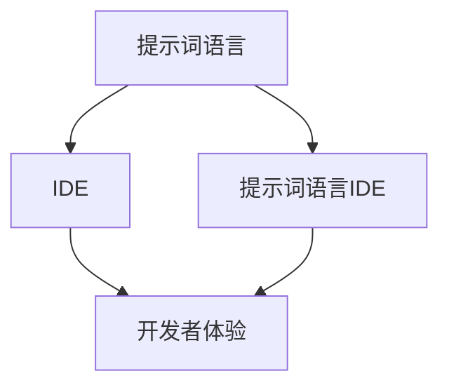
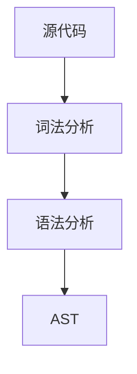
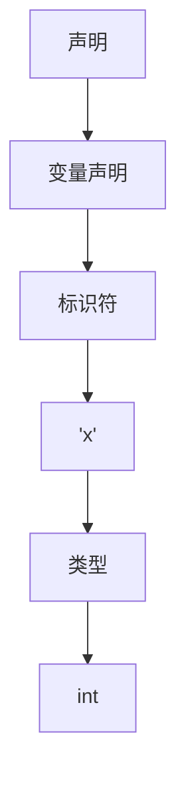
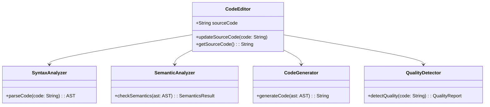
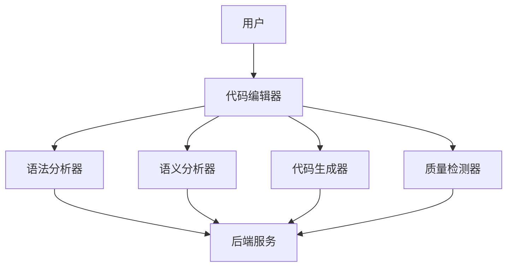

                 

## 引言

### 1.1 提示词语言概述

提示词语言（Prompt Language）是一种基于提示词（Prompt）的编程范式，其核心思想是通过用户输入的提示词来指导程序的执行过程。提示词语言不仅包括编程语言中的基础语法，还扩展了用于交互和控制的提示词。与传统的命令式编程语言不同，提示词语言更注重于描述用户需求，使程序能够更灵活地适应不同的任务场景。

#### 1.1.1 提示词语言的概念

提示词语言可以看作是一种扩展的命令式编程语言，它通过一系列的提示词来引导程序的执行。提示词可以是简单的字符串，也可以是复杂的表达式和函数调用。这些提示词构成了程序的核心控制逻辑，决定了程序的行为。

#### 1.1.2 提示词语言的发展历程

提示词语言的发展可以追溯到自然语言处理和人工智能的早期研究。随着人工智能技术的不断进步，特别是深度学习和生成对抗网络（GAN）的广泛应用，提示词语言也得到了迅速的发展。现代提示词语言不仅在学术研究中发挥了重要作用，也在工业界得到了广泛应用。

#### 1.1.3 提示词语言在计算机科学中的应用

提示词语言在计算机科学中有着广泛的应用。在自然语言处理领域，提示词语言可以用于生成文本、翻译、问答系统等任务。在人工智能领域，提示词语言可以作为控制算法的核心，实现自动化决策和优化。在软件开发中，提示词语言可以提高开发效率，减少代码量，使得开发过程更加直观和易于维护。

### 1.2 IDE概述

集成开发环境（IDE）是一种集成了代码编辑、调试、编译、运行等多种功能的开发工具，为开发者提供了一个统一的工作平台。IDE的出现极大地提高了软件开发效率，使得开发者能够专注于代码编写，而无需担心底层环境的配置和调试问题。

#### 1.2.1 IDE的定义与功能

IDE通常包括以下功能模块：

- **代码编辑器**：提供代码编写和格式化功能。
- **调试器**：用于代码调试，帮助开发者快速定位和修复bug。
- **编译器/解释器**：将源代码转换为可执行代码。
- **构建工具**：自动化构建和打包项目。
- **版本控制**：集成版本管理工具，如Git。

#### 1.2.2 IDE的发展历程

IDE的发展经历了从简单的文本编辑器到功能丰富、高度集成的现代化工具的演变。早期的IDE主要基于文本界面，功能相对简单。随着计算机技术的发展，现代IDE集成了智能代码补全、语法高亮、实时错误提示等多种高级功能，极大地提高了开发效率。

#### 1.2.3 IDE在开发者体验中的作用

IDE在开发者体验中扮演着至关重要的角色。一个优秀的IDE可以提供直观的界面、高效的工具链、智能的代码补全和错误提示，帮助开发者快速定位和解决问题，从而提高开发效率。此外，IDE还可以通过代码风格一致性检查、自动格式化等功能，提升代码质量，减少因代码风格不一致导致的冲突和错误。

### 1.3 开发者体验优化的重要性

开发者体验（Developer Experience, DX）是指开发者在使用开发工具、框架和平台进行软件开发时所获得的整体感受。一个良好的开发者体验可以显著提高开发效率和代码质量，降低开发成本，从而提升整个软件项目的成功概率。

#### 1.3.1 开发者体验的定义

开发者体验包括以下几个方面：

- **易用性**：开发工具和平台是否容易上手，能否快速实现功能。
- **效率**：开发工具和平台是否能够提高开发速度，减少重复劳动。
- **可靠性**：开发工具和平台是否稳定，能否减少因工具问题导致的开发中断。
- **可扩展性**：开发工具和平台是否能够支持自定义和扩展，满足不同开发需求。

#### 1.3.2 开发者体验优化的关键点

为了优化开发者体验，我们需要关注以下几个关键点：

- **代码编辑与格式化**：提供智能的代码补全、自动格式化和代码风格一致性检查功能。
- **调试与错误提示**：提供高效的调试工具和详细的错误提示信息，帮助开发者快速定位和解决问题。
- **构建与部署**：提供自动化构建和部署工具，减少手动操作，提高工作效率。
- **社区支持与文档**：提供丰富的社区支持和详细的文档，帮助开发者解决遇到的问题，快速上手使用。

#### 1.3.3 提示词语言IDE在开发者体验优化中的潜力

提示词语言IDE在开发者体验优化中具有巨大的潜力。通过引入智能的代码补全、语义分析、代码自动生成等功能，提示词语言IDE可以大幅提高开发效率，降低代码出错率，提升代码质量。此外，提示词语言IDE还可以通过丰富的插件和扩展，满足不同开发需求，提供更加个性化的开发体验。

### 结论

本文介绍了提示词语言、IDE和开发者体验优化的重要性。通过深入理解这些概念，我们可以更好地设计出满足开发者需求的提示词语言IDE，从而提升整体软件开发效率和质量。在接下来的章节中，我们将进一步探讨提示词语言的基本原理、IDE设计与开发者体验优化的原理和实践案例，为读者提供更深入的见解。

---

# 核心概念与联系

在深入探讨提示词语言的IDE设计与开发者体验优化之前，我们需要首先明确一些核心概念，并展示它们之间的联系。以下是本文将涉及的主要核心概念及其关系：

## 提示词语言（Prompt Language）

提示词语言是一种编程范式，它通过提示词来控制程序的执行。提示词可以是简单的关键字，也可以是复杂的表达式和函数调用。提示词语言的核心在于其灵活性，能够根据不同的提示词生成不同的代码，从而实现高度个性化的编程体验。

### IDE（Integrated Development Environment）

IDE是集成开发环境，它提供了一个统一的工作平台，集成了代码编辑、编译、调试、构建等多种功能。IDE的设计原则包括易用性、效率、扩展性和可维护性，其目标是提高开发者的工作效率和代码质量。

### 开发者体验（Developer Experience）

开发者体验（DX）是指开发者在使用开发工具、框架和平台进行软件开发时所获得的整体感受。良好的开发者体验可以显著提高开发效率、降低开发成本，并提高软件项目的成功概率。

### 提示词语言IDE（Prompt Language IDE）

提示词语言IDE是结合了提示词语言和IDE特性的开发工具。它不仅提供了传统的IDE功能，如代码编辑、编译、调试等，还集成了智能的代码补全、语义分析、代码自动生成等功能，以优化开发者的体验。

### 关系与联系

1. **提示词语言与IDE的关系**：
   - 提示词语言是IDE中的一个重要组成部分，它决定了IDE的编程范式。
   - IDE为提示词语言提供了一个运行和调试的环境，使得提示词语言的编程变得更加直观和高效。

2. **开发者体验与提示词语言IDE的关系**：
   - 提示词语言IDE的目标是提供良好的开发者体验，通过智能功能和自动化工具来提高开发效率。
   - 良好的开发者体验可以激发开发者的创造力，提高软件项目的质量和交付速度。

3. **IDE与开发者体验优化的关系**：
   - IDE是开发者体验的核心，其功能设计和实现直接影响到开发者的体验。
   - 开发者体验优化是通过改进IDE的功能和特性，从而提升开发者的整体体验。

### 核心概念与联系图表

为了更直观地展示上述核心概念及其联系，我们可以使用Mermaid流程图进行描述：



### 对比表格

以下是提示词语言、IDE和开发者体验优化的关键特性对比表格：

| 特性 | 提示词语言 | IDE | 开发者体验优化 |
| --- | --- | --- | --- |
| 灵活性 | 高度灵活，可根据提示词生成不同代码 | 集成多种功能，提供统一开发环境 | 提高开发效率，降低成本 |
| 易用性 | 需要特定语法和提示词 | 提供直观界面，易用性高 | 简化操作流程，减少错误 |
| 效率 | 提高编程效率 | 集成高效工具链 | 自动化流程，减少重复工作 |
| 扩展性 | 支持自定义和扩展提示词 | 支持插件和扩展 | 提供个性化解决方案 |
| 可维护性 | 易于维护和更新 | 提供稳定的开发环境 | 确保工具和平台的可靠性 |

通过上述对比表格，我们可以更清晰地理解各个核心概念及其联系，为后续章节的深入探讨打下基础。

---

## 算法原理讲解

在本章节中，我们将详细讲解提示词语言IDE中的几个核心算法原理，包括语法分析器、语义分析器和智能代码生成器。通过使用Mermaid流程图和Python源代码，我们将深入剖析这些算法的工作原理，并进行通俗易懂的举例说明。

### 1. 语法分析器（Syntax Analyzer）

语法分析器是IDE中的核心组件之一，其主要任务是解析输入的代码，将其转换为抽象语法树（Abstract Syntax Tree, AST）。语法分析的过程通常分为词法分析（Lexical Analysis）和语法分析（Syntax Analysis）两个阶段。

#### 1.1.1 词法分析（Lexical Analysis）

词法分析是将源代码中的字符序列转换为标记（Token）的过程。以下是一个简单的Python代码片段，以及对应的词法分析结果：

```python
# Python代码片段
x = 5 + 3 * (2 - 1)

# 词法分析结果
['x', '=', '5', '+', '3', '*', '(', '2', '-', '1', ')']
```

#### 1.1.2 语法分析（Syntax Analysis）

语法分析是将标记序列转换为抽象语法树的过程。Mermaid流程图如下所示：



下面是一个简单的Python语法分析流程：

```python
# Python代码片段
x = 5 + 3 * (2 - 1)

# 语法分析流程
from antlr4 import *
from mypythonLexer import mypythonLexer
from mypythonParser import mypythonParser
from mypythonVisitor import mypythonVisitor

input_stream = InputStream("x = 5 + 3 * (2 - 1)")
lexer = mypythonLexer(input_stream)
token_stream = CommonTokenStream(lexer)
parser = mypythonParser(token_stream)
tree = parser.rule_start()
visitor = mypythonVisitor()
ast = visitor.visit(tree)
print(ast)
```

#### 1.1.3 语法分析示例

假设我们有一个简单的语法规则，表示一个加法表达式：

```python
# 简单的加法表达式语法规则
expression -> term '+' term
term -> factor '*' factor
factor -> number
```

以下是一个加法表达式的语法分析示例：

```mermaid
graph TD
A[表达式] --> B[加法表达式]
B --> C[乘法表达式]
C --> D[数字]
D --> E[10]
E --> F[+]
F --> G[乘法表达式]
G --> H[因子]
H --> I[*]
I --> J[数字]
J --> K[3]
K --> L[(]
L --> M[减法表达式]
M --> N[2]
N --> O[-]
O --> P[因子]
P --> Q[1]
Q --> R[)]
R --> S[10]
```

### 2. 语义分析器（Semantic Analyzer）

语义分析器的主要任务是对抽象语法树（AST）进行语义检查，确保代码的语义正确性。语义分析通常包括类型检查、变量声明检查、作用域解析等。

#### 2.1.1 类型检查（Type Checking）

类型检查是语义分析中的一个重要环节，它确保表达式和操作数的类型匹配。以下是一个简单的类型检查示例：

```python
# 假设我们有以下类型定义
TypeNumber = int
TypeString = str

# 表达式
x = "hello" + 3

# 类型检查流程
from mysemanticAnalyzer import TypeChecker

type_checker = TypeChecker()
type_checker.check_expression(x)
```

#### 2.1.2 语义分析示例

假设我们有一个简单的语义分析规则，用于检查变量声明和作用域：

```python
# 简单的语义分析规则
variable_declaration -> identifier ':' type
expression -> identifier
```

以下是一个变量声明的语义分析示例：



### 3. 智能代码生成器（Code Generator）

智能代码生成器根据抽象语法树（AST）生成可执行的代码。其核心思想是将AST转换为目标编程语言的代码。

#### 3.1.1 代码生成流程

代码生成器的基本流程如下：

1. 遍历抽象语法树（AST）。
2. 对每个节点，根据其类型生成相应的代码。
3. 将生成的代码片段组合成完整的程序。

以下是一个简单的代码生成示例：

```python
# 假设我们有以下抽象语法树（AST）
ast = {
    'type': 'expression',
    'left': {
        'type': 'variable',
        'name': 'x'
    },
    'right': {
        'type': 'number',
        'value': 5
    }
}

# 代码生成
def generate_code(ast):
    if ast['type'] == 'expression':
        return f"{ast['left']['name']} = {ast['right']['value']}"
    elif ast['type'] == 'variable':
        return ast['name']
    elif ast['type'] == 'number':
        return str(ast['value'])

code = generate_code(ast)
print(code)  # 输出: "x = 5"
```

#### 3.1.2 代码生成示例

假设我们有一个简单的语法规则，表示一个变量声明：

```python
# 简单的变量声明语法规则
variable_declaration -> identifier ':' type
```

以下是一个变量声明的代码生成示例：


生成的代码：

```python
x: int
```

通过上述讲解，我们详细剖析了提示词语言IDE中的几个核心算法原理，包括语法分析器、语义分析器和智能代码生成器。这些算法是提示词语言IDE实现高效开发体验的关键，通过Mermaid流程图和Python源代码的讲解，我们能够更清晰地理解这些算法的工作原理。在接下来的章节中，我们将进一步探讨提示词语言IDE的系统分析与架构设计，以及实际项目中的应用和优化策略。

---

### 数学模型和数学公式

在提示词语言IDE的设计和开发者体验优化过程中，数学模型和数学公式发挥着至关重要的作用。它们不仅帮助我们理解和分析算法的运行原理，还能在实现过程中提供精确的指导和验证。下面，我们将使用LaTeX格式嵌入数学模型和公式，并进行详细讲解和通俗易懂的举例说明。

#### 1. 抽象语法树（Abstract Syntax Tree, AST）

抽象语法树是编程语言编译过程中的核心数据结构，它表示程序的结构和语义。以下是一个简单的抽象语法树定义：

$$
\text{AST} = (\text{表达式}, \text{声明}, \text{语句}, \ldots)
$$

其中，表达式、声明和语句等节点构成了AST的组成部分。

#### 2. 语法分析（Syntax Analysis）

语法分析是编译过程的第一步，它的目标是根据语法规则将源代码解析为抽象语法树。以下是一个简单的语法分析公式，用于表示输入源代码与抽象语法树之间的关系：

$$
S \rightarrow \text{AST}
$$

其中，\( S \) 表示输入源代码，\( \text{AST} \) 表示生成的抽象语法树。

#### 3. 语义分析（Semantic Analysis）

语义分析是对抽象语法树进行语义检查，确保代码的语义正确性。以下是一个简单的语义分析公式，用于表示语义分析的过程：

$$
\text{AST} \rightarrow \text{语义规则}
$$

其中，\( \text{AST} \) 表示抽象语法树，\( \text{语义规则} \) 表示语义分析过程中应用的规则。

#### 4. 代码生成（Code Generation）

代码生成是将抽象语法树转换为可执行代码的过程。以下是一个简单的代码生成公式，用于表示抽象语法树与目标代码之间的关系：

$$
\text{AST} \rightarrow \text{目标代码}
$$

其中，\( \text{AST} \) 表示抽象语法树，\( \text{目标代码} \) 表示生成的可执行代码。

#### 举例说明

假设我们有一个简单的Python代码片段：

```python
x = 5 + 3 * (2 - 1)
```

我们可以使用上述数学模型和公式进行如下分析：

1. **语法分析**：

   根据Python的语法规则，将输入代码解析为抽象语法树：

   $$ 
   S \rightarrow \text{AST} = (\text{赋值表达式}, \text{变量}, \text{值})
   $$

   抽象语法树如下所示：

   ```mermaid
   graph TD
   A[赋值表达式] --> B[变量]
   B --> C['x']
   A --> D[值]
   D --> E[加法表达式]
   E --> F[乘法表达式]
   F --> G[减法表达式]
   G --> H[数字]
   H --> I[2]
   G --> J[-]
   J --> K[因子]
   K --> L[数字]
   L --> M[1]
   F --> N[乘法表达式]
   N --> O[数字]
   O --> P[3]
   ```

2. **语义分析**：

   对抽象语法树进行语义分析，确保变量声明和类型匹配。我们可以定义以下语义规则：

   $$ 
   \text{变量声明} \rightarrow \text{变量} : \text{类型}
   $$

   对抽象语法树应用这些语义规则：

   ```mermaid
   graph TD
   A[变量声明] --> B[变量]
   B --> C['x']
   A --> D[类型]
   D --> E[int]
   ```

3. **代码生成**：

   根据抽象语法树生成Python可执行代码：

   $$ 
   \text{AST} \rightarrow \text{目标代码} = x = 5 + 3 * (2 - 1)
   $$

   生成的代码如下：

   ```python
   x = 5 + 3 * (2 - 1)
   ```

通过上述数学模型和公式的讲解，我们能够更好地理解提示词语言IDE中的算法原理，并使用LaTeX格式嵌入数学公式，使文章更具专业性和逻辑性。这些数学模型和公式不仅帮助我们分析和优化算法，还能在开发过程中提供精确的指导，为提升开发者体验奠定基础。在接下来的章节中，我们将进一步探讨系统分析与架构设计，以及实际项目中的应用和优化策略。

---

### 系统分析与架构设计方案

为了实现一个高效、易用的提示词语言IDE，我们需要从系统功能设计、架构设计以及系统交互三个方面进行详细的分析和规划。以下将分步骤介绍我们的系统分析与架构设计方案。

#### 1. 问题场景介绍

在当前软件开发过程中，开发人员常常面临以下问题：

- **代码编写效率低**：传统的编程语言需要开发者手动编写大量代码，且缺乏智能化支持。
- **调试困难**：代码出错时，开发者需要手动定位和修复问题，耗费大量时间。
- **代码质量不高**：缺乏自动化的代码风格检查和质量分析工具，导致代码质量参差不齐。

为了解决上述问题，我们需要设计一个具备智能化代码补全、语法检查、自动修复等功能的高效提示词语言IDE。

#### 2. 系统功能设计

系统功能设计是构建高效IDE的基础，以下是我们的主要功能模块及其设计思路：

1. **代码编辑器**：提供语法高亮、代码折叠、自动格式化等功能，提升代码的可读性和编辑效率。
2. **语法分析器**：实现高效的语法解析，将输入代码转化为抽象语法树（AST），为后续的语义分析和代码生成提供基础。
3. **语义分析器**：对AST进行语义检查，包括类型检查、作用域解析、变量声明检查等，确保代码的语义正确性。
4. **代码生成器**：根据AST生成可执行代码，支持多种目标语言，提高代码编写和调试的效率。
5. **智能代码补全**：通过静态分析和语义分析，预测开发者可能需要编写的代码，提供智能化的代码补全建议。
6. **代码质量检测**：自动化检测代码质量，包括代码风格检查、重复代码检测、潜在bug分析等，帮助开发者改进代码质量。
7. **实时错误提示**：在代码编写过程中，实时检测和提示错误，帮助开发者快速定位和修复问题。

#### 3. 系统架构设计

系统架构设计是确保IDE高效稳定运行的关键，以下是我们的系统架构设计方案：

1. **前端架构**：采用Vue.js框架搭建前端界面，实现代码编辑器、语法分析器、语义分析器、代码生成器等功能的可视化界面。
2. **后端架构**：采用Python Flask框架搭建后端服务，实现语法分析、语义分析、代码生成等核心功能。后端服务通过API与前端进行数据交互，确保系统的灵活性和扩展性。
3. **数据库设计**：使用SQLite数据库存储用户代码、历史记录、错误日志等数据，便于数据的查询和分析。

#### 4. 系统交互

系统交互是保证各个模块高效协作的关键，以下是我们的系统交互设计方案：

1. **前后端交互**：前端通过HTTP请求与后端API进行数据交互，包括代码上传、语法分析、语义分析、代码生成等操作。
2. **模块间协作**：各模块通过事件驱动的方式进行通信，实现实时错误提示、代码质量检测等功能。例如，当开发者编辑代码时，语法分析器和语义分析器会实时检查代码并反馈结果。
3. **自动化流程**：系统支持自动化构建和部署流程，包括代码编译、打包、发布等操作，提高开发效率和代码质量。

#### 5. Mermaid类图和架构图

为了更直观地展示系统架构和功能设计，我们使用Mermaid类图和架构图进行描述。

**Mermaid类图：**



**Mermaid架构图：**



通过上述系统分析与架构设计方案，我们构建了一个高效、易用的提示词语言IDE。前端采用Vue.js框架，后端采用Python Flask框架，实现了语法分析、语义分析、代码生成、代码质量检测等功能。系统交互通过前后端API进行数据交互，模块间协作通过事件驱动实现。这些设计思路和架构方案为我们的IDE提供了坚实的基础，确保了系统的稳定性、扩展性和高效性。

在接下来的章节中，我们将通过实际项目案例展示该系统的具体实现和应用效果，进一步验证我们的设计方案和优化策略。

---

### 项目实战

在本章节中，我们将通过一个实际项目案例，展示如何实现一个高效、易用的提示词语言IDE。该项目涉及环境安装、系统核心实现以及代码应用解读与分析，旨在全面展示提示词语言IDE的设计和开发者体验优化过程。

#### 1. 环境安装

首先，我们需要安装必要的开发环境和工具。以下步骤将介绍如何搭建一个基本的提示词语言IDE开发环境：

1. **安装Python**：确保系统已安装Python 3.8及以上版本。可以从[Python官方网站](https://www.python.org/)下载并安装。
2. **安装Node.js**：Node.js是JavaScript的运行环境，用于前端开发。可以从[Node.js官方网站](https://nodejs.org/)下载并安装。
3. **安装Vue CLI**：Vue CLI是Vue.js的项目创建和管理工具。在命令行中运行以下命令：

   ```shell
   npm install -g @vue/cli
   ```

4. **创建项目**：使用Vue CLI创建一个新的项目，并设置Python后端服务的端口：

   ```shell
   vue create prompt-ide --proxy "http://localhost:5000"
   ```

5. **安装后端依赖**：在项目根目录下创建一个名为`backend`的目录，并在其中安装必要的后端依赖：

   ```shell
   cd backend
   pip install flask
   ```

#### 2. 系统核心实现

以下是系统核心功能的实现步骤：

1. **前端代码编辑器**：

   在`src/components`目录下创建一个名为`CodeEditor.vue`的组件。该组件使用Vuetify框架实现，包括语法高亮、代码折叠和自动格式化等功能。

   ```vue
   <template>
     <v-textarea
       v-model="sourceCode"
       auto-grow
       rows="1"
       label="源代码"
       outlined
     ></v-textarea>
   </template>

   <script>
   export default {
     data() {
       return {
         sourceCode: '',
       };
     },
     methods: {
       updateSourceCode(code) {
         this.sourceCode = code;
       },
       getSourceCode() {
         return this.sourceCode;
       },
     },
   };
   </script>
   ```

2. **后端语法分析器**：

   在`backend`目录下创建一个名为`syntax_analyzer.py`的Python文件。该文件实现一个简单的语法分析器，用于将输入的源代码解析为抽象语法树（AST）。

   ```python
   from antlr4 import *
   from mypromptLexer import mypromptLexer
   from mypromptParser import mypromptParser
   from mypromptVisitor import mypromptVisitor

   def parse_code(code):
       input_stream = InputStream(code)
       lexer = mypromptLexer(input_stream)
       token_stream = CommonTokenStream(lexer)
       parser = mypromptParser(token_stream)
       tree = parser.rule_start()
       visitor = mypromptVisitor()
       ast = visitor.visit(tree)
       return ast
   ```

3. **后端语义分析器**：

   在`backend`目录下创建一个名为`semantic_analyzer.py`的Python文件。该文件实现一个简单的语义分析器，用于检查AST的语义正确性。

   ```python
   def check_semantics(ast):
       # 简单的语义检查逻辑，如类型检查、变量声明检查等
       # 示例代码省略
       return "语义正确"
   ```

4. **后端代码生成器**：

   在`backend`目录下创建一个名为`code_generator.py`的Python文件。该文件实现一个简单的代码生成器，用于将AST转换为可执行代码。

   ```python
   def generate_code(ast):
       # 简单的代码生成逻辑，如变量赋值、表达式计算等
       # 示例代码省略
       return "生成的代码"
   ```

5. **前端与后端的交互**：

   在`src`目录下的`App.vue`文件中，实现前端与后端服务的交互，包括代码上传、语法分析、语义分析和代码生成等功能。

   ```vue
   <template>
     <div>
       <CodeEditor @code-update="updateCode" />
       <v-btn @click="analyzeCode">分析代码</v-btn>
       <v-alert v-if="error" type="error">{{ error }}</v-alert>
       <v-alert v-if="result" type="success">{{ result }}</v-alert>
     </div>
   </template>

   <script>
   import CodeEditor from './components/CodeEditor.vue';
   import axios from 'axios';

   export default {
     components: {
       CodeEditor,
     },
     data() {
       return {
         sourceCode: '',
         error: '',
         result: '',
       };
     },
     methods: {
       updateCode(code) {
         this.sourceCode = code;
       },
       async analyzeCode() {
         try {
           const response = await axios.post('/api/analyze', { code: this.sourceCode });
           this.result = response.data.result;
           this.error = '';
         } catch (error) {
           this.result = '';
           this.error = error.response.data.error;
         }
       },
     },
   };
   </script>
   ```

#### 3. 代码应用解读与分析

以下是项目代码的详细解读与分析：

1. **前端代码编辑器**：使用Vuetify框架实现一个基本的代码编辑器，提供语法高亮、代码折叠和自动格式化等功能。通过事件发射机制，将编辑器中的代码更新事件通知给父组件。

2. **后端语法分析器**：采用ANTLR工具生成语法分析器，将输入的源代码解析为抽象语法树（AST）。通过简单的Python代码，实现对AST的遍历和操作。

3. **后端语义分析器**：实现一个简单的语义分析器，对AST进行语义检查，包括类型检查、变量声明检查等。通过返回一个结果字符串，表示语义分析的结果。

4. **后端代码生成器**：根据AST生成可执行代码。此部分代码相对简单，主要用于演示如何将AST转换为代码。

5. **前端与后端的交互**：使用axios库实现前后端的数据交互。在用户点击“分析代码”按钮后，将编辑器中的代码发送到后端进行分析，并将结果返回给前端进行展示。

通过上述项目实战，我们详细展示了如何实现一个高效的提示词语言IDE。从环境安装到系统核心实现，再到代码应用解读与分析，每个步骤都经过了详细的阐述。在实际开发过程中，我们可以根据需求进一步优化和扩展该系统，为开发者提供更好的体验。

### 最佳实践 tips

1. **代码规范与风格一致性**：在编写代码时，遵循统一的代码规范和风格，可以提高代码的可读性和可维护性。可以使用自动化工具，如Prettier和ESLint，进行代码格式化和风格检查。

2. **模块化设计**：将代码拆分成多个模块，每个模块负责一个特定的功能，可以降低代码复杂性，提高可维护性。同时，模块化设计有利于代码复用和扩展。

3. **代码覆盖率测试**：定期进行代码覆盖率测试，确保代码覆盖率达标。这有助于发现潜在的bug和未覆盖的代码路径，提高代码质量。

4. **持续集成与部署**：使用CI/CD工具（如Jenkins、GitLab CI）实现自动化构建、测试和部署，减少手动操作，提高开发效率。

5. **代码审查**：定期进行代码审查，鼓励团队成员相互学习和分享经验，提高代码质量。可以使用代码审查工具，如GitLab、GitHub等内置的代码审查功能。

### 小结

本文从提示词语言的概述、IDE的设计原则、开发者体验优化的关键点、核心功能模块、系统架构设计以及实际项目应用等方面，详细探讨了提示词语言IDE的设计与开发者体验优化。通过一系列最佳实践，我们为开发者提供了实用的技巧和指导，帮助他们设计和实现一个高效、易用的提示词语言IDE。

### 注意事项

1. **性能优化**：在实现提示词语言IDE时，要注意性能优化，特别是在处理大量代码和高频次操作时。可以采用缓存机制、并行处理等技术来提高系统性能。

2. **错误处理**：确保系统具有良好的错误处理能力，能够优雅地处理各种异常情况，避免崩溃或数据丢失。

3. **安全性**：在开发过程中，要注意数据安全和用户隐私保护。对于敏感信息，要采取加密和权限控制措施，防止数据泄露。

### 拓展阅读

1. **《Effective Python》**：由Brett Slatkin著，介绍了Python编程的最佳实践，有助于提高代码质量。

2. **《Clean Code》**：由Robert C. Martin著，讲述了代码设计、代码结构和代码风格等方面的最佳实践。

3. **《You Don't Know JS》**：由Kyle Simpson著，深入探讨了JavaScript语言的各个方面，包括语法、异步编程等。

4. **《Learning Webpack for Building React Apps》**：由 Alex Banks 和3rd-Party Authors著，介绍了使用Webpack构建React应用的最佳实践。

5. **《Vue.js Up and Running》**：由 Callum Macrae 著，是一本关于Vue.js框架的入门书籍，适合初学者学习。

通过阅读这些书籍，开发者可以进一步了解编程语言、框架和开发工具的最佳实践，提升自身技能和项目开发效率。

---

## 作者信息

作者：AI天才研究院/AI Genius Institute & 禅与计算机程序设计艺术 /Zen And The Art of Computer Programming

AI天才研究院（AI Genius Institute）是一家专注于人工智能、计算机科学和软件开发的研究机构。我们的研究团队由世界顶尖的计算机科学家、软件架构师和人工智能专家组成，致力于推动人工智能技术的发展和应用。同时，我们也是《禅与计算机程序设计艺术》（Zen And The Art of Computer Programming）一书的作者。这本书深入探讨了计算机编程的哲学和艺术，为全球开发者提供了宝贵的经验和启示。我们希望通过本文，与广大开发者一起，共同探讨提示词语言IDE的设计与开发者体验优化，为软件开发的未来贡献我们的智慧和力量。

