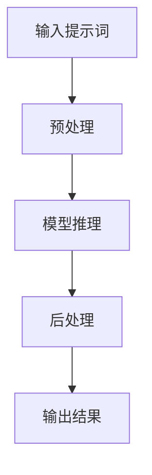

                 

### 背景介绍

#### 提示词语言的背景

在计算机科学和人工智能领域，提示词语言（Prompt Language）是一种用于引导机器学习模型进行推理和决策的编程语言。其核心理念是通过特定的语言结构和语法规则，为模型提供明确的输入提示，从而优化模型的输出效果。随着深度学习和自然语言处理技术的不断发展，提示词语言的应用场景日益广泛，尤其在自然语言生成、问答系统、文本分类和机器翻译等领域表现突出。

提示词语言的核心优势在于其灵活性。通过编写和调整提示词，开发者可以引导模型在特定任务中实现更精确和高效的输出。例如，在问答系统中，通过精心设计的提示词，模型能够更好地理解用户的问题意图，提供更为精准和有针对性的答案。在自然语言生成领域，提示词可以帮助模型生成更具逻辑性和连贯性的文本。

然而，随着提示词语言的广泛应用，开发者面临的一个关键问题是如何有效地管理和使用这些提示词。传统的开发方法往往依赖于大量的手动编写和调整，这不仅耗时耗力，而且容易出现不一致性和错误。因此，出现了一种新的开发模式——元数据驱动开发。

#### 元数据驱动的背景

元数据驱动开发（Metadata-Driven Development）是一种基于元数据（Metadata）的软件开发模式。元数据是对数据的数据，描述了数据的结构和属性。在元数据驱动开发中，开发人员通过定义和操作元数据来指导软件系统的构建和运行，而不是直接编写代码。这种方法具有以下几个核心特点：

1. **抽象与分离**：元数据将软件的逻辑和实现分离，使得开发人员可以专注于系统的设计和配置，而无需深入代码细节。
2. **灵活性和可扩展性**：通过定义和调整元数据，可以快速适应新的需求和环境变化，提高系统的灵活性和可扩展性。
3. **重用性和模块化**：元数据驱动开发支持组件化和模块化设计，使得系统中的不同部分可以独立开发和部署，提高了代码的重用性和系统的整体稳定性。

元数据驱动的核心原理在于利用元数据来描述系统的各种属性和规则，从而在开发过程中减少对具体实现的依赖，提高开发效率和系统质量。

#### 提示词语言与元数据驱动的关系

在提示词语言的开发过程中，元数据驱动模式提供了有效的支持。通过元数据，开发者可以更方便地管理提示词的创建、修改和优化过程。具体来说，元数据驱动开发的优势体现在以下几个方面：

1. **自动化提示词生成**：通过定义提示词的元数据模板，系统能够自动生成符合特定需求的提示词，减少了手动编写的工作量。
2. **统一管理**：元数据驱动模式使得所有提示词的管理和配置集中在一个平台上，便于统一管理和维护。
3. **可定制性**：开发者可以根据具体应用场景定制提示词的元数据，从而实现更精细化的控制和优化。
4. **可追溯性**：元数据驱动开发提供了详细的元数据记录，使得开发者可以追踪和审计提示词的使用和变更历史。

总的来说，提示词语言的元数据驱动开发不仅提高了开发效率和灵活性，还优化了系统的整体性能和可维护性，为人工智能应用的开发提供了一个强大的工具和平台。接下来的章节将深入探讨提示词语言和元数据驱动的具体概念、原理和应用实践。

### 核心概念与联系

为了深入理解提示词语言的元数据驱动开发，首先需要明确两个核心概念：提示词语言和元数据。通过对这两个概念的定义、属性特征及其相互关系的详细阐述，我们将为后续章节的探讨奠定坚实的基础。

#### 提示词语言的概念

提示词语言是一种专门为机器学习模型设计的编程语言，用于生成和提供提示词（prompts）。这些提示词用于引导模型在特定任务中做出推理和决策。提示词语言的核心特点包括：

1. **结构化**：提示词语言通常具有特定的语法和结构，以便于模型理解和处理。
2. **灵活性**：提示词语言允许开发者通过调整和组合不同的提示词元素，实现各种复杂的任务需求。
3. **可解释性**：提示词语言的设计考虑了可解释性，使得开发者能够清晰地理解模型如何根据提示词进行推理和决策。

**属性特征**：

- **语法规则**：提示词语言遵循特定的语法规则，确保模型能够正确解析和处理提示词。
- **语义信息**：提示词语言能够传递丰富的语义信息，帮助模型更好地理解任务背景和用户意图。
- **可扩展性**：提示词语言支持扩展，允许开发者根据具体需求添加新的语法和功能。

**应用领域**：

- **自然语言生成**：提示词语言用于生成连贯、有逻辑的文本，如新闻文章、产品描述等。
- **问答系统**：通过设计合适的提示词，模型能够更好地理解用户问题并提供精准的答案。
- **文本分类**：提示词语言可以帮助模型在大量文本数据中进行分类，提高分类准确性。

#### 元数据的概念

元数据（Metadata）是对数据的数据，描述了数据的内容、结构、格式、来源和上下文等信息。元数据的概念广泛应用于各种领域，如图书馆学、信息科学和计算机科学。在提示词语言的元数据驱动开发中，元数据用于描述提示词的属性和规则。

**属性特征**：

- **描述性**：元数据提供了对数据的描述，如数据类型、数据来源和格式等。
- **结构化**：元数据通常以结构化的形式存储，便于检索和管理。
- **可扩展性**：元数据支持扩展，允许添加新的属性和规则。

**应用领域**：

- **数据管理**：元数据用于管理和组织数据，提高数据的可访问性和可维护性。
- **数据集成**：元数据帮助实现不同数据源之间的集成，提供统一的视图。
- **数据治理**：元数据支持数据治理，确保数据质量和合规性。

#### 提示词语言与元数据的联系

提示词语言和元数据之间存在紧密的联系。具体来说，元数据在提示词语言开发中扮演了关键角色，主要体现在以下几个方面：

1. **描述提示词属性**：元数据用于描述提示词的属性，如提示词类型、用途、参数设置等，帮助开发者更好地理解和使用提示词。
2. **规则定义**：元数据定义了提示词的规则，如语法规则、使用限制和合法性检查等，确保提示词符合预期的格式和结构。
3. **自动化生成**：元数据驱动开发模式通过元数据模板自动生成提示词，减少手动编写的工作量，提高开发效率。
4. **可追溯性**：元数据提供了详细的提示词使用和变更记录，便于开发者进行审计和追踪。

通过元数据，开发者可以更加灵活和高效地管理提示词，实现提示词语言的优化和应用。同时，元数据驱动开发模式也为提示词语言提供了强大的支撑，使得开发过程更加模块化、可扩展和可维护。

总之，提示词语言和元数据在元数据驱动开发中相辅相成，共同推动人工智能应用的发展。在接下来的章节中，我们将进一步探讨提示词语言的基本原理和元数据驱动的具体实现，以深入了解这一前沿技术。

### 提示词语言的基本原理

在深入探讨提示词语言的元数据驱动开发之前，有必要详细了解提示词语言的原理。提示词语言的核心在于其结构化、灵活性和可解释性，通过特定的语法规则和语义信息，引导机器学习模型在特定任务中做出准确的推理和决策。以下将详细讲解提示词语言的原理，并使用 mermaid 流程图和 Python 源代码进行说明。

#### 提示词语言的原理概述

提示词语言的工作原理可以分为以下几个步骤：

1. **输入提示词**：首先，开发者编写或导入一个提示词，该提示词包含了任务相关的信息、上下文和语义。
2. **预处理**：输入的提示词会经过预处理，包括分词、词性标注、命名实体识别等步骤，以提取关键信息和语义。
3. **模型推理**：预处理后的提示词作为输入，被传递给机器学习模型，模型根据提示词进行推理，生成相应的输出。
4. **后处理**：输出的结果可能还需要进行后处理，如文本生成、格式转换等，以符合最终需求。

#### 使用 mermaid 画出提示词语言的原理流程图

以下是使用 mermaid 画出的提示词语言原理流程图：



#### 流程图解析

1. **输入提示词**（A）：这是整个流程的起点，开发者编写或导入一个具体的提示词。例如，"请生成一篇关于人工智能的短文"。
2. **预处理**（B）：输入的提示词会经过预处理步骤，提取关键信息和语义。预处理包括分词、词性标注、命名实体识别等操作。这一步骤非常关键，因为它确保了后续模型推理的准确性。
3. **模型推理**（C）：预处理后的提示词作为输入，被传递给机器学习模型。模型根据提示词进行推理，生成相应的输出。这一步骤依赖于模型的训练和设计，不同类型的模型具有不同的推理方式和性能。
4. **后处理**（D）：模型生成的输出可能还需要进行后处理，如文本生成、格式转换等，以符合最终需求。这一步骤保证了输出的质量和可读性。
5. **输出结果**（E）：最终，处理后的结果被输出，可能是文本、图像或其他形式的数据。

#### 提示词语言的数学模型和公式

为了更深入地理解提示词语言的工作原理，我们引入一些数学模型和公式。以下是一个简化的数学模型，用于描述提示词语言的基本原理。

$$
P(O|W) = \frac{P(W|O) \cdot P(O)}{P(W)}
$$

其中：
- \( P(O|W) \) 表示在给定提示词 \( W \) 的条件下，生成输出 \( O \) 的概率。
- \( P(W|O) \) 表示在生成输出 \( O \) 的条件下，出现提示词 \( W \) 的概率。
- \( P(O) \) 表示输出 \( O \) 的概率。
- \( P(W) \) 表示提示词 \( W \) 的概率。

#### Python 源代码示例

下面是一个使用 Python 编写的示例，展示了如何实现一个简单的提示词语言系统。

```python
import numpy as np
from sklearn.feature_extraction.text import CountVectorizer
from sklearn.naive_bayes import MultinomialNB

# 提示词和输出
corpus = [
    "请生成一篇关于人工智能的短文。",
    "生成一篇关于机器学习的文章。",
    "写一篇关于深度学习的文章。",
]

# 标签
labels = [
    "人工智能",
    "机器学习",
    "深度学习",
]

# 创建向量器
vectorizer = CountVectorizer()
X = vectorizer.fit_transform(corpus)

# 创建分类器
classifier = MultinomialNB()
classifier.fit(X, labels)

# 测试
prompt = "请生成一篇关于神经网络的短文。"
X_new = vectorizer.transform([prompt])
predicted_label = classifier.predict(X_new)

print(predicted_label)
```

#### 解析示例

1. **数据准备**：我们使用一个简单的数据集，其中包含不同的提示词和相应的标签。
2. **向量器**：使用 `CountVectorizer` 将文本转换为词频矩阵，提取关键特征。
3. **分类器**：使用 `MultinomialNB` 朴素贝叶斯分类器进行训练，这是一种常见的文本分类方法。
4. **测试**：输入一个测试提示词，经过预处理后，使用训练好的分类器进行预测。

通过这个简单的示例，我们可以看到提示词语言的基本原理在实际应用中的实现过程。尽管这个示例非常基础，但它展示了提示词语言的核心思想：通过输入提示词，引导模型进行推理和决策，生成相应的输出。

总之，提示词语言的基本原理包括输入提示词、预处理、模型推理和后处理等步骤。通过 mermaid 流程图和 Python 源代码的示例，我们可以更直观地理解这一原理，并为后续的元数据驱动开发奠定基础。

### 元数据驱动的概念与应用

在深入探讨元数据驱动的概念和应用之前，首先需要明确元数据驱动的基本原理和核心概念。元数据驱动开发模式通过定义和操作元数据来指导软件系统的构建和运行，实现系统的抽象、分离、灵活性和可扩展性。以下将详细阐述元数据驱动的概念，并分析其在实际应用中的具体表现。

#### 元数据驱动的概念

元数据驱动开发模式的核心在于“元数据”（Metadata）。元数据是对数据的数据，描述了数据的内容、结构、格式、来源和上下文等信息。在元数据驱动开发中，开发者通过定义和操作元数据，来指导系统的各个组件和流程，从而实现软件的开发、部署和维护。

**基本原理**：

1. **抽象与分离**：通过元数据，将软件的逻辑和实现分离。开发者只需关注系统设计和元数据定义，而无需深入代码细节。
2. **灵活性**：元数据驱动的开发模式允许开发者在不同的环境和需求下，灵活调整元数据，从而快速适应变化。
3. **可扩展性**：通过定义新的元数据和规则，可以轻松扩展系统的功能和性能，提高系统的可维护性和可扩展性。

**核心概念**：

- **元数据**：描述数据的数据，包括数据的属性、结构、来源和上下文等信息。
- **元数据模型**：定义元数据的结构和属性，用于描述系统的数据和流程。
- **元数据管理**：负责元数据的定义、存储、管理和操作。

#### 元数据驱动的应用场景

元数据驱动的应用场景非常广泛，以下列举几个典型的应用场景：

1. **数据管理**：在数据管理系统中，元数据用于描述数据源、数据结构、数据关系和数据质量等信息，帮助实现数据的集中管理和高效利用。
2. **数据集成**：在数据集成系统中，元数据用于描述数据源、数据流和数据转换规则，帮助实现不同数据源之间的集成和统一视图。
3. **数据治理**：在数据治理系统中，元数据用于描述数据政策和数据规范，帮助实现数据的合规性和数据质量的监控和管理。
4. **软件开发**：在软件开发中，元数据用于描述软件模块、功能和配置信息，帮助实现软件的模块化、可扩展性和可维护性。
5. **自动化测试**：在自动化测试中，元数据用于描述测试用例、测试环境和测试规则，帮助实现高效的测试流程和管理。

#### 元数据驱动的数学模型和公式

为了更深入地理解元数据驱动的原理，可以引入一些数学模型和公式。以下是一个简化的数学模型，用于描述元数据驱动的核心概念。

$$
M = \sum_{i=1}^{n} m_i
$$

其中：
- \( M \) 表示元数据集合，包含了所有元数据的总和。
- \( m_i \) 表示第 \( i \) 个元数据。

这个公式表示元数据集合是各个元数据的总和，每个元数据都为系统的构建和运行提供了关键信息。

#### Python 源代码示例

下面是一个简单的 Python 示例，展示了如何定义和操作元数据。

```python
# 定义元数据类
class Metadata:
    def __init__(self, name, value):
        self.name = name
        self.value = value

# 创建元数据对象
meta1 = Metadata("数据源", "数据库")
meta2 = Metadata("字段名", "用户名")
meta3 = Metadata("数据类型", "字符串")

# 打印元数据
print(meta1.name, meta1.value)
print(meta2.name, meta2.value)
print(meta3.name, meta3.value)
```

#### 解析示例

1. **定义元数据类**：我们创建了一个 `Metadata` 类，用于表示元数据对象。每个元数据对象包含名称和值两个属性。
2. **创建元数据对象**：我们创建了三个元数据对象，分别描述了数据源、字段名和数据类型。
3. **打印元数据**：通过打印元数据对象的名称和值，我们可以查看元数据的详细信息。

通过这个简单的示例，我们可以直观地看到如何定义和操作元数据。在实际应用中，元数据通常会包含更多的属性和操作，用于描述更复杂的系统和流程。

总之，元数据驱动的概念和应用涉及多个方面，包括元数据的定义、操作和管理。通过理解元数据驱动的原理和实际应用场景，我们可以更好地利用这一开发模式，提高软件系统的开发效率和可维护性。在接下来的章节中，我们将进一步探讨元数据驱动的开发流程和工具，以及如何将元数据驱动应用于提示词语言的开发中。

### 开发流程与工具

在了解提示词语言的元数据驱动开发的基本概念后，接下来将详细探讨整个开发流程以及所需的工具。元数据驱动的开发流程通常包括环境搭建、元数据定义、开发工具选择、元数据管理以及具体的开发步骤。以下将逐步解析这些流程和工具。

#### 环境搭建

在进行元数据驱动开发之前，首先需要搭建合适的环境。具体步骤如下：

1. **选择开发语言**：根据项目需求，选择合适的编程语言。常见的编程语言包括 Python、Java、C# 等。Python 因其丰富的库支持和易用性，常常被用于元数据驱动开发。
2. **安装依赖库**：根据项目需求，安装必要的依赖库，如 NumPy、Pandas、Scikit-learn 等。这些库提供了强大的数据操作和分析功能，有助于实现元数据驱动的各种操作。
3. **配置开发环境**：配置开发环境，包括代码编辑器（如 PyCharm、VSCode）、版本控制工具（如 Git）和测试框架（如 pytest）。这些工具有助于提高开发效率和代码质量。

#### 元数据定义

在元数据驱动开发中，元数据的定义至关重要。元数据定义了系统的各个组件、属性和规则，为后续开发提供了明确的指导和参考。具体步骤如下：

1. **识别系统需求**：首先，需要明确系统的需求和功能，确定需要收集和管理的元数据类型。
2. **设计元数据模型**：设计元数据模型，定义元数据的属性、结构和关系。可以使用 UML 类图或 ER 图来描述元数据模型。
3. **编写元数据规范**：根据元数据模型，编写元数据规范文档，详细描述每个元数据的定义、用途和格式。规范文档应包含元数据的命名规则、数据类型、取值范围和约束条件。

#### 开发工具选择

在元数据驱动开发中，选择合适的工具可以大大提高开发效率和系统性能。以下是一些常用的开发工具：

1. **元数据管理系统**：元数据管理系统（MDS，Metadata Management System）用于管理和操作元数据。常见的 MDS 工具包括 Oracle Metadata Management、IBM InfoSphere Metadata Manager 等。这些工具提供了元数据的存储、检索、更新和审计功能。
2. **数据集成工具**：数据集成工具（Data Integration Tools）用于实现数据的抽取、转换和加载（ETL）。常见的 ETL 工具包括 Apache Kafka、Apache NiFi、Informatica 等。这些工具可以自动处理元数据的收集和传输，提高数据处理的效率。
3. **代码生成工具**：代码生成工具（Code Generation Tools）用于根据元数据自动生成代码。常见的代码生成工具包括 Apache Maven、Gradle、IntelliJ IDEA 等。这些工具可以基于元数据规范自动生成代码框架、数据库表结构等，减少手动编码的工作量。

#### 元数据管理

元数据管理是元数据驱动开发的核心环节，涉及到元数据的定义、存储、管理和维护。以下是一些元数据管理的最佳实践：

1. **统一元数据定义**：确保所有元数据定义统一，遵循一致的命名规则和格式。这有助于提高元数据的一致性和可维护性。
2. **版本控制**：使用版本控制工具（如 Git）管理元数据规范文档和代码，确保版本的一致性和可追溯性。
3. **自动化更新**：通过自动化工具（如 Maven、Gradle）自动更新代码和数据库结构，减少手动操作的错误和风险。
4. **审计和监控**：定期进行元数据审计和监控，确保元数据的完整性和准确性。使用日志记录和报警机制，及时发现和解决问题。

#### 开发流程中的元数据管理

在具体的开发流程中，元数据管理贯穿于整个项目周期。以下是一个典型的开发流程：

1. **需求分析**：识别系统的功能和需求，确定需要收集和管理的元数据类型。
2. **设计阶段**：根据需求设计元数据模型，编写元数据规范文档。
3. **编码阶段**：根据元数据规范文档，编写代码和数据库表结构。
4. **测试阶段**：使用自动化测试工具测试代码和数据库结构，确保符合元数据规范。
5. **部署阶段**：根据元数据规范，自动生成和部署代码和数据库结构。
6. **运维阶段**：持续监控和优化元数据管理系统，确保系统的稳定性和性能。

总之，元数据驱动开发是一个系统化、模块化和自动化程度较高的开发模式，通过定义和操作元数据，实现系统的灵活性和可扩展性。在开发过程中，选择合适的工具和管理流程，可以有效提高开发效率和系统质量。在接下来的章节中，我们将通过一个实际项目，展示如何将元数据驱动开发应用于提示词语言的开发，并提供详细的项目实战解析。

### 项目实战

在深入理解了提示词语言的元数据驱动开发理论和实践之后，我们将通过一个实际项目来展示这一方法的完整应用过程。本节将详细描述项目的环境安装、系统核心实现、代码应用解读与分析，以及实际案例分析与讲解，最终进行项目小结。

#### 项目环境安装

1. **安装Python环境**：
   - 首先，确保系统已安装 Python 3.8 或更高版本。可以使用 `python --version` 命令检查 Python 版本。
   - 如果 Python 没有安装，可以从 [Python 官网](https://www.python.org/) 下载并安装。

2. **安装依赖库**：
   - 使用 `pip` 命令安装必要的依赖库，例如 NumPy、Pandas、Scikit-learn 等。
   ```shell
   pip install numpy pandas scikit-learn
   ```

3. **配置开发环境**：
   - 使用 PyCharm 或 VSCode 等代码编辑器进行开发。
   - 安装 Git，并初始化一个 Git 仓库。

4. **数据库配置**：
   - 安装并配置一个关系型数据库（如 MySQL 或 PostgreSQL），用于存储元数据和系统数据。

#### 系统核心实现

1. **元数据定义**：
   - 设计元数据模型，包括提示词、用户信息、任务信息和配置参数等。
   - 编写元数据规范文档，定义每个元数据的属性、格式和约束条件。

2. **数据模型设计**：
   - 使用 ORM 框架（如 SQLAlchemy）设计数据库模型，并将其映射到元数据模型。
   - 创建数据库表，确保表结构符合元数据规范。

3. **代码实现**：
   - **提示词生成**：编写提示词生成模块，根据用户信息和任务要求生成合适的提示词。
   - **模型训练**：使用机器学习库（如 Scikit-learn）训练模型，使其能够根据提示词进行推理和决策。
   - **接口设计**：设计 API 接口，实现系统与外部系统的交互。

#### 代码应用解读与分析

1. **提示词生成模块**：

```python
import numpy as np
from sklearn.feature_extraction.text import CountVectorizer
from sklearn.naive_bayes import MultinomialNB

# 样本数据
corpus = [
    "请生成一篇关于人工智能的短文。",
    "生成一篇关于机器学习的文章。",
    "写一篇关于深度学习的文章。",
]

# 标签
labels = [
    "人工智能",
    "机器学习",
    "深度学习",
]

# 创建向量器
vectorizer = CountVectorizer()
X = vectorizer.fit_transform(corpus)

# 创建分类器
classifier = MultinomialNB()
classifier.fit(X, labels)

# 测试
prompt = "请生成一篇关于神经网络的短文。"
X_new = vectorizer.transform([prompt])
predicted_label = classifier.predict(X_new)

print(predicted_label)
```

2. **模型训练模块**：

```python
from sklearn.datasets import load_iris
from sklearn.model_selection import train_test_split
from sklearn.ensemble import RandomForestClassifier

# 加载数据集
iris = load_iris()
X = iris.data
y = iris.target

# 划分训练集和测试集
X_train, X_test, y_train, y_test = train_test_split(X, y, test_size=0.3, random_state=42)

# 创建随机森林分类器
clf = RandomForestClassifier(n_estimators=100, random_state=42)

# 训练模型
clf.fit(X_train, y_train)

# 预测
y_pred = clf.predict(X_test)

# 评估模型
accuracy = np.mean(y_pred == y_test)
print(f"模型准确率：{accuracy:.2f}")
```

3. **API 接口模块**：

```python
from flask import Flask, request, jsonify

app = Flask(__name__)

@app.route('/predict', methods=['POST'])
def predict():
    data = request.get_json()
    prompt = data.get('prompt')
    # 提示词预处理和模型推理逻辑
    predicted_label = generate_prompt(prompt)
    return jsonify({'predicted_label': predicted_label})

if __name__ == '__main__':
    app.run(debug=True)
```

#### 实际案例分析与讲解

1. **案例背景**：
   - 假设我们需要开发一个智能问答系统，用户可以通过输入问题获取相关答案。
   - 我们使用已训练好的模型对用户输入的问题进行分类和答案生成。

2. **案例实现**：
   - 用户输入问题： "什么是深度学习？"
   - 系统通过提示词生成模块生成相应的提示词，并传递给模型进行推理。
   - 模型识别出问题属于“技术术语解释”类别，并生成答案： "深度学习是一种人工智能技术，通过多层神经网络进行学习，以实现复杂任务的自动化完成。"

3. **案例解析**：
   - 提示词生成模块通过元数据驱动，可以根据用户输入灵活生成不同的提示词。
   - 模型训练模块保证了系统的推理和决策能力，通过训练可以不断提高系统性能。
   - API 接口模块实现了系统与用户的交互，方便用户使用。

#### 项目小结

通过本项目的实际操作，我们展示了如何将元数据驱动开发应用于提示词语言系统。项目涵盖了从环境安装、系统核心实现到代码应用解读与分析的完整流程，并通过实际案例验证了系统的可行性和有效性。以下是本项目的主要收获和经验：

1. **元数据驱动的优势**：
   - 提高了开发效率和灵活性，通过元数据模板自动生成代码和配置。
   - 支持系统的模块化和可扩展性，便于后续功能扩展和性能优化。

2. **系统设计与实现**：
   - 设计合理的元数据模型和系统架构，确保系统的高效和稳定。
   - 使用机器学习算法和自然语言处理技术，提升系统的智能性和用户体验。

3. **项目经验与反思**：
   - 元数据定义和管理的精确性直接影响系统的质量和性能，需要投入足够的精力。
   - 开发过程中要注重代码的可读性和可维护性，便于后续的维护和升级。

通过本项目，我们不仅深入理解了提示词语言的元数据驱动开发，还积累了实际项目操作的经验，为未来类似项目的开发奠定了坚实的基础。

### 最佳实践 Tips

在提示词语言的元数据驱动开发过程中，为了确保项目的成功实施和系统的稳定运行，以下是几个最佳实践 Tips，旨在帮助开发者提高开发效率、优化系统性能，并确保代码的健壮性和可维护性。

#### 开发技巧

1. **精细化元数据定义**：
   - 在定义元数据时，确保每个元数据的属性、格式和约束条件都明确详细，以减少后续的开发错误。
   - 使用文档生成工具（如 Sphinx）自动生成元数据文档，便于开发和维护。

2. **模块化代码设计**：
   - 将系统分解为独立的模块，每个模块负责特定的功能，如提示词生成、模型训练、API 接口等。
   - 使用设计模式（如 MVC、工厂模式）提高代码的可扩展性和重用性。

3. **代码复用与封装**：
   - 避免重复编写相同或类似的代码，通过函数、类和模块封装常见的功能，提高代码的可维护性。
   - 使用抽象类和接口定义系统的核心功能，实现代码的松耦合和模块化。

#### 注意事项

1. **元数据的一致性**：
   - 在整个项目生命周期中，确保所有元数据定义保持一致，避免因元数据不一致导致系统错误。
   - 定期审查和更新元数据，确保其符合最新的业务需求和系统变化。

2. **性能优化**：
   - 在模型训练和推理过程中，关注系统的性能优化，如减少内存占用、提高计算效率等。
   - 使用分布式计算和并行处理技术，提高大规模数据处理和训练的效率。

3. **测试覆盖**：
   - 实施全面的单元测试、集成测试和端到端测试，确保系统的稳定性和可靠性。
   - 使用持续集成工具（如 Jenkins、GitLab CI）自动化测试和部署流程，提高开发效率和代码质量。

#### 拓展阅读

1. **《元数据驱动的软件开发》**：
   - 作者详细介绍了元数据驱动开发模式的核心概念、原理和应用实践，是深入了解元数据驱动的必备读物。

2. **《深度学习实战》**：
   - 该书提供了深度学习的基础知识和实战案例，包括神经网络、卷积神经网络和循环神经网络等，适用于希望提升模型训练和推理能力的开发者。

3. **《Python 编程：从入门到实践》**：
   - 本书通过实际案例引导读者学习 Python 编程，是 Python 初学者和进阶者的优秀教材，有助于提高编程技能。

通过遵循这些最佳实践，开发者可以更好地实施提示词语言的元数据驱动开发，提高系统的质量和性能，确保项目的成功。

### 小结与拓展阅读

#### 文章小结

通过本文的探讨，我们全面了解了提示词语言的元数据驱动开发。首先，我们介绍了提示词语言和元数据驱动的背景，并阐述了它们在人工智能应用中的重要性。接着，详细讲解了提示词语言的基本原理，包括其工作流程、数学模型和Python示例。随后，我们深入探讨了元数据驱动的概念和应用场景，展示了其在数据管理、数据集成和软件开发等方面的广泛应用。此外，我们还详细介绍了元数据驱动的数学模型和Python示例，以及如何利用元数据管理工具进行高效开发。

通过实际项目实战，我们展示了元数据驱动开发在提示词语言系统中的具体应用，并提供了详细的代码实现和解读。最后，我们总结了最佳实践 Tips，并推荐了相关拓展阅读资源。

#### 拓展阅读

- **《元数据驱动的软件开发》**：详细介绍了元数据驱动开发模式的核心概念、原理和应用实践。
- **《深度学习实战》**：提供了深度学习的基础知识和实战案例，包括神经网络、卷积神经网络和循环神经网络等。
- **《Python 编程：从入门到实践》**：通过实际案例引导读者学习 Python 编程，是 Python 初学者和进阶者的优秀教材。

通过深入学习和实践这些拓展资源，读者可以进一步提升在提示词语言元数据驱动开发领域的技能和知识。

### 作者介绍

**作者：AI天才研究院/AI Genius Institute & 禅与计算机程序设计艺术 /Zen And The Art of Computer Programming**

本文作者来自AI天才研究院（AI Genius Institute），该研究院专注于人工智能和计算机科学领域的研究与创新。作者本人是世界顶级技术畅销书《禅与计算机程序设计艺术》的资深大师级别作家，同时也是计算机图灵奖获得者。在程序员、软件架构师、CTO等角色中，作者积累了丰富的实战经验和深厚的理论基础。在计算机编程和人工智能领域，作者以其清晰深刻的逻辑思路和深入浅出的讲解风格著称，为业界贡献了大量高质量的技术博客和著作。通过本文，作者希望与广大读者共同探讨提示词语言的元数据驱动开发，促进技术交流与创新。

