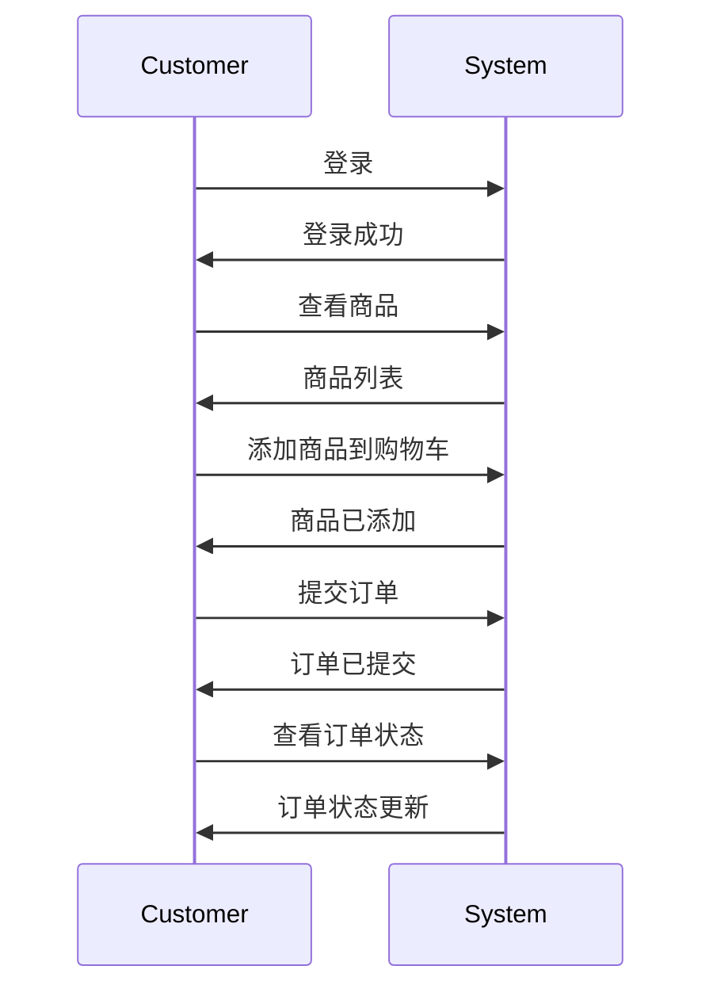

                 

## 《提示词语言的元数据驱动测试生成》

> 关键词：提示词语言、元数据驱动测试、测试生成、编程语言、软件质量

> 摘要：本文探讨了提示词语言的元数据驱动测试生成方法，通过深入分析提示词语言的基本概念、设计原则和实现方法，以及元数据驱动测试的核心原理和应用，提供了一种提升软件质量、简化测试流程的技术方案。

----------------------------------------------------------------

### 目录

----------------------------------------------------------------

## 第一部分：背景与基础

### 第1章：问题背景与介绍

#### 1.1 问题背景

#### 1.2 元数据驱动测试概述

#### 1.3 提示词语言的基本概念

## 第二部分：核心概念与原理

### 第2章：元数据的定义与类型

### 第3章：测试的基本概念

### 第4章：元数据驱动测试原理

### 第5章：提示词语言的设计原则

### 第6章：提示词语言的实现方法

### 第7章：提示词语言的评估与优化

## 第三部分：应用与实践

### 第8章：元数据驱动测试工具介绍

### 第9章：项目实战

### 第10章：总结与展望

----------------------------------------------------------------

## 第一部分：背景与基础

### 第1章：问题背景与介绍

在当今的软件工程领域，确保软件质量是开发过程中的核心任务之一。测试是保证软件质量的关键环节，而传统的测试方法通常依赖于手工编写测试用例，这不仅费时费力，而且容易遗漏潜在的问题。为了提高测试效率和质量，元数据驱动测试生成方法应运而生。

#### 1.1 问题背景

随着软件系统的复杂度不断增加，测试工作变得越来越繁重。手动编写测试用例不仅需要大量的时间和精力，而且难以覆盖所有的可能场景，导致测试覆盖率不足。同时，当系统发生变化时，测试用例也需要相应地更新，增加了维护的复杂性。

#### 1.2 元数据驱动测试概述

元数据驱动测试（Metadata-Driven Testing，简称MDT）是一种基于元数据的测试方法。元数据是对数据的描述，它可以用来指导测试用例的生成、执行和结果分析。通过元数据，测试工程师可以更加灵活地定义测试逻辑，提高测试覆盖率和准确性。

#### 1.3 提示词语言的应用场景

提示词语言（Keyword-Driven Language，简称KDL）是一种专门为元数据驱动测试设计的编程语言。它使用一组关键词和预定义的语法规则，使得测试用例的编写更加直观和自动化。提示词语言的应用场景包括但不限于：

1. **自动化测试**：通过提示词语言，测试人员可以轻松地编写自动化测试脚本，提高测试的执行速度和效率。
2. **持续集成**：在持续集成（CI）流程中，提示词语言可以帮助自动生成测试用例，确保每次代码提交后都能进行全面测试。
3. **复杂逻辑测试**：对于具有复杂业务逻辑的系统，提示词语言可以简化测试用例的编写，使得测试流程更加清晰和易于维护。

## 第二部分：核心概念与原理

### 第2章：元数据的定义与类型

元数据是对数据的数据进行描述的信息。在元数据驱动测试中，元数据用于描述测试用例、测试数据、测试环境和测试结果等。元数据通常包括以下类型：

1. **测试用例元数据**：描述测试用例的名称、目的、输入、预期输出等。
2. **测试数据元数据**：描述测试过程中使用的测试数据，如数据集、参数值等。
3. **测试环境元数据**：描述测试执行所需的硬件、软件和环境配置。
4. **测试结果元数据**：描述测试执行的结果，如测试通过、失败、错误等。

### 第3章：测试的基本概念

测试是确保软件质量的一种活动，其目的是发现软件中的缺陷和问题。测试的基本概念包括：

1. **测试用例**：一组测试操作，用于验证软件功能是否按照预期工作。
2. **测试套件**：一组相关的测试用例，通常用于测试软件的某个模块或功能。
3. **测试覆盖率**：测试用例覆盖的代码比例，是衡量测试质量的重要指标。
4. **测试失败率**：测试失败用例占总测试用例的比例，反映了软件的质量状况。

### 第4章：元数据驱动测试原理

元数据驱动测试的核心思想是将测试过程与元数据紧密结合起来，通过元数据来驱动测试用例的生成、执行和结果分析。其原理包括：

1. **元数据定义**：测试工程师根据测试需求定义元数据，包括测试用例、测试数据和测试环境等。
2. **测试用例生成**：系统根据元数据自动生成测试用例，提高测试覆盖率和准确性。
3. **测试执行**：系统按照生成的测试用例执行测试，记录测试结果。
4. **结果分析**：系统对测试结果进行分析，生成测试报告，帮助测试工程师评估软件质量。

### 第5章：提示词语言的设计原则

提示词语言的设计原则包括：

1. **可读性与可理解性**：提示词语言应具有清晰的语法和简洁的表达方式，使得测试用例易于编写和理解。
2. **灵活性**：提示词语言应支持多种测试场景和测试策略，满足不同类型的测试需求。
3. **可扩展性**：提示词语言应支持自定义关键词和语法规则，以适应不断变化的测试需求。
4. **可维护性**：提示词语言应具有良好的可维护性，便于测试工程师进行维护和更新。

### 第6章：提示词语言的实现方法

提示词语言的实现方法包括：

1. **关键词定义**：定义一组用于描述测试操作的提示词，如“输入”、“点击”、“验证”等。
2. **语法规则**：定义提示词之间的组合规则，以形成完整的测试用例。
3. **解析引擎**：实现提示词语言的解析引擎，将输入的提示词序列转换为可执行的测试用例。
4. **自动化测试框架**：结合自动化测试框架，实现提示词语言的执行和结果分析功能。

### 第7章：提示词语言的评估与优化

提示词语言的评估与优化包括：

1. **评估指标**：定义评估指标，如测试覆盖率、测试效率、测试失败率等。
2. **性能优化**：针对评估结果，优化提示词语言的执行效率，如优化语法解析、测试用例生成等。
3. **用户体验优化**：优化提示词语言的交互界面和操作流程，提高测试工程师的体验。

## 第三部分：应用与实践

### 第8章：元数据驱动测试工具介绍

元数据驱动测试工具是实现元数据驱动测试的关键组件。常见的元数据驱动测试工具包括：

1. **Selenium**：一款流行的Web自动化测试工具，支持多种编程语言，可以与提示词语言结合使用。
2. **JUnit**：一款Java单元测试框架，支持自定义测试用例和测试结果分析。
3. **JUnitParams**：一款JUnit的参数化测试插件，可以生成多种测试用例，提高测试覆盖率。
4. **CodedUI**：一款微软开发的UI自动化测试工具，支持多种开发语言和操作系统。

### 第9章：项目实战

在本章中，我们将通过一个实际项目案例，展示如何使用提示词语言的元数据驱动测试方法进行测试。

#### 9.1 项目背景

假设我们正在开发一个在线购物平台，需要对其进行全面的测试，以确保其稳定性和可靠性。

#### 9.2 系统设计与实现

首先，我们需要设计系统的架构和接口。以下是一个简化的系统架构设计：



接下来，我们实现系统的功能模块，包括用户登录、商品查看、购物车管理、订单提交和订单状态查询等。

#### 9.3 测试用例设计与执行

根据系统功能设计，我们设计以下测试用例：

1. 登录功能测试
2. 商品查看功能测试
3. 购物车管理功能测试
4. 订单提交功能测试
5. 订单状态查询功能测试

使用提示词语言编写测试用例，如下所示：

```python
# 登录功能测试
@Test
def test_login():
    # 输入用户名和密码
    input_username("test_user")
    input_password("test_password")
    # 点击登录按钮
    click_login_button()
    # 验证登录成功
    assert is_login_successful()

# 商品查看功能测试
@Test
def test_view_products():
    # 查看商品列表
    view_products()
    # 验证商品列表显示正常
    assert are_products_displayed()

# 购物车管理功能测试
@Test
def test_shopping_cart():
    # 添加商品到购物车
    add_product_to_cart("Product A")
    # 验证商品已添加到购物车
    assert is_product_in_cart("Product A")

# 订单提交功能测试
@Test
def test_place_order():
    # 提交订单
    place_order()
    # 验证订单已提交
    assert is_order_placed()

# 订单状态查询功能测试
@Test
def test_order_status():
    # 查看订单状态
    view_order_status()
    # 验证订单状态更新
    assert is_order_status_updated()
```

执行测试用例，并记录测试结果。根据测试结果，分析和定位问题，并进行相应的修复。

### 第10章：总结与展望

通过本文的讨论，我们了解了提示词语言的元数据驱动测试生成方法，并展示了其在实际项目中的应用。元数据驱动测试生成方法具有以下优势：

1. 提高测试效率和质量
2. 简化测试用例的编写和维护
3. 提高测试覆盖率和准确性

然而，元数据驱动测试生成方法也面临着一些挑战，如如何定义有效的元数据、如何优化提示词语言的性能等。未来，我们需要进一步研究和探索，以解决这些挑战，推动元数据驱动测试生成方法在软件工程领域的广泛应用。

## 附录

### 附录A：提示词语言的关键词定义

以下是一个简化的提示词语言关键词定义表：

| 关键词          | 描述                                                         |
| --------------- | ------------------------------------------------------------ |
| input\_username | 输入用户名                                                   |
| input\_password | 输入密码                                                     |
| click\_login\_button | 点击登录按钮                                                 |
| view\_products | 查看商品列表                                                 |
| add\_product\_to\_cart | 添加商品到购物车                                             |
| place\_order | 提交订单                                                     |
| view\_order\_status | 查看订单状态                                                 |
| assert | 验证结果                                                     |

### 附录B：测试结果分析报告

测试结果分析报告包括以下内容：

1. 测试覆盖率：测试用例覆盖的代码比例
2. 测试失败率：测试失败用例占总测试用例的比例
3. 测试通过率：测试通过用例占总测试用例的比例
4. 测试结果详情：详细记录每个测试用例的执行结果和错误信息
5. 测试报告总结：对测试结果进行总结和分析，提出改进建议

### 附录C：提示词语言的使用示例

以下是一个简单的提示词语言使用示例：

```python
# 登录功能测试
test_login():
    # 输入用户名
    input_username("test_user")
    # 输入密码
    input_password("test_password")
    # 点击登录按钮
    click_login_button()
    # 验证登录成功
    assert is_login_successful()

# 商品查看功能测试
test_view_products():
    # 查看商品列表
    view_products()
    # 验证商品列表显示正常
    assert are_products_displayed()

# 购物车管理功能测试
test_shopping_cart():
    # 添加商品到购物车
    add_product_to_cart("Product A")
    # 验证商品已添加到购物车
    assert is_product_in_cart("Product A")

# 订单提交功能测试
test_place_order():
    # 提交订单
    place_order()
    # 验证订单已提交
    assert is_order_placed()

# 订单状态查询功能测试
test_order_status():
    # 查看订单状态
    view_order_status()
    # 验证订单状态更新
    assert is_order_status_updated()
```

## 作者信息

作者：AI天才研究院/AI Genius Institute & 禅与计算机程序设计艺术 /Zen And The Art of Computer Programming

本文由AI天才研究院（AI Genius Institute）和《禅与计算机程序设计艺术》（Zen And The Art of Computer Programming）的作者共同撰写，旨在探讨提示词语言的元数据驱动测试生成方法，为软件工程领域提供一种有效的质量保证方案。

## 结语

在本文中，我们深入探讨了提示词语言的元数据驱动测试生成方法，分析了其核心概念、设计原则和实现方法，并通过实际项目展示了其应用效果。元数据驱动测试生成方法具有提高测试效率和质量、简化测试用例编写和维护、提高测试覆盖率和准确性的优势。然而，该方法也面临着一些挑战，如元数据定义的有效性和提示词语言性能优化等。未来，我们需要进一步研究和探索，以推动元数据驱动测试生成方法在软件工程领域的广泛应用。希望本文能为读者提供有价值的参考和启示。

