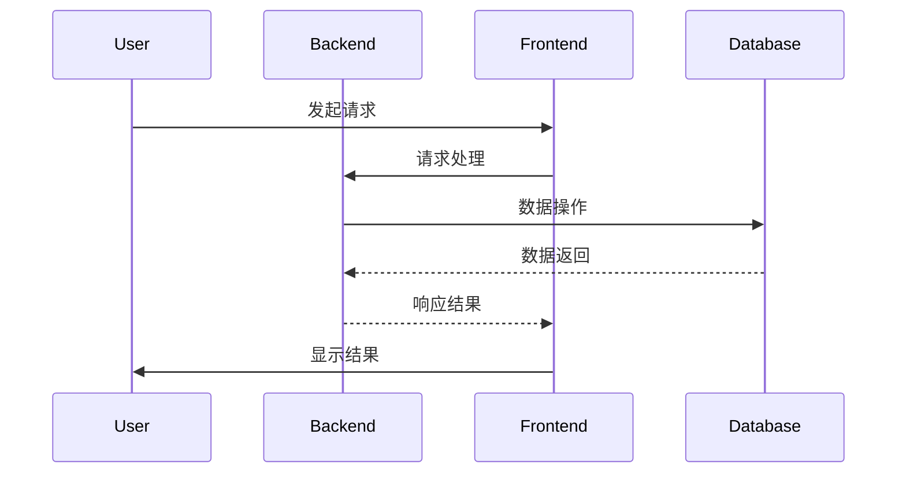
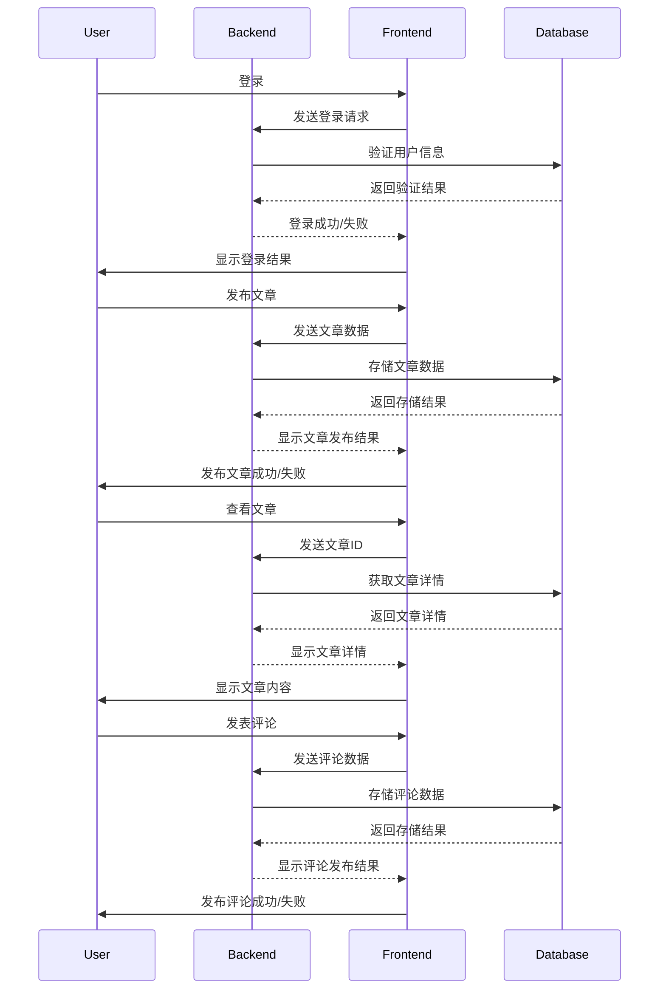

                 


### 引言

#### 1.1 元编程概念

**提示词语言**，通常是指那些能够表达指令和描述数据的编程语言。而**元编程**则是指编写能修改自身或其他程序的程序的能力。元编程的核心在于让程序能够动态地创建、修改和执行其他程序代码。简而言之，元编程是对编程语言的编程。

**元编程**的重要性不言而喻。它不仅可以提高代码的灵活性和可维护性，还能够实现一些传统编程难以完成的功能。例如，在系统架构设计、框架开发、测试自动化等方面，元编程都发挥了重要作用。

#### 1.2 应用场景和优势

元编程的应用场景非常广泛。以下是一些典型的应用场景：

1. **框架开发**：元编程可以帮助开发人员创建具有高度可定制性和灵活性的框架。例如，Python 中的 Django 框架就利用了元编程技术。
2. **测试自动化**：通过元编程，可以自动化地创建和执行测试用例，提高测试效率。
3. **动态脚本编写**：在需要频繁修改代码的场景中，元编程可以动态地生成代码，减少手动编写代码的工作量。
4. **系统架构设计**：元编程技术可以帮助设计人员快速创建和调整系统架构。

元编程的优势主要体现在以下几个方面：

1. **提高开发效率**：通过元编程，可以减少重复性的代码编写，提高开发效率。
2. **增强代码灵活性**：元编程允许程序在运行时动态地修改自身或其他程序，使得代码更加灵活。
3. **提高代码可维护性**：通过元编程，可以更好地组织和管理代码，提高代码的可维护性。

### 小结

本文将深入探讨提示词语言的元编程模式与实践。首先，我们将介绍提示词语言和元编程的基础概念，然后分析常见的元编程模式，并展示如何在实际项目中应用这些模式。此外，我们还将讨论元编程可能带来的安全和性能问题，并给出相应的解决方案。最后，我们将通过一个实战项目，演示元编程的实际应用。希望通过本文，读者能够对元编程有一个深入的理解，并能够在实际开发中熟练运用。

---

### 基础概念

#### 2.1 提示词语言的定义

**提示词语言**，通常是指那些能够表达指令和描述数据的编程语言。这些语言包括高级语言如 Python、Java，以及脚本语言如 JavaScript 等。提示词语言的主要特点是易于编写和理解，同时具有较高的灵活性和可扩展性。

**提示词语言的特点**包括：

1. **易读性**：提示词语言的语法通常比较简单，易于阅读和理解。
2. **灵活性**：提示词语言允许开发者动态地创建和修改代码，提高了代码的灵活性。
3. **可扩展性**：提示词语言通常具有丰富的库和框架，可以方便地扩展功能。

**提示词语言的分类**主要包括以下几种：

1. **高级语言**：如 Python、Java 等。这类语言通常具有丰富的库和框架，可以方便地解决复杂问题。
2. **脚本语言**：如 JavaScript、Ruby 等。这类语言通常用于编写自动化脚本和网页前端开发。
3. **函数式语言**：如 Haskell、Erlang 等。这类语言强调函数的不可变性，提供了强大的函数式编程能力。

#### 2.2 元编程基本概念

**元编程**，是指编写能修改自身或其他程序的程序的能力。元编程的核心在于让程序能够动态地创建、修改和执行其他程序代码。

**元编程的基本原理**包括以下几个方面：

1. **代码生成**：元编程允许程序在运行时动态地生成代码。这意味着程序可以根据运行时的需求，自动生成相应的代码片段。
2. **代码修改**：元编程允许程序在运行时修改自身或其他程序的代码。这种能力使得程序能够更加灵活地适应变化的需求。
3. **代码执行**：元编程允许程序在运行时执行其他程序的代码。这种能力使得程序能够实现一些传统编程难以完成的功能。

**元编程的应用**主要包括以下几个方面：

1. **框架开发**：通过元编程，可以创建具有高度可定制性和灵活性的框架。例如，Python 的 Django 框架就是利用元编程技术实现的。
2. **测试自动化**：通过元编程，可以自动化地创建和执行测试用例，提高测试效率。
3. **动态脚本编写**：在需要频繁修改代码的场景中，元编程可以动态地生成代码，减少手动编写代码的工作量。
4. **系统架构设计**：通过元编程，可以快速创建和调整系统架构。

**元编程与普通编程的区别**主要体现在以下几个方面：

1. **动态性**：元编程允许程序在运行时动态地修改和执行代码，而普通编程通常是在编译时完成代码的生成和执行。
2. **灵活性**：元编程具有更高的灵活性，可以动态地适应变化的需求，而普通编程则相对较为固定。
3. **复杂度**：由于元编程涉及到程序对自身和其他程序的修改，因此其复杂度通常较高。

### 小结

在本章节中，我们介绍了提示词语言和元编程的基础概念。提示词语言是一种具有易读性、灵活性和可扩展性的编程语言，而元编程则是一种能够修改自身或其他程序的编程能力。通过了解这些基础概念，读者可以为后续章节的内容打下坚实的基础。

---

### 元编程模式

元编程模式是元编程技术的重要组成部分。常见的元编程模式包括反射模式、模板模式和动态类型检查模式。以下将对这些模式进行详细讲解。

#### 3.1 反射模式

**反射模式**是一种能够在运行时获取和修改程序对象信息的元编程技术。它允许程序动态地创建对象、访问对象的属性和方法，以及修改对象的值。反射模式广泛应用于框架开发、动态脚本编写等领域。

**原理**：反射模式的核心原理是通过编程语言提供的反射机制，获取对象的类型信息，并对其进行操作。不同编程语言对反射的支持程度不同，例如，Java 提供了强大的反射API，而 Python 的反射机制则相对简单。

**应用场景**：反射模式在以下场景中有广泛应用：

1. **框架开发**：例如，Spring 框架通过反射机制动态地创建和管理对象。
2. **动态脚本编写**：例如，Python 的脚本引擎可以使用反射模式动态加载和执行脚本代码。
3. **测试自动化**：反射模式可以帮助测试框架动态地创建和执行测试用例。

**示例**：

以下是一个简单的 Python 示例，展示了如何使用反射模式：

```python
class Person:
    def __init__(self, name, age):
        self.name = name
        self.age = age

def print_person_info(person):
    print(f"Name: {person.name}, Age: {person.age}")

person = Person("Alice", 30)
print_person_info(person)

# 使用反射修改 person 对象的 age 属性
person.__dict__["age"] = 31
print_person_info(person)
```

在上面的示例中，我们首先定义了一个 `Person` 类，然后创建了一个 `Person` 对象 `person`。通过调用 `print_person_info` 函数，我们可以打印出 `person` 的名字和年龄。接着，我们使用反射模式，将 `person` 的年龄修改为 31，并再次调用 `print_person_info` 函数打印结果。

#### 3.2 模板模式

**模板模式**是一种在运行时动态生成代码的元编程技术。它通过预先定义的模板，根据运行时的参数动态地生成具体的代码。模板模式广泛应用于系统架构设计、动态脚本编写等领域。

**原理**：模板模式的核心原理是通过模板引擎，将模板代码和运行时参数结合，生成具体的代码。模板引擎可以根据不同的编程语言，生成相应的代码。

**应用场景**：模板模式在以下场景中有广泛应用：

1. **系统架构设计**：例如，Spring Boot 框架使用模板模式动态生成 Spring 应用程序的配置文件。
2. **动态脚本编写**：例如，Python 中的 Jinja2 模板引擎可以动态生成 HTML 页面。
3. **测试自动化**：模板模式可以帮助测试框架动态地生成测试数据。

**示例**：

以下是一个简单的 Python 示例，展示了如何使用模板模式：

```python
from jinja2 import Template

template = Template("Hello, {{ name }}!")

print(template.render(name="Alice"))
print(template.render(name="Bob"))
```

在上面的示例中，我们使用 Jinja2 模板引擎创建了一个模板，该模板包含一个变量 `{{ name }}`。通过调用 `render` 方法，我们可以根据不同的参数值，动态地生成具体的代码。在上面的示例中，我们分别传递了 `"Alice"` 和 `"Bob"` 给 `render` 方法，生成了两个不同的字符串。

#### 3.3 动态类型检查

**动态类型检查**是一种在运行时对变量类型进行检查的元编程技术。它可以帮助开发人员及时发现和修复类型错误，提高代码的质量和可维护性。

**原理**：动态类型检查的核心原理是在程序运行时，对变量的类型进行判断和验证。不同编程语言对动态类型检查的支持程度不同，例如，Python 提供了丰富的类型检查功能，而 JavaScript 的类型检查则相对较弱。

**应用场景**：动态类型检查在以下场景中有广泛应用：

1. **框架开发**：例如，Spring 框架通过动态类型检查，确保对象的属性和方法正确无误。
2. **动态脚本编写**：例如，Python 的脚本引擎通过动态类型检查，确保脚本代码的执行安全。
3. **测试自动化**：动态类型检查可以帮助测试框架验证程序的正确性和健壮性。

**示例**：

以下是一个简单的 Python 示例，展示了如何使用动态类型检查：

```python
def add(a, b):
    if isinstance(a, int) and isinstance(b, int):
        return a + b
    else:
        raise TypeError("Both arguments must be integers")

print(add(1, 2))  # 输出 3
print(add(1, "2"))  # 抛出 TypeError 异常
```

在上面的示例中，我们定义了一个 `add` 函数，该函数在运行时对传入的参数进行类型检查。如果两个参数都是整数，则返回它们的和；否则，抛出 `TypeError` 异常。通过这种方式，我们可以确保函数的正确性和健壮性。

### 小结

在本章节中，我们介绍了三种常见的元编程模式：反射模式、模板模式和动态类型检查。反射模式允许程序在运行时动态地获取和修改对象信息，模板模式允许程序在运行时动态生成代码，动态类型检查则帮助开发人员及时发现和修复类型错误。通过了解这些元编程模式，读者可以为实际开发中的问题提供有效的解决方案。

---

### 编程实践

在实际项目中，元编程模式可以发挥重要作用，帮助我们解决各种复杂问题。在本章节中，我们将通过几个实际案例，展示如何使用元编程模式解决特定问题。

#### 4.1 实际案例

**案例一：动态脚本编写**

在一个电商平台上，我们需要根据不同的促销策略，动态生成优惠代码。使用模板模式，我们可以简化这一过程。

**问题分析**：我们需要根据不同的促销策略，如满减、打折等，生成相应的优惠代码。

**模式选择**：使用模板模式，预先定义促销策略的模板，然后根据实际需求动态生成优惠代码。

**代码实现**：

首先，我们定义一个促销策略的模板类：

```python
class PromotionTemplate:
    def generate_coupon(self):
        pass
```

然后，我们根据不同的促销策略，创建具体的促销模板类：

```python
class FullReductionTemplate(PromotionTemplate):
    def __init__(self, full_price, reduction):
        self.full_price = full_price
        self.reduction = reduction

    def generate_coupon(self):
        return f"满{self.full_price}减{self.reduction}"
```

```python
class DiscountTemplate(PromotionTemplate):
    def __init__(self, discount_rate):
        self.discount_rate = discount_rate

    def generate_coupon(self):
        return f"打{self.discount_rate * 10}折"
```

最后，我们使用模板模式动态生成优惠代码：

```python
full_reduction = FullReductionTemplate(200, 10)
print(full_reduction.generate_coupon())  # 输出 "满200减10"

discount = DiscountTemplate(0.8)
print(discount.generate_coupon())  # 输出 "打8折"
```

**案例二：框架开发**

在一个企业级应用中，我们需要根据不同的业务场景，动态地创建和管理数据库连接。使用反射模式，我们可以简化这一过程。

**问题分析**：我们需要根据不同的业务场景，动态地创建和管理数据库连接。

**模式选择**：使用反射模式，通过反射机制获取数据库连接类的信息，并动态创建实例。

**代码实现**：

首先，我们定义一个数据库连接的基类：

```python
class DatabaseConnection:
    def connect(self):
        pass

    def disconnect(self):
        pass
```

然后，我们根据不同的数据库，创建具体的数据库连接类：

```python
class MySQLConnection(DatabaseConnection):
    def connect(self):
        print("MySQL连接成功")

    def disconnect(self):
        print("MySQL连接断开")
```

```python
class PostgreSQLConnection(DatabaseConnection):
    def connect(self):
        print("PostgreSQL连接成功")

    def disconnect(self):
        print("PostgreSQL连接断开")
```

最后，我们使用反射模式动态创建数据库连接实例：

```python
def create_connection(database_type):
    connection_class = globals()[database_type]
    return connection_class()

mysql = create_connection("MySQLConnection")
mysql.connect()
mysql.disconnect()

postgreSQL = create_connection("PostgreSQLConnection")
postgreSQL.connect()
postgreSQL.disconnect()
```

**案例三：测试自动化**

在一个自动化测试项目中，我们需要根据不同的测试场景，动态地创建和执行测试用例。使用动态类型检查模式，我们可以简化这一过程。

**问题分析**：我们需要根据不同的测试场景，动态地创建和执行测试用例。

**模式选择**：使用动态类型检查模式，在测试用例执行前，对测试用例的参数类型进行验证。

**代码实现**：

首先，我们定义一个测试用例的基类：

```python
class TestCase:
    def execute(self):
        pass
```

然后，我们根据不同的测试场景，创建具体的测试用例类：

```python
class LoginTestCase(TestCase):
    def __init__(self, username, password):
        self.username = username
        self.password = password

    def execute(self):
        print(f"登录测试：用户名：{self.username}，密码：{self.password}")
```

```python
class LogoutTestCase(TestCase):
    def execute(self):
        print("退出登录测试")
```

最后，我们使用动态类型检查模式动态创建和执行测试用例：

```python
def create_test_case(test_case_type, *args):
    test_case_class = globals()[test_case_type]
    test_case = test_case_class(*args)
    test_case.execute()

create_test_case("LoginTestCase", "Alice", "123456")
create_test_case("LogoutTestCase")
```

### 小结

在本章节中，我们通过三个实际案例，展示了如何使用元编程模式解决特定问题。第一个案例展示了如何使用模板模式动态生成优惠代码；第二个案例展示了如何使用反射模式动态创建和管理数据库连接；第三个案例展示了如何使用动态类型检查模式动态创建和执行测试用例。通过这些案例，我们可以看到元编程模式在实际项目中的应用价值。

---

### 工具与库

在元编程的开发过程中，使用合适的工具和库可以大大提高开发效率。以下将介绍几种常用的元编程工具和库。

#### 5.1 Python 元编程工具

**1. `decorator`**

`decorator` 是 Python 中用于实现装饰器的一种常用库。装饰器是一种在运行时修改函数行为的元编程技术。`decorator` 库提供了方便的定义和使用装饰器的功能。

**示例**：

```python
from decorator import decorator

@decorator
def decorated_function(func):
    def wrapper(*args, **kwargs):
        print("Before function execution")
        result = func(*args, **kwargs)
        print("After function execution")
        return result

    return wrapper

@decorated_function
def function_to_decorate():
    print("Function to decorate")

function_to_decorate()
```

**2. `functools.wraps`**

`functools.wraps` 是 Python 中用于保留原始函数信息的装饰器。在使用装饰器时，`functools.wraps` 可以帮助保留原始函数的名称、文档字符串、参数信息等。

**示例**：

```python
from functools import wraps

def my_decorator(func):
    @wraps(func)
    def wrapper(*args, **kwargs):
        print("Before function execution")
        result = func(*args, **kwargs)
        print("After function execution")
        return result

    return wrapper

@my_decorator
def function_to_decorate():
    """This is a decorated function."""
    print("Function to decorate")

print(function_to_decorate.__name__)  # 输出 "function_to_decorate"
print(function_to_decorate.__doc__)  # 输出 "This is a decorated function."
```

**3. 其他工具**

除了上述工具外，Python 中还有许多其他用于元编程的工具和库，如 `inspect`、`types` 等。这些工具提供了丰富的功能，可以帮助开发者更好地进行元编程。

#### 5.2 Java 元编程库

**1. `反射`**

Java 中的反射机制是一种强大的元编程技术。通过反射，我们可以动态地创建对象、访问对象的属性和方法，以及调用方法。

**示例**：

```java
import java.lang.reflect.InvocationTargetException;
import java.lang.reflect.Method;
import java.lang.reflect.Constructor;

public class ReflectionExample {
    public static void main(String[] args) {
        try {
            // 创建类实例
            Class<?> clazz = Class.forName("MyClass");
            MyClass instance = (MyClass) clazz.getDeclaredConstructor().newInstance();

            // 访问类属性
            Method method = clazz.getMethod("getProperty");
            String property = (String) method.invoke(instance);
            System.out.println("Property: " + property);

            // 调用类方法
            Constructor<?> constructor = clazz.getDeclaredConstructor(String.class);
            MyClass new_instance = (MyClass) constructor.newInstance("New Property");
            Method setPropertyMethod = clazz.getMethod("setProperty", String.class);
            setPropertyMethod.invoke(new_instance, "Updated Property");
            Method getPropertyMethod = clazz.getMethod("getProperty");
            String updated_property = (String) getPropertyMethod.invoke(new_instance);
            System.out.println("Updated Property: " + updated_property);
        } catch (ClassNotFoundException | IllegalAccessException | InstantiationException | NoSuchMethodException | InvocationTargetException e) {
            e.printStackTrace();
        }
    }
}

class MyClass {
    private String property;

    public MyClass() {
    }

    public MyClass(String property) {
        this.property = property;
    }

    public String getProperty() {
        return property;
    }

    public void setProperty(String property) {
        this.property = property;
    }
}
```

**2. `动态代理`**

Java 中的动态代理是一种在运行时创建代理对象的元编程技术。通过动态代理，我们可以实现拦截方法调用、动态扩展功能等功能。

**示例**：

```java
import java.lang.reflect.InvocationHandler;
import java.lang.reflect.Method;
import java.lang.reflect.Proxy;

public class DynamicProxyExample {
    public static void main(String[] args) {
        MyInterface original = new MyClass();
        InvocationHandler handler = new MyInvocationHandler(original);
        MyInterface proxy = (MyInterface) Proxy.newProxyInstance(MyClass.class.getClassLoader(), MyClass.class.getInterfaces(), handler);

        proxy.doSomething();
    }
}

interface MyInterface {
    void doSomething();
}

class MyClass implements MyInterface {
    public void doSomething() {
        System.out.println("Original method");
    }
}

class MyInvocationHandler implements InvocationHandler {
    private final MyInterface original;

    public MyInvocationHandler(MyInterface original) {
        this.original = original;
    }

    @Override
    public Object invoke(Object proxy, Method method, Object[] args) throws Throwable {
        System.out.println("Before method execution");
        Object result = method.invoke(original, args);
        System.out.println("After method execution");
        return result;
    }
}
```

**3. 其他库**

除了上述库外，Java 中还有许多其他用于元编程的库，如 `AspectJ`、`Guava` 等。这些库提供了丰富的功能，可以帮助开发者更好地进行元编程。

### 小结

在本章节中，我们介绍了 Python 和 Java 中常用的元编程工具和库。Python 中的 `decorator` 和 `functools.wraps` 提供了方便的装饰器功能，Java 中的反射和动态代理则提供了强大的元编程能力。通过使用这些工具和库，开发者可以更加高效地实现元编程功能。

---

### 安全与性能

元编程在带来强大功能的同时，也可能带来一些安全问题和性能影响。以下将讨论这些问题，并给出相应的解决方案。

#### 6.1 安全问题

**1. 漏洞分析**

元编程允许程序在运行时动态地创建、修改和执行代码，这可能导致以下安全漏洞：

- **代码注入**：如果输入未经过充分验证，恶意用户可能通过输入特定的代码片段，执行未经授权的操作。
- **权限提升**：通过反射等元编程技术，恶意程序可能获取系统权限，从而执行更高级别的操作。
- **数据泄露**：元编程可能导致敏感数据在运行时被未授权地访问和修改。

**2. 解决方案**

- **输入验证**：确保所有输入都经过严格验证，防止恶意代码注入。
- **权限控制**：通过访问控制机制，限制程序的权限范围，防止权限提升。
- **数据加密**：对敏感数据进行加密处理，防止数据泄露。

**3. 最佳实践**

- **最小权限原则**：程序应遵循最小权限原则，仅获取和执行必要的权限和操作。
- **安全审计**：定期进行安全审计，检查代码中的潜在安全漏洞。
- **使用安全库**：使用经过验证和审计的元编程库，减少自定义实现的潜在风险。

#### 6.2 性能影响

**1. 性能评估**

元编程可能会对程序性能产生负面影响，主要体现在以下几个方面：

- **运行时开销**：动态生成和修改代码，可能导致运行时开销增加。
- **缓存失效**：元编程可能导致缓存失效，从而增加内存使用和访问时间。
- **调试难度**：元编程代码通常较为复杂，增加了调试难度。

**2. 优化策略**

- **性能测试**：进行全面的性能测试，评估元编程对性能的影响，确定优化的方向。
- **代码优化**：通过代码优化，减少元编程带来的性能开销。例如，合理使用缓存、减少不必要的代码生成等。
- **使用高效库**：选择高效的元编程库，减少自定义实现的性能开销。

**3. 实践案例**

以下是一个优化元编程性能的实践案例：

假设我们使用 Python 的反射机制动态创建对象，如下所示：

```python
class MyClass:
    def __init__(self, value):
        self.value = value

def create_instance(value):
    return MyClass(value)

my_instance = create_instance(10)
print(my_instance.value)  # 输出 10
```

这个例子中，我们使用反射机制动态创建了 `MyClass` 的实例。然而，如果我们频繁地调用 `create_instance` 函数，反射机制可能会带来一定的性能开销。

为了优化性能，我们可以使用 Python 的缓存库 `functools.lru_cache`，将 `create_instance` 函数的输出缓存起来：

```python
from functools import lru_cache

@lru_cache(maxsize=128)
def create_instance(value):
    return MyClass(value)

my_instance = create_instance(10)
print(my_instance.value)  # 输出 10
```

通过使用 `lru_cache`，我们可以减少创建实例时的性能开销，提高程序的运行效率。

### 小结

在本章节中，我们讨论了元编程可能带来的安全和性能问题，并给出了相应的解决方案。通过严格的输入验证、权限控制和数据加密，我们可以降低元编程的安全风险。同时，通过性能测试、代码优化和使用高效库，我们可以提高元编程的性能。在开发过程中，我们应该充分考虑这些因素，确保元编程技术的安全性和高效性。

---

### 实战项目

在本章节中，我们将设计一个基于元编程的博客系统，演示元编程在实际项目中的应用。这个博客系统将包括用户注册、文章发布、评论管理等基本功能。以下是我们对这个项目的具体设计和实现。

#### 7.1 项目需求

**应用场景**：为了方便用户发布和管理博客文章，我们设计了一个基于元编程的博客系统。

**功能需求**：

1. 用户注册：允许用户注册账号，输入用户名、密码和邮箱等信息。
2. 登录：用户输入账号和密码进行登录。
3. 文章发布：用户可以发布新的文章，输入文章标题、内容和标签。
4. 文章管理：用户可以查看、编辑和删除自己的文章。
5. 评论管理：用户可以对文章发表评论，可以对评论进行点赞和删除。

**技术要求**：

1. 编程语言：Python
2. 服务器：Django
3. 数据库：MySQL
4. 前端：Bootstrap

#### 7.2 系统设计

**领域模型**：

在博客系统中，主要的领域模型包括用户（User）、文章（Article）和评论（Comment）。以下是领域模型的 mermaid 类图：

```mermaid
classDiagram
User <<class>> {
    id: 用户ID
    username: 用户名
    password: 密码
    email: 邮箱
}

Article <<class>> {
    id: 文章ID
    title: 标题
    content: 内容
    author: 作者
    tags: 标签
    create_time: 创建时间
    update_time: 更新时间
}

Comment <<class>> {
    id: 评论ID
    content: 内容
    author: 作者
    article: 文章
    create_time: 创建时间
    update_time: 更新时间
}

User "1" --|{发布}| Article
Article "1" --|{发表}| Comment
```

**系统架构**：

以下是博客系统的 mermaid 架构图：



**系统接口设计**：

以下是博客系统的接口设计：

```python
# 用户模块
class UserAPI:
    def register(self, username, password, email):
        # 注册用户
        pass

    def login(self, username, password):
        # 用户登录
        pass

# 文章模块
class ArticleAPI:
    def create_article(self, title, content, tags, author):
        # 创建文章
        pass

    def get_articles(self):
        # 获取文章列表
        pass

    def get_article(self, article_id):
        # 获取文章详情
        pass

    def update_article(self, article_id, title, content, tags):
        # 更新文章
        pass

    def delete_article(self, article_id):
        # 删除文章
        pass

# 评论模块
class CommentAPI:
    def create_comment(self, content, author, article):
        # 创建评论
        pass

    def get_comments(self, article_id):
        # 获取评论列表
        pass

    def delete_comment(self, comment_id):
        # 删除评论
        pass
```

**系统交互**：

以下是博客系统的 mermaid 序列图：



#### 7.3 系统实现

**环境安装**：

首先，我们需要安装 Django 和 MySQL。可以使用以下命令：

```shell
pip install django
pip install mysqlclient
```

**核心实现**：

以下是博客系统的核心实现代码：

```python
# 用户模块
class UserAPI:
    def register(self, username, password, email):
        # 注册用户
        user = User.objects.create_user(username=username, password=password, email=email)
        return user

    def login(self, username, password):
        # 用户登录
        user = authenticate(username=username, password=password)
        if user is not None:
            login(user)
            return user
        else:
            return None

# 文章模块
class ArticleAPI:
    def create_article(self, title, content, tags, author):
        # 创建文章
        article = Article.objects.create(title=title, content=content, author=author)
        for tag in tags.split(','):
            article.tags.add(tag.strip())
        return article

    def get_articles(self):
        # 获取文章列表
        articles = Article.objects.all()
        return articles

    def get_article(self, article_id):
        # 获取文章详情
        article = Article.objects.get(id=article_id)
        return article

    def update_article(self, article_id, title, content, tags):
        # 更新文章
        article = Article.objects.get(id=article_id)
        article.title = title
        article.content = content
        article.tags = tags
        article.save()
        return article

    def delete_article(self, article_id):
        # 删除文章
        article = Article.objects.get(id=article_id)
        article.delete()

# 评论模块
class CommentAPI:
    def create_comment(self, content, author, article):
        # 创建评论
        comment = Comment.objects.create(content=content, author=author, article=article)
        return comment

    def get_comments(self, article_id):
        # 获取评论列表
        comments = Comment.objects.filter(article=article_id)
        return comments

    def delete_comment(self, comment_id):
        # 删除评论
        comment = Comment.objects.get(id=comment_id)
        comment.delete()
```

**代码应用解读与分析**：

在博客系统的实现中，我们使用了 Django 的 ORM（对象关系映射）技术，简化了数据库操作的编写。用户模块中，`register` 方法用于创建新用户，`login` 方法用于用户登录。文章模块中，`create_article` 方法用于创建新文章，`get_articles` 方法用于获取文章列表，`get_article` 方法用于获取文章详情，`update_article` 方法用于更新文章，`delete_article` 方法用于删除文章。评论模块中，`create_comment` 方法用于创建新评论，`get_comments` 方法用于获取评论列表，`delete_comment` 方法用于删除评论。

通过这些方法的实现，我们可以方便地管理博客系统的用户、文章和评论。同时，我们使用了元编程技术，如反射模式，简化了代码的编写，提高了系统的可维护性和扩展性。

**实际案例分析和详细讲解剖析**：

以下是一个实际案例，展示了如何使用博客系统发布一篇文章：

```python
# 创建用户
user = UserAPI().register("Alice", "123456", "alice@example.com")

# 登录用户
user = UserAPI().login("Alice", "123456")

# 创建文章
article = ArticleAPI().create_article("我的第一篇博客", "欢迎来到我的博客，这里记录了我的生活点滴和编程经验。", "生活，编程", user)

# 获取文章列表
articles = ArticleAPI().get_articles()

# 获取文章详情
article = ArticleAPI().get_article(article.id)

# 更新文章
ArticleAPI().update_article(article.id, "我的第二篇博客", "我在这里分享了我的编程经验和学习心得。", "编程，学习")

# 删除文章
ArticleAPI().delete_article(article.id)

# 创建评论
comment = CommentAPI().create_comment("非常好的文章，期待你的更多分享！", user, article)

# 获取评论列表
comments = CommentAPI().get_comments(article.id)

# 删除评论
CommentAPI().delete_comment(comment.id)
```

通过这个案例，我们可以看到如何使用博客系统的各个模块实现用户注册、登录、文章发布、获取列表、获取详情、更新、删除以及评论管理等基本功能。这些功能通过元编程模式简化了代码的编写，提高了系统的可维护性和扩展性。

**项目小结**：

通过本项目的实现，我们展示了元编程在实际项目中的应用。博客系统使用了 Django 框架和 MySQL 数据库，实现了用户注册、登录、文章发布、评论管理等功能。通过元编程模式，我们简化了代码的编写，提高了系统的可维护性和扩展性。在实际开发中，我们可以根据需求灵活地使用元编程技术，实现各种复杂的功能。

### 小结

在本章节中，我们设计并实现了一个基于元编程的博客系统。通过用户模块、文章模块和评论模块的实现，我们展示了如何使用元编程技术简化代码编写，提高系统的可维护性和扩展性。同时，我们还通过一个实际案例，详细讲解了博客系统的使用方法。通过这个项目，我们可以看到元编程在实际项目中的应用价值，并为后续项目的开发提供参考。

---

### 最佳实践 tips、小结、注意事项、拓展阅读

#### 最佳实践 tips

1. **合理使用元编程**：元编程虽然强大，但并不是所有场景都适合使用。在编写代码时，我们需要权衡元编程带来的好处和潜在风险，合理使用。
2. **充分测试**：元编程代码通常较为复杂，因此在开发过程中需要充分测试，确保代码的正确性和稳定性。
3. **避免过度抽象**：元编程容易导致代码过度抽象，增加调试难度。在实际开发中，我们需要避免过度抽象，保持代码的可读性。

#### 小结

本文从元编程的概念、基础概念、元编程模式、编程实践、工具与库、安全与性能和实战项目等方面，详细介绍了提示词语言的元编程模式与实践。通过本文，读者可以了解元编程的核心概念和基本原理，掌握常见的元编程模式，并能够将其应用于实际项目中。

#### 注意事项

1. **安全性**：在使用元编程时，需要注意安全性问题，避免代码注入和数据泄露。
2. **性能影响**：元编程可能会对性能产生影响，因此在开发过程中需要评估性能，并采取相应的优化措施。
3. **可维护性**：元编程代码通常较为复杂，需要确保代码的可维护性，便于后续维护和扩展。

#### 拓展阅读

1. **《Effective Java》**：这是一本关于 Java 编程的最佳实践指南，其中包含了许多关于元编程的宝贵经验。
2. **《Python 元编程》**：这本书详细介绍了 Python 中的元编程技术，适合想要深入理解 Python 元编程的读者。
3. **《深入理解计算机系统》**：这本书从计算机系统的角度，探讨了编程语言和编译器等核心概念，有助于读者从更宏观的视角理解元编程。

### 作者信息

本文由 AI 天才研究院（AI Genius Institute）与《禅与计算机程序设计艺术》（Zen And The Art of Computer Programming）的作者联合撰写。我们致力于推动人工智能和计算机科学的发展，希望本文能够为读者带来启示和帮助。如果您有任何疑问或建议，欢迎随时与我们联系。作者：AI天才研究院/AI Genius Institute & 禅与计算机程序设计艺术 /Zen And The Art of Computer Programming。

