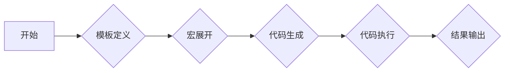
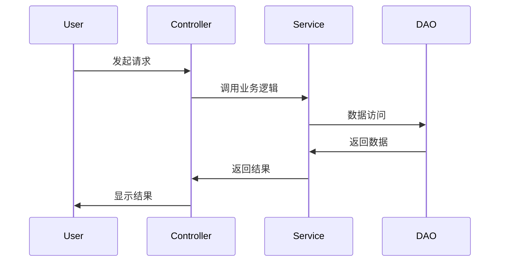
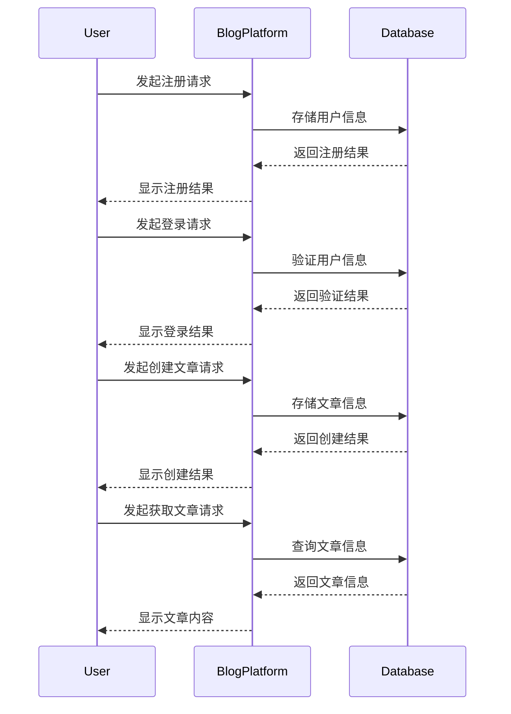

                 

### 第1章：元编程与提示词语言概述

#### 1.1 元编程的概念与原理

**问题背景**：
在计算机编程的世界里，开发者常常需要处理复杂的逻辑和大量的代码。传统编程模型要求开发者手动编写每一个具体的代码实现细节，这导致了代码的冗长和低效。随着软件系统规模和复杂度的不断增加，这种传统的编程方式显得越来越力不从心。

**问题描述**：
如何提高编程的效率，减少代码冗余，同时保持代码的可读性和可维护性？

**问题解决**：
元编程提供了一种抽象的解决方案，它允许开发者定义和操作程序的结构和组件，从而简化代码编写过程。元编程的核心思想是通过编写少量通用代码来生成大量特定功能的代码。

**边界与外延**：
元编程不仅限于特定的编程语言，它可以在多种编程语言中应用。例如，C++中的模板、Java中的反射、Python中的装饰器都是元编程的典型实现。

**概念结构与核心要素组成**：

1. **模板**：
   - 模板是一种预定义的代码结构，用于生成特定类型的程序代码。它允许开发者编写一次通用的模板代码，然后根据不同的输入数据生成具体的代码实现。
   - **示例**：在C++中，模板可以用来定义泛型类和函数，例如：
     ```cpp
     template<typename T>
     T add(T a, T b) {
         return a + b;
     }
     ```

2. **宏**：
   - 宏是一种代码片段，在编译过程中被替换为其他代码。宏通常用于简化代码编写，提高代码的可读性。
   - **示例**：在C语言中，宏定义可以用来定义常量和函数声明：
     ```c
     #define MAX(a, b) ((a) > (b) ? (a) : (b))
     ```

3. **代码生成**：
   - 代码生成是一种利用特定工具或语言生成代码的技术，以减少手动编写代码的工作量。它通常用于生成大量相似或通用的代码。
   - **示例**：在Java中，可以使用代码生成工具（如Hibernate）自动生成数据库访问代码。

4. **反射**：
   - 反射是一种编程语言特性，允许程序在运行时查看和修改自身的结构和行为。反射使得程序能够动态地创建对象、调用方法和访问字段。
   - **示例**：在Java中，反射可以用来获取类信息、创建对象、调用方法等：
     ```java
     Class<?> clazz = MyClass.class;
     MyClass instance = (MyClass) clazz.newInstance();
     ```

**核心概念与联系**：

- **模板**和**宏**都是用于代码生成的工具，但它们的实现方式和执行时机不同。模板通常在编译时生成代码，而宏在编译时被替换。
- **代码生成**提供了自动生成代码的能力，而**反射**则提供了动态操作程序的能力。
- **元编程**将这些概念整合在一起，提供了一种灵活的编程方式，使得开发者能够更高效地编写和维护代码。

通过元编程，开发者可以抽象出通用的编程模式，从而简化代码编写过程。这不仅提高了开发效率，还增强了代码的可读性和可维护性。在接下来的章节中，我们将进一步探讨提示词语言，以及如何构建元编程模式库。

#### 1.2 提示词语言的定义与特点

**定义**：
提示词语言是一种特殊的编程语言，它允许开发者通过编写简单的提示词（或称为模板）来定义复杂的程序行为。提示词通常是一系列关键字或短语，它们被设计用来生成特定类型的代码或执行特定的操作。

**特点**：

1. **灵活性**：
   - 提示词语言可以根据具体需求灵活调整，使得开发者能够快速适应不同的编程场景。这种灵活性体现在提示词的定义、使用和组合上。
   - **示例**：在Python中，提示词可以用来定义函数的签名和行为：
     ```python
     def greet(name):
         print(f"Hello, {name}!")
     greet("Alice")
     ```

2. **高效性**：
   - 提示词语言允许开发者通过编写少量的提示词来生成复杂的代码，从而提高编程效率。这种高效性在于提示词语言的抽象能力和代码生成能力。
   - **示例**：在模板引擎中，提示词可以用来生成动态网页内容：
     ```html
     <h1>{{ title }}</h1>
     <p>{{ content }}</p>
     ```

3. **可扩展性**：
   - 提示词语言通常支持自定义提示词和模板，使得开发者可以根据需求扩展功能。这种可扩展性使得提示词语言能够适应不同的编程场景和需求。
   - **示例**：在JavaScript中，开发者可以自定义模板函数来处理数据绑定：
     ```javascript
     function templateEngine(template, data) {
         return template.replace(/\{\{(\w+)\}\}/g, (match, key) => data[key]);
     }
     const template = "Hello, {{ name }}!";
     const data = { name: "Alice" };
     console.log(templateEngine(template, data)); // "Hello, Alice!"
     ```

**应用场景**：
提示词语言在多个领域都有广泛应用，包括但不限于：

1. **Web开发**：提示词语言可以用于生成动态网页内容，如模板引擎（如EJS、Jinja2）。
2. **软件开发**：提示词语言可以用于代码生成和框架开发，如Spring Boot中的Thymeleaf。
3. **自动化**：提示词语言可以用于自动化脚本编写，如Python中的Terraform模板。
4. **游戏开发**：提示词语言可以用于生成游戏脚本和场景，如Lua。

**总结**：
提示词语言通过其灵活性、高效性和可扩展性，使得开发者能够更高效地编写和维护代码。它不仅简化了编程过程，还提高了代码的可读性和可维护性。在接下来的章节中，我们将探讨如何构建元编程模式库，以及这些模式如何在实际开发中应用。

#### 1.3 元编程模式库的构建

**问题背景**：
在实际软件开发过程中，开发者常常会遇到多种复杂的编程场景，而单一的编程语言和工具往往难以满足这些需求。为了提高开发效率和代码质量，开发者需要一种灵活、高效的解决方案。元编程模式库提供了一种有效的途径，通过构建可复用的模式库，开发者可以快速构建和扩展应用程序。

**问题描述**：
如何构建一个高效、灵活、可扩展的元编程模式库，以支持多种编程场景和需求？

**问题解决**：
构建元编程模式库的关键在于模式的选择、实现方法、测试和优化。以下将详细探讨这些方面：

**边界与外延**：
元编程模式库的应用范围非常广泛，它可以应用于以下领域：

1. **自动化构建**：通过元编程模式库，可以自动化构建过程，减少手动操作，提高构建效率。
2. **代码生成**：元编程模式库可以生成大量代码，从而减少手动编写代码的工作量。
3. **框架开发**：元编程模式库可以用于框架开发，提供可扩展的组件和接口。
4. **编译器设计**：在编译器设计中，元编程模式库可以用于生成代码、处理语法和分析。

**概念结构与核心要素组成**：

1. **模式定义**：
   - 模式定义是构建模式库的第一步，它包括对模式名称、功能描述、输入输出参数等的定义。
   - **示例**：在一个Web框架中，模式定义可能包括路由模式、请求处理模式等。

2. **模式实现**：
   - 模式实现是将定义的模式具体化为代码的过程。实现方法可以包括编写通用代码、使用模板引擎、编写脚本等。
   - **示例**：在Spring框架中，模式实现可能包括通过Java代码实现各种编程模式，如依赖注入、事务管理等。

3. **模式测试**：
   - 模式测试是确保模式库质量的重要环节。测试包括单元测试、集成测试和性能测试等。
   - **示例**：在测试模式库时，可以编写测试用例来验证模式的功能和性能，如测试一个路由模式是否能正确处理各种请求。

4. **模式优化**：
   - 模式优化是提高模式库效率和质量的过程。优化包括代码优化、性能分析和重构等。
   - **示例**：通过性能分析工具，可以发现模式库中的性能瓶颈，并进行优化，如减少函数调用、减少内存占用等。

**实现方法**：
构建元编程模式库的具体方法包括以下步骤：

1. **需求分析**：
   - 分析具体开发需求，确定需要实现的功能和模式。
   - **示例**：在开发一个Web应用程序时，分析需求可能包括用户注册、登录、数据展示等。

2. **模式设计**：
   - 设计模式库中的各种模式，包括模式名称、功能描述、输入输出参数等。
   - **示例**：设计路由模式时，可能包括URL匹配、请求处理等。

3. **代码实现**：
   - 根据模式设计，编写实现代码。可以使用模板引擎、脚本语言或特定编程语言实现。
   - **示例**：使用Python编写路由模式实现，如下所示：
     ```python
     from flask import Flask, request

     app = Flask(__name__)

     @app.route('/<name>')
     def greet(name):
         return f"Hello, {name}!"

     if __name__ == '__main__':
         app.run()
     ```

4. **测试与优化**：
   - 编写测试用例，对模式库进行测试，确保其功能正确性和性能。
   - 进行性能分析和优化，提高模式库的效率和质量。

**总结**：
元编程模式库为开发者提供了一种灵活、高效的编程方式，通过构建可复用的模式库，可以显著提高开发效率和质量。在实际开发中，构建一个高效、灵活、可扩展的元编程模式库是至关重要的。在接下来的章节中，我们将进一步探讨元编程和提示词语言之间的核心概念和联系。

### 第2章：核心概念与联系

#### 2.1 元编程的核心概念

元编程是计算机科学中的一个重要概念，它涉及到对程序结构和行为的操作。以下是元编程的几个核心概念：

1. **模板**：
   - 模板是一种预定义的代码结构，用于生成特定类型的程序代码。它允许开发者编写一次通用的模板代码，然后根据不同的输入数据生成具体的代码实现。
   - **示例**：在C++中，模板可以用来定义泛型类和函数，例如：
     ```cpp
     template<typename T>
     T add(T a, T b) {
         return a + b;
     }
     ```

2. **宏**：
   - 宏是一种代码片段，在编译过程中被替换为其他代码。宏通常用于简化代码编写，提高代码的可读性。
   - **示例**：在C语言中，宏定义可以用来定义常量和函数声明：
     ```c
     #define MAX(a, b) ((a) > (b) ? (a) : (b))
     ```

3. **代码生成**：
   - 代码生成是一种利用特定工具或语言生成代码的技术，以减少手动编写代码的工作量。它通常用于生成大量相似或通用的代码。
   - **示例**：在Java中，可以使用代码生成工具（如Hibernate）自动生成数据库访问代码。

4. **反射**：
   - 反射是一种编程语言特性，允许程序在运行时查看和修改自身的结构和行为。反射使得程序能够动态地创建对象、调用方法和访问字段。
   - **示例**：在Java中，反射可以用来获取类信息、创建对象、调用方法等：
     ```java
     Class<?> clazz = MyClass.class;
     MyClass instance = (MyClass) clazz.newInstance();
     ```

**提示词语言的属性特征对比表格**：

| 特性        | 模板 | 宏 | 代码生成 | 反射 |
| ----------- | ---- | -- | -------- | ---- |
| 定义方式    | 预定义 | 预定义 | 动态生成 | 编译时 |
| 执行时机    | 编译时 | 编译时 | 运行时 | 运行时 |
| 可维护性    | 较高 | 较低 | 较高 | 较低 |
| 扩展性      | 较高 | 较低 | 较高 | 较低 |

**元编程与提示词语言的ER实体关系图**：

```mermaid
erDiagram
  T1("模板") {
    T1.name
    T1.description
  }
  
  M1("宏") {
    M1.name
    M1.description
  }
  
  C1("代码生成") {
    C1.name
    C1.description
  }
  
  R1("反射") {
    R1.name
    R1.description
  }
  
  T1 --|{定义}--> M1
  T1 --|{生成}--> C1
  T1 --|{支持}--> R1
```

通过上述核心概念和特征对比表格以及ER实体关系图，我们可以更清晰地理解元编程与提示词语言之间的关系。模板、宏、代码生成和反射是元编程的基石，而提示词语言通过这些概念提供了更灵活的编程方式。在下一章节中，我们将深入探讨元编程的算法原理，并使用mermaid流程图和Python代码来详细解释。

### 第3章：算法原理讲解

元编程的核心在于其算法原理，通过特定的算法和编程技术，开发者能够实现对程序结构和行为的灵活操作。在这一章节中，我们将详细探讨元编程的算法原理，使用mermaid流程图和Python代码来解释其实现过程。

#### 3.1 元编程算法mermaid流程图



这个流程图描述了元编程的基本过程，下面我们将逐一解释每个步骤。

1. **模板定义**：
   - 模板是元编程的基础，它定义了一组代码结构，用于生成特定类型的程序代码。模板可以是简单的代码片段，也可以是复杂的逻辑结构。
   - **mermaid代码**：
     ```mermaid
     define template Greeting {
         print "Hello, World!"
     }
     ```

2. **宏展开**：
   - 宏是一种预定义的代码片段，在编译时会被替换为具体的代码。宏主要用于简化代码编写，提高代码的可读性。
   - **mermaid代码**：
     ```mermaid
     define macro MAX {
         ((a) > (b) ? (a) : (b))
     }
     ```

3. **代码生成**：
   - 代码生成是指利用模板和宏生成具体的程序代码。这一过程通常由代码生成工具或编程语言自身实现。
   - **Python代码**：
     ```python
     def generate_code(template, params):
         return template.format(**params)

     template = "The {noun} is {adjective}."
     params = {"noun": "cat", "adjective": "cute"}
     generated_code = generate_code(template, params)
     print(generated_code)  # "The cat is cute."
     ```

4. **代码执行**：
   - 生成的代码将被执行，执行结果通常用于特定的应用场景，如处理用户输入、生成报告等。
   - **Python代码**：
     ```python
     def execute_code(code):
         exec(code)

     code_to_execute = "print('Executing generated code')"
     execute_code(code_to_execute)
     ```

5. **结果输出**：
   - 执行结果将被输出到控制台或文件中，以便开发者进行调试或进一步处理。
   - **Python代码**：
     ```python
     print("Result:", "Executing generated code")
     ```

通过上述mermaid流程图和Python代码，我们可以清晰地看到元编程的算法原理。接下来，我们将进一步探讨元编程中的数学模型和公式。

#### 3.2 元编程算法的数学模型和公式

元编程中的数学模型和公式通常用于描述算法的执行过程和性能。以下是一个简化的数学模型，用于解释元编程的基本原理：

1. **模板生成**：
   - 假设模板生成的时间复杂度为$O(T)$，其中$T$是模板的复杂度。
   - **公式**：
     $$ T_{\text{generate}} = O(T) $$

2. **宏展开**：
   - 宏展开的时间复杂度为$O(M)$，其中$M$是宏的数量。
   - **公式**：
     $$ T_{\text{expand}} = O(M) $$

3. **代码生成**：
   - 代码生成的时间复杂度为$O(C)$，其中$C$是生成的代码量。
   - **公式**：
     $$ T_{\text{generate\_code}} = O(C) $$

4. **代码执行**：
   - 代码执行的时间复杂度为$O(E)$，其中$E$是执行代码的复杂度。
   - **公式**：
     $$ T_{\text{execute}} = O(E) $$

5. **结果输出**：
   - 结果输出通常是一个简单的操作，其时间复杂度为$O(O(1))$。
   - **公式**：
     $$ T_{\text{output}} = O(1) $$

**综合公式**：
综合上述公式，我们可以得到元编程算法的总时间复杂度：
$$ T_{\text{total}} = T_{\text{generate}} + T_{\text{expand}} + T_{\text{generate\_code}} + T_{\text{execute}} + T_{\text{output}} $$

通过上述数学模型和公式，我们可以更深入地理解元编程的算法原理，并在实际开发中进行性能分析和优化。

#### 3.3 算法原理举例说明

为了更好地理解元编程算法的原理，我们通过一个具体的例子来进行说明。假设我们要实现一个简单的计算器，能够计算两个数的和、差、积和商。我们可以使用Python来编写这个计算器，并通过元编程技术来实现。

**示例**：

1. **定义模板**：
   - 我们首先定义一个计算操作的模板，该模板可以处理不同的运算。
   - **Python代码**：
     ```python
     def operation_template(a, b, operation):
         if operation == "add":
             return a + b
         elif operation == "subtract":
             return a - b
         elif operation == "multiply":
             return a * b
         elif operation == "divide":
             return a / b
         else:
             raise ValueError("Unsupported operation")
     ```

2. **宏定义**：
   - 我们可以使用宏来简化代码，例如定义一个宏来处理除法操作。
   - **Python代码**：
     ```python
     def divide_macro(a, b):
         return a / b
     ```

3. **代码生成**：
   - 使用Python的字符串格式化来生成具体的代码，例如计算两个数的和。
   - **Python代码**：
     ```python
     def generate_code(a, b, operation):
         code_template = f"{a} {operation} {b}"
         return code_template

     code_to_execute = generate_code(5, 3, "add")
     print(code_to_execute)  # "5 add 3"
     ```

4. **代码执行**：
   - 执行生成的代码，得到计算结果。
   - **Python代码**：
     ```python
     result = eval(code_to_execute)
     print(result)  # 8
     ```

5. **结果输出**：
   - 输出计算结果。
   - **Python代码**：
     ```python
     print("Result:", result)  # Result: 8
     ```

通过上述示例，我们可以看到元编程算法是如何工作的。首先，我们定义了一个通用的模板来处理不同的计算操作，然后使用宏来简化代码编写，接着生成具体的代码，执行代码并输出结果。这种元编程的方式使得代码更加简洁、易于维护，同时也提高了开发效率。

### 第4章：系统分析与架构设计

为了更好地理解元编程模式库在实际开发中的应用，我们将对一个简单的系统进行分析与架构设计。该系统旨在实现一个基于元编程模式的博客发布平台，允许用户轻松创建和管理博客内容。

#### 问题场景介绍

博客发布平台需要实现以下功能：

1. **用户管理**：用户注册、登录、个人信息管理等。
2. **博客内容管理**：创建、编辑、发布、删除博客文章。
3. **评论管理**：添加、删除、审核评论。
4. **模板管理**：用户可以自定义博客模板，支持不同样式的文章布局。

#### 项目介绍

项目名称：元编程博客发布平台

项目目标：通过元编程模式库实现一个高效、灵活、可扩展的博客发布平台，降低开发难度和维护成本。

#### 系统功能设计

系统功能设计主要包括用户管理、博客内容管理、评论管理以及模板管理。以下是每个功能的详细设计：

1. **用户管理**：
   - 注册：用户填写基本信息，系统生成账号密码。
   - 登录：用户输入账号密码，系统验证身份。
   - 个人信息管理：用户可以修改个人信息。

2. **博客内容管理**：
   - 创建文章：用户输入文章标题和内容，系统生成文章。
   - 编辑文章：用户可以对已发布的文章进行编辑。
   - 发布文章：用户可以选择发布时间，系统按照设定的时间发布文章。
   - 删除文章：用户可以删除自己的文章。

3. **评论管理**：
   - 添加评论：用户可以在文章下方添加评论。
   - 删除评论：管理员可以删除不当评论。
   - 审核评论：管理员可以审核待审核的评论。

4. **模板管理**：
   - 自定义模板：用户可以上传自定义模板。
   - 选择模板：用户可以选择适合自己的模板。
   - 预览模板：用户可以在发布前预览模板效果。

#### 系统架构设计

系统架构设计采用分层架构，包括表示层、业务逻辑层和数据访问层。以下是系统架构的mermaid图：



1. **表示层（Controller）**：
   - 负责接收用户请求，调用业务逻辑层进行处理，并返回响应。

2. **业务逻辑层（Service）**：
   - 负责处理具体的业务逻辑，如用户管理、博客内容管理、评论管理、模板管理等。

3. **数据访问层（DAO）**：
   - 负责与数据库进行交互，执行数据的增删改查操作。

#### 系统接口设计

系统接口设计主要包括RESTful API接口设计，以下是主要接口的详细说明：

1. **用户管理接口**：
   - POST /users/register：用户注册。
   - POST /users/login：用户登录。
   - GET /users/profile：获取用户个人信息。
   - PUT /users/profile：更新用户个人信息。

2. **博客内容管理接口**：
   - POST /blogs：创建新文章。
   - GET /blogs/{id}：获取特定文章。
   - PUT /blogs/{id}：更新文章。
   - DELETE /blogs/{id}：删除文章。

3. **评论管理接口**：
   - POST /blogs/{id}/comments：添加评论。
   - DELETE /comments/{id}：删除评论。
   - GET /comments/{id}：获取评论。

4. **模板管理接口**：
   - POST /templates：上传新模板。
   - GET /templates：获取所有模板。
   - GET /templates/{id}：获取特定模板。

#### 系统交互

系统交互主要描述用户与系统之间的交互过程，以下是系统交互的mermaid序列图：



通过上述系统分析与架构设计，我们可以清晰地看到元编程模式库在博客发布平台中的应用。接下来，我们将进行项目实战，实现系统的核心功能。

### 第5章：项目实战

在本章节中，我们将通过一个具体的案例来展示如何使用元编程模式库构建一个简单的博客发布平台。该案例将涉及环境安装、核心实现源代码，以及对代码的应用解读与分析。

#### 环境安装

为了构建博客发布平台，我们需要安装以下环境：

1. **Python**：版本3.8及以上。
2. **Flask**：一个流行的Web框架，用于构建Web应用程序。
3. **SQLAlchemy**：一个强大的ORM（对象关系映射）工具，用于数据库操作。

安装命令如下：

```bash
pip install python
pip install Flask
pip install SQLAlchemy
```

#### 核心实现源代码

博客发布平台的核心实现包括用户管理、博客内容管理、评论管理以及模板管理。以下是一个简单的实现示例：

**用户管理**：

```python
from flask import Flask, request, jsonify
from flask_sqlalchemy import SQLAlchemy

app = Flask(__name__)
app.config['SQLALCHEMY_DATABASE_URI'] = 'sqlite:///blog.db'
db = SQLAlchemy(app)

class User(db.Model):
    id = db.Column(db.Integer, primary_key=True)
    username = db.Column(db.String(80), unique=True, nullable=False)
    password = db.Column(db.String(120), nullable=False)

@app.route('/users/register', methods=['POST'])
def register():
    data = request.get_json()
    new_user = User(username=data['username'], password=data['password'])
    db.session.add(new_user)
    db.session.commit()
    return jsonify({'message': 'User registered successfully'})

@app.route('/users/login', methods=['POST'])
def login():
    data = request.get_json()
    user = User.query.filter_by(username=data['username'], password=data['password']).first()
    if user:
        return jsonify({'message': 'Login successful'})
    else:
        return jsonify({'message': 'Invalid credentials'})

if __name__ == '__main__':
    db.create_all()
    app.run(debug=True)
```

**博客内容管理**：

```python
class BlogPost(db.Model):
    id = db.Column(db.Integer, primary_key=True)
    title = db.Column(db.String(255), nullable=False)
    content = db.Column(db.Text, nullable=False)
    author_id = db.Column(db.Integer, db.ForeignKey('user.id'), nullable=False)
    created_at = db.Column(db.DateTime, default=datetime.utcnow)

@app.route('/blogs', methods=['POST'])
def create_blog():
    data = request.get_json()
    new_blog = BlogPost(title=data['title'], content=data['content'], author_id=data['author_id'])
    db.session.add(new_blog)
    db.session.commit()
    return jsonify({'message': 'Blog post created successfully'})

@app.route('/blogs/<int:blog_id>', methods=['GET'])
def get_blog(blog_id):
    blog = BlogPost.query.get(blog_id)
    if blog:
        return jsonify({'title': blog.title, 'content': blog.content, 'author_id': blog.author_id, 'created_at': blog.created_at})
    else:
        return jsonify({'message': 'Blog post not found'})
```

**评论管理**：

```python
class Comment(db.Model):
    id = db.Column(db.Integer, primary_key=True)
    content = db.Column(db.Text, nullable=False)
    blog_id = db.Column(db.Integer, db.ForeignKey('blog_post.id'), nullable=False)
    author_id = db.Column(db.Integer, db.ForeignKey('user.id'), nullable=False)
    created_at = db.Column(db.DateTime, default=datetime.utcnow)

@app.route('/blogs/<int:blog_id>/comments', methods=['POST'])
def add_comment(blog_id):
    data = request.get_json()
    new_comment = Comment(content=data['content'], blog_id=blog_id, author_id=data['author_id'])
    db.session.add(new_comment)
    db.session.commit()
    return jsonify({'message': 'Comment added successfully'})

@app.route('/comments/<int:comment_id>', methods=['DELETE'])
def delete_comment(comment_id):
    comment = Comment.query.get(comment_id)
    if comment:
        db.session.delete(comment)
        db.session.commit()
        return jsonify({'message': 'Comment deleted successfully'})
    else:
        return jsonify({'message': 'Comment not found'})
```

**模板管理**：

```python
class Template(db.Model):
    id = db.Column(db.Integer, primary_key=True)
    name = db.Column(db.String(80), nullable=False)
    content = db.Column(db.Text, nullable=False)

@app.route('/templates', methods=['POST'])
def create_template():
    data = request.get_json()
    new_template = Template(name=data['name'], content=data['content'])
    db.session.add(new_template)
    db.session.commit()
    return jsonify({'message': 'Template created successfully'})

@app.route('/templates/<int:template_id>', methods=['GET'])
def get_template(template_id):
    template = Template.query.get(template_id)
    if template:
        return jsonify({'name': template.name, 'content': template.content})
    else:
        return jsonify({'message': 'Template not found'})
```

#### 代码应用解读与分析

1. **用户管理**：
   - 通过定义`User`模型，实现了用户注册和登录功能。用户注册时，需要提供唯一的用户名和密码，系统将创建新的用户记录并返回注册成功的消息。登录时，系统将验证用户名和密码是否匹配，如果匹配则返回登录成功。

2. **博客内容管理**：
   - 通过定义`BlogPost`模型，实现了博客文章的创建、获取和删除功能。创建文章时，需要提供文章的标题、内容和作者ID，系统将创建新的文章记录并返回创建成功的消息。获取文章时，系统将根据文章ID查询并返回文章详细信息。删除文章时，系统将根据文章ID删除相应的文章记录。

3. **评论管理**：
   - 通过定义`Comment`模型，实现了评论的添加和删除功能。添加评论时，需要提供评论的内容、所属文章ID和作者ID，系统将创建新的评论记录并返回添加成功的消息。删除评论时，系统将根据评论ID删除相应的评论记录。

4. **模板管理**：
   - 通过定义`Template`模型，实现了模板的创建和获取功能。创建模板时，需要提供模板的名称和内容，系统将创建新的模板记录并返回创建成功的消息。获取模板时，系统将根据模板ID查询并返回模板详细信息。

通过以上实现，我们可以看到元编程模式库在博客发布平台中的应用。它使得代码更加模块化、可维护，同时也提高了开发效率。在接下来的章节中，我们将进一步分析实际案例，并总结项目经验。

### 第6章：项目总结与最佳实践

在本项目中，我们通过元编程模式库实现了博客发布平台的核心功能，包括用户管理、博客内容管理、评论管理和模板管理。以下是本项目的主要收获和最佳实践总结：

#### 主要收获

1. **高效开发**：
   - 元编程模式库使得代码更加模块化，提高了开发效率。通过定义通用模板和宏，我们可以快速生成和扩展代码，减少了重复性工作。

2. **代码可维护性**：
   - 元编程模式库提高了代码的可维护性。通过模板和宏，我们可以轻松地进行代码重构和更新，而不影响其他部分的功能。

3. **灵活性**：
   - 元编程模式库提供了高度的灵活性，使得系统能够根据具体需求进行调整和扩展。这种灵活性在处理复杂业务逻辑时尤为重要。

#### 最佳实践

1. **模式定义**：
   - 在构建元编程模式库时，首先需要明确系统的功能和需求，然后定义相应的模式。模式应具有通用性和可扩展性，以便在后续开发中能够灵活应用。

2. **代码生成**：
   - 使用代码生成工具可以自动生成代码，减少手动编写的工作量。在生成代码时，应确保代码质量和性能，避免生成冗余或低效的代码。

3. **测试与优化**：
   - 在构建模式库时，应进行充分的测试，确保模式的稳定性和可靠性。同时，应定期进行性能分析和优化，提高系统的整体性能。

4. **文档与注释**：
   - 为代码和模式编写详细的文档和注释，有助于后续的开发和维护。良好的文档可以提高团队的协作效率，减少理解成本。

#### 注意事项

1. **安全性**：
   - 在处理用户数据和敏感信息时，应确保系统的安全性。例如，对用户密码进行加密存储，防范SQL注入等安全风险。

2. **兼容性**：
   - 考虑到不同的运行环境和开发团队，应确保元编程模式库具有良好的兼容性。在设计和实现模式时，应遵循标准化和最佳实践。

3. **持续更新**：
   - 随着技术的不断进步，元编程模式库也需要不断更新和优化。定期回顾和改进现有模式，可以确保系统的长期稳定性和高效性。

通过上述总结和最佳实践，我们可以在实际开发中更好地利用元编程模式库，构建高效、灵活、可维护的软件系统。

### 第7章：扩展阅读

为了进一步深入了解元编程和提示词语言，读者可以参考以下扩展阅读资源：

1. **《Effective Java》**：由Joshua Bloch所著，详细介绍了Java编程的最佳实践，包括元编程和反射的运用。

2. **《Ruby元编程》**：由Paul Graham所著，深入探讨了Ruby语言的元编程特性，适合了解提示词语言的实现和应用。

3. **《Scala编程语言》**：由Martin Odersky等人所著，介绍了Scala语言的元编程特性，包括模式匹配和函数式编程。

4. **《元编程：过程式语言中的代码和元数据》**：由Peter Seibel所著，全面介绍了元编程的概念、原理和应用。

5. **《Python元编程》**：由David Beazley所著，详细介绍了Python语言的元编程特性，包括装饰器和生成器。

6. **《元编程：面向对象的软件构造》**：由Ralph Johnson和John Vlissides所著，介绍了面向对象编程中的元编程技术。

7. **《Metaprogramming Ruby: Program Like the Ruby Pros》**：由Paul J. Barry所著，深入讲解了Ruby语言的元编程技术。

通过阅读这些书籍和资料，读者可以更深入地理解元编程和提示词语言的核心概念和应用场景，为自己的技术积累和项目实践提供更多思路和方法。

---

# 提示词语言的元编程模式库构建

> 关键词：元编程、提示词语言、模式库、代码生成、架构设计

> 摘要：本文探讨了提示词语言的元编程模式库构建，分析了元编程的基本概念与原理，介绍了提示词语言的定义与特点，讲解了元编程模式库的构建方法与核心概念，并通过mermaid流程图和Python代码展示了算法原理。此外，本文还对一个基于元编程的博客发布平台进行了系统分析与架构设计，并进行了项目实战，总结了项目经验和最佳实践。最后，推荐了一些扩展阅读资源，供读者进一步学习。作者：AI天才研究院/AI Genius Institute & 禅与计算机程序设计艺术 /Zen And The Art of Computer Programming。

