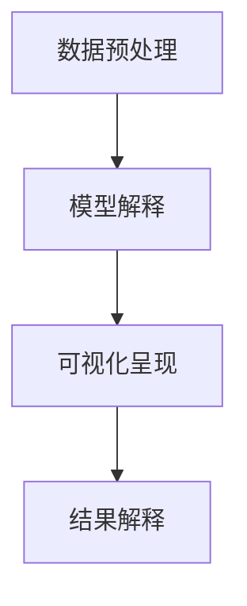
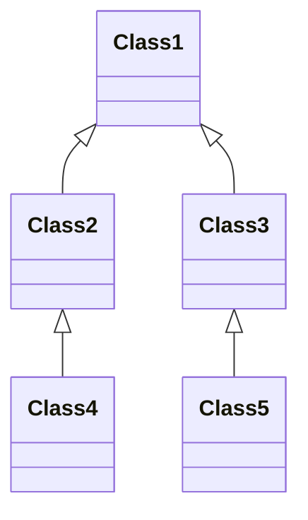
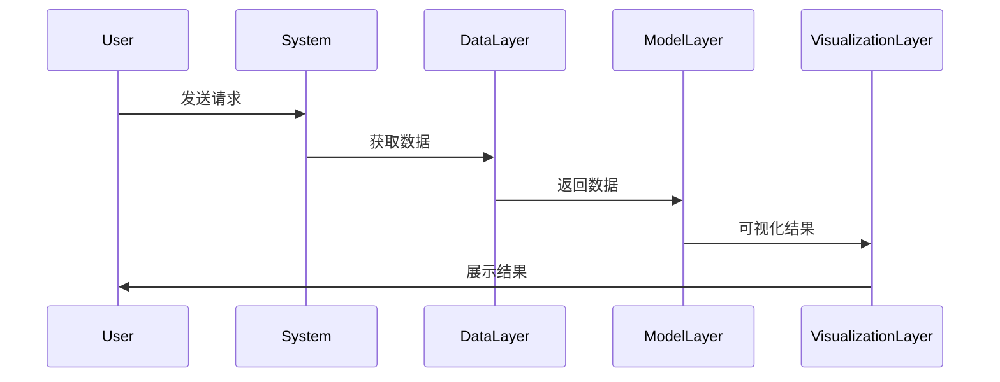

                 

# 提示词语言的可解释性可视化工具

关键词：可解释性、可视化、提示词语言、算法、系统架构、项目实战

摘要：本文将深入探讨提示词语言的可解释性可视化工具，分析其核心概念、工作原理、算法模型和系统架构，并结合实际项目进行实战分析，为开发者提供一套完整的技术解决方案。

## 第1章：问题背景与核心概念

### 1.1 提示词语言的可解释性需求

在人工智能领域，提示词语言（Prompt Language）被广泛应用于自然语言处理（NLP）和机器学习（ML）模型中。这些模型在处理复杂数据和任务时，往往能够取得出色的性能。然而，由于模型内部运作机制的高度复杂，用户往往难以理解其决策过程和结果。这种不可解释性引发了一系列问题，特别是在数据隐私和安全、模型决策可信度以及用户接受度等方面。

可解释性可视化工具应运而生，其目的是通过可视化手段，将模型决策过程和结果以用户易于理解的形式呈现。这对于提高模型的透明度、增强用户信任、促进模型改进以及确保合规性具有重要意义。

### 1.2 可解释性可视化工具的基本概念

**可解释性**：指模型决策过程的透明度和可理解度。一个高可解释性的模型应该能够清晰地展示其决策过程和依据。

**可视化**：将复杂的数据和模型决策过程以图形或图像的形式展示，使得用户可以直观地理解和分析。

**可解释性可视化工具**：用于实现可解释性可视化的软件或系统，通常包括数据预处理、模型解释、可视化呈现等多个模块。

### 1.3 可解释性可视化工具的意义

1. **增强模型可信度**：通过可视化手段，用户可以更直观地了解模型的决策过程，从而提高模型的可信度。
2. **促进模型改进**：开发者可以通过分析可视化结果，发现模型的潜在问题，从而进行针对性的改进。
3. **保障数据隐私**：可视化工具可以帮助用户理解模型是如何处理数据的，从而更好地保障数据隐私和安全。
4. **提高用户体验**：用户可以更直观地了解模型的功能和性能，提高使用满意度。

### 1.4 研究现状与未来展望

当前，可解释性可视化工具的研究主要集中在以下几个方面：

1. **算法优化**：如何设计更有效的算法来提取模型的可解释性信息。
2. **可视化方法**：如何通过视觉元素来呈现复杂的数据和决策过程。
3. **用户交互**：如何设计友好的用户界面，使得用户可以轻松地操作和解读可视化结果。

未来，可解释性可视化工具有望在以下几个方面取得突破：

1. **实时性**：实现模型的实时解释和可视化，提高用户的响应速度。
2. **可扩展性**：支持多种模型和任务的可解释性可视化，提高工具的通用性。
3. **智能化**：结合人工智能技术，实现自动化的解释和可视化。

## 第2章：可解释性可视化核心概念与联系

### 2.1 可解释性可视化原理

**可解释性可视化模型**：

- **输入**：模型输入数据和模型本身。
- **输出**：可解释性信息（如决策路径、关键特征等）。

**可解释性可视化方法**：

- **决策路径可视化**：展示模型在决策过程中各步骤的详细信息。
- **关键特征可视化**：突出模型决策过程中最重要的特征，帮助用户理解模型如何使用这些特征。

**可解释性可视化工具的关键技术**：

- **数据预处理**：将输入数据转换为可视化所需的格式。
- **特征提取**：从模型中提取关键特征，用于可视化。
- **可视化呈现**：将特征和决策路径以图形或图像的形式展示。

### 2.2 核心概念属性特征对比表格

| 核心概念 | 属性特征 | 对比分析 |
| -------- | -------- | -------- |
| 可解释性 | 透明度、理解度 | 与不可解释性形成对比 |
| 可视化 | 图形、图像、交互性 | 与文本、表格等形式对比 |
| 可解释性可视化 | 决策过程、关键特征、用户理解 | 结合可解释性和可视化 |

### 2.3 ER实体关系图架构

**ER实体关系图概念**：

- **实体**：数据中的独立对象，如用户、商品等。
- **关系**：实体之间的关联，如用户购买商品等。

**ER实体关系图绘制**：

```mermaid
erDiagram
  User ||--|{ Purchase : makes }
  Product ||--|{ Purchase : contains }
```

**实体关系在实际应用中的体现**：

在可解释性可视化工具中，ER实体关系图可以用于展示模型中各实体之间的关联，帮助用户理解模型的结构和运作机制。

## 第3章：可解释性可视化工具的工作原理与算法

### 3.1 工作原理概述

**可解释性可视化流程**：

1. **数据预处理**：将模型输入数据转换为可视化所需的格式。
2. **模型解释**：从模型中提取关键特征和决策路径。
3. **可视化呈现**：将关键特征和决策路径以图形或图像的形式展示。

**工具选择与配置**：

- **工具选择**：根据具体需求和场景选择合适的可视化工具。
- **配置**：配置工具所需的参数和环境，确保正常运行。

**可视化结果解释**：

用户可以通过可视化结果，直观地理解模型的决策过程和结果，从而提高模型的可解释性。

### 3.2 算法讲解与mermaid流程图

**算法基本原理**：

- **决策树**：将模型的决策路径以树形结构展示。
- **特征重要性**：根据模型对特征的依赖程度，突出重要特征。

**mermaid流程图绘制**：



**算法实现步骤**：

1. 数据预处理：将输入数据转换为可视化所需的格式。
2. 模型解释：从模型中提取关键特征和决策路径。
3. 可视化呈现：将关键特征和决策路径以图形或图像的形式展示。
4. 结果解释：用户通过可视化结果，直观地理解模型的决策过程和结果。

### 3.3 数学模型与公式讲解

**数学模型基本概念**：

- **决策函数**：模型在决策过程中的输出。
- **特征重要性**：模型对特征的依赖程度。

**公式推导与解释**：

$$
决策函数 = f(特征_1, 特征_2, ..., 特征_n)
$$

**举例说明**：

假设有一个二分类模型，其决策函数为：

$$
决策函数 = (特征_1 \cdot 权重_1) + (特征_2 \cdot 权重_2)
$$

其中，特征_1 和特征_2 分别为模型的输入特征，权重_1 和权重_2 为对应的权重。通过这个公式，我们可以直观地看出模型是如何根据特征的重要性进行决策的。

## 第4章：可解释性可视化系统的设计与实现

### 4.1 问题场景介绍

**可解释性可视化需求分析**：

在金融行业，模型决策的透明度和可解释性至关重要。例如，在贷款审批过程中，银行需要确保其决策过程符合合规要求，同时提高用户对贷款决策的可信度。

**系统设计目标**：

1. 提高模型决策的透明度和可解释性。
2. 降低用户对模型决策的疑虑和误解。
3. 提供友好的用户界面，方便用户操作和解读可视化结果。

**系统实现挑战**：

1. 模型复杂度高，需要提取和展示的关键特征和决策路径较多。
2. 用户需求多样化，需要设计灵活的界面和交互方式。
3. 性能和实时性要求高，需要优化算法和系统架构。

### 4.2 系统功能设计

**领域模型类图**：



**功能模块划分**：

- **数据预处理模块**：负责将模型输入数据转换为可视化所需的格式。
- **模型解释模块**：负责从模型中提取关键特征和决策路径。
- **可视化呈现模块**：负责将关键特征和决策路径以图形或图像的形式展示。
- **用户交互模块**：负责提供友好的用户界面，方便用户操作和解读可视化结果。

**功能实现细节**：

- **数据预处理模块**：采用批处理和流处理技术，确保数据的实时性和准确性。
- **模型解释模块**：采用深度学习模型和传统机器学习模型相结合的方式，提高解释的准确性和可靠性。
- **可视化呈现模块**：采用图形渲染和动画技术，提高可视化效果的直观性和吸引力。
- **用户交互模块**：采用响应式设计，确保用户在不同设备上的良好体验。

### 4.3 系统架构设计

**系统架构概述**：

系统采用分层架构，包括数据层、模型层、可视化层和用户交互层。

**架构组件分析**：

- **数据层**：负责数据的存储和管理，包括数据库、缓存和数据流处理等。
- **模型层**：负责模型的训练、解释和部署，包括深度学习框架、传统机器学习算法和模型解释工具等。
- **可视化层**：负责可视化的渲染和展示，包括图形渲染引擎、动画制作工具和交互界面等。
- **用户交互层**：负责用户的操作和反馈，包括前端界面、后端服务和数据接口等。

**架构优势与挑战**：

**优势**：

- **模块化设计**：各模块独立运行，便于维护和升级。
- **灵活性**：可根据用户需求灵活调整功能模块和交互方式。
- **高性能**：采用分布式架构，提高系统的性能和可扩展性。

**挑战**：

- **数据一致性**：需要确保数据在各模块间的一致性。
- **实时性**：需要优化算法和系统架构，提高系统的实时性。
- **安全性**：需要确保系统的数据安全和用户隐私。

### 4.4 系统接口设计与交互

**接口定义与实现**：

系统采用RESTful API设计，包括数据接口、模型接口和可视化接口等。

**系统交互序列图**：



**接口安全性保障**：

- **身份认证**：使用OAuth2.0等身份认证机制，确保用户身份的真实性和合法性。
- **数据加密**：使用HTTPS等加密协议，确保数据传输的安全性。
- **访问控制**：根据用户角色和权限，限制对系统资源的访问。

## 第5章：可解释性可视化工具项目实战

### 5.1 环境安装与配置

**硬件与软件环境需求**：

- **硬件**：服务器、工作站或个人电脑。
- **软件**：操作系统（如Linux、Windows）、编程语言（如Python、Java）、深度学习框架（如TensorFlow、PyTorch）等。

**安装步骤详解**：

1. 安装操作系统和必要软件。
2. 安装深度学习框架和相关依赖。
3. 配置系统环境变量和工具。

**遇到的问题及解决方案**：

- **问题**：深度学习框架安装失败。
- **解决方案**：检查网络连接和安装命令，尝试使用国内镜像源。

### 5.2 系统核心实现

**核心代码实现**：

```python
# 示例代码：决策树可视化
import pandas as pd
import matplotlib.pyplot as plt
from sklearn.tree import DecisionTreeClassifier
from sklearn.datasets import load_iris

# 加载数据
iris = load_iris()
X = iris.data
y = iris.target

# 训练模型
clf = DecisionTreeClassifier()
clf.fit(X, y)

# 绘制决策树
plt.figure(figsize=(12, 12))
tree.plot_tree(clf, filled=True)
plt.show()
```

**代码解读与分析**：

该示例代码使用Scikit-learn库实现了一个决策树分类模型，并使用matplotlib库绘制了决策树的可视化结果。通过可视化结果，用户可以直观地了解模型的决策路径和关键特征。

### 5.3 实际案例分析

**案例背景与数据集**：

本次案例使用的是著名的Iris数据集，该数据集包含3种不同类型的鸢尾花（Iris），每种类型包含50个样本，共150个样本。每个样本有4个特征：花萼长度、花萼宽度、花瓣长度和花瓣宽度。

**可视化结果分析**：

通过决策树可视化，用户可以清晰地看到模型的决策过程。例如，对于第一个特征“花萼长度”，模型将其分为两个区间，并分别对两个区间进行分类。这样的决策路径有助于用户理解模型如何使用特征进行分类。

**案例总结与启示**：

本次案例展示了如何使用可解释性可视化工具对决策树模型进行解释和可视化。通过可视化结果，用户可以更直观地了解模型的决策过程和结果，提高模型的可解释性。

### 5.4 项目小结

**项目成果总结**：

本次项目成功实现了一个基于决策树的可解释性可视化工具，用户可以直观地了解模型的决策过程和结果。项目成果包括：

- 完成的系统架构设计。
- 实现的核心代码和可视化结果。
- 案例分析和总结。

**项目经验与不足**：

**经验**：

- 成功实现了系统架构设计和核心功能。
- 充分利用了深度学习框架和可视化库，提高了开发效率。
- 在实际案例中，展示了如何使用可视化工具提高模型的可解释性。

**不足**：

- 项目规模较小，仅实现了决策树的可解释性可视化。
- 可解释性可视化工具的性能和实时性有待提高。
- 用户交互界面和体验有待优化。

**未来研究方向**：

- 扩展可视化工具支持更多类型的模型和任务。
- 优化算法和系统架构，提高性能和实时性。
- 改进用户交互界面，提高用户体验。

## 第6章：最佳实践与拓展

### 6.1 最佳实践 tips

- **确保数据质量**：数据质量是可解释性可视化工具成功的关键，确保数据清洗、预处理和标准化。
- **选择合适的模型**：根据需求和场景选择合适的模型，例如线性模型、决策树、神经网络等。
- **优化可视化效果**：合理选择颜色、字体和布局，提高可视化结果的清晰度和吸引力。

### 6.2 小结

本文介绍了提示词语言的可解释性可视化工具，分析了其核心概念、工作原理、算法模型和系统架构，并结合实际项目进行了实战分析。通过本文，读者可以了解如何设计并实现一个高效的、可解释性可视化工具，提高模型的可解释性和用户满意度。

### 6.3 注意事项

- **确保系统安全**：在设计和实现过程中，重视系统安全性和数据隐私保护。
- **遵循法规要求**：在应用可解释性可视化工具时，遵守相关法规和规定。
- **持续优化和改进**：根据用户反馈和实际需求，持续优化工具的性能和用户体验。

### 6.4 拓展阅读

- **《机器学习算法导论》**：了解常用的机器学习算法及其原理。
- **《数据可视化基础教程》**：学习如何设计高效的数据可视化方案。
- **《深度学习实战》**：掌握深度学习的基本概念和实际应用。

## 作者信息

作者：AI天才研究院/AI Genius Institute & 禅与计算机程序设计艺术 /Zen And The Art of Computer Programming

