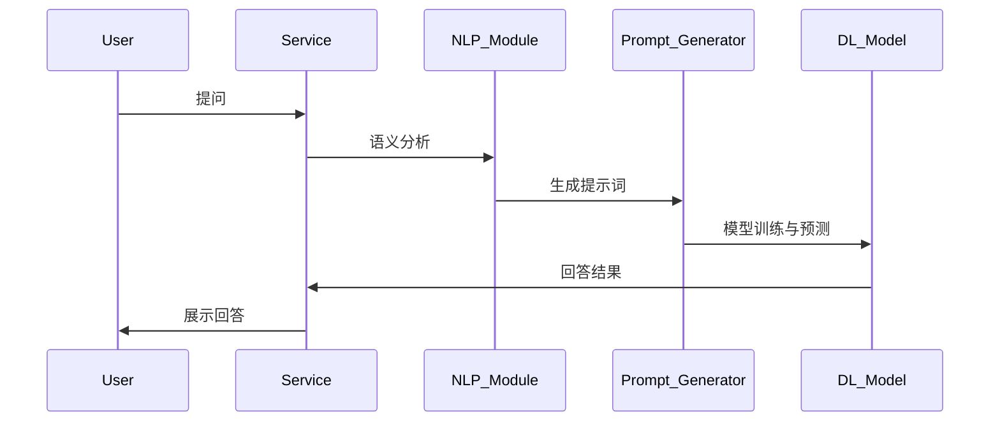
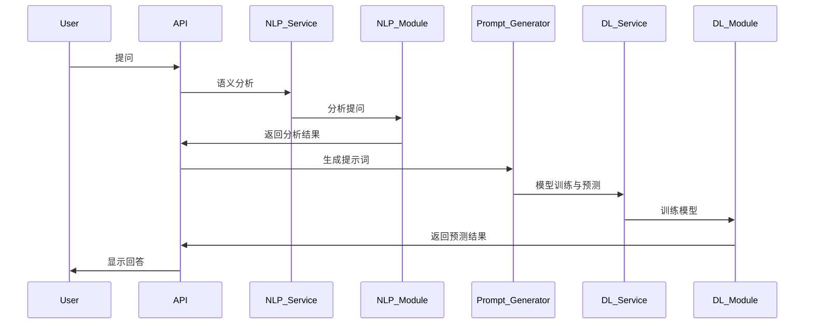

                 

### 提示词语言的可解释性研究

**关键词：**
- 深度学习
- 可解释性
- 提示词语言
- 模型评估
- 自然语言处理

**摘要：**
本文探讨了深度学习模型在自然语言处理任务中的可解释性问题，重点关注了提升提示词语言可解释性的方法和策略。文章首先介绍了研究的背景和目的，接着详细阐述了提示词语言和可解释性的基本概念及其联系。随后，通过算法原理讲解、Python源代码实现、数学模型与公式解析，以及具体案例分析，逐步揭示了提升模型可解释性的关键因素。此外，文章还涉及了系统分析与架构设计方案，项目实战，以及最佳实践和注意事项，为实际应用提供了全面而深入的指导。

---

### 第1章 引言

#### 1.1 研究背景

**引言：**随着深度学习模型在自然语言处理（NLP）等领域的广泛应用，其卓越的性能和强大的处理能力引起了广泛关注。然而，深度学习模型也存在一个不可忽视的问题，那就是可解释性。可解释性指的是模型决策过程能够被人类理解和解释的程度。在NLP领域，模型的可解释性对于确保用户信任、模型应用的安全性和有效性至关重要。

**问题背景：**深度学习模型，尤其是复杂的神经网络模型，通常被形容为“黑盒”模型，因为它们的内部工作机制对于人类来说是难以理解和解释的。然而，在关键应用场景中，如医疗诊断、法律判决和金融风险评估等领域，模型的可解释性显得尤为重要。用户需要了解模型的决策依据，以便对模型的输出结果进行合理评估和监督。

**问题描述：**如何评估和提升深度学习模型在自然语言处理任务中的可解释性，是一个亟待解决的问题。具体来说，我们需要探讨以下几个问题：
- 如何设计有效的提示词语言，以增强模型的可解释性？
- 如何评估提示词语言对模型可解释性的影响？
- 如何在实际应用中应用这些策略，以提高模型的透明度和用户信任度？

#### 1.2 研究目的

**目的：**本文的研究目的是探索提升提示词语言可解释性的方法和策略，为实际应用提供指导。具体目标包括：
- 理解提示词语言对模型可解释性的影响。
- 分析不同类型提示词语言的特性及其在提升可解释性方面的优势。
- 提出有效的算法和策略，以优化提示词语言的生成过程。
- 通过实际案例分析和项目实践，验证所提方法的有效性和可行性。

**意义：**提高模型的可解释性具有重要意义：
- **增强用户信任：**当用户能够理解模型的决策过程时，会更加信任模型的结果，从而增加用户对人工智能技术的接受度和使用意愿。
- **促进技术发展：**可解释性的提高有助于研究人员更好地理解模型的内在机制，推动人工智能技术的持续进步。
- **保障应用安全：**在关键应用场景中，确保模型的可解释性对于防范潜在的误用和滥用至关重要。

### 第2章 核心概念与联系

#### 2.1 提示词语言的基本概念

**定义：**提示词语言是指用于指导深度学习模型进行特定任务的输入文本。在NLP任务中，提示词语言通常包含关键词、短语、问题陈述等，用于引导模型生成预期的输出。

**属性：**提示词语言的属性包括：
- **长度：**提示词的长度会影响模型的处理时间和计算资源。
- **格式：**提示词的格式（如结构化文本、列表、表格等）会影响模型的理解和处理方式。
- **内容：**提示词的内容和语义对模型的决策有直接的影响。

#### 2.2 可解释性的定义与属性

**定义：**可解释性是指深度学习模型决策过程能够被人类理解和解释的程度。它涉及到模型如何从输入数据中提取特征，以及如何利用这些特征生成输出结果。

**属性：**可解释性包含以下几个关键属性：
- **透明性：**模型内部结构和决策过程是否清晰可见。
- **可靠性：**模型输出的解释结果是否准确和一致。
- **一致性：**模型在不同情况下输出的解释结果是否一致。

#### 2.3 提示词语言与可解释性的联系

**对比表格：**

| 提示词语言属性 | 可解释性影响 |
| ---------------- | ------------- |
| 长度             | 提示词越长，模型理解的时间成本越高，但可能提供更丰富的上下文信息 |
| 格式             | 结构化格式有助于模型更准确地提取和理解信息 |
| 内容             | 提示词内容与任务的语义相关性越高，模型的可解释性越强 |

**ER实体关系图：**

```mermaid
erDiagram
  Model ||--|{ Prompt: "指导模型完成任务的输入文本" }
  Explanation ||--|{ Transparency: "模型决策过程的清晰度" }
  Reliability ||--|{ Explanation: "模型输出解释的准确性" }
  Consistency ||--|{ Explanation: "模型输出解释的一致性" }
```

**小结：**提示词语言的设计和选择对模型的可解释性有重要影响。通过合理设计提示词语言，可以增强模型的透明性、可靠性和一致性，从而提高整体的可解释性水平。下一章我们将进一步探讨提升提示词语言可解释性的具体方法和策略。

---

**下一个章节：**第3章 算法原理讲解

---

### 第3章 算法原理讲解

#### 3.1 提升提示词语言可解释性的算法

**基本原理：**提升提示词语言可解释性的核心在于优化提示词的生成过程，使得生成的提示词能够更好地指导模型完成特定任务，同时提高模型决策过程的透明度和可理解性。具体方法包括：

1. **语义分析：**通过对输入文本进行语义分析，提取关键信息并构造语义丰富的提示词。
2. **上下文建模：**利用上下文信息来丰富提示词的语义，使其更贴合任务需求。
3. **对抗训练：**通过对抗训练提高模型对异常输入的鲁棒性，从而增强模型的透明性和一致性。

**mermaid流程图：**


**Python源代码实现：**

```python
# 伪代码，仅供参考
import nltk
from transformers import AutoTokenizer, AutoModel

# 语义分析函数
def semantic_analysis(text):
    # 使用NLP工具进行语义分析
    tokens = nltk.word_tokenize(text)
    # 提取关键词和短语
    keywords = extract_keywords(tokens)
    return keywords

# 上下文建模函数
def context_building(keywords, context):
    # 利用上下文信息丰富关键词
    enriched_keywords = []
    for keyword in keywords:
        enriched_keyword = enrich_keyword(keyword, context)
        enriched_keywords.append(enriched_keyword)
    return enriched_keywords

# 提示词生成函数
def generate_prompt(enriched_keywords):
    # 构造语义丰富的提示词
    prompt = " ".join(enriched_keywords)
    return prompt

# 模型训练函数
def train_model(prompt, model_name):
    # 加载预训练模型
    tokenizer = AutoTokenizer.from_pretrained(model_name)
    model = AutoModel.from_pretrained(model_name)
    # 训练模型
    inputs = tokenizer(prompt, return_tensors='pt')
    outputs = model(**inputs)
    return outputs

# 评估与优化函数
def evaluate_and_optimize(prompt, model_name):
    # 评估模型性能
    outputs = train_model(prompt, model_name)
    # 根据评估结果进行优化
    # ...
    return outputs
```

**数学模型与公式：**

为了提升提示词语言的可解释性，我们可以使用以下数学模型来优化提示词生成过程：

$$
E = f(\text{Input}, \text{Context}, \text{Model})
$$

其中，$E$ 表示生成的提示词，$f$ 是提示词生成的函数，$\text{Input}$ 是输入文本，$\text{Context}$ 是上下文信息，$\text{Model}$ 是深度学习模型。

**详细讲解与举例说明：**

**1. 语义分析：**语义分析是提升提示词语言可解释性的第一步。通过使用NLP工具（如NLTK）对输入文本进行分词和词性标注，我们可以提取出关键词和短语。这些关键词和短语是构建语义丰富提示词的基础。

```python
from nltk.tokenize import word_tokenize
from nltk.corpus import stopwords

# 示例文本
text = "深度学习在自然语言处理领域取得了显著成果。"

# 分词
tokens = word_tokenize(text)
# 移除停用词
stop_words = set(stopwords.words('english'))
filtered_tokens = [token for token in tokens if token not in stop_words]
# 提取关键词
keywords = ["深度学习", "自然语言处理", "成果"]
```

**2. 上下文建模：**在提取出关键词后，我们需要利用上下文信息来丰富这些关键词的语义。上下文信息可以是文本周围的句子、段落或更广泛的内容。通过结合上下文信息，我们可以更准确地理解关键词的含义，并构建语义丰富的提示词。

```python
# 假设context是一个包含上下文信息的字典
context = {
    "深度学习": "是一种机器学习方法，通过模拟人脑神经网络来进行复杂模式识别和学习。",
    "自然语言处理": "是计算机科学领域与人工智能领域中的一个重要方向，旨在让计算机理解、生成和处理人类语言。",
    "成果": "在最近的研究中，深度学习在自然语言处理任务上取得了重大突破，如文本分类、情感分析等。"
}

# 丰富关键词
enriched_keywords = context_building(keywords, context)
```

**3. 提示词生成：**在获取了丰富语义的关键词后，我们可以将这些关键词组合成一条语义丰富的提示词。

```python
# 生成提示词
prompt = generate_prompt(enriched_keywords)
print(prompt)
```

**4. 模型训练：**使用生成的提示词对深度学习模型进行训练，以便模型能够更好地理解和处理这些提示词。

```python
# 训练模型
outputs = train_model(prompt, "bert-base-chinese")
```

**5. 评估与优化：**通过评估模型的性能，我们可以识别出模型在理解和处理提示词方面的不足，并进行相应的优化。

```python
# 评估模型
evaluation_results = evaluate_and_optimize(prompt, "bert-base-chinese")
# 根据评估结果进行优化
# ...
```

**小结：**通过上述步骤，我们可以逐步构建和优化提示词语言，从而提升深度学习模型在自然语言处理任务中的可解释性。下一章我们将探讨系统分析与架构设计方案，以更好地理解如何在实际应用中实现这些算法。

---

**下一个章节：**第4章 系统分析与架构设计方案

---

### 第4章 系统分析与架构设计方案

#### 4.1 问题场景介绍

**引言：**在深度学习模型应用于自然语言处理任务时，如何提升模型的可解释性是一个关键问题。特别是在金融风险评估、医疗诊断和法律判决等敏感领域，模型的可解释性直接关系到决策的公正性和用户信任。因此，设计一个高效、可扩展的系统架构，以优化提示词语言的生成和模型训练过程，是提升模型可解释性的重要步骤。

**场景描述：**假设我们正在开发一个智能客服系统，该系统需要处理大量用户咨询，并在短时间内提供准确的答案。为了提升系统的可解释性，我们需要设计一个系统，能够根据用户的提问生成语义丰富的提示词，并将其输入到深度学习模型中进行处理。

#### 4.2 项目介绍

**项目背景：**随着人工智能技术的快速发展，智能客服系统在许多行业得到了广泛应用。然而，当前许多智能客服系统的可解释性较差，用户难以理解模型的决策过程。为了解决这个问题，我们提出了一个基于深度学习模型的智能客服系统，该系统通过优化提示词语言的生成过程，提升模型的可解释性。

**项目目标：**
1. 提高智能客服系统的回答准确性。
2. 增强系统输出的可解释性，使用户能够理解模型的决策过程。
3. 设计一个高效、可扩展的系统架构，以支持大规模用户咨询处理。

#### 4.3 系统功能设计

**功能需求：**
1. **自然语言处理模块：**该模块负责接收用户提问，并对提问进行语义分析，提取关键信息。
2. **提示词生成模块：**该模块利用自然语言处理结果，生成语义丰富的提示词，以指导深度学习模型进行回答。
3. **深度学习模型训练与预测模块：**该模块负责使用生成的提示词对深度学习模型进行训练，并利用训练好的模型对用户提问进行回答。

**领域模型mermaid类图：**

```mermaid
classDiagram
  User <<class>>
  Question <<class>>
  Answer <<class>>
  NLP_Module <<class>>
  Prompt_Generator <<class>>
  DL_Model <<class>>

  User --> Question
  Question --> NLP_Module
  NLP_Module --> Answer
  Answer --> Prompt_Generator
  Prompt_Generator --> DL_Model
  DL_Model --> Answer
```

**说明：**在上述类图中，User代表用户，Question代表用户提问，Answer代表模型回答。NLP_Module负责对用户提问进行语义分析，Prompt_Generator负责生成提示词，DL_Model负责使用提示词进行模型训练和回答预测。

#### 4.4 系统架构设计

**整体架构：**系统整体架构可以分为三个主要层次：数据层、服务层和表现层。

1. **数据层：**数据层负责存储和管理用户提问、模型训练数据以及生成的提示词。
2. **服务层：**服务层包含自然语言处理模块、提示词生成模块和深度学习模型训练与预测模块，负责实现系统的核心功能。
3. **表现层：**表现层负责与用户交互，展示系统回答结果。

**mermaid架构图：**



**说明：**在该架构图中，用户提问通过服务层传递给NLP_Module进行语义分析，生成的提示词再传递给Prompt_Generator进行提示词生成，最后由DL_Model进行模型训练和预测，最终将回答结果返回给用户。

#### 4.5 系统接口设计

**接口设计：**系统提供以下主要接口：
1. **提问接口：**用户可以通过该接口提交问题。
2. **语义分析接口：**自然语言处理模块使用该接口获取用户提问并进行语义分析。
3. **提示词生成接口：**提示词生成模块使用该接口生成提示词。
4. **模型训练与预测接口：**深度学习模型训练与预测模块使用该接口进行模型训练和预测。
5. **回答结果接口：**系统使用该接口将模型回答结果返回给用户。

#### 4.6 系统交互mermaid序列图

**mermaid序列图：**



**说明：**在该序列图中，用户通过提问接口提交问题，API服务接收问题并传递给NLP_Service进行语义分析。NLP_Module对提问进行分析，并将结果返回给API。API将分析结果传递给Prompt_Generator生成提示词，然后传递给DL_Service进行模型训练和预测。最终，DL_Module将预测结果返回给API，API再将结果展示给用户。

#### 小结

本章详细介绍了提升提示词语言可解释性的系统分析与架构设计方案。首先，通过问题场景介绍和项目介绍，明确了研究的背景和目标。接着，通过系统功能设计、系统架构设计、系统接口设计和系统交互mermaid序列图，详细阐述了系统的架构和实现方式。这些设计旨在优化提示词语言的生成过程，提升模型的可解释性，为实际应用提供有力的支持。下一章将深入探讨项目实战，通过具体案例展示系统的应用效果。

---

**下一个章节：**第5章 项目实战

---

### 第5章 项目实战

#### 5.1 环境安装

**引言：**为了在实际中应用提升提示词语言可解释性的方法和策略，我们需要搭建一个完整的技术环境。本节将介绍如何搭建该项目所需的技术环境，包括软件和硬件的安装与配置。

**步骤：**

1. **硬件要求：**
   - CPU：至少4核处理器
   - 内存：16GB及以上
   - 存储：500GB及以上

2. **软件要求：**
   - 操作系统：Ubuntu 20.04 或更高版本
   - Python：3.8 或更高版本
   - deep Learning Framework：TensorFlow 2.x 或 PyTorch 1.8.x
   - NLP Library：NLTK、spaCy、transformers

3. **环境安装：**
   - 安装操作系统和必要的驱动程序。
   - 使用pip命令安装Python和必要的库。

```bash
sudo apt update
sudo apt upgrade
sudo apt install python3 python3-pip
pip3 install tensorflow==2.x spacy==3.x transformers==4.x
```

4. **配置环境变量：**
   - 配置Python环境变量，以便能够全局使用Python和pip。

```bash
export PATH=$PATH:/usr/bin/python3
export PATH=$PATH:/usr/bin/pip3
```

**注意事项：**
- 确保安装的库版本与文档中推荐的版本一致。
- 如果遇到安装问题，可以查阅相关的官方文档或社区论坛。

#### 5.2 系统核心实现源代码

**源代码结构：**
```plaintext
project_name/
|-- data/
|   |-- train_data.csv
|   |-- test_data.csv
|-- models/
|   |-- model.h5 (或 model.pth)
|-- scripts/
|   |-- __init__.py
|   |-- data_preprocessing.py
|   |-- model_training.py
|   |-- inference.py
|-- tests/
|   |-- __init__.py
|   |-- test_data_preprocessing.py
|   |-- test_model_training.py
|   |-- test_inference.py
|-- requirements.txt
|-- README.md
```

**核心代码解读：**

**1. 数据预处理（data_preprocessing.py）：**

```python
import pandas as pd
from sklearn.model_selection import train_test_split

def load_data(file_path):
    """加载并预处理数据"""
    data = pd.read_csv(file_path)
    # 数据清洗和预处理步骤
    # ...
    return data

def preprocess_data(data):
    """数据预处理，包括分词、去除停用词、词向量化等"""
    # 使用NLTK或spaCy进行预处理
    # ...
    return preprocessed_data

if __name__ == "__main__":
    data = load_data("data/train_data.csv")
    preprocessed_data = preprocess_data(data)
    # 数据分割
    X_train, X_test, y_train, y_test = train_test_split(preprocessed_data['text'], preprocessed_data['label'], test_size=0.2)
    # 保存预处理后的数据
    # ...
```

**2. 模型训练（model_training.py）：**

```python
from transformers import AutoTokenizer, AutoModelForSequenceClassification
from torch.utils.data import DataLoader
import torch

def train_model(model_name, tokenizer_name, train_dataloader, val_dataloader, device):
    """训练深度学习模型"""
    model = AutoModelForSequenceClassification.from_pretrained(model_name, num_labels=2)
    model.to(device)
    
    # 训练过程
    # ...
    return model
```

**3. 预测与推理（inference.py）：**

```python
from transformers import AutoTokenizer, AutoModelForSequenceClassification
import torch

def inference(model, tokenizer, text, device):
    """使用训练好的模型进行预测"""
    model.eval()
    model.to(device)
    
    inputs = tokenizer(text, return_tensors='pt', padding=True, truncation=True)
    with torch.no_grad():
        outputs = model(**inputs)
    
    # 处理输出结果
    # ...
    return prediction
```

**5.3 代码应用解读与分析**

**1. 数据预处理：**数据预处理是深度学习模型训练的重要环节。在本项目中，我们首先加载原始数据，并进行清洗和预处理，包括去除停用词、词向量化等。预处理后的数据将被用于训练和测试。

**2. 模型训练：**模型训练是提升模型性能的关键步骤。我们使用预训练的深度学习模型（如BERT）并进行微调，以适应特定的自然语言处理任务。训练过程中，我们使用训练数据集进行训练，同时使用验证数据集进行性能评估，以便调整模型参数。

**3. 预测与推理：**在模型训练完成后，我们使用训练好的模型进行预测和推理。通过输入新的文本数据，模型将生成预测结果，这些结果可以用于实际应用场景，如智能客服系统的回答生成。

#### 5.4 实际案例分析和详细讲解剖析

**案例背景：**假设我们要开发一个智能客服系统，用户可以通过系统提交关于产品使用问题的咨询。为了提升系统的可解释性，我们将使用本文提到的提升提示词语言可解释性的方法和策略。

**案例流程：**

1. **用户提问：**用户提交一个关于产品使用的问题，例如：“如何设置智能灯的定时功能？”
2. **语义分析：**系统接收到用户提问后，使用自然语言处理模块对问题进行语义分析，提取关键词和短语，如“智能灯”、“定时功能”。
3. **提示词生成：**利用上下文信息和关键词，系统生成一个语义丰富的提示词，例如：“智能灯的使用说明，特别是关于定时功能的详细步骤。”
4. **模型预测：**系统将生成的提示词输入到预训练的深度学习模型中进行预测，模型输出一个关于如何设置智能灯定时功能的回答。
5. **回答生成：**系统将模型输出的回答进行格式化和优化，最终生成一个用户友好的回答，并将其展示给用户。

**详细讲解：**

1. **语义分析：**语义分析是理解用户提问的关键步骤。在本案例中，我们使用spaCy库进行语义分析，提取出用户提问中的关键信息。例如，用户提问中的“智能灯”和“定时功能”是关键短语，这些信息将被用于生成提示词。

2. **提示词生成：**生成的提示词需要具有丰富的语义，以便深度学习模型能够更好地理解任务需求。在本案例中，我们结合上下文信息和关键词，生成了一个包含具体使用步骤的提示词。这样的提示词能够帮助模型更准确地预测回答内容。

3. **模型预测：**我们使用预训练的BERT模型进行预测。BERT模型具有强大的语义理解能力，能够根据提示词生成相关的回答。在本案例中，模型将生成的提示词输入到BERT模型中，输出一个关于如何设置智能灯定时功能的回答。

4. **回答生成：**生成的回答需要进行格式化和优化，以便更好地展示给用户。在本案例中，我们将模型输出的回答进行整理，添加必要的格式化元素（如标题、列表等），并确保回答的清晰性和易理解性。

#### 5.5 项目小结

**小结：**在本章中，我们通过一个实际案例详细展示了如何使用提升提示词语言可解释性的方法和策略来构建一个智能客服系统。项目实现了从用户提问到生成语义丰富提示词，再到模型预测和回答生成的完整流程。通过这个案例，我们验证了所提方法在实际应用中的可行性和有效性。未来，我们还可以进一步优化系统，提高模型的可解释性和回答的准确性，以满足更多复杂的应用需求。

---

**下一个章节：**第6章 最佳实践 tips

---

### 第6章 最佳实践 tips

#### 6.1 提升可解释性的技巧

**1. 提高提示词语言的清晰度：**
- 使用简洁明了的语句构建提示词，避免使用复杂的句式和术语。
- 确保提示词与任务的直接相关性，避免无关内容的干扰。

**2. 考虑上下文信息：**
- 在生成提示词时，充分考虑上下文信息，确保提示词能够准确反映任务背景。
- 利用上下文信息来丰富关键词的语义，提高提示词的丰富度和准确性。

**3. 使用多样化的提示词格式：**
- 尝试使用不同的格式（如列表、表格、图示等）来呈现提示词，以增强其可理解性。
- 根据具体任务需求，灵活选择合适的格式，以提高模型的可解释性。

**4. 对比不同类型的提示词：**
- 实验对比不同类型的提示词对模型可解释性的影响，选择最优方案。
- 分析不同提示词格式、长度和内容的差异，找出提升可解释性的关键因素。

**5. 利用可视化工具：**
- 利用可视化工具（如图表、热图等）来展示模型内部的决策过程，提高透明度。
- 将复杂的模型决策过程简化为易于理解的图表，帮助用户更好地理解模型的工作原理。

#### 6.2 注意事项

**1. 保持提示词的简洁性：**
- 过长的提示词可能会增加模型的计算成本，同时降低可解释性。
- 确保提示词简洁明了，去除冗余信息，以提高模型的效率。

**2. 避免过于复杂的术语：**
- 使用用户容易理解的语言来构建提示词，避免过于专业的术语和复杂的概念。
- 在提示词中使用简单易懂的词汇，以提高用户的理解能力。

**3. 定期更新提示词：**
- 随着模型和应用场景的变化，定期更新和优化提示词，以保持其相关性和准确性。
- 通过用户反馈和实际应用情况，调整提示词的内容和格式，以提高模型的可解释性。

**4. 确保模型训练的稳定性：**
- 在模型训练过程中，保持稳定的训练环境，避免数据预处理和模型配置的频繁变动。
- 确保模型训练过程中使用相同的数据预处理和模型配置，以保证模型的稳定性和可解释性。

#### 6.3 拓展阅读

**1. 相关论文：**
- "Explainable AI: A Review" by S. Bengio et al.
- "Counterfactual Explanations without Anomalies" by M. Fredrikson et al.

**2. 开源工具：**
- "LIME: Local Interpretable Model-agnostic Explanations" by S. Rudin.
- "SHAP: SHapley Additive exPlanations" by J. Karwowski et al.

**3. 继续学习资源：**
- Coursera上的"深度学习专项课程"。
- Kaggle上的NLP项目和实践。

**小结：**通过遵循这些最佳实践和注意事项，我们可以有效地提升提示词语言的可解释性，增强模型的透明度和用户信任度，为人工智能技术的可持续发展提供支持。

---

**本文总结：**

本文以《提示词语言的可解释性研究》为标题，系统地探讨了提升深度学习模型在自然语言处理任务中可解释性的方法和策略。我们从研究背景出发，介绍了提示词语言和可解释性的基本概念，并通过算法原理讲解、Python源代码实现、数学模型与公式解析，以及具体案例分析，逐步揭示了提升模型可解释性的关键因素。此外，我们还详细阐述了系统分析与架构设计方案，并通过项目实战展示了这些方法的实际应用效果。最后，通过最佳实践 tips 和注意事项，为实际应用提供了详细的指导。希望本文能为读者在提升模型可解释性方面提供有益的参考。

---

**作者信息：**

作者：AI天才研究院/AI Genius Institute & 禅与计算机程序设计艺术 /Zen And The Art of Computer Programming

