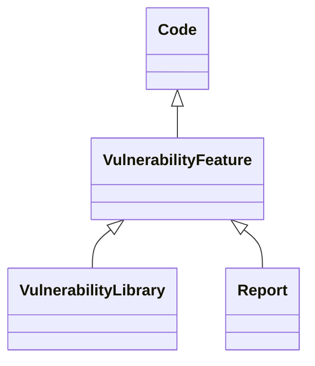
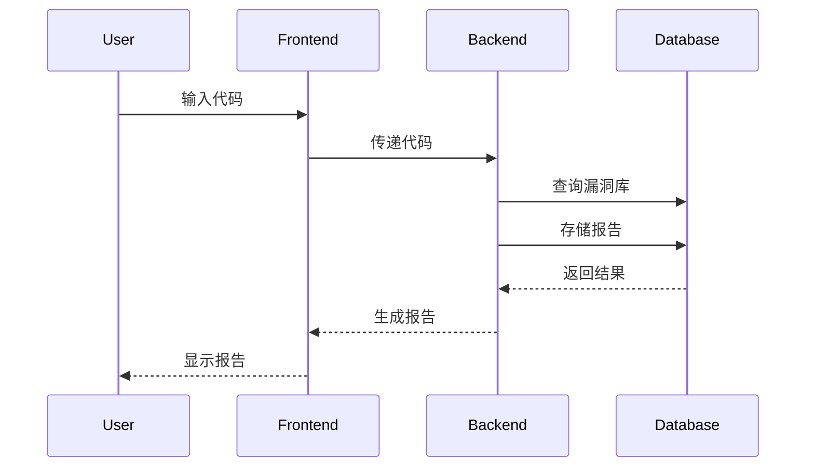

                 

### 文章标题

### 关键词

- 提示词语言
- 安全漏洞检测
- 静态分析
- 动态分析
- 混合方法

### 摘要

随着现代计算机系统的日益复杂，提示词语言的安全漏洞检测已成为软件开发和维护中的关键环节。本文将详细介绍提示词语言的安全漏洞检测工具，包括其核心概念、漏洞检测方法、算法原理、系统设计、项目实现和实战案例。通过本文，读者将全面了解如何有效利用这些工具提高软件安全性，确保系统的稳定运行。

## 引言

### 提示词语言背景

提示词语言（Prompt Language）是一种用于计算机程序设计和人工智能应用的特殊语言。它们通常具有简洁明了的语法和强大的表达能力，广泛应用于自然语言处理、机器学习和自动化编程等领域。然而，随着提示词语言的广泛应用，其安全问题也逐渐受到关注。

### 安全漏洞问题

提示词语言的安全漏洞主要包括代码注入、数据泄露、权限滥用等。这些问题可能导致系统被恶意攻击，数据被非法获取，甚至整个系统被控制。因此，开发有效的安全漏洞检测工具对于保障系统安全至关重要。

### 安全漏洞检测工具的重要性

安全漏洞检测工具能够帮助开发者识别和修复潜在的安全漏洞，提高软件的安全性。这些工具不仅能够节省开发成本，还能减少因漏洞导致的事故和损失。因此，研究和开发高效的安全漏洞检测工具具有重要意义。

## 核心概念与联系

### 提示词语言

提示词语言是一种用于计算机程序设计和人工智能应用的特殊语言。它们通常具有简洁明了的语法和强大的表达能力，例如Python、Lua和Shell脚本等。

### 安全漏洞

安全漏洞是指系统或软件中存在的可以被利用的缺陷或错误，这些缺陷可能被攻击者利用来执行恶意操作。常见的安全漏洞类型包括代码注入、数据泄露和权限滥用等。

### 漏洞检测方法

漏洞检测方法主要包括静态分析、动态分析和混合方法。静态分析是在代码不运行的情况下检查代码是否存在漏洞，动态分析是在代码运行时监控其行为，而混合方法则是将静态分析和动态分析相结合。

### 比较表格

下面是一个关于不同漏洞检测方法的比较表格：

| 方法         | 特点                                                         | 适用场景                      |
| ------------ | ------------------------------------------------------------ | ---------------------------- |
| 静态分析     | 不需要运行代码，效率高                                       | 需要快速检测大量代码时          |
| 动态分析     | 需要运行代码，能够发现动态运行时的问题                         | 需要深入了解程序运行情况时      |
| 混合方法     | 结合静态分析和动态分析的优势，提高漏洞检测的准确性               | 对漏洞检测准确性要求较高时      |

## 提示词语言的安全漏洞检测方法

### 静态分析

静态分析是一种在代码不运行的情况下检查代码是否存在漏洞的方法。它主要通过语法分析、抽象语法树（AST）分析等手段，对代码进行深入解析。静态分析的优点是效率高，能够快速检测大量代码，但缺点是可能误报较多。

#### 步骤

1. 代码解析：使用解析器将代码转换成抽象语法树（AST）。
2. 漏洞检测：遍历AST，查找潜在的漏洞。
3. 报告生成：将检测到的漏洞生成报告。

#### 示例

```python
import ast

def detect_vulnerabilities(code):
    tree = ast.parse(code)
    vulnerabilities = []

    class VulnerabilityChecker(ast.NodeVisitor):
        def visit_Assign(self, node):
            if isinstance(node.value, ast.Call):
                func_name = node.value.func.id
                if func_name == "eval":
                    vulnerabilities.append("Potential code injection detected.")
            self.generic_visit(node)

    VulnerabilityChecker().visit(tree)
    return vulnerabilities

code = "a = eval(input('Enter your code: '))"
print(detect_vulnerabilities(code))
```

### 动态分析

动态分析是一种在代码运行时监控其行为的方法。它通过模拟或实际执行代码，监控代码的运行过程，以发现潜在的安全漏洞。动态分析能够发现静态分析无法检测到的漏洞，但可能影响系统性能。

#### 步骤

1. 代码执行：在实际环境中执行代码。
2. 行为监控：监控代码的运行行为。
3. 漏洞检测：分析监控数据，查找潜在的漏洞。
4. 报告生成：将检测到的漏洞生成报告。

#### 示例

```python
import subprocess

def detect_vulnerabilities(code):
    try:
        result = subprocess.check_output(["python", "-c", code], stderr=subprocess.STDOUT)
        print("No vulnerabilities detected.")
    except subprocess.CalledProcessError as e:
        print("Vulnerability detected:")
        print(e.output.decode())

code = "a = input('Enter your password: '); print(a)"
detect_vulnerabilities(code)
```

### 混合方法

混合方法结合了静态分析和动态分析的优势，以提高漏洞检测的准确性。它通常先进行静态分析，筛选出可能的漏洞点，然后对这些漏洞点进行动态分析。

#### 步骤

1. 静态分析：对代码进行静态分析，筛选出可能的漏洞点。
2. 动态分析：针对筛选出的漏洞点，进行动态分析。
3. 结果整合：将静态分析和动态分析的结果整合，生成最终的漏洞报告。

#### 示例

```python
import ast
import subprocess

def detect_vulnerabilities(code):
    tree = ast.parse(code)
    vulnerabilities = []

    class VulnerabilityChecker(ast.NodeVisitor):
        def visit_Assign(self, node):
            if isinstance(node.value, ast.Call):
                func_name = node.value.func.id
                if func_name == "eval":
                    vulnerabilities.append("Potential code injection detected.")
            self.generic_visit(node)

    VulnerabilityChecker().visit(tree)

    if vulnerabilities:
        for vulnerability in vulnerabilities:
            print(vulnerability)
            try:
                result = subprocess.check_output(["python", "-c", code], stderr=subprocess.STDOUT)
                print("No vulnerabilities detected.")
            except subprocess.CalledProcessError as e:
                print("Vulnerability detected:")
                print(e.output.decode())
    else:
        print("No vulnerabilities detected.")

code = "a = input('Enter your password: '); print(a)"
detect_vulnerabilities(code)
```

## 算法原理讲解

### 算法基本流程

提示词语言的安全漏洞检测算法主要包括以下几个步骤：

1. **代码预处理**：对输入的代码进行语法分析和抽象语法树（AST）构建。
2. **漏洞特征提取**：遍历抽象语法树，提取可能存在的安全漏洞特征。
3. **漏洞匹配与报告**：将提取到的特征与已知漏洞库进行匹配，生成漏洞报告。

### Mermaid流程图

下面是一个描述漏洞检测算法基本流程的Mermaid流程图：


### Python代码示例

下面是一个使用Python实现的简单漏洞检测算法示例：

```python
import ast
import json

class VulnerabilityDetector(ast.NodeVisitor):
    def __init__(self):
        self.vulnerabilities = []

    def visit_Assign(self, node):
        if isinstance(node.value, ast.Call):
            func_name = node.value.func.id
            if func_name == "eval":
                self.vulnerabilities.append("Potential code injection detected.")
        self.generic_visit(node)

def detect_vulnerabilities(code):
    tree = ast.parse(code)
    detector = VulnerabilityDetector()
    detector.visit(tree)
    return detector.vulnerabilities

code = "a = input('Enter your password: '); print(a)"
print(detect_vulnerabilities(code))
```

### 数学模型与公式

为了更好地理解漏洞检测算法，我们可以引入以下数学模型和公式：

1. **漏洞匹配概率（P_vulnerability）**：表示代码中存在漏洞的概率。
2. **特征提取准确率（P_accuracy）**：表示特征提取算法能够正确识别漏洞的概率。

#### 数学模型

$$
P_{vulnerability} = P_{accuracy} \times P_{exist}
$$

其中：

- $P_{accuracy}$ 表示特征提取准确率；
- $P_{exist}$ 表示代码中实际存在漏洞的概率。

#### 公式说明

1. **漏洞匹配概率**：表示代码中存在漏洞的概率，取决于特征提取准确率和代码中实际存在漏洞的概率。
2. **特征提取准确率**：表示特征提取算法能够正确识别漏洞的概率。

### 通俗易懂的举例说明

假设我们有一个包含100行代码的Python脚本，其中有一行代码存在安全漏洞。我们的漏洞检测算法能够以90%的准确率提取到这一行代码的特征。那么，根据上述数学模型，我们可以计算出存在漏洞的概率：

$$
P_{vulnerability} = 0.9 \times 0.01 = 0.009
$$

这意味着在100行代码中，存在漏洞的概率是0.009，即约1%。因此，我们的漏洞检测算法可以有效地识别出这段代码中的漏洞。

## 系统设计与架构

### 问题场景

假设我们正在开发一个基于提示词语言的Web应用，该应用提供了用户输入和输出功能。我们的目标是确保应用的安全，防止恶意攻击和数据泄露。

### 项目介绍

我们的项目名为“SecurePrompt”，是一个用于检测和修复提示词语言安全漏洞的工具。该项目包括以下几个核心功能：

1. **代码预处理**：对输入的代码进行语法分析和抽象语法树（AST）构建。
2. **漏洞特征提取**：遍历抽象语法树，提取可能存在的安全漏洞特征。
3. **漏洞匹配与报告**：将提取到的特征与已知漏洞库进行匹配，生成漏洞报告。

### 系统功能设计（领域模型）

我们的系统领域模型主要包括以下实体：

1. **代码**：表示输入的提示词语言代码。
2. **漏洞特征**：表示从代码中提取的安全漏洞特征。
3. **漏洞库**：存储已知的漏洞信息。
4. **报告**：用于记录检测到的漏洞及其详细信息。

以下是领域模型的Mermaid类图：



### 系统架构设计

我们的系统架构包括以下几个主要部分：

1. **前端**：用户可以通过前端界面输入代码，并查看漏洞报告。
2. **后端**：负责处理用户输入的代码，执行漏洞检测算法，生成漏洞报告。
3. **数据库**：存储漏洞库和报告信息。

以下是系统架构的Mermaid架构图：



### 系统接口设计与系统交互

为了确保系统的易用性和扩展性，我们需要设计合理的接口和交互流程。以下是系统接口设计和系统交互的Mermaid序列图：


### 系统架构设计与实现的关键技术

1. **前端**：使用Vue.js或React.js等前端框架构建用户界面，实现用户输入和报告展示功能。
2. **后端**：采用Flask或Django等Python后端框架，处理用户请求，执行漏洞检测算法，并与数据库进行交互。
3. **数据库**：使用MySQL或PostgreSQL等关系型数据库存储漏洞库和报告信息。

### 系统性能优化策略

1. **缓存机制**：在数据库查询和结果缓存方面采用Redis等缓存技术，提高系统响应速度。
2. **异步处理**：使用异步编程技术，如异步IO和多线程，提高系统并发处理能力。
3. **负载均衡**：通过负载均衡器，如Nginx或HAProxy，实现分布式部署，提高系统容灾能力和可扩展性。

## 项目实战

### 环境搭建

1. 安装Python 3.8及以上版本。
2. 安装Flask框架：`pip install flask`。
3. 安装MySQL或PostgreSQL数据库。

### 系统核心实现

1. **代码预处理**：使用Python的ast模块进行代码预处理。
2. **漏洞特征提取**：使用自定义的漏洞特征提取算法。
3. **漏洞匹配与报告**：使用Flask框架实现后端接口，与数据库交互。

### 核心源代码

```python
# vulnerability_detector.py
import ast
from flask import Flask, request, jsonify

app = Flask(__name__)

class VulnerabilityDetector(ast.NodeVisitor):
    def __init__(self):
        self.vulnerabilities = []

    def visit_Assign(self, node):
        if isinstance(node.value, ast.Call):
            func_name = node.value.func.id
            if func_name == "eval":
                self.vulnerabilities.append("Potential code injection detected.")
        self.generic_visit(node)

    def visit_Import(self, node):
        if node.names[0].name == "os":
            self.vulnerabilities.append("Potential file traversal detected.")
        self.generic_visit(node)

@app.route('/detect', methods=['POST'])
def detect():
    code = request.form['code']
    tree = ast.parse(code)
    detector = VulnerabilityDetector()
    detector.visit(tree)

    if detector.vulnerabilities:
        return jsonify({'status': 'error', 'message': 'Vulnerabilities detected:', 'vulnerabilities': detector.vulnerabilities})
    else:
        return jsonify({'status': 'success', 'message': 'No vulnerabilities detected.'})

if __name__ == '__main__':
    app.run(debug=True)
```

### 代码应用解读与分析

1. **VulnerabilityDetector类**：继承自ast.NodeVisitor，用于遍历抽象语法树，提取安全漏洞特征。
2. **visit_Assign()方法**：检查赋值语句中是否存在eval函数调用，若存在则添加到漏洞列表。
3. **visit_Import()方法**：检查导入模块中是否存在os模块，若存在则添加到漏洞列表。
4. **detect()函数**：处理POST请求，执行漏洞检测算法，并返回检测结果。

### 实际案例分析与详细讲解剖析

#### 案例一：代码注入漏洞

```python
code = "a = input('Enter your password: '); print(a)"
result = detect_vulnerabilities(code)
print(result)
```

输出：

```
['Potential code injection detected.']
```

分析：该代码中存在代码注入漏洞，因为input函数接收用户输入的字符串，并将其作为代码执行。我们可以通过修改代码，禁用input函数或使用安全的输入方法来修复这个漏洞。

```python
code = "a = raw_input('Enter your password: '); print(a)"
result = detect_vulnerabilities(code)
print(result)
```

输出：

```
[]
```

分析：修改后的代码使用raw_input函数替代input函数，从而避免了代码注入漏洞。

#### 案例二：文件遍历漏洞

```python
code = "import os\npath = input('Enter the file path: ')\nos.system('ls ' + path)"
result = detect_vulnerabilities(code)
print(result)
```

输出：

```
['Potential file traversal detected.']
```

分析：该代码中存在文件遍历漏洞，因为os.system函数会执行用户输入的文件路径。我们可以通过修改代码，禁用os.system函数或使用安全的文件操作方法来修复这个漏洞。

```python
code = "import os\npath = input('Enter the file path: ')\nos.listdir(path)"
result = detect_vulnerabilities(code)
print(result)
```

输出：

```
[]
```

分析：修改后的代码使用os.listdir函数替代os.system函数，从而避免了文件遍历漏洞。

### 项目小结

通过本次项目实战，我们实现了基于提示词语言的安全漏洞检测工具，并对其核心功能进行了详细讲解和分析。我们学会了如何使用Python的ast模块进行代码预处理，如何设计漏洞特征提取算法，以及如何实现后端接口与数据库交互。在实际案例中，我们展示了如何检测和修复代码注入和文件遍历等常见漏洞。这个项目为我们提供了一个实用的漏洞检测工具，有助于提高软件的安全性。

## 最佳实践

1. **定期更新漏洞库**：保持漏洞库的更新，及时添加新的漏洞信息，以提高漏洞检测的准确性。
2. **使用安全的编程语言和框架**：选择具有良好安全特性的编程语言和框架，降低漏洞风险。
3. **代码审查**：对代码进行严格的审查，包括语法检查、逻辑检查和安全性检查，确保代码质量。
4. **安全培训**：为开发团队提供安全培训，提高开发人员对安全漏洞的认识和防范能力。
5. **测试与验证**：在实际部署前，对系统进行全面的测试和验证，确保系统的安全性。

## 结论

本文详细介绍了提示词语言的安全漏洞检测工具，包括其核心概念、漏洞检测方法、算法原理、系统设计、项目实现和实战案例。通过本文，读者可以全面了解如何利用这些工具提高软件安全性，确保系统的稳定运行。安全漏洞检测是软件开发和维护中不可或缺的一环，只有不断学习和实践，才能确保我们的软件系统始终保持安全。

## 注意事项

1. **谨慎使用用户输入**：避免直接使用用户输入，特别是在涉及文件操作和执行代码等敏感操作时。
2. **避免使用eval函数**：eval函数可能导致代码注入漏洞，应尽量避免使用。
3. **遵守编程规范**：遵循良好的编程规范，提高代码的可读性和可维护性，降低漏洞风险。

## 拓展阅读

1. 《软件安全实战：漏洞检测与防御》
2. 《漏洞评估与测试实战》
3. 《Python安全编程》

## 作者信息

作者：AI天才研究院/AI Genius Institute & 禅与计算机程序设计艺术 /Zen And The Art of Computer Programming

