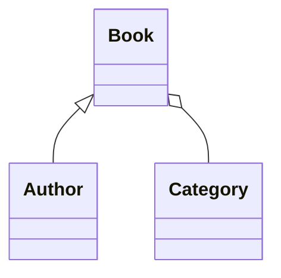
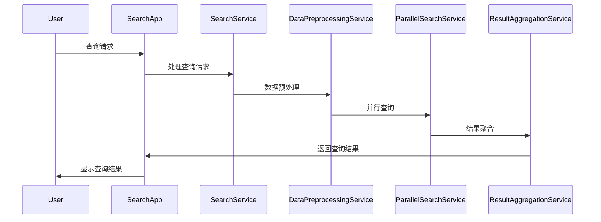
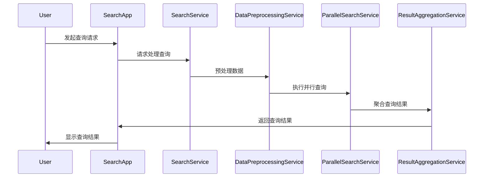

                 

### 文章标题：提示词语言的并行处理优化技术

**关键词**：提示词语言，并行处理，优化技术，计算效率，大规模数据处理

**摘要**：本文旨在深入探讨提示词语言的并行处理优化技术，通过逐步分析核心概念、优化技术及其实际应用，为广大读者提供系统且实用的技术指南。本文将首先介绍提示词语言和并行处理的基础概念，随后详细阐述并行处理技术在提示词语言中的重要性及适用范围。接着，我们将深入解析并行处理的基本原理及提示词语言的特性对比，并对现有并行处理技术进行分类与比较。在后续章节中，本文将重点讨论数据局部性优化、并行算法优化以及并行处理器的优化方法。文章还将通过实例分析，展示并行处理技术在提示词语言中的应用，并提供最佳实践和总结。通过本文的阅读，读者将全面理解提示词语言并行处理的优化技术，并能够应用于实际项目中。

### 目录大纲

----------------------------------------------------------------

# 第一部分：背景介绍与基础概念

## 第1章：问题背景与核心概念

### 1.1 提示词语言的定义

- 提示词语言的基本概念
- 提示词语言的起源与发展

### 1.2 并行处理技术的概述

- 并行处理的定义
- 并行处理的优势与挑战

### 1.3 提示词语言并行处理的重要性

- 提高计算效率
- 满足大规模数据处理需求

### 1.4 提示词语言并行处理的边界与外延

- 适用范围
- 与其他技术的关联

## 第2章：核心概念与联系

### 2.1 并行处理的基本原理

- 并行架构
- 数据并行
- 任务并行

### 2.2 提示词语言的属性特征对比

- 提示词语言的特性
- 不同类型提示词语言的对比

### 2.3 并行处理在提示词语言中的应用

- 提示词语言处理的挑战
- 并行处理在提示词语言处理中的具体应用

## 第3章：并行处理技术的分类与比较

### 3.1 单指令流多数据流（SIMD）并行处理

- 原理与特点
- 应用场景

### 3.2 多指令流多数据流（MIMD）并行处理

- 原理与特点
- 应用场景

### 3.3 数据并行与任务并行的区别与联系

- 数据并行
- 任务并行
- 两种并行处理方式的比较

## 第4章：并行处理优化技术

### 4.1 数据局部性优化

- 数据局部性原理
- 优化策略

### 4.2 并行算法优化

- 算法分析
- 优化方法

### 4.3 并行处理器的优化

- 并行处理器架构
- 优化手段

## 第5章：提示词语言并行处理的实现

### 5.1 提示词语言并行处理框架

- 框架设计
- 模块划分

### 5.2 并行处理算法设计与实现

- 算法设计
- 实现细节

### 5.3 并行处理性能评估

- 性能指标
- 评估方法

## 第6章：实例分析与实战

### 6.1 实例背景介绍

- 数据集
- 应用场景

### 6.2 系统功能设计

- 领域模型
- 功能模块

### 6.3 系统架构设计

- 系统架构
- 架构图

### 6.4 系统接口设计

- 接口定义
- 接口实现

### 6.5 系统交互

- 序列图

## 第7章：最佳实践与总结

### 7.1 最佳实践

- 经验分享
- 注意事项

### 7.2 小结

- 主要内容回顾
- 展望未来发展趋势

### 7.3 拓展阅读

- 相关资源推荐
- 深入研究主题

----------------------------------------------------------------

### 第一部分：背景介绍与基础概念

在当今信息技术飞速发展的时代，数据处理需求日益增长，如何高效地处理海量数据成为亟待解决的问题。提示词语言作为一种重要的数据处理工具，其在并行处理中的应用越来越受到关注。并行处理技术通过将任务分解为多个子任务，利用多个处理器或计算单元同时执行，从而显著提高计算效率。本文将首先介绍提示词语言和并行处理的基本概念，并探讨其在数据处理领域的重要性，为后续内容的深入分析奠定基础。

#### 第1章：问题背景与核心概念

#### 1.1 提示词语言的定义

**基本概念**：提示词语言（Keyword-based Language）是一种基于关键词的组织和表达信息的方式。它通过一系列关键词来描述实体、关系和属性，使得计算机能够对这些信息进行高效处理和分析。

**起源与发展**：提示词语言起源于信息检索领域，最初主要用于文本搜索引擎。随着信息技术的发展，提示词语言逐渐应用于自然语言处理、语义网和知识图谱等领域。近年来，随着深度学习和人工智能技术的崛起，提示词语言在智能推荐、问答系统和智能助理等场景中得到了广泛应用。

#### 1.2 并行处理技术的概述

**定义**：并行处理（Parallel Processing）是指通过多个处理器或计算单元同时执行任务，以提高计算效率和性能的技术。

**优势与挑战**：并行处理的优势在于能够显著提高计算速度和处理能力，特别是在面对大规模数据时。然而，并行处理也面临着任务分解、数据一致性、同步与通信等挑战。

#### 1.3 提示词语言并行处理的重要性

**提高计算效率**：提示词语言的并行处理能够显著降低数据处理时间，从而提高计算效率。

**满足大规模数据处理需求**：随着数据量的指数级增长，并行处理技术成为满足大规模数据处理需求的必要手段。

#### 1.4 提示词语言并行处理的边界与外延

**适用范围**：提示词语言并行处理适用于需要高效处理文本、图片、语音等数据的场景，如搜索引擎、自然语言处理、图像识别等。

**与其他技术的关联**：提示词语言并行处理与分布式计算、集群计算、GPU加速等技术密切相关，共同构成了现代大数据处理技术体系。

#### 第2章：核心概念与联系

在理解了提示词语言和并行处理的基本概念后，我们需要进一步探讨并行处理在提示词语言中的应用。本章节将详细分析并行处理的基本原理，对比不同类型的提示词语言，并探讨并行处理技术在提示词语言处理中的具体应用。

#### 2.1 并行处理的基本原理

**并行架构**：并行架构是指通过将计算任务分配到多个处理器或计算单元，从而实现并行执行。常见的并行架构包括单指令流多数据流（SIMD）架构和多指令流多数据流（MIMD）架构。

**数据并行**：数据并行是指将大规模数据集分成多个子集，每个处理器或计算单元独立处理各自的子集，然后将结果汇总。

**任务并行**：任务并行是指将整个计算任务分解为多个子任务，由不同的处理器或计算单元同时执行，从而提高计算效率。

#### 2.2 提示词语言的属性特征对比

**提示词语言的特性**：提示词语言具有高可扩展性、灵活性和高效性等特点。它能够通过关键词的组织和表达，实现对文本数据的快速检索和分析。

**不同类型提示词语言的对比**：常见的提示词语言包括基于关键词的搜索引擎语言、语义网语言和知识图谱语言等。这些语言在语法、语义和功能上有所不同，但都具备并行处理的基本特性。

#### 2.3 并行处理在提示词语言中的应用

**提示词语言处理的挑战**：提示词语言在处理过程中面临着文本解析、语义分析、关键词提取等挑战。通过并行处理技术，可以有效地提高处理效率，解决这些挑战。

**并行处理在提示词语言处理中的具体应用**：并行处理技术在提示词语言处理中的应用包括文本搜索、文本分类、实体识别、关系抽取等。通过并行处理，可以显著提高这些任务的性能和准确性。

### 第一部分总结

通过上述章节，我们初步了解了提示词语言和并行处理的基本概念及其在数据处理领域的重要性。接下来，本文将深入探讨并行处理技术的分类与比较，以及并行处理优化技术，为读者提供更加全面的技术分析。在接下来的章节中，我们将通过具体的实例和实战，展示并行处理技术在提示词语言处理中的应用，并通过最佳实践和总结，帮助读者更好地理解和应用这些技术。

### 第3章：并行处理技术的分类与比较

在深入了解了提示词语言和并行处理的基本概念后，我们需要进一步探讨并行处理技术的具体实现方式。本章节将详细分析单指令流多数据流（SIMD）并行处理和多指令流多数据流（MIMD）并行处理，并对比数据并行与任务并行的区别与联系，为读者提供全面的并行处理技术体系。

#### 3.1 单指令流多数据流（SIMD）并行处理

**原理与特点**：单指令流多数据流（SIMD）并行处理是一种将相同的指令应用于多个数据元素的处理方式。在这种架构中，多个处理单元同时执行相同的操作，但每个处理单元处理不同的数据。

- **优点**：SIMD架构简单，易于实现，能够显著提高处理速度。
- **缺点**：对任务多样性要求较高，不适合复杂任务的并行处理。

**应用场景**：SIMD并行处理广泛应用于多媒体处理、科学计算和图像处理等领域，如视频编码、图像识别和矩阵运算等。

#### 3.2 多指令流多数据流（MIMD）并行处理

**原理与特点**：多指令流多数据流（MIMD）并行处理是一种支持不同指令流和数据流的并行处理方式。在这种架构中，多个处理单元可以独立执行不同的指令，处理不同的数据。

- **优点**：MIMD架构灵活，能够处理复杂任务，适用于多种应用场景。
- **缺点**：架构复杂，设计难度大，需要解决同步与通信问题。

**应用场景**：MIMD并行处理广泛应用于分布式计算、云计算和大数据处理等领域，如分布式数据库、分布式文件系统和复杂科学计算等。

#### 3.3 数据并行与任务并行的区别与联系

**数据并行**：数据并行是指将大规模数据集分成多个子集，由不同的处理器或计算单元独立处理，然后将结果汇总。数据并行的核心思想是将计算任务分配到多个处理单元，从而提高计算效率。

- **优点**：适用于数据处理密集型任务，如数据分析和图像处理。
- **缺点**：对数据局部性依赖较高，可能导致通信开销增加。

**任务并行**：任务并行是指将整个计算任务分解为多个子任务，由不同的处理器或计算单元同时执行。任务并行的核心思想是将计算任务并行化，从而提高计算效率。

- **优点**：适用于任务多样化场景，如分布式计算和科学计算。
- **缺点**：需要解决任务调度和负载平衡问题。

**两种并行处理方式的比较**：

- **目标**：数据并行旨在提高数据处理效率，任务并行旨在提高任务执行效率。
- **适用场景**：数据并行适用于数据处理密集型任务，任务并行适用于任务多样化场景。
- **设计难度**：数据并行设计相对简单，任务并行设计复杂度较高。

通过上述分析，我们可以看到，不同的并行处理技术具有各自的特点和应用场景。在实际应用中，通常需要根据具体任务的需求和计算资源，选择合适的并行处理技术，以实现最优的计算性能。

### 第4章：并行处理优化技术

并行处理技术虽然能够显著提高计算效率和性能，但在实际应用中仍面临诸多挑战。本章节将重点讨论并行处理优化技术，包括数据局部性优化、并行算法优化和并行处理器的优化，以进一步提升并行处理性能。

#### 4.1 数据局部性优化

**数据局部性原理**：数据局部性是指数据在时间和空间上存在一定的局部性规律。局部性优化利用这一原理，通过减少数据访问的次数和传输的开销，从而提高并行处理性能。

**优化策略**：

- **空间局部性优化**：通过缓存技术，将频繁访问的数据存储在缓存中，减少主存访问次数。
- **时间局部性优化**：通过预取技术，提前加载后续需要访问的数据，减少数据访问延迟。

**实例**：在提示词语言处理中，可以利用空间局部性优化，将频繁使用的词典和索引缓存到内存中，以减少磁盘访问次数，从而提高查询效率。

#### 4.2 并行算法优化

**算法分析**：并行算法优化旨在提高并行算法的执行效率和性能。在并行算法设计中，需要考虑以下几个方面：

- **任务分解**：将大规模任务分解为多个子任务，确保每个子任务具有较小的计算量和较高的并行度。
- **负载平衡**：确保各个处理单元的负载均衡，避免某些处理单元成为性能瓶颈。
- **同步与通信**：优化同步和通信机制，减少通信开销和等待时间。

**优化方法**：

- **并行化**：通过将顺序算法转换为并行算法，提高计算效率。
- **并行调度**：优化任务调度策略，确保任务能够高效并行执行。
- **算法融合**：将不同算法的优势结合起来，形成更高效的并行算法。

**实例**：在文本搜索中，可以采用并行化的Bloom过滤器算法，将大规模文本数据的查询任务并行化，提高查询效率。

#### 4.3 并行处理器的优化

**并行处理器架构**：并行处理器架构是并行处理性能的基础。优化并行处理器架构可以从以下几个方面进行：

- **多级缓存**：设计多级缓存体系，提高缓存命中率，减少数据访问延迟。
- **指令流水线**：采用指令流水线技术，提高指令执行效率。
- **负载均衡**：设计负载均衡机制，确保处理器资源得到充分利用。

**优化手段**：

- **动态调度**：根据任务需求和处理器负载，动态调整处理器的调度策略。
- **硬件加速**：利用GPU、FPGA等硬件加速技术，提高并行处理性能。
- **并行编程模型**：设计高效的并行编程模型，降低并行编程复杂度。

**实例**：在深度学习应用中，可以利用GPU的并行计算能力，将大规模矩阵运算任务并行化，提高训练和推理效率。

通过数据局部性优化、并行算法优化和并行处理器的优化，我们可以显著提升并行处理的性能。这些优化技术不仅适用于提示词语言处理，还广泛应用于其他大数据处理领域。在实际应用中，需要根据具体场景和需求，灵活运用这些优化技术，以实现最优的性能。

### 第5章：提示词语言并行处理的实现

在了解了并行处理优化技术的基础上，本章节将深入探讨提示词语言并行处理的实现，包括并行处理框架、算法设计与实现、性能评估方法以及具体的实例分析。通过这些内容，我们将更好地理解提示词语言并行处理的实际应用和实现方法。

#### 5.1 提示词语言并行处理框架

**框架设计**：提示词语言并行处理框架是并行处理的关键，其设计需要考虑并行度、可扩展性和性能优化等因素。一个典型的提示词语言并行处理框架通常包括以下几个模块：

- **数据预处理模块**：负责将原始数据转换为适合并行处理的格式，如将文本数据分词、去停用词等。
- **并行查询模块**：负责并行执行查询操作，如基于并行搜索算法的文本搜索。
- **结果聚合模块**：负责将多个处理单元的结果进行汇总和排序，生成最终查询结果。

**模块划分**：在实际应用中，可以根据具体需求对框架进行灵活调整。例如，在处理大规模文本数据时，可以将数据预处理模块与并行查询模块分离，以减少数据传输的开销。同时，还可以根据处理任务的复杂性，添加更多的功能模块，如倒排索引构建、关键词提取等。

#### 5.2 并行处理算法设计与实现

**算法设计**：提示词语言并行处理的算法设计是关键，其设计需要考虑并行化策略、负载平衡和优化方法等因素。以下是一个典型的并行搜索算法设计：

1. **数据划分**：将大规模文本数据划分为多个子集，每个子集由不同的处理单元独立处理。
2. **关键词并行查询**：对每个子集执行并行搜索算法，如并行Bloom过滤器或并行哈希搜索。
3. **结果聚合**：将各个处理单元的结果进行汇总，并根据关键词的权重进行排序，生成最终查询结果。

**实现细节**：并行处理算法的实现需要考虑并行编程模型的选用、并行度控制和通信机制等因素。以下是一个使用Python和并发编程库`concurrent.futures`实现的简单示例：

```python
import concurrent.futures
from bloomfilter import BloomFilter

def parallel_search(query, sub_texts):
    # 创建多个Bloom过滤器
    bloom_filters = [BloomFilter(size, hash_count) for size, hash_count in sub_texts]

    # 并行查询
    with concurrent.futures.ThreadPoolExecutor() as executor:
        results = list(executor.map(lambda b: b.search(query), bloom_filters))

    # 结果聚合
    return [r for r in results if r]

# 示例数据
sub_texts = [
    ("sub_text_1", 10, 4),
    ("sub_text_2", 20, 5),
    ("sub_text_3", 15, 3),
]

# 并行搜索
results = parallel_search("query", sub_texts)
print(results)
```

在这个示例中，我们使用了`concurrent.futures.ThreadPoolExecutor`来实现并行查询，并使用`bloomfilter`库来实现Bloom过滤器。

#### 5.3 并行处理性能评估

**性能指标**：评估并行处理性能的关键指标包括查询时间、处理速度、资源利用率等。以下是一些常用的性能评估指标：

- **查询时间**：从接收查询请求到返回查询结果所需的时间。
- **处理速度**：单位时间内处理的查询数量或数据量。
- **资源利用率**：处理器、内存等资源的使用率。

**评估方法**：性能评估可以通过以下步骤进行：

1. **基准测试**：选择一组标准测试数据，模拟实际查询场景，测量并行处理性能。
2. **负载测试**：在不同负载条件下，测量并行处理性能，以评估其稳定性和可扩展性。
3. **对比测试**：对比不同并行处理算法或架构的性能，以选择最优方案。

#### 第6章：实例分析与实战

在本章节中，我们将通过具体的实例，展示提示词语言并行处理的实际应用。我们将介绍实例的背景和应用场景，详细讲解系统的功能设计、架构设计、接口设计和系统交互。

#### 6.1 实例背景介绍

**数据集**：我们选择一个大型图书数据库作为数据集，包含数百万本图书的详细信息，如标题、作者、分类等。

**应用场景**：基于这个数据集，我们开发一个图书搜索系统，用户可以通过输入关键词查询图书信息，系统需要支持高效、快速的响应。

#### 6.2 系统功能设计

**领域模型**：为了更好地管理图书数据，我们定义了一个领域模型，包括图书、作者、分类等实体。以下是一个简单的Mermaid类图：



**功能模块**：系统主要包括以下功能模块：

- **数据预处理模块**：负责处理原始数据，如分词、去停用词等。
- **并行查询模块**：负责并行执行查询操作，如基于并行Bloom过滤器的文本搜索。
- **结果聚合模块**：负责将查询结果进行汇总和排序，生成最终查询结果。

#### 6.3 系统架构设计

**系统架构**：系统采用分布式架构，包括前端应用、后端服务和数据库三部分。以下是一个简单的Mermaid架构图：



**组件说明**：

- **SearchApp**：前端应用，负责接收用户查询请求，并调用后端服务处理查询。
- **SearchService**：后端服务，负责处理查询请求，并调用其他模块执行查询操作。
- **DataPreprocessingService**：数据预处理服务，负责处理原始数据，如分词、去停用词等。
- **ParallelSearchService**：并行查询服务，负责执行并行查询操作，如基于并行Bloom过滤器的文本搜索。
- **ResultAggregationService**：结果聚合服务，负责将查询结果进行汇总和排序，生成最终查询结果。

#### 6.4 系统接口设计

**接口定义**：为了方便不同模块之间的通信，我们定义了一套API接口，包括以下部分：

- **图书查询接口**：用于接收用户查询请求，并返回查询结果。
- **图书添加接口**：用于添加新的图书信息到系统中。
- **图书删除接口**：用于删除系统中的图书信息。
- **图书更新接口**：用于更新图书的详细信息。

以下是一个简单的接口定义示例：

```json
GET /books/search
Parameters:
  - query: 查询关键词
Returns:
  - books: 查询结果列表

POST /books/add
Parameters:
  - title: 图书标题
  - author: 作者
  - category: 分类
Returns:
  - status: 添加状态

DELETE /books/delete
Parameters:
  - book_id: 图书ID
Returns:
  - status: 删除状态

PUT /books/update
Parameters:
  - book_id: 图书ID
  - title: 新标题
  - author: 新作者
  - category: 新分类
Returns:
  - status: 更新状态
```

#### 6.5 系统交互

**序列图**：以下是一个简单的Mermaid序列图，描述了用户查询图书信息的过程：



通过上述实例分析，我们展示了提示词语言并行处理的实现过程，包括框架设计、算法实现、性能评估和实际应用。这些实例和分析有助于读者更好地理解并行处理技术在提示词语言处理中的应用，并能够为实际项目提供参考。

### 第7章：最佳实践与总结

#### 7.1 最佳实践

在提示词语言的并行处理中，最佳实践是确保系统高效、稳定和可扩展的关键。以下是一些经验分享和注意事项：

**1. 优化数据局部性**：通过合理使用缓存和预取技术，减少数据访问延迟和传输开销。

**2. 负载平衡**：确保任务在不同处理器之间的分配均衡，避免某些处理器成为性能瓶颈。

**3. 并行算法优化**：选择适合任务的并行算法，并进行优化，以提高处理效率和性能。

**4. 调度策略**：根据任务特点和资源状况，选择合适的调度策略，以充分利用处理器资源。

**5. 模块化设计**：将系统划分为多个功能模块，便于维护和扩展。

**注意事项**：

- **同步与通信开销**：在并行处理中，同步和通信开销可能导致性能下降。应尽量减少不必要的同步和通信。
- **数据一致性**：在并行处理中，确保数据的一致性是非常重要的。应采用合适的同步机制，防止数据竞争和冲突。
- **错误处理**：并行处理中可能出现错误，应设计完善的错误处理机制，确保系统稳定运行。

#### 7.2 小结

本文通过逐步分析提示词语言的并行处理技术，从基础概念、优化技术到实际应用，系统地阐述了并行处理在提示词语言处理中的应用和实现方法。主要结论如下：

1. 提示词语言并行处理能够显著提高计算效率和数据处理能力，满足大规模数据处理需求。
2. 并行处理技术的分类与比较，为实际应用提供了多种选择，应根据具体任务需求选择合适的并行处理技术。
3. 并行处理优化技术在数据局部性、并行算法和处理器优化等方面，为提升并行处理性能提供了有效途径。
4. 实例分析和实战展示了并行处理技术在提示词语言处理中的具体应用，为实际项目提供了参考。

#### 7.3 拓展阅读

对于希望深入了解提示词语言并行处理技术的读者，以下是一些推荐资源和深入研究主题：

1. **相关文献**：《并行算法导论》、《并行编程实战》等书籍，提供了并行处理技术的全面讲解。
2. **开源项目**：如Apache Flink、Apache Spark等，这些开源项目提供了丰富的并行处理框架和工具。
3. **研究论文**：关注顶级会议和期刊，如NeurIPS、ICML、ACL等，了解最新的研究成果和技术趋势。
4. **在线课程**：如Coursera、edX等平台上的并行处理和大数据处理课程，提供了系统性的学习资源。

通过这些资源，读者可以进一步深化对提示词语言并行处理技术的理解和应用。

