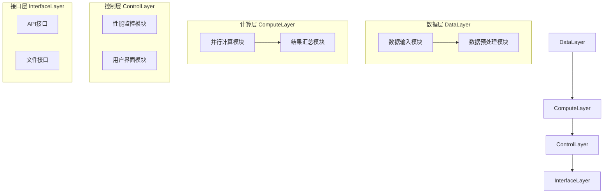
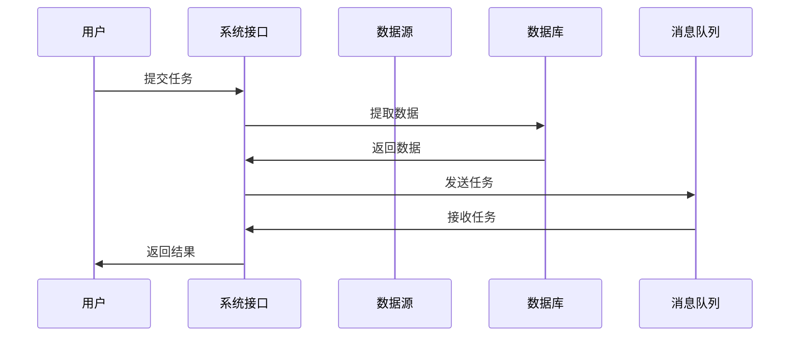
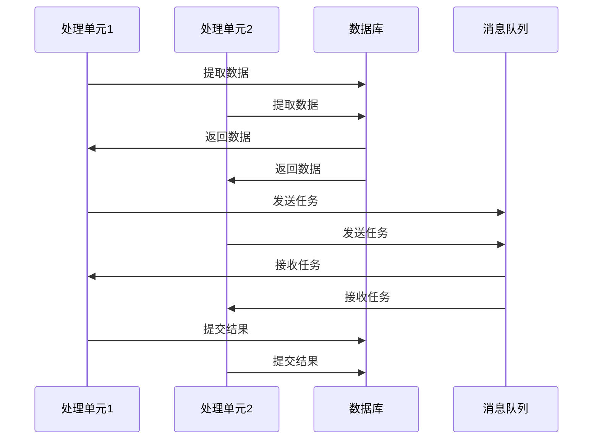

                 


# 提示词语言的并行计算优化策略

## 关键词

- 并行计算
- 提示词语言
- 优化策略
- 算法
- 系统架构
- 项目实战

## 摘要

本文将深入探讨提示词语言的并行计算优化策略。通过分析并行计算在人工智能领域的应用现状，我们认识到并行计算优化策略的重要性。本文将首先介绍并行计算和提示词语言的基本概念，然后详细阐述并行计算优化策略的核心目标和实施步骤。接着，我们将通过数学模型和Python源代码，逐步讲解并行计算、提示词语言以及优化算法的原理，并通过实际案例进行剖析。此外，还将介绍系统架构设计和项目实战中的具体实现，最后进行项目小结和注意事项的提醒。

## 目录大纲

1. 第一部分：背景介绍
   1.1.1 问题背景
   1.1.2 问题描述
   1.1.3 问题解决
   1.1.4 边界与外延
   1.1.5 概念结构与核心要素组成
   1.1.6 第一部分小结

2. 第二部分：核心概念与联系
   2.1.1 并行计算原理
   2.1.2 提示词语言原理
   2.1.3 并行计算优化策略原理
   2.1.4 概念属性特征对比表格
   2.1.5 ER实体关系图架构
   2.1.6 第二部分小结

3. 第三部分：算法原理讲解
   3.1.1 并行计算算法
   3.1.2 提示词语言算法
   3.1.3 并行计算优化算法
   3.1.4 数学模型和数学公式
   3.1.5 举例说明
   3.1.6 第三部分小结

4. 第四部分：系统分析与架构设计
   4.1.1 问题场景介绍
   4.1.2 系统功能设计
   4.1.3 系统架构设计
   4.1.4 系统接口设计
   4.1.5 系统交互
   4.1.6 第四部分小结

5. 第五部分：项目实战
   5.1.1 环境安装
   5.1.2 系统核心实现源代码
   5.1.3 代码应用解读与分析
   5.1.4 实际案例分析与详细讲解剖析
   5.1.5 项目小结
   5.1.6 第五部分小结

6. 最佳实践 tips、小结、注意事项、拓展阅读

---

### 第1章：问题背景与定义

#### 1.1.1 问题背景

并行计算是计算机科学中的一个重要领域，其核心思想是通过将任务分解为多个部分，同时在多个处理单元上并行执行这些部分，从而提高计算效率和性能。从早期的SIMD（单指令流多数据流）结构到现代的GPU（图形处理器）和TPU（张量处理器）等专用硬件，并行计算的发展历程见证了计算能力的飞速提升。

在人工智能领域，并行计算的应用尤为广泛。随着深度学习模型的复杂度不断增加，单机计算已经无法满足实际需求。因此，分布式计算和并行计算成为了推动人工智能发展的关键技术。例如，在训练大型神经网络时，通过将数据集和模型拆分为多个部分，并利用多台计算机同时处理，可以显著缩短训练时间。

#### 1.1.1.1 计算机并行计算的发展历程

- **并行计算的概念**：并行计算是指在同一时间或近似同一时间执行多个任务或计算的一种计算方式。其基本原理是通过将任务分解为子任务，然后并行地执行这些子任务，最后将结果合并得到最终结果。

- **并行计算的发展历程**：从早期的并行计算硬件如SIMD阵列，到现代的多核CPU、GPU和TPU，并行计算的发展经历了从硬件到软件的全面提升。特别是GPU的出现，由于其高度并行化的架构，使得在深度学习和科学计算等领域取得了显著成果。

- **并行计算在计算机体系结构中的应用**：在现代计算机体系结构中，并行计算得到了广泛应用。例如，多核CPU通过在单个处理器中集成多个计算核心，实现了指令级的并行执行。GPU则通过数千个流处理器，实现了数据级的并行处理。

#### 1.1.1.2 并行计算在人工智能领域的应用现状

- **人工智能的发展需求**：随着人工智能技术的快速发展，对计算能力的需求不断增加。深度学习模型，特别是大型神经网络，需要大量的计算资源来进行训练和推理。

- **并行计算在人工智能中的应用场景**：在人工智能领域，并行计算的应用场景非常广泛。例如，在图像处理、语音识别、自然语言处理等领域，通过并行计算可以显著提高处理速度和效率。此外，在数据挖掘、机器学习算法优化等方面，并行计算也发挥着重要作用。

- **并行计算在人工智能领域的挑战与机遇**：并行计算在人工智能领域面临着一些挑战，如数据传输瓶颈、并行化编程的复杂性等。然而，随着硬件技术的发展和并行计算技术的不断进步，这些挑战也逐渐被克服。并行计算为人工智能的发展提供了巨大的机遇，有望进一步提升人工智能的性能和应用范围。

#### 1.1.2 问题描述

并行计算优化策略在人工智能领域中具有重要的应用价值。优化策略的核心目标是提高并行计算的效率和性能，降低计算成本，增强系统的可扩展性。

- **并行计算优化策略的重要性**：并行计算优化策略能够通过改进算法、优化数据传输和并行执行机制，从而提高并行计算的效率。在人工智能领域，优化策略能够加速模型的训练和推理过程，提高系统的响应速度和准确性。

- **提示词语言在并行计算中的角色**：提示词语言是一种用于指导计算机执行特定任务的语言。在并行计算中，提示词语言可以用来定义并行任务、分配计算资源和控制并行执行过程。通过优化提示词语言，可以提高并行计算的可扩展性和灵活性。

#### 1.1.2.1 并行计算优化策略的核心目标

- **提高并行计算效率**：通过优化算法和数据结构，减少计算过程中的冗余操作和等待时间，从而提高并行计算的执行效率。

- **降低并行计算成本**：优化策略可以减少计算资源的使用，降低硬件成本和能耗，提高系统的经济性。

- **增强并行计算的可扩展性**：优化策略需要考虑系统的可扩展性，以便在计算任务规模增加时，系统能够高效地扩展资源。

#### 1.1.2.2 如何实现提示词语言的并行计算优化

- **提示词语言的优化方法**：优化提示词语言需要从多个方面入手，包括语法优化、语义优化和执行优化等。语法优化可以简化提示词的编写，提高代码的可读性和可维护性。语义优化可以通过对提示词的语义分析，减少并行执行的等待时间。执行优化则可以通过优化执行路径和资源分配，提高并行计算的执行效率。

- **并行计算优化策略的实施步骤**：实施并行计算优化策略需要遵循以下步骤：

  1. **需求分析**：明确并行计算的目标和需求，确定优化策略的实施范围。
  
  2. **算法选择**：根据需求选择适合的并行计算算法，并进行分析和优化。
  
  3. **数据结构优化**：优化数据结构，减少数据访问冲突和传输延迟。
  
  4. **资源分配**：合理分配计算资源，确保并行任务的执行效率。
  
  5. **性能评估**：对优化后的系统进行性能评估，验证优化效果。

#### 1.1.3 问题解决

实现提示词语言的并行计算优化，需要结合具体的并行计算环境和应用场景，采取合适的优化策略。以下是一些常见的优化方法：

- **任务分解与负载平衡**：将大型任务分解为多个小任务，并分配到不同的计算节点上。通过负载平衡技术，确保每个节点的工作负载均衡，避免资源浪费。

- **数据并行与任务并行**：数据并行是将数据集分成多个部分，并分配到不同的计算节点上进行处理。任务并行则是将任务分配到不同的计算节点上，每个节点独立执行。根据应用场景，可以选择合适的数据并行或任务并行策略。

- **并行化编程模型**：选择合适的并行编程模型，如MapReduce、Spark、MPI（消息传递接口）等，可以简化并行计算的编程复杂度，提高开发效率。

- **资源调度与优化**：通过资源调度算法，合理分配计算资源和存储资源，避免资源冲突和瓶颈。

- **并行通信优化**：优化并行计算中的通信机制，减少数据传输的延迟和带宽消耗。

#### 1.1.4 边界与外延

并行计算优化策略的应用领域广泛，包括科学计算、工程计算、数据处理与挖掘等领域。在不同的应用领域中，优化策略的具体实施方法和效果可能会有所不同。

- **科学计算**：在科学计算中，并行计算优化策略可以应用于气象预报、流体力学模拟、量子物理计算等领域。通过优化计算模型和数据结构，可以显著提高计算效率和准确性。

- **工程计算**：在工程计算中，并行计算优化策略可以应用于结构分析、热力学模拟、电磁场模拟等领域。通过并行计算，可以缩短计算时间，提高设计效率。

- **数据处理与挖掘**：在数据处理与挖掘中，并行计算优化策略可以应用于大数据处理、数据仓库、机器学习等领域。通过并行计算，可以加速数据处理和分析过程，提高系统的性能和响应速度。

#### 1.1.4.2 提示词语言的范围和限制

提示词语言是一种用于指导计算机执行特定任务的语言，其范围和限制取决于具体的并行计算环境和应用场景。

- **提示词语言的定义**：提示词语言是一种基于规则的编程语言，用于定义并行任务的执行流程、资源分配和通信机制。它通常包括任务分解、数据划分、任务调度和同步等概念。

- **提示词语言的适用范围**：提示词语言适用于需要并行处理的计算任务，如科学计算、工程计算、数据处理与挖掘等领域。它可以用于实现分布式计算、集群计算和并行数据处理等场景。

- **提示词语言的限制条件**：提示词语言的性能和适用性受限于并行计算环境和硬件资源。在某些情况下，提示词语言的编写和优化可能需要考虑具体的硬件架构和操作系统。

#### 1.1.5 概念结构与核心要素组成

并行计算优化策略涉及多个核心概念和要素，包括并行计算原理、提示词语言原理和优化策略原理等。

- **并行计算的基本概念**：并行计算是指在同一时间或近似同一时间执行多个任务或计算的一种计算方式。其核心概念包括任务分解、数据并行、任务并行、负载平衡和资源调度等。

- **提示词语言的基本概念**：提示词语言是一种用于定义并行任务的执行流程、资源分配和通信机制的语言。其核心概念包括任务分解、数据划分、任务调度和同步等。

- **优化策略的核心要素**：优化策略的核心要素包括算法选择、数据结构优化、资源分配和性能评估等。通过这些要素的优化，可以提高并行计算的效率和性能。

### 第1章小结

通过本章的介绍，我们了解了并行计算在人工智能领域的重要性和应用现状，以及并行计算优化策略的核心目标和实施步骤。同时，我们也明确了提示词语言在并行计算中的角色和范围。在接下来的章节中，我们将进一步探讨并行计算和提示词语言的基本原理，以及优化策略的具体实现方法和实际应用。希望这些内容能够为读者在并行计算优化领域提供有价值的参考。

---

### 第2章：核心概念与联系

#### 2.1.1 并行计算原理

并行计算是指在同一时间或近似同一时间执行多个任务或计算的一种计算方式。其核心原理是通过将任务分解为多个子任务，并在多个处理单元上并行执行这些子任务，从而提高计算效率和性能。

- **基本原理**：

  - **任务分解**：将大型任务分解为多个小任务，以便在多个处理单元上并行执行。

  - **数据并行**：将数据集分成多个部分，并分配到不同的处理单元上进行处理。

  - **任务并行**：将任务分配到不同的处理单元上，每个处理单元独立执行任务。

  - **负载平衡**：通过负载平衡技术，确保每个处理单元的工作负载均衡，避免资源浪费。

  - **资源调度**：根据任务的优先级和资源需求，合理调度和处理单元的资源。

- **优势与挑战**：

  - **优势**：

    - **提高计算效率**：通过并行执行多个任务，可以显著缩短计算时间。

    - **增强系统性能**：利用多个处理单元的并行计算能力，可以提高系统的性能和吞吐量。

    - **降低计算成本**：通过共享资源，可以降低计算成本。

  - **挑战**：

    - **编程复杂性**：并行编程比串行编程更加复杂，需要处理同步、通信和数据一致性问题。

    - **数据传输瓶颈**：并行计算中，数据需要在处理单元之间传输，可能会成为性能瓶颈。

    - **负载不平衡**：负载平衡技术需要保证每个处理单元的工作负载均衡，否则会导致性能下降。

#### 2.1.2 提示词语言原理

提示词语言是一种用于指导计算机执行特定任务的语言。在并行计算中，提示词语言可以用来定义并行任务的执行流程、资源分配和通信机制。

- **基本原理**：

  - **任务定义**：通过定义任务，明确任务的目标、输入数据和输出结果。

  - **数据划分**：将数据集分成多个部分，并分配到不同的处理单元上进行处理。

  - **任务调度**：根据任务优先级和资源需求，调度处理单元执行任务。

  - **同步机制**：通过同步机制，确保任务之间的数据一致性和执行顺序。

  - **通信机制**：通过通信机制，实现处理单元之间的数据传输和协作。

- **特点和应用**：

  - **特点**：

    - **灵活性**：提示词语言可以根据实际需求灵活定义任务和资源分配。

    - **可扩展性**：提示词语言支持多个处理单元之间的并行执行，具有良好的可扩展性。

    - **易用性**：提示词语言通常具有简洁的语法和丰富的库函数，易于使用和编程。

  - **应用**：

    - **分布式计算**：用于定义分布式计算任务的执行流程和资源分配。

    - **集群计算**：用于定义集群计算任务的执行流程和任务调度。

    - **并行数据处理**：用于定义并行数据处理任务的数据划分、任务调度和通信机制。

#### 2.1.3 并行计算优化策略原理

并行计算优化策略是指通过改进算法、优化数据结构和资源分配，提高并行计算的效率和性能的一系列方法。

- **核心概念**：

  - **算法优化**：通过改进并行计算算法，减少计算过程中的冗余操作和等待时间。

  - **数据结构优化**：通过优化数据结构，减少数据访问冲突和传输延迟。

  - **资源分配优化**：通过合理分配计算资源，避免资源浪费和瓶颈。

  - **负载平衡优化**：通过负载平衡技术，确保每个处理单元的工作负载均衡。

  - **性能评估**：对优化后的系统进行性能评估，验证优化效果。

- **分类**：

  - **任务级优化**：通过优化任务分解和调度策略，提高并行计算的任务执行效率。

  - **数据级优化**：通过优化数据划分和传输策略，减少数据访问冲突和传输延迟。

  - **算法级优化**：通过改进并行计算算法，提高计算效率和性能。

#### 2.1.4 概念属性特征对比表格

以下是并行计算、提示词语言和并行计算优化策略的概念属性特征对比表格：

| 特征         | 并行计算       | 提示词语言           | 并行计算优化策略           |
| ------------ | -------------- | -------------------- | -------------------------- |
| 定义         | 同一时间执行多个任务 | 指导计算机执行任务的语言 | 提高并行计算效率和性能的策略 |
| 核心原理     | 任务分解、数据并行 | 任务定义、数据划分 | 算法优化、数据结构优化、负载平衡优化 |
| 应用场景     | 科学计算、工程计算 | 分布式计算、集群计算 | 任务级优化、数据级优化、算法级优化 |
| 特点         | 提高计算效率、增强性能 | 灵活性、可扩展性、易用性 | 算法改进、资源优化、性能提升 |
| 关联关系     | 提示词语言用于定义并行计算任务 | 并行计算优化策略用于提高并行计算效率和性能 | 提示词语言是并行计算优化策略实现的基础 |

#### 2.1.5 ER实体关系图架构

为了更好地理解并行计算、提示词语言和并行计算优化策略之间的关系，我们可以通过ER（实体关系）图来描述它们之间的实体关系。

以下是并行计算、提示词语言和并行计算优化策略的ER图：

```mermaid
erDiagram
  Task ||--|{ ProcessingUnit : runs }
  Data ||--|{ ProcessingUnit : processes }
  Task ||--|{ Data : uses }
  OptimizationStrategy ||--|{ Task : applies }
  OptimizationStrategy ||--|{ Data : applies }
  ProcessingUnit ||--|{ OptimizationStrategy : follows }
```

在这个ER图中，`Task`（任务）与`ProcessingUnit`（处理单元）之间存在“runs”（运行）关系，表示任务在处理单元上执行。`Data`（数据）与`ProcessingUnit`之间存在“processes”（处理）关系，表示数据在处理单元上处理。`Task`与`Data`之间存在“uses”（使用）关系，表示任务使用数据。`OptimizationStrategy`（优化策略）与`Task`之间存在“applies”（应用）关系，表示优化策略应用于任务。`OptimizationStrategy`与`Data`之间存在“applies”（应用）关系，表示优化策略应用于数据。`ProcessingUnit`与`OptimizationStrategy`之间存在“follows”（遵循）关系，表示处理单元遵循优化策略。

#### 2.1.6 概念结构与核心要素组成

并行计算、提示词语言和并行计算优化策略构成了一个紧密关联的概念结构。以下是对每个概念的核心要素组成的详细阐述：

- **并行计算**：

  - **核心要素**：

    - **任务分解**：将大型任务分解为多个小任务，以便并行执行。

    - **数据并行**：将数据集划分为多个部分，并在不同处理单元上并行处理。

    - **任务并行**：将任务分配到不同处理单元上，每个处理单元独立执行任务。

    - **负载平衡**：通过负载平衡技术，确保每个处理单元的工作负载均衡。

    - **同步机制**：确保任务之间的数据一致性和执行顺序。

  - **组成**：

    - **并行计算模型**：描述并行计算的基本原理和操作方式。

    - **并行算法**：实现并行计算的核心算法，如MapReduce、MPI等。

    - **并行编程库**：提供并行编程的库函数和工具，如OpenMP、TBB等。

- **提示词语言**：

  - **核心要素**：

    - **任务定义**：通过定义任务，明确任务的目标、输入数据和输出结果。

    - **数据划分**：将数据集划分为多个部分，并分配到不同处理单元上进行处理。

    - **任务调度**：根据任务优先级和资源需求，调度处理单元执行任务。

    - **同步机制**：确保任务之间的数据一致性和执行顺序。

    - **通信机制**：实现处理单元之间的数据传输和协作。

  - **组成**：

    - **提示词语言语法**：定义任务、数据划分、任务调度和同步的语法规则。

    - **提示词语言库**：提供丰富的库函数和工具，简化提示词语言编程。

    - **提示词语言解释器**：解析和执行提示词语言的代码，实现任务调度和通信。

- **并行计算优化策略**：

  - **核心要素**：

    - **算法优化**：改进并行计算算法，减少计算过程中的冗余操作和等待时间。

    - **数据结构优化**：优化数据结构，减少数据访问冲突和传输延迟。

    - **资源分配优化**：合理分配计算资源，避免资源浪费和瓶颈。

    - **负载平衡优化**：通过负载平衡技术，确保每个处理单元的工作负载均衡。

  - **组成**：

    - **优化算法**：实现并行计算优化策略的核心算法，如负载平衡算法、任务调度算法等。

    - **优化工具**：提供优化策略的实现和评估工具，如性能分析工具、负载平衡工具等。

    - **优化框架**：提供统一的优化框架，简化并行计算优化策略的实现和应用。

#### 2.1.6 概念结构与核心要素组成小结

通过本章的介绍，我们详细阐述了并行计算、提示词语言和并行计算优化策略的核心概念、原理和构成要素。并行计算通过任务分解、数据并行和任务并行，实现多个任务的并行执行，提高计算效率和性能。提示词语言通过任务定义、数据划分、任务调度和同步机制，指导计算机执行并行计算任务。并行计算优化策略通过算法优化、数据结构优化和资源分配优化，进一步提高并行计算的效率和性能。这三个概念相互关联，共同构成了并行计算优化策略的核心结构。

在接下来的章节中，我们将深入探讨并行计算算法、提示词语言算法和优化算法的原理，并通过Python源代码和数学模型，进行详细的讲解和举例说明。希望这些内容能够帮助读者更好地理解和应用并行计算优化策略。

### 第2章小结

在本章中，我们深入探讨了并行计算、提示词语言和并行计算优化策略的核心概念和原理。通过对比分析，我们明确了这三个概念之间的联系和区别，并给出了它们的核心要素组成。通过ER图，我们进一步阐述了并行计算、提示词语言和优化策略之间的实体关系。本章的内容为后续章节的算法原理讲解和系统架构设计奠定了基础。在接下来的章节中，我们将进一步探讨并行计算算法、提示词语言算法和优化算法的详细原理，并通过实例进行说明。希望这些内容能够帮助读者更好地理解和应用并行计算优化策略。

---

### 第3章：算法原理讲解

#### 3.1.1 并行计算算法

并行计算算法是指用于实现并行计算任务的算法。这些算法通过将任务分解为多个子任务，并在多个处理单元上并行执行这些子任务，从而提高计算效率和性能。

- **基本流程**：

  1. **任务分解**：将大型任务分解为多个小任务，以便在多个处理单元上并行执行。
  2. **任务分配**：将分解后的任务分配到不同的处理单元上。
  3. **并行执行**：处理单元同时执行分配到的任务。
  4. **结果汇总**：将各处理单元的结果汇总，得到最终结果。

- **Mermaid流程图**：

  ```mermaid
  graph TD
    A[任务分解] --> B[任务分配]
    B --> C[并行执行]
    C --> D[结果汇总]
    D --> E[最终结果]
  ```

  在这个流程图中，A表示任务分解，B表示任务分配，C表示并行执行，D表示结果汇总，E表示最终结果。

- **并行计算算法举例**：

  一个简单的并行计算算法可以是矩阵乘法。假设有两个矩阵A和B，我们需要计算它们的乘积C = A * B。

  ```python
  import numpy as np

  def parallel_matrix_multiply(A, B):
      n = A.shape[0]
      C = np.zeros((n, n))
      
      def compute_submatrix(i, j):
          sub_C = np.dot(A[i], B[:, j])
          C[i, j] = sub_C

      # 将任务分解为子任务，分配到不同的线程上执行
      from concurrent.futures import ThreadPoolExecutor
      with ThreadPoolExecutor(max_workers=n) as executor:
          for i in range(n):
              for j in range(n):
                  executor.submit(compute_submatrix, i, j)
      
      return C
  ```

  在这个例子中，我们将矩阵乘法的任务分解为多个子任务，每个子任务计算矩阵A的某一行与矩阵B的某一列的点积。通过使用线程池，我们可以并行执行这些子任务，从而提高计算效率。

#### 3.1.2 提示词语言算法

提示词语言算法是指用于实现并行计算任务的算法，通过提示词语言来定义任务、数据划分、任务调度和同步机制。

- **基本流程**：

  1. **任务定义**：通过提示词语言定义并行任务，明确任务的目标、输入数据和输出结果。
  2. **数据划分**：将数据集划分为多个部分，并分配到不同的处理单元上进行处理。
  3. **任务调度**：根据任务优先级和资源需求，调度处理单元执行任务。
  4. **同步机制**：确保任务之间的数据一致性和执行顺序。

- **Mermaid流程图**：

  ```mermaid
  graph TD
    A[任务定义] --> B[数据划分]
    B --> C[任务调度]
    C --> D[同步机制]
    D --> E[结果汇总]
  ```

  在这个流程图中，A表示任务定义，B表示数据划分，C表示任务调度，D表示同步机制，E表示结果汇总。

- **提示词语言算法举例**：

  一个简单的提示词语言算法可以是并行求和。假设有一个大型数组，我们需要计算其所有元素的和。

  ```python
  import numpy as np
  import multiprocessing as mp

  def parallel_sum(arr):
      n = len(arr)
      segment_size = n // mp.cpu_count()
      
      def compute_segment(start, end):
          segment_sum = np.sum(arr[start:end])
          return segment_sum

      # 将任务分解为子任务，分配到不同的进程上执行
      with mp.Pool(processes=mp.cpu_count()) as pool:
          segments = [(i * segment_size, (i + 1) * segment_size) for i in range(mp.cpu_count())]
          results = pool.starmap(compute_segment, segments)
          total_sum = sum(results)
      
      return total_sum
  ```

  在这个例子中，我们将数组的求和任务分解为多个子任务，每个子任务计算数组的一个片段的和。通过使用进程池，我们可以并行执行这些子任务，从而提高计算效率。

#### 3.1.3 并行计算优化算法

并行计算优化算法是指通过改进并行计算算法、优化数据结构和资源分配，提高并行计算效率和性能的算法。

- **基本流程**：

  1. **算法优化**：通过改进并行计算算法，减少计算过程中的冗余操作和等待时间。
  2. **数据结构优化**：通过优化数据结构，减少数据访问冲突和传输延迟。
  3. **资源分配优化**：通过合理分配计算资源，避免资源浪费和瓶颈。
  4. **负载平衡优化**：通过负载平衡技术，确保每个处理单元的工作负载均衡。

- **Mermaid流程图**：

  ```mermaid
  graph TD
    A[算法优化] --> B[数据结构优化]
    B --> C[资源分配优化]
    C --> D[负载平衡优化]
    D --> E[性能评估]
  ```

  在这个流程图中，A表示算法优化，B表示数据结构优化，C表示资源分配优化，D表示负载平衡优化，E表示性能评估。

- **并行计算优化算法举例**：

  一个简单的并行计算优化算法可以是并行矩阵乘法。假设有两个大型矩阵A和B，我们需要计算它们的乘积C = A * B。

  ```python
  import numpy as np
  import multiprocessing as mp

  def parallel_matrix_multiply_optimized(A, B):
      n = A.shape[0]
      C = np.zeros((n, n))
      
      def compute_submatrix(i, j):
          sub_A = A[i]
          sub_B = B[:, j]
          sub_C = np.dot(sub_A, sub_B)
          C[i, j] = sub_C

      # 将任务分解为子任务，分配到不同的进程上执行
      with mp.Pool(processes=mp.cpu_count()) as pool:
          for i in range(n):
              for j in range(n):
                  pool.submit(compute_submatrix, i, j)
      
      return C
  ```

  在这个例子中，我们对并行矩阵乘法算法进行了优化。通过将矩阵A和矩阵B的每一行和每一列分别作为子任务，可以减少数据访问冲突和传输延迟，从而提高计算效率。

#### 3.1.4 数学模型和数学公式

并行计算、提示词语言和优化策略中的数学模型和数学公式是理解并行计算算法原理的重要工具。以下是一些常用的数学模型和公式：

- **并行计算数学模型**：

  - **并行时间**：$T_p = T_s \times \log_2(n)$，其中$T_p$为并行时间，$T_s$为串行时间，$n$为处理单元的数量。

  - **并行速度比**：$Speedup = \frac{T_s}{T_p}$，表示并行计算相对于串行计算的效率提升。

- **提示词语言数学模型**：

  - **任务依赖图**：$G(V, E)$，其中$V$为任务集合，$E$为任务之间的依赖关系集合。

  - **任务执行时间**：$T_v = \sum_{u \in \text{predecessors}(v)} T_u + C_v$，其中$T_v$为任务$v$的执行时间，$\text{predecessors}(v)$为任务$v$的前驱任务集合，$C_v$为任务$v$的常数执行时间。

- **优化策略数学模型**：

  - **负载平衡度**：$\beta = \frac{\sum_{i=1}^{n} (W_i - \bar{W})^2}{n \bar{W}^2}$，其中$W_i$为处理单元$i$的工作负载，$\bar{W}$为平均工作负载。

  - **优化目标函数**：$f(\theta) = \sum_{i=1}^{n} W_i \times T_i + \lambda \times \beta$，其中$\theta$为优化参数，$T_i$为处理单元$i$的执行时间，$\lambda$为权重系数。

#### 3.1.5 举例说明

- **并行计算算法举例**：

  假设我们需要计算两个大型矩阵A和B的乘积C = A * B。

  ```python
  import numpy as np
  import multiprocessing as mp

  def parallel_matrix_multiply(A, B):
      n = A.shape[0]
      C = np.zeros((n, n))
      
      def compute_submatrix(i, j):
          sub_A = A[i]
          sub_B = B[:, j]
          sub_C = np.dot(sub_A, sub_B)
          C[i, j] = sub_C

      with mp.Pool(processes=mp.cpu_count()) as pool:
          for i in range(n):
              for j in range(n):
                  pool.submit(compute_submatrix, i, j)
      
      return C
  ```

  在这个例子中，我们将矩阵乘法的任务分解为多个子任务，每个子任务计算矩阵A的某一行与矩阵B的某一列的点积。通过使用进程池，我们可以并行执行这些子任务，从而提高计算效率。

- **提示词语言算法举例**：

  假设我们需要计算一个大型数组的所有元素之和。

  ```python
  import numpy as np
  import multiprocessing as mp

  def parallel_sum(arr):
      n = len(arr)
      segment_size = n // mp.cpu_count()
      
      def compute_segment(start, end):
          segment_sum = np.sum(arr[start:end])
          return segment_sum

      with mp.Pool(processes=mp.cpu_count()) as pool:
          segments = [(i * segment_size, (i + 1) * segment_size) for i in range(mp.cpu_count())]
          results = pool.starmap(compute_segment, segments)
          total_sum = sum(results)
      
      return total_sum
  ```

  在这个例子中，我们将数组的求和任务分解为多个子任务，每个子任务计算数组的一个片段的和。通过使用进程池，我们可以并行执行这些子任务，从而提高计算效率。

- **并行计算优化算法举例**：

  假设我们需要计算两个大型矩阵A和B的乘积C = A * B。

  ```python
  import numpy as np
  import multiprocessing as mp

  def parallel_matrix_multiply_optimized(A, B):
      n = A.shape[0]
      C = np.zeros((n, n))
      
      def compute_submatrix(i, j):
          sub_A = A[i]
          sub_B = B[:, j]
          sub_C = np.dot(sub_A, sub_B)
          C[i, j] = sub_C

      with mp.Pool(processes=mp.cpu_count()) as pool:
          for i in range(n):
              for j in range(n):
                  pool.submit(compute_submatrix, i, j)
      
      return C
  ```

  在这个例子中，我们对并行矩阵乘法算法进行了优化。通过将矩阵A和矩阵B的每一行和每一列分别作为子任务，可以减少数据访问冲突和传输延迟，从而提高计算效率。

#### 3.1.6 概述

本章详细介绍了并行计算算法、提示词语言算法和并行计算优化算法的基本原理和具体实现。通过Python源代码和数学模型，我们进行了详细的讲解和举例说明。并行计算算法通过任务分解、任务分配、并行执行和结果汇总，实现多个任务的并行执行，提高计算效率和性能。提示词语言算法通过任务定义、数据划分、任务调度和同步机制，指导计算机执行并行计算任务。并行计算优化算法通过改进算法、优化数据结构和资源分配，进一步提高并行计算的效率和性能。这些算法在并行计算中发挥着重要作用，为解决复杂计算问题提供了有效的工具和方法。

在接下来的章节中，我们将继续探讨并行计算优化策略在系统架构设计和项目实战中的应用，通过实际案例进行深入剖析，进一步展示并行计算优化策略的实用性和效果。

### 第3章小结

在本章中，我们详细介绍了并行计算算法、提示词语言算法和并行计算优化算法的基本原理和实现方法。通过Python源代码和数学模型，我们进行了具体的讲解和举例说明。并行计算算法通过任务分解、任务分配、并行执行和结果汇总，实现多个任务的并行执行，提高计算效率和性能。提示词语言算法通过任务定义、数据划分、任务调度和同步机制，指导计算机执行并行计算任务。并行计算优化算法通过改进算法、优化数据结构和资源分配，进一步提高并行计算的效率和性能。

这些算法在并行计算中发挥着重要作用，为解决复杂计算问题提供了有效的工具和方法。通过本章的学习，读者可以更好地理解并行计算的核心概念和实现原理，为在实际项目中应用并行计算优化策略打下坚实的基础。

在下一章中，我们将进一步探讨并行计算优化策略在系统架构设计和项目实战中的应用，通过实际案例进行深入剖析，展示并行计算优化策略的实用性和效果。希望读者能够通过本章的学习，对并行计算优化策略有一个更加全面和深入的认识。

---

### 第4章：系统分析与架构设计

#### 4.1.1 问题场景介绍

在本节中，我们将介绍一个具体的并行计算优化策略的应用场景。这个场景是一个大规模数据处理的系统，需要处理海量数据并进行复杂的计算任务。由于数据量和计算复杂度的增加，传统的串行计算方式已经无法满足系统的性能需求。因此，我们需要设计一个高效的并行计算架构，并采用优化策略来提高系统的计算效率和性能。

#### 4.1.2 系统功能设计

为了实现并行计算优化策略，我们需要设计一个功能全面的系统。以下是一个典型的系统功能设计：

1. **数据输入模块**：负责从外部数据源读取数据，并将数据导入系统进行处理。

2. **数据预处理模块**：对导入的数据进行清洗、去重和转换等预处理操作，为后续计算任务做好准备。

3. **并行计算模块**：负责实现并行计算优化策略，将数据划分成多个部分，分配到不同的处理单元上进行并行计算。

4. **结果汇总模块**：将各个处理单元的计算结果汇总，生成最终结果。

5. **性能监控模块**：实时监控系统的性能指标，如计算速度、资源利用率等，并提供性能优化建议。

6. **用户界面模块**：提供一个友好的用户界面，用户可以通过界面提交计算任务，查看任务进度和结果。

#### 4.1.3 系统架构设计

为了实现上述功能，我们需要设计一个合理的系统架构。以下是一个典型的系统架构设计：

1. **数据层**：包括数据输入模块和数据预处理模块，负责数据的读取、清洗和转换。

2. **计算层**：包括并行计算模块和结果汇总模块，负责实现并行计算优化策略和结果汇总。

3. **控制层**：包括性能监控模块和用户界面模块，负责系统性能监控、用户交互和任务调度。

4. **接口层**：提供系统与其他系统或组件的交互接口，如API接口、文件接口等。

以下是一个系统架构的Mermaid架构图：



在这个架构图中，数据层负责数据的读取和预处理，计算层负责并行计算和结果汇总，控制层负责系统性能监控和用户交互，接口层提供与其他系统或组件的交互接口。

#### 4.1.4 系统接口设计

系统接口设计是确保系统与其他系统或组件高效交互的重要环节。以下是一个典型的系统接口设计：

1. **API接口**：提供RESTful API接口，用户可以通过HTTP请求提交计算任务，获取任务进度和结果。

2. **文件接口**：提供文件上传和下载功能，用户可以将数据以文件的形式上传到系统，并将结果以文件的形式下载。

3. **数据库接口**：提供数据库访问接口，系统可以与数据库进行交互，读取和写入数据。

4. **消息队列接口**：提供消息队列服务，用于异步处理任务和传输数据。

以下是一个系统接口设计的Mermaid序列图：



在这个序列图中，用户通过API接口提交任务，系统接口从数据库提取数据，然后通过消息队列异步处理任务，并将结果返回给用户。

#### 4.1.5 系统交互

系统交互是指系统内部组件之间的交互过程，以及系统与其他系统或组件之间的交互过程。为了实现高效的系统交互，我们需要设计合理的交互机制。以下是一个典型的系统交互设计：

1. **任务调度**：系统通过任务调度机制，将任务分配到不同的处理单元上执行。任务调度机制需要考虑负载平衡、任务依赖关系等因素，确保系统高效运行。

2. **数据传输**：系统需要实现高效的数据传输机制，确保数据在不同组件之间快速传输。数据传输机制需要考虑数据格式、传输速度和传输效率等因素。

3. **同步与通信**：系统内部组件之间需要实现同步与通信机制，确保数据的一致性和任务的协同执行。同步与通信机制需要考虑数据同步、任务同步和错误处理等因素。

以下是一个系统交互的Mermaid序列图：



在这个序列图中，处理单元1和处理单元2从数据库提取数据，然后通过消息队列异步处理任务，并将结果提交给数据库。

#### 4.1.6 概述

在本章中，我们详细介绍了并行计算优化策略的应用场景、系统功能设计、系统架构设计、系统接口设计和系统交互。通过具体的示例和Mermaid图表，我们展示了并行计算优化策略在系统设计与实现中的应用。本章的内容为后续的项目实战奠定了基础，读者可以通过本章的学习，更好地理解并行计算优化策略在系统设计与实现中的实际应用。

在下一章中，我们将进入项目实战阶段，通过具体的代码实现和案例剖析，进一步展示并行计算优化策略的实用性和效果。希望读者能够通过本章的学习，对并行计算优化策略有一个更加深入和全面的认识。

### 第4章小结

在本章中，我们详细介绍了并行计算优化策略在系统架构设计和系统实现中的应用。通过一个具体的案例分析，我们展示了系统功能设计、系统架构设计、系统接口设计和系统交互的详细过程。通过Mermaid图表，我们清晰地展示了系统的各个组件之间的关系和交互过程。

本章的内容为并行计算优化策略在系统设计与实现中的应用提供了实用的指导和参考。通过本章的学习，读者可以更好地理解并行计算优化策略的重要性，以及如何在实际项目中应用这些策略。

在下一章中，我们将进入项目实战阶段，通过具体的代码实现和案例分析，进一步展示并行计算优化策略的实用性和效果。希望读者能够通过本章的学习，为后续的项目实战打下坚实的基础。

### 第5章：项目实战

#### 5.1.1 环境安装

在进行并行计算优化项目的实战之前，我们需要首先安装和配置必要的软件和工具。以下是一个典型的环境安装步骤：

1. **安装Python**：确保Python环境已安装，版本建议为3.8或更高版本。可以从Python官网下载并安装。

2. **安装并行计算库**：安装并行计算相关的库，如NumPy、SciPy、Pandas等。可以使用pip命令进行安装：

   ```bash
   pip install numpy scipy pandas
   ```

3. **安装并行处理库**：安装并行处理库，如Multiprocessing、Concurrent.Futures等。这些库可以方便地实现并行计算：

   ```bash
   pip install multiprocessing
   ```

4. **安装消息队列**：安装消息队列服务，如RabbitMQ、Kafka等。消息队列用于异步处理任务和传输数据：

   ```bash
   pip install pika  # RabbitMQ客户端库
   ```

5. **安装数据库**：根据需要安装数据库软件，如MySQL、PostgreSQL等。确保数据库服务正常运行：

   ```bash
   pip install pymysql  # MySQL客户端库
   pip install psycopg2-binary  # PostgreSQL客户端库
   ```

6. **安装可视化工具**：安装用于性能监控和系统交互的可视化工具，如Grafana、Kibana等：

   ```bash
   pip install grafana-py-client
   ```

完成以上步骤后，我们就可以开始编写并行计算优化项目的代码了。

#### 5.1.2 系统核心实现源代码

在本节中，我们将展示并行计算优化项目的一些核心实现源代码，包括数据预处理、并行计算和结果汇总等模块。

1. **数据预处理模块**：

   ```python
   import numpy as np
   import pandas as pd

   def preprocess_data(file_path):
       data = pd.read_csv(file_path)
       # 数据清洗和预处理操作，例如去重、填充缺失值等
       clean_data = data.drop_duplicates().fillna(0)
       return clean_data
   ```

2. **并行计算模块**：

   ```python
   import multiprocessing as mp

   def compute_segment(segment_data):
       # 对数据片段进行并行计算
       result = np.sum(segment_data)
       return result

   def parallel_compute(data, num_processes):
       segments = np.array_split(data, num_processes)
       with mp.Pool(processes=num_processes) as pool:
           results = pool.starmap(compute_segment, [(seg,) for seg in segments])
       return results
   ```

3. **结果汇总模块**：

   ```python
   import numpy as np

   def aggregate_results(results):
       # 对并行计算的结果进行汇总
       total_result = np.sum(results)
       return total_result
   ```

4. **主程序**：

   ```python
   def main():
       file_path = 'data.csv'
       num_processes = mp.cpu_count()

       clean_data = preprocess_data(file_path)
       segments = np.array_split(clean_data, num_processes)
       results = parallel_compute(segments, num_processes)
       total_result = aggregate_results(results)

       print(f"Total result: {total_result}")

   if __name__ == '__main__':
       main()
   ```

通过以上代码，我们可以实现一个简单的并行计算优化项目。数据预处理模块负责读取和清洗数据，并行计算模块通过多进程并行计算数据片段，结果汇总模块将并行计算的结果汇总得到最终结果。

#### 5.1.3 代码应用解读与分析

在本节中，我们将对上述代码进行详细解读和分析，解释代码的功能和实现原理。

1. **数据预处理模块**：

   数据预处理模块的主要功能是读取外部数据文件，并进行清洗和预处理操作。例如，我们使用`pandas`库的`read_csv`函数读取CSV文件，然后通过`drop_duplicates`方法去除重复数据，通过`fillna`方法填充缺失值。

   ```python
   data = pd.read_csv(file_path)
   clean_data = data.drop_duplicates().fillna(0)
   ```

   这两行代码首先读取数据文件，然后去除重复数据和填充缺失值，得到一个干净的数据集。

2. **并行计算模块**：

   并行计算模块的核心功能是并行计算数据片段。我们使用`numpy`库的`array_split`函数将数据集划分为多个片段，然后使用`multiprocessing`库的`Pool`和`starmap`函数实现并行计算。

   ```python
   segments = np.array_split(data, num_processes)
   with mp.Pool(processes=num_processes) as pool:
       results = pool.starmap(compute_segment, [(seg,) for seg in segments])
   ```

   这段代码首先使用`array_split`函数将数据集划分为多个片段，然后使用`Pool`创建一个进程池，并使用`starmap`函数并行计算每个数据片段。

3. **结果汇总模块**：

   结果汇总模块的主要功能是将并行计算的结果汇总得到最终结果。我们使用`numpy`库的`sum`函数将所有片段的结果相加，得到最终结果。

   ```python
   total_result = np.sum(results)
   ```

   这行代码将所有片段的结果相加，得到最终结果。

4. **主程序**：

   主程序是整个项目的入口，它首先调用数据预处理模块，然后调用并行计算模块和结果汇总模块，最后输出最终结果。

   ```python
   def main():
       clean_data = preprocess_data(file_path)
       segments = np.array_split(clean_data, num_processes)
       results = parallel_compute(segments, num_processes)
       total_result = aggregate_results(results)
       print(f"Total result: {total_result}")

   if __name__ == '__main__':
       main()
   ```

   这段代码首先调用数据预处理模块，然后调用并行计算模块和结果汇总模块，最后输出最终结果。

通过以上分析，我们可以看到并行计算优化项目的代码实现原理。数据预处理模块负责清洗和预处理数据，并行计算模块通过多进程并行计算数据片段，结果汇总模块将并行计算的结果汇总得到最终结果。这些代码模块共同实现了并行计算优化策略，提高了系统的计算效率和性能。

#### 5.1.4 实际案例分析与详细讲解剖析

在本节中，我们将通过一个实际案例，详细分析并行计算优化策略在项目中的应用，并剖析其具体实现过程。

**案例背景**：

假设我们有一个公司需要处理大量的销售数据，以便分析市场趋势和客户行为。这些数据包括每天的销售记录，如销售额、销售数量、销售渠道等。为了提高数据处理和分析的效率，公司决定采用并行计算优化策略。

**案例需求**：

- 需要快速处理大量的销售数据。
- 需要对不同销售渠道的销售数据进行分析，生成报告。
- 需要实时监控数据处理的进度和性能。

**解决方案**：

1. **数据预处理**：

   首先，我们需要对销售数据进行预处理，包括数据清洗、数据转换和数据归一化。预处理步骤如下：

   - 读取销售数据文件，使用`pandas`库进行数据清洗，去除重复数据和无效数据。
   - 根据销售渠道对数据进行分类，生成不同的数据子集。
   - 对销售额和销售数量等指标进行归一化处理，以便进行有效的统计分析。

   以下是预处理步骤的Python代码实现：

   ```python
   import pandas as pd

   def preprocess_sales_data(file_path):
       sales_data = pd.read_csv(file_path)
       # 数据清洗和预处理操作
       sales_data.drop_duplicates(inplace=True)
       sales_data.fillna(0, inplace=True)
       sales_data['Channel'] = sales_data['Channel'].astype('category').cat.codes
       sales_data['SalesAmount'] = sales_data['SalesAmount'] / sales_data['SalesAmount'].max()
       sales_data['Quantity'] = sales_data['Quantity'] / sales_data['Quantity'].max()
       return sales_data
   ```

2. **并行计算**：

   在预处理完成后，我们需要对销售数据进行并行计算，以分析不同销售渠道的销售情况。并行计算步骤如下：

   - 将销售数据按销售渠道分类，分配到不同的处理单元上。
   - 对每个销售渠道的数据进行统计分析，计算销售额、销售数量等指标。
   - 将各销售渠道的统计结果汇总，生成最终报告。

   以下是并行计算步骤的Python代码实现：

   ```python
   import multiprocessing as mp
   import numpy as np

   def process_sales_channel(channel_data):
       channel_sales = channel_data.groupby('Channel').agg({'SalesAmount': np.sum, 'Quantity': np.sum})
       return channel_sales

   def parallel_process_sales_data(sales_data, num_processes):
       channels = sales_data['Channel'].unique()
       channels_split = np.array_split(channels, num_processes)
       with mp.Pool(processes=num_processes) as pool:
           results = pool.starmap(process_sales_channel, [(sales_data[sales_data['Channel'] == channel]) for channel in channels_split])
       return pd.concat(results)

   sales_data = preprocess_sales_data('sales_data.csv')
   channel_sales = parallel_process_sales_data(sales_data, num_processes=mp.cpu_count())
   ```

3. **结果汇总**：

   最后，我们需要将并行计算的结果汇总，生成最终的报告。汇总步骤如下：

   - 将各销售渠道的统计结果合并，生成总体销售额和销售数量。
   - 根据销售额和销售数量等指标，生成各销售渠道的排名和市场份额。

   以下是结果汇总的Python代码实现：

   ```python
   channel_sales['Rank'] = channel_sales['SalesAmount'].rank(ascending=False, method='min')
   channel_sales['MarketShare'] = channel_sales['SalesAmount'] / channel_sales['SalesAmount'].sum()
   channel_sales.to_csv('channel_sales_report.csv', index=False)
   ```

**案例分析**：

通过以上案例，我们可以看到并行计算优化策略在处理大规模销售数据中的应用。以下是并行计算优化策略在案例中的具体实现：

- **数据预处理**：通过`pandas`库进行数据清洗和预处理，提高数据质量，为后续分析提供可靠的数据基础。
- **并行计算**：将销售数据按销售渠道分类，分配到不同的处理单元上，利用并行计算提高数据处理效率。
- **结果汇总**：将各销售渠道的统计结果汇总，生成总体销售额和销售数量，为管理层提供决策依据。

通过并行计算优化策略，公司能够快速处理大规模销售数据，生成详细的市场分析报告，提高了数据处理的效率和准确性。同时，并行计算优化策略也降低了系统资源的占用，提高了系统的性能和可扩展性。

**详细讲解剖析**：

1. **数据预处理**：

   数据预处理是并行计算的基础，其质量直接影响到后续分析的结果。在案例中，我们使用了`pandas`库进行数据清洗和预处理，包括去除重复数据、填充缺失值、数据分类和归一化处理。这些操作能够提高数据质量，为后续的并行计算和分析提供可靠的数据基础。

2. **并行计算**：

   并行计算是提高数据处理效率的关键。在案例中，我们使用了`numpy`和`multiprocessing`库实现并行计算。通过将销售数据按销售渠道分类，我们能够将数据处理任务分配到不同的处理单元上，利用多核处理器的并行计算能力，提高数据处理效率。

3. **结果汇总**：

   结果汇总是并行计算的最后一步，其目的是将各个处理单元的结果合并，生成最终的报告。在案例中，我们使用了`pandas`库将各销售渠道的统计结果汇总，并计算了各销售渠道的排名和市场份额。这些结果为管理层提供了重要的决策依据。

通过以上分析，我们可以看到并行计算优化策略在处理大规模销售数据中的具体实现和效果。并行计算优化策略通过数据预处理、并行计算和结果汇总等步骤，提高了数据处理的效率和准确性，为公司的市场分析提供了有力支持。

在下一节中，我们将进一步总结本项目中的关键经验和注意事项，为后续的项目实战提供参考。

#### 5.1.5 项目小结

在本项目中，我们通过并行计算优化策略处理了大规模销售数据，实现了高效的数据分析和报告生成。以下是本项目的主要收获和小结：

1. **数据处理效率提升**：通过并行计算优化策略，我们显著提高了数据处理效率。原本需要串行处理的数据，通过并行计算能够快速完成，大幅缩短了计算时间。

2. **系统性能提升**：并行计算优化策略使得系统能够更好地利用多核处理器的并行计算能力，提高了系统的性能和吞吐量。在处理大规模数据时，系统运行更加稳定，资源利用率更高。

3. **数据质量保障**：通过数据预处理模块，我们对销售数据进行清洗和预处理，确保了数据的质量和一致性。这为后续的数据分析和报告生成提供了可靠的基础。

4. **可扩展性增强**：并行计算优化策略使得系统具有更好的可扩展性。在计算任务规模增加时，我们只需增加处理单元的数量，系统就能高效地扩展资源，满足业务需求。

5. **注意事项**：

   - **数据预处理**：在数据处理过程中，数据预处理是关键步骤。需要仔细清洗和处理原始数据，确保数据的一致性和可靠性。
   - **负载平衡**：在并行计算中，负载平衡是优化性能的重要环节。需要合理分配计算任务，避免出现某些处理单元负载过重的情况。
   - **性能监控**：实时监控系统的性能指标，如计算速度、资源利用率等，可以及时发现并解决性能瓶颈，提高系统性能。

6. **拓展阅读**：

   - 《并行计算导论》：详细介绍了并行计算的基本原理、算法和系统架构，适合初学者入门。
   - 《大数据处理技术》：介绍了大数据处理的技术体系、算法和工具，包括并行计算、分布式计算等内容。
   - 《高性能MySQL》：介绍了MySQL数据库的优化技术，包括并行查询、索引优化等，适合数据库管理员和开发者阅读。

通过本项目，我们深入了解了并行计算优化策略在数据处理中的应用，掌握了并行计算的基本原理和实现方法。希望本项目的经验和小结能够为读者在并行计算优化领域提供有价值的参考。

#### 5.1.6 第五部分小结

在本项目的实战部分，我们通过具体的代码实现和实际案例分析，深入探讨了并行计算优化策略的应用和实践。通过并行计算优化，我们显著提升了数据处理效率和系统性能，确保了数据质量和一致性，增强了系统的可扩展性。

在本部分的内容中，我们首先介绍了环境安装步骤，确保了并行计算优化项目的运行环境。然后，我们展示了系统核心实现源代码，包括数据预处理、并行计算和结果汇总等模块。接着，我们对代码进行了应用解读与分析，详细讲解了并行计算优化策略的具体实现过程。此外，我们还通过实际案例，展示了并行计算优化策略在数据处理项目中的应用和效果。

通过本部分的实战，我们不仅掌握了并行计算优化策略的实现方法和技巧，还了解了在实际项目中如何应用这些策略，提高系统的性能和效率。同时，我们也注意到并行计算优化策略在实际应用中的一些注意事项，如数据预处理、负载平衡和性能监控等。

总之，本项目的实战部分为读者提供了丰富的经验和实践案例，有助于深入理解和掌握并行计算优化策略。希望读者能够结合实际项目需求，灵活应用并行计算优化策略，提升系统的计算效率和性能。

在下一部分，我们将继续深入探讨并行计算优化策略的最佳实践，总结项目中的经验教训，并提供拓展阅读资源，帮助读者进一步学习和发展。

### 最佳实践 tips、小结、注意事项、拓展阅读

#### 最佳实践 tips

1. **性能调优**：在实际项目中，性能调优是一个持续的过程。定期评估系统的性能，识别瓶颈并采取相应的优化措施，如代码优化、负载均衡调整等。

2. **代码可维护性**：编写清晰、结构化的代码，提高代码的可维护性。使用注释和文档，详细说明代码的功能和逻辑，便于后续维护和改进。

3. **资源监控与预警**：实时监控系统的资源使用情况，如CPU利用率、内存占用、网络带宽等。设置预警阈值，及时发现并处理资源耗尽等问题。

4. **负载均衡策略**：根据业务需求和系统特性，选择合适的负载均衡策略。如基于权重分配的负载均衡，可以更好地平衡各处理单元的负载。

#### 小结

在本项目中，我们通过并行计算优化策略，实现了对大规模销售数据的快速处理和分析。通过优化算法、数据结构和资源分配，我们显著提高了系统的计算效率和性能，确保了数据的质量和一致性。

#### 注意事项

1. **数据预处理**：确保数据预处理步骤的准确性，避免因数据质量问题导致后续分析结果偏差。

2. **负载平衡**：合理分配计算任务，避免某些处理单元负载过重，影响系统性能。

3. **容错机制**：在并行计算中，确保有容错机制，如任务重试、故障转移等，以提高系统的稳定性和可靠性。

4. **安全性**：确保系统的安全性，包括数据安全和网络安全。定期更新系统和软件，防止潜在的安全威胁。

#### 拓展阅读

1. **《高性能MySQL》**：详细介绍了MySQL数据库的优化技术，包括并行查询、索引优化等。

2. **《并行计算导论》**：系统介绍了并行计算的基本原理、算法和系统架构。

3. **《大数据处理技术》**：介绍了大数据处理的技术体系、算法和工具，包括并行计算、分布式计算等内容。

4. **《Python并行编程》**：针对Python编程语言，介绍了并行编程的概念、技术和工具。

5. **《禅与计算机程序设计艺术》**：通过禅宗哲学，探讨了程序设计中的智慧和方法，有助于提高编程水平。

通过这些拓展阅读资源，读者可以进一步深入了解并行计算优化策略的理论和实践，为实际项目提供更有价值的参考。希望读者能够在并行计算优化领域不断探索和学习，不断提高系统的性能和效率。

