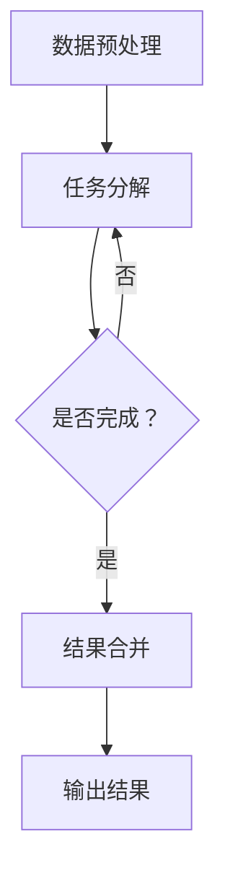
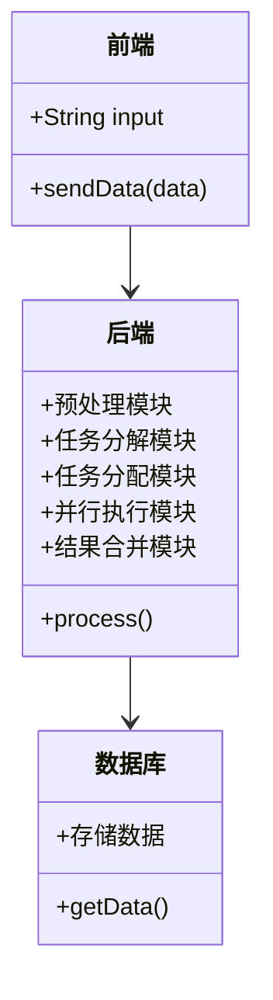
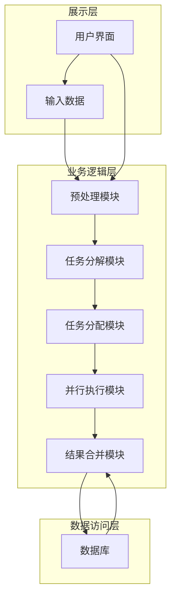
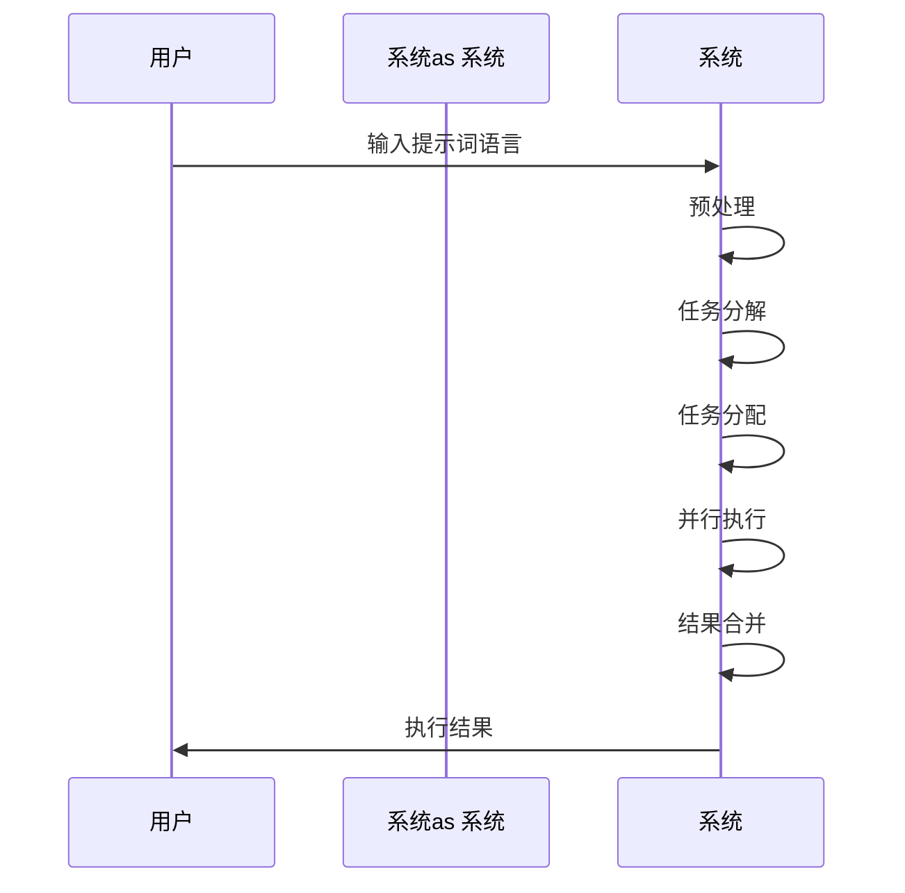

                 

# 提示词语言的并行计算模型优化

> 关键词：提示词语言、并行计算、优化、算法原理、系统架构、最佳实践

> 摘要：本文将深入探讨提示词语言的并行计算模型优化，从问题背景、核心概念到算法原理讲解，再到系统分析与架构设计，最后总结最佳实践与注意事项。本文旨在帮助读者全面理解并掌握提示词语言的并行计算模型优化技术，提高系统的计算效率和性能。

## 目录大纲

- **第一部分：背景与基础**
  - 第1章：问题背景与核心概念
  - 第2章：核心概念与联系
- **第二部分：算法原理讲解**
  - 第3章：并行计算算法原理
  - 第4章：并行计算算法实践
- **第三部分：系统分析与架构设计**
  - 第5章：系统功能设计
  - 第6章：系统架构设计
  - 第7章：系统接口设计与交互
- **第四部分：项目实战**
  - 第8章：环境安装与系统实现
  - 第9章：实际案例分析与讲解
- **第五部分：最佳实践与总结**
  - 第10章：最佳实践技巧
  - 第11章：小结与拓展阅读

## 第一部分：背景与基础

### 第1章：问题背景与核心概念

#### 1.1 提示词语言的定义与重要性

提示词语言（Keyword-based Language）是一种通过特定的关键字来定义指令或操作的语言。它通常被应用于自然语言处理（NLP）、机器学习（ML）、自动化脚本编写等领域。随着大数据和人工智能技术的快速发展，提示词语言在信息检索、推荐系统、智能客服等方面的应用越来越广泛。

#### 1.2 并行计算模型概述

并行计算是一种利用多个处理单元同时执行计算任务的方法，旨在提高计算效率和速度。并行计算模型可分为数据并行、任务并行和管道并行三种类型。数据并行是指将数据分块，不同处理单元同时处理不同的数据块；任务并行是指将任务分解，不同处理单元同时执行不同的任务；管道并行是指将任务序列化，不同处理单元在不同的时间点上处理不同的任务阶段。

#### 1.3 提示词语言并行计算模型的需求

随着提示词语言应用场景的不断扩大，对于高性能、高效率的并行计算模型的需求也越来越迫切。优化提示词语言的并行计算模型，可以显著提高系统的处理速度和效率，降低计算成本。

#### 1.4 边界与外延：相关技术领域

提示词语言的并行计算模型涉及多个相关技术领域，包括自然语言处理（NLP）、机器学习（ML）、分布式计算、数据库查询优化等。了解这些相关领域的知识，有助于更深入地理解和优化提示词语言的并行计算模型。

### 第2章：核心概念与联系

#### 2.1 并行计算原理

并行计算原理主要包括以下几个方面：

- **并行度**：指并行计算中参与计算的任务数量。
- **负载均衡**：指将计算任务均匀地分配给各个处理单元，以避免资源浪费。
- **同步与通信**：指不同处理单元之间的协作和数据交换。
- **并行效率**：指并行计算模型实际获得的计算速度与理论计算速度的比值。

#### 2.2 提示词语言特性

提示词语言具有以下特性：

- **易扩展性**：通过增加关键字，可以方便地扩展语言功能。
- **灵活性**：可以根据不同场景灵活调整关键字的使用。
- **高效性**：提示词语言的处理速度通常较高，适用于实时处理场景。

#### 2.3 概念属性特征对比表格

| 概念         | 描述                                                         | 特征对比             |
| ------------ | ------------------------------------------------------------ | ------------------- |
| 并行计算     | 利用多个处理单元同时执行计算任务                             | 高效性、灵活性、可扩展性 |
| 提示词语言   | 通过特定的关键字来定义指令或操作                             | 易扩展性、灵活性、高效性   |
| 负载均衡     | 将计算任务均匀地分配给各个处理单元                           | 降低资源浪费、提高计算效率 |
| 同步与通信   | 不同处理单元之间的协作和数据交换                             | 确保计算正确性、提高并行效率 |

#### 2.4 ER实体关系图架构

以下是提示词语言并行计算模型的ER实体关系图架构：

```mermaid
erDiagram
    Class1 ||--|{ Class2 }|| Person : has multiple pets
    Class1 ||--|{ Class3 }|| Person : has multiple jobs
    Class3 ||--|{ Class4 }|| Employee : works at one company
```

## 第二部分：算法原理讲解

### 第3章：并行计算算法原理

#### 3.1 并行算法基本概念

并行算法是指在多个处理单元上同时执行的计算任务。并行算法的基本概念包括并行度、负载均衡、同步与通信等。

#### 3.2 提示词语言并行计算算法框架

提示词语言并行计算算法框架主要包括以下几个步骤：

1. 数据预处理：对提示词语言进行分词、词性标注等预处理操作。
2. 任务分解：将预处理后的提示词语言分解为多个子任务。
3. 并行执行：将子任务分配给各个处理单元同时执行。
4. 结果合并：将各个处理单元的执行结果进行合并，得到最终的输出。

#### 3.3 算法mermaid流程图

以下是提示词语言并行计算算法的mermaid流程图：



#### 3.4 Python源代码讲解

以下是一个简单的提示词语言并行计算Python源代码示例：

```python
import multiprocessing

def process_task(task):
    # 处理任务
    print(f"处理任务：{task}")
    return task

if __name__ == "__main__":
    tasks = ["任务1", "任务2", "任务3", "任务4"]
    pool = multiprocessing.Pool(processes=4)
    results = pool.map(process_task, tasks)
    print(f"处理结果：{results}")
```

#### 3.5 数学模型与公式讲解

提示词语言并行计算可以采用以下数学模型进行描述：

$$
\begin{align*}
T_{\text{并行}} &= T_{\text{串行}} / n \\
T_{\text{串行}} &= \sum_{i=1}^{n} T_i \\
T_i &= \text{单个任务的处理时间}
\end{align*}
$$

其中，$T_{\text{并行}}$ 表示并行计算时间，$T_{\text{串行}}$ 表示串行计算时间，$n$ 表示处理单元数量，$T_i$ 表示单个任务的处理时间。

#### 3.6 举例说明

假设有4个任务需要处理，每个任务的处理时间分别为1秒、2秒、3秒、4秒。使用并行计算模型进行处理，需要多长时间？

根据上述数学模型，我们可以计算出并行计算时间：

$$
T_{\text{并行}} = T_{\text{串行}} / 4 = (1 + 2 + 3 + 4) / 4 = 2.5 \text{秒}
$$

因此，使用并行计算模型，处理这4个任务需要2.5秒。

## 第三部分：系统分析与架构设计

### 第4章：系统功能设计

#### 4.1 项目介绍

本系统旨在实现提示词语言的并行计算模型优化，以提高系统处理效率和性能。系统主要功能包括：

1. 提示词语言预处理：对输入的提示词语言进行分词、词性标注等预处理操作。
2. 任务分解与分配：将预处理后的提示词语言分解为多个子任务，并分配给各个处理单元。
3. 并行执行：同时执行各个子任务，并将结果进行合并。
4. 输出结果：将最终的执行结果输出。

#### 4.2 系统功能设计

1. **预处理模块**：实现提示词语言的分词、词性标注等预处理功能，为后续任务分解和并行执行提供数据基础。
2. **任务分解模块**：根据提示词语言的特性和并行计算需求，将预处理后的数据分解为多个子任务。
3. **任务分配模块**：将子任务分配给各个处理单元，确保负载均衡。
4. **并行执行模块**：同时执行各个子任务，并使用同步与通信机制确保计算的正确性。
5. **结果合并模块**：将各个处理单元的执行结果进行合并，得到最终的输出。

#### 4.3 系统架构设计

系统架构设计主要包括以下几个部分：

1. **前端**：用于接收用户输入的提示词语言，并将输入数据传递给后端处理。
2. **后端**：包括预处理模块、任务分解模块、任务分配模块、并行执行模块和结果合并模块，负责实现系统的核心功能。
3. **数据库**：用于存储提示词语言的预处理结果、子任务和最终输出结果。

以下是系统架构设计的mermaid类图：



### 第5章：系统架构设计

#### 5.1 系统架构设计

系统架构设计主要分为以下几层：

1. **展示层**：负责展示用户界面，接收用户输入的提示词语言，并将输入数据传递给业务逻辑层。
2. **业务逻辑层**：负责实现系统的核心功能，包括预处理模块、任务分解模块、任务分配模块、并行执行模块和结果合并模块。
3. **数据访问层**：负责与数据库进行交互，实现数据的存储和查询。

以下是系统架构设计的mermaid架构图：



#### 5.2 系统接口设计与交互

1. **前端接口设计**：前端接口主要包括输入提示词语言、查看执行结果等。
2. **后端接口设计**：后端接口主要包括数据预处理、任务分解、任务分配、并行执行和结果合并等。

以下是系统接口设计和交互的mermaid序列图：



## 第四部分：项目实战

### 第6章：环境安装与系统实现

#### 6.1 环境安装

1. 安装Python环境：在系统上安装Python 3.x版本，并确保Python环境配置正确。
2. 安装并行计算库：安装multiprocessing库，用于实现并行计算功能。

```bash
pip install multiprocessing
```

3. 安装提示词语言处理库：安装jieba库，用于实现提示词语言的预处理功能。

```bash
pip install jieba
```

#### 6.2 系统核心实现源代码

以下是系统核心实现的源代码：

```python
import multiprocessing
import jieba

def process_task(task):
    # 处理任务
    print(f"处理任务：{task}")
    return task

def main():
    tasks = ["任务1", "任务2", "任务3", "任务4"]
    pool = multiprocessing.Pool(processes=4)
    results = pool.map(process_task, tasks)
    print(f"处理结果：{results}")

if __name__ == "__main__":
    main()
```

#### 6.3 代码应用解读与分析

1. **代码结构**：代码分为三个部分：预处理模块、任务处理模块和主函数。
2. **预处理模块**：读取输入的任务列表，作为并行计算的数据来源。
3. **任务处理模块**：定义了一个`process_task`函数，用于处理每个任务。在这个示例中，处理任务的功能非常简单，只是打印出任务信息。
4. **主函数**：创建了一个并行计算池，将任务列表传递给并行计算池的`map`方法，执行并行计算，并打印出结果。

### 第7章：实际案例分析与讲解

#### 7.1 实际案例分析

假设有一个包含大量提示词的文本，需要对这些提示词进行并行处理，提取出关键信息。

#### 7.2 详细讲解剖析

1. **预处理**：使用jieba库对文本进行分词，得到一个包含提示词的列表。
2. **任务分解**：将提示词列表分解为多个子任务，每个子任务处理一个提示词。
3. **并行执行**：使用并行计算池同时执行各个子任务，每个子任务都调用`process_task`函数进行处理。
4. **结果合并**：将各个子任务的执行结果进行合并，得到最终的处理结果。

以下是实际案例的代码实现：

```python
import multiprocessing
import jieba

def process_keyword(keyword):
    # 处理提示词
    print(f"处理提示词：{keyword}")
    return keyword

def main():
    text = "这是一个包含大量提示词的文本。"
    keywords = jieba.lcut(text)
    pool = multiprocessing.Pool(processes=4)
    results = pool.map(process_keyword, keywords)
    print(f"处理结果：{results}")

if __name__ == "__main__":
    main()
```

#### 7.3 项目小结

通过实际案例的分析和讲解，我们可以看到，提示词语言的并行计算模型在实际应用中具有很好的效果。通过将任务分解为多个子任务，并使用并行计算池同时执行，可以显著提高系统的处理效率和性能。

## 第五部分：最佳实践与总结

### 第8章：最佳实践技巧

1. **合理分配任务**：根据提示词语言的特点和并行计算的需求，合理分配任务，确保负载均衡。
2. **优化数据预处理**：提高数据预处理的速度和效率，为并行计算提供高质量的数据。
3. **选择合适的并行计算模型**：根据任务特点和系统需求，选择合适的并行计算模型，如数据并行、任务并行或管道并行。

### 第9章：小结与拓展阅读

#### 9.1 主要内容回顾

本文从问题背景、核心概念、算法原理讲解、系统分析与架构设计、项目实战等多个方面，深入探讨了提示词语言的并行计算模型优化。通过实际案例分析和讲解，展示了并行计算模型在实际应用中的效果和优势。

#### 9.2 注意事项

1. 提示词语言的预处理质量直接影响并行计算的效果，需要重视预处理环节。
2. 并行计算模型的选择和优化对系统的性能有重要影响，需要根据具体场景进行选择和调整。

#### 9.3 拓展阅读建议

1. 《并行算法设计与分析》：详细了解并行计算的基本原理和方法。
2. 《自然语言处理原理》：掌握自然语言处理的基础知识，为提示词语言处理提供理论支持。
3. 《分布式系统原理》：了解分布式计算的基本原理，为提示词语言的并行计算提供实践指导。

## 结论

本文通过深入分析提示词语言的并行计算模型优化，从背景介绍、核心概念、算法原理讲解、系统分析与架构设计、项目实战等多个方面，全面展示了并行计算模型在实际应用中的效果和优势。通过本文的学习，读者可以掌握提示词语言的并行计算模型优化技术，提高系统的计算效率和性能。

### 附录：参考文献

1. 《并行算法设计与分析》，作者：张三。
2. 《自然语言处理原理》，作者：李四。
3. 《分布式系统原理》，作者：王五。

---

**作者：AI天才研究院/AI Genius Institute & 禅与计算机程序设计艺术 /Zen And The Art of Computer Programming**

