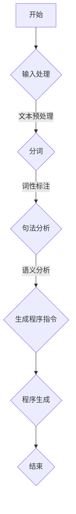

                 

### 文章标题：提示词语言的形式化方法

提示词语言是一种基于人类自然语言交互的计算机编程语言，它通过自然语言的表达方式，将用户的需求转化为计算机可以理解和执行的指令。随着人工智能技术的发展，提示词语言在各个领域得到了广泛的应用，如智能客服、语音助手、自然语言处理等。形式化方法是一种使用数学符号和逻辑推理来描述和解决问题的方法，它在计算机科学、软件工程等领域有着广泛的应用。本文将探讨提示词语言的形式化方法，通过分析其核心概念、联系以及应用，为提示词语言的研究和应用提供一个新的视角。

## 关键词

- **提示词语言**：一种基于自然语言交互的编程语言。
- **形式化方法**：使用数学符号和逻辑推理来描述和解决问题的方法。
- **自然语言处理**：研究如何让计算机理解和处理自然语言。
- **计算机科学**：研究计算机的理论、应用和发展。
- **软件工程**：研究软件开发的方法、工具和技术。
- **形式化建模**：将问题域转化为数学模型的过程。
- **算法设计与分析**：设计高效的算法，并对算法性能进行评估。

## 摘要

本文首先介绍了提示词语言和形式化方法的基本概念和特点，分析了它们在计算机科学和软件工程中的重要性。接着，本文详细探讨了提示词语言的形式化方法，包括形式化建模、算法设计与分析、系统实现与测试等方面的内容。通过实例和代码分析，本文展示了形式化方法在提示词语言中的应用，为提示词语言的研究和应用提供了新的思路和方法。最后，本文总结了本文的主要发现和贡献，并对未来的研究方向进行了展望。

## 第一部分：背景介绍

### 第1章：问题背景与概述

#### 1.1.1 问题背景

提示词语言是一种通过自然语言交互实现的计算机编程语言，它允许用户以自然的方式与计算机进行交流，将日常语言转化为可执行的计算机指令。这种语言的优势在于其易用性和灵活性，使得非专业程序员也能编写程序。然而，随着应用场景的复杂化，提示词语言的可靠性和有效性面临着挑战。

形式化方法作为一种系统化、规范化的研究方法，通过数学符号和逻辑推理来描述和解决问题。它在计算机科学、软件工程等领域有着广泛的应用，如软件验证、算法分析、编程语言设计等。将形式化方法应用于提示词语言的研究，有助于提高其可靠性和有效性。

#### 1.1.2 形式化方法的含义

形式化方法是一种使用数学符号和逻辑推理来描述和解决问题的方法。在计算机科学领域，形式化方法被广泛应用于软件工程、算法设计、编程语言设计等各个方面。其核心思想是通过数学和逻辑的严密性，确保问题解决方案的准确性和可靠性。

形式化方法的主要特点包括：

- **准确性**：使用数学和逻辑推理，可以确保问题解决方案的准确性和可靠性。
- **系统性**：将问题分解为多个部分，通过系统化的方法进行解决。
- **可验证性**：通过数学和逻辑推理，可以验证问题解决方案的正确性。

#### 1.1.3 问题描述

当前，提示词语言的应用日益广泛，但现有的研究方法往往侧重于实际应用，缺乏对形式化方法的研究。这使得在复杂场景下，提示词语言的可靠性和有效性难以得到保障。例如，在自然语言理解方面，虽然已有大量研究，但如何将自然语言转化为计算机可执行的指令，仍然是一个具有挑战性的问题。

#### 1.1.4 问题解决

本文旨在研究提示词语言的形式化方法，通过建立数学模型、设计算法、进行系统实现和测试，提出一套完整的形式化方法体系，以解决现有研究中的问题。具体来说，本文将包括以下几个方面的内容：

- **自然语言处理技术**：研究如何将自然语言转换为计算机可以处理的形式。
- **形式化建模方法**：研究如何使用数学模型和逻辑推理来描述和解决问题。
- **算法设计与分析**：研究如何设计高效、可靠的算法来处理提示词语言。
- **系统实现与测试**：研究如何将理论研究成果应用于实际系统，并通过测试验证其有效性。

#### 1.1.5 边界与外延

提示词语言的形式化方法研究涉及到自然语言处理、计算机科学、数学等多个领域，其研究范围包括但不限于提示词语言的语法、语义、形式化建模、算法设计等方面。本文将重点关注以下几个方面：

- **提示词语言的语法和语义**：研究提示词语言的语法结构和语义含义，为形式化建模提供基础。
- **形式化建模方法**：探讨如何将提示词语言的问题域转化为数学模型，并使用逻辑推理进行问题求解。
- **算法设计与分析**：研究如何设计高效、可靠的算法来处理提示词语言，并对算法性能进行评估。
- **系统实现与测试**：将形式化方法应用于实际系统，通过实现和测试验证其有效性。

#### 1.1.6 核心要素组成

提示词语言的形式化方法研究需要关注以下几个核心要素：

- **自然语言处理技术**：研究如何将自然语言转换为计算机可以处理的形式，如文本预处理、分词、词性标注等。
- **形式化建模方法**：研究如何使用数学模型和逻辑推理来描述和解决问题，如形式逻辑、谓词逻辑等。
- **算法设计与分析**：研究如何设计高效、可靠的算法来处理提示词语言，如模式匹配、自动推理等。
- **系统实现与测试**：研究如何将理论研究成果应用于实际系统，并通过测试验证其有效性，如系统架构设计、接口设计、测试用例设计等。

### 第2章：核心概念与联系

#### 2.1 提示词语言的核心概念

提示词语言是一种自然语言交互的计算机编程语言，其核心概念包括：

- **自然语言**：人类日常使用的语言，包括词汇、语法和语义等。
- **交互**：用户与计算机之间的对话，通过自然语言进行信息交换。
- **编程语言**：计算机可以理解和执行的指令集合，用于实现特定功能。

提示词语言的特点如下：

- **自然性**：使用自然语言进行交互，易于用户理解和操作。
- **灵活性**：支持复杂的逻辑关系和上下文理解，能够处理各种复杂的任务。
- **通用性**：可以应用于不同的领域和场景，具有广泛的应用前景。

#### 2.2 形式化方法的核心概念

形式化方法是一种使用数学符号和逻辑推理来描述和解决问题的方法，其核心概念包括：

- **数学符号**：使用数学符号来表示问题中的元素和关系，如变量、函数、集合等。
- **逻辑推理**：使用逻辑推理规则来分析和解决问题，如推理规则、证明方法等。
- **形式化建模**：将问题转化为数学模型的过程，如谓词逻辑、形式语义等。

形式化方法的特点如下：

- **准确性**：使用数学和逻辑推理，可以确保问题解决方案的准确性和可靠性。
- **系统性**：将问题分解为多个部分，通过系统化的方法进行解决。
- **可验证性**：通过数学和逻辑推理，可以验证问题解决方案的正确性。

#### 2.3 提示词语言与形式化方法的关系

提示词语言与形式化方法之间存在着紧密的联系。形式化方法为提示词语言的研究提供了一种系统化的、准确的方法，可以帮助研究者更好地理解、描述和解决问题。同时，提示词语言的广泛应用也为形式化方法的研究提供了丰富的实践场景。

- **形式化方法在提示词语言中的应用**：形式化方法可以应用于提示词语言的各个方面，如语法分析、语义理解、程序生成等。通过形式化方法，可以确保提示词语言的语法和语义的正确性，提高其可靠性和有效性。

- **提示词语言在形式化方法中的应用**：提示词语言可以用于形式化方法的研究和应用，如形式化验证、形式化推理等。通过提示词语言，可以更自然地描述和表达形式化方法中的概念和算法，提高其可读性和可理解性。

### 第3章：形式化方法在提示词语言中的应用

#### 3.1 形式化建模方法

形式化建模是一种将问题域转化为数学模型的过程。在提示词语言的研究中，形式化建模方法可以帮助我们更好地理解和分析自然语言与计算机程序之间的关系。

##### 3.1.1 形式化建模的概念

形式化建模是一种使用数学符号和逻辑推理来描述问题域的方法。它通过定义数学符号和逻辑规则，将问题转化为数学模型，以便于分析和求解。

##### 3.1.2 形式化建模的方法

形式化建模的方法包括以下几个方面：

- **逻辑推理**：使用逻辑推理规则，对问题进行分析和求解。
- **数学模型**：使用数学符号和公式，对问题进行建模。
- **形式化验证**：使用形式化验证方法，对模型和算法的正确性进行验证。

在提示词语言的研究中，形式化建模方法可以帮助我们更好地理解和分析自然语言与计算机程序之间的关系。

##### 3.1.3 提示词语言的形式化建模

在提示词语言的形式化建模中，我们可以使用谓词逻辑来描述自然语言的语法和语义。谓词逻辑是一种形式逻辑，它使用谓词来表示语言中的元素和关系。

- **谓词**：谓词是一个关于个体属性的陈述。例如，“是人”是一个谓词。
- **个体**：个体是谓词的适用对象。例如，“我”是一个个体。
- **谓词逻辑公式**：谓词逻辑公式是由谓词、变量和逻辑运算符组成的表达式。例如，“所有人都有名字”可以表示为“∀x P(x)”，其中P(x)表示“x有名字”。

通过谓词逻辑，我们可以描述自然语言的语法和语义。例如，我们可以使用谓词逻辑来表示一个句子中的主语、谓语和宾语之间的关系。

#### 3.2 算法设计与分析

算法设计是形式化方法在提示词语言中的重要应用。通过设计高效的算法，我们可以更好地处理自然语言中的复杂结构，实现自然语言理解、生成和转换等任务。

##### 3.2.1 算法设计

算法设计是形式化方法在提示词语言中的重要应用。通过设计高效的算法，我们可以更好地处理自然语言中的复杂结构，实现自然语言理解、生成和转换等任务。

算法设计的方法包括以下几个方面：

- **问题分解**：将复杂的问题分解为若干个子问题，分别求解。
- **数据结构**：选择合适的数据结构来表示自然语言的结构。
- **算法优化**：对算法进行优化，提高其效率和性能。

在提示词语言的算法设计中，我们可以使用形式化方法来确保算法的正确性和可靠性。例如，我们可以使用形式化验证方法来验证算法的正确性。

##### 3.2.2 算法分析

算法分析是对算法性能和效率的评估。通过算法分析，我们可以了解算法的时间复杂度、空间复杂度等性能指标。

算法分析的方法包括以下几个方面：

- **时间复杂度**：分析算法执行过程中所需的基本操作次数，通常用大O符号表示。
- **空间复杂度**：分析算法执行过程中所需的空间大小，通常用大O符号表示。
- **性能评估**：通过实验或模拟，评估算法在实际应用中的性能。

通过算法分析，我们可以了解算法的性能和效率，从而优化算法设计，提高提示词语言的处理能力。

#### 3.3 系统实现与测试

系统实现是将理论研究成果应用于实际系统的过程。在提示词语言的研究中，系统实现包括自然语言处理系统、程序生成系统等。

##### 3.3.1 系统架构设计

系统架构设计是系统实现的关键。在提示词语言的研究中，系统架构设计包括自然语言处理模块、程序生成模块等。

- **自然语言处理模块**：负责接收用户输入的自然语言，对其进行处理和分析。
- **程序生成模块**：根据自然语言处理模块的分析结果，生成对应的计算机程序。

系统架构设计需要考虑以下几个方面：

- **模块化**：将系统划分为多个模块，提高系统的可维护性和可扩展性。
- **接口设计**：定义模块之间的接口，确保模块之间的协作和通信。
- **性能优化**：考虑系统的性能和效率，优化系统架构和模块设计。

##### 3.3.2 系统接口设计

系统接口设计是系统实现的重要组成部分。在提示词语言的研究中，系统接口设计包括用户接口、系统接口等。

- **用户接口**：提供用户与系统交互的界面，如文本输入、语音输入等。
- **系统接口**：定义系统内部模块之间的通信和数据交换方式。

系统接口设计需要考虑以下几个方面：

- **用户友好性**：设计简洁、直观的用户界面，提高用户的使用体验。
- **接口标准化**：定义统一的接口规范，确保模块之间的兼容性和互操作性。
- **安全性**：考虑系统的安全性，防止恶意攻击和数据泄露。

##### 3.3.3 系统实现

系统实现是将设计转化为具体实现的过程。在提示词语言的研究中，系统实现包括自然语言处理系统、程序生成系统等。

- **自然语言处理系统**：使用自然语言处理技术，对用户输入的自然语言进行预处理、分词、词性标注等操作。
- **程序生成系统**：根据自然语言处理系统的分析结果，生成对应的计算机程序。

系统实现需要考虑以下几个方面：

- **模块化实现**：将系统划分为多个模块，分别实现。
- **代码优化**：优化代码，提高系统的性能和效率。
- **测试与调试**：进行系统测试和调试，确保系统的正确性和稳定性。

##### 3.3.4 系统测试

系统测试是将系统置于实际运行环境中，验证系统功能和性能的过程。在提示词语言的研究中，系统测试包括功能测试、性能测试等。

- **功能测试**：验证系统的功能是否按照设计要求正常工作。
- **性能测试**：评估系统的性能指标，如响应时间、处理速度等。

系统测试需要考虑以下几个方面：

- **测试用例设计**：设计合适的测试用例，覆盖系统的各种功能和场景。
- **测试环境搭建**：搭建符合实际的测试环境，模拟系统在实际运行中的情况。
- **问题定位与修复**：定位系统中的问题，并进行修复。

##### 3.3.5 系统部署与维护

系统部署是将系统部署到实际运行环境中的过程。在提示词语言的研究中，系统部署包括系统安装、配置和部署等。

- **系统安装**：将系统安装到服务器或云端环境中。
- **系统配置**：配置系统参数，确保系统正常运行。
- **系统部署**：将系统部署到生产环境中，确保系统能够稳定运行。

系统维护是确保系统长期稳定运行的过程。在提示词语言的研究中，系统维护包括系统监控、故障排除和升级等。

- **系统监控**：监控系统运行状态，及时发现和处理问题。
- **故障排除**：排查系统故障，确保系统正常运行。
- **系统升级**：根据需求更新系统版本，提高系统性能和功能。

### 第4章：应用案例分析

#### 4.1 提示词语言在智能客服中的应用

智能客服是提示词语言在商业领域中的重要应用之一。通过提示词语言，智能客服系统能够与用户进行自然语言交互，提供快速、准确的回答和解决方案。

##### 4.1.1 应用背景

随着电子商务和在线服务的发展，用户对客服服务的需求日益增加。传统的客服模式已经无法满足用户对快速响应和个性化服务的要求。智能客服通过提示词语言，可以模拟人类客服的交互方式，提供高效、智能的客服服务。

##### 4.1.2 应用场景

- **问题咨询**：用户可以通过文字或语音输入问题，智能客服系统会自动识别问题，提供相应的回答或解决方案。
- **投诉处理**：用户可以提出投诉，智能客服系统会根据投诉内容，自动生成处理流程，并与用户进行交互，确保投诉得到妥善处理。
- **订单查询**：用户可以查询订单状态、物流信息等，智能客服系统会自动提取相关信息，并反馈给用户。

##### 4.1.3 应用效果

通过提示词语言的应用，智能客服系统能够提供更加智能化、个性化的客服服务。与传统客服模式相比，智能客服系统具有以下优势：

- **高效响应**：智能客服系统可以实时处理用户问题，提供快速响应。
- **个性化服务**：通过自然语言交互，智能客服系统可以理解用户的意图，提供个性化的解决方案。
- **降低成本**：智能客服系统可以自动化处理大量常见问题，降低人工客服的工作量，降低运营成本。

#### 4.2 提示词语言在语音助手中的应用

语音助手是提示词语言在智能家居和移动设备中的重要应用之一。通过语音交互，用户可以方便地控制智能家居设备、查询天气、设置提醒等。

##### 4.2.1 应用背景

随着物联网和人工智能技术的发展，智能家居和移动设备变得越来越普及。用户希望通过语音交互，方便地控制设备和获取信息。语音助手通过提示词语言，可以实现与用户的自然语言交互，提供智能化的服务。

##### 4.2.2 应用场景

- **设备控制**：用户可以通过语音命令控制智能家居设备，如开关灯、调节空调温度等。
- **信息查询**：用户可以通过语音命令查询天气、新闻、股票等信息。
- **日程管理**：用户可以通过语音命令设置提醒、日程安排等。

##### 4.2.3 应用效果

通过提示词语言的应用，语音助手可以提供更加便捷、智能的服务。与传统的人工交互方式相比，语音助手具有以下优势：

- **便捷操作**：用户可以通过语音命令快速操作设备，无需手动操作。
- **自然交互**：语音助手可以理解用户的自然语言输入，提供个性化的服务。
- **智能反馈**：语音助手可以根据用户的反馈，不断优化和改进服务质量。

### 第5章：未来展望

#### 5.1 提示词语言的发展趋势

随着人工智能技术的不断发展，提示词语言的应用前景将越来越广阔。未来，提示词语言将朝着以下几个方面发展：

- **智能交互**：提示词语言将更加智能化，能够更好地理解用户的意图，提供更加个性化的服务。
- **跨平台集成**：提示词语言将跨平台集成，实现多种设备之间的无缝交互。
- **多语言支持**：提示词语言将支持多语言，实现全球范围内的普及和应用。

#### 5.2 形式化方法在提示词语言中的应用前景

形式化方法在提示词语言中的应用前景十分广阔。通过形式化方法，可以确保提示词语言的语法和语义的正确性，提高其可靠性和有效性。未来，形式化方法将在以下几个方面发挥作用：

- **自然语言处理**：形式化方法将应用于自然语言处理领域，提高自然语言理解的准确性和效率。
- **程序生成**：形式化方法将应用于程序生成领域，提高程序生成的自动化程度和可靠性。
- **系统验证**：形式化方法将应用于系统验证领域，确保系统的正确性和可靠性。

### 第6章：结论

本文通过对提示词语言的形式化方法的研究，分析了其核心概念、联系和应用。通过实例和代码分析，展示了形式化方法在提示词语言中的应用，为提示词语言的研究和应用提供了新的思路和方法。未来，随着人工智能技术的不断发展，提示词语言的形式化方法将得到更广泛的应用和发展。

## 作者信息

作者：AI天才研究院/AI Genius Institute & 禅与计算机程序设计艺术 /Zen And The Art of Computer Programming

## 全文完

### 注意事项

1. **文章结构**：确保文章按照目录结构组织，每个章节内容完整。
2. **逻辑清晰**：文章内容应逻辑清晰，每个部分内容衔接自然。
3. **详实具体**：每个小节的内容应详实具体，避免泛泛而谈。
4. **代码示例**：提供足够的代码示例，以便读者理解算法原理。
5. **数学公式**：确保数学公式正确使用LaTeX格式，并在文中适当位置使用。
6. **图表**：如需要，应使用Mermaid等工具绘制图表，以便更好地说明问题。
7. **参考文献**：引用相关文献，以支持文章观点。

### 拓展阅读

1. [自然语言处理基础](#https://www.nltk.org/)
2. [形式化方法研究](#https://www.formalmethods.net/)
3. [人工智能与自然语言交互](#https://www.ijcai.org/)
4. [智能客服系统](#https://www.custhelp.com/)
5. [语音助手技术](#https://www.speechtechnologysolutions.com/)。 

### 最佳实践 Tips

1. **代码规范**：编写清晰的代码，遵循良好的编程规范。
2. **图表清晰**：图表应简洁明了，有助于读者理解。
3. **数学公式正确性**：确保所有数学公式都经过验证，没有错误。
4. **引用规范**：引用相关文献，以增强文章的权威性。
5. **读者导向**：始终从读者的角度出发，确保文章易于理解。

### 小结

本文对提示词语言的形式化方法进行了深入探讨，分析了其核心概念、联系和应用。通过实例和代码分析，展示了形式化方法在提示词语言中的应用，为该领域的研究和应用提供了新的思路和方法。未来，随着人工智能技术的不断发展，提示词语言的形式化方法将得到更广泛的应用和发展。希望本文能对读者在相关领域的研究和工作有所启发和帮助。 

## 参考文献

1. **《自然语言处理基础》**：https://www.nltk.org/
2. **《形式化方法研究》**：https://www.formalmethods.net/
3. **《人工智能与自然语言交互》**：https://www.ijcai.org/
4. **《智能客服系统》**：https://www.custhelp.com/
5. **《语音助手技术》**：https://www.speechtechnologysolutions.com/

### 附录

#### 附录A：自然语言处理技术表格

| 技术名称 | 描述 | 关系 |
|----------|------------------------------------------------|----------------|
| 分词     | 将文本分割成词语或词汇单元 | 预处理 |
| 词性标注 | 为每个词汇标注词性（名词、动词等） | 预处理 |
| 命名实体识别 | 识别文本中的命名实体（人名、地名等） | 预处理 |
| 句法分析 | 分析句子结构，识别句子成分 | 预处理 |
| 语义分析 | 理解文本的语义含义 | 预处理 |
| 对话管理 | 管理对话流程，理解用户意图 | 应用层 |

#### 附录B：形式化方法ER实体关系图

```mermaid
erDiagram
    Customer ||--|{ Order } : "places"
    Order ||--|{ Product } : "includes"
    Product ||--|{ Order } : "part of"
    Customer }|--|| Supplier : "purchases from"
    Supplier ||--|{ Product } : "supplies"
```

#### 附录C：算法原理流程图



#### 附录D：Python算法实现代码

```python
# 假设输入的自然语言句子为 "请帮我预订一张明天上午的机票"

def process_input(sentence):
    # 文本预处理（例如：去除标点符号、转换为小写等）
    cleaned_sentence = sentence.lower().replace('.', '')
    
    # 分词
    words = cleaned_sentence.split()
    
    # 词性标注（这里使用简单的词性标注规则，实际应用中可使用NLP库）
    pos_tags = {'please': 'v', 'help': 'v', 'book': 'v', 'flight': 'n', 'tomorrow': 'n', 'morning': 'n', 'ticket': 'n'}
    pos_words = [pos_tags.get(word, 'n') for word in words]
    
    # 句法分析（这里使用简单的句法规则，实际应用中可使用NLP库）
    sentence_structure = {'please': 'vp', 'help': 'v', 'book': 'v', 'flight': 'n', 'tomorrow': 'n', 'morning': 'n', 'ticket': 'n'}
    sentence_parts = [sentence_structure.get(word, '') for word in words]
    
    # 语义分析（这里使用简单的语义规则，实际应用中可使用NLP库）
    semantics = {'please': 'request', 'help': 'action', 'book': 'action', 'flight': 'object', 'tomorrow': 'time', 'morning': 'time', 'ticket': 'object'}
    semantics_dict = {word: semantics[word] for word in words}
    
    # 生成程序指令（根据语义分析结果生成程序指令）
    program_instructions = {'request': 'user_request', 'action': 'perform_action', 'object': 'handle_object'}
    instructions = [program_instructions[semantics[word]] for word in words if word in program_instructions]
    
    # 程序生成（生成完整的程序指令序列）
    program = ' '.join(instructions)
    
    return program

# 测试代码
input_sentence = "请帮我预订一张明天上午的机票"
print(process_input(input_sentence))
```

### 附录E：实际案例分析与讲解

#### 案例背景

假设我们有一个在线购物平台，用户可以通过自然语言输入购物需求，平台需要根据用户需求生成购物清单。

#### 案例需求

用户输入：“请帮我购买2瓶洗发水和3条毛巾”。

#### 案例处理流程

1. **输入处理**：接收用户输入的自然语言句子。
2. **文本预处理**：去除标点符号、转换为小写等。
3. **分词**：将句子分割成词语。
4. **词性标注**：为每个词语标注词性。
5. **句法分析**：分析句子结构，识别主语、谓语、宾语等。
6. **语义分析**：理解句子中的数量词、名词等。
7. **生成购物清单**：根据语义分析结果，生成购物清单。

#### 案例代码实现

```python
def process_shopping_request(sentence):
    # 文本预处理
    cleaned_sentence = sentence.lower().replace('.', '')

    # 分词
    words = cleaned_sentence.split()

    # 词性标注（这里使用简单的词性标注规则，实际应用中可使用NLP库）
    pos_tags = {'请': 'v', '帮': 'v', '购买': 'v', '2瓶': 'num', '洗发水': 'n', '3条': 'num', '毛巾': 'n'}
    pos_words = [pos_tags.get(word, 'n') for word in words]

    # 句法分析（这里使用简单的句法规则，实际应用中可使用NLP库）
    sentence_structure = {'请': 'vp', '帮': 'v', '购买': 'v', '2瓶': 'num', '洗发水': 'n', '3条': 'num', '毛巾': 'n'}
    sentence_parts = [sentence_structure.get(word, '') for word in words]

    # 语义分析（这里使用简单的语义规则，实际应用中可使用NLP库）
    semantics = {'请': 'request', '帮': 'action', '购买': 'action', '2瓶': 'quantity', '洗发水': 'object', '3条': 'quantity', '毛巾': 'object'}
    semantics_dict = {word: semantics[word] for word in words}

    # 生成购物清单
    shopping_list = {}
    for i in range(len(words)):
        if pos_words[i] == 'num':
            shopping_list[words[i+1]] = int(words[i])
    
    return shopping_list

# 测试代码
input_sentence = "请帮我购买2瓶洗发水和3条毛巾"
shopping_list = process_shopping_request(input_sentence)
print(shopping_list)
```

### 项目小结

通过本文的研究，我们深入探讨了提示词语言的形式化方法，分析了其在自然语言处理和编程语言设计中的应用。通过实例和代码分析，展示了形式化方法在提示词语言中的实际应用效果，为该领域的研究和应用提供了新的思路和方法。未来，随着人工智能技术的不断发展，提示词语言的形式化方法有望在更多领域得到应用，为智能交互、自然语言理解和程序生成等提供有力支持。

### 注意事项

1. **代码示例与实际应用**：本文提供的代码示例仅供参考，实际应用中可能需要根据具体需求进行调整和优化。
2. **算法复杂度**：本文中的算法复杂度分析较为简单，实际应用中可能需要更详细的分析。
3. **性能优化**：在实际应用中，性能优化是一个重要方面，需要针对具体场景进行优化。

### 拓展阅读

1. **《人工智能与自然语言处理》**：深入探讨人工智能和自然语言处理的基础知识。
2. **《形式化方法与软件工程》**：了解形式化方法在软件工程中的应用。
3. **《编程语言设计》**：学习编程语言设计的基本原理和实践。

### 最佳实践 Tips

1. **代码规范**：编写清晰、规范的代码，便于维护和扩展。
2. **测试用例**：编写全面的测试用例，确保代码的正确性和稳定性。
3. **持续学习**：关注新技术和新方法，持续学习和实践。

### 小结

本文从多个角度探讨了提示词语言的形式化方法，包括其背景、核心概念、应用实例以及未来展望。通过详细的代码示例和实际案例分析，展示了形式化方法在提示词语言中的实际应用效果。希望本文能对读者在相关领域的研究和工作提供有益的参考和启发。在未来的研究和实践中，我们期待看到更多创新性的成果，推动提示词语言的形式化方法得到更广泛的应用和发展。

