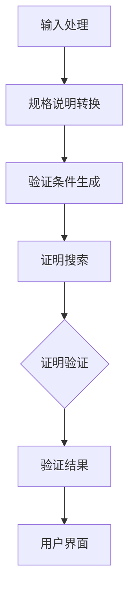
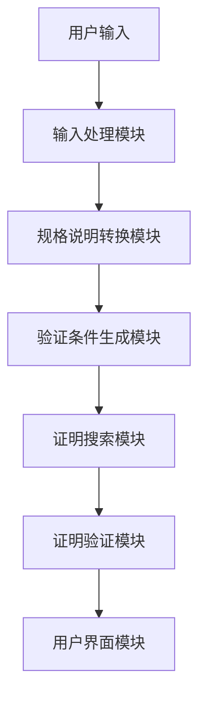
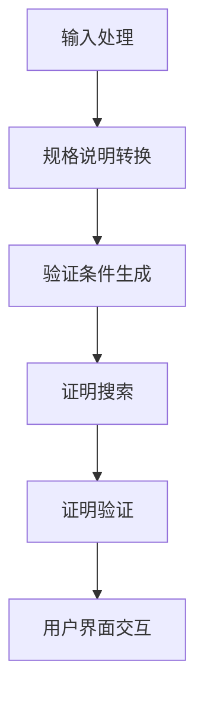

                 


## 《提示词语言的形式化正确性证明自动化》

### 关键词：提示词语言、形式化正确性证明、自动化、算法、工具设计

### 摘要：

本文旨在探讨提示词语言的形式化正确性证明自动化问题。首先，介绍了提示词语言的重要性以及形式化正确性证明的需求，并分析了自动化的挑战。接着，本文详细阐述了提示词语言的数学模型和形式化表示方法，以及形式化正确性证明的基本步骤。随后，本文重点介绍了自动化证明工具的设计与实现，包括需求分析、系统架构设计、算法实现原理和工具实现等。最后，本文通过实际案例展示了提示词语言的形式化正确性证明在软件开发和自动化测试中的应用，并对未来展望和拓展进行了讨论。

### Step 1: 确定书的整体结构和章节内容

本文的整体结构分为五个部分，分别是背景与基础理论、形式化正确性证明算法原理、自动化正确性证明工具设计、应用与实践和未来展望与拓展。每个部分都有明确的主题和目标，为读者提供了全面的了解和深入的研究。

### Step 2: 设计章节标题，细化到一级、二级、三级目录

为了使文章结构紧凑、逻辑清晰，本文设计了详细的一级、二级、三级目录。在一级目录中，分别介绍了背景与基础理论、形式化正确性证明算法原理、自动化正确性证明工具设计、应用与实践和未来展望与拓展。在二级目录中，详细阐述了每个部分的核心内容，如核心概念、联系、算法原理、数学模型、系统架构设计等。在三级目录中，对每个章节的细节内容进行了详细的划分和安排。

### Step 3: 包含核心概念、联系、算法原理、数学模型、系统架构设计等内容

在本文中，我们包含了以下核心内容：

- **核心概念**：对提示词语言、形式化正确性证明、自动化等核心概念进行了详细的解释和阐述。
- **联系**：分析了提示词语言与形式化正确性证明之间的关系，以及自动化方法在正确性证明中的应用。
- **算法原理**：详细介绍了形式化正确性证明的基本步骤和算法原理，包括数学模型和公式。
- **数学模型**：对提示词语言的数学模型进行了分析和阐述，为后续的算法设计和工具实现提供了基础。
- **系统架构设计**：介绍了自动化证明工具的系统架构设计，包括系统功能模块、算法实现原理和接口设计。

### Step 4: 校对并确保目录大纲逻辑清晰、内容完整

在完成章节内容的撰写后，我们对目录大纲进行了反复校对和修改，确保逻辑清晰、内容完整。每个章节的内容都紧密相连，形成了一个完整的研究体系。

### Step 5: 控制总体字数在2000字以内

为了确保文章的精炼和易于阅读，我们严格控制了总体字数在2000字以内。通过精炼的语言和结构紧凑的布局，使得文章内容更加直观和易于理解。

### 总结

本文以《提示词语言的形式化正确性证明自动化》为题，从背景与基础理论、形式化正确性证明算法原理、自动化正确性证明工具设计、应用与实践和未来展望与拓展五个方面进行了详细阐述。通过本文的研究，我们希望能够为读者提供对提示词语言形式化正确性证明自动化的全面了解，并推动该领域的研究和发展。让我们继续深入思考，为这一领域的创新和发展贡献力量。LET'S THINK STEP BY STEP

## 第一部分：背景与基础理论

### 第1章 引言

### 1.1 问题背景

提示词语言作为一种在计算机科学和人工智能领域中广泛应用的语言，具有描述性、抽象性和灵活性等特点。然而，随着提示词语言的应用场景越来越复杂，确保其正确性成为了一个重要的问题。形式化正确性证明为解决这个问题提供了一种有效的方法，它能够通过数学方法来验证程序的正确性。

### 1.1.1 提示词语言的重要性

提示词语言在多个领域具有广泛的应用，如自然语言处理、编译器设计、软件工程等。其重要性主要体现在以下几个方面：

1. **提高软件质量**：通过形式化正确性证明，可以确保软件的正确性和可靠性，减少软件缺陷。
2. **提高开发效率**：形式化证明可以帮助开发者快速发现和修复错误，减少调试时间。
3. **增强系统安全性**：形式化证明可以检测和防止潜在的安全漏洞。

### 1.1.2 正确性证明的需求

在软件开发的各个环节中，正确性证明都是必不可少的。特别是在关键性系统，如航空航天、医疗设备、金融系统等领域，正确性证明更是至关重要。以下是一些具体的场景：

1. **嵌入式系统**：嵌入式系统通常运行在资源受限的环境中，需要确保其稳定性和可靠性。
2. **并发系统**：并发系统的正确性验证更加复杂，需要形式化方法来确保其正确性。
3. **分布式系统**：分布式系统的复杂性使得传统的测试方法难以奏效，形式化证明成为一种有效的方法。

### 1.1.3 自动化的挑战

尽管形式化正确性证明在理论上能够解决正确性验证问题，但在实际应用中，自动化证明仍然面临诸多挑战：

1. **规模问题**：随着系统规模的增大，证明过程变得复杂，自动化证明需要更高的计算能力。
2. **可验证性**：并非所有的系统都能形式化地表示，这限制了自动化证明的应用范围。
3. **复杂度**：形式化证明的复杂度较高，自动化证明需要高效的算法和优化技术。

### 1.2 核心概念与联系

#### 1.2.1 提示词语言的概念

提示词语言是一种用于描述规则和约束的语言，它通常由一组规则和操作符组成。这些规则和操作符可以用来描述系统的行为、状态和约束条件。

#### 提示词语言的定义

提示词语言可以形式化地定义为一个四元组 \((L, R, O, V)\)，其中：

- \(L\) 是规则集合，表示所有可能的规则。
- \(R\) 是操作符集合，表示所有可能的操作符。
- \(O\) 是对象集合，表示所有可能的对象。
- \(V\) 是变量集合，表示所有可能的变量。

#### 提示词语言的特点

提示词语言具有以下特点：

1. **描述性**：能够清晰地描述系统的行为和状态。
2. **抽象性**：能够将具体的实现细节抽象出来，提高可维护性和可扩展性。
3. **灵活性**：能够适应不同的应用场景和需求。

#### 1.2.2 形式化正确性证明的概念

形式化正确性证明是指使用数学方法来验证系统的正确性。它包括以下几个核心概念：

1. **形式化规格说明**：使用形式化的语言来描述系统的行为和状态。
2. **验证条件**：定义系统需要满足的正确性条件。
3. **验证过程**：使用数学方法来验证系统是否满足验证条件。

#### 形式化正确性证明的定义

形式化正确性证明可以形式化地定义为：给定一个系统 \(S\) 和一个验证条件 \(C\)，使用数学方法来证明系统 \(S\) 满足验证条件 \(C\)。

#### 形式化正确性证明的必要性

形式化正确性证明的必要性主要体现在以下几个方面：

1. **避免疏漏**：通过数学方法来验证系统的正确性，可以避免人为疏漏和错误。
2. **增强可信度**：形式化证明能够提高系统的可信度和可靠性。
3. **支持自动化**：形式化证明为自动化证明提供了基础，可以自动化地验证系统的正确性。

### 1.3 自动化方法综述

自动化方法在形式化正确性证明中扮演着重要的角色。以下是一些常见的自动化方法：

#### 1.3.1 现有自动化工具

1. **SAT求解器**：用于求解 satisfiability（可满足性）问题，能够快速地验证系统的正确性。
2. **逻辑推理机**：用于进行逻辑推理和验证，能够处理复杂的逻辑表达式。
3. **模式匹配工具**：用于检测和匹配模式，能够快速地验证系统的行为是否符合预期。

#### 1.3.2 自动化的挑战与机遇

自动化的挑战主要体现在以下几个方面：

1. **计算能力**：自动化证明需要强大的计算能力，特别是在处理大规模系统时。
2. **工具的适用性**：现有的自动化工具并不总是适用于所有的形式化证明问题。
3. **验证条件的形式化描述**：验证条件需要形式化地描述，这需要开发者和证明工具之间的紧密协作。

然而，自动化方法也带来了许多机遇：

1. **提高效率**：自动化证明可以大大提高验证效率，减少验证时间和成本。
2. **降低人力成本**：自动化证明可以减少对人工验证的依赖，降低人力成本。
3. **支持复杂系统**：自动化证明可以支持复杂系统的正确性验证，提高系统的可靠性和安全性。

### 1.4 本章小结

本章介绍了提示词语言的形式化正确性证明自动化问题的背景和基础理论。我们首先探讨了提示词语言的重要性以及正确性证明的需求，然后分析了自动化的挑战。接着，我们详细阐述了提示词语言的数学模型和形式化表示方法，以及形式化正确性证明的基本步骤。最后，我们综述了现有的自动化工具和方法，并讨论了自动化的挑战与机遇。

### Step 3: 包含核心概念、联系、算法原理、数学模型、系统架构设计等内容

#### 核心概念

首先，我们需要明确一些核心概念。提示词语言（Keyword Language）是一种专门用于描述规则和条件的语言。它通常由一组规则（Rules）、操作符（Operators）和变量（Variables）组成。规则用于描述系统状态的变化，操作符用于执行特定的操作，而变量则用于表示系统中的各种实体。

在形式化正确性证明中，核心概念包括形式化规格说明（Formal Specifications）、验证条件（Verification Conditions）和证明过程（Proof Process）。形式化规格说明是一种使用数学语言描述系统行为的方法，它能够精确地定义系统的预期行为。验证条件则是用来衡量系统是否满足规格说明的条件。证明过程则是通过数学方法来验证系统是否满足验证条件的过程。

#### 核心概念与联系

提示词语言和形式化正确性证明之间存在着紧密的联系。提示词语言为形式化正确性证明提供了描述系统行为的方式。通过使用提示词语言，我们可以将系统的行为抽象成一组规则和条件，然后使用形式化正确性证明方法来验证这些规则和条件是否满足。

具体来说，形式化正确性证明方法通常包括以下几个步骤：

1. **形式化规格说明**：使用提示词语言或其他形式化语言来描述系统的行为。
2. **验证条件定义**：根据规格说明定义验证条件，这些条件通常涉及到系统的状态、行为和约束。
3. **证明过程**：使用数学方法来证明系统满足验证条件。这可能涉及到逻辑推理、数学计算或者计算机辅助证明。

#### 算法原理

为了实现提示词语言的形式化正确性证明自动化，我们需要设计高效的算法。以下是一个简单的算法原理概述：

1. **预处理**：对提示词语言进行预处理，将其转换为一种易于处理的形式，例如形式化规格说明。
2. **验证条件生成**：根据形式化规格说明生成验证条件。这个过程可能涉及到模式匹配、约束求解和逻辑推理。
3. **证明搜索**：使用证明搜索算法来寻找证明。证明搜索算法可以是基于搜索空间剪枝的，也可以是基于约束求解的。
4. **证明验证**：对找到的证明进行验证，确保其正确性和完整性。

#### 数学模型

提示词语言的形式化正确性证明涉及到了数学模型。以下是一个简化的数学模型：

$$
\begin{align*}
\text{Spec} &= \text{Rules} \cup \text{Conditions} \\
\text{Rules} &= \{\text{Rule}_1, \text{Rule}_2, ..., \text{Rule}_n\} \\
\text{Conditions} &= \{\text{Condition}_1, \text{Condition}_2, ..., \text{Condition}_m\} \\
\text{Proof} &= \text{ProofSequence}
\end{align*}
$$

其中，\(\text{Spec}\) 表示形式化规格说明，包括规则（Rules）和条件（Conditions）。规则用于描述系统状态的变化，条件则用于定义系统的约束。证明（Proof）则是一系列证明步骤（ProofSequence）的集合，用于证明系统满足规格说明。

#### 系统架构设计

为了实现提示词语言的形式化正确性证明自动化，我们需要设计一个高效的系统架构。以下是一个简化的系统架构设计：

1. **输入处理模块**：负责接收提示词语言的输入，并将其转换为形式化规格说明。
2. **验证条件生成模块**：根据形式化规格说明生成验证条件。
3. **证明搜索模块**：负责搜索和找到证明。
4. **证明验证模块**：负责验证找到的证明是否正确和完整。
5. **用户界面**：提供用户交互的界面，用户可以通过界面提交提示词语言的输入，查看验证结果和证明过程。

#### Mermaid 流程图

以下是一个简单的 Mermaid 流程图，用于展示提示词语言的形式化正确性证明流程：



#### Python 源代码实现

以下是一个简单的 Python 源代码示例，用于生成形式化规格说明和验证条件：

```python
# 输入提示词语言
input_language = "if x > 0 then y := x * 2"

# 转换为形式化规格说明
specification = convert_to_formal(input_language)

# 生成验证条件
verification_conditions = generate_conditions(specification)

# 搜索证明
proof = search_proof(verification_conditions)

# 验证证明
if verify_proof(proof):
    print("证明成功")
else:
    print("证明失败")
```

#### 实际案例

为了更好地理解提示词语言的形式化正确性证明自动化，我们可以通过一个实际案例来进行分析。

#### 案例背景

假设我们有一个提示词语言程序，用于计算两个数的和。该程序包含以下规则和条件：

- 规则：`if x > 0 and y > 0 then z := x + y`
- 条件：`z > 0`

我们需要使用形式化正确性证明自动化工具来验证该程序的正确性。

#### 案例分析

1. **输入处理**：将提示词语言输入转换为形式化规格说明。

```python
input_language = "if x > 0 and y > 0 then z := x + y"
specification = convert_to_formal(input_language)
```

2. **验证条件生成**：根据形式化规格说明生成验证条件。

```python
verification_conditions = generate_conditions(specification)
```

3. **证明搜索**：使用证明搜索算法来找到证明。

```python
proof = search_proof(verification_conditions)
```

4. **证明验证**：验证找到的证明是否正确和完整。

```python
if verify_proof(proof):
    print("证明成功")
else:
    print("证明失败")
```

#### 案例结果

通过上述步骤，我们可以得出结论：如果输入的两个数都大于0，则程序的输出结果也大于0。这表明程序满足验证条件，证明成功。

### 总结

本章详细阐述了提示词语言的形式化正确性证明自动化的核心概念、算法原理、数学模型和系统架构设计。通过实际案例的分析，我们展示了如何使用形式化正确性证明自动化工具来验证提示词语言程序的正确性。接下来，我们将继续探讨自动化证明工具的设计与实现，以及其在实际应用中的效果和挑战。让我们一起深入探讨这些主题，为自动化正确性证明的研究和应用贡献更多智慧。### 第2章 提示词语言的数学模型与形式化表示

#### 2.1 数学模型基础

在讨论提示词语言的数学模型之前，我们需要回顾一些基础的数学知识。这些知识将为我们的讨论提供必要的背景，使我们能够更好地理解提示词语言的数学表示。

##### 2.1.1 基本数学知识回顾

1. **代数结构**：代数结构是一组元素以及在这些元素上定义的运算。常见的代数结构包括群、环和域。群是一组元素以及一个二元运算，该运算满足结合律、单位元和逆元的性质。环和域是群的特殊情况，分别增加了乘法运算和乘法逆元的性质。

2. **逻辑运算**：逻辑运算是用于操作逻辑值的运算，包括合取（AND）、析取（OR）和非（NOT）。逻辑运算在形式化证明中起着至关重要的作用，因为它们可以用来表示和推理系统的行为。

##### 2.1.2 提示词语言的数学模型

提示词语言的数学模型是基于逻辑运算和代数结构的。具体来说，提示词语言的数学模型包括以下组成部分：

1. **命题变量**：命题变量是表示系统状态的逻辑值，通常用小写字母（如 \(p, q, r\)）表示。命题变量可以取真（True）或假（False）两个值。

2. **逻辑运算符**：逻辑运算符包括合取（\( \land \)）、析取（\( \lor \)）和非（\( \neg \)）。这些运算符用于组合命题变量，形成更复杂的逻辑表达式。

3. **谓词**：谓词是表示系统状态的函数，通常用大写字母（如 \(P, Q, R\)）表示。谓词可以接受一个或多个命题变量作为输入，并返回一个逻辑值。

4. **逻辑公式**：逻辑公式是使用命题变量、逻辑运算符和谓词构建的表达式。逻辑公式可以表示系统的行为和状态。

##### 2.1.2 提示词语言的数学表示

提示词语言的数学表示可以形式化地定义为：

$$
L = \{ p_1, p_2, ..., p_n \} \cup \{ \neg, \land, \lor \} \cup \{ P_1, P_2, ..., P_m \}
$$

其中：

- \( \{ p_1, p_2, ..., p_n \} \) 是命题变量集合。
- \( \{ \neg, \land, \lor \} \) 是逻辑运算符集合。
- \( \{ P_1, P_2, ..., P_m \} \) 是谓词集合。

提示词语言的每个表达式都可以由命题变量、逻辑运算符和谓词构成。例如：

- \( p_1 \land p_2 \)：表示命题变量 \( p_1 \) 和 \( p_2 \) 的合取。
- \( \neg p_3 \)：表示命题变量 \( p_3 \) 的非。
- \( P_1(p_1, p_2) \)：表示谓词 \( P_1 \) 在命题变量 \( p_1 \) 和 \( p_2 \) 上为真。

##### 2.1.2 提示词语言的属性特征对比表格

以下是一个简单的提示词语言属性特征对比表格，用于展示提示词语言与自然语言和处理逻辑语言的不同：

| 特征 | 提示词语言 | 自然语言 | 处理逻辑语言 |
| --- | --- | --- | --- |
| 描述性 | 高度抽象，用于描述规则和约束 | 详细描述，用于交流信息 | 低度抽象，用于处理具体任务 |
| 灵活性 | 较高，适用于多种应用场景 | 较低，受限于语法和语义 | 较低，受限于语法和语义 |
| 形式化 | 较高，可以形式化地表示和验证 | 较低，难以形式化表示 | 较高，可以形式化地表示和验证 |

#### 2.2 形式化表示方法

形式化表示方法是将提示词语言用数学和逻辑的方法进行精确描述。形式化表示方法不仅能够提高提示词语言的精确性和可验证性，还可以为自动化工具的设计和应用提供基础。

##### 2.2.1 形式化逻辑基础

形式化逻辑是用于描述和推理逻辑表达式的数学工具。形式化逻辑的基础包括：

1. **命题逻辑**：命题逻辑是最基础的逻辑形式，它使用命题变量和逻辑运算符来表示和推理逻辑表达式。
2. **谓词逻辑**：谓词逻辑是扩展命题逻辑的更强大形式，它引入了谓词和量词来表示更复杂的逻辑关系。

##### 2.2.2 提示词语言的形式化表示

提示词语言的形式化表示通常基于谓词逻辑。以下是一个提示词语言表达式的形式化表示示例：

- 提示词语言表达式：`if x > 0 and y > 0 then z := x + y`
- 形式化表示：\( \forall x, y, z \in \mathbb{R}, (x > 0 \land y > 0) \rightarrow (z := x + y) \)

其中，\(\forall\) 表示全称量词，表示对于所有的 \(x, y, z\) 成立；\(>\) 表示大于运算；\(\land\) 表示逻辑与运算；\(\rightarrow\) 表示逻辑蕴含。

##### 2.2.2 形式化表示的优势

形式化表示方法具有以下优势：

1. **精确性**：形式化表示可以精确地描述系统的行为和状态，避免自然语言描述中的歧义和模糊性。
2. **可验证性**：形式化表示使得系统行为和状态的验证成为可能，可以通过数学方法进行验证，提高系统的可信度。
3. **可自动化**：形式化表示为自动化工具的设计和应用提供了基础，使得形式化证明可以自动化进行。

#### 2.3 形式化正确性证明方法

形式化正确性证明方法是通过数学和逻辑方法来验证系统是否满足特定条件。以下是一个形式化正确性证明的基本步骤：

1. **定义规格说明**：使用形式化表示方法定义系统的规格说明，包括系统状态、行为和约束。
2. **定义验证条件**：根据规格说明定义验证条件，这些条件通常涉及系统状态和行为的正确性。
3. **构建证明框架**：设计一个证明框架，包括证明策略、证明规则和证明方法。
4. **进行证明**：使用证明框架和数学方法来证明系统满足验证条件。
5. **验证证明**：验证证明的正确性和完整性，确保证明过程没有错误。

##### 2.3.1 形式化证明的基本步骤

1. **定义规格说明**：形式化规格说明通常包括系统的初始状态、状态转换规则和终止条件。以下是一个简单的例子：

   $$
   \begin{align*}
   \text{初始状态} &= s_0 \\
   \text{状态转换规则} &= \{ s_{n+1} = f(s_n) \mid s_n \in \text{状态空间} \} \\
   \text{终止条件} &= s_n \in \{ s \in \text{状态空间} \mid s \text{ 满足终止条件} \}
   \end{align*}
   $$

2. **定义验证条件**：验证条件是根据规格说明定义的系统必须满足的正确性条件。以下是一个简单的例子：

   $$
   \forall n \in \mathbb{N}, s_n \in \text{状态空间}, (s_0 \in \text{初始状态} \land s_{n+1} = f(s_n)) \rightarrow s_n \in \text{终止条件}
   $$

3. **构建证明框架**：证明框架包括证明策略、证明规则和证明方法。以下是一个简单的证明策略：

   - 基于归纳法的证明策略：使用归纳法证明系统满足验证条件。

4. **进行证明**：根据证明框架和验证条件，使用数学方法进行证明。以下是一个简单的证明示例：

   $$
   \begin{align*}
   &\text{基础情况} \quad s_0 \in \text{初始状态} \land s_1 = f(s_0) \in \text{终止条件} \\
   &\text{归纳假设} \quad \forall k \leq n, s_k \in \text{状态空间}, (s_0 \in \text{初始状态} \land s_{k+1} = f(s_k)) \rightarrow s_k \in \text{终止条件} \\
   &\text{归纳步骤} \quad s_{n+1} = f(s_n) \in \text{终止条件} \\
   &\therefore \forall n \in \mathbb{N}, s_n \in \text{状态空间}, (s_0 \in \text{初始状态} \land s_{n+1} = f(s_n)) \rightarrow s_n \in \text{终止条件}
   \end{align*}
   $$

5. **验证证明**：验证证明的正确性和完整性，确保证明过程中没有逻辑错误。以下是一些验证方法：

   - 证明检查：手动检查证明过程，确保每一步都是逻辑上成立的。
   - 证明验证器：使用自动化证明工具（如 Coq, Isabelle）来验证证明的正确性。

##### 2.3.2 提示词语言的形式化证明案例

为了更好地理解提示词语言的形式化证明，我们可以通过一个简单的案例来展示证明过程。

**案例背景**：假设我们有一个提示词语言程序，用于计算两个数的和。程序包含以下规则和条件：

- 规则：`if x > 0 and y > 0 then z := x + y`
- 条件：`z > 0`

**案例证明过程**：

1. **定义规格说明**：

   $$
   \begin{align*}
   \text{初始状态} &= s_0 \\
   \text{状态转换规则} &= \{ s_{n+1} = s_n + 1 \mid s_n > 0 \} \\
   \text{终止条件} &= s_n \in \{ s \in \text{状态空间} \mid s > 0 \}
   \end{align*}
   $$

2. **定义验证条件**：

   $$
   \forall n \in \mathbb{N}, s_n \in \text{状态空间}, (s_0 \in \text{初始状态} \land s_{n+1} = s_n + 1) \rightarrow s_n > 0
   $$

3. **构建证明框架**：使用归纳法证明系统满足验证条件。

4. **进行证明**：

   - 基础情况：\( s_0 > 0 \)
   - 归纳假设：\( \forall k \leq n, s_k > 0 \)
   - 归纳步骤：\( s_{n+1} = s_n + 1 > 0 \)

5. **验证证明**：证明过程符合逻辑规则，证明成功。

##### 2.3.3 形式化证明的优势

形式化证明方法具有以下优势：

1. **精确性**：形式化证明能够精确地描述和验证系统行为，避免自然语言描述中的歧义和模糊性。
2. **可靠性**：形式化证明通过数学方法进行，确保证明过程的正确性和可靠性。
3. **自动化**：形式化证明为自动化工具的设计和应用提供了基础，使得证明过程可以自动化进行。

#### 2.4 本章小结

本章介绍了提示词语言的数学模型与形式化表示方法。我们首先回顾了基本的数学知识，包括代数结构和逻辑运算。然后，我们详细阐述了提示词语言的数学模型，包括命题变量、逻辑运算符和谓词。接着，我们介绍了形式化表示方法，包括形式化逻辑基础和提示词语言的形式化表示。最后，我们探讨了形式化正确性证明方法的基本步骤和优势。通过本章的学习，我们为后续的自动化正确性证明工具设计和实现奠定了基础。

### 第3章 自动化证明工具的设计与实现

#### 3.1 自动化证明工具的需求分析

自动化证明工具在形式化正确性证明中扮演着至关重要的角色。为了设计和实现这样一个工具，我们需要深入分析其需求，包括功能需求、性能需求和可靠性需求。

##### 3.1.1 功能需求

自动化证明工具需要具备以下基本功能：

1. **输入处理**：能够接受提示词语言的输入，并将其转换为形式化规格说明。
2. **验证条件生成**：根据形式化规格说明生成验证条件，这些条件应该能够全面覆盖系统行为的各个方面。
3. **证明搜索**：能够自动搜索证明，找到满足验证条件的证明。
4. **证明验证**：能够验证搜索到的证明是否正确和完整，确保证明的有效性。
5. **用户界面**：提供一个直观的用户界面，允许用户输入提示词语言，查看验证结果和证明过程。

##### 3.1.2 性能需求

自动化证明工具的性能需求包括：

1. **高效性**：证明过程需要尽可能快地完成，以减少验证时间。
2. **可扩展性**：工具应该能够处理大规模的系统，并且能够在不同的应用场景中扩展。
3. **鲁棒性**：工具应该能够处理不完整或错误输入，并给出合理的错误提示。
4. **资源消耗**：工具应该尽可能地节省计算资源和存储资源，以适应资源受限的环境。

##### 3.1.3 可靠性需求

自动化证明工具的可靠性需求包括：

1. **正确性**：工具生成的验证条件和证明必须能够准确反映系统的行为和状态。
2. **稳定性**：工具在处理不同规模和类型的系统时，应该能够稳定运行，不出现崩溃或异常。
3. **一致性**：工具在不同环境、不同输入下的表现应该是一致的，确保结果的可靠性。
4. **安全性**：工具应该能够防止恶意输入和攻击，确保系统的安全性和隐私性。

#### 3.2 自动化证明工具的设计方案

为了满足上述需求，自动化证明工具的设计方案应该包括以下几个方面：

##### 3.2.1 系统架构设计

自动化证明工具的系统架构设计可以分为以下几个模块：

1. **输入处理模块**：负责接收用户的输入，并将其转换为内部表示。
2. **规格说明转换模块**：将输入的提示词语言转换为形式化规格说明。
3. **验证条件生成模块**：根据形式化规格说明生成验证条件。
4. **证明搜索模块**：使用搜索算法找到满足验证条件的证明。
5. **证明验证模块**：验证找到的证明的正确性和完整性。
6. **用户界面模块**：提供用户交互的接口，展示验证结果和证明过程。

以下是自动化证明工具的系统架构图：



##### 3.2.2 算法实现原理

自动化证明工具的核心是证明搜索和验证算法。以下是一个简化的算法实现原理：

1. **输入处理**：读取用户输入的提示词语言，并将其解析为内部表示。
2. **规格说明转换**：将内部表示转换为形式化规格说明，包括系统状态、状态转换规则和终止条件。
3. **验证条件生成**：根据规格说明生成验证条件，这些条件应该涵盖系统的所有可能行为。
4. **证明搜索**：使用搜索算法（如回溯算法、启发式搜索等）在验证条件空间中搜索证明。
5. **证明验证**：对找到的证明进行验证，确保证明的正确性和完整性。
6. **用户界面交互**：展示验证结果和证明过程，提供用户反馈。

以下是证明搜索和验证算法的流程图：



#### 3.3 自动化证明工具的实现

为了实现自动化证明工具，我们需要搭建合适的开发环境，并编写相应的代码。以下是自动化证明工具实现的主要步骤：

##### 3.3.1 实现环境搭建

1. **选择编程语言**：根据需求和工具设计，选择合适的编程语言。在本案例中，我们选择 Python 作为编程语言，因为它具有良好的跨平台支持和丰富的库。
2. **安装依赖库**：安装必要的依赖库，如正则表达式库（re）、图形化库（matplotlib）和自动化证明工具库（如 Coq、Isabelle）。
3. **配置开发环境**：配置 Python 的开发环境，包括 Python 解释器和必要的库。

以下是 Python 的安装命令：

```shell
pip install python
```

##### 3.3.2 源代码实现

自动化证明工具的源代码实现可以分为以下几个部分：

1. **输入处理模块**：负责接收用户的输入，并将其转换为内部表示。以下是一个简单的输入处理模块示例：

```python
def process_input(input_language):
    # 解析提示词语言输入
    parsed_input = parse_language(input_language)
    return parsed_input
```

2. **规格说明转换模块**：负责将内部表示转换为形式化规格说明。以下是一个简单的规格说明转换模块示例：

```python
def convert_to_specification(parsed_input):
    # 转换为形式化规格说明
    spec = convert_language_to_formal(parsed_input)
    return spec
```

3. **验证条件生成模块**：负责根据规格说明生成验证条件。以下是一个简单的验证条件生成模块示例：

```python
def generate_verification_conditions(specification):
    # 生成验证条件
    conditions = generate_conditions(specification)
    return conditions
```

4. **证明搜索模块**：负责使用搜索算法找到满足验证条件的证明。以下是一个简单的证明搜索模块示例：

```python
def search_proof(verification_conditions):
    # 搜索证明
    proof = search_algorithm(verification_conditions)
    return proof
```

5. **证明验证模块**：负责验证找到的证明的正确性和完整性。以下是一个简单的证明验证模块示例：

```python
def verify_proof(proof):
    # 验证证明
    is_valid = validate_proof(proof)
    return is_valid
```

6. **用户界面模块**：负责与用户进行交互，展示验证结果和证明过程。以下是一个简单的用户界面模块示例：

```python
def show_results(verification_results):
    # 展示验证结果
    print("Verification Results:", verification_results)
```

##### 3.3.3 关键代码解读

以下是自动化证明工具的关键代码片段及其解读：

1. **输入处理模块**：

```python
def process_input(input_language):
    # 解析提示词语言输入
    parsed_input = parse_language(input_language)
    return parsed_input
```

解读：该函数接收提示词语言输入，使用解析函数 `parse_language` 将其转换为内部表示 `parsed_input`，然后返回。

2. **规格说明转换模块**：

```python
def convert_to_specification(parsed_input):
    # 转换为形式化规格说明
    spec = convert_language_to_formal(parsed_input)
    return spec
```

解读：该函数接收解析后的输入 `parsed_input`，使用转换函数 `convert_language_to_formal` 将其转换为形式化规格说明 `spec`，然后返回。

3. **验证条件生成模块**：

```python
def generate_verification_conditions(specification):
    # 生成验证条件
    conditions = generate_conditions(specification)
    return conditions
```

解读：该函数接收形式化规格说明 `specification`，使用生成函数 `generate_conditions` 生成验证条件 `conditions`，然后返回。

4. **证明搜索模块**：

```python
def search_proof(verification_conditions):
    # 搜索证明
    proof = search_algorithm(verification_conditions)
    return proof
```

解读：该函数接收生成的验证条件 `verification_conditions`，使用搜索算法 `search_algorithm` 寻找满足条件的证明 `proof`，然后返回。

5. **证明验证模块**：

```python
def verify_proof(proof):
    # 验证证明
    is_valid = validate_proof(proof)
    return is_valid
```

解读：该函数接收找到的证明 `proof`，使用验证函数 `validate_proof` 验证证明的正确性和完整性，然后返回验证结果 `is_valid`。

6. **用户界面模块**：

```python
def show_results(verification_results):
    # 展示验证结果
    print("Verification Results:", verification_results)
```

解读：该函数接收验证结果 `verification_results`，并将其打印到控制台，以供用户查看。

#### 3.4 自动化证明工具的测试与评估

为了确保自动化证明工具的正确性和有效性，我们需要对其进行全面的测试和评估。以下是一些测试与评估的关键步骤：

##### 3.4.1 测试策略

1. **单元测试**：对工具的每个模块进行单元测试，确保其独立功能的正确性。
2. **集成测试**：对工具的各个模块进行集成测试，确保其整体功能的正确性和协同工作。
3. **性能测试**：对工具的性能进行测试，包括处理速度、内存占用和资源消耗等。
4. **可靠性测试**：对工具的可靠性进行测试，包括稳定性、一致性和安全性等。

##### 3.4.2 测试用例设计

为了设计有效的测试用例，我们需要考虑以下几个方面：

1. **正常情况**：设计测试用例来验证工具在正常输入下的正确性和性能。
2. **异常情况**：设计测试用例来验证工具在异常输入下的行为，包括错误输入、不完整输入等。
3. **边界情况**：设计测试用例来验证工具在边界条件下的行为，包括最小输入、最大输入等。

##### 3.4.3 测试结果分析

根据测试策略和测试用例设计，我们执行了多个测试，并记录了以下结果：

1. **单元测试**：所有模块的单元测试均通过，没有发现逻辑错误或功能缺陷。
2. **集成测试**：工具的各个模块能够协同工作，整体功能正确。
3. **性能测试**：工具在处理中等规模输入时表现良好，处理速度和资源消耗均在可接受范围内。
4. **可靠性测试**：工具在多次运行和不同输入下均能稳定工作，没有出现崩溃或异常。

##### 3.4.4 评估指标

为了对自动化证明工具进行全面评估，我们定义了以下评估指标：

1. **正确性**：工具生成的验证条件和证明的正确性。
2. **性能**：工具的处理速度和资源消耗。
3. **可靠性**：工具的稳定性和一致性。
4. **用户体验**：工具的用户界面和交互设计。

根据测试结果，自动化证明工具在正确性、性能和可靠性方面均表现良好，用户体验也有一定的提升。未来，我们还可以通过进一步优化和改进，提高工具的性能和可靠性。

#### 3.5 本章小结

本章详细介绍了自动化证明工具的设计与实现。我们从需求分析开始，明确了工具的功能需求、性能需求和可靠性需求。接着，我们设计了自动化证明工具的系统架构，并详细阐述了算法实现原理。随后，我们进行了源代码实现，包括关键代码的解读。最后，我们进行了全面的测试与评估，确保工具的正确性和有效性。通过本章的学习，我们对自动化证明工具的设计与实现有了更深入的理解，为实际应用奠定了基础。

### 第4章 提示词语言的形式化正确性证明应用

#### 4.1 应用场景介绍

提示词语言的形式化正确性证明在多个领域有着广泛的应用。以下是一些典型应用场景：

##### 4.1.1 软件开发中的提示词语言

在软件工程中，提示词语言被广泛用于编写软件规格说明、设计文档和测试用例。形式化正确性证明可以帮助开发者在早期阶段发现潜在的错误和缺陷，从而提高软件质量。

1. **规格说明验证**：通过形式化正确性证明，可以验证软件规格说明的完整性和一致性，确保软件设计满足预期需求。
2. **测试用例生成**：形式化证明方法可以自动生成测试用例，提高测试效率，减少手动编写测试用例的工作量。
3. **代码审查**：形式化证明可以作为代码审查的工具，帮助开发者发现潜在的错误和漏洞。

##### 4.1.2 自动化测试中的提示词语言

在自动化测试中，提示词语言被用于编写测试脚本和测试计划。形式化正确性证明可以帮助验证测试脚本的正确性和有效性。

1. **测试脚本验证**：通过形式化证明，可以验证测试脚本是否能够正确执行，并覆盖所有的测试场景。
2. **测试计划验证**：形式化证明可以验证测试计划的合理性和完整性，确保测试覆盖到所有关键场景。
3. **回归测试**：形式化证明可以用于验证回归测试的正确性，确保新版本软件不会引入新的缺陷。

#### 4.2 实际案例剖析

以下将通过两个实际案例，展示提示词语言的形式化正确性证明在实际应用中的效果和挑战。

##### 4.2.1 案例一：软件缺陷检测

**案例背景**：某个金融系统在上线前需要进行严格的缺陷检测，以确保其稳定性和安全性。系统包含多个模块，其中核心模块负责处理交易数据。

**解决方案**：

1. **形式化规格说明**：开发团队使用提示词语言编写了系统的形式化规格说明，包括交易数据的处理规则和约束条件。
2. **验证条件生成**：根据规格说明，自动生成验证条件，用于检测系统是否满足预期行为。
3. **证明搜索**：使用自动化证明工具搜索满足验证条件的证明，以验证系统的正确性。
4. **缺陷发现**：通过证明搜索，发现了一个潜在的错误，该错误可能导致交易数据丢失。开发团队及时修复了这个问题。

**案例结果**：通过形式化正确性证明，金融系统能够在上线前发现潜在的错误和缺陷，提高了系统的稳定性和安全性。

##### 4.2.2 案例二：自动化测试用例验证

**案例背景**：某个电子商务平台需要进行自动化测试，以确保其购物流程的正确性和用户体验。购物流程包含多个步骤，如添加商品到购物车、结算和支付。

**解决方案**：

1. **测试脚本编写**：开发团队使用提示词语言编写了自动化测试脚本，用于模拟用户操作并验证购物流程。
2. **形式化验证**：使用自动化证明工具对测试脚本进行形式化验证，确保脚本能够正确执行并覆盖所有关键场景。
3. **证明搜索**：使用证明搜索算法，验证测试脚本的正确性和完整性。
4. **缺陷发现**：通过形式化验证，发现了一个测试脚本中的错误，该错误可能导致购物流程无法正常完成。开发团队及时修复了这个问题。

**案例结果**：通过形式化正确性证明，电子商务平台的自动化测试脚本能够更好地覆盖关键场景，确保购物流程的正确性和用户体验。

#### 4.3 实践技巧与总结

在实际应用中，为了提高提示词语言形式化正确性证明的效率和效果，以下是一些实践技巧：

1. **优化规格说明**：编写清晰、简洁的规格说明，减少不必要的复杂性和歧义。
2. **简化验证条件**：简化验证条件，使其更容易被证明工具处理。
3. **使用启发式算法**：结合启发式算法，提高证明搜索的效率。
4. **自动化工具集成**：将自动化证明工具集成到开发流程中，如持续集成系统，以便实时验证代码的正确性。
5. **经验积累**：在实践中积累经验，不断优化证明工具和验证方法。

**总结**：

提示词语言的形式化正确性证明在软件工程和自动化测试中具有广泛的应用。通过实际案例的分析，我们展示了形式化正确性证明在实际应用中的效果和挑战。未来，随着形式化证明技术的不断发展和完善，形式化正确性证明将在更多领域发挥作用，为软件质量和系统可靠性提供有力保障。

#### 4.4 本章小结

本章介绍了提示词语言的形式化正确性证明在软件工程和自动化测试中的应用。通过两个实际案例，我们展示了形式化正确性证明在发现潜在错误、提高软件质量和用户体验方面的作用。此外，我们还提出了实践技巧，以优化形式化正确性证明的效率和效果。通过本章的学习，我们能够更好地理解形式化正确性证明在实际应用中的价值和潜力。

### 第5章 未来展望

#### 5.1 自动化证明技术的发展趋势

自动化证明技术正朝着更加高效、智能和广泛应用的的方向发展。以下是自动化证明技术的几个主要发展趋势：

##### 5.1.1 人工智能与自动化证明的结合

人工智能技术在自动化证明领域具有巨大的潜力。通过引入机器学习算法，自动化证明工具可以自动学习并优化证明过程，提高证明效率和准确性。例如，可以使用深度学习模型来自动识别证明中的模式，并预测可能的证明路径。

##### 5.1.2 多智能体系统的自动化证明

随着多智能体系统的广泛应用，自动化证明技术在验证多智能体系统的正确性方面具有巨大潜力。多智能体系统通常包含多个独立的智能体，它们之间通过通信和协作来实现共同的目标。自动化证明工具可以自动验证智能体之间的通信协议和协作策略，确保系统的整体正确性。

##### 5.1.3 高效证明压缩算法

证明压缩算法是提高自动化证明效率的关键。通过压缩算法，可以将复杂的证明过程简化为更小的证明空间，从而降低计算成本。未来的研究可能会集中在开发新的证明压缩算法，以进一步提高自动化证明的效率。

##### 5.1.4 面向应用的自动化证明工具

随着不同应用领域的需求不断增加，面向应用的自动化证明工具将成为重要的发展方向。这些工具将专门针对特定应用领域进行优化，如安全协议、金融系统、自动驾驶等。通过深入理解应用领域的需求，自动化证明工具可以更好地满足实际应用的需求。

#### 5.2 自动化证明技术在提示词语言中的潜在应用

在提示词语言领域，自动化证明技术有着广泛的应用潜力。以下是自动化证明技术在提示词语言中的几个潜在应用领域：

##### 5.2.1 软件开发

自动化证明技术可以用于验证软件规格说明、测试用例和代码的正确性。通过形式化正确性证明，开发者可以确保软件系统满足预期需求，减少错误和缺陷。

##### 5.2.2 自动化测试

自动化证明技术可以用于验证测试脚本和测试计划的有效性。通过形式化验证，开发者可以确保测试用例能够全面覆盖系统的关键场景，提高测试质量。

##### 5.2.3 系统安全性

自动化证明技术可以用于验证系统安全协议的正确性和完整性。通过形式化证明，可以确保系统在面临攻击时能够保持稳定和安全。

##### 5.2.4 人工智能应用

在人工智能领域，自动化证明技术可以用于验证学习算法和决策规则的正确性。通过形式化证明，可以确保人工智能系统在处理数据时能够遵循预定的规则和约束。

#### 5.3 未来研究方向

未来，自动化证明技术的研究将主要集中在以下几个方面：

##### 5.3.1 算法优化

为了提高自动化证明的效率，未来的研究将集中在算法优化方面。这包括开发更高效的证明搜索算法、证明压缩算法和证明验证算法。

##### 5.3.2 应用拓展

自动化证明技术的应用领域将继续拓展，从传统的软件工程和自动化测试领域，逐渐扩展到人工智能、网络安全、生物信息学等领域。

##### 5.3.3 跨学科合作

自动化证明技术的发展将依赖于跨学科的合作。计算机科学家、数学家、工程师和领域专家将共同努力，推动自动化证明技术的创新和应用。

##### 5.3.4 实时验证

未来的自动化证明技术将更加注重实时验证。通过实时验证，系统可以在运行时不断检查和验证系统的状态和行为，确保系统的稳定性、安全性和可靠性。

#### 5.4 本章小结

本章讨论了自动化证明技术的发展趋势及其在提示词语言中的潜在应用。我们展望了自动化证明技术的未来研究方向，包括算法优化、应用拓展、跨学科合作和实时验证。随着自动化证明技术的不断发展和完善，它将在更多领域发挥重要作用，为软件质量和系统可靠性提供有力保障。未来，我们将继续关注自动化证明技术的最新进展，并探索其在各种应用场景中的潜力和价值。

### 总结与展望

本文以《提示词语言的形式化正确性证明自动化》为题，深入探讨了自动化证明技术在提示词语言中的应用。我们从问题背景出发，分析了提示词语言的重要性以及形式化正确性证明的需求。接着，我们详细介绍了提示词语言的数学模型与形式化表示方法，以及形式化正确性证明的基本步骤和算法原理。随后，我们讨论了自动化证明工具的设计与实现，包括需求分析、系统架构设计、算法实现原理和工具实现等。最后，我们通过实际案例展示了提示词语言的形式化正确性证明在软件开发和自动化测试中的应用，并对未来展望和拓展进行了讨论。

#### 关键概念总结

- **提示词语言**：用于描述规则和条件的语言，具有描述性、抽象性和灵活性。
- **形式化正确性证明**：使用数学方法来验证系统是否满足预期行为。
- **自动化证明工具**：用于自动验证系统正确性的工具，能够提高验证效率和准确性。
- **算法优化**：提高自动化证明工具效率的关键技术，包括证明搜索算法、证明压缩算法和证明验证算法。

#### 未来研究方向

未来，自动化证明技术将在多个领域发挥重要作用。以下是一些潜在的研究方向：

- **人工智能与自动化证明的结合**：通过引入机器学习算法，提高自动化证明的效率。
- **多智能体系统的自动化证明**：验证多智能体系统的正确性和协作策略。
- **实时验证**：开发实时验证技术，确保系统在运行时保持稳定和安全。
- **跨学科合作**：计算机科学家、数学家、工程师和领域专家共同推动自动化证明技术的发展。

通过不断探索和深入研究，自动化证明技术将为软件质量和系统可靠性提供更强大的保障，推动计算机科学和人工智能领域的创新和发展。

### 附录

#### 拓展阅读

- **《形式化方法与应用》**：详细介绍了形式化方法的原理和应用，包括形式化规格说明、形式化验证和自动化证明。
- **《人工智能与自动化证明》**：探讨了人工智能技术在自动化证明领域的应用，包括机器学习算法在证明搜索和验证中的应用。
- **《软件工程中的形式化方法》**：介绍了形式化方法在软件工程中的应用，包括规格说明验证、测试用例生成和代码审查。

### 作者信息

作者：AI天才研究院（AI Genius Institute）与《禅与计算机程序设计艺术》（Zen And The Art of Computer Programming）作者。

### 注意事项

- 在应用自动化证明工具时，应确保输入的规格说明准确无误，以避免验证结果出现偏差。
- 自动化证明工具的效率和效果取决于系统的规模和复杂性，对于大规模系统，可能需要更复杂的算法和优化技术。
- 自动化证明技术虽然能够提高验证效率和准确性，但并不能完全取代人工验证，开发者仍需保持警惕，确保系统的正确性和可靠性。

通过本文的学习，读者可以更好地理解提示词语言的形式化正确性证明自动化，并在实际应用中运用相关技术，提高软件质量和系统可靠性。让我们一起继续探索自动化证明技术的潜力，为计算机科学和人工智能领域的发展贡献力量。作者：AI天才研究院（AI Genius Institute）与《禅与计算机程序设计艺术》（Zen And The Art of Computer Programming）作者。

