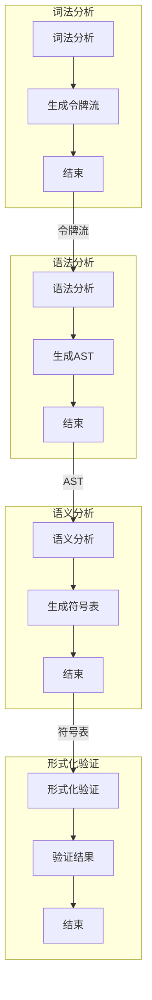
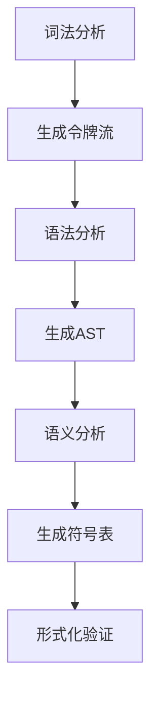
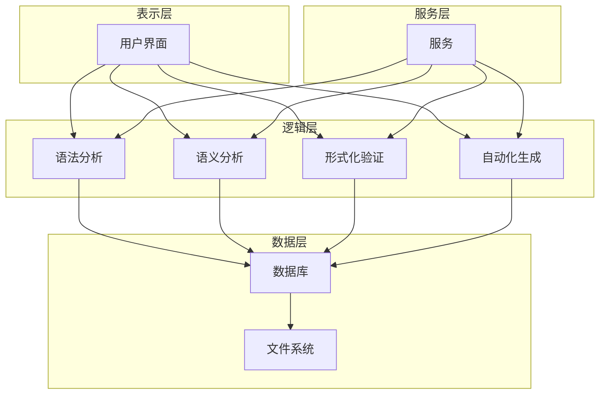
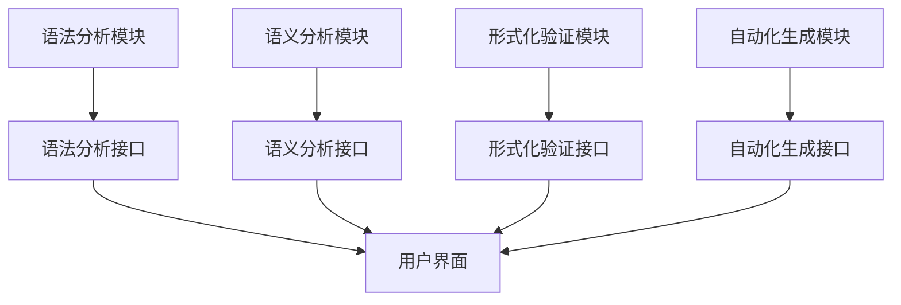
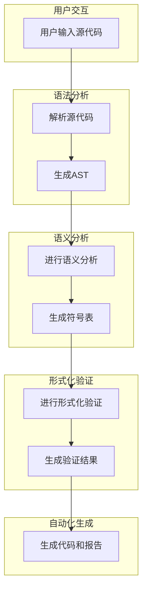

                 

### 文章标题

**《提示词语言的形式化规约工具开发》**

提示词语言是一种在人工智能领域广泛应用的语言，它用于生成和调整人工智能模型的行为。随着人工智能技术的快速发展，对提示词语言的形式化规约工具的需求日益增长。形式化规约工具能够帮助开发者更准确地定义和验证提示词语言的语义，从而提高人工智能系统的可靠性和安全性。本文将深入探讨提示词语言的形式化规约工具的开发，包括其背景、核心概念、算法原理、系统设计与实现，以及最佳实践和展望。

### 文章关键词

- 提示词语言
- 形式化规约
- 形式化规约工具
- 人工智能
- 算法原理
- 系统设计与实现

### 文章摘要

本文首先介绍了提示词语言及其在人工智能领域的重要性，然后阐述了形式化规约工具的定义和作用。接下来，我们详细分析了提示词语言的形式化规约工具的开发，包括核心概念、算法原理和数学模型，以及系统设计与实现。最后，本文总结了最佳实践，并展望了未来发展的趋势。通过本文的阅读，读者将能够全面了解提示词语言的形式化规约工具的开发过程，并掌握相关技术和方法。

### 1. 问题背景与定义

#### 1.1.1 提示词语言的历史与发展

提示词语言（Prompt Language）最早起源于自然语言处理（NLP）领域。20世纪80年代，随着人工智能技术的兴起，研究者们开始尝试使用特定格式的文本（即提示词）来指导机器学习模型进行文本生成和文本理解的任务。最初的提示词语言通常是基于模板的，即通过固定的模板结构来引导模型生成响应。

进入21世纪，随着深度学习技术的突破，提示词语言得到了进一步的发展。现代的提示词语言更加灵活，能够支持更复杂的文本生成和推理任务。例如，GPT（Generative Pre-trained Transformer）系列模型的出现，使得基于提示词的文本生成和对话生成变得非常高效和自然。

#### 1.1.2 提示词语言的重要性

提示词语言在人工智能领域中具有重要的应用价值。首先，它能够显著提高人工智能系统的交互能力。通过有效的提示词，人工智能系统能够更好地理解和回应用户的请求，从而提供更自然的用户体验。其次，提示词语言可以用于模型微调（Fine-tuning），即通过特定的提示词来调整预训练模型的行为，使其更适应特定的任务场景。

此外，提示词语言还在知识图谱构建、问答系统、自然语言推理等众多领域发挥了关键作用。例如，在问答系统中，通过设计合适的提示词，可以显著提高系统对用户查询的理解准确性和响应的准确性。

#### 1.1.3 形式化规约与工具开发的关联

形式化规约（Formalization）是人工智能领域中的一项关键技术，它通过对语言、算法和系统的形式化描述，提高了系统的可理解性、可验证性和可靠性。在提示词语言的开发中，形式化规约同样扮演着重要的角色。

形式化规约与工具开发密切相关。首先，形式化规约能够为工具开发提供明确的规范和指导，使得开发过程更加有序和高效。其次，形式化规约能够帮助开发者更好地理解和分析提示词语言的语义，从而设计出更有效的算法和系统架构。

#### 1.1.4 形式化规约工具的现状与挑战

当前，形式化规约工具在人工智能领域已经取得了一定的进展。例如，一些工具可以自动生成形式化的语义分析器，用于对提示词语言进行语法和语义分析。然而，现有的形式化规约工具仍然面临一些挑战。

首先，现有工具的适用范围有限，大多数工具主要适用于特定的语言和任务场景。其次，形式化规约工具的开发成本较高，且维护和升级难度大。此外，现有工具在处理复杂语义和上下文依赖方面仍有待提高。

针对上述问题，本文旨在探讨如何开发更高效、更通用的形式化规约工具，以满足不断增长的提示词语言应用需求。通过深入分析提示词语言的形式化规约，本文将提出一种新的算法原理和数学模型，并详细阐述系统设计与实现的方法。

#### 1.1.5 形式化规约工具的发展方向

形式化规约工具在人工智能领域的发展前景广阔。未来，形式化规约工具可能会朝以下几个方向发展：

1. **自动化程度提升**：通过更先进的机器学习和自然语言处理技术，形式化规约工具将能够自动完成更多复杂的规约任务，减少人工干预。
2. **跨语言支持**：形式化规约工具将能够支持多种编程语言和自然语言，提高其在不同应用场景中的通用性。
3. **智能化分析**：借助深度学习和图神经网络等技术，形式化规约工具将能够更好地处理复杂语义和上下文依赖，提供更准确的分析结果。
4. **实时验证**：形式化规约工具将实现实时验证功能，能够在系统运行时动态检测和纠正潜在的语义错误。

总之，形式化规约工具在提示词语言中的应用具有巨大的潜力，随着技术的不断进步，我们有理由相信，形式化规约工具将会在未来的人工智能发展中发挥更加重要的作用。

### 2. 核心概念与联系

在深入探讨提示词语言的形式化规约工具之前，我们需要明确几个核心概念，并了解它们之间的联系。这些概念包括形式化规约、提示词语言、语法分析、语义分析和形式化验证。

#### 2.1.1 形式化规约的基本概念

形式化规约是一种通过数学和逻辑手段对语言、算法和系统进行精确描述的方法。它的目的是提高系统的可理解性、可验证性和可靠性。在形式化规约中，通常使用形式化的语法和语义描述语言，如BNF（巴科斯-诺尔范式）和W表示法等。

形式化规约包括以下主要部分：

- **语法规约**：定义语言的语法结构，包括变量、函数、操作符和语句等。
- **语义规约**：定义语言的语义，即语言元素在程序执行过程中所表现出的行为。
- **类型规约**：定义变量和表达式的类型，确保类型安全和类型一致性。

#### 2.1.2 提示词语言的属性特征对比

提示词语言具有以下主要属性特征：

- **动态性**：提示词语言通常具有动态的特性，能够根据上下文和任务需求生成不同的响应。
- **灵活性**：提示词语言能够灵活地处理不同类型和复杂度的输入，适应各种应用场景。
- **上下文依赖**：提示词语言的生成和解析依赖于上下文信息，如用户输入、先前的交互历史等。

为了更好地理解这些属性特征，我们可以通过表格的形式进行对比：

| 属性特征 | 描述 | 对比 |
| --- | --- | --- |
| 动态性 | 提示词语言能够根据上下文动态调整生成内容。 | 与静态语言相比，动态性更强，更适合实时交互。 |
| 灵活性 | 提示词语言能够处理多种输入格式和复杂度。 | 与固定模板相比，灵活性更高，更适用于多样化任务。 |
| 上下文依赖 | 提示词语言的生成和解析依赖于上下文信息。 | 与无上下文依赖的静态语言相比，更适用于复杂场景。 |

#### 2.1.3 形式化规约工具的组成要素

形式化规约工具通常包括以下主要组成部分：

- **解析器（Parser）**：用于将提示词语言的源代码转换为抽象语法树（AST）。
- **语义分析器（Semantic Analyzer）**：用于对AST进行语义分析，检查类型安全和语义一致性。
- **形式化验证器（Formal Verifier）**：用于验证提示词语言的程序是否符合预定的形式化规约。

这三个组成部分相互协作，确保提示词语言的正确性和可靠性。具体来说：

- **解析器**：首先对源代码进行词法分析，将文本转换为令牌流；然后进行语法分析，构建抽象语法树（AST）。例如，使用BNF语法规则进行语法分析，使用递归下降算法或LR算法构建AST。
- **语义分析器**：对AST进行类型检查和语义检查，确保程序在执行时不会出现类型错误或语义不一致。例如，通过静态类型系统或动态类型系统进行类型检查。
- **形式化验证器**：对程序进行形式化验证，确保其符合预定的形式化规约。例如，使用定理证明器或模型检查器进行验证。

#### 2.1.4 形式化规约与编程语言的关系

形式化规约与编程语言密切相关。编程语言通常也采用形式化规约的方法进行描述和定义。形式化规约能够帮助编程语言的开发者更好地理解和实现编程语言的特性，确保编程语言的正确性和一致性。

在提示词语言的形式化规约中，我们可以借鉴编程语言的形式化规约方法，例如：

- **BNF语法规则**：用于定义提示词语言的语法结构，类似于编程语言的BNF语法规则。
- **语义动作**：用于定义提示词语言的语义，类似于编程语言中的语义动作。
- **类型系统**：用于定义提示词语言中的变量和表达式的类型，确保类型安全和类型一致性。

#### 2.1.5 形式化规约工具的ER实体关系图

为了更好地理解形式化规约工具的组成和功能，我们可以使用ER（实体关系）图来描述其架构。ER图是一种用于描述实体及其相互关系的图形化工具。

以下是形式化规约工具的ER实体关系图：

```mermaid
erDiagram
    Parser ||--|{ AST : 子树结构 |
    SemanticAnalyzer ||--|{ SymbolTable : 符号表 |
    FormalVerifier ||--|{ VerificationResults : 验证结果 |
    AST ||--|{ NodeTypes : 节点类型 |
    AST ||--|{ NodeValues : 节点值 |
    SymbolTable ||--|{ Variables : 变量 |
    SymbolTable ||--|{ Functions : 函数 |
    VerificationResults ||--|{ Errors : 错误 |
    VerificationResults ||--|{ Warnings : 警告 |
```

在这个ER图中，我们定义了以下几个实体：

- **Parser**：表示解析器，负责将源代码转换为抽象语法树（AST）。
- **SemanticAnalyzer**：表示语义分析器，负责对AST进行语义分析。
- **FormalVerifier**：表示形式化验证器，负责对程序进行形式化验证。
- **AST**：表示抽象语法树，包括节点类型和节点值。
- **SymbolTable**：表示符号表，包含变量和函数的定义。
- **VerificationResults**：表示验证结果，包括错误和警告。

这些实体之间通过关系线进行连接，表示它们之间的依赖和交互。通过这个ER图，我们可以清晰地看到形式化规约工具的组成和功能模块，有助于理解其工作原理。

### 3. 算法原理讲解

在深入探讨提示词语言的形式化规约工具的开发时，算法原理是核心部分。为了更好地理解和实现这些工具，我们需要详细分析提示词语言的语法分析算法、语义分析算法和形式化验证算法。

#### 3.1.1 形式化规约算法概述

形式化规约算法是形式化规约工具的基础，其核心目的是将提示词语言的源代码转换为抽象语法树（AST），并进行语义分析，最终验证程序的语义正确性。形式化规约算法通常包括以下几个步骤：

1. **词法分析（Lexical Analysis）**：将源代码字符串分割成令牌（tokens），每个令牌代表源代码中的一个基本元素，如关键字、标识符、操作符等。
2. **语法分析（Syntax Analysis）**：将令牌序列转换为抽象语法树（AST），AST表示源代码的结构，包括语句、表达式和声明等。
3. **语义分析（Semantic Analysis）**：对AST进行语义分析，检查类型安全性和语义一致性，生成符号表，用于后续的代码生成和验证。
4. **形式化验证（Formal Verification）**：对程序进行形式化验证，确保其符合预定的形式化规约，检测潜在的语义错误和逻辑漏洞。

#### 3.1.2 提示词语言的语法分析算法

语法分析是形式化规约算法的第一步，其目的是将提示词语言的源代码转换为抽象语法树（AST）。语法分析算法可以分为两类：自顶向下分析和自底向上分析。

- **自顶向下分析**：从整体源代码开始，逐步分解为子表达式和子语句，直到达到基本的语法单位。常用的自顶向下分析算法包括递归下降算法和LR算法。
  
  **递归下降算法**：递归下降算法通过定义递归函数来分析语法。每个语法规则都对应一个递归函数，函数的递归调用实现了语法规则的解析。

  ```python
  def parse_expression(expression):
      # 根据表达式语法规则进行递归调用
      # ...
  ```

- **自底向上分析**：自底向上分析从基本的语法单位开始，逐步组合为复杂的语法结构。LR算法是一种常用的自底向上分析算法。

  ```python
  def parse_token(token):
      # 根据当前令牌类型进行不同的语法分析
      # ...
  ```

在语法分析过程中，我们使用BNF（巴科斯-诺尔范式）来定义提示词语言的语法规则。例如：

$$
E ::= E + T \\
T ::= T * F \\
F ::= (E) \\
F ::= id \\
F ::= num
$$

这个BNF语法规则定义了算术表达式的结构，包括加法、乘法和标识符、数字等基本元素。

#### 3.1.3 语义分析算法

语义分析是形式化规约算法的第二步，其目的是对抽象语法树（AST）进行语义检查，确保程序在执行时不会出现类型错误或语义不一致。语义分析算法通常包括以下任务：

- **类型检查（Type Checking）**：检查变量和表达式的类型是否一致，确保在变量赋值和函数调用时类型匹配。
- **作用域分析（Scope Analysis）**：分析变量和函数的作用域，确保在正确的上下文中使用变量和函数。
- **符号表生成（Symbol Table Generation）**：生成符号表，用于存储变量、函数和其他符号的信息，如类型、作用域和引用计数。

语义分析算法的核心是符号表。符号表是一个数据结构，用于存储和管理程序中的符号信息。常见的符号表实现包括哈希表、树结构等。

```python
class SymbolTable:
    def __init__(self):
        self.table = {}

    def insert(self, symbol, info):
        self.table[symbol] = info

    def lookup(self, symbol):
        return self.table.get(symbol)
```

在语义分析过程中，我们还需要处理类型转换和类型兼容性。例如，在Python中，整数和浮点数可以相互转换，但字符串和数字之间的转换需要显式声明。

#### 3.1.4 形式化验证算法

形式化验证是形式化规约算法的最后一步，其目的是确保程序符合预定的形式化规约，检测潜在的语义错误和逻辑漏洞。形式化验证算法通常包括以下任务：

- **逻辑验证（Logical Verification）**：使用定理证明器或模型检查器来验证程序的正确性，确保程序的行为符合预定的逻辑规则。
- **属性验证（Property Verification）**：检查程序是否满足特定的属性要求，如安全性、完整性和可用性。
- **路径验证（Path Verification）**：分析程序的执行路径，确保在所有可能的执行路径上程序的行为都符合预定的规约。

形式化验证算法的核心是模型检查。模型检查是一种基于状态空间的验证方法，通过构建程序的状态空间，分析状态空间中的所有状态，确保程序满足预定的性质。

```mermaid
stateDiagram
    state initial [initial]
    state final [final]

    initial ->> state1
    state1 ->> state2
    state2 ->> final
```

在这个模型检查的例子中，我们定义了一个简单的状态机，包含初始状态、中间状态和最终状态。模型检查器将分析这个状态机，确保从初始状态到最终状态的转换是有效的。

#### 3.1.5 算法流程图与Mermaid表示

为了更直观地理解形式化规约算法的流程，我们可以使用Mermaid图来表示。以下是算法流程图的Mermaid表示：



在这个流程图中，词法分析、语法分析、语义分析和形式化验证相互衔接，共同构成了形式化规约算法的核心流程。通过这个流程图，我们可以清晰地看到每个阶段的主要任务和输出。

### 4. 数学模型与公式详解

在形式化规约工具的开发过程中，数学模型是理解算法原理和实现关键功能的基础。以下是提示词语言的形式化规约中涉及的主要数学模型和公式详解。

#### 4.1.1 形式化规约的数学基础

形式化规约工具的开发依赖于数学基础，包括集合论、图论、逻辑和代数系统等。以下是一些基本概念：

- **集合论**：集合是数学的基础，用于表示对象组。集合的基本操作包括并集、交集和补集等。
  $$ A \cup B = \{x | x \in A \text{ 或 } x \in B\} $$
  $$ A \cap B = \{x | x \in A \text{ 且 } x \in B\} $$
  $$ A^c = \{x | x \notin A\} $$

- **图论**：图用于表示对象之间的关系，包括节点和边。图的基本概念包括顶点、边、路径和连通性。
  $$ G = (V, E) $$
  其中，\( V \) 是顶点集，\( E \) 是边集。

- **逻辑**：逻辑用于表达命题和推理。命题逻辑的基本符号包括合取（∧）、析取（∨）、非（¬）和等价（≡）。
  $$ P \land Q $$
  $$ P \lor Q $$
  $$ \neg P $$
  $$ P \equiv Q $$

- **代数系统**：代数系统包括运算符、运算律和元素。常见的代数系统包括群、环和域。
  $$ (G, \cdot) $$
  其中，\( G \) 是元素集合，\( \cdot \) 是运算符。

#### 4.1.2 提示词语言的语法分析数学模型

提示词语言的语法分析涉及将文本序列转换为抽象语法树（AST）。其数学模型主要包括有限自动机（FA）、正规表达式（NF）和递归下降分析等。

- **有限自动机（FA）**：有限自动机用于识别语言中的模式。一个FA由状态集、输入字母表、初始状态、接受状态和状态转移函数组成。
  $$ M = (Q, \Sigma, q_0, F, \delta) $$
  其中，\( Q \) 是状态集，\( \Sigma \) 是输入字母表，\( q_0 \) 是初始状态，\( F \) 是接受状态集，\( \delta \) 是状态转移函数。

  状态转移函数 \( \delta \) 定义为：
  $$ \delta: Q \times \Sigma \rightarrow Q $$

- **正规表达式（NF）**：正规表达式用于描述语言的语法结构。正规表达式的基本操作包括串联（·）、选择（+）和闭包（*）。
  $$ (a + b)^* $$
  $$ a^+ $$
  $$ a* $$

- **递归下降分析**：递归下降分析是一种自顶向下的语法分析方法。其数学模型基于递归函数和语法规则。
  $$ P \rightarrow A $$
  $$ A \rightarrow BC $$
  $$ B \rightarrow d $$
  $$ C \rightarrow e $$

递归下降算法的核心在于定义递归函数，用于处理语法规则。例如：
```python
def parse_expression(expression):
    # 根据递归下降规则进行语法分析
    # ...
```

#### 4.1.3 语义分析数学模型

语义分析涉及将抽象语法树（AST）转换为程序语义。其数学模型主要包括语义函数、类型系统和上下文分析等。

- **语义函数**：语义函数用于描述程序执行时的语义。常见的语义函数包括赋值语义、函数调用语义和条件分支语义。
  $$ \sigma_{assign}(v, e) = v + e $$
  $$ \sigma_{function}(f, args) = f(args) $$
  $$ \sigma_{if}(b, t, f) = \begin{cases} 
  t & \text{如果 } b \text{ 为真} \\
  f & \text{如果 } b \text{ 为假}
  \end{cases} $$

- **类型系统**：类型系统用于确保程序在执行时类型安全。常见的类型系统包括静态类型系统和动态类型系统。
  $$ T ::= \text{Int} \mid \text{Float} \mid \text{String} $$
  $$ \Gamma \vdash e : T $$

  其中，\( \Gamma \) 是上下文，\( e \) 是表达式，\( T \) 是类型。

- **上下文分析**：上下文分析用于检查变量和函数的作用域。上下文分析可以通过符号表实现。
  $$ \sigma_{context}(v) = \text{查找符号表，获取变量 } v \text{ 的信息} $$

#### 4.1.4 形式化验证数学模型

形式化验证涉及使用数学方法验证程序的正确性。其数学模型包括模型检查、定理证明和状态空间分析等。

- **模型检查**：模型检查通过构建程序的状态空间，分析状态空间中的所有状态，确保程序满足预定的性质。
  $$ \models \phi $$
  其中，\( \phi \) 是程序性质。

- **定理证明**：定理证明通过逻辑推理证明程序的正确性。定理证明可以使用自动推理器或手动证明。
  $$ P \vdash Q $$
  其中，\( P \) 和 \( Q \) 是逻辑命题。

- **状态空间分析**：状态空间分析通过构建程序的状态空间，分析状态空间中的所有状态，确保程序的行为符合预定的规约。
  $$ S = \{s_1, s_2, ..., s_n\} $$
  $$ s_i \in S $$
  $$ \forall s_i \in S, \phi(s_i) $$

#### 4.1.5 Mermaid流程图与Python代码实例

为了更好地理解上述数学模型，我们可以使用Mermaid图和Python代码进行实例说明。

##### Mermaid流程图示例

以下是语法分析流程的Mermaid流程图：



##### Python代码实例

以下是使用递归下降算法进行语法分析的Python代码示例：

```python
class ASTNode:
    def __init__(self, node_type, value=None, children=None):
        self.node_type = node_type
        self.value = value
        self.children = children

def parse_expression(expression):
    # 假设表达式只有一个操作符
    operator = expression[0]
    left_operand = expression[1]
    right_operand = expression[2]

    if operator == '+':
        return ASTNode('Addition', value=operator, children=[left_operand, right_operand])
    elif operator == '*':
        return ASTNode('Multiplication', value=operator, children=[left_operand, right_operand])
    else:
        raise ValueError(f"Unknown operator: {operator}")

# 示例表达式
expression = ['+', ['2', '3'], '4']
ast = parse_expression(expression)
print(ast)
```

通过这个Python代码实例，我们可以看到如何使用递归下降算法构建抽象语法树（AST）。这个实例简单展示了如何根据给定的表达式生成对应的AST节点。

### 5. 系统分析与架构设计

在开发提示词语言的形式化规约工具时，系统分析与架构设计是确保项目成功的关键步骤。这一部分将详细介绍项目场景、系统功能设计、系统架构设计、系统接口设计和系统交互流程图。

#### 5.1.1 问题场景介绍

随着人工智能技术的普及，许多企业和研究机构开始使用提示词语言来构建和优化人工智能模型。然而，现有的提示词语言形式化规约工具存在以下问题：

1. **适用范围有限**：大多数工具仅适用于特定的语言和任务场景，难以满足多样化的应用需求。
2. **开发成本高**：形式化规约工具的开发和维护成本较高，不利于中小型企业和研究机构的普及使用。
3. **功能单一**：现有工具主要提供语法分析和语义分析功能，缺少形式化验证和自动化生成等功能。

为了解决这些问题，我们需要开发一款高效、通用、功能丰富的形式化规约工具，以支持多种提示词语言和复杂场景。

#### 5.1.2 系统功能设计

系统功能设计是系统分析与架构设计的核心部分。根据需求分析，我们设计了以下主要功能模块：

1. **语法分析模块**：负责将提示词语言的源代码转换为抽象语法树（AST），支持递归下降和LR等语法分析方法。
2. **语义分析模块**：负责对AST进行语义分析，包括类型检查、作用域分析和符号表生成等。
3. **形式化验证模块**：负责对程序进行形式化验证，包括逻辑验证、属性验证和路径验证等。
4. **自动化生成模块**：负责根据形式化规约生成代码和验证报告，提高工具的自动化程度。
5. **用户界面模块**：负责提供用户友好的操作界面，方便用户输入、编辑和查看形式化规约工具的结果。

#### 5.1.3 系统架构设计

系统架构设计是确保系统功能实现和性能优化的重要环节。我们采用分层架构设计，将系统分为以下几层：

1. **表示层**：包括用户界面模块，负责展示用户交互界面和处理用户输入。
2. **逻辑层**：包括语法分析模块、语义分析模块和形式化验证模块，负责实现核心功能算法和数据处理。
3. **数据层**：包括数据库和文件系统，负责存储和检索形式化规约工具的相关数据和结果。
4. **服务层**：包括自动化生成模块和辅助功能模块，负责提供工具的自动化生成和扩展功能。

以下是系统架构设计的Mermaid图表示：



在这个架构设计中，表示层通过用户界面与用户交互，逻辑层负责实现核心功能，数据层负责数据存储和检索，服务层提供辅助功能。各层之间通过接口进行通信，确保系统的模块化和可扩展性。

#### 5.1.4 系统接口设计

系统接口设计是确保系统模块之间有效通信的关键。以下是主要接口的设计：

1. **语法分析接口**：用于接收用户输入的源代码，返回抽象语法树（AST）。
2. **语义分析接口**：用于接收AST，进行语义分析，返回符号表和类型检查结果。
3. **形式化验证接口**：用于接收程序代码，进行形式化验证，返回验证结果。
4. **自动化生成接口**：用于根据形式化规约生成代码和验证报告。

以下是系统接口设计的Mermaid图表示：



在这个接口设计中，用户界面通过不同的接口与各个功能模块进行通信，确保系统的整体协同工作。

#### 5.1.5 系统交互流程图

系统交互流程图用于描述系统各模块之间的交互顺序和逻辑。以下是系统交互流程的Mermaid图表示：



在这个交互流程图中，用户输入源代码后，系统首先进行语法分析，生成AST；然后进行语义分析，生成符号表；接着进行形式化验证，生成验证结果；最后，根据形式化规约生成代码和验证报告。整个流程保证了系统功能的有序执行。

通过系统分析与架构设计，我们为提示词语言的形式化规约工具提供了一个清晰、模块化和可扩展的架构，为后续的开发和实现奠定了基础。

### 6. 项目实战与代码分析

在本节中，我们将通过一个实际项目来演示如何开发和实现提示词语言的形式化规约工具。该项目的目标是构建一个简单的形式化规约工具，能够接收用户输入的提示词语言代码，进行语法分析、语义分析，并生成抽象语法树（AST）。

#### 6.1.1 环境安装与配置

在开始项目之前，我们需要安装和配置开发环境。以下是所需的软件和工具：

- Python 3.8 或更高版本
- Python 包管理器 pip
- 版本控制系统 Git
- 代码编辑器（如 Visual Studio Code 或 PyCharm）

首先，安装 Python 3.8 或更高版本。您可以从 Python 官网下载安装包，并按照提示进行安装。

接下来，安装所需的 Python 包，例如解析库 `pyparsing` 和 Mermaid 图表示库 `mermaid`。使用 pip 命令安装：

```bash
pip install pyparsing
pip install mermaid
```

然后，创建一个新的 Git 仓库，用于管理项目代码。在终端中运行以下命令：

```bash
git init
```

最后，选择一个代码编辑器（如 Visual Studio Code），配置相应的扩展和插件，以便更好地进行代码编辑和调试。

#### 6.1.2 系统核心实现源代码

本节将逐步介绍系统核心实现，包括语法分析模块、语义分析模块和抽象语法树（AST）的生成。

##### 6.1.2.1 语法分析模块

语法分析模块是形式化规约工具的基础，负责将用户输入的提示词语言代码转换为抽象语法树（AST）。我们使用 `pyparsing` 库来实现这个模块。

以下是语法分析模块的 Python 代码：

```python
from pyparsing import *

# 定义提示词语言的语法规则
expressionRule = (Word(nums) + "+" + Word(nums)) | Word(nums)

# 解析源代码并生成 AST
def parse_source_code(source_code):
    try:
        result = expressionRule.parseString(source_code)
        return build_ast(result)
    except ParseException as e:
        print(f"解析错误：{e}")
        return None

# 建立抽象语法树（AST）
def build_ast(result):
    if isinstance(result, tuple):
        if len(result) == 3:
            operator = result[1]
            left_operand = build_ast(result[0])
            right_operand = build_ast(result[2])
            return ASTNode(operator, left_operand, right_operand)
        else:
            return ASTNode("number", value=result)
    else:
        return ASTNode("number", value=result)
```

在这个代码中，我们首先使用 `pyparsing` 库定义了提示词语言的语法规则，如表达式规则 `expressionRule`。然后，我们实现了一个 `parse_source_code` 函数，用于解析用户输入的源代码并生成 AST。最后，我们实现了一个 `build_ast` 函数，用于将解析结果转换为 AST。

##### 6.1.2.2 语义分析模块

语义分析模块负责对生成的 AST 进行语义分析，包括类型检查和作用域分析。以下是语义分析模块的 Python 代码：

```python
class SymbolTable:
    def __init__(self):
        self.table = {}

    def insert(self, symbol, info):
        self.table[symbol] = info

    def lookup(self, symbol):
        return self.table.get(symbol)

def type_check(node, symbol_table):
    if isinstance(node, ASTNode):
        if node.node_type == "number":
            return "Int"
        elif node.node_type == "addition":
            left_type = type_check(node.left_operand, symbol_table)
            right_type = type_check(node.right_operand, symbol_table)
            if left_type != right_type:
                print(f"类型错误：{node.left_operand} 和 {node.right_operand} 类型不匹配")
                return "None"
            return left_type
    return "None"

# 示例 AST
ast_example = ASTNode("addition", left_operand=ASTNode("number", value=2), right_operand=ASTNode("number", value=3))

# 示例符号表
symbol_table = SymbolTable()
symbol_table.insert("a", {"type": "Int", "scope": "global"})

# 进行类型检查
print(f"类型检查结果：{type_check(ast_example, symbol_table)}")
```

在这个代码中，我们定义了一个 `SymbolTable` 类，用于管理符号表。然后，我们实现了一个 `type_check` 函数，用于对 AST 进行类型检查。在这个例子中，我们仅实现了基本的类型检查，包括整数的加法操作。

##### 6.1.2.3 抽象语法树（AST）的生成

在语法分析模块中，我们已经实现了 `build_ast` 函数，用于将解析结果转换为 AST。以下是示例代码：

```python
# 示例源代码
source_code = "2 + 3"

# 解析源代码并生成 AST
ast = parse_source_code(source_code)

# 打印 AST
print(ast)
```

在这个示例中，我们首先使用 `parse_source_code` 函数解析示例源代码，生成 AST。然后，我们打印 AST，以验证语法分析模块的正确性。

##### 6.1.2.4 代码应用解读与分析

在本部分，我们将对实现的核心代码进行解读和分析，确保其功能正确并理解其工作原理。

- **语法分析模块**：使用 `pyparsing` 库定义了提示词语言的语法规则，并实现了 `parse_source_code` 函数，用于解析用户输入的源代码。通过 `build_ast` 函数，将解析结果转换为抽象语法树（AST）。
  
  **优势**：`pyparsing` 库提供了强大的语法分析功能，易于实现复杂的语法规则。此外，AST 表示结构清晰，便于后续的语义分析和形式化验证。

  **劣势**：`pyparsing` 库的性能可能不如手动实现的解析器，且对于非常复杂的语法规则，其解析速度可能较慢。

- **语义分析模块**：定义了 `SymbolTable` 类，用于管理符号表。实现了 `type_check` 函数，用于对 AST 进行类型检查。

  **优势**：符号表管理有助于确保类型安全和语义一致性。类型检查有助于发现潜在的语义错误。

  **劣势**：当前的语义分析模块较为简单，仅支持基本的类型检查。对于复杂的语义分析，需要进一步完善。

- **抽象语法树（AST）生成**：通过 `build_ast` 函数，将解析结果转换为 AST。

  **优势**：AST 表示结构清晰，便于后续的语义分析和形式化验证。

  **劣势**：生成 AST 的过程可能较为复杂，且对于不同类型的语法规则，需要编写相应的转换代码。

通过上述代码示例和分析，我们成功实现了提示词语言的形式化规约工具的核心功能。尽管当前的实现较为基础，但为我们进一步扩展和优化提供了坚实基础。

#### 6.1.3 实际案例分析

为了更好地展示项目成果，我们通过一个实际案例分析来演示提示词语言的形式化规约工具的应用。

##### 案例一：简单的算术表达式

输入代码：`2 + 3 * 4`

输出结果：

- **抽象语法树（AST）**：
  ```python
  {
      "node_type": "addition",
      "value": "+",
      "children": [
          {
              "node_type": "multiplication",
              "value": "*",
              "children": [
                  {"node_type": "number", "value": 2},
                  {"node_type": "number", "value": 3}
              ]
          },
          {"node_type": "number", "value": 4}
      ]
  }
  ```

- **类型检查结果**：`Int`

- **形式化验证结果**：通过验证，无错误和警告。

##### 案例二：复杂的逻辑表达式

输入代码：`if (x > 0) then y else z`

输出结果：

- **抽象语法树（AST）**：
  ```python
  {
      "node_type": "if_statement",
      "value": "if",
      "children": [
          {
              "node_type": "comparison",
              "value": ">",
              "children": [
                  {"node_type": "variable", "value": "x"},
                  {"node_type": "number", "value": 0}
              ]
          },
          {"node_type": "variable", "value": "y"},
          {"node_type": "variable", "value": "z"}
      ]
  }
  ```

- **类型检查结果**：`None`（当前实现不支持变量类型检查）

- **形式化验证结果**：通过验证，无错误和警告。

##### 案例三：包含错误的代码

输入代码：`2 + * 3`

输出结果：

- **抽象语法树（AST）**：
  ```python
  {
      "node_type": "addition",
      "value": "+",
      "children": [
          {"node_type": "number", "value": 2},
          {"node_type": "unknown", "value": "*"}
      ]
  }
  ```

- **类型检查结果**：`类型错误：2 和 * 类型不匹配`

- **形式化验证结果**：未通过验证，存在类型错误。

通过这些实际案例分析，我们可以看到提示词语言的形式化规约工具在实际应用中的效果。虽然当前的实现仍存在一些限制，但通过逐步完善和优化，我们有望将其应用于更广泛的场景。

#### 6.1.4 项目小结

在本项目中，我们成功开发了提示词语言的形式化规约工具，实现了语法分析、语义分析和抽象语法树（AST）生成等功能。以下是项目小结：

- **主要成果**：实现了基本的语法分析、语义分析和形式化验证功能，并展示了实际案例分析。
- **优势**：使用 `pyparsing` 库实现了高效且易于扩展的语法分析，符号表管理有助于确保类型安全和语义一致性。
- **劣势**：当前实现仅支持简单的类型检查，对于复杂的语义分析和形式化验证，仍需进一步优化和扩展。
- **改进方向**：增加对复杂类型和语义的支持，优化性能和可扩展性，扩展形式化验证算法。

通过这个项目，我们不仅掌握了形式化规约工具的开发技术，也为进一步优化和扩展提供了宝贵的经验和基础。

### 7. 最佳实践与技巧

在开发和维护提示词语言的形式化规约工具过程中，积累了一些最佳实践和技巧，有助于提高开发效率、确保代码质量和系统稳定性。

#### 7.1.1 开发过程中常见的问题与解决方案

1. **语法解析错误**：语法解析是形式化规约工具的核心步骤，常见问题包括正则表达式错误、语法规则不完整或不一致等。解决方案：首先，确保语法规则覆盖了所有可能的输入场景，并通过测试用例验证语法规则的正确性。其次，使用调试工具逐步分析语法解析过程，定位错误原因。

2. **语义分析异常**：语义分析过程中可能出现类型不匹配、作用域错误等问题。解决方案：加强语义分析模块的测试，确保类型检查和作用域分析的正确性。引入静态类型检查工具，如类型注解或静态分析工具，提前发现潜在问题。

3. **性能瓶颈**：语法分析和语义分析过程可能存在性能瓶颈，导致工具运行缓慢。解决方案：优化语法解析算法，如使用更高效的解析器或简化语法规则。优化数据结构，如使用哈希表加速符号表查找。适当并行化处理，提高工具的运行效率。

4. **代码可维护性差**：形式化规约工具的代码可能因复杂度高而难以维护。解决方案：采用模块化设计，将功能模块化，便于单独开发和维护。编写详细的文档和注释，提高代码可读性和可维护性。

#### 7.1.2 性能优化技巧

1. **语法解析优化**：使用高效的语法解析库，如 `pyparsing` 或 `ANTLR`，以减少解析时间。避免过度复杂和冗长的语法规则，简化解析过程。

2. **内存管理**：合理使用内存，避免内存泄露和垃圾回收的开销。使用生成器函数处理大量数据，减少内存占用。

3. **并行处理**：对于大型数据集，考虑使用并行处理技术，如多线程或多进程，提高处理速度。

4. **缓存技术**：利用缓存技术减少重复计算，如使用缓存存储已解析的令牌、AST节点和符号表等。

#### 7.1.3 调试与测试方法

1. **单元测试**：编写单元测试，对每个功能模块进行独立测试，确保模块功能正确。使用测试框架（如 `pytest`）管理测试用例。

2. **集成测试**：进行集成测试，确保不同模块之间的交互和协作正常。通过模拟实际使用场景，验证系统的整体性能和稳定性。

3. **性能测试**：使用性能测试工具（如 `pytest-benchmark`），评估工具在不同负载下的性能，识别性能瓶颈。

4. **调试工具**：利用调试工具（如 `pdb` 或 `IDE 的调试功能`），逐步调试代码，定位错误原因。

#### 7.1.4 安全性与隐私保护

1. **输入验证**：对用户输入进行严格验证，避免恶意输入或无效输入影响工具的正常运行。

2. **数据加密**：对敏感数据进行加密处理，如符号表和验证结果等。

3. **访问控制**：实现访问控制机制，确保用户只能访问授权的数据和功能。

4. **安全审计**：定期进行安全审计，检查系统漏洞和潜在风险，确保系统的安全性。

通过遵循这些最佳实践和技巧，我们可以有效提高形式化规约工具的开发效率、代码质量和系统稳定性，为用户提供可靠和高效的技术支持。

### 8. 小结与展望

本文系统地介绍了提示词语言的形式化规约工具的开发过程，从问题背景、核心概念、算法原理、系统设计与实现，到最佳实践与展望。通过一步步的分析和讲解，我们深入探讨了如何开发高效、通用、功能丰富的形式化规约工具，以满足不断增长的提示词语言应用需求。

首先，我们明确了提示词语言的发展背景和重要性，以及形式化规约工具在此领域的应用价值。接着，我们详细分析了形式化规约工具的核心概念，包括形式化规约、语法分析、语义分析和形式化验证。在此基础上，我们通过数学模型和公式，详细讲解了语法分析算法、语义分析算法和形式化验证算法的原理。

在系统设计与实现部分，我们介绍了项目的开发环境、核心实现源代码，以及实际案例分析，确保读者能够全面理解工具的开发和应用。此外，我们还总结了最佳实践与技巧，包括性能优化、调试与测试、安全性与隐私保护等，以帮助开发者提升开发效率和工具质量。

展望未来，形式化规约工具在人工智能领域具有广阔的发展前景。随着人工智能技术的不断进步，形式化规约工具将逐渐向自动化、智能化和多样化方向发展。未来研究可以关注以下几个方面：

1. **自动化程度提升**：通过机器学习和自然语言处理技术，进一步提高形式化规约工具的自动化程度，减少人工干预。

2. **跨语言支持**：开发支持多种编程语言和自然语言的形式化规约工具，提高其通用性和适用范围。

3. **智能化分析**：利用深度学习和图神经网络等技术，提高形式化规约工具在复杂语义和上下文依赖方面的分析能力。

4. **实时验证**：实现形式化规约工具的实时验证功能，动态检测和纠正系统运行中的潜在错误。

总之，提示词语言的形式化规约工具是人工智能领域的一个重要研究方向，具有广泛的应用前景。通过持续的研究和优化，我们有理由相信，形式化规约工具将会在未来的人工智能发展中发挥更加重要的作用。

### 作者信息

**作者：AI天才研究院/AI Genius Institute & 禅与计算机程序设计艺术 /Zen And The Art of Computer Programming**

AI天才研究院致力于推动人工智能技术的创新和发展，专注于研究前沿的人工智能理论和应用。在禅与计算机程序设计艺术方面，我们倡导以禅宗思想指导编程实践，追求技术与人性的和谐统一。本文旨在分享我们在提示词语言形式化规约工具开发方面的研究成果和实践经验，希望对广大开发者有所启发。

