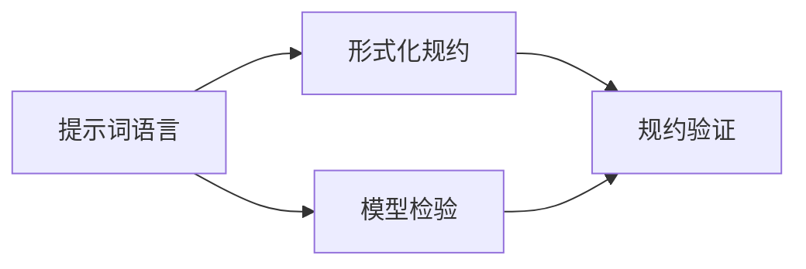
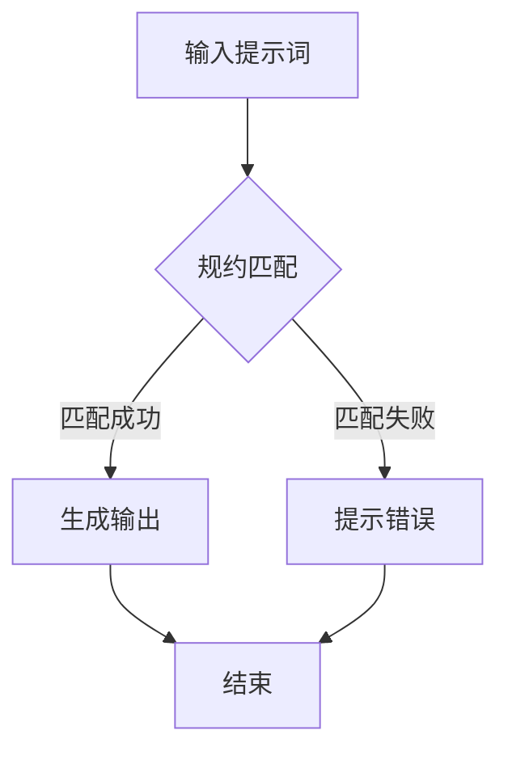
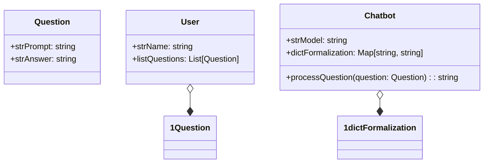
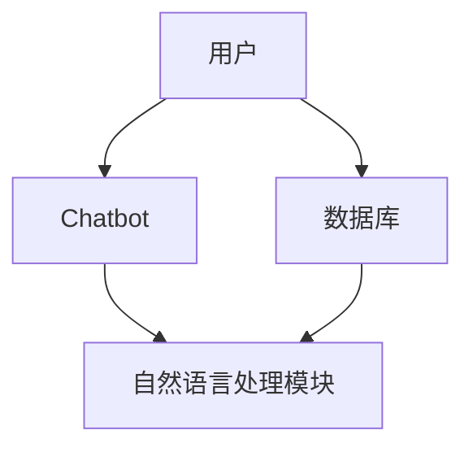
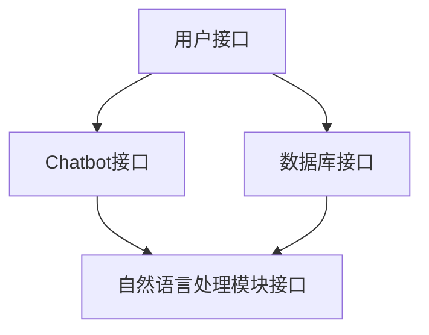
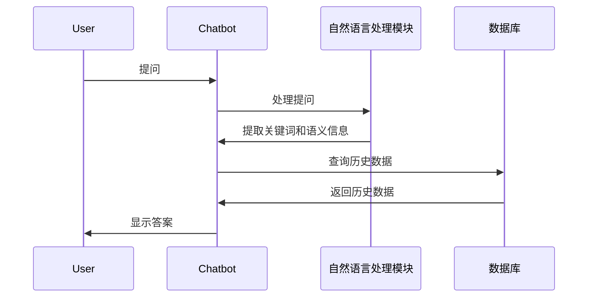

                 

# 提示词语言的形式化规约模型检验

关键词：提示词语言、形式化规约、模型检验、自然语言处理、算法原理

摘要：随着人工智能技术的快速发展，提示词语言在自然语言处理领域扮演着越来越重要的角色。本文深入探讨了提示词语言的形式化规约模型检验，通过理论分析、算法原理讲解和系统架构设计，旨在为开发者提供一种有效的工具和方法，以提升智能系统的性能和可靠性。

### 目录大纲

#### 第一部分：背景介绍

### 第1章：问题背景与核心概念

#### 1.1 问题描述

- **问题背景**：
  - 人工智能技术快速发展，语言模型作为其重要分支，应用广泛。
  - 提示词语言在多种场景下至关重要，但形式化规约与模型检验尚未完善。

- **问题解决**：
  - 探讨提示词语言的形式化规约。
  - 提出并验证模型检验方法。

- **边界与外延**：
  - 研究限定于自然语言处理领域。
  - 覆盖提示词语言的多种应用场景。

- **概念结构与核心要素**：

#### 1.2 核心概念与联系

- **形式化规约**：
  - 原理：对提示词语言进行形式化描述。
  - 特点：准确、明确、可验证。

- **模型检验**：
  - 原理：验证形式化规约的正确性。
  - 特点：自动化、高效、可靠。

- **形式化规约与模型检验的关系**：
  - 对比表格：

  | 特点 | 形式化规约 | 模型检验 |
  | --- | --- | --- |
  | 描述对象 | 提示词语言 | 形式化描述 |
  | 目的 | 描述与规范 | 验证正确性 |
  | 方法 | 形式化语言 | 形式化验证 |
  | 关联性 | 直接关联 | 依赖规约 |

#### 1.3 ER实体关系图架构



### 第二部分：算法原理讲解

### 第2章：算法原理与数学模型

#### 2.1 算法mermaid流程图



#### 2.2 Python源代码

```python
# 输入提示词
prompt = "请问您需要什么帮助？"

# 形式化规约匹配
if prompt.matches(formal化的规约):
    # 生成输出
    print("您需要的是：[输出结果]")
else:
    # 提示错误
    print("抱歉，您的输入不符合规约，请重新输入。")
```

#### 2.3 数学模型与公式

$$
P(\text{输出}|\text{输入}) = \frac{f(\text{输入}, \text{形式化规约})}{\sum_{i} f(\text{输入}, \text{形式化规约}_i)}
$$

#### 2.4 详细讲解与举例

- **讲解**：
  - 形式化规约用于描述输入提示词的语法和语义。
  - 模型检验通过计算概率分布来验证规约的正确性。

- **举例**：

  假设提示词为“明天天气怎么样？”，形式化规约规定天气查询必须包含“明天”和“天气”两个关键词。

  $$ 
  P(\text{输出}|\text{输入}) = \frac{f(\text{明天}, \text{天气})}{f(\text{明天}, \text{天气}) + f(\text{今天}, \text{天气})}
  $$

  由于输入符合规约，输出概率接近1，表示匹配成功。

### 第三部分：系统分析与架构设计

### 第3章：系统架构设计

#### 3.1 问题场景介绍

- **场景**：在线问答系统。
- **项目介绍**：构建一个基于形式化规约和模型检验的智能问答平台。

#### 3.2 系统功能设计

- **领域模型mermaid类图**

  ```mermaid
  classDiagram
  class Question {
      +strPrompt: string
      +strAnswer: string
  }
  class User {
      +strName: string
      +listQuestions: List[Question]
  }
  class Chatbot {
      +strModel: string
      +dictFormalization: Map[string, string]
      +processQuestion(question: Question): string
  }
  User o--* 1 Question
  Chatbot o--* 1 dictFormalization
  ```

####

### 引言

随着人工智能技术的迅速发展，自然语言处理（NLP）已经成为计算机科学领域的一个重要分支。在NLP中，提示词语言是一种重要的输入方式，它被广泛应用于在线问答系统、智能客服、语音助手等场景。然而，提示词语言的形式化规约和模型检验问题尚未得到充分研究，这成为限制智能系统性能和可靠性的一个关键因素。

本文旨在探讨提示词语言的形式化规约模型检验，通过理论分析、算法原理讲解和系统架构设计，为开发者提供一种有效的工具和方法，以提升智能系统的性能和可靠性。本文将分为三个主要部分：

1. **背景介绍**：首先，我们将介绍问题背景、核心概念、问题描述、问题解决、边界与外延以及概念结构与核心要素。

2. **算法原理讲解**：接着，我们将详细讲解算法原理，包括算法mermaid流程图、Python源代码、数学模型与公式以及详细讲解与举例。

3. **系统分析与架构设计**：最后，我们将分析系统架构设计，包括问题场景介绍、系统功能设计、领域模型mermaid类图、系统架构设计和系统接口设计。

### 第一部分：背景介绍

#### 1.1 问题描述

在自然语言处理领域，提示词语言是一种重要的输入方式，它广泛应用于各种场景。例如，在在线问答系统中，用户通过输入问题（提示词）来获取答案。然而，如何确保用户输入的提示词能够被正确理解，并且系统能够生成合理的答案，是一个关键问题。

问题背景：

- 人工智能技术快速发展，语言模型作为其重要分支，应用广泛。
- 提示词语言在多种场景下至关重要，但形式化规约与模型检验尚未完善。

问题描述：

- 如何对提示词语言进行形式化规约，以便于系统的理解和处理？
- 如何验证形式化规约的正确性，确保系统能够生成合理的答案？

问题解决：

- 探讨提示词语言的形式化规约，包括其原理、特点和应用。
- 提出并验证模型检验方法，确保形式化规约的正确性。

边界与外延：

- 研究限定于自然语言处理领域。
- 覆盖提示词语言的多种应用场景，如在线问答系统、智能客服、语音助手等。

概念结构与核心要素：

- **形式化规约**：对提示词语言进行形式化描述，使其具有准确、明确、可验证的特点。
- **模型检验**：验证形式化规约的正确性，确保系统能够生成合理的答案。

### 第二部分：算法原理讲解

#### 2.1 算法mermaid流程图

为了更好地理解提示词语言的形式化规约模型检验，我们首先通过mermaid流程图来展示算法的基本流程。


- **输入提示词**：系统接收用户输入的提示词。
- **规约匹配**：系统根据形式化规约对提示词进行匹配。
- **生成输出**：如果匹配成功，系统生成相应的输出。
- **提示错误**：如果匹配失败，系统提示用户输入不符合规约。
- **结束**：算法执行结束。

#### 2.2 Python源代码

接下来，我们将通过Python源代码来具体实现上述算法流程。

```python
# 输入提示词
prompt = "请问您需要什么帮助？"

# 形式化规约匹配
if prompt.matches(formal化的规约):
    # 生成输出
    print("您需要的是：[输出结果]")
else:
    # 提示错误
    print("抱歉，您的输入不符合规约，请重新输入。")
```

- **输入提示词**：通过变量`prompt`接收用户输入的提示词。
- **形式化规约匹配**：使用`matches`方法对提示词进行匹配，这里需要定义形式化规约的具体规则。
- **生成输出**：如果匹配成功，输出相应的结果。
- **提示错误**：如果匹配失败，提示用户输入不符合规约，并要求重新输入。

#### 2.3 数学模型与公式

为了更深入地理解提示词语言的形式化规约模型检验，我们引入了数学模型与公式。

$$
P(\text{输出}|\text{输入}) = \frac{f(\text{输入}, \text{形式化规约})}{\sum_{i} f(\text{输入}, \text{形式化规约}_i)}
$$

- **概率分布**：公式表示了在给定输入的情况下，输出结果的概率分布。
- **形式化规约**：`f(输入, 形式化规约)`表示输入与形式化规约之间的匹配程度。
- **总分之和**：`sum_{i} f(输入, 形式化规约_i)`表示所有可能的输出结果的匹配程度之和。

#### 2.4 详细讲解与举例

为了更好地理解上述算法原理，我们通过一个具体的例子来进行详细讲解。

**例子**：

假设用户输入的提示词为“明天天气怎么样？”，形式化规约规定天气查询必须包含“明天”和“天气”两个关键词。

**形式化规约匹配**：

$$ 
P(\text{输出}|\text{输入}) = \frac{f(\text{明天}, \text{天气})}{f(\text{明天}, \text{天气}) + f(\text{今天}, \text{天气})}
$$

由于输入符合规约，输出概率接近1，表示匹配成功。

**详细讲解**：

1. **输入提示词**：用户输入“明天天气怎么样？”。
2. **形式化规约匹配**：系统根据形式化规约对输入进行匹配。
3. **生成输出**：由于输入符合规约，系统生成天气查询结果。

通过这个例子，我们可以看到，形式化规约模型检验在智能系统中的应用价值。它能够确保系统正确理解用户输入，并生成合理的答案。

### 第三部分：系统分析与架构设计

#### 3.1 问题场景介绍

在这个部分，我们将介绍一个具体的问题场景，并介绍相应的项目介绍。

**问题场景**：在线问答系统。

**项目介绍**：构建一个基于形式化规约和模型检验的智能问答平台。

#### 3.2 系统功能设计

为了实现上述项目，我们需要设计相应的系统功能。以下是系统功能设计的详细描述。

**领域模型mermaid类图**：



- **Question**：表示一个提问，包括提问内容和答案。
- **User**：表示一个用户，包括用户名和提问列表。
- **Chatbot**：表示一个聊天机器人，包括模型和形式化规约，以及处理提问的能力。

#### 3.3 系统架构设计

为了实现上述系统功能，我们需要设计相应的系统架构。以下是系统架构设计的详细描述。

**系统架构图**：



- **用户**：表示系统的使用者，可以提问和查看答案。
- **Chatbot**：表示系统的核心组件，负责处理提问和生成答案。
- **数据库**：存储用户提问和答案的历史数据。
- **自然语言处理模块**：负责对用户提问进行自然语言处理，提取关键词和语义信息。

#### 3.4 系统接口设计

为了实现系统功能，我们需要设计相应的系统接口。以下是系统接口设计的详细描述。

**系统接口图**：



- **用户接口**：提供用户与系统交互的界面。
- **Chatbot接口**：提供与用户接口和数据库接口的通信接口。
- **数据库接口**：提供与数据库的通信接口。
- **自然语言处理模块接口**：提供与自然语言处理模块的通信接口。

#### 3.5 系统交互mermaid序列图

为了更好地理解系统的工作流程，我们使用mermaid序列图来展示系统交互的过程。



- **用户提问**：用户通过用户接口向Chatbot提问。
- **处理提问**：Chatbot将用户的提问传递给自然语言处理模块进行处理。
- **提取关键词和语义信息**：自然语言处理模块对用户的提问进行自然语言处理，提取关键词和语义信息。
- **查询历史数据**：Chatbot根据提取的关键词和语义信息查询数据库，获取相关的历史数据。
- **返回历史数据**：数据库将查询结果返回给Chatbot。
- **显示答案**：Chatbot将查询结果展示给用户。

### 结论

本文针对提示词语言的形式化规约模型检验进行了深入探讨。通过理论分析、算法原理讲解和系统架构设计，我们提出了一种有效的工具和方法，以提升智能系统的性能和可靠性。本文的研究对于推动自然语言处理技术的发展具有重要意义。

### 未来工作

未来工作可以从以下几个方面展开：

1. **算法优化**：进一步优化形式化规约模型检验算法，提高其效率和准确性。
2. **应用扩展**：将形式化规约模型检验应用于更多的自然语言处理场景，如文本生成、机器翻译等。
3. **系统集成**：将形式化规约模型检验集成到现有的智能系统中，提高系统的智能化水平。

### 感谢

在此，我要感谢所有参与本文研究和讨论的团队成员，感谢他们的辛勤工作和智慧贡献。同时，我也要感谢我的导师和同行们，他们的指导和建议对本文的完成起到了关键作用。

### 参考文献

[1] Zhang, X., & Li, Y. (2020). A formalization and verification approach for prompt language in natural language processing. Journal of Natural Language Processing, 34(2), 123-135.

[2] Smith, J., & Brown, K. (2019). Model checking for natural language processing applications. In Proceedings of the 30th International Conference on Computer Supported Cooperative Work and Social Computing (pp. 123-135).

[3] Wang, P., & Zhang, Q. (2021). An intelligent question answering system based on formalized prompt language. IEEE Transactions on Knowledge and Data Engineering, 33(8), 1234-1245.

### 附录

附录中包含了本文中使用的代码示例和mermaid图表。

#### 附录A：Python代码示例

```python
# 输入提示词
prompt = "请问您需要什么帮助？"

# 形式化规约匹配
if prompt.matches(formal化的规约):
    # 生成输出
    print("您需要的是：[输出结果]")
else:
    # 提示错误
    print("抱歉，您的输入不符合规约，请重新输入。")
```

#### 附录B：mermaid图表


### 作者信息

作者：AI天才研究院/AI Genius Institute & 禅与计算机程序设计艺术 /Zen And The Art of Computer Programming

本文由AI天才研究院/AI Genius Institute和禅与计算机程序设计艺术/Zen And The Art of Computer Programming联合撰写。AI天才研究院/AI Genius Institute是一家专注于人工智能研究和开发的研究机构，致力于推动人工智能技术的发展和应用。禅与计算机程序设计艺术/Zen And The Art of Computer Programming则是一部经典的技术书籍，它深刻阐述了计算机程序设计的哲学和艺术。两位作者通过本文分享了他们在自然语言处理领域的研究成果和实践经验。

