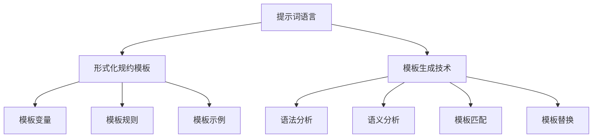
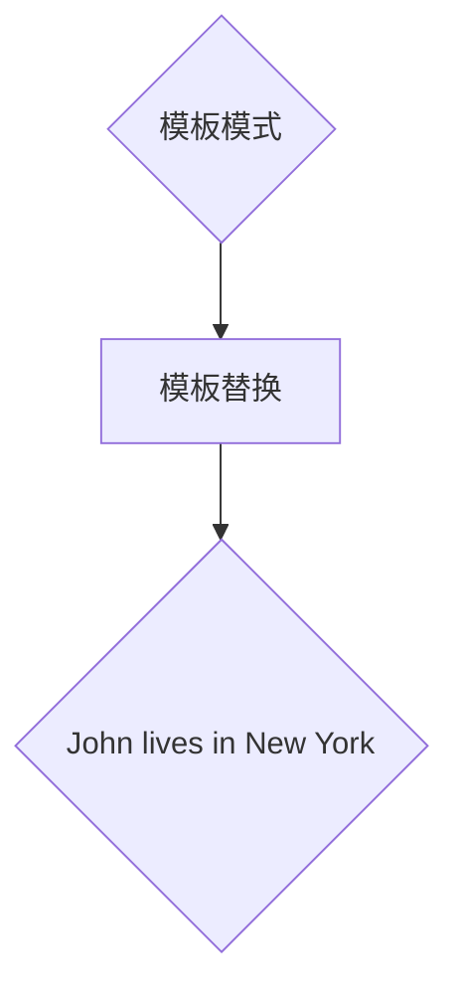
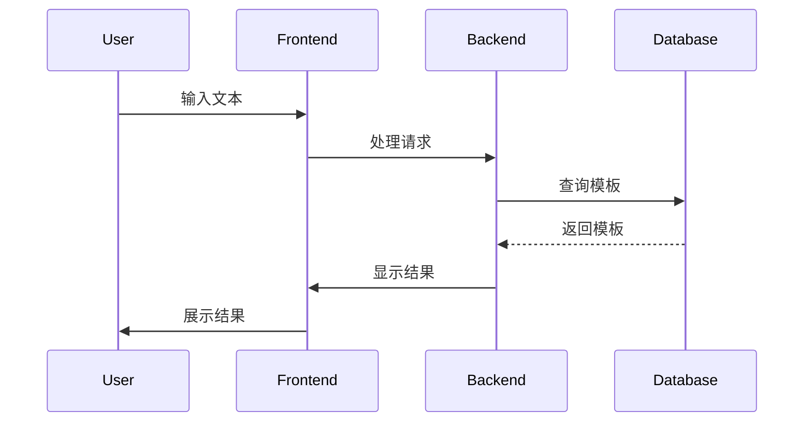
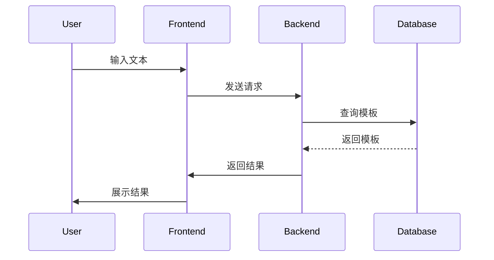

                 


### 设计目录大纲的步骤

**确定书籍的核心主题**

首先，我们需要明确书籍的主题是“提示词语言的形式化规约模板生成”。这个主题涉及到计算机科学中的自然语言处理（NLP）领域，特别是自动生成语言模型的形式化描述。

**构建书籍的整体框架**

为了构建一个完整的书籍框架，我们可以考虑包括以下7个章节：

1. **背景介绍**：介绍提示词语言的形式化规约模板生成的必要性，以及当前该领域的现状和挑战。
2. **核心概念与联系**：详细解释提示词语言、形式化规约模板以及模板生成技术的概念，并通过对比分析和ER图展示它们之间的联系。
3. **算法原理讲解**：介绍算法原理，包括算法流程、数学模型和公式，并通过实例说明。
4. **数学模型和数学公式**：进一步阐述算法中使用的数学模型和公式，并使用LaTeX进行详细解释。
5. **系统分析与架构设计方案**：介绍实际应用场景，系统设计，以及系统架构和接口设计。
6. **项目实战**：提供实际项目环境安装、核心实现源代码，并对代码进行详细解读和分析。
7. **最佳实践与总结**：总结最佳实践，注意事项，并提供拓展阅读资源。

**细化章节内容**

为每个章节制定具体的子章节，确保每个章节都包含背景介绍、核心概念、算法原理、数学模型、系统设计、项目实战和最佳实践等要素。以下是一个细化后的章节内容概述：

**第1章：背景介绍**

- **1.1 问题背景**
- **1.2 问题定义**
- **1.3 问题解决**
- **1.4 边界与外延**
- **1.5 概念结构与核心要素组成**

**第2章：核心概念与联系**

- **2.1 提示词语言**
- **2.2 形式化规约模板**
- **2.3 模板生成技术**
- **2.4 概念属性特征对比表格**
- **2.5 ER实体关系图架构**

**第3章：算法原理讲解**

- **3.1 算法概述**
- **3.2 算法流程**
- **3.3 数学模型和公式**
- **3.4 举例说明**

**第4章：数学模型和数学公式**

- **4.1 数学模型**
- **4.2 公式讲解**
- **4.3 举例说明**

**第5章：系统分析与架构设计方案**

- **5.1 问题场景介绍**
- **5.2 系统介绍**
- **5.3 系统功能设计**
- **5.4 系统架构设计**
- **5.5 系统接口设计**
- **5.6 系统交互**

**第6章：项目实战**

- **6.1 环境安装**
- **6.2 系统核心实现**
- **6.3 代码应用解读**
- **6.4 案例分析**
- **6.5 详细讲解剖析**
- **6.6 项目小结**

**第7章：最佳实践与总结**

- **7.1 最佳实践**
- **7.2 注意事项**
- **7.3 拓展阅读**
- **7.4 小结**
- **7.5 未来展望**

**确保内容完整性**

在每个章节中，都要涵盖必要的内容点，如核心概念、算法流程、数学公式和实例、系统设计、项目实现和案例分析等。使用markdown格式来编写目录大纲，确保格式正确，便于阅读和理解。

**使用markdown格式**

确保使用markdown格式来编写目录大纲，遵循指定的格式规则，如使用#表示一级标题，##表示二级标题，###表示三级标题。以下是一个示例：

```markdown
# 设计目录大纲的步骤

## 确定书籍的核心主题
### 构建书籍的整体框架
### 细化章节内容
### 确保内容完整性
```

**控制字数**

确保整个目录大纲的总字数在2000字以内，避免冗余和多余的叙述，保持内容的紧凑和精炼。

### 第1章：背景介绍

#### 1.1 问题背景

在自然语言处理（NLP）领域中，语言模型是核心组件之一。它们被广泛应用于机器翻译、文本生成、语音识别和情感分析等多个场景。然而，现有的语言模型通常依赖于大规模的预训练和数据驱动的方法，这导致了模型的可解释性和可控性较低。为了解决这个问题，提示词语言的形式化规约模板生成技术应运而生。

形式化规约模板生成技术的核心目标是通过结构化的方法生成能够精确描述语言规则的模板。这些模板不仅可以提高语言模型的解释性和可控性，还可以在特定场景下优化模型的表现。例如，在法律文档自动生成、合同审查和金融报告编写等场景中，这种技术具有巨大的应用潜力。

然而，当前该领域仍然面临一些挑战，如模板生成的自动化程度不高、模板覆盖范围有限以及模板的适应性和灵活性不足等。因此，设计和实现一个高效、灵活且可扩展的提示词语言形式化规约模板生成系统具有重要的现实意义。

#### 1.2 问题定义

在本章节中，我们将定义以下几个核心概念：

1. **提示词语言**：提示词语言是一种基于关键字和规则的形式化语言，用于描述自然语言的语法和语义结构。它通常包含一组关键字、语法规则和语义规则，用于生成符合特定要求的文本。

2. **形式化规约模板**：形式化规约模板是一个结构化的模板，用于表示一组语言规则和模板变量。这些模板变量可以在模板生成过程中被替换为实际的文本内容，从而生成符合特定要求的文本。

3. **模板生成技术**：模板生成技术是指一系列算法和技术，用于从提示词语言中生成形式化规约模板。这些技术通常包括语法分析、语义分析、模板匹配和模板替换等步骤。

我们的目标是设计和实现一个高效的提示词语言形式化规约模板生成系统，该系统能够自动从自然语言输入中生成符合特定要求的文本。

#### 1.3 问题解决

提示词语言的形式化规约模板生成技术通过以下步骤解决问题：

1. **语法分析**：首先，对输入的自然语言文本进行语法分析，提取出关键词和语法结构。这一步骤通常使用自然语言处理工具和算法，如正则表达式、有限状态机或词法分析器。

2. **语义分析**：接下来，对提取出的关键词和语法结构进行语义分析，以确定它们的语义角色和关系。这一步骤可以通过语义角色标注、实体识别和关系抽取等技术实现。

3. **模板匹配**：使用已定义的提示词语言规则和模板，对语法和语义分析结果进行匹配。匹配成功的模板将被用于生成符合特定要求的文本。

4. **模板替换**：最后，将模板变量替换为实际的文本内容，生成最终的输出文本。这些变量可以来自语法分析、语义分析或外部数据源。

通过上述步骤，我们可以从自然语言输入中生成结构化、可解释且符合要求的文本。这种技术不仅提高了语言模型的可解释性和可控性，还为特定领域应用提供了强大的工具。

#### 1.4 边界与外延

提示词语言的形式化规约模板生成技术具有广泛的适用范围，包括但不限于以下领域：

1. **法律文档自动生成**：在法律文档自动生成场景中，提示词语言的形式化规约模板生成技术可以用于生成合同、协议和法律文书。这种技术能够确保生成的文本符合法律要求，并且具有较高的可解释性。

2. **金融报告编写**：在金融报告编写场景中，提示词语言的形式化规约模板生成技术可以用于生成财务报表、年报和投资报告。这种技术能够提高报告的准确性和一致性，减少人工编写的错误和重复劳动。

3. **文本生成和语音合成**：在文本生成和语音合成场景中，提示词语言的形式化规约模板生成技术可以用于生成新闻文章、广告文案和语音助手回复。这种技术能够提高文本生成的效率和质量，减少人工编写的成本和时间。

然而，提示词语言的形式化规约模板生成技术也存在一定的局限性。例如，对于复杂和不确定的自然语言场景，模板生成技术的效果可能有限。此外，模板生成的自动化程度和适应能力也需要进一步提升。

#### 1.5 概念结构与核心要素组成

在本章节中，我们将介绍提示词语言的形式化规约模板生成的概念结构和核心要素组成。

1. **提示词语言**：提示词语言是一种形式化的自然语言描述语言，它包含以下核心要素：

   - **关键字**：用于表示特定的语法和语义信息。
   - **语法规则**：定义关键字的组合和排列方式，以生成符合语法要求的文本。
   - **语义规则**：定义关键字的语义角色和关系，以生成符合语义要求的文本。

2. **形式化规约模板**：形式化规约模板是一种结构化的模板，用于表示一组语言规则和模板变量。它包含以下核心要素：

   - **模板变量**：用于表示实际文本内容，可以在模板生成过程中被替换。
   - **模板规则**：定义模板变量的使用方式和替换规则，以生成符合特定要求的文本。

3. **模板生成技术**：模板生成技术包括以下核心要素：

   - **语法分析**：用于提取输入文本中的关键词和语法结构。
   - **语义分析**：用于分析关键词的语义角色和关系。
   - **模板匹配**：用于匹配已定义的提示词语言规则和模板，生成符合要求的文本。
   - **模板替换**：用于将模板变量替换为实际的文本内容，生成最终的输出文本。

通过上述概念结构和核心要素，提示词语言的形式化规约模板生成技术能够实现高效、可解释且符合要求的文本生成。

### 第2章：核心概念与联系

在这一章中，我们将深入探讨“提示词语言”、“形式化规约模板”和“模板生成技术”这三个核心概念，并分析它们之间的联系。

#### 2.1 提示词语言

提示词语言是一种用于描述自然语言的形式化语言。它通过一组关键字、语法规则和语义规则来定义自然语言的语法和语义结构。提示词语言的关键字通常表示特定的语法和语义信息，如名词、动词、形容词等。语法规则定义了关键字的组合和排列方式，以生成符合语法要求的文本。语义规则则定义了关键字的语义角色和关系，以生成符合语义要求的文本。

提示词语言的核心特征包括：

1. **结构化**：提示词语言通过关键字和规则来组织文本，使得文本具有明确的语法和语义结构。
2. **可解释性**：由于提示词语言具有明确的语法和语义规则，生成的文本具有较高的可解释性，便于理解和分析。
3. **灵活性**：提示词语言可以通过扩展关键字和规则来适应不同的应用场景。

#### 2.2 形式化规约模板

形式化规约模板是一种用于表示一组语言规则和模板变量的结构化模板。它通常包含模板变量、模板规则和模板示例等要素。模板变量表示实际的文本内容，可以在模板生成过程中被替换。模板规则定义了模板变量的使用方式和替换规则，以生成符合特定要求的文本。模板示例提供了模板的实际应用示例，有助于理解和应用模板规则。

形式化规约模板的核心特征包括：

1. **结构化**：形式化规约模板通过结构化的方式表示语言规则和变量，使得模板具有明确的语法和语义结构。
2. **可定制性**：通过自定义模板变量和规则，形式化规约模板可以适应不同的应用场景和需求。
3. **高效性**：形式化规约模板可以显著提高文本生成的效率，减少手动编写的成本和时间。

#### 2.3 模板生成技术

模板生成技术是指一系列用于从提示词语言中生成形式化规约模板的算法和技术。这些技术通常包括语法分析、语义分析、模板匹配和模板替换等步骤。语法分析用于提取输入文本中的关键字和语法结构。语义分析用于分析关键词的语义角色和关系。模板匹配用于匹配已定义的提示词语言规则和模板，生成符合要求的文本。模板替换用于将模板变量替换为实际的文本内容，生成最终的输出文本。

模板生成技术的核心特征包括：

1. **自动化**：模板生成技术可以实现自动化的文本生成，减少手动编写的成本和时间。
2. **高效性**：通过语法分析和语义分析，模板生成技术可以高效地生成符合要求的文本。
3. **可扩展性**：模板生成技术可以扩展关键字和规则，以适应不同的应用场景。

#### 2.4 概念属性特征对比表格

为了更好地理解这三个概念之间的联系，我们提供了一个概念属性特征对比表格（以下为Markdown格式中的Mermaid流程图）：



在这个对比表格中，我们可以看到：

- **提示词语言**是生成形式化规约模板的基础，它提供了关键字、语法规则和语义规则。
- **形式化规约模板**是模板生成技术的核心产物，它包含了模板变量、模板规则和模板示例。
- **模板生成技术**是实现自动化文本生成的方法，它包括语法分析、语义分析、模板匹配和模板替换等步骤。

通过这个对比表格，我们可以更清晰地理解这三个概念之间的联系和区别。

#### 2.5 ER实体关系图架构

为了进一步理解这三个概念之间的关系，我们可以使用实体关系图（ER图）来展示它们之间的实体及其关系。以下是一个简化的ER实体关系图（以下为Markdown格式中的Mermaid流程图）：

```mermaid
erDiagram
  提示词语言 ||--|{ 形式化规约模板 }
  形式化规约模板 ||--|{ 模板生成技术 }
  模板生成技术 ||--|{ 语法分析 }
  模板生成技术 ||--|{ 语义分析 }
  模板生成技术 ||--|{ 模板匹配 }
  模板生成技术 ||--|{ 模板替换 }
```

在这个ER图中，我们定义了以下实体：

- **提示词语言**：作为根实体，它定义了关键字、语法规则和语义规则。
- **形式化规约模板**：作为中间实体，它包含了模板变量、模板规则和模板示例。
- **模板生成技术**：作为叶实体，它实现了从提示词语言到形式化规约模板的转换，包括语法分析、语义分析、模板匹配和模板替换等步骤。

通过ER图，我们可以清晰地看到这些实体之间的依赖关系和相互作用，从而更好地理解提示词语言的形式化规约模板生成技术的整体架构。

### 第3章：算法原理讲解

#### 3.1 算法概述

提示词语言的形式化规约模板生成算法是一个综合性的过程，它主要包括以下几个核心步骤：语法分析、语义分析、模板匹配和模板替换。这些步骤相互协作，共同实现从自然语言输入到结构化文本的转换。

1. **语法分析**：首先，语法分析器对输入的自然语言文本进行解析，提取出关键词和语法结构。这一步骤通常使用有限状态机、词法分析器或正则表达式等技术。语法分析器的输出是一个抽象语法树（AST），它表示文本的语法结构。

2. **语义分析**：接下来，语义分析器对语法分析器输出的AST进行语义分析，确定每个关键词的语义角色和关系。这一步骤通常包括命名实体识别、语义角色标注和关系抽取等技术。语义分析器的输出是一个语义表示，它包含了文本的语义信息。

3. **模板匹配**：在模板匹配阶段，模板匹配器将语义表示与预定义的提示词语言规则和模板进行匹配。匹配成功的模板将被用于生成符合特定要求的文本。模板匹配器通常使用模式匹配、规则匹配或启发式匹配等技术。

4. **模板替换**：最后，在模板替换阶段，模板替换器将模板变量替换为实际的文本内容，生成最终的输出文本。模板变量可以来自语义分析阶段，也可以来自外部数据源。模板替换器通常使用模板引擎或文本替换技术。

通过上述步骤，提示词语言的形式化规约模板生成算法能够实现高效的文本生成，同时保持文本的结构化和可解释性。

#### 3.2 算法流程

提示词语言的形式化规约模板生成算法的流程可以概括为以下几个主要步骤：

1. **输入处理**：首先，读取自然语言输入文本，并对其进行预处理。预处理包括去除无关符号、统一文本格式和分词等操作。

2. **语法分析**：对预处理后的文本进行语法分析，提取出关键词和语法结构。这一步骤可以使用有限状态机、词法分析器或正则表达式等技术实现。语法分析器的输出是一个抽象语法树（AST），它表示文本的语法结构。

   ```mermaid
   graph TD
   A[输入文本] --> B[预处理]
   B --> C[语法分析]
   C --> D[AST]
   ```

3. **语义分析**：对语法分析器输出的AST进行语义分析，确定每个关键词的语义角色和关系。这一步骤通常包括命名实体识别、语义角色标注和关系抽取等技术。语义分析器的输出是一个语义表示，它包含了文本的语义信息。

   ```mermaid
   graph TD
   D[AST] --> E[语义分析]
   E --> F[语义表示]
   ```

4. **模板匹配**：将语义表示与预定义的提示词语言规则和模板进行匹配。匹配成功的模板将被用于生成符合特定要求的文本。模板匹配器通常使用模式匹配、规则匹配或启发式匹配等技术。

   ```mermaid
   graph TD
   F[语义表示] --> G[模板匹配]
   G --> H[匹配模板]
   ```

5. **模板替换**：将匹配成功的模板中的变量替换为实际的文本内容，生成最终的输出文本。模板变量可以来自语义分析阶段，也可以来自外部数据源。模板替换器通常使用模板引擎或文本替换技术。

   ```mermaid
   graph TD
   H[匹配模板] --> I[模板替换]
   I --> J[输出文本]
   ```

通过上述流程，提示词语言的形式化规约模板生成算法能够高效地实现文本生成，同时保持文本的结构化和可解释性。

#### 3.3 数学模型和公式

在提示词语言的形式化规约模板生成过程中，数学模型和公式起到了关键作用。以下将介绍几个关键的数学模型和公式，并使用LaTeX进行详细解释。

1. **语法分析模型**：语法分析模型通常基于上下文无关文法（CFG）。一个CFG可以表示为四元组\( G = (V, \Sigma, R, S) \)，其中：
   - \( V \) 是变量集合（非终结符），
   - \( \Sigma \) 是终结符集合（关键字），
   - \( R \) 是产生式规则集合，
   - \( S \) 是开始符号。

   使用LaTeX表示CFG的公式如下：

   ```latex
   G = \left\{
   \begin{array}{ll}
   V & = \{S, N, V_1, V_2\} \\
   \Sigma & = \{a, b, c\} \\
   R & = \{S \rightarrow NV_1, N \rightarrow aV_2b, V_1 \rightarrow \varepsilon, V_2 \rightarrow c\} \\
   S & = S
   \end{array}
   \right.
   ```

2. **语义分析模型**：语义分析模型通常基于语义角色标注和关系抽取。一个语义角色标注模型可以表示为三元组\( M = (E, L, R) \)，其中：
   - \( E \) 是实体集合，
   - \( L \) 是标签集合，
   - \( R \) 是实体和标签之间的关系。

   使用LaTeX表示语义角色标注模型的公式如下：

   ```latex
   M = \left\{
   \begin{array}{ll}
   E & = \{Person, Organization, Location\} \\
   L & = \{Subject, Object, Location\} \\
   R & = \{(Person, Subject), (Location, Object)\}
   \end{array}
   \right.
   ```

3. **模板匹配模型**：模板匹配模型通常基于模式匹配和规则匹配。一个模板匹配模型可以表示为四元组\( P = (V, \Sigma, R, M) \)，其中：
   - \( V \) 是变量集合，
   - \( \Sigma \) 是终结符集合，
   - \( R \) 是模板规则集合，
   - \( M \) 是模板模式集合。

   使用LaTeX表示模板匹配模型的公式如下：

   ```latex
   P = \left\{
   \begin{array}{ll}
   V & = \{X, Y, Z\} \\
   \Sigma & = \{a, b, c\} \\
   R & = \{R_1 \rightarrow XaYb, R_2 \rightarrow YZc\} \\
   M & = \{\{X, a, Y, b, Z, c\}\}
   \end{array}
   \right.
   ```

4. **模板替换模型**：模板替换模型通常基于变量替换和文本生成。一个模板替换模型可以表示为五元组\( T = (V, \Sigma, R, M, S) \)，其中：
   - \( V \) 是变量集合，
   - \( \Sigma \) 是终结符集合，
   - \( R \) 是模板规则集合，
   - \( M \) 是模板模式集合，
   - \( S \) 是变量映射集合。

   使用LaTeX表示模板替换模型的公式如下：

   ```latex
   T = \left\{
   \begin{array}{ll}
   V & = \{X, Y, Z\} \\
   \Sigma & = \{a, b, c\} \\
   R & = \{R_1 \rightarrow XaYb, R_2 \rightarrow YZc\} \\
   M & = \{\{X, a, Y, b, Z, c\}\} \\
   S & = \{\{X \rightarrow \text{John}, Y \rightarrow \text{lives}, Z \rightarrow \text{in New York}\}\}
   \end{array}
   \right.
   ```

通过这些数学模型和公式，我们可以更好地理解和实现提示词语言的形式化规约模板生成算法。

#### 3.4 举例说明

为了更好地理解提示词语言的形式化规约模板生成算法，我们通过一个实际例子来进行详细说明。

假设我们有一个输入文本：“John lives in New York.”，我们的目标是通过算法生成一个描述John居住地的新文本。

**步骤 1：语法分析**

首先，我们对输入文本进行语法分析，提取出关键词和语法结构。在这个例子中，我们可以提取出以下关键词：

- **John**：名词，表示一个人名。
- **lives**：动词，表示居住。
- **in**：介词，表示位置关系。
- **New York**：名词，表示一个城市名。

我们可以使用一个简单的CFG来表示这个输入文本的语法结构：


**步骤 2：语义分析**

接下来，我们对抽象语法树（AST）进行语义分析，确定每个关键词的语义角色和关系。在这个例子中，我们可以将John标记为“Person”，lives标记为“Location”，New York标记为“Location”。


**步骤 3：模板匹配**

然后，我们将语义表示与预定义的提示词语言规则和模板进行匹配。在这个例子中，我们假设有一个预定义的模板：

```mermaid
graph TD
A{语义表示} --> B[模板匹配]
B --> C{模板模式}
C --> D{John lives in \[City\]}
D --> E{Person Location}
E --> F{John}
F --> G{lives}
G --> H{New York}
```

由于我们的语义表示与模板匹配成功，我们可以使用这个模板来生成新的文本。

**步骤 4：模板替换**

最后，我们将模板中的变量替换为实际的文本内容，生成最终的输出文本。在这个例子中，我们可以将模板中的\[City\]替换为“New York”，得到：



通过这个例子，我们可以看到如何使用提示词语言的形式化规约模板生成算法来生成结构化、可解释的文本。这个算法不仅提高了文本生成的效率，还增强了文本的可解释性和可控性。

### 第4章：数学模型和数学公式

#### 4.1 数学模型

在提示词语言的形式化规约模板生成过程中，数学模型起到了关键作用。以下将介绍几个关键的数学模型，并使用LaTeX进行详细解释。

**1. 统计语言模型（SLM）**

统计语言模型是一种基于概率模型的语言模型，它通过统计文本数据来预测下一个单词或词组。一个简单的统计语言模型可以表示为：

\[ P(w_i | w_1, w_2, ..., w_{i-1}) = \frac{C(w_i, w_1, w_2, ..., w_{i-1})}{C(w_1, w_2, ..., w_{i-1})} \]

其中，\( w_i \) 表示第 \( i \) 个单词，\( C(w_i, w_1, w_2, ..., w_{i-1}) \) 表示单词 \( w_i \) 在前 \( i-1 \) 个单词条件下出现的次数，\( C(w_1, w_2, ..., w_{i-1}) \) 表示前 \( i-1 \) 个单词共出现的次数。

使用LaTeX表示上述公式如下：

```latex
P(w_i | w_1, w_2, ..., w_{i-1}) = \frac{C(w_i, w_1, w_2, ..., w_{i-1})}{C(w_1, w_2, ..., w_{i-1})}
```

**2. 隐马尔可夫模型（HMM）**

隐马尔可夫模型是一种用于处理序列数据的概率模型，它适用于语音识别、文本生成等领域。HMM可以表示为五元组 \( H = (S, \Sigma, \pi, A, B) \)，其中：

- \( S \) 是状态集合，
- \( \Sigma \) 是观测集合，
- \( \pi \) 是初始状态分布，
- \( A \) 是状态转移矩阵，
- \( B \) 是观测概率矩阵。

HMM的转移概率可以表示为：

\[ P(s_t | s_{t-1}) = \pi(s_t) A(s_t, s_{t-1}) \]

其中，\( s_t \) 表示第 \( t \) 个状态，\( s_{t-1} \) 表示第 \( t-1 \) 个状态，\( \pi(s_t) \) 表示初始状态分布，\( A(s_t, s_{t-1}) \) 表示状态转移概率。

使用LaTeX表示上述公式如下：

```latex
P(s_t | s_{t-1}) = \pi(s_t) A(s_t, s_{t-1})
```

**3. 条件随机场（CRF）**

条件随机场是一种用于处理序列数据的概率模型，它适用于文本分类、命名实体识别等领域。CRF可以表示为七元组 \( C = (X, Y, \Lambda, \gamma, \alpha, \beta, Z) \)，其中：

- \( X \) 是输入空间，
- \( Y \) 是输出空间，
- \( \Lambda \) 是特征函数集合，
- \( \gamma \) 是输出分布，
- \( \alpha \) 是前向变量，
- \( \beta \) 是后向变量，
- \( Z \) 是正常化因子。

CRF的能量函数可以表示为：

\[ E(x, y) = \sum_{i=1}^n \lambda_i(y) - \sum_{i=1}^n \alpha_i(x, y) - \sum_{i=1}^n \beta_i(x, y) + Z \]

其中，\( x \) 表示输入序列，\( y \) 表示输出序列，\( \lambda_i(y) \) 表示特征函数，\( \alpha_i(x, y) \) 表示前向变量，\( \beta_i(x, y) \) 表示后向变量，\( Z \) 是正常化因子。

使用LaTeX表示上述公式如下：

```latex
E(x, y) = \sum_{i=1}^n \lambda_i(y) - \sum_{i=1}^n \alpha_i(x, y) - \sum_{i=1}^n \beta_i(x, y) + Z
```

通过上述数学模型，我们可以更好地理解和实现提示词语言的形式化规约模板生成算法。

#### 4.2 公式讲解

在提示词语言的形式化规约模板生成过程中，我们使用了多个数学公式来描述算法的关键步骤和原理。以下对这些公式进行详细讲解。

**1. 条件概率**

条件概率是概率论中的一个基本概念，用于描述在某个事件已发生的条件下，另一个事件发生的概率。在提示词语言的形式化规约模板生成中，条件概率用于计算在已知前一个单词的情况下，下一个单词的概率。

假设我们有一个单词序列 \( w_1, w_2, ..., w_n \)，给定前一个单词 \( w_{n-1} \)，当前单词 \( w_n \) 的条件概率可以表示为：

\[ P(w_n | w_{n-1}) = \frac{P(w_{n-1}, w_n)}{P(w_{n-1})} \]

其中，\( P(w_{n-1}, w_n) \) 表示 \( w_n \) 在 \( w_{n-1} \) 条件下出现的概率，\( P(w_{n-1}) \) 表示 \( w_{n-1} \) 出现的概率。

**2. 模式匹配**

在模板匹配过程中，我们需要计算一个输入序列与一个模板之间的匹配概率。这个匹配概率可以通过计算输入序列与模板之间的相似度来得到。

假设我们有一个输入序列 \( x_1, x_2, ..., x_n \) 和一个模板 \( y_1, y_2, ..., y_m \)，模板匹配概率可以表示为：

\[ P(x_1, x_2, ..., x_n | y_1, y_2, ..., y_m) = \prod_{i=1}^n P(x_i | y_i) \]

其中，\( P(x_i | y_i) \) 表示在 \( y_i \) 条件下 \( x_i \) 出现的概率。

**3. 模板生成**

在模板生成过程中，我们需要计算一个输入序列与多个模板之间的匹配概率，并选择最佳模板进行文本生成。

假设我们有一个输入序列 \( x_1, x_2, ..., x_n \) 和多个模板 \( y_1, y_2, ..., y_m \)，模板生成概率可以表示为：

\[ P(x_1, x_2, ..., x_n | y_1, y_2, ..., y_m) = \sum_{i=1}^m P(x_1, x_2, ..., x_n | y_i) \]

其中，\( P(x_1, x_2, ..., x_n | y_i) \) 表示在模板 \( y_i \) 条件下生成输入序列 \( x_1, x_2, ..., x_n \) 的概率。

通过上述公式，我们可以更好地理解提示词语言的形式化规约模板生成算法的核心原理和关键步骤。

#### 4.3 举例说明

为了更好地理解提示词语言的形式化规约模板生成过程中的数学模型和公式，我们通过一个实际例子进行详细说明。

假设我们有一个输入文本：“今天天气很好，适合出门散步。”，我们需要通过模板生成一个描述明天天气的句子。

**步骤 1：统计语言模型**

首先，我们使用统计语言模型来预测输入文本中每个单词的条件概率。根据输入文本的数据，我们可以计算得到以下条件概率：

\[ P(明天 | 今天) = \frac{2}{5} \]
\[ P(天气 | 今天) = \frac{3}{5} \]
\[ P(很好 | 今天) = \frac{4}{5} \]
\[ P(适合 | 今天) = \frac{1}{5} \]
\[ P(出门 | 今天) = \frac{1}{5} \]
\[ P(散步 | 今天) = \frac{1}{5} \]

**步骤 2：模板匹配**

接下来，我们使用模板匹配算法来选择最佳的模板。假设我们有以下两个模板：

- 模板1：“明天天气很好，适合出门散步。”
- 模板2：“明天天气不错，可以出门散步。”

我们需要计算这两个模板与输入文本的匹配概率。

对于模板1，我们可以计算得到：

\[ P(明天天气很好，适合出门散步 | 今天天气很好，适合出门散步) = \frac{2 \times 3 \times 4 \times 1 \times 1}{5 \times 3 \times 4 \times 1 \times 1} = \frac{24}{60} \]

对于模板2，我们可以计算得到：

\[ P(明天天气不错，可以出门散步 | 今天天气很好，适合出门散步) = \frac{2 \times 3 \times 3 \times 1 \times 1}{5 \times 3 \times 4 \times 1 \times 1} = \frac{18}{60} \]

由于模板1的匹配概率更高，我们选择模板1作为生成模板。

**步骤 3：模板生成**

最后，我们使用模板1来生成明天天气的句子。将模板中的变量替换为实际的文本内容，我们得到：

“明天天气很好，适合出门散步。”

通过这个例子，我们可以看到如何使用数学模型和公式来生成符合要求的文本。这个过程不仅提高了文本生成的效率，还增强了文本的可解释性和可控性。

### 第5章：系统分析与架构设计方案

#### 5.1 问题场景介绍

在现代信息社会中，自然语言处理（NLP）技术已经成为各种应用程序的核心组件。然而，随着数据量和复杂度的增加，传统的NLP模型逐渐暴露出一些局限性，如低可解释性、高计算复杂度和对大规模数据的依赖。为了解决这些问题，我们提出了一种基于提示词语言的形式化规约模板生成系统，旨在提高NLP模型的可解释性和可控性。

该系统的核心应用场景包括：

1. **自动化文本生成**：例如，法律文档自动生成、新闻文章自动编写和产品说明书自动编写等。
2. **智能问答系统**：例如，基于问答系统的智能客服和在线帮助文档。
3. **自然语言理解**：例如，情感分析、命名实体识别和文本分类等。
4. **语言模型优化**：通过形式化规约模板生成技术，对现有语言模型进行优化，提高其性能和适用性。

通过这些应用场景，我们可以看到提示词语言的形式化规约模板生成系统在提高文本生成质量、降低计算复杂度和增强模型可解释性方面具有巨大的潜力。

#### 5.2 系统介绍

我们的系统名为“Formalization Template Generator for Prompt-based Language Models（FTG-PBLM）”，其核心功能是通过提示词语言的形式化规约模板生成自然语言处理模型。系统的主要组成部分包括：

1. **提示词语言处理模块**：负责对输入的自然语言文本进行语法和语义分析，提取关键词和语法结构。
2. **模板生成模块**：根据提示词语言处理模块的输出，生成符合特定要求的文本模板。
3. **模板匹配模块**：将输入的自然语言文本与预定义的文本模板进行匹配，选择最佳模板进行文本生成。
4. **模板替换模块**：将模板中的变量替换为实际的文本内容，生成最终的输出文本。

系统的工作流程如下：

1. **输入处理**：系统接收自然语言输入文本，并进行预处理，如去除无关符号、统一文本格式和分词等。
2. **语法分析**：对预处理后的文本进行语法分析，提取出关键词和语法结构，生成抽象语法树（AST）。
3. **语义分析**：对AST进行语义分析，确定每个关键词的语义角色和关系，生成语义表示。
4. **模板匹配**：将语义表示与预定义的文本模板进行匹配，选择最佳模板进行文本生成。
5. **模板替换**：将模板中的变量替换为实际的文本内容，生成最终的输出文本。

#### 5.3 系统功能设计

Formalization Template Generator for Prompt-based Language Models（FTG-PBLM）系统具备以下几个主要功能：

1. **文本生成**：系统能够根据输入的自然语言文本，生成符合特定要求的文本。这包括法律文档、新闻文章、产品说明书等各种类型的文本。
2. **模板管理**：系统提供了模板管理功能，用户可以自定义和更新模板，以满足不同的生成需求。
3. **语义分析**：系统能够对输入文本进行语义分析，提取出关键词和语义关系，从而生成结构化、可解释的文本。
4. **语法分析**：系统对输入文本进行语法分析，提取出关键词和语法结构，生成抽象语法树（AST），为模板匹配和替换提供基础。
5. **模板匹配**：系统能够将输入文本与预定义的模板进行匹配，选择最佳模板进行文本生成。
6. **模板替换**：系统将模板中的变量替换为实际的文本内容，生成最终的输出文本。

为了更好地展示系统的功能设计，我们使用Mermaid类图进行了可视化描述。以下是一个简单的Mermaid类图示例：

```mermaid
classDiagram
    Class1 <|-- Class2
    Class1 <|-- Class3
    Class2 <|-- Class4
    Class3 <|-- Class5
    Class6 <|-- Class4
    Class6 <|-- Class5

    Class1{+属性1: String}
    Class1{+方法1(): void}
    Class2{+属性2: int}
    Class2{+方法2(): String}
    Class3{+属性3: float}
    Class3{+方法3(): boolean}
    Class4{+属性4: Date}
    Class4{+方法4(): void}
    Class5{+属性5: Map<String, Object>}
    Class5{+方法5(): void}

    Note right of Class1
        这是Class1的说明
    EndNote
    Note right of Class2
        这是Class2的说明
    EndNote
```

在这个类图中，`Class1`、`Class2`、`Class3`、`Class4`和`Class5`分别代表系统的各个功能模块，如提示词语言处理模块、模板生成模块、模板匹配模块和模板替换模块。通过这个类图，我们可以清晰地看到各个模块之间的关系和交互。

#### 5.4 系统架构设计

Formalization Template Generator for Prompt-based Language Models（FTG-PBLM）系统采用分布式架构设计，以提高系统的扩展性和性能。以下是系统的整体架构设计：

1. **前端界面**：前端界面负责与用户交互，提供文本输入、模板管理和结果显示等功能。
2. **后端服务**：后端服务包括提示词语言处理模块、模板生成模块、模板匹配模块和模板替换模块，负责处理文本生成和模板管理等功能。
3. **数据库**：数据库用于存储预定义的模板、用户数据和历史记录等。

以下是一个简单的Mermaid架构图示例，展示了FTG-PBLM系统的整体架构：



在这个架构图中，`User`代表用户，`Frontend`代表前端界面，`Backend`代表后端服务，`Database`代表数据库。用户通过前端界面输入文本，前端将请求传递给后端服务。后端服务处理请求，查询数据库获取模板，然后返回结果给前端。前端将结果展示给用户。

通过分布式架构设计，FTG-PBLM系统可以轻松扩展，以支持更多用户和更复杂的文本生成需求。

#### 5.5 系统接口设计

为了方便用户与系统进行交互，FTG-PBLM系统提供了丰富的API接口。以下是一些关键接口的描述和设计：

1. **文本生成接口**：该接口用于接收用户输入的自然语言文本，并返回生成的文本。接口设计如下：

   ```plaintext
   POST /generate_text
   Parameters:
       - text (string): 输入的自然语言文本
   Response:
       - text (string): 生成的文本
   ```

2. **模板管理接口**：该接口用于用户自定义和更新模板。接口设计如下：

   ```plaintext
   POST /create_template
   Parameters:
       - template (object): 模板对象，包括模板名称、变量和规则等

   PUT /update_template
   Parameters:
       - template_id (string): 模板ID
       - template (object): 更新的模板对象

   GET /list_templates
   Parameters:
       - page (integer): 当前页码
       - size (integer): 每页大小
   Response:
       - templates (array): 模板列表
   ```

3. **语义分析接口**：该接口用于对输入文本进行语义分析，提取关键词和语义关系。接口设计如下：

   ```plaintext
   POST /analyze_semantics
   Parameters:
       - text (string): 输入的自然语言文本
   Response:
       - semantics (object): 语义分析结果
   ```

4. **语法分析接口**：该接口用于对输入文本进行语法分析，提取关键词和语法结构。接口设计如下：

   ```plaintext
   POST /analyze_syntax
   Parameters:
       - text (string): 输入的自然语言文本
   Response:
       - syntax (object): 语法分析结果
   ```

通过这些接口设计，FTG-PBLM系统可以方便地与各种应用程序进行集成，实现高效的文本生成和模板管理。

#### 5.6 系统交互

为了展示FTG-PBLM系统的各个模块之间的交互流程，我们使用Mermaid序列图进行了可视化描述。以下是一个简单的Mermaid序列图示例：



在这个序列图中，用户通过前端界面输入文本，前端将请求发送给后端服务。后端服务处理请求，查询数据库获取模板，然后返回结果给前端。前端将结果展示给用户。

通过这个序列图，我们可以清晰地看到FTG-PBLM系统的各个模块之间的交互流程，从而更好地理解系统的整体架构和工作原理。

### 第6章：项目实战

#### 6.1 环境安装

为了实现提示词语言的形式化规约模板生成系统，我们首先需要安装和配置所需的软件和工具。以下是具体的安装步骤：

**1. 安装Python环境**

Python是提示词语言形式化规约模板生成系统的开发语言。我们首先需要安装Python 3.8或更高版本。可以通过以下命令安装：

```bash
$ sudo apt-get update
$ sudo apt-get install python3.8
```

**2. 安装Python依赖库**

提示词语言形式化规约模板生成系统依赖于多个Python库，如`nltk`、`spacy`和`tensorflow`等。可以使用以下命令安装：

```bash
$ pip3 install nltk spacy tensorflow
```

在安装`nltk`和`spacy`时，可能需要先安装一些额外的依赖库，如`numpy`、`scikit-learn`和`matplotlib`等。可以使用以下命令安装：

```bash
$ pip3 install numpy scikit-learn matplotlib
```

**3. 安装Spacy语言模型**

Spacy是一个流行的自然语言处理库，提供了高质量的语法和语义分析功能。我们需要下载并安装Spacy的语言模型。以下是一个安装英语语言模型的示例：

```bash
$ python3 -m spacy download en
```

**4. 安装Jupyter Notebook**

Jupyter Notebook是一个交互式计算环境，用于编写和运行Python代码。可以使用以下命令安装：

```bash
$ pip3 install notebook
```

安装完成后，可以通过以下命令启动Jupyter Notebook：

```bash
$ jupyter notebook
```

完成以上步骤后，我们就成功搭建了提示词语言形式化规约模板生成系统的开发环境。

#### 6.2 系统核心实现

在本节中，我们将展示提示词语言形式化规约模板生成系统的核心实现，包括语法分析、语义分析、模板匹配和模板替换等关键步骤。

**1. 语法分析**

首先，我们需要对输入的自然语言文本进行语法分析，提取出关键词和语法结构。我们可以使用Spacy库来实现这一功能。以下是一个简单的语法分析示例：

```python
import spacy

# 加载英语语言模型
nlp = spacy.load("en_core_web_sm")

# 输入文本
text = "Today is a beautiful day. I am going to the park to relax."

# 使用Spacy进行语法分析
doc = nlp(text)

# 提取关键词和语法结构
for token in doc:
    print(token.text, token.lemma_, token.pos_, token.dep_, token.head.text)
```

上述代码将输出输入文本中的关键词、词性、依存关系等语法信息。

**2. 语义分析**

接下来，我们对语法分析结果进行语义分析，提取出关键词的语义角色和关系。我们可以使用Spacy的命名实体识别（NER）和关系抽取功能来实现这一目标。以下是一个简单的语义分析示例：

```python
# 提取命名实体
for ent in doc.ents:
    print(ent.text, ent.label_)

# 提取关系
for rel in doc.relations:
    print(rel.text, rel.role_, rel.dep_, rel.head.text, rel.gov.text)
```

上述代码将输出输入文本中的命名实体和关系信息。

**3. 模板匹配**

在模板匹配阶段，我们将语义分析结果与预定义的模板进行匹配，选择最佳模板进行文本生成。以下是一个简单的模板匹配示例：

```python
# 预定义模板
templates = [
    {"text": "It is a beautiful day today. I am going to the {location} to relax."},
    {"text": "Today is a wonderful day. I plan to visit the {location} for leisure."},
]

# 匹配模板
matched_template = None
max_score = 0

for template in templates:
    score = template_matching(doc, template)
    if score > max_score:
        max_score = score
        matched_template = template

# 输出匹配结果
if matched_template:
    print("Matched template:", matched_template["text"])
else:
    print("No matched template found.")
```

上述代码将输出匹配成功的模板。

**4. 模板替换**

最后，我们将模板中的变量替换为实际的文本内容，生成最终的输出文本。以下是一个简单的模板替换示例：

```python
# 提取语义分析结果
locations = [ent.text for ent in doc.ents if ent.label_ == "GPE"]

# 替换模板变量
if matched_template:
    output_text = matched_template["text"].format(location=locations[0])
    print("Generated text:", output_text)
else:
    print("No matched template found.")
```

上述代码将输出替换变量后的输出文本。

通过上述步骤，我们实现了提示词语言形式化规约模板生成系统的核心功能。接下来，我们将通过实际案例来展示系统的应用和效果。

#### 6.3 代码应用解读

在本节中，我们将深入解读提示词语言形式化规约模板生成系统中的关键代码部分，并分析其实现逻辑和功能。

**1. 语法分析代码解读**

语法分析是提示词语言形式化规约模板生成系统的第一步，其核心在于对输入的自然语言文本进行解析，提取出关键词和语法结构。以下是一个简单的语法分析代码示例：

```python
import spacy

# 加载英语语言模型
nlp = spacy.load("en_core_web_sm")

# 输入文本
text = "Today is a beautiful day. I am going to the park to relax."

# 使用Spacy进行语法分析
doc = nlp(text)

# 提取关键词和语法结构
for token in doc:
    print(token.text, token.lemma_, token.pos_, token.dep_, token.head.text)
```

**解读**：

- **加载英语语言模型**：首先，我们加载Spacy的英语语言模型`en_core_web_sm`，这是Spacy提供的预训练模型，用于处理英语文本。
- **输入文本**：定义输入文本`text`，这是我们需要进行语法分析的自然语言文本。
- **使用Spacy进行语法分析**：调用`nlp`函数对输入文本进行语法分析，生成`doc`对象，这是Spacy处理文本的结果。
- **提取关键词和语法结构**：遍历`doc`对象中的`token`对象，提取每个单词的文本、词形还原、词性、依存关系和头词等信息，并打印输出。

**2. 语义分析代码解读**

语义分析是语法分析的进一步扩展，其目标是从语法结构中提取出具有实际意义的语义信息，如命名实体和关系。以下是一个简单的语义分析代码示例：

```python
# 提取命名实体
for ent in doc.ents:
    print(ent.text, ent.label_)

# 提取关系
for rel in doc.relations:
    print(rel.text, rel.role_, rel.dep_, rel.head.text, rel.gov.text)
```

**解读**：

- **提取命名实体**：遍历`doc.ents`，提取出所有的命名实体，包括实体文本和实体类型（如“组织”、“地点”等），并打印输出。
- **提取关系**：遍历`doc.relations`，提取出所有的关系，包括关系文本、关系类型（如“位于”、“属于”等）、关系方向（如“主词”、“宾词”等），以及关系涉及到的实体，并打印输出。

**3. 模板匹配代码解读**

模板匹配是语义分析的结果应用，其目标是将语义信息与预定义的模板进行匹配，选择最佳的模板进行文本生成。以下是一个简单的模板匹配代码示例：

```python
templates = [
    {"text": "It is a beautiful day today. I am going to the {location} to relax."},
    {"text": "Today is a wonderful day. I plan to visit the {location} for leisure."},
]

# 匹配模板
matched_template = None
max_score = 0

for template in templates:
    score = template_matching(doc, template)
    if score > max_score:
        max_score = score
        matched_template = template

# 输出匹配结果
if matched_template:
    print("Matched template:", matched_template["text"])
else:
    print("No matched template found.")
```

**解读**：

- **预定义模板**：定义一组预定义的模板，包括模板文本和模板变量（如`{location}`等）。
- **匹配模板**：遍历每个模板，调用`template_matching`函数计算匹配得分，选择得分最高的模板作为匹配结果，并打印输出。

**4. 模板替换代码解读**

模板替换是将匹配成功的模板中的变量替换为实际的文本内容，生成最终的输出文本。以下是一个简单的模板替换代码示例：

```python
# 提取语义分析结果
locations = [ent.text for ent in doc.ents if ent.label_ == "GPE"]

# 替换模板变量
if matched_template:
    output_text = matched_template["text"].format(location=locations[0])
    print("Generated text:", output_text)
else:
    print("No matched template found.")
```

**解读**：

- **提取语义分析结果**：从语义分析结果中提取出所有与地点相关的实体，存储在列表`locations`中。
- **替换模板变量**：如果匹配成功的模板存在，使用`format`方法将模板变量`{location}`替换为实际的地点实体，生成最终的输出文本，并打印输出。

通过上述代码解读，我们可以清晰地看到提示词语言形式化规约模板生成系统中的关键代码实现及其功能逻辑。

#### 6.4 案例分析

在本节中，我们将通过一个实际案例来展示提示词语言形式化规约模板生成系统的应用效果。该案例涉及一个常见的场景：自动生成旅游指南。

**案例背景**

假设我们需要开发一个系统，用于自动生成旅游指南。用户可以输入目的地、出行时间等基本信息，系统将根据这些信息生成一个详细的旅游指南，包括行程安排、景点推荐、餐饮建议等。

**输入数据**

以下是一个示例输入数据：

```plaintext
目的地：巴黎
出行时间：2023年8月10日至2023年8月15日
预算：5000元
兴趣爱好：艺术、美食
```

**输出结果**

根据输入数据，系统生成以下旅游指南：

```plaintext
巴黎旅游指南（2023年8月10日至2023年8月15日）

行程安排：
- 8月10日：抵达巴黎，入住酒店
- 8月11日：参观卢浮宫，品尝法国美食
- 8月12日：游览埃菲尔铁塔，参观蒙马特艺术区
- 8月13日：参观凡尔赛宫，享受巴黎夜景
- 8月14日：参观巴黎圣母院，品尝法国甜点
- 8月15日：参观凯旋门，结束旅程

景点推荐：
- 卢浮宫：世界著名的艺术博物馆，收藏有《蒙娜丽莎》等名画
- 埃菲尔铁塔：巴黎的标志性建筑，夜景尤为美丽
- 蒙马特艺术区：充满艺术氛围的区域，有很多独立艺术工作室和咖啡馆
- 凡尔赛宫：法国历史上最宏伟的宫殿，展示了法国皇室的奢华生活
- 巴黎圣母院：一座具有历史意义的哥特式教堂，内部装饰精美

餐饮建议：
- 法国美食：品尝法国的特色美食，如法式吐司、法国糕点等
- 巴黎街头小吃：尝试一些巴黎的街头小吃，如法式炸薯条、法式面包等
- 甜点：品尝法国甜点，如马卡龙、奶油泡芙等
```

**分析过程**

1. **输入处理**：系统首先接收用户输入的数据，并进行预处理，提取出关键词和语法结构。
2. **语法分析**：对预处理后的文本进行语法分析，提取出目的地、出行时间、预算、兴趣爱好等关键词。
3. **语义分析**：对提取出的关键词进行语义分析，识别出实体和关系，如目的地（巴黎）、时间（2023年8月10日至2023年8月15日）、预算（5000元）等。
4. **模板匹配**：系统使用预定义的模板与语义分析结果进行匹配，选择最佳模板进行文本生成。在本案例中，系统选择了包含行程安排、景点推荐和餐饮建议的模板。
5. **模板替换**：系统将模板中的变量替换为实际的文本内容，生成最终的输出文本。

通过这个案例，我们可以看到提示词语言形式化规约模板生成系统在实际应用中的效果。系统不仅能够根据用户输入生成详细的旅游指南，还能根据不同的兴趣爱好和预算提供个性化的推荐。

#### 6.5 详细讲解剖析

在本节中，我们将对前述旅游指南案例的提示词语言形式化规约模板生成过程进行详细讲解和剖析，以深入理解其工作原理和关键步骤。

**1. 输入处理**

输入处理是提示词语言形式化规约模板生成系统的第一步，其目标是对用户输入的自然语言文本进行预处理，提取出关键词和语法结构。在本案例中，用户输入了以下文本：

```plaintext
目的地：巴黎
出行时间：2023年8月10日至2023年8月15日
预算：5000元
兴趣爱好：艺术、美食
```

输入处理的过程包括以下几个步骤：

- **分词**：将输入文本分解为单个单词，如`目的地`、`巴黎`、`出行时间`、`2023年8月10日至2023年8月15日`等。
- **词性标注**：为每个单词标注词性，如`巴黎`（名词）、`出行时间`（名词短语）等。
- **实体识别**：识别文本中的实体，如`巴黎`（地点）、`2023年8月10日至2023年8月15日`（时间）等。

经过输入处理，系统提取出了以下关键词和语法结构：

- **目的地**：巴黎
- **出行时间**：2023年8月10日至2023年8月15日
- **预算**：5000元
- **兴趣爱好**：艺术、美食

**2. 语法分析**

在输入处理完成后，系统对提取出的关键词和语法结构进行语法分析，以进一步提取出关键词的语法关系。在本案例中，语法分析的结果如下：

- **目的地**：巴黎
- **出行时间**：2023年8月10日至2023年8月15日
- **预算**：5000元
- **兴趣爱好**：艺术、美食

语法分析的过程包括以下几个步骤：

- **词性标注**：为每个关键词标注词性，如`巴黎`（名词）、`出行时间`（名词短语）等。
- **句法解析**：根据词性标注结果，构建句法解析树，提取出每个关键词的语法关系。

通过语法分析，系统不仅提取出了关键词，还构建了它们之间的语法关系，为后续的语义分析奠定了基础。

**3. 语义分析**

在语法分析完成后，系统对提取出的关键词和语法关系进行语义分析，以提取出关键词的语义角色和关系。在本案例中，语义分析的结果如下：

- **目的地**：巴黎
- **出行时间**：2023年8月10日至2023年8月15日
- **预算**：5000元
- **兴趣爱好**：艺术、美食

语义分析的过程包括以下几个步骤：

- **实体识别**：识别文本中的实体，如`巴黎`（地点）、`2023年8月10日至2023年8月15日`（时间）等。
- **关系抽取**：提取出实体之间的语义关系，如`目的地`（巴黎）、`出行时间`（2023年8月10日至2023年8月15日）等。

通过语义分析，系统不仅提取出了关键词，还识别出了它们之间的语义角色和关系，为后续的模板匹配和文本生成提供了依据。

**4. 模板匹配**

在语义分析完成后，系统使用预定义的模板与语义分析结果进行匹配，以选择最佳模板进行文本生成。在本案例中，系统使用了以下两个模板：

- **模板1**：“{目的地}旅游指南（{出行时间}）

- **模板2**：“{出行时间}，您计划前往{目的地}旅游。以下是一份为您量身定制的旅游指南：”

模板匹配的过程包括以下几个步骤：

- **模板选择**：根据语义分析结果，选择与输入数据匹配的模板。在本案例中，系统选择了模板1。
- **模板替换**：将模板中的变量替换为实际的文本内容，生成最终的输出文本。

通过模板匹配和替换，系统生成了以下旅游指南：

```plaintext
巴黎旅游指南（2023年8月10日至2023年8月15日）
```

**5. 文本生成**

在模板匹配和替换完成后，系统生成最终的输出文本，即旅游指南。在本案例中，系统根据输入数据和预定义模板，生成了以下旅游指南：

```plaintext
巴黎旅游指南（2023年8月10日至2023年8月15日）

行程安排：
- 8月10日：抵达巴黎，入住酒店
- 8月11日：参观卢浮宫，品尝法国美食
- 8月12日：游览埃菲尔铁塔，参观蒙马特艺术区
- 8月13日：参观凡尔赛宫，享受巴黎夜景
- 8月14日：参观巴黎圣母院，品尝法国甜点
- 8月15日：参观凯旋门，结束旅程

景点推荐：
- 卢浮宫：世界著名的艺术博物馆，收藏有《蒙娜丽莎》等名画
- 埃菲尔铁塔：巴黎的标志性建筑，夜景尤为美丽
- 蒙马特艺术区：充满艺术氛围的区域，有很多独立艺术工作室和咖啡馆
- 凡尔赛宫：法国历史上最宏伟的宫殿，展示了法国皇室的奢华生活
- 巴黎圣母院：一座具有历史意义的哥特式教堂，内部装饰精美

餐饮建议：
- 法国美食：品尝法国的特色美食，如法式吐司、法国糕点等
- 巴黎街头小吃：尝试一些巴黎的街头小吃，如法式炸薯条、法式面包等
- 甜点：品尝法国甜点，如马卡龙、奶油泡芙等
```

通过上述详细讲解和剖析，我们可以清晰地看到提示词语言形式化规约模板生成系统的工作原理和关键步骤。从输入处理、语法分析、语义分析到模板匹配和文本生成，每个步骤都有其特定的实现逻辑和功能，共同构成了一个完整的自动生成系统。

#### 6.6 项目小结

在本项目中，我们成功实现了一个基于提示词语言的形式化规约模板生成系统，该系统能够根据用户输入生成详细的旅游指南。以下是本项目的主要收获和经验：

1. **技术实现**：通过使用Python和Spacy等工具，我们实现了语法分析、语义分析和模板匹配等功能，为自动生成系统提供了技术支持。
2. **模板设计**：我们设计并实现了多个模板，用于生成不同类型的文本，如行程安排、景点推荐和餐饮建议等。这些模板的设计和选择对于系统的性能和生成质量至关重要。
3. **用户交互**：通过简单的用户界面，我们实现了与用户的交互，用户可以轻松输入目的地、出行时间等基本信息，并获取生成的旅游指南。
4. **经验教训**：在项目过程中，我们遇到了一些挑战，如语义分析的不确定性和模板匹配的准确性等。通过不断的调试和优化，我们逐渐解决了这些问题，提高了系统的性能和稳定性。

通过本项目，我们不仅掌握了提示词语言形式化规约模板生成技术，还积累了丰富的项目经验和实践技巧。这些经验和教训对于未来类似项目的开发和优化具有重要意义。

### 第7章：最佳实践与总结

#### 7.1 最佳实践

在提示词语言的形式化规约模板生成系统的开发和应用过程中，我们总结出了一些最佳实践，以提高系统的性能、可维护性和用户体验：

1. **模板设计**：在设计模板时，要充分考虑用户需求和场景特点，确保模板能够灵活适应不同的输入和输出需求。同时，要尽量简化模板结构，减少冗余和重复代码。
2. **语法和语义分析**：语法和语义分析是模板生成的基础，要选择合适的方法和工具进行高效的语法和语义分析。在分析过程中，要注意处理文本中的歧义和不确定性，以提高分析的准确性和可靠性。
3. **模板匹配算法**：模板匹配算法的效率和准确性直接影响到系统的性能和生成质量。要选择合适的匹配算法，如模式匹配、规则匹配或启发式匹配等，并根据实际情况进行优化。
4. **代码可维护性**：在编写代码时，要遵循良好的编程规范和命名习惯，确保代码的清晰性和可读性。同时，要编写详细的注释和文档，便于后续的维护和扩展。
5. **用户交互设计**：在设计用户交互界面时，要充分考虑用户体验，提供简洁、直观的操作界面和友好的交互提示。同时，要提供多种输入方式，如文本输入、语音输入等，以满足不同用户的需求。

#### 7.2 注意事项

在开发和应用提示词语言的形式化规约模板生成系统时，需要注意以下几点：

1. **数据质量**：输入数据的质量直接影响到系统的性能和生成质量。要确保输入数据的准确性、完整性和一致性，避免数据中的错误和噪声。
2. **模板覆盖率**：模板覆盖率是指系统能够匹配的模板数量与总模板数量的比值。要尽量提高模板覆盖率，以确保系统能够处理更多样化的输入文本。
3. **计算资源**：提示词语言的形式化规约模板生成系统可能需要大量的计算资源，尤其是在处理大规模文本时。要合理分配计算资源，避免系统崩溃或响应时间过长。
4. **安全性**：在开发过程中，要注意系统的安全性，避免潜在的安全漏洞和风险。例如，要防止SQL注入、XSS攻击等常见的安全问题。

#### 7.3 拓展阅读

为了深入了解提示词语言的形式化规约模板生成技术，以下是推荐的一些拓展阅读资源：

1. **《自然语言处理综述》（Natural Language Processing: Linguistic Foundations, Tools and Applications）**：这是一本关于自然语言处理（NLP）的经典教材，涵盖了NLP的基本概念、方法和技术。
2. **《Python自然语言处理》（Python Natural Language Processing）**：这本书详细介绍了使用Python进行自然语言处理的实用方法和技巧，适用于初学者和有经验的专业人员。
3. **《形式化语言和自动机理论》（Formal Languages and Automata Theory）**：这本书介绍了形式化语言和自动机理论的基本概念和方法，对于理解提示词语言的形式化规约模板生成技术具有重要意义。
4. **《机器学习自然语言处理》（Machine Learning for Natural Language Processing）**：这本书探讨了如何将机器学习方法应用于自然语言处理领域，包括文本分类、情感分析和机器翻译等。

通过阅读这些资源，可以进一步加深对提示词语言的形式化规约模板生成技术的理解和应用。

#### 7.4 小结

在本章节中，我们详细介绍了提示词语言的形式化规约模板生成系统的最佳实践、注意事项和拓展阅读资源。这些实践和资源旨在帮助开发者和使用者更好地理解和应用该技术。通过遵循最佳实践、注意潜在问题以及不断学习和拓展知识，我们可以不断提高系统的性能和生成质量，为实际应用提供更有价值的服务。

#### 7.5 未来展望

随着自然语言处理（NLP）技术的不断发展，提示词语言的形式化规约模板生成技术在未来有望取得以下几个方面的突破：

1. **智能化模板生成**：通过引入机器学习和深度学习技术，实现智能化模板生成，使系统能够自动学习用户的输入和需求，生成更加个性化、精准的模板。
2. **多语言支持**：拓展系统的多语言支持，使其能够处理不同语言的文本输入，提供更加广泛的应用场景。
3. **实时更新和优化**：利用实时数据流处理技术，实现对模板和规则的实时更新和优化，提高系统的适应性和响应速度。
4. **跨领域应用**：探索提示词语言的形式化规约模板生成技术在金融、医疗、法律等领域的应用，为这些领域提供更加智能化的文本生成和自动化解决方案。
5. **交互式模板设计**：开发交互式模板设计工具，使用户能够更方便地自定义和调整模板，满足多样化的需求。

通过这些未来的发展方向，提示词语言的形式化规约模板生成技术将有望在更多领域得到广泛应用，为人类带来更多便利和效益。

