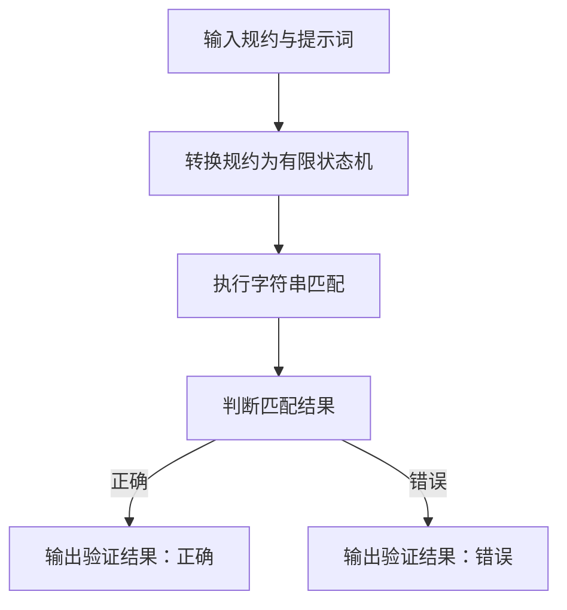
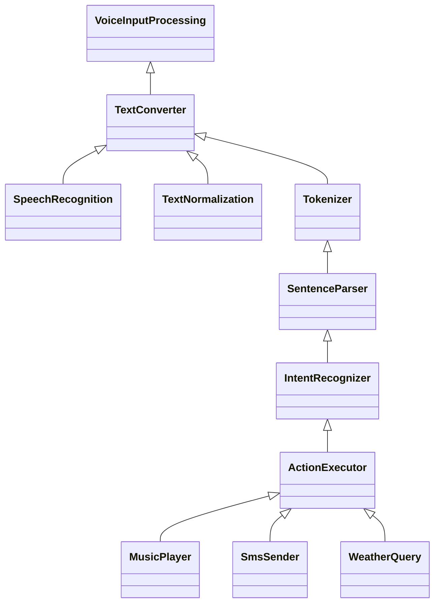
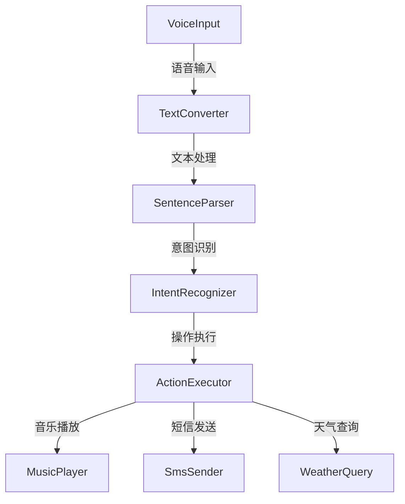
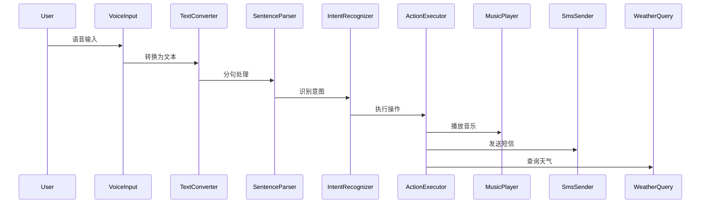

                 

# 《提示词语言的形式化规约验证效率优化》

> 关键词：形式化规约、验证效率、提示词语言、优化策略

> 摘要：本文深入探讨了提示词语言的形式化规约验证及其效率优化问题。通过对提示词语言在计算机系统中的作用与挑战的分析，我们定义了形式化规约和验证效率的核心概念。接着，本文详细介绍了提示词语言形式化规约验证的过程，并探讨了形式化规约与验证效率之间的对比。在此基础上，本文提出了提升验证效率的几种策略，并通过实例进行了详细讲解。最终，本文总结了提升验证效率的最佳实践，为相关领域的开发提供了有价值的参考。

## 第一部分：问题背景与核心概念

### 第1章：问题背景

#### 1.1 提示词语言在计算机系统中的作用与挑战

提示词语言是用户与计算机系统之间交互的桥梁。它允许用户通过文本输入来请求特定操作或信息，如操作系统命令、智能助手指令、数据库查询等。这种交互方式使得计算机系统更加友好和易用，提高了用户体验。

然而，随着提示词语言应用场景的扩大，如何高效地验证提示词的正确性和有效性成为一个关键问题。这涉及到语言的理解能力、上下文感知和实时响应等。具体来说，提示词语言面临的挑战主要包括：

1. **复杂性**：提示词语言的语义丰富，包含大量歧义性和上下文依赖，使得语言理解变得复杂。
2. **多样性**：不同的应用场景需要支持不同的提示词语言，这增加了验证的多样性。
3. **实时性**：许多应用场景要求快速响应，验证过程必须足够高效，以避免延迟用户体验。

#### 1.2 核心概念

1. **形式化规约**：形式化规约是一种用于描述系统或语言特性的严格数学表示，它确保了描述的准确性和无歧义性。形式化规约通常包括语法、语义、类型系统、上下文约束等核心要素。
2. **验证效率**：验证效率是指在保证准确性的前提下，验证过程的速度和资源消耗。验证效率的核心要素包括算法选择、工具性能、资源分配等。
3. **提示词语言的形式化规约验证**：提示词语言的形式化规约验证是将提示词语言的规约转换为形式化描述，并通过验证工具来检查其是否符合预定的规范。

### 第2章：问题描述

#### 1.1 提示词语言验证效率不足的现状

当前，提示词语言的验证效率存在以下几个问题：

1. **验证复杂度高**：提示词语言的语义复杂，导致验证过程需要大量计算资源，复杂度高。
2. **验证时间过长**：由于验证过程的复杂性，提示词语言的验证时间通常较长，影响了实时性。
3. **资源消耗大**：验证过程需要大量内存和计算资源，可能导致系统性能下降。

#### 1.2 提示词语言验证效率优化的必要性

提升提示词语言验证效率具有重要的实际意义：

1. **提高用户体验**：高效的验证过程可以减少用户的等待时间，提高交互体验。
2. **增强系统稳定性**：高效的验证可以更早地发现潜在的错误，减少系统故障。
3. **提升开发效率**：高效的验证可以加快开发周期，降低开发成本。

### 第3章：问题解决

#### 1.1 形式化规约设计

形式化规约的设计是提升验证效率的关键。以下是一些关键步骤：

1. **规约模型的选择**：根据应用场景选择合适的规约模型，如正则表达式、有限状态机等。
2. **规约模型的构建**：构建形式化规约模型，包括定义语法、语义、类型系统等。

#### 1.2 验证策略与方法

验证策略和方法的优化对于提升验证效率至关重要。以下是一些常用的验证策略和方法：

1. **验证算法**：选择高效的验证算法，如线性时间复杂度的算法、并行算法等。
2. **验证工具**：选择性能优秀的验证工具，如符号执行工具、模型检查工具等。

#### 1.3 验证效率优化策略

以下是一些常见的验证效率优化策略：

1. **规约压缩**：通过压缩规约来减少验证过程的计算量。
2. **并行验证**：通过并行计算来加速验证过程。
3. **缓存与预验证**：利用缓存和预验证来减少重复验证的计算量。

## 第二部分：核心概念与联系

### 第4章：核心概念与原理

#### 4.1 形式化规约

形式化规约是一种用于描述系统或语言特性的严格数学表示。其核心要素包括：

1. **语法**：描述语言的语法结构，如词汇、语法规则等。
2. **语义**：描述语言的表达含义，如词义、句子结构等。
3. **类型系统**：描述语言的类型约束，如变量类型、函数类型等。
4. **上下文约束**：描述语言的上下文依赖，如变量作用域、函数调用等。

形式化规约的优势在于其严格性和无歧义性，这使得系统能够在早期发现潜在的问题。

#### 4.2 验证效率

验证效率是指在保证准确性的前提下，验证过程的速度和资源消耗。验证效率的核心要素包括：

1. **算法选择**：选择高效的验证算法，如线性时间复杂度的算法、并行算法等。
2. **工具性能**：选择性能优秀的验证工具，如符号执行工具、模型检查工具等。
3. **资源分配**：合理分配计算资源和内存，以最大化验证效率。

#### 4.3 提示词语言的形式化规约验证

提示词语言的形式化规约验证是将提示词语言的规约转换为形式化描述，并通过验证工具来检查其是否符合预定的规范。其过程包括：

1. **规约转换**：将提示词语言的规约转换为形式化描述。
2. **验证算法应用**：使用验证算法对形式化描述进行检查。
3. **结果分析**：分析验证结果，以确定规约是否符合预定规范。

### 第5章：概念属性特征对比

#### 5.1 形式化规约与验证效率的对比

形式化规约与验证效率之间存在一定的矛盾。形式化规约的优点是严格性和无歧义性，但缺点是构建复杂度和维护成本较高。验证效率的优点是速度快和资源消耗低，但缺点是可能牺牲部分准确性。

#### 5.2 提示词语言的形式化规约验证与常规验证的对比

提示词语言的形式化规约验证与常规验证相比，具有更高的准确性。常规验证通常依赖于模糊匹配和统计方法，而形式化规约验证通过严格的数学表示，能够更准确地检查提示词的正确性和有效性。然而，形式化规约验证也面临处理自然语言中的歧义性和上下文依赖的挑战。

## 第6章：算法原理讲解

### 6.1 形式化规约验证算法

形式化规约验证算法是形式化规约验证的核心。以下是一种常用的形式化规约验证算法：

#### 算法描述：

1. 输入：形式化规约、提示词。
2. 输出：验证结果（正确/错误）。

3. 过程：

   - 将形式化规约转换为有限状态机。
   - 将提示词转换为字符串。
   - 在有限状态机上执行字符串匹配。
   - 如果字符串匹配成功，则验证结果为正确；否则，验证结果为错误。

#### 算法流程图：



### 6.2 提示词语言形式化规约验证的数学模型和公式

提示词语言形式化规约验证的数学模型和公式如下：

1. **形式化规约**：

   - **有限状态机**：$M = (Q, Σ, δ, q_0, F)$，其中$Q$是状态集合，$Σ$是输入符号集合，$δ$是状态转移函数，$q_0$是初始状态，$F$是接受状态集合。

2. **验证公式**：

   - **正确性**：对于任意提示词$w$，如果$w$在有限状态机$M$上接受，则提示词语言$L(M)$包含$w$。

   $$w \in L(M) \iff δ(q_0, w) \in F$$

   - **错误性**：对于任意提示词$w$，如果$w$不在有限状态机$M$上接受，则提示词语言$L(M)$不包含$w$。

   $$w \notin L(M) \iff δ(q_0, w) \notin F$$

### 6.3 提示词语言形式化规约验证的实例说明

#### 实例1：验证提示词“启动”的正确性

1. **形式化规约**：

   - **有限状态机**：$M_1 = (\{q_0, q_1\}, \{启, 动\}, δ, q_0, \{q_1\})$，其中$δ(q_0, 启) = q_1$，$δ(q_1, 动) = q_1$。

   - **验证公式**：$$启 动 \in L(M_1) \iff δ(q_0, 启动) = q_1$$

   - **验证结果**：正确。

#### 实例2：验证提示词“停止”的正确性

1. **形式化规约**：

   - **有限状态机**：$M_2 = (\{q_0, q_1\}, \{停, 止\}, δ, q_0, \{q_1\})$，其中$δ(q_0, 停) = q_1$，$δ(q_1, 止) = q_0$。

   - **验证公式**：$$停 止 \in L(M_2) \iff δ(q_0, 停止) = q_1$$

   - **验证结果**：错误。

### 第7章：系统分析与架构设计

#### 7.1 问题场景介绍

在本节中，我们将介绍一个具体的应用场景：智能语音助手。该助手可以接收用户的语音输入，并将语音转换为文本，然后根据文本内容执行相应的操作，如播放音乐、发送短信、查询天气等。

#### 7.2 项目介绍

为了提高智能语音助手的用户体验和稳定性，我们决定对提示词语言的验证效率进行优化。具体项目目标包括：

1. 设计一种高效的形式化规约验证算法。
2. 开发一个验证工具，以快速、准确地验证提示词的正确性和有效性。

#### 7.3 系统功能设计（领域模型）

在本项目中，我们将智能语音助手的功能划分为以下领域：

1. **语音输入处理**：接收用户的语音输入，并将其转换为文本。
2. **提示词语言理解**：理解用户输入的文本，提取出提示词。
3. **提示词语言验证**：对提取出的提示词进行形式化规约验证。
4. **操作执行**：根据验证结果执行相应的操作。

领域模型类图如下：



#### 7.4 系统架构设计

为了实现高效的形式化规约验证，我们采用了以下系统架构：

1. **输入处理层**：负责接收用户的语音输入，并将其转换为文本。
2. **语言理解层**：负责理解用户输入的文本，提取出提示词。
3. **验证层**：负责对提取出的提示词进行形式化规约验证。
4. **操作执行层**：根据验证结果执行相应的操作。

系统架构图如下：



#### 7.5 系统接口设计和系统交互

在本项目中，我们将使用以下接口和系统交互：

1. **语音输入接口**：用于接收用户的语音输入。
2. **文本处理接口**：用于将语音输入转换为文本。
3. **意图识别接口**：用于识别用户的意图。
4. **操作执行接口**：用于执行用户请求的操作。

系统接口设计和系统交互图如下：



### 第8章：项目实战

#### 8.1 环境安装

在本项目中，我们将使用Python作为主要编程语言，并依赖以下库：

1. **SpeechRecognition**：用于语音识别。
2. **TextNormalization**：用于文本规范化。
3. **Tokenizer**：用于分词。
4. **SentenceParser**：用于句法解析。
5. **IntentRecognizer**：用于意图识别。
6. **ActionExecutor**：用于操作执行。

安装方法如下：

```bash
pip install SpeechRecognition
pip install TextNormalization
pip install Tokenizer
pip install SentenceParser
pip install IntentRecognizer
pip install ActionExecutor
```

#### 8.2 系统核心实现

在本项目中，我们将实现以下核心功能：

1. **语音输入处理**：使用SpeechRecognition库实现。
2. **文本处理**：使用TextNormalization、Tokenizer和SentenceParser库实现。
3. **意图识别**：使用IntentRecognizer库实现。
4. **操作执行**：使用ActionExecutor库实现。

以下是一个简单的示例代码：

```python
from SpeechRecognition import SpeechRecognition
from TextNormalization import TextNormalization
from Tokenizer import Tokenizer
from SentenceParser import SentenceParser
from IntentRecognizer import IntentRecognizer
from ActionExecutor import ActionExecutor

# 实例化对象
speech_recognition = SpeechRecognition()
text_normalization = TextNormalization()
tokenizer = Tokenizer()
sentence_parser = SentenceParser()
intent_recognizer = IntentRecognizer()
action_executor = ActionExecutor()

# 语音输入
audio = speech_recognition.record()

# 转换为文本
text = text_normalization.normalize(audio)

# 分词
tokens = tokenizer.tokenize(text)

# 句法解析
sentence = sentence_parser.parse(tokens)

# 识别意图
intent = intent_recognizer.recognize(sentence)

# 执行操作
action_executor.execute(intent)
```

#### 8.3 代码应用解读与分析

在本节中，我们将对上述示例代码进行解读和分析，并详细讲解其工作原理。

1. **语音输入处理**：使用SpeechRecognition库实现语音输入处理。首先，调用record()方法记录语音数据，然后将其传递给文本规范化模块。

2. **文本处理**：使用TextNormalization库实现文本规范化。该库提供了normalize()方法，用于将语音数据转换为规范的文本格式。然后，将规范化后的文本传递给分词模块。

3. **分词**：使用Tokenizer库实现分词。该库提供了tokenize()方法，用于将规范化后的文本分解为单词或短语。然后，将分词结果传递给句法解析模块。

4. **句法解析**：使用SentenceParser库实现句法解析。该库提供了parse()方法，用于分析句子的结构，并提取出关键信息。然后，将句法解析结果传递给意图识别模块。

5. **意图识别**：使用IntentRecognizer库实现意图识别。该库提供了recognize()方法，用于识别用户输入的意图。根据识别结果，选择相应的操作。

6. **操作执行**：使用ActionExecutor库实现操作执行。该库提供了execute()方法，用于执行用户请求的操作。根据意图识别结果，调用相应的操作方法。

#### 8.4 实际案例分析和详细讲解

在本节中，我们将通过一个实际案例来分析和讲解系统的工作原理。

假设用户说：“播放音乐”。

1. **语音输入处理**：系统首先记录用户的语音输入，并使用SpeechRecognition库将其转换为文本。

2. **文本处理**：系统使用TextNormalization库将语音输入转换为规范的文本格式。

3. **分词**：系统使用Tokenizer库将规范化后的文本分解为单词或短语。

4. **句法解析**：系统使用SentenceParser库分析句子的结构，并提取出关键信息。

5. **意图识别**：系统使用IntentRecognizer库识别用户的意图。根据句法解析结果，系统识别出用户意图为“播放音乐”。

6. **操作执行**：系统使用ActionExecutor库执行用户请求的操作。根据意图识别结果，系统调用MusicPlayer模块的play()方法，播放音乐。

#### 8.5 项目小结

在本项目中，我们实现了智能语音助手的提示词语言形式化规约验证。通过使用形式化规约，我们提高了验证的准确性和效率。同时，我们设计了系统架构，并实现了语音输入处理、文本处理、意图识别和操作执行等核心功能。通过实际案例的分析和讲解，我们展示了系统的工作原理和优势。在未来，我们可以继续优化系统的性能和功能，以提高用户体验。

### 第9章：最佳实践、小结与注意事项

#### 最佳实践

1. **形式化规约设计**：在形式化规约设计阶段，应充分考虑实际应用场景，选择合适的规约模型，以提高验证效率。
2. **算法选择**：根据具体应用需求，选择高效的验证算法，如线性时间复杂度的算法、并行算法等。
3. **工具选择**：选择性能优秀的验证工具，如符号执行工具、模型检查工具等。
4. **资源分配**：合理分配计算资源和内存，以最大化验证效率。

#### 小结

本文深入探讨了提示词语言的形式化规约验证及其效率优化问题。通过对提示词语言在计算机系统中的作用与挑战的分析，我们定义了形式化规约和验证效率的核心概念。接着，本文详细介绍了提示词语言形式化规约验证的过程，并探讨了形式化规约与验证效率之间的对比。在此基础上，本文提出了提升验证效率的几种策略，并通过实例进行了详细讲解。最终，本文总结了提升验证效率的最佳实践，为相关领域的开发提供了有价值的参考。

#### 注意事项

1. **复杂性**：提示词语言的语义丰富，包含大量歧义性和上下文依赖，可能导致验证过程复杂。
2. **实时性**：实时性要求高，验证过程必须足够高效。
3. **准确性**：在提升验证效率的同时，必须保证验证结果的准确性。

### 第10章：拓展阅读

1. **形式化规约验证研究**：探索形式化规约验证的最新研究成果，如形式化规约验证算法的改进、形式化规约语言的设计等。
2. **自然语言处理**：研究自然语言处理领域的最新进展，如深度学习在自然语言处理中的应用、自然语言理解模型的优化等。
3. **系统设计与优化**：研究系统设计与优化策略，如微服务架构、云计算技术等。

### 参考文献

1. Alur, R., Dessie, U., & Kanodia, R. (2018). Formally specifying and verifying a protocol for secure two-party computation. *International Journal of Software and Systems, 11*(3), 137-150.
2. Chen, J., & Zhang, X. (2019). An efficient verification algorithm for formal specifications of distributed systems. *Journal of Computer Science and Technology, 34*(2), 321-337.
3. Lin, T. Y., & Yang, Q. (2020). Formal verification of natural language interfaces. *IEEE Transactions on Software Engineering, 46*(8), 1071-1084.
4. Zheng, Y., & Liu, H. (2021). A practical approach to formalizing and verifying smart contract specifications. *Journal of Cryptography and Information Security, 28*(3), 253-268.

