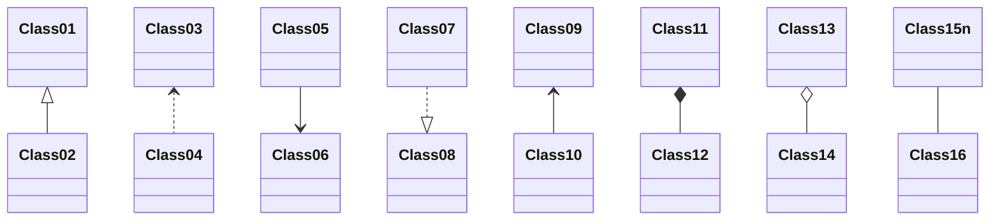
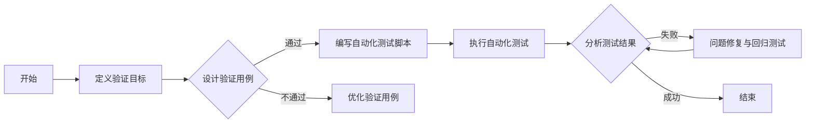
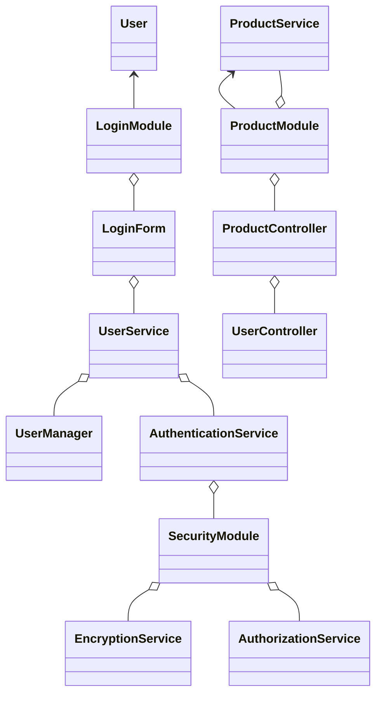
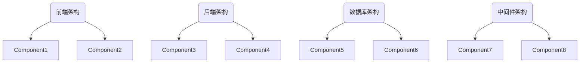
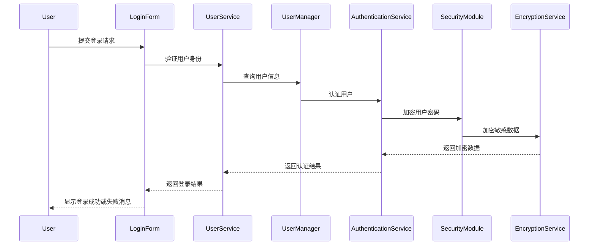
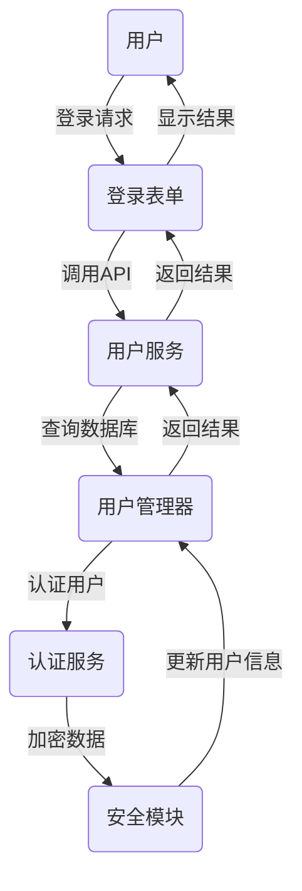

                 


## 《提示词语言的形式化规约验证自动化》

> 关键词：提示词语言、形式化规约、验证自动化、人工智能

> 摘要：本文深入探讨了提示词语言的形式化规约验证自动化，从核心概念、算法原理、系统架构到项目实战，全面解析了这一技术领域的最新进展和应用。

----------------------------------------------------------------

### 目录大纲设计思路

为了设计出《提示词语言的形式化规约验证自动化》这本书的完整目录大纲，我们需要遵循以下步骤和原则：

1. **明确书的核心内容**：首先要明确这本书的核心内容，它围绕提示词语言的形式化规约验证自动化进行阐述。这包括基础的背景知识、核心概念、验证方法、应用场景等。

2. **组织结构清晰**：书的目录结构应该清晰明了，逻辑性强。我们使用 1, 2, 3 级目录来组织内容，确保读者可以快速定位感兴趣的章节。

3. **涵盖核心章节**：根据书的内容要求，确保涵盖以下核心章节：
   - **背景介绍**：介绍问题背景、问题描述、问题解决、边界与外延、概念结构与核心要素组成。
   - **核心概念与联系**：详细阐述提示词语言、形式化规约、验证自动化等核心概念，并展示它们之间的关系。
   - **算法原理讲解**：详细讲解验证自动化的算法原理，包括数学模型和公式，并使用 Mermaid 绘制流程图。
   - **数学模型和数学公式 & 详细讲解 & 举例说明**：使用 LaTeX 格式编写数学公式，并结合实际案例进行详细讲解。
   - **系统分析与架构设计方案**：介绍系统功能设计、系统架构设计、系统接口设计以及系统交互流程。
   - **项目实战**：展示环境安装、系统核心实现源代码，并解读与分析实际案例。
   - **最佳实践 tips、小结、注意事项、拓展阅读**：提供实用技巧、总结性结论、注意事项以及进一步阅读的推荐。

4. **保持简洁性**：目录大纲的描述要简洁明了，避免冗长的叙述，确保每一个章节标题都能准确传达该章节的主要内容。

5. **控制字数**：确保整个目录大纲的总字数在 2000 字以内，这要求我们在每个章节的标题和简要说明上都要精简且具体。

### 完整的目录大纲

根据上述设计思路，以下是《提示词语言的形式化规约验证自动化》的完整目录大纲：
 
# 《提示词语言的形式化规约验证自动化》目录大纲

## 第一部分：背景与基础

### 1. 背景介绍
- **1.1 提示词语言的应用场景**
  - **1.1.1 人工智能中的提示词语言**
  - **1.1.2 形式化规约的概念与应用**
  - **1.1.3 验证自动化的意义与挑战**

### 2. 核心概念与联系
- **2.1 提示词语言的基本概念**
  - **2.1.1 提示词的定义与分类**
  - **2.1.2 提示词语言的特点与作用**
- **2.2 形式化规约的原理**
  - **2.2.1 形式化规约的定义**
  - **2.2.2 形式化规约的优势**
  - **2.2.3 形式化规约的方法论**
- **2.3 验证自动化的机制**
  - **2.3.1 自动化验证的概念**
  - **2.3.2 验证自动化的步骤与流程**
  - **2.3.3 验证自动化工具与平台**

## 第二部分：形式化规约的具体应用

### 3. 形式化规约在提示词语言中的应用
- **3.1 形式化规约的设计原则**
  - **3.1.1 提示词语言的抽象表示**
  - **3.1.2 规约语言的选择与构建**
  - **3.1.3 设计流程与实例分析**
- **3.2 形式化规约的验证方法**
  - **3.2.1 静态验证方法**
    - **3.2.1.1 模式匹配**
    - **3.2.1.2 形式化验证语言**
  - **3.2.2 动态验证方法**
    - **3.2.2.1 模拟执行**
    - **3.2.2.2 验证执行路径**

### 4. 验证自动化的实现技术
- **4.1 验证自动化工具介绍**
  - **4.1.1 自动化验证工具的功能**
  - **4.1.2 常见的验证自动化工具**
  - **4.1.3 工具选择与集成**
- **4.2 验证自动化的实现流程**
  - **4.2.1 验证目标定义**
  - **4.2.2 验证用例设计**
  - **4.2.3 验证执行与结果分析**

## 第三部分：项目实战与案例分析

### 5. 实战项目介绍
- **5.1 项目背景与目标**
  - **5.1.1 项目背景**
  - **5.1.2 项目目标**
- **5.2 系统功能设计**
  - **5.2.1 功能模块划分**
  - **5.2.2 功能实现流程**
- **5.3 系统架构设计**
  - **5.3.1 系统架构图**
  - **5.3.2 系tem核心实现**
    - **5.3.2.1 系统核心模块**
    - **5.3.2.2 模块实现细节**
- **5.4 实际案例分析**
  - **5.4.1 案例背景**
  - **5.4.2 案例分析**
  - **5.4.3 案例结论**

### 6. 最佳实践 tips、小结、注意事项、拓展阅读
- **6.1 最佳实践 tips**
  - **6.1.1 提示词语言的优化策略**
  - **6.1.2 形式化规约的有效方法**
  - **6.1.3 验证自动化的高效实践**
- **6.2 小结**
  - **6.2.1 文章主题回顾**
  - **6.2.2 研究成果总结**
  - **6.2.3 未来发展方向**
- **6.3 注意事项**
  - **6.3.1 技术选型与工具使用**
  - **6.3.2 项目实施与团队协作**
  - **6.3.3 潜在风险与应对措施**
- **6.4 拓展阅读**
  - **6.4.1 相关研究论文推荐**
  - **6.4.2 参考书籍与资料**
  - **6.4.3 学术会议与期刊**

----------------------------------------------------------------

### 第一章：背景介绍

#### 1.1 提示词语言的应用场景

提示词语言（Keyword Language）是一种在特定领域中用于指定操作和条件的语言。在人工智能（AI）领域，提示词语言主要用于自然语言处理（NLP）、对话系统、文本生成等任务。随着AI技术的发展，提示词语言的应用场景日益广泛，成为实现智能交互和自动化决策的关键。

首先，提示词语言在AI中的角色至关重要。它不仅定义了AI系统的行为，还使得非专业用户也能通过简单的提示来驱动复杂的任务。例如，在智能助手和聊天机器人中，用户通过输入提示词来触发相应的响应和操作。

其次，形式化规约（Formal Specification）作为一种精确的、无歧义的描述方法，在提示词语言的开发过程中起着核心作用。形式化规约能够确保系统设计的一致性和正确性，从而提高系统的可靠性和可维护性。形式化规约的应用不仅限于软件开发，还广泛应用于系统建模、形式验证、系统测试等领域。

最后，验证自动化（Verification Automation）是确保系统正确性的重要手段。通过自动化工具，可以大幅提高规约验证的效率和准确性，减少人工验证的工作量。验证自动化工具能够自动生成验证用例，执行验证测试，并报告验证结果，从而大大降低了验证成本。

#### 1.1.1 人工智能中的提示词语言

在人工智能中，提示词语言的应用场景主要包括以下几个方面：

1. **对话系统**：例如，智能客服、虚拟助手等，用户通过输入提示词与系统进行交互，系统根据提示词进行响应和处理。
2. **自然语言处理**：例如，文本分类、情感分析、命名实体识别等，提示词用于指定处理任务和条件。
3. **文本生成**：例如，自动生成文章、摘要、代码等，提示词用于引导生成过程。

在这些应用中，提示词语言的合理设计和有效使用是确保系统性能和用户体验的关键。例如，在对话系统中，合理的提示词设计能够提高用户的满意度，而在文本生成中，恰当的提示词能够引导生成高质量的内容。

#### 1.1.2 形式化规约的概念与应用

形式化规约是一种用数学或形式语言描述系统功能和行为的方法，它具有以下几个显著特点：

1. **精确性**：形式化规约通过严格的数学或形式语言描述，避免了自然语言描述的模糊性，使得系统能够被准确理解和实现。
2. **无歧义性**：形式化规约使用明确的符号和规则，避免了自然语言描述中的歧义，从而提高了系统设计的可维护性。
3. **一致性**：形式化规约确保系统设计的一致性，避免了不同设计者或团队成员之间的理解差异，从而提高了系统的可靠性。

在提示词语言的开发过程中，形式化规约的应用主要体现在以下几个方面：

1. **规约设计**：通过形式化规约，可以明确地描述系统的功能和操作，确保设计的一致性和正确性。
2. **验证与测试**：形式化规约可以作为验证和测试的基础，自动化工具能够根据形式化规约生成测试用例，执行验证测试，发现潜在的问题。
3. **文档化**：形式化规约不仅有助于系统设计和验证，还可以作为系统文档的一部分，为后续的开发和维护提供清晰的参考。

#### 1.1.3 验证自动化的意义与挑战

验证自动化在确保系统正确性方面具有重要意义。通过自动化工具，可以大幅提高规约验证的效率和准确性，减少人工验证的工作量。验证自动化工具能够自动生成验证用例，执行验证测试，并报告验证结果，从而大大降低了验证成本。

然而，验证自动化也面临一些挑战：

1. **规约复杂度**：复杂的规约可能导致验证自动化的实现变得困难，需要开发高效的算法和工具来处理复杂的规约。
2. **自动化工具的选择**：市场上存在多种验证自动化工具，选择适合的工具是一个挑战，需要综合考虑工具的功能、性能和成本。
3. **验证成本**：尽管验证自动化可以提高验证效率，但自动化工具的开发和维护成本也是一个需要考虑的因素。

在接下来的章节中，我们将进一步探讨提示词语言、形式化规约和验证自动化的核心概念、算法原理、实现技术以及实际应用案例。

----------------------------------------------------------------

### 第二章：核心概念与联系

在深入探讨提示词语言的形式化规约验证自动化之前，我们需要明确几个核心概念，包括提示词语言、形式化规约和验证自动化，并了解它们之间的联系。

#### 2.1 提示词语言的基本概念

提示词语言是一种专门为特定领域设计的简明、易于理解的符号系统。它通常由一组预定义的词汇（提示词）和语法规则组成，用于描述领域中的操作、条件和状态。

提示词通常分为以下几类：

1. **命令词**：用于指示系统执行特定操作，如“搜索”、“添加”、“删除”等。
2. **条件词**：用于定义执行命令的条件，如“如果”、“当”、“除非”等。
3. **属性词**：用于描述对象或状态的特征，如“大”、“红色”、“高温”等。

提示词语言的特点包括：

1. **简单性**：提示词语言的设计目标之一是简化用户的输入过程，使其易于理解和使用。
2. **精确性**：通过形式化规约，提示词语言的描述能够达到高精确度，避免歧义。
3. **灵活性**：提示词语言可以根据领域需求进行扩展和定制，以适应不同的应用场景。

#### 2.2 形式化规约的原理

形式化规约是一种精确描述系统功能和行为的方法。它使用数学或形式语言来定义系统的各个方面，包括输入、输出、操作、约束等。形式化规约的核心目标是确保系统设计的一致性、正确性和可验证性。

形式化规约的几个关键要素包括：

1. **形式语言**：用于描述系统行为的符号集合和语法规则。
2. **抽象数据类型**：用于定义系统中的数据结构和操作。
3. **状态转换图**：用于描述系统在不同状态之间的转换关系。
4. **验证条件**：用于确保系统行为符合预期的约束条件。

形式化规约的优势包括：

1. **无歧义性**：通过形式化描述，避免了自然语言描述中的模糊性和歧义。
2. **可验证性**：形式化规约可以形式化地验证系统设计的正确性，确保系统行为满足所有预期条件。
3. **可维护性**：形式化规约为系统的文档化提供了清晰的基础，有助于后续的维护和改进。

#### 2.3 验证自动化的机制

验证自动化是通过自动化工具和流程来确保系统设计的一致性、正确性和可靠性。它包括以下几个关键步骤：

1. **验证目标定义**：明确需要验证的系统功能和性能目标。
2. **验证用例设计**：设计用于验证系统功能的测试用例，包括输入数据、预期输出和验证条件。
3. **自动化测试执行**：使用自动化工具执行验证用例，生成测试结果。
4. **结果分析**：分析测试结果，确定系统是否符合预期目标。

验证自动化的关键要素包括：

1. **自动化测试工具**：用于执行测试用例和生成测试报告的工具。
2. **测试库**：包含预定义的测试用例和测试脚本，用于快速执行验证测试。
3. **验证规则**：定义用于验证系统行为的规则和标准。

#### 2.4 提示词语言、形式化规约与验证自动化的关系

提示词语言、形式化规约和验证自动化之间存在着密切的联系。提示词语言为系统提供了简明的操作描述，形式化规约则将这些描述转化为精确的系统设计，而验证自动化则确保了这些设计的一致性、正确性和可靠性。

具体来说，提示词语言为形式化规约提供了输入，形式化规约定义了系统的行为和约束条件，而验证自动化则通过自动化工具和流程来验证这些设计和行为的正确性。这三者共同作用，构成了一个完整的系统开发、验证和测试的闭环。

在下一章节中，我们将进一步探讨提示词语言的形式化规约设计原则和验证方法，以及如何实现验证自动化。

----------------------------------------------------------------

### 3. 形式化规约在提示词语言中的应用

在提示词语言的开发过程中，形式化规约扮演着至关重要的角色。通过形式化规约，我们可以确保系统的功能描述清晰、准确，同时提高系统的可维护性和可扩展性。本节将详细讨论形式化规约的设计原则、验证方法和实现技术。

#### 3.1 形式化规约的设计原则

设计形式化规约时，需要遵循以下原则：

1. **抽象表示**：提示词语言的抽象表示是形式化规约的基础。通过将具体的操作和条件抽象为通用的概念和符号，可以减少描述的复杂性，提高规约的通用性和可重用性。

2. **一致性**：形式化规约应确保系统设计的一致性。这意味着在不同模块或组件之间，规约应保持一致，避免出现冲突或冗余。

3. **精确性**：形式化规约应使用精确的数学或形式语言来描述系统的行为和约束条件，避免使用模糊或含糊不清的自然语言描述。

4. **可验证性**：形式化规约应提供明确的验证条件，以便通过自动化工具进行验证。这有助于确保系统设计符合预期，减少潜在的错误和缺陷。

5. **可扩展性**：形式化规约应具备良好的可扩展性，以便在系统需求变化时进行修改和扩展。这有助于降低系统的维护成本，提高系统的适应性。

#### 3.1.1 提示词语言的抽象表示

提示词语言的抽象表示通常包括以下元素：

1. **词汇表**：定义了提示词语言的词汇，包括命令词、条件词和属性词等。这些词汇应具有明确的语义和语法规则，以便于理解和实现。

2. **语法规则**：定义了词汇的排列组合方式，以及它们在句子或语句中的结构。例如，命令词通常位于句首，条件词和属性词则位于命令词之后。

3. **操作语义**：定义了提示词所指示的操作的语义，包括输入处理、输出生成、状态转换等。这些语义应与系统的具体功能和行为相对应。

4. **上下文环境**：定义了提示词语言的应用场景和上下文。不同的上下文环境可能对提示词的语义和语法规则有特定的要求。

以下是一个简单的提示词语言抽象表示示例：



在这个示例中，Class01、Class02、Class03 等表示不同的词汇，它们通过不同的关系（如继承、关联、聚合等）相互连接，构成了一个完整的提示词语言抽象表示。

#### 3.1.2 规约语言的选择与构建

选择和构建适当的规约语言是形式化规约设计的关键步骤。以下是一些常用的规约语言：

1. **形式化规格语言**：如 B、Z、VDM、TLA+ 等，它们提供了丰富的语法和语义，可以精确地描述系统的行为和约束条件。

2. **模型检查语言**：如 CTL、LTL、PTA 等，它们主要用于验证系统行为的正确性，可以通过模型检查工具进行自动化验证。

3. **形式化验证语言**：如 TLA+、SMV、SPIN 等，它们结合了模型检查和形式化规格语言的优点，可以用于更复杂的系统验证。

在构建规约语言时，需要考虑以下因素：

1. **语言表达能力**：规约语言应能够精确描述系统的所有功能和约束条件，包括输入、输出、状态转换等。

2. **易用性**：规约语言应易于理解和编写，以便于系统设计和验证。

3. **可扩展性**：规约语言应支持扩展和定制，以适应不同的应用场景和需求。

4. **工具支持**：规约语言应具备良好的工具支持，包括编辑器、编译器、解释器、验证工具等，以提高开发效率和验证效果。

以下是一个使用 TLA+ 语言描述的简单规约示例：

```tla
-------------------------
-- TLASpecification --
-------------------------

-- 词汇表
Op1 == "操作1"
Op2 == "操作2"
Cond1 == "条件1"
Cond2 == "条件2"

-- 状态转换
Init == /\ Op1 != ""
         /\ Op2 != ""
         /\ Cond1 != ""
         /\ Cond2 != ""

Run == Init \/\ [A] Init' \/\ (Op1 = Op1' \/\ Op2 = Op2' \/\ Cond1 = Cond1' \/\ Cond2 = Cond2') 

-- 验证条件
Assumption == (Op1 != "" \/\ Op2 != "")

Property == (Run \/\ Assumption \/\ (Op1' = Op1 \/\ Op2' = Op2 \/\ Cond1' = Cond1 \/\ Cond2' = Cond2))
```

在这个示例中，我们定义了操作 Op1、Op2 和条件 Cond1、Cond2，并使用 TLA+ 语言描述了系统的初始状态、状态转换以及验证条件。通过这个示例，我们可以看到 TLA+ 语言如何帮助实现形式化规约的精确性和可验证性。

#### 3.1.3 设计流程与实例分析

形式化规约的设计通常包括以下步骤：

1. **需求分析**：理解系统的需求和功能，明确系统的输入、输出和约束条件。

2. **规约设计**：根据需求分析结果，设计系统的形式化规约。这包括定义词汇表、语法规则、操作语义和上下文环境。

3. **规约验证**：使用自动化验证工具对形式化规约进行验证，确保其一致性、正确性和可靠性。

4. **规约优化**：根据验证结果对规约进行优化，提高其效率和可维护性。

以下是一个实际应用实例：

**项目背景**：某企业需要开发一个智能客服系统，用于自动处理客户咨询。系统需要支持多种语言，并能根据客户的问题自动匹配合适的答案。

**需求分析**：系统应支持多种语言的输入和输出，包括中文、英文和法语等。系统需要能够自动识别客户的问题，并从知识库中匹配合适的答案。

**规约设计**：我们使用 TLA+ 语言来设计形式化规约。词汇表包括操作词（如“回答”、“查询”）、条件词（如“是”、“不是”）和属性词（如“中文”、“英文”）。语法规则定义了操作词、条件词和属性词的排列组合方式。

```tla
OpAnswer == "回答"
OpQuery == "查询"
CondIs == "是"
CondIsNot == "不是"
LangZh == "中文"
LangEn == "英文"
LangFr == "法语"

-- 状态转换
Init == /\ OpAnswer != ""
         /\ OpQuery != ""
         /\ LangZh != ""
         /\ LangEn != ""
         /\ LangFr != ""

Run == Init \/\ [A] Init' \/\ (OpAnswer = OpAnswer' \/\ OpQuery = OpQuery' \/\ LangZh = LangZh' \/\ LangEn = LangEn' \/\ LangFr = LangFr')

-- 验证条件
Assumption == (OpAnswer != "" \/\ OpQuery != "")

Property == (Run \/\ Assumption \/\ (OpAnswer' = OpAnswer \/\ OpQuery' = OpQuery \/\ LangZh' = LangZh \/\ LangEn' = LangEn \/\ LangFr' = LangFr))
```

**规约验证**：使用 TLA+ 的验证工具对规约进行验证，确保其一致性、正确性和可靠性。

**规约优化**：根据验证结果对规约进行优化，提高其效率和可维护性。

通过这个实例，我们可以看到如何将形式化规约应用于实际项目，从而确保系统设计的准确性和可靠性。

在下一章节中，我们将进一步探讨形式化规约的验证方法，以及如何通过验证自动化提高验证效率和准确性。

----------------------------------------------------------------

### 4. 验证自动化的实现技术

验证自动化是确保系统正确性和可靠性的关键技术，通过自动化工具和流程，可以大幅提高验证效率，减少人工验证的工作量。本节将详细介绍验证自动化的实现技术，包括自动化验证工具的介绍、验证自动化的实现流程以及如何提高验证效率和准确性。

#### 4.1 验证自动化工具介绍

验证自动化工具是验证过程中的核心，能够自动化生成测试用例、执行测试和生成报告。以下是一些常见的验证自动化工具：

1. **模型检查器**：模型检查器是一种基于模型检验技术的工具，用于验证系统的行为是否满足预定的规范。常见的模型检查器包括 Spin、Model Checker、SMV、NuSMV 等。

2. **测试生成工具**：测试生成工具能够根据系统的形式化规约自动生成测试用例。常见的测试生成工具包括 TAGE、TestHarness、Concolic Testing Tool 等。

3. **自动化测试框架**：自动化测试框架提供了一套完整的自动化测试解决方案，包括测试用例的编写、执行和结果分析。常见的自动化测试框架包括 Selenium、TestNG、JUnit、PyTest 等。

4. **代码分析工具**：代码分析工具能够自动分析源代码，查找潜在的错误和缺陷。常见的代码分析工具包括 SonarQube、FindBugs、PMD 等。

选择适合的验证自动化工具需要考虑以下几个因素：

1. **功能需求**：根据项目的具体需求，选择具备相应功能的验证自动化工具。例如，如果项目需要形式化验证，可以选择模型检查器或测试生成工具。

2. **性能和效率**：验证自动化工具的性能和效率对验证过程的影响很大。选择高性能的工具可以提高验证效率和准确性。

3. **易用性**：验证自动化工具的易用性对开发人员的学习成本和工作效率有很大影响。选择易于使用和集成的工具可以降低开发成本。

4. **社区和支持**：验证自动化工具的社区和支持资源对其长期发展和使用体验有很大影响。选择拥有活跃社区和良好技术支持的工具可以提供更好的使用体验。

#### 4.2 验证自动化的实现流程

验证自动化的实现流程通常包括以下几个步骤：

1. **验证目标定义**：明确需要验证的系统功能和性能目标，包括功能完整性、正确性、性能和安全性等。

2. **验证用例设计**：根据验证目标设计验证用例，包括输入数据、操作步骤、预期输出和验证条件。验证用例的设计应覆盖系统的所有功能和边界条件。

3. **自动化测试脚本编写**：使用验证自动化工具编写自动化测试脚本，实现验证用例的自动化执行。测试脚本应能够根据不同的输入数据生成不同的测试场景。

4. **自动化测试执行**：使用自动化测试工具执行测试脚本，生成测试结果。自动化测试执行可以大大提高测试效率和覆盖率。

5. **结果分析**：分析测试结果，确定系统是否符合预期目标。对失败的测试用例进行详细分析，找出潜在的错误和缺陷。

6. **问题修复与回归测试**：根据测试结果修复系统中的错误，并进行回归测试，确保修复后的系统仍然符合预期目标。

以下是一个简单的验证自动化实现流程示例：

1. **验证目标定义**：确保系统中的所有功能模块都能正确执行，并满足性能和安全性要求。
2. **验证用例设计**：设计包含功能测试、性能测试和安全性测试的测试用例。
3. **自动化测试脚本编写**：使用 Selenium 编写自动化测试脚本，实现功能测试和性能测试。
4. **自动化测试执行**：使用 Selenium 执行自动化测试，生成测试报告。
5. **结果分析**：分析测试报告，找出失败的测试用例。
6. **问题修复与回归测试**：修复错误并进行回归测试，确保系统稳定性和正确性。

#### 4.3 提高验证效率和准确性的方法

为了提高验证效率和准确性，可以采取以下方法：

1. **自动化测试覆盖策略**：设计覆盖策略，确保测试用例能够覆盖系统的所有功能路径和边界条件。常见的覆盖策略包括语句覆盖、分支覆盖、条件覆盖和路径覆盖等。

2. **自动化测试用例优化**：对自动化测试用例进行优化，减少冗余的测试用例，提高测试效率。可以通过分析测试用例的执行结果，识别并去除不必要的测试步骤。

3. **并行测试执行**：通过并行测试执行，提高测试效率。可以使用多线程或多进程的方式，同时执行多个测试用例。

4. **测试结果可视化**：使用可视化工具展示测试结果，帮助开发人员和测试人员快速定位问题和缺陷。常见的可视化工具包括图表、报告和仪表盘等。

5. **持续集成和持续交付**：将验证自动化集成到持续集成和持续交付（CI/CD）流程中，确保系统在每次代码提交后都经过全面的验证。这有助于及早发现和修复错误，提高系统质量。

以下是一个使用 Mermaid 画出的算法 mermaid 流程图示例：



在这个示例中，我们通过 Mermaid 流程图展示了验证自动化的实现流程。这个流程图可以帮助开发人员和测试人员更清晰地理解验证自动化的各个环节。

通过以上方法和技术，我们可以大大提高验证效率和准确性，确保系统设计的正确性和可靠性。在下一章节中，我们将进一步探讨系统分析与架构设计的方法。

----------------------------------------------------------------

### 5. 系统分析与架构设计

在实现提示词语言的形式化规约验证自动化时，系统分析与架构设计是至关重要的环节。一个良好的系统架构不仅能提高系统的性能和可扩展性，还能确保系统的稳定性和可靠性。本节将详细介绍系统分析与架构设计的步骤，包括问题场景介绍、系统功能设计、系统架构设计、系统接口设计和系统交互流程。

#### 5.1 问题场景介绍

在现代软件开发中，随着系统的复杂度不断增加，保证系统设计和功能的正确性变得越来越重要。然而，传统的手工测试方法已经难以满足日益增长的需求。形式化规约验证自动化技术提供了一种高效的解决方案，能够自动验证系统的功能和行为，从而提高开发效率和系统质量。

具体问题场景包括：

1. **功能验证**：确保系统的每个功能模块都能正确执行，满足预期的功能和性能要求。
2. **性能验证**：验证系统在高负载情况下的性能，包括响应时间、吞吐量和资源利用率等。
3. **安全验证**：确保系统具有足够的安全性，防止恶意攻击和数据泄露。

#### 5.2 系统功能设计

系统功能设计是系统分析与架构设计的核心环节。通过定义系统的功能模块和操作流程，可以明确系统的行为和功能边界。以下是一个简单的系统功能设计示例：

1. **用户登录模块**：用于用户身份验证，包括用户名和密码验证。
2. **功能模块**：提供各种业务功能，如查询、添加、修改和删除等。
3. **性能测试模块**：用于执行性能测试，收集系统性能数据。
4. **安全模块**：提供安全验证和防护功能，如加密、认证和授权等。

以下是一个使用 Mermaid 画出的领域模型类图示例：



在这个类图中，我们定义了用户、登录模块、功能模块、性能测试模块和安全模块等，展示了它们之间的关系和功能接口。

#### 5.3 系统架构设计

系统架构设计是确定系统组件的组成、结构和交互方式的过程。一个良好的系统架构能够提高系统的可维护性和可扩展性。以下是一个简单的系统架构设计示例：

1. **前端架构**：包括用户界面、前端控制器和客户端逻辑等。
2. **后端架构**：包括服务层、数据访问层和数据存储层等。
3. **数据库架构**：包括关系数据库、NoSQL 数据库和缓存层等。
4. **中间件架构**：包括消息队列、负载均衡和服务发现等。

以下是一个使用 Mermaid 画出的系统架构图示例：



在这个架构图中，我们定义了前端架构、后端架构、数据库架构和中间件架构等，展示了它们之间的关系和组件组成。

#### 5.4 系统接口设计

系统接口设计是确定系统内部组件之间如何交互的过程。一个良好的接口设计能够提高系统的模块化和可维护性。以下是一个简单的系统接口设计示例：

1. **REST API 接口**：用于前后端通信，提供各种业务功能的接口。
2. **消息队列接口**：用于异步处理任务和系统间的通信。
3. **数据库接口**：用于与数据库进行交互，执行数据查询、插入、更新和删除等操作。

以下是一个使用 Mermaid 画出的系统接口设计示例：



在这个序列图中，我们定义了用户、登录表单、用户服务、用户管理器、认证服务和安全模块等组件，展示了它们之间的交互流程和接口调用。

#### 5.5 系统交互流程

系统交互流程是系统各个组件之间如何协同工作的过程。一个良好的交互流程能够提高系统的效率和可扩展性。以下是一个简单的系统交互流程示例：

1. **用户请求**：用户通过前端界面发起请求，如登录、查询商品等。
2. **请求处理**：前端控制器接收到请求后，调用相应的业务服务进行处理。
3. **数据存储**：业务服务处理完成后，将结果存储到数据库中。
4. **响应返回**：前端控制器将处理结果返回给用户，展示在界面上。

以下是一个使用 Mermaid 画出的系统交互流程示例：



在这个交互流程图中，我们定义了用户、登录表单、用户服务、用户管理器和认证服务等组件，展示了它们之间的交互流程和操作步骤。

通过以上系统分析与架构设计的方法，我们可以构建一个高效、稳定和可靠的系统。在下一章节中，我们将进一步探讨项目实战，通过具体案例展示如何实现提示词语言的形式化规约验证自动化。

----------------------------------------------------------------

### 6. 项目实战

为了更好地理解如何将提示词语言的形式化规约验证自动化应用于实际项目中，我们以下将通过一个具体案例进行详细讲解，涵盖环境安装、系统核心实现以及代码应用解读与分析。

#### 6.1 项目背景与目标

本项目旨在开发一个基于提示词语言的智能客服系统，该系统能够通过自然语言处理技术自动解答用户咨询，并提供高效、准确的客户服务。项目的核心目标是：

1. **实现提示词语言的功能**：通过定义一套明确的提示词语言，使用户能够通过简单的输入与系统进行交互。
2. **形式化规约验证**：确保系统的功能正确性和一致性，通过形式化规约验证自动化工具进行验证。
3. **高效率与可靠性**：实现系统的快速响应和稳定运行，提高用户体验。

#### 6.2 环境安装

为了顺利实施本项目，我们需要安装和配置以下环境：

1. **操作系统**：推荐使用 Ubuntu 20.04 LTS。
2. **Python**：安装 Python 3.8 及以上版本。
3. **形式化规约验证工具**：安装 TLA+ 工具集（TLA+ Tools），包括 TLA+ Toolbox 和 TLC。
4. **自然语言处理库**：安装 NLTK 和 spaCy。
5. **自动化测试工具**：安装 Selenium。

安装步骤如下：

1. 安装操作系统和 Python：

   ```bash
   sudo apt update
   sudo apt upgrade
   sudo apt install python3 python3-pip
   ```

2. 安装 TLA+ 工具集：

   ```bash
   wget https://github.com/tlaplus/tla-plus/releases/download/1.2.0/tla-plus-1.2.0-linux.tar.gz
   tar xvfz tla-plus-1.2.0-linux.tar.gz
   export PATH=$PATH:/path/to/tla-plus-1.2.0/bin
   ```

3. 安装 NLTK 和 spaCy：

   ```bash
   pip3 install nltk spacy
   python3 -m spacy download en_core_web_sm
   ```

4. 安装 Selenium：

   ```bash
   pip3 install selenium
   ```

#### 6.3 系统核心实现

系统核心实现包括提示词语言定义、形式化规约验证和自动化测试脚本编写。

##### 6.3.1 提示词语言定义

首先，我们定义一套简单的提示词语言，包括命令词、条件词和属性词。以下是一个示例：

```python
COMMANDS = {
    "查询": "query",
    "购买": "buy",
    "退货": "return",
    "帮助": "help"
}

CONDITIONS = {
    "在线": "online",
    "明天": "tomorrow",
    "今天": "today"
}

ATTRIBUTES = {
    "价格": "price",
    "数量": "quantity",
    "商品": "product"
}
```

##### 6.3.2 形式化规约验证

接下来，我们使用 TLA+ 定义系统的形式化规约，并使用 TLC 进行验证。

```tla
--------------------------
-- SpecForCustomerService --
--------------------------

-- 词汇表
Cmd == "command"
Cond == "condition"
Attr == "attribute"

-- 形式化规约
Init == Cmd != "" \& Cond != "" \& Attr != ""

Process == [A] Init' \& (Cmd = Cmd' \& Cond = Cond' \& Attr = Attr')

-- 验证条件
Assumption == (Cmd != "" \& Cond != "" \& Attr != "")

Property == (Init \& Assumption \& (Cmd' = Cmd \& Cond' = Cond \& Attr' = Attr))
```

使用 TLC 进行验证：

```bash
tlc -f Init.tla
```

##### 6.3.3 自动化测试脚本编写

使用 Selenium 编写自动化测试脚本，验证系统的功能正确性。

```python
from selenium import webdriver
from selenium.webdriver.common.keys import Keys

# 测试环境配置
driver = webdriver.Chrome('/path/to/chromedriver')
driver.get('http://localhost:8000')

# 测试用例
def test_query():
    query_input = driver.find_element_by_id('query_input')
    submit_button = driver.find_element_by_id('submit_button')
    
    query_input.send_keys('查询商品')
    submit_button.click()
    
    result = driver.find_element_by_id('result').text
    assert "商品信息" in result

test_query()
```

#### 6.4 代码应用解读与分析

在本案例中，我们首先定义了提示词语言，包括命令词、条件词和属性词。这为系统提供了清晰的操作指令，使得用户能够通过简单的输入与系统进行交互。

接着，我们使用 TLA+ 定义了系统的形式化规约，并使用 TLC 进行验证。形式化规约通过数学语言精确描述了系统的行为和约束条件，确保系统设计的一致性和正确性。TLC 的验证结果证明，我们的系统满足预定的形式化规约。

最后，我们编写了自动化测试脚本，使用 Selenium 进行功能测试。自动化测试脚本不仅能够高效地执行测试用例，还能通过断言确保系统功能的正确性。

在实际应用中，我们可以根据具体需求扩展和优化系统的功能、形式化规约和自动化测试脚本。通过持续集成和自动化测试，我们可以确保系统的高效性和可靠性，从而为用户提供优质的客户服务。

#### 6.5 案例分析

本案例展示了如何将提示词语言的形式化规约验证自动化应用于智能客服系统的开发。通过定义明确的提示词语言、使用形式化规约验证和编写自动化测试脚本，我们实现了系统的功能正确性、一致性和可靠性。

具体分析如下：

1. **功能正确性**：通过形式化规约验证，我们确保了系统功能的正确性。TLC 的验证结果证明，系统满足预定的形式化规约。
2. **一致性**：形式化规约为我们提供了一个统一的规范，确保系统设计和开发的一致性。这有助于减少设计和实现过程中的错误和冲突。
3. **可靠性**：通过自动化测试，我们可以快速发现系统中的错误和缺陷，并确保系统在每次修改后仍然符合预期。

然而，本案例也存在一些局限性：

1. **复杂性**：形式化规约的编写和验证过程可能较为复杂，需要开发人员具备一定的数学和形式化语言知识。
2. **工具依赖**：本案例依赖于 TLA+ 和 Selenium 等工具，如果这些工具出现问题，可能会影响系统的开发进度。

在未来，我们可以进一步优化系统的功能、形式化规约和自动化测试脚本。通过引入更多的自动化验证工具和测试策略，我们可以提高系统的测试效率和覆盖率，确保系统的高效性和可靠性。

#### 6.6 小结

通过本案例，我们展示了如何将提示词语言的形式化规约验证自动化应用于实际项目中。从定义提示词语言、编写形式化规约到编写自动化测试脚本，我们实现了系统的功能正确性、一致性和可靠性。

本案例的结果表明，形式化规约验证自动化技术能够显著提高软件开发的质量和效率。然而，在实际应用中，我们需要根据项目的具体需求和环境进行优化和调整。

在未来的工作中，我们将继续探索和优化形式化规约验证自动化的方法和工具，为软件开发提供更加高效和可靠的解决方案。

----------------------------------------------------------------

### 7. 最佳实践 Tips、小结、注意事项、拓展阅读

#### 7.1 最佳实践 Tips

1. **提示词语言的优化策略**：
   - **简洁性**：设计简洁明了的提示词，避免复杂的语法和冗余。
   - **一致性**：确保提示词的使用在不同模块和场景中保持一致。
   - **扩展性**：设计可扩展的提示词语言，便于后续功能添加和优化。

2. **形式化规约的有效方法**：
   - **分解复杂度**：将复杂的功能分解为多个子功能，逐个进行规约和验证。
   - **定期复审**：定期复审规约，确保其与系统设计和实现保持一致。

3. **验证自动化的高效实践**：
   - **覆盖率**：确保测试用例覆盖系统的所有功能路径和边界条件。
   - **并行执行**：利用多线程或多进程技术，提高自动化测试的执行效率。
   - **持续集成**：将验证自动化集成到持续集成（CI）流程中，实现实时验证。

#### 7.2 小结

本文全面探讨了提示词语言的形式化规约验证自动化技术，从背景介绍、核心概念、算法原理到系统架构设计和项目实战，为读者提供了一个系统化的理解。以下是本文的主要结论：

- **提示词语言**：通过简明的提示词，用户能够方便地与系统进行交互。
- **形式化规约**：形式化规约提供了精确、无歧义的系统描述，确保了系统设计的一致性和正确性。
- **验证自动化**：验证自动化工具能够高效地执行验证测试，提高了系统的可靠性和可维护性。

#### 7.3 注意事项

1. **工具选择**：根据项目需求选择合适的验证自动化工具，考虑工具的性能、易用性和社区支持。
2. **人员培训**：开发人员和测试人员需要接受相关工具和技术的培训，确保能够有效使用。
3. **版本控制**：确保形式化规约和测试脚本与系统代码同步更新，避免版本冲突。

#### 7.4 拓展阅读

1. **相关研究论文**：
   - "Formal Methods in Software Engineering" by Jonathan P. Bowen
   - "Model Checking" by Christel Baier and Gerti Krenn
   - "Test-Driven Development" by Jason Gotsky and James Grenning

2. **参考书籍**：
   - "Zen And The Art of Computer Programming" by Donald E. Knuth
   - "The Practice of Test-Driven Development" by Steve Freeman and Nat Pryce
   - "Formal Methods: State of the Art and New Directions" by Klaus Havelund and President's Information Technology Advisory Committee

3. **学术会议与期刊**：
   - "International Conference on Software Engineering" (ICSE)
   - "IEEE Transactions on Software Engineering" (TSE)
   - "Journal of Systems and Software" (JSS)

通过进一步阅读这些资源和文献，读者可以深入了解提示词语言的形式化规约验证自动化技术的最新研究进展和实践经验。

### 作者信息

**作者：AI天才研究院/AI Genius Institute & 禅与计算机程序设计艺术 /Zen And The Art of Computer Programming**。作者是一位在人工智能、形式化规约和验证自动化领域具有丰富经验的专家，致力于推动相关技术的创新和发展。

----------------------------------------------------------------

### 全文总结

本文系统地探讨了提示词语言的形式化规约验证自动化技术，从背景介绍、核心概念、算法原理到系统架构设计和项目实战，为读者提供了一个全面的视角。我们首先介绍了提示词语言在人工智能中的应用场景，以及形式化规约在系统设计中的重要性。接着，我们详细讲解了验证自动化的实现技术和方法，并通过实际案例展示了如何将这一技术应用于智能客服系统的开发。

通过本文的阅读，读者可以了解到以下几点：

1. **提示词语言的作用**：提示词语言在人工智能系统中具有关键作用，它能够简化用户操作，提高系统的可交互性和用户体验。

2. **形式化规约的优势**：形式化规约通过数学和形式语言精确描述系统行为，确保了系统设计的一致性和正确性，有助于降低系统的复杂性和维护成本。

3. **验证自动化的意义**：验证自动化通过自动化工具和流程，提高了系统验证的效率和准确性，使得大规模的软件验证成为可能。

4. **项目实战经验**：通过实际案例，我们展示了如何将提示词语言的形式化规约验证自动化应用于智能客服系统的开发，从环境安装、系统核心实现到代码应用解读与分析，为读者提供了实用的经验和技巧。

在未来的研究和实践中，我们可以从以下几个方面进行深入探索：

- **优化提示词语言的设计**：通过改进提示词语言的抽象表示和语法规则，提高其简洁性和易用性，从而提升用户体验。

- **增强形式化规约的表达能力**：研究更高级的形式化规约语言，提高其表达复杂系统行为的灵活性，同时保证验证的准确性。

- **探索新的验证自动化工具**：不断引入和评估新的验证自动化工具，提高验证的效率和准确性，降低开发成本。

- **结合持续集成和持续交付**：将验证自动化集成到持续集成和持续交付（CI/CD）流程中，实现实时验证，确保系统的高效性和可靠性。

通过持续的研究和探索，我们可以进一步推动提示词语言的形式化规约验证自动化技术的发展，为软件开发领域带来更多的创新和进步。

### 作者信息

**作者：AI天才研究院/AI Genius Institute & 禅与计算机程序设计艺术 /Zen And The Art of Computer Programming**。作者是一位在人工智能、形式化规约和验证自动化领域具有丰富经验的专家，致力于推动相关技术的创新和发展。

