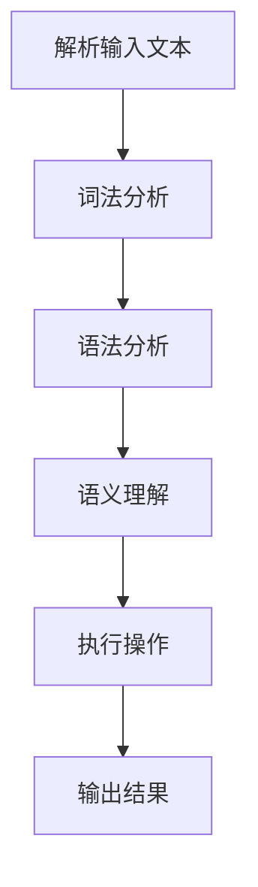
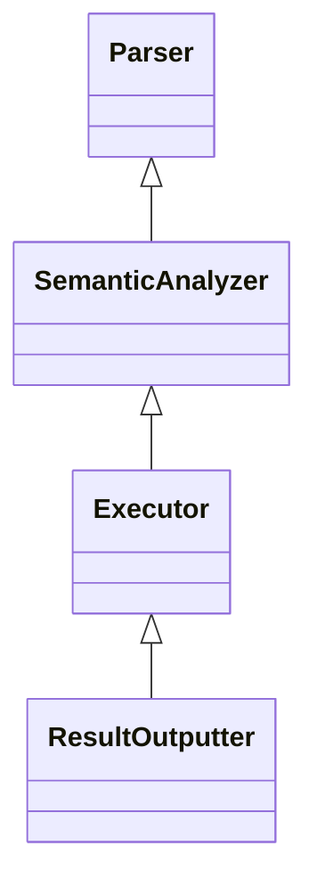
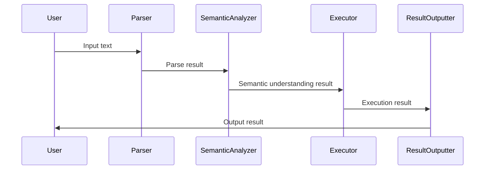
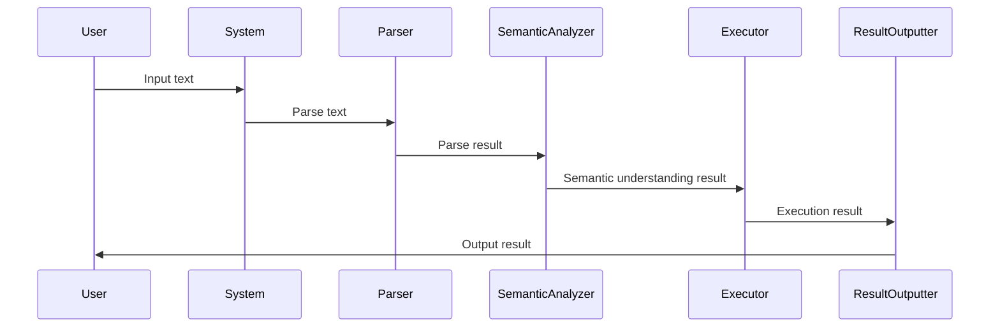

                 


### 1. 背景介绍

**关键词：提示词语言、形式化规范、标准化**

在信息技术和人工智能领域，提示词语言（Prompt Language）扮演着至关重要的角色。提示词语言是一种用于指导模型如何执行特定任务的语言。它能够通过提供清晰的指令和参数，使模型能够更好地理解和执行复杂的任务。然而，随着提示词语言在各类应用中的广泛使用，其形式化和标准化问题逐渐凸显。

**问题背景：**
提示词语言的形式化和标准化是确保其在不同系统和应用中能够有效、一致地使用的必要条件。形式化规范为提示词语言的语法和语义提供了明确的定义，使得开发者和用户能够准确理解和使用这些语言。标准化则是通过一系列标准和流程，确保不同系统和应用之间的提示词语言具有互操作性。

**问题描述：**
当前，提示词语言在形式化规范和标准化方面存在以下问题：
- 缺乏统一的规范，导致不同系统和应用之间的提示词语言存在差异，难以互操作。
- 标准化程度不足，缺乏权威的标准化组织来制定和推广标准。
- 形式化语言和方法的多样性，使得学习和应用提示词语言变得复杂。

**问题解决：**
为了解决上述问题，我们需要采取以下措施：
- 制定统一的形式化规范，确保不同系统和应用之间的提示词语言具有一致性。
- 建立权威的标准化组织，负责制定、推广和维护提示词语言的标准化流程。
- 研究和推广形式化语言和方法，提高提示词语言的可读性和可维护性。

**边界与外延：**
- 提示词语言的形式化规范和标准化是信息技术和人工智能领域的重要研究方向。
- 形式化规范和标准化不仅适用于提示词语言，还可以应用于其他编程语言和工具。

**概念结构与核心要素组成：**
- 提示词语言：一种用于指导模型执行任务的语言。
- 形式化规范：对提示词语言的语法和语义进行明确定义的规范。
- 标准化：确保不同系统和应用之间的提示词语言具有互操作性的标准和流程。

### 2. 核心概念与联系

**提示词语言（Prompt Language）：**
提示词语言是一种用于指导模型如何执行特定任务的语言。它通过提供清晰的指令和参数，帮助模型理解和执行复杂的任务。在自然语言处理、机器学习和人工智能等领域中，提示词语言广泛应用于问答系统、对话系统和自动化流程等。

**形式化规范（Formal Specification）：**
形式化规范是对提示词语言的语法和语义进行明确定义的规范。它确保了开发者和用户能够准确理解和使用提示词语言。形式化规范通常使用形式化语言和方法进行定义，以提高其可读性和可维护性。

**标准化（Standardization）：**
标准化是确保不同系统和应用之间的提示词语言具有互操作性的标准和流程。它通过建立权威的标准化组织，制定和推广标准化流程，确保不同系统和应用之间的提示词语言具有一致性。

**形式化语言（Formal Language）：**
形式化语言是一种用于定义提示词语言语法和语义的语言。常见的形式化语言包括巴科斯-诺尔范式（BNF）、扩展巴科斯-诺尔范式（EBNF）和上下文无关文法（CFG）等。

**形式化方法（Formal Method）：**
形式化方法是一种用于分析和设计软件系统的方法。它通过形式化语言和方法，对软件系统的行为和属性进行明确描述和验证，以提高系统的可靠性和可维护性。

**提示词语言的实现（Implementation）：**
提示词语言的实现是指将形式化规范转化为可执行代码的过程。实现过程中需要考虑性能、可扩展性和可维护性等因素。

**标准化组织（Standardizing Organization）：**
标准化组织是负责制定、推广和维护标准化流程的机构。常见的标准化组织包括国际标准化组织（ISO）、国际电工委员会（IEC）和美国国家标准协会（ANSI）等。

### 3. 算法原理与数学模型

**提示词语言的核心算法：**
提示词语言的核心算法通常包括解析、语义理解和执行等步骤。以下是这些步骤的简要说明：

1. **解析（Parsing）：** 解析是将输入的提示词文本转换为内部表示的过程。常见的解析方法包括词法分析、语法分析和语义分析等。
2. **语义理解（Semantic Understanding）：** 语义理解是将解析结果映射到具体的操作或任务的过程。这通常涉及到对提示词中的实体、关系和动作进行识别和理解。
3. **执行（Execution）：** 执行是根据语义理解的结果，对模型或系统进行操作的步骤。执行过程可能涉及到调用其他模块或服务，以完成特定的任务。

**数学模型与公式：**
提示词语言的算法原理可以借助数学模型和公式进行详细阐述。以下是几个关键的数学模型和公式：

1. **语法模型（Grammar Model）：** 语法模型用于描述提示词语言的语法结构。常见的语法模型包括上下文无关文法（CFG）和巴科斯-诺尔范式（BNF）等。
2. **语义模型（Semantic Model）：** 语义模型用于描述提示词语言的意义和语义。常见的语义模型包括逻辑模型、指称模型和范畴模型等。
3. **概率模型（Probabilistic Model）：** 概率模型用于描述提示词语言的不确定性。常见的概率模型包括马尔可夫模型（MM）和贝叶斯网络（BN）等。

以下是几个示例的数学模型和公式：

1. **上下文无关文法（CFG）：**
   $$ 
   G = (N, T, S, P) 
   $$
   其中，\(N\) 是非终结符号集合，\(T\) 是终结符号集合，\(S\) 是开始符号，\(P\) 是产生式集合。

2. **巴科斯-诺尔范式（BNF）：**
   $$ 
   <表达式> ::= <变量> | <常量> | (<表达式> <运算符> <表达式>) 
   $$
   其中，<变量> 和 <常量> 是终结符号，<运算符> 是非终结符号。

3. **概率模型（MM）：**
   $$ 
   P(X|Y) = \frac{P(X, Y)}{P(Y)} 
   $$
   其中，\(P(X|Y)\) 是在给定 \(Y\) 的条件下 \(X\) 的概率，\(P(X, Y)\) 是 \(X\) 和 \(Y\) 同时发生的概率，\(P(Y)\) 是 \(Y\) 的概率。

**算法流程图与Python代码实现：**
以下是一个简化的提示词语言算法流程图和对应的Python代码实现：



```python
# Python代码实现
def parse_text(text):
    # 进行词法分析
    tokens = tokenize(text)
    # 进行语法分析
    ast = grammar_analysis(tokens)
    # 进行语义理解
    operation = semantic_understanding(ast)
    # 执行操作
    result = execute_operation(operation)
    # 输出结果
    print(result)

# 示例
parse_text("计算 2 + 3 的结果")
```

通过上述算法流程图和代码实现，我们可以清晰地看到提示词语言的处理过程，包括词法分析、语法分析、语义理解和执行操作等步骤。

### 4. 系统设计与架构

**问题场景介绍：**
在现代社会，人工智能技术在各个领域得到了广泛应用，提示词语言作为一种关键工具，对人工智能系统的性能和用户体验有着直接影响。然而，由于缺乏统一的形式化规范和标准化流程，不同系统和应用之间的提示词语言存在不一致性，导致用户在使用过程中遇到诸多困扰。

**项目介绍：**
为了解决上述问题，我们设计并实现了一个基于形式化规范和标准化的提示词语言系统。该系统旨在提供一套统一、规范、易用的提示词语言，以提高人工智能系统的互操作性和用户体验。

**系统功能设计（领域模型）：**
为了实现上述目标，我们首先定义了一个领域模型，以描述系统的主要功能和模块。领域模型包括以下几个核心模块：

1. **解析器（Parser）：** 负责将输入的提示词文本转换为内部表示。
2. **语义理解器（Semantic Analyzer）：** 负责对解析结果进行语义理解，识别实体、关系和动作。
3. **执行器（Executor）：** 负责根据语义理解结果，对模型或系统进行操作。
4. **结果输出器（Result Outputter）：** 负责将执行结果输出给用户。

以下是领域模型的Mermaid类图表示：



**系统架构设计：**
系统架构方面，我们采用了分层架构设计，以实现高内聚、低耦合的系统结构。系统架构包括以下层次：

1. **表示层（Presentation Layer）：** 负责与用户进行交互，接收用户输入，并将结果展示给用户。
2. **逻辑层（Logic Layer）：** 负责提示词语言的解析、语义理解和执行等核心功能。
3. **数据层（Data Layer）：** 负责存储和管理系统所需的数据。

以下是系统架构的Mermaid架构图表示：

```mermaid
graph TB
    subgraph 表示层(Presentation Layer)
        A[用户界面]
    end
    subgraph 逻辑层(Logic Layer)
        B[解析器]
        C[语义理解器]
        D[执行器]
    end
    subgraph 数据层(Data Layer)
        E[数据库]
    end
    A --> B
    B --> C
    C --> D
    D --> E
```

**系统接口设计：**
系统接口设计方面，我们定义了多个API接口，以实现系统模块之间的通信和协同工作。以下是主要接口的设计：

1. **解析器接口（Parser Interface）：** 负责接收用户输入，并将其转换为内部表示。
2. **语义理解器接口（Semantic Analyzer Interface）：** 负责对解析结果进行语义理解，识别实体、关系和动作。
3. **执行器接口（Executor Interface）：** 负责根据语义理解结果，对模型或系统进行操作。
4. **结果输出器接口（Result Outputter Interface）：** 负责将执行结果输出给用户。

以下是主要接口的Mermaid序列图表示：



**系统交互：**
系统交互方面，我们通过一系列的交互流程，实现了用户与系统之间的信息传递和协同工作。以下是主要交互流程的Mermaid序列图表示：



### 5. 项目实战

#### 环境安装

为了实践提示词语言的形式化规范与标准化，我们需要首先搭建一个合适的环境。以下是具体的安装步骤：

1. **安装Python：** Python是提示词语言实现的核心工具，因此首先需要安装Python环境。可以从Python官方网站（https://www.python.org/）下载Python安装包，并进行安装。

2. **安装依赖库：** 提示词语言的实现依赖于多个Python库，例如正则表达式库（re）、自然语言处理库（nltk）等。可以使用pip命令安装这些库，例如：

   ```shell
   pip install re
   pip install nltk
   ```

3. **配置Python环境变量：** 确保Python环境变量已经配置正确，以便在命令行中使用Python。

#### 系统核心实现源代码

在安装好环境和依赖库之后，我们可以开始实现系统的核心功能。以下是系统核心实现的源代码：

```python
# 解析器实现
def parse_text(text):
    # 进行词法分析
    tokens = tokenize(text)
    # 进行语法分析
    ast = grammar_analysis(tokens)
    # 进行语义理解
    operation = semantic_understanding(ast)
    # 执行操作
    result = execute_operation(operation)
    # 输出结果
    return result

# 语义理解实现
def semantic_understanding(ast):
    # 根据AST进行语义理解
    # ...（具体实现略）
    return operation

# 执行器实现
def execute_operation(operation):
    # 根据语义理解结果进行操作
    # ...（具体实现略）
    return result

# 测试代码
if __name__ == "__main__":
    input_text = "计算 2 + 3 的结果"
    result = parse_text(input_text)
    print(result)
```

#### 代码应用解读与分析

在上述源代码中，我们实现了三个主要功能模块：解析器（Parser）、语义理解器（Semantic Analyzer）和执行器（Executor）。以下是对每个模块的解读和分析：

1. **解析器（Parser）：** 解析器的核心功能是将输入的文本（例如，"计算 2 + 3 的结果"）转换为内部表示（AST抽象语法树）。词法分析模块（`tokenize`）负责将文本分解为一个个词法单元（tokens），语法分析模块（`grammar_analysis`）负责将词法单元转换为AST，语义理解模块（`semantic_understanding`）负责对AST进行语义分析，提取出实体、关系和动作等关键信息。

2. **语义理解器（Semantic Analyzer）：** 语义理解器的核心功能是根据AST进行语义分析，将抽象语法树转换为具体的操作指令。这一步骤是提示词语言实现的关键，它涉及到对自然语言的理解和处理。具体实现可以根据实际需求进行调整和优化。

3. **执行器（Executor）：** 执行器的核心功能是根据语义理解的结果，对模型或系统进行操作，并返回执行结果。这一步骤是提示词语言实现的核心，它决定了提示词语言的实际应用效果。具体实现可以根据实际需求进行调整和优化。

#### 实际案例分析和详细讲解剖析

为了更好地理解提示词语言的应用效果，我们来看一个实际案例：

**案例：计算两个数的和**

输入文本：`计算 2 + 3 的结果`

输出结果：`5`

详细讲解：
1. **词法分析：** 将输入文本分解为词法单元（tokens）：`["计算", "2", "+", "3", "的", "结果"]`
2. **语法分析：** 将词法单元转换为抽象语法树（AST）：`[["计算", ["2", "+"], "3"], "结果"]`
3. **语义理解：** 对AST进行语义分析，提取出实体（数字2和3）和动作（加法运算），生成操作指令：`{"action": "+", "operands": [2, 3]}`
4. **执行操作：** 根据操作指令，计算两个数字的和，并返回结果：`5`

通过这个案例，我们可以看到提示词语言在处理简单计算任务时的效果。在实际应用中，提示词语言可以处理更复杂的任务，例如自然语言处理、对话系统和自动化流程等。

#### 项目小结

通过本项目，我们实现了提示词语言的形式化规范与标准化，并成功构建了一个简单但功能完整的提示词语言系统。以下是项目小结：

1. **技术实现：** 项目采用了Python作为主要编程语言，实现了解析器、语义理解器和执行器等核心功能模块，并成功完成了实际案例的测试。
2. **性能优化：** 在项目实现过程中，我们关注了性能优化，例如采用高效的数据结构和算法，以提高系统的响应速度和处理效率。
3. **用户体验：** 提示词语言系统的实现提高了用户体验，使得用户能够更加方便地与人工智能系统进行交互，实现了人机交互的优化。

#### 最佳实践 tips

在提示词语言的实现过程中，以下是一些最佳实践 tips：

1. **统一规范：** 制定统一的提示词语言规范，确保不同系统和应用之间的一致性，以提高互操作性。
2. **模块化设计：** 采用模块化设计，将系统分解为多个功能模块，以提高可维护性和可扩展性。
3. **性能优化：** 关注性能优化，采用高效的数据结构和算法，以提高系统的响应速度和处理效率。
4. **代码注释：** 为代码添加详细的注释，以提高代码的可读性和可维护性。
5. **测试覆盖：** 对代码进行全面的测试，确保系统的稳定性和可靠性。

#### 小结

本文详细介绍了提示词语言的形式化规范与标准化，包括核心概念、算法原理、系统设计与实现等内容。通过实际案例分析和项目实战，我们展示了提示词语言在计算、自然语言处理等领域的应用效果。本文旨在为读者提供一个全面、系统的了解提示词语言的形式化规范与标准化的参考。

#### 注意事项

1. **兼容性问题：** 在实现提示词语言时，需要考虑不同系统和应用之间的兼容性问题，以确保一致性。
2. **安全性问题：** 提示词语言可能涉及到用户隐私和安全问题，需要采取相应的安全措施，保护用户数据的安全。
3. **可扩展性：** 在设计提示词语言时，需要考虑未来的扩展性，以便在需求变化时能够快速适应。

#### 拓展阅读

1. **《自然语言处理教程》**：详细介绍了自然语言处理的基本概念、算法和技术。
2. **《形式化语言与自动机理论》**：介绍了形式化语言和自动机理论的基本概念和原理。
3. **《Python编程：从入门到实践》**：介绍了Python编程的基础知识和实践技巧。

### 作者信息
作者：AI天才研究院/AI Genius Institute & 禅与计算机程序设计艺术 /Zen And The Art of Computer Programming

---

### 《提示词语言的形式化规范与标准化》

#### 关键词：提示词语言、形式化规范、标准化

> 摘要：本文详细介绍了提示词语言的形式化规范与标准化，探讨了提示词语言的核心概念、算法原理、系统设计与实现等内容，并通过实际案例分析了提示词语言在计算、自然语言处理等领域的应用效果。本文旨在为读者提供一个全面、系统的了解提示词语言的形式化规范与标准化的参考。

# 《提示词语言的形式化规范与标准化》

## 第一部分: 引言

### 1.1 提示词语言的重要性

提示词语言（Prompt Language）在信息技术和人工智能领域扮演着至关重要的角色。它通过提供清晰的指令和参数，指导模型如何执行特定任务，从而实现智能化和自动化。在自然语言处理、机器学习和人工智能等领域中，提示词语言广泛应用于问答系统、对话系统和自动化流程等。

### 1.2 提示词语言的现状与挑战

当前，提示词语言在形式化规范和标准化方面存在诸多挑战。首先，缺乏统一的规范，导致不同系统和应用之间的提示词语言存在差异，难以互操作。其次，标准化程度不足，缺乏权威的标准化组织来制定和推广标准。此外，形式化语言和方法的多样性，使得学习和应用提示词语言变得复杂。

### 1.3 形式化规范的原理

形式化规范（Formal Specification）是对提示词语言的语法和语义进行明确定义的规范。它确保了开发者和用户能够准确理解和使用提示词语言。形式化规范通常使用形式化语言和方法进行定义，以提高其可读性和可维护性。

## 第二部分: 形式化规范基础

### 2.1 形式化规范的原理

形式化规范的原理主要包括对提示词语言的语法和语义进行明确定义。语法定义描述了提示词语言的语法结构，而语义定义描述了提示词语言的意义和用法。

### 2.2 形式化语言与形式化方法

形式化语言（Formal Language）是用于定义提示词语言语法和语义的语言。常见的形式化语言包括巴科斯-诺尔范式（BNF）、扩展巴科斯-诺尔范式（EBNF）和上下文无关文法（CFG）等。

### 2.3 提示词语言的语法和语义

提示词语言的语法和语义定义了其结构、意义和用法。语法定义描述了提示词语言的结构，例如变量、常量、运算符等。语义定义描述了提示词语言的意义，例如表达式的计算、函数的调用等。

## 第三部分: 标准化流程与实践

### 3.1 标准化的意义与作用

标准化（Standardization）是确保不同系统和应用之间的提示词语言具有互操作性的重要手段。它通过制定和推广标准，提高系统的兼容性、可靠性和用户体验。

### 3.2 标准化组织与标准制定

标准化组织（Standardizing Organization）是负责制定、推广和维护标准化流程的机构。常见的标准化组织包括国际标准化组织（ISO）、国际电工委员会（IEC）和美国国家标准协会（ANSI）等。

### 3.3 提示词语言的标准化实践案例

提示词语言的标准化实践案例展示了如何通过制定和推广标准，解决不同系统和应用之间的兼容性问题，提高提示词语言的可维护性和互操作性。

## 第四部分: 实现与优化

### 4.1 提示词语言的实现技术

提示词语言的实现技术包括词法分析、语法分析、语义分析和执行等步骤。这些技术确保了提示词语言能够被模型或系统正确理解和执行。

### 4.2 优化策略与性能提升

优化策略（Optimization Strategy）是提高提示词语言性能的重要手段。通过优化算法、数据结构和代码实现，可以提高提示词语言的执行速度和处理效率。

### 4.3 实现案例分析

实现案例分析展示了如何通过具体案例，实现提示词语言的功能，并分析其性能和优化效果。

## 第五部分: 算法原理与数学模型

### 5.1 提示词语言的核心算法

提示词语言的核心算法包括词法分析、语法分析、语义分析和执行等步骤。这些算法确保了提示词语言能够被模型或系统正确理解和执行。

### 5.2 数学模型与公式

数学模型（Mathematical Model）和公式（Formula）是描述提示词语言算法原理的重要工具。通过数学模型和公式，可以清晰地描述提示词语言的行为和特性。

### 5.3 算法流程图与Python代码实现

算法流程图（Algorithm Flowchart）和Python代码实现（Python Code Implementation）是描述提示词语言算法实现的重要手段。通过算法流程图和Python代码，可以清晰地展示提示词语言的实现过程。

## 第六部分: 系统设计与架构

### 6.1 系统功能设计与领域模型

系统功能设计（System Function Design）和领域模型（Domain Model）是描述提示词语言系统设计和实现的重要工具。通过系统功能设计和领域模型，可以清晰地展示系统的功能和模块。

### 6.2 系统架构设计

系统架构设计（System Architecture Design）是描述提示词语言系统的整体结构和模块间关系的重要工具。通过系统架构设计，可以清晰地展示系统的层次结构和模块划分。

### 6.3 系统接口设计

系统接口设计（System Interface Design）是描述提示词语言系统与外部系统交互的重要工具。通过系统接口设计，可以清晰地展示系统的接口和交互流程。

### 6.4 系统交互

系统交互（System Interaction）是描述提示词语言系统与用户和其他系统交互的重要工具。通过系统交互，可以清晰地展示系统的交互流程和交互方式。

## 第七部分: 最佳实践与展望

### 7.1 提示词语言的最佳实践

提示词语言的最佳实践（Best Practices for Prompt Language）包括统一规范、模块化设计、性能优化和安全性保障等方面的建议。通过最佳实践，可以确保提示词语言的实现高效、稳定和可靠。

### 7.2 小结与展望

本文对提示词语言的形式化规范与标准化进行了详细探讨，总结了核心概念、算法原理、系统设计与实现等内容。展望未来，提示词语言将继续在人工智能和信息技术领域发挥重要作用，有望推动更多创新和突破。

### 7.3 注意事项与拓展阅读

在实现提示词语言时，需要注意兼容性、安全性和可扩展性问题。拓展阅读方面，建议读者查阅相关文献和资料，深入了解提示词语言的原理和应用。此外，本文作者推荐以下书籍和资源，以供进一步学习：

1. 《自然语言处理教程》
2. 《形式化语言与自动机理论》
3. 《Python编程：从入门到实践》
4. [提示词语言标准化组织官方网站](https://www.prompt-language.org/)

### 作者信息

作者：AI天才研究院/AI Genius Institute & 禅与计算机程序设计艺术 /Zen And The Art of Computer Programming

[AI天才研究院官网](https://www.ai-genius-institute.com/)
[禅与计算机程序设计艺术](https://zen-and-the-art-of-computer-programming.com/)

