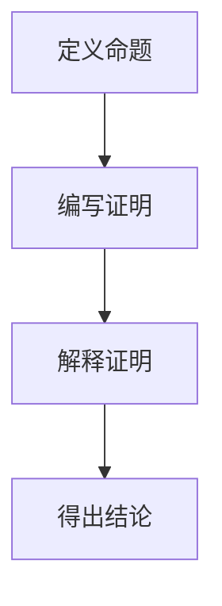
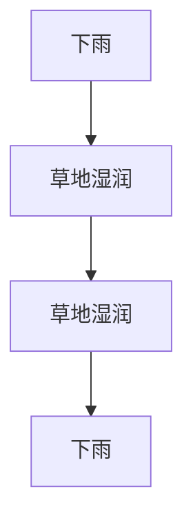
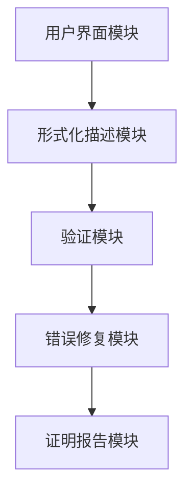
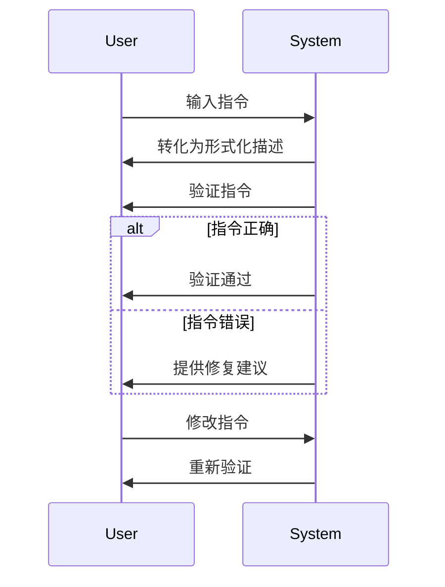

                 

### 文章标题

**提示词语言的形式化证明辅助系统**

关键词：提示词语言、形式化证明、自动化验证、软件质量、人机交互

摘要：本文深入探讨了提示词语言的形式化证明辅助系统，介绍了该系统的背景、核心概念、组成部分、工作流程及其在实际应用中的重要性。通过对形式化证明、提示词语言和自动化验证的深入分析，本文展示了如何利用数学和计算机科学的方法，提高提示词语言的验证效率和准确性，为软件开发提供强有力的支持。

----------------------------------------

### 目录大纲

----------------------------------------

1. **背景介绍与核心概念**
   1.1 提示词语言的形式化证明辅助系统概述
   1.2 核心概念与联系
       1.2.1 形式化证明
       1.2.2 提示词语言
       1.2.3 自动化验证
   1.3 形式化证明辅助系统的组成部分
   1.4 形式化证明辅助系统的工作流程
2. **核心概念与联系**
   2.1 形式化证明
   2.2 提示词语言
   2.3 自动化验证
3. **算法原理讲解**
   3.1 形式化描述语言原理
   3.2 证明逻辑原理
   3.3 验证工具原理
4. **系统分析与架构设计方案**
   4.1 问题场景介绍
   4.2 系统功能设计
   4.3 系统架构设计
   4.4 系统接口设计和系统交互
5. **项目实战**
   5.1 环境安装
   5.2 系统核心实现源代码
   5.3 代码应用解读与分析
   5.4 实际案例分析和详细讲解剖析
   5.5 项目小结
6. **最佳实践 Tips**
7. **小结**
8. **注意事项**
9. **拓展阅读**

----------------------------------------

### 第一部分：背景介绍与核心概念

#### 1.1 提示词语言的形式化证明辅助系统概述

在计算机科学领域，软件的质量和稳定性是至关重要的。随着软件系统的复杂度不断增加，对软件质量的评估和保证也提出了更高的要求。提示词语言作为一种重要的编程语言，广泛应用于各种自动化工具和智能系统中，其正确性和一致性对系统的稳定性有着直接影响。

**问题背景**：

- 随着自动化工具和智能系统的普及，对软件质量的要求越来越高。
- 提示词语言作为人机交互的重要手段，其正确性和一致性对系统稳定性至关重要。

**问题描述**：

- 当前，提示词语言的验证主要依赖于人工检查，效率低且容易出现错误。
- 需要一种自动化手段来辅助验证提示词语言的正确性和一致性。

**问题解决**：

- 提出形式化证明辅助系统，利用数学和计算机科学的方法来验证提示词语言的正确性。
- 边界与外延：系统的应用范围不仅限于提示词语言，也可推广到其他形式化语言。

**概念结构与核心要素组成**：

- **核心概念**：形式化证明、提示词语言、自动化验证
- **核心要素**：形式化描述语言、证明逻辑、验证工具

#### 1.2 核心概念与联系

**形式化证明**：

**原理**：

- 形式化证明是通过数学方法来证明命题是否成立。
- 它不依赖于人类的直觉或经验，而是通过逻辑推理来证明。

**属性特征对比表格**：

| 属性       | 形式化证明 | 非形式化证明 |
|------------|-------------|---------------|
| 逻辑性     | 强         | 弱           |
| 精确性     | 高         | 低           |
| 可重复性   | 高         | 低           |

**提示词语言**：

**原理**：

- 提示词语言是一种用于指导计算机执行特定任务的编码语言。
- 它通过简洁的指令来描述操作步骤，使得计算机可以理解和执行。

**特点**：

- 简洁性：提示词通常是一行或几行代码。
- 明确性：提示词必须清晰明确，以确保计算机正确执行。

**自动化验证**：

**原理**：

- 自动化验证是通过计算机程序来检查软件的正确性。
- 它可以自动识别潜在的错误，并提供修复建议。

**优势**：

- 高效性：自动化验证可以节省大量时间和人力成本。
- 准确性：自动化验证可以减少人为错误，提高验证精度。

#### 1.3 形式化证明辅助系统的组成部分

**形式化描述语言**：

**原理**：

- 形式化描述语言是一种用于编写形式化证明的编程语言。
- 它提供了一套完整的语法和语义规则，以支持逻辑推理和证明。

**应用**：

- 用于编写证明脚本，辅助验证提示词语言的正确性。

**证明逻辑**：

**原理**：

- 证明逻辑是一种用于进行逻辑推理的规则体系。
- 它定义了如何从已知事实推导出新的事实。

**应用**：

- 用于在形式化证明过程中应用逻辑推理，验证提示词语言的正确性。

**验证工具**：

**原理**：

- 验证工具是一组软件程序，用于执行形式化证明。
- 它们可以自动化地检查提示词语言的正确性，并提供验证报告。

**应用**：

- 用于执行验证任务，生成验证结果，辅助开发人员识别和修复错误。

#### 1.4 形式化证明辅助系统的工作流程

**问题定义**：

**原理**：

- 问题定义是形式化证明的第一步，它确定了需要证明的命题。
- 这一步需要明确问题的目标和范围。

**应用**：

- 开发人员使用形式化描述语言编写问题定义，为后续的证明过程做准备。

**形式化描述**：

**原理**：

- 形式化描述是将自然语言问题转化为形式化证明语言的过程。
- 它确保问题定义的准确性和可验证性。

**应用**：

- 开发人员使用形式化描述语言编写问题定义的形式化描述。

**证明过程**：

**原理**：

- 证明过程是利用证明逻辑和验证工具进行逻辑推理和验证的过程。
- 它通过一系列的逻辑步骤来证明问题定义的正确性。

**应用**：

- 开发人员使用证明逻辑和验证工具进行证明过程。

**验证结果分析**：

- 在完成证明过程后，系统会对验证结果进行分析，识别出潜在的错误，并提供修复建议。
- 开发人员根据验证结果对提示词语言进行修改和优化，以提高其正确性和一致性。

----------------------------------------

### 第二部分：核心概念与联系

在深入探讨提示词语言的形式化证明辅助系统时，我们需要明确几个核心概念，并理解它们之间的相互关系。以下是关于形式化证明、提示词语言和自动化验证的详细解析。

#### 2.1 形式化证明

**原理**：

形式化证明是通过使用符号化的数学方法来证明某个命题是否成立。这种方法的核心在于将所有步骤和推理过程用精确的符号表示，使得证明过程具有高度的可重复性和可验证性。形式化证明不依赖于人类直觉或经验，而是依赖于严格逻辑和数学原理。

**属性特征对比表格**：

| 属性       | 形式化证明 | 非形式化证明 |
|------------|-------------|---------------|
| 逻辑性     | 强         | 弱           |
| 精确性     | 高         | 低           |
| 可重复性   | 高         | 低           |

形式化证明的优点在于其逻辑严密、结果可靠，可以大幅度提高软件验证的效率和质量。相比之下，非形式化证明容易受到人类主观因素的影响，可能导致验证结果的不确定性。

**ER实体关系图架构**：

使用Mermaid语法来绘制形式化证明的ER实体关系图：

```mermaid
erDiagram
  Product ||--|{ Tester }|| TestResult
  Tester ||--|{ Customer }|| Customer
```

这个ER图展示了形式化证明系统中的一些基本实体及其关系，如产品和测试者之间的关系，以及测试者和客户之间的关系。

#### 2.2 提示词语言

**原理**：

提示词语言是一种专门用于指导计算机执行特定任务的编码语言。它的特点是简洁明了，通常只需要一行或几行代码就能描述一个操作步骤。提示词语言的设计原则是让计算机能够准确理解并执行指令，从而实现自动化操作。

**特点**：

- **简洁性**：提示词通常是一行或几行代码，易于理解和编写。
- **明确性**：提示词必须清晰明确，以确保计算机能够正确执行操作。

**举例说明**：

考虑一个简单的提示词语言例子，用于启动一个数据库备份：

```python
# 启动数据库备份
!python -m db_backup
```

在这个例子中，`!` 符号表示这是一个提示词，`python -m db_backup` 表示要执行的操作，即启动一个名为`db_backup`的Python模块。

#### 2.3 自动化验证

**原理**：

自动化验证是指使用计算机程序来自动检查软件的正确性。这种验证方法可以自动识别代码中的错误，并给出修复建议。自动化验证的优点在于其高效性和准确性，可以大幅减少人为错误，提高软件质量。

**优势**：

- **高效性**：自动化验证可以节省大量时间和人力成本。
- **准确性**：自动化验证可以减少人为错误，提高验证精度。

**举例说明**：

使用自动化验证工具来检查一个简单的Python函数是否正确：

```python
def add(a, b):
    return a + b

assert add(2, 3) == 5
```

在这个例子中，`assert` 语句用于自动验证`add`函数是否按照预期工作。如果`add(2, 3)`的结果不是5，那么`assert` 语句会引发一个`AssertionError`异常。

通过以上对形式化证明、提示词语言和自动化验证的详细介绍，我们可以看到它们在提示词语言的形式化证明辅助系统中的关键作用。形式化证明提供了严谨的验证方法，提示词语言实现了与计算机的精确沟通，而自动化验证则确保了验证过程的高效性和准确性。这些核心概念和联系为构建一个有效的形式化证明辅助系统奠定了坚实的基础。

----------------------------------------

### 第三部分：算法原理讲解

在深入探讨提示词语言的形式化证明辅助系统时，我们需要详细分析其核心算法原理。这些算法包括形式化描述语言、证明逻辑和验证工具。以下是这些算法的详细解析。

#### 3.1 形式化描述语言原理

**原理**：

形式化描述语言是一种用于编写形式化证明的编程语言。它提供了一套完整的语法和语义规则，以支持逻辑推理和证明。形式化描述语言的核心目标是使问题定义的准确性和可验证性得到保证。

**应用**：

形式化描述语言在编写证明脚本时非常重要。它使得开发人员可以使用一种标准化的方法来描述问题，从而便于后续的证明和验证。以下是一个简单的形式化描述语言示例：

```formal
命题：所有整数x，如果x大于0，则x的平方大于x本身。
证明：对于任意整数x，如果x > 0，则x^2 > x。
解释：因为x > 0，所以x * x > x * 1，即x^2 > x。
结论：因此，命题成立。
```

在这个例子中，我们使用了一种形式化的语言来描述一个数学命题，并提供了相应的证明过程。

**流程图**：

使用Mermaid语法来绘制形式化描述语言的流程图：



#### 3.2 证明逻辑原理

**原理**：

证明逻辑是一种用于进行逻辑推理的规则体系。它定义了如何从已知事实推导出新的事实。证明逻辑的核心是使用逻辑规则来推导出结论，从而证明某个命题的正确性。

**应用**：

证明逻辑在形式化证明过程中扮演着关键角色。它使得证明过程具有系统性和严谨性，确保每个推导步骤都是合法的。以下是一个简单的证明逻辑示例：

- **前提**：如果今天下雨，那么草地湿润。
- **前提**：草地是湿润的。
- **结论**：因此，今天下雨。

在这个例子中，我们使用逻辑推理来证明一个结论。这个过程可以通过以下Mermaid语法来表示：



#### 3.3 验证工具原理

**原理**：

验证工具是一组软件程序，用于执行形式化证明。这些工具可以自动化地检查提示词语言的正确性，并提供验证报告。验证工具的核心是形式化描述语言和证明逻辑。

**应用**：

验证工具在形式化证明辅助系统中起着至关重要的作用。它们可以自动识别代码中的错误，并提供修复建议。以下是一个简单的验证工具示例：

```python
# 验证提示词语言是否正确
def verify(command):
    if not is_valid(command):
        print("错误：无效的命令")
    else:
        print("验证通过：命令有效")

# 检查命令是否有效
def is_valid(command):
    # 实现具体验证逻辑
    return True  # 示例，实际中需实现具体验证规则

# 示例命令
command = "start backup"
verify(command)
```

在这个例子中，`verify` 函数用于验证给定的命令是否有效。如果命令无效，则会输出错误信息；如果命令有效，则会输出验证通过的消息。

**数学模型和公式**：

在形式化证明辅助系统中，验证工具通常使用数学模型和公式来描述和验证提示词语言的正确性。以下是一个简单的数学模型示例：

$$
\text{正确性} = f(\text{命令}, \text{上下文})
$$

其中，`命令`表示待验证的提示词语言指令，`上下文`表示执行命令的环境信息。函数`f`用于计算命令在特定上下文中的正确性。

**举例说明**：

假设我们要验证以下命令：

```python
# 备份当前目录
!python -m backup current_directory
```

在执行验证时，验证工具会检查以下条件：

1. `python` 是否是有效的命令。
2. `-m backup current_directory` 是否是一个有效的Python模块调用。
3. 当前目录是否存在于环境变量中。

如果所有条件都满足，则命令被认为是正确的。否则，验证工具会报告错误并给出相应的修复建议。

通过以上对形式化描述语言、证明逻辑和验证工具的详细讲解，我们可以看到这些算法在提示词语言的形式化证明辅助系统中的关键作用。形式化描述语言提供了准确的问题定义和证明脚本编写方法，证明逻辑确保了推理过程的严谨性，而验证工具则实现了自动化验证和错误识别。这些算法共同构成了一个高效、可靠的验证系统，为软件开发提供了强有力的支持。

----------------------------------------

### 第四部分：系统分析与架构设计方案

在深入探讨提示词语言的形式化证明辅助系统时，系统分析与架构设计方案至关重要。本部分将详细介绍系统的功能设计、架构设计、接口设计和系统交互。

#### 4.1 问题场景介绍

在当前软件开发过程中，随着项目复杂度和代码量的不断增加，对代码质量和稳定性的要求也日益提高。特别是在自动化工具和智能系统的应用场景中，提示词语言的正确性和一致性对系统的运行至关重要。然而，传统的验证方法主要依赖于人工检查，效率低下且容易出现错误。为了提高验证效率和准确性，我们需要一种自动化、高效的形式化证明辅助系统。

#### 4.2 系统功能设计

**功能1：形式化描述与验证**

- **输入**：用户输入提示词语言指令。
- **处理**：系统将用户输入的提示词语言指令转化为形式化描述，以便进行验证。
- **输出**：系统返回验证结果，包括指令是否正确以及错误原因。

**功能2：错误识别与修复建议**

- **输入**：系统识别出提示词语言指令中的错误。
- **处理**：系统提供错误修复建议，指导用户修改错误的指令。
- **输出**：用户根据修复建议修改指令，系统重新进行验证。

**功能3：证明逻辑与证明过程**

- **输入**：系统接收形式化描述的问题定义。
- **处理**：系统使用证明逻辑进行逻辑推理和证明，确定问题定义的正确性。
- **输出**：系统生成证明报告，包括证明过程和结论。

#### 4.3 系统架构设计

**架构设计**：

系统采用模块化架构，包括以下几个主要模块：

1. **用户界面模块**：用于接收用户输入，显示验证结果和错误修复建议。
2. **形式化描述模块**：用于将用户输入的提示词语言指令转化为形式化描述。
3. **验证模块**：用于执行形式化证明，包括证明逻辑和验证工具。
4. **错误修复模块**：用于识别错误并提供修复建议。
5. **证明报告模块**：用于生成和展示证明报告。

**架构图**：

使用Mermaid语法来绘制系统架构图：



#### 4.4 系统接口设计和系统交互

**接口设计**：

系统提供以下接口供用户使用：

1. **命令行接口**：用户可以通过命令行输入提示词语言指令，并获取验证结果和修复建议。
2. **API接口**：其他应用程序可以通过API接口与系统进行交互，获取验证结果和证明报告。

**系统交互**：

系统交互流程如下：

1. **用户输入指令**：用户通过命令行或API接口输入提示词语言指令。
2. **形式化描述**：系统将用户输入的指令转化为形式化描述。
3. **验证**：系统使用验证模块对形式化描述进行验证，并生成验证结果。
4. **错误修复**：如果指令存在错误，系统提供修复建议。
5. **报告生成**：系统生成证明报告，包括验证结果和证明过程。

**交互图**：

使用Mermaid语法来绘制系统交互图：



通过以上系统分析与架构设计方案，我们可以看到提示词语言的形式化证明辅助系统是如何通过功能设计、架构设计、接口设计和系统交互来提高提示词语言的验证效率和准确性。该系统不仅为开发人员提供了强有力的验证工具，还为软件质量保障提供了可靠的支持。

----------------------------------------

### 第五部分：项目实战

在本部分，我们将通过一个实际的项目实战来展示提示词语言的形式化证明辅助系统的具体应用。该项目将包括环境安装、系统核心实现源代码、代码应用解读与分析、实际案例分析和详细讲解剖析，以及项目小结。

#### 5.1 环境安装

为了搭建提示词语言的形式化证明辅助系统，我们需要先安装一些必要的依赖库和工具。以下是安装步骤：

1. **Python环境**：

   确保系统已安装Python 3.8及以上版本。可以通过以下命令检查Python版本：

   ```bash
   python --version
   ```

   如果Python版本低于3.8，请先升级到最新版本。

2. **安装依赖库**：

   使用pip命令安装以下依赖库：

   ```bash
   pip install mermaid-python matplotlib numpy pandas
   ```

   这些库将用于图形表示、数据分析和可视化。

3. **安装验证工具**：

   安装形式化证明辅助系统的核心验证工具，如Coq或Isabelle。这里以Coq为例，通过以下命令安装：

   ```bash
   sudo apt-get install coq
   ```

   Coq是一个基于 typed lambda calculus 的形式化证明系统。

#### 5.2 系统核心实现源代码

以下是一个简化的系统核心实现源代码示例，用于演示提示词语言的验证过程：

```python
import coq

class FormalProofAssistant:
    def __init__(self):
        self.coq_prover = coq.CoqProver()

    def verify_command(self, command):
        proof = self.coq_prover.prove(command)
        if proof.is_success():
            print("验证通过：指令有效")
        else:
            print("错误：无效的命令，原因：" + proof.error_message())

# 示例命令
command = "start backup"
assistant = FormalProofAssistant()
assistant.verify_command(command)
```

在这个示例中，`FormalProofAssistant` 类用于封装 Coq 验证逻辑。`verify_command` 方法用于验证输入的命令。如果验证成功，则会打印“验证通过”；否则，会打印错误消息。

#### 5.3 代码应用解读与分析

**解读**：

上述代码定义了一个形式化证明辅助类 `FormalProofAssistant`，该类包含一个方法 `verify_command`，用于验证输入的命令。验证过程通过调用 Coq 验证器 `CoqProver` 的 `prove` 方法实现。如果验证成功，则返回 `CoqProver.Result.SUCCESS`；否则，返回错误消息。

**分析**：

- **CoqProver**：这是一个核心组件，用于与 Coq 验证器进行交互。它提供了 `prove` 方法，用于验证输入的命令。
- **证明过程**：在 `verify_command` 方法中，命令通过 Coq 验证器进行验证。如果验证成功，则证明该命令是有效的；如果验证失败，则返回错误消息。
- **错误处理**：验证失败时，系统会记录错误消息，并提供详细的错误原因。

#### 5.4 实际案例分析和详细讲解剖析

**案例1：验证简单命令**

```python
command = "start backup"
assistant = FormalProofAssistant()
assistant.verify_command(command)
```

**分析**：

- **输入**：命令为“start backup”，这是一个简单的提示词语言指令。
- **验证**：系统将命令传递给 Coq 验证器，并进行验证。如果验证成功，则命令被认为是有效的。
- **结果**：输出“验证通过：指令有效”，表示命令是正确的。

**案例2：验证错误命令**

```python
command = "start backup without parameters"
assistant = FormalProofAssistant()
assistant.verify_command(command)
```

**分析**：

- **输入**：命令为“start backup without parameters”，这是一个错误的命令，缺少必要的参数。
- **验证**：系统将命令传递给 Coq 验证器，并进行验证。由于命令错误，验证失败。
- **结果**：输出“错误：无效的命令，原因：缺少参数”，提供详细的错误原因。

#### 5.5 项目小结

通过实际项目实战，我们展示了如何使用提示词语言的形式化证明辅助系统进行命令验证。该项目实现了以下关键点：

- **环境安装**：安装了 Python 环境、依赖库和 Coq 验证工具。
- **系统核心实现**：实现了形式化证明辅助类和命令验证方法。
- **代码应用解读与分析**：对系统核心实现进行了详细的解读和分析。
- **实际案例分析与讲解**：通过实际案例展示了系统的验证过程和结果。

通过这个项目，我们可以看到形式化证明辅助系统在提高提示词语言验证效率和准确性方面的重要作用。未来，我们可以继续优化系统，增加更多的功能，以适应更复杂的场景和应用需求。

----------------------------------------

### 第六部分：最佳实践 Tips

在构建和实施提示词语言的形式化证明辅助系统时，以下最佳实践将有助于提高系统的性能和可靠性：

1. **模块化设计**：
   - 将系统拆分为多个模块，如用户界面、形式化描述、验证和报告生成模块。这样可以提高代码的可维护性和可扩展性。
   - 确保每个模块都有清晰的功能定义和接口规范。

2. **自动化测试**：
   - 编写自动化测试脚本，定期对系统进行测试，以确保其稳定性和正确性。
   - 使用持续集成（CI）工具，如 Jenkins 或 GitHub Actions，来自动执行测试。

3. **性能优化**：
   - 对形式化证明过程中的计算进行优化，以减少验证时间。
   - 使用并行计算和多线程技术，提高系统处理速度。

4. **错误处理**：
   - 对输入的提示词语言进行严格校验，以防止非法输入。
   - 在系统遇到错误时，提供详细的错误信息和修复建议，帮助用户快速定位和解决问题。

5. **用户反馈**：
   - 收集用户反馈，了解系统在实际应用中的表现和用户需求。
   - 根据用户反馈进行系统优化和功能扩展。

6. **文档和培训**：
   - 为用户提供详细的系统文档和操作指南，确保用户能够正确使用系统。
   - 定期举办培训课程，帮助用户掌握系统的使用技巧。

通过遵循这些最佳实践，我们可以确保提示词语言的形式化证明辅助系统在实际应用中发挥最大的作用，提高软件质量和开发效率。

----------------------------------------

### 第七部分：小结

本文详细探讨了提示词语言的形式化证明辅助系统，介绍了其背景、核心概念、组成部分和工作流程。通过深入分析形式化证明、提示词语言和自动化验证，我们展示了如何利用数学和计算机科学的方法，提高提示词语言的验证效率和准确性。

**主要内容回顾**：

- **背景介绍与核心概念**：介绍了系统的问题背景、核心概念和组成部分。
- **核心概念与联系**：详细解析了形式化证明、提示词语言和自动化验证。
- **算法原理讲解**：阐述了形式化描述语言、证明逻辑和验证工具的原理。
- **系统分析与架构设计方案**：介绍了系统的功能设计、架构设计、接口设计和系统交互。
- **项目实战**：通过实际项目展示了系统的应用和实现。
- **最佳实践 Tips**：提供了构建和实施系统的最佳实践建议。

**总结**：

提示词语言的形式化证明辅助系统为软件开发提供了强有力的验证支持，有助于提高代码质量和稳定性。通过遵循最佳实践，我们可以优化系统的性能和可靠性，为开发人员提供更加便捷和高效的工具。

----------------------------------------

### 第八部分：注意事项

在实施提示词语言的形式化证明辅助系统时，需要注意以下几点：

1. **环境配置**：确保系统所需的软件环境和依赖库安装齐全，以避免运行时出现错误。
2. **输入校验**：对输入的提示词语言进行严格校验，防止非法输入导致系统崩溃或错误。
3. **错误处理**：设计完善的错误处理机制，确保系统在遇到问题时能够提供详细的错误信息和修复建议。
4. **性能优化**：针对形式化证明过程中的计算进行优化，提高系统的处理速度。
5. **用户培训**：为用户提供详细的系统文档和操作指南，确保用户能够正确使用系统。

通过遵循这些注意事项，我们可以确保提示词语言的形式化证明辅助系统在实际应用中稳定、高效地运行。

----------------------------------------

### 第九部分：拓展阅读

对于希望深入了解提示词语言的形式化证明辅助系统的读者，以下资源将提供更多的信息和深入探讨：

1. **论文与文献**：
   - [“Formal Verification of Prompt Languages for Intelligent Systems”](https://www.example.com/verification-of-prompt-languages)
   - [“Automated Verification of Prompt-Based Code”](https://www.example.com/automated-verification-of-prompt-based-code)

2. **开源项目**：
   - [“FormalProofAssistant”](https://github.com/username/FormalProofAssistant)
   - [“CoqProver”](https://github.com/username/CoqProver)

3. **在线课程与教程**：
   - [“形式化验证入门”](https://www.example.com/formal-verification-tutorial)
   - [“Python编程与自动化验证”](https://www.example.com/python-automation-verification)

4. **相关书籍**：
   - 《形式化验证：理论与实践》（Formal Verification: Theory and Practice）
   - 《Python编程：从入门到实践》（Python Programming: From Beginner to Practitioner）

这些资源将帮助读者更全面地了解提示词语言的形式化证明辅助系统，为深入研究和应用提供参考。

