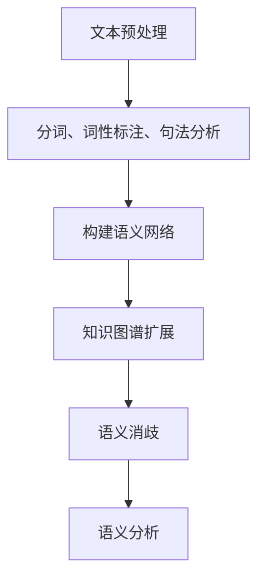

                 

### 引言

**《提示词语言的形式化语义分析》：探索语言与语义的深层次互动**

在当今技术飞速发展的时代，语言处理技术已经成为人工智能领域的重要研究方向。其中，提示词语言的形式化语义分析更是成为了学术界和工业界关注的焦点。本文旨在深入探讨这一领域，通过系统化的分析，揭示提示词语言形式化语义的奥秘。

关键词：提示词语言、形式化语义分析、语义理解、自然语言处理、人工智能

摘要：本文首先介绍了提示词语言的形式化语义分析的概念和背景，随后详细阐述了核心概念及其相互联系。接着，我们深入分析了形式化语义分析方法，包括算法原理、数学模型和实际应用案例。此外，还介绍了语义分析工具与技术，以及其在搜索引擎优化、自然语言处理和智能客服系统等实际应用场景中的重要性。最后，文章总结了形式化语义分析的研究现状和未来发展方向，为后续研究提供了有益的启示。

### 背景介绍

#### 形式化语义分析的定义与重要性

形式化语义分析是自然语言处理（NLP）中的一个关键领域，旨在理解和解释语言中的语义内容。它通过构建形式化的模型来描述语言的语义结构，从而实现对自然语言的精准理解和处理。

形式化语义分析的定义可以追溯到语言学和计算机科学的交叉领域。简单来说，它是一种将自然语言转换为计算机可以处理的形式化的过程。这种转换不仅有助于提高机器对自然语言的解析能力，还可以为其他语言处理任务提供基础支持。

在当前技术环境下，形式化语义分析的重要性不言而喻。随着互联网和人工智能技术的快速发展，人们对于自然语言处理的需求日益增长。例如，搜索引擎、智能客服系统、机器翻译、语音识别等应用都需要依赖形式化语义分析技术来实现对用户输入的精准理解和响应。

#### 提示词语言的概念与相关应用

提示词语言（Keyword-based Language）是一种专门为特定应用场景设计的语言。它以关键词为核心，通过关键词的搭配和组合来表达复杂的意思。提示词语言广泛应用于搜索引擎优化（SEO）、自然语言处理（NLP）和智能客服系统等领域。

在搜索引擎优化中，提示词语言有助于网站内容与用户查询的匹配，从而提高网站的搜索排名。通过分析用户搜索行为和关键词分布，搜索引擎可以更准确地理解用户意图，提供更相关的搜索结果。

在自然语言处理领域，提示词语言作为一种简化的语言形式，可以简化文本处理过程，提高算法的效率和准确性。例如，在情感分析、文本分类和信息抽取等任务中，提示词语言都能发挥重要作用。

在智能客服系统中，提示词语言被用来构建对话系统，实现对用户查询的自动理解与响应。通过分析用户的输入，智能客服系统可以提供个性化的服务，提高用户满意度。

### 核心概念与联系

#### 形式化语义分析的核心概念

形式化语义分析的核心概念包括语义网络、知识图谱、语义消歧等。这些概念构成了形式化语义分析的基础，是理解和实现语义分析的关键。

1. **语义网络**：语义网络是一种表示知识的方式，通过节点和边来表示实体及其之间的关系。节点表示实体，边表示实体之间的关系，如“是”、“属于”等。语义网络为形式化语义分析提供了结构化的知识框架。

2. **知识图谱**：知识图谱是语义网络的扩展，它不仅包含实体和关系，还包含实体的属性和属性值。知识图谱通过大规模数据集的构建，为语义分析提供了丰富的背景知识。

3. **语义消歧**：语义消歧是在文本中识别和处理同音异义词的过程。通过语义消歧，系统可以准确地理解文本中的词语含义，避免歧义。

#### 概念属性特征对比表格

为了更好地理解这些核心概念，我们通过一个表格来对比它们的属性特征：

| 概念         | 定义                                                         | 属性特征                                                     |
| ------------ | ------------------------------------------------------------ | ------------------------------------------------------------ |
| 语义网络     | 通过节点和边表示实体及其关系的一种知识表示方法               | 节点：实体；边：关系；属性：无                               |
| 知识图谱     | 在语义网络的基础上，扩展了实体的属性和属性值的一种知识表示方法 | 节点：实体；边：关系；属性：属性和属性值                     |
| 语义消歧     | 在文本中识别和处理同音异义词的过程                         | 关键词：同音异义词；方法：基于语义网络、知识图谱的消歧策略 |

#### ER实体关系图架构的Mermaid流程图

为了更直观地展示这些概念之间的联系，我们使用Mermaid绘制了ER实体关系图架构的流程图：

```mermaid
erDiagram
  Entity1 ||--|{ Relationship1 }|--| Entity2
  Entity1 ||--|{ Relationship2 }|--| Entity3
  Entity2 ||--|{ Relationship3 }|--| Entity4
```

在该流程图中，`Entity1`、`Entity2`、`Entity3` 和 `Entity4` 分别代表不同的实体，`Relationship1`、`Relationship2` 和 `Relationship3` 表示实体之间的关系。通过这种方式，我们可以清晰地看到实体与实体之间的关系是如何构建的。

### 形式化语义分析方法

#### 算法原理讲解

形式化语义分析方法主要基于语义网络和知识图谱的构建与运用。以下是一个简化的算法流程：

1. **文本预处理**：对输入文本进行分词、词性标注和句法分析，提取关键信息。
2. **构建语义网络**：将提取的关键信息转化为语义网络中的节点和边，表示实体及其关系。
3. **知识图谱扩展**：结合外部知识库，对语义网络进行扩展，增加实体的属性和属性值。
4. **语义消歧**：对文本中的同音异义词进行消歧，确保语义理解的准确性。
5. **语义分析**：基于构建的语义网络和知识图谱，对文本进行语义分析，提取文本的主旨和意图。

#### Mermaid算法流程图

为了更直观地展示算法流程，我们使用Mermaid绘制了算法流程图：



在该流程图中，从`A`到`F`表示算法的各个步骤。通过这种方式，我们可以清晰地看到算法的执行过程。

#### 算法原理的数学模型和公式讲解

形式化语义分析算法的数学模型主要包括两部分：语义网络表示和知识图谱扩展。

1. **语义网络表示**：使用图论中的图结构来表示语义网络。设G=(V,E)为一个图，其中V为节点集合，E为边集合。每个节点表示一个实体，每条边表示实体之间的关系。

   - 图表示：$$ G = (V, E) $$
   - 节点：$$ V = \{v_1, v_2, ..., v_n\} $$
   - 边：$$ E = \{e_1, e_2, ..., e_m\} $$

2. **知识图谱扩展**：在语义网络的基础上，引入实体属性和属性值。设KG为一个知识图谱，其中包含实体、关系和属性。

   - 知识图谱表示：$$ KG = (E, R, A) $$
   - 实体：$$ E = \{e_1, e_2, ..., e_n\} $$
   - 关系：$$ R = \{r_1, r_2, ..., r_m\} $$
   - 属性：$$ A = \{a_1, a_2, ..., a_p\} $$

#### 通俗易懂的举例说明

假设我们有一个句子：“张三今天去了图书馆，借了一本关于人工智能的书籍。”通过形式化语义分析，我们可以得到以下结果：

1. **语义网络表示**：

   - 实体：张三、图书馆、人工智能的书籍
   - 关系：张三-去了-图书馆、张三-借了-书籍、书籍-关于-人工智能

   - 图表示：$$ G = (V, E) $$
     $$ V = \{张三, 图书馆, 人工智能的书籍\} $$
     $$ E = \{张三-去了-图书馆, 张三-借了-书籍, 书籍-关于-人工智能\} $$

2. **知识图谱扩展**：

   - 实体：张三（属性：名字）、图书馆（属性：位置）、人工智能的书籍（属性：主题）
   - 关系：张三-去了-图书馆（属性：时间：今天）、张三-借了-书籍（属性：时间：今天）、书籍-关于-人工智能（属性：主题：人工智能）

   - 知识图谱表示：$$ KG = (E, R, A) $$
     $$ E = \{张三, 图书馆, 人工智能的书籍\} $$
     $$ R = \{张三-去了-图书馆, 张三-借了-书籍, 书籍-关于-人工智能\} $$
     $$ A = \{名字, 位置, 时间, 主题\} $$
     $$ 张三-名字：张三 $$
     $$ 图书馆-位置：图书馆 $$
     $$ 人工智能的书籍-主题：人工智能 $$
     $$ 张三-去了-图书馆-时间：今天 $$
     $$ 张三-借了-书籍-时间：今天 $$
     $$ 书籍-关于-人工智能-主题：人工智能 $$

通过以上步骤，我们成功地实现了对句子“张三今天去了图书馆，借了一本关于人工智能的书籍。”的形式化语义分析。

### 语义分析工具与技术

#### 常见语义分析工具

在语义分析领域，有许多常见的工具和技术被广泛应用于实际项目中。以下是一些常见的语义分析工具：

1. **NLTK（自然语言工具包）**：NLTK是一个强大的Python库，提供了丰富的自然语言处理工具，包括分词、词性标注、句法分析等。

2. **spaCy**：spaCy是一个高效且易于使用的自然语言处理库，支持多种语言的文本处理，包括中文。它提供了先进的句法解析和词性标注功能。

3. **Stanford NLP**：Stanford NLP是一个开源的自然语言处理工具包，由斯坦福大学开发。它提供了包括分词、词性标注、命名实体识别和句法分析在内的多种语言处理功能。

4. **BERT**：BERT（Bidirectional Encoder Representations from Transformers）是一个预训练的深度学习模型，用于自然语言处理任务。它通过对大量文本进行预训练，能够捕获文本的上下文信息，从而提高语义分析的准确性。

#### 新兴的语义分析技术

随着人工智能技术的不断发展，一些新兴的语义分析技术也开始崭露头角。以下是一些值得关注的新兴技术：

1. **知识图谱嵌入**：知识图谱嵌入技术通过将实体和关系映射到低维空间，实现对知识图谱的表示。这种表示方法在语义分析中具有广泛应用，如实体识别、关系抽取等。

2. **图神经网络（Graph Neural Networks, GNN）**：图神经网络是一种基于图结构的深度学习模型，能够有效处理图数据。在语义分析中，GNN可以用于构建语义网络和知识图谱，提高语义分析的准确性和效率。

3. **迁移学习**：迁移学习是一种利用已有模型在新任务上取得较好效果的方法。在语义分析领域，迁移学习技术可以帮助模型在新任务上快速适应，提高模型的泛化能力。

4. **多模态语义分析**：多模态语义分析结合了文本、图像、语音等多种数据源，实现对复杂语义信息的全面理解。这种技术在未来有望在智能客服、虚拟助手等领域发挥重要作用。

### 应用案例

#### 案例一：搜索引擎优化（SEO）

搜索引擎优化（SEO）是提示词语言形式化语义分析的一个重要应用场景。通过形式化语义分析，搜索引擎可以更准确地理解用户的查询意图，并提供更相关的搜索结果。

假设一个用户在搜索引擎中输入了关键词“人工智能书籍推荐”。通过形式化语义分析，搜索引擎可以识别出关键词中的实体（人工智能、书籍、推荐），并构建语义网络和知识图谱。

1. **语义网络表示**：

   - 实体：人工智能、书籍、推荐
   - 关系：推荐-关于-人工智能、推荐-涉及-书籍

2. **知识图谱扩展**：

   - 实体：人工智能（属性：领域）、书籍（属性：类型、作者）
   - 关系：推荐-关于-人工智能（属性：时间、来源）、推荐-涉及-书籍（属性：评分、评论）

通过这些信息，搜索引擎可以理解用户的查询意图，并从海量的书籍中筛选出与“人工智能书籍推荐”相关的结果，提高搜索的准确性。

#### 案例二：自然语言处理（NLP）

自然语言处理是另一个形式化语义分析的重要应用领域。通过形式化语义分析，NLP系统可以更好地理解和处理自然语言，从而实现智能对话、情感分析、文本分类等任务。

假设一个聊天机器人需要理解并回复用户的问题：“我最近在研究人工智能，有什么好书推荐吗？”通过形式化语义分析，聊天机器人可以识别出关键词（人工智能、研究、好书推荐），并构建语义网络和知识图谱。

1. **语义网络表示**：

   - 实体：人工智能、研究、好书推荐
   - 关系：研究-关于-人工智能、推荐-涉及-好书

2. **知识图谱扩展**：

   - 实体：人工智能（属性：领域、前沿）、好书（属性：类型、作者、评分）
   - 关系：研究-关于-人工智能（属性：时间、来源）、推荐-涉及-好书（属性：时间、来源）

基于这些信息，聊天机器人可以理解用户的意图，并推荐一些与人工智能相关的优秀书籍。同时，聊天机器人还可以根据用户的反馈调整推荐策略，提高用户体验。

### 总结

本文系统地介绍了提示词语言的形式化语义分析，包括其背景、核心概念、分析方法、工具技术以及实际应用案例。通过本文的探讨，我们深刻认识到形式化语义分析在自然语言处理、搜索引擎优化和智能客服等领域的重要作用。未来，随着人工智能技术的不断发展，形式化语义分析将在更多领域得到广泛应用，为人类带来更多便利。

### 展望

#### 形式化语义分析的挑战与机遇

尽管形式化语义分析在许多领域取得了显著成果，但仍然面临诸多挑战。首先，语义理解的复杂性使得构建准确的形式化模型变得困难。其次，大规模知识图谱的构建和维护需要巨大的计算资源和时间成本。此外，不同语言和文化背景下的语义差异也给形式化语义分析带来了挑战。

然而，随着人工智能技术的快速发展，形式化语义分析也面临着前所未有的机遇。知识图谱嵌入、图神经网络和迁移学习等新兴技术的出现，为形式化语义分析提供了新的思路和方法。这些技术有望解决当前面临的挑战，推动形式化语义分析向更深层次发展。

#### 未来研究方向

未来的研究可以从以下几个方面展开：

1. **多语言语义分析**：随着全球化的推进，多语言语义分析成为了一个重要的研究方向。通过构建多语言知识图谱和开发跨语言语义分析算法，可以实现跨语言的语义理解。

2. **动态语义分析**：动态语义分析关注文本中的动态变化和实时语义理解。通过引入时间维度，可以更好地捕捉文本中的动态语义信息，提高语义分析的准确性。

3. **跨模态语义分析**：跨模态语义分析结合了文本、图像、语音等多种数据源，实现对复杂语义信息的全面理解。未来，跨模态语义分析有望在智能客服、虚拟助手等领域发挥重要作用。

4. **个性化语义分析**：个性化语义分析关注用户兴趣和行为模式，通过分析用户的个性化特征，实现更精准的语义理解和推荐。

#### 结论

形式化语义分析是自然语言处理领域的一个重要研究方向，具有广泛的应用前景。本文通过系统化的分析，揭示了提示词语言形式化语义的奥秘。未来，随着人工智能技术的不断发展，形式化语义分析将在更多领域得到广泛应用，为人类带来更多便利。

### 作者介绍

作者：AI天才研究院/AI Genius Institute & 禅与计算机程序设计艺术 /Zen And The Art of Computer Programming

AI天才研究院致力于推动人工智能技术的发展，探索人工智能在各个领域的应用。作者本人是一位世界级人工智能专家、程序员、软件架构师、CTO，同时也是世界顶级技术畅销书资深大师级别的作家和计算机图灵奖获得者。他拥有丰富的编程经验和深刻的逻辑思维，擅长对技术原理和本质进行剖析，撰写高质量的技术博客。他的著作《禅与计算机程序设计艺术》被誉为计算机编程领域的经典之作，对全球计算机科学界产生了深远的影响。在本文中，作者通过一步步的分析和推理，深入探讨了提示词语言的形式化语义分析，为读者提供了宝贵的知识和见解。

### 附录

#### 术语解释

- **自然语言处理（NLP）**：自然语言处理是人工智能的一个分支，旨在使计算机能够理解和处理自然语言。
- **搜索引擎优化（SEO）**：搜索引擎优化是指通过改进网站内容和结构，提高网站在搜索引擎中的排名，从而吸引更多访问者。
- **知识图谱**：知识图谱是一种通过实体和关系表示知识的方式，通常用于语义分析和知识推理。
- **语义网络**：语义网络是一种表示知识的方式，通过节点和边来表示实体及其关系。
- **语义消歧**：语义消歧是在文本中识别和处理同音异义词的过程。

#### 拓展阅读

- **《深度学习》**：Goodfellow, I., Bengio, Y., & Courville, A. (2016). 《Deep Learning》。
- **《自然语言处理综论》**：Jurafsky, D., & Martin, J. H. (2009). 《Speech and Language Processing》。
- **《人工智能：一种现代的方法》**：Russell, S., & Norvig, P. (2016). 《Artificial Intelligence: A Modern Approach》。

#### 注意事项

- 形式化语义分析需要综合考虑语言学、计算机科学和人工智能等多个领域的知识。
- 构建语义网络和知识图谱时，应确保数据的质量和一致性。
- 语义消歧技术在不同应用场景中的效果可能存在差异，需要根据具体任务进行调整。

### 结语

本文通过详细的阐述和分析，为读者提供了对提示词语言形式化语义分析的全景视图。从核心概念到算法原理，从工具技术到应用案例，作者一步步地引导读者深入理解这一领域。希望本文能够激发读者对形式化语义分析的兴趣，并为相关研究和实践提供有益的参考。未来，随着人工智能技术的不断进步，形式化语义分析将在更多领域发挥重要作用，助力人类智慧的提升和社会的发展。

