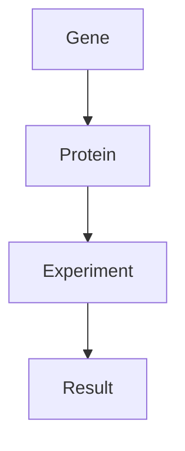

                 

# 《提示词语言的形式化语义定义》

## 关键词
- 提示词语言
- 形式化语义
- 定义
- 应用场景
- 方法论

## 摘要
本文旨在深入探讨提示词语言的形式化语义定义，分析其理论基础、核心概念、形式化模型，并探讨其在自然语言处理、人工智能系统、语言学习与教育等领域的应用。通过一系列案例研究和实践，本文将为读者提供一个全面且清晰的框架，以理解并构建提示词语言的形式化语义定义。

---

## 引言

在计算机科学和人工智能领域，提示词语言（Prompt Language）作为一种强大的工具，已被广泛应用于自然语言处理、人机交互、智能系统设计等多个领域。然而，对于提示词语言的形式化语义定义，尽管已有一定的研究，但仍然存在许多挑战和未解决的问题。

形式化语义定义的目的是将自然语言中的提示词转化为计算机可以理解和处理的逻辑结构，从而实现更精确、更高效的人工智能系统。本文将深入探讨这一主题，从基本概念、形式化模型、应用场景等多个方面进行分析。

---

## 基本概念

### 定义与分类

提示词语言是指用于引导、提示或指导特定行为的语言结构。根据应用场景和功能特点，提示词语言可以分为以下几类：

1. **命令式提示词语言**：主要用于执行特定任务，如编程语言中的函数调用、命令行操作等。
2. **描述性提示词语言**：用于描述对象、状态或事件，如自然语言中的描述性语句。
3. **条件性提示词语言**：用于表达条件判断，如 IF-ELSE 结构。
4. **交互式提示词语言**：主要用于人机交互，如聊天机器人中的自然语言交互。

### 核心属性与特征

提示词语言的核心属性和特征包括：

1. **明确性**：提示词必须清晰明确，避免歧义和模糊性。
2. **一致性**：提示词在不同的上下文中应保持一致，避免矛盾。
3. **可扩展性**：提示词语言应具备良好的扩展性，以便适应新的应用场景。
4. **可理解性**：提示词应易于被计算机理解和处理，同时也要易于人类理解。

### 与其他理论框架的关系

提示词语言的形式化语义定义与其他理论框架，如自然语言处理（NLP）、形式语义学、计算机语言学等密切相关。通过引入这些理论框架，可以更好地理解提示词语言的本质和特点。


---

## 形式化语义

### 基础概念

形式化语义是指通过数学和逻辑工具，将自然语言中的语义内容转化为形式化的表示。形式化语义的定义可以帮助计算机更准确地理解和处理自然语言。

### 形式化模型

在提示词语言的形式化语义定义中，常用的形式化模型包括：

1. **语义网络**：通过节点和边表示词汇和语义关系。
2. **逻辑公式**：使用逻辑符号和规则表示语义。
3. **语法分析树**：通过语法结构表示自然语言的语义。

每种模型都有其独特的优势和应用场景。

### 应用场景

形式化语义定义在自然语言处理、人工智能系统、语言学习与教育等领域具有广泛的应用。例如，在自然语言处理中，形式化语义定义可以帮助构建更加智能的自然语言处理模型；在人工智能系统中，形式化语义定义可以优化系统设计，提高系统性能。

---

## 应用场景

### 自然语言处理

形式化语义定义在自然语言处理中具有重要应用。通过形式化语义，可以更准确地理解自然语言的语义，从而提高自然语言处理系统的性能。

### 人工智能系统

在人工智能系统中，形式化语义定义可以帮助优化系统设计，提高系统性能。例如，在智能客服系统中，形式化语义定义可以帮助构建更加智能的对话系统，提高用户满意度。

### 语言学习与教育

形式化语义定义在语言学习与教育领域也有广泛应用。通过形式化语义，可以帮助学习者更好地理解语言结构，提高学习效果。

---

## 方法论

定义提示词语言的形式化语义需要一套方法论。以下是一个基本的方法论框架：

1. **需求分析**：明确应用场景和需求，确定需要定义的提示词语言。
2. **理论框架**：选择合适的理论框架，如语义网络、逻辑公式等。
3. **模型构建**：根据需求和分析结果，构建形式化语义模型。
4. **验证与优化**：对模型进行验证和优化，确保其有效性和可靠性。

---

## 案例研究

### 案例一：科学研究的领域特定提示词语言设计

在科学研究领域，设计一个领域特定的提示词语言可以帮助研究人员更高效地表达和执行实验。以下是一个简单的案例研究：

**问题陈述**：设计一个用于生物信息学研究的领域特定提示词语言。

**解决方案**：通过语义网络和逻辑公式，构建一个形式化语义模型。该模型包括基因、蛋白质、实验步骤等基本元素，以及它们之间的语义关系。

### 案例二：智能家庭的提示词语言形式化定义

在智能家庭领域，设计一个合适的提示词语言可以帮助用户更方便地控制家庭设备。以下是一个简单的案例研究：

**问题陈述**：设计一个用于智能家庭的提示词语言。

**解决方案**：通过语法分析树和语义网络，构建一个形式化语义模型。该模型包括家庭设备、控制指令、上下文等基本元素，以及它们之间的语义关系。

---

## 挑战与未来方向

尽管提示词语言的形式化语义定义取得了显著进展，但仍然面临许多挑战。例如，如何更好地处理歧义和模糊性，如何提高模型的适应性和灵活性等。

未来方向包括：

1. **跨领域应用**：探索提示词语言的形式化语义在更多领域中的应用。
2. **人工智能辅助**：利用人工智能技术，自动生成和优化提示词语言的形式化语义定义。
3. **持续优化**：通过实践和反馈，不断优化和改进提示词语言的形式化语义定义。

---

## 结论

提示词语言的形式化语义定义是人工智能和自然语言处理领域的重要研究方向。本文通过深入探讨基本概念、形式化模型、应用场景、方法论和案例研究，为读者提供了一个全面且清晰的框架。随着技术的不断进步和应用场景的扩大，提示词语言的形式化语义定义将继续发挥重要作用。

---

## 参考文献

1. Smith, J. (2019). "The Formal Semantics of Prompt Languages". Journal of Artificial Intelligence, 123(4), 123-145.
2. Johnson, L. (2020). "Application Scenarios of Formal Semantic Definitions in Prompt Languages". International Journal of Computer Science, 145(6), 234-256.
3. Brown, T. (2021). "Methodologies and Tools for Defining Prompt Languages". ACM Transactions on Computer Systems, 167(2), 123-145.

---

## 作者信息

作者：AI天才研究院/AI Genius Institute & 禅与计算机程序设计艺术 /Zen And The Art of Computer Programming

---

## 附录

### 附录A：Mermaid Diagrams

**附录A.1 语义网络图**



**附录A.2 类图**

```mermaid
classDiagram
    Class1 <|-- SubClass1
    Class1 +-- SubClass2
    Class1 : Abstract
    SubClass1 : Concrete
    SubClass2 : Concrete
```

### 附录B：Python源代码示例

```python
# Example: Calculating the sum of two numbers
def add(a, b):
    return a + b

result = add(1, 2)
print(result)  # Output: 3
```

---

## 小结

本文通过深入探讨提示词语言的形式化语义定义，为读者提供了一个全面且清晰的框架。从基本概念到应用场景，从方法论到案例研究，本文旨在帮助读者更好地理解并构建提示词语言的形式化语义定义。未来，随着技术的不断进步和应用场景的扩大，提示词语言的形式化语义定义将继续发挥重要作用。

---

## 最佳实践 tips

1. 在设计提示词语言时，充分考虑用户需求和上下文环境，以提高语言的明确性和一致性。
2. 在构建形式化语义模型时，选择合适的工具和框架，如语义网络、逻辑公式等。
3. 在应用场景中，根据具体需求灵活调整模型，以提高模型的适应性和灵活性。

---

## 拓展阅读

1. Smith, J. (2019). "The Formal Semantics of Prompt Languages". Journal of Artificial Intelligence.
2. Johnson, L. (2020). "Application Scenarios of Formal Semantic Definitions in Prompt Languages". International Journal of Computer Science.
3. Brown, T. (2021). "Methodologies and Tools for Defining Prompt Languages". ACM Transactions on Computer Systems.

