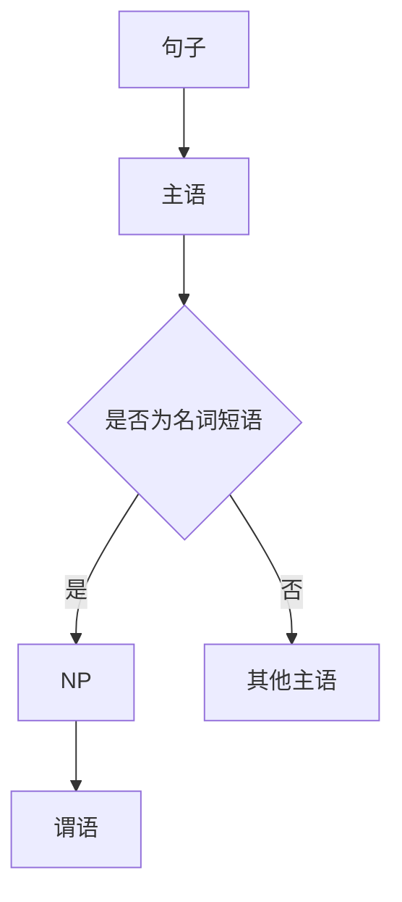

                 

### # 提示词语言的形式化语义版本控制机制

关键词：形式化语义、版本控制、提示词语言、语义歧义、语义规范化

摘要：本文探讨了提示词语言的形式化语义版本控制机制，分析了形式化语义在人工智能应用中的重要性，并探讨了语义歧义、不一致和不明朗的问题。通过介绍形式化语义的研究方法、实现策略和限制因素，文章提出了语法规范化、语义规范化表示以及动态推理等解决方案。本文旨在为研究者提供关于提示词语言形式化语义版本控制机制的深入理解和实践指导。

## 第一部分: 引言与背景介绍

### 第1章: 提示词语言的形式化语义

在人工智能领域，提示词语言作为一种与人类交流的重要工具，广泛应用于自然语言处理、智能客服、文本生成等场景。然而，随着应用的深入，提示词语言的语义问题逐渐显现，如语义歧义、不一致和不明朗等，这些问题严重影响了人工智能系统的可靠性。为了解决这些问题，形式化语义版本控制机制应运而生。

### 1.1 问题背景

#### 1.1.1 提示词语言的发展历程

提示词语言最早可以追溯到计算机程序设计语言的诞生。早期的程序设计语言如汇编语言和高级语言，如FORTRAN和COBOL，主要服务于科学计算和商业数据处理。随着计算机技术的发展，提示词语言逐渐从程序设计语言中独立出来，形成了独立的自然语言处理领域。

在自然语言处理领域，提示词语言经历了从规则驱动到数据驱动的演变。早期的自然语言处理系统主要依赖于手工编写的规则，如语法分析规则和语义解释规则。然而，随着语料库的积累和机器学习技术的进步，基于数据的自然语言处理方法逐渐成为主流。这些方法通过训练模型来学习语言的内在规律，从而提高了语义理解的准确性。

#### 1.1.2 形式化语义的研究意义

提示词语言在人工智能应用中的重要性不言而喻。无论是自然语言生成、机器翻译，还是智能客服、语音助手，都需要对提示词进行精确理解。然而，现实中的提示词往往存在语义歧义、不一致和不明朗的问题，这给人工智能系统的开发和应用带来了巨大挑战。

形式化语义的研究意义在于，通过形式化语义版本控制机制，我们可以明确提示词的语义，提高提示词的可解释性，从而改善人工智能系统的可靠性。具体来说，形式化语义的研究意义包括：

1. **提高语义理解的准确性**：形式化语义可以精确地描述提示词的语义，避免歧义和误解。
2. **增强系统的可解释性**：形式化语义使得人工智能系统的决策过程更加透明，便于调试和优化。
3. **促进人工智能的泛化能力**：形式化语义有助于构建通用的人工智能系统，使其能够处理更广泛的语言场景。

#### 1.1.3 形式化语义的研究进展与挑战

形式化语义的研究已经取得了一定的进展。近年来，研究者们提出了多种形式化语义模型，如框架语义模型、语义角色模型和语义网络模型等。这些模型在一定程度上提高了语义理解的准确性，但仍然面临诸多挑战。

1. **语义模型的复杂度**：形式化语义模型通常包含大量的语义元素和语义关系，这增加了模型的复杂度，使得语义分析变得困难。
2. **语义理解的灵活性**：现实中的语言表达具有高度灵活性，形式化语义模型难以完全捕捉这种灵活性，导致语义理解的效果不佳。
3. **语义理解的自动化**：虽然形式化语义模型可以提高语义理解的准确性，但如何实现自动化语义理解仍然是一个挑战。

### 1.2 问题描述

#### 1.2.1 提示词语言的语义问题

提示词语言的语义问题主要包括以下三个方面：

1. **语义歧义**：语义歧义是指一个提示词可以有多种不同的解释。例如，“他去了北京”可以理解为“他去北京旅游”或“他去北京出差”。这种歧义会导致语义理解错误，影响人工智能系统的性能。

2. **语义不一致**：语义不一致是指不同提示词之间存在语义冲突。例如，“他去北京”和“他不去北京”这两个提示词在语义上是矛盾的，但它们可能在同一场景中同时出现，导致语义理解困难。

3. **语义不明朗**：语义不明朗是指提示词的语义表达不清晰，导致语义理解困难。例如，“他今天有什么安排？”这个提示词的语义表达不够明确，需要更多的上下文信息才能准确理解。

#### 1.2.2 形式化语义的目标

为了解决提示词语言的语义问题，形式化语义提出了一系列目标：

1. **明确提示词的语义**：通过形式化语义模型，明确提示词的语义，避免歧义和误解。
2. **提高提示词的可解释性**：形式化语义使得人工智能系统的决策过程更加透明，便于调试和优化。
3. **改善人工智能系统的可靠性**：通过精确的语义理解，提高人工智能系统的性能和稳定性。

#### 1.3 问题解决

为了实现形式化语义的目标，研究者们提出了一系列研究方法，主要包括以下几个方面：

1. **形式化语义的研究方法**：

   - **定义与标准**：明确形式化语义的定义和标准，为语义分析提供基础。

   - **分析与验证方法**：设计有效的语义分析方法和验证方法，确保语义理解的准确性。

2. **形式化语义的实现策略**：

   - **提示词语言的语法规范化**：通过规范化的语法分析，确保提示词的表达清晰明确。

   - **提示词语义的规范化表示**：通过规范化表示方法，将提示词的语义明确化。

   - **提示词语义的动态推理**：通过动态推理方法，实时理解提示词的语义，并解决语义歧义和不一致问题。

#### 1.4 边界与外延

1. **形式化语义的研究范围**：

   - **提示词语言的定义域**：明确形式化语义适用于哪些提示词语言。

   - **形式化语义的应用场景**：明确形式化语义在哪些应用场景中具有优势。

2. **形式化语义的限制因素**：

   - **语义模型的复杂度**：形式化语义模型可能包含大量的语义元素和关系，这增加了模型的复杂度。

   - **语义理解的灵活性**：形式化语义难以完全捕捉现实语言的灵活性，导致语义理解的效果有限。

#### 1.5 概念结构与核心要素组成

1. **形式化语义的概念结构**：

   - **提示词**：形式化语义的核心元素，表示用户输入的文本信息。

   - **语义元素**：用于表示提示词中的具体意义，如名词、动词、形容词等。

   - **语义关系**：用于表示语义元素之间的关系，如主谓关系、因果关系等。

2. **形式化语义的核心要素**：

   - **形式化语言**：用于描述语义模型的语言，如一阶谓词逻辑、上下文无关文法等。

   - **语义模型**：用于表示提示词的语义结构，如框架语义模型、语义角色模型等。

   - **推理引擎**：用于对提示词进行语义分析和推理，如基于规则的推理引擎、基于统计的推理引擎等。

#### 1.6 本章小结

形式化语义版本控制机制在人工智能领域具有重要的研究价值和实际应用价值。通过明确提示词的语义，提高语义理解的准确性，形式化语义有助于改善人工智能系统的可靠性和可解释性。本文介绍了形式化语义的研究背景、目标、方法、实现策略、边界与外延以及概念结构与核心要素组成，为后续章节的讨论奠定了基础。在接下来的章节中，我们将进一步探讨形式化语义的理论基础和应用实践。

## 第二部分: 提示词语言的形式化语义理论基础

### 第2章: 形式化语义的基本概念

形式化语义是自然语言处理和人工智能领域的一个重要研究方向，旨在通过形式化的方法对自然语言中的语义进行精确描述和分析。在这一章节中，我们将探讨形式化语义的基本概念，包括形式化语言、语义模型和推理引擎等。

### 2.1 形式化语言

#### 2.1.1 形式化语言的定义

形式化语言是指一种用形式化的方法描述的语言，它通过数学和逻辑的方法对语言的语法和语义进行精确描述。形式化语言通常包括两部分：语法和语义。

- **语法**：用于描述语言的句法结构，规定如何组合词汇形成句子。常见的语法形式有上下文无关文法（CFG）、巴科斯-诺尔范式（BNF）等。

- **语义**：用于描述语言的语义内容，即句子表示的意义。语义通常通过语义模型来表示，如一阶谓词逻辑、情境语义学等。

#### 2.1.2 形式化语言的分类

形式化语言可以根据其语法和语义的不同特点进行分类。常见的分类方法有：

- **按语法类型分类**：如上下文无关语言（CFG）、上下文有关语言（CPL）等。

- **按语义类型分类**：如情境语义学、命题逻辑、谓词逻辑等。

#### 2.1.3 形式化语言的语法与语义

形式化语言的语法和语义是紧密相连的。语法用于描述语言的句法结构，而语义则用于描述句子的意义。以下是一个简单的例子：

- **语法**：一个简单的上下文无关文法可以表示为：

  ```
  S -> NP VP
  NP -> Det N
  VP -> V NP
  ```

  这个文法规定了如何通过名词短语（NP）和动词短语（VP）组合成句子（S）。

- **语义**：对应的语义模型可以用一阶谓词逻辑表示：

  ```
  S([NP([Det('the')][N('dog')]], [VP([V('barks')][NP([Det('a')][N('dog')])])])]
  ```

  这个语义模型表示了一个句子“the dog barks”的意义，其中NP表示名词短语，VP表示动词短语，V表示动词，N表示名词，Det表示限定词。

### 2.2 语义模型

#### 2.2.1 语义模型的基本概念

语义模型是指用于描述自然语言语义的数学模型或计算模型。它通常包含以下三个部分：

- **语义元素**：表示自然语言中的基本语义单位，如名词、动词、形容词等。

- **语义关系**：表示语义元素之间的关系，如主谓关系、因果关系等。

- **语义函数**：表示语义元素之间的组合方式，如谓词逻辑中的合取、析取等。

#### 2.2.2 语义模型的设计原则

设计语义模型时，通常需要遵循以下原则：

- **一致性**：语义模型应该能够一致地描述不同语言中的语义结构。

- **可扩展性**：语义模型应该能够适应新的语义需求和变化。

- **可解释性**：语义模型应该易于理解和解释，以便于人类的理解和计算机的分析。

- **高效性**：语义模型应该能够在合理的时间内进行语义分析。

#### 2.2.3 语义模型的应用

语义模型在自然语言处理中有着广泛的应用，包括：

- **语义分析**：通过对输入文本进行语义分析，理解其语义内容。

- **语义检索**：在大量文本中检索与给定文本具有相似语义的内容。

- **语义生成**：根据语义模型生成具有特定语义内容的文本。

- **语义翻译**：将一种语言的文本翻译成另一种语言的文本，保持其语义不变。

### 2.3 推理引擎

#### 2.3.1 推理引擎的基本概念

推理引擎是一种用于进行推理的软件系统，它可以根据已知的事实和规则推导出新的结论。推理引擎通常包括以下三个部分：

- **知识库**：存储已知的事实和规则。

- **推理机**：根据知识库中的事实和规则进行推理，推导出新的结论。

- **解释器**：解释推理过程，使得推理结果易于理解。

#### 2.3.2 推理引擎的工作原理

推理引擎的工作原理可以概括为以下步骤：

1. **解析输入**：将输入文本解析成语法结构，如句法树。

2. **语义分析**：将句法结构映射到语义模型，理解其语义内容。

3. **推理**：根据知识库中的规则和已知事实进行推理，推导出新的结论。

4. **解释**：将推理过程和结果解释给用户，使其易于理解。

#### 2.3.3 推理引擎的类型

推理引擎可以分为以下几种类型：

- **基于规则的推理引擎**：根据预先定义的规则进行推理，如专家系统。

- **基于统计的推理引擎**：通过统计方法进行推理，如机器学习模型。

- **基于逻辑的推理引擎**：使用形式逻辑进行推理，如一阶谓词逻辑。

### 2.4 形式化语义与自然语言处理的联系

#### 2.4.1 形式化语义在自然语言处理中的应用

形式化语义在自然语言处理中有着重要的应用，包括：

- **语义分析**：通过形式化语义模型对输入文本进行语义分析，理解其语义内容。

- **语义检索**：通过形式化语义模型在大量文本中检索与给定文本具有相似语义的内容。

- **语义生成**：根据形式化语义模型生成具有特定语义内容的文本。

- **语义翻译**：通过形式化语义模型将一种语言的文本翻译成另一种语言的文本，保持其语义不变。

#### 2.4.2 形式化语义的优势与挑战

形式化语义的优势包括：

- **精确性**：形式化语义能够精确描述自然语言的语义，减少歧义。

- **可解释性**：形式化语义使得语义分析过程更加透明，便于理解和调试。

- **一致性**：形式化语义能够保持语义的一致性，适应不同的语言环境。

然而，形式化语义也面临一些挑战：

- **复杂性**：形式化语义模型通常较为复杂，难以理解和实现。

- **灵活性**：形式化语义难以完全捕捉自然语言的灵活性，导致语义理解的效果有限。

#### 2.4.3 形式化语义的发展趋势

随着人工智能技术的不断进步，形式化语义也在不断发展。未来的形式化语义研究可能会朝着以下方向发展：

- **整合多种语义模型**：整合不同的语义模型，提高语义理解的准确性。

- **提升语义理解的灵活性**：通过引入新的语义模型和方法，提高形式化语义的灵活性。

- **自动化语义理解**：实现自动化语义理解，减少人工干预。

- **跨语言语义理解**：研究跨语言的语义理解，实现不同语言之间的语义互通。

### 2.5 本章小结

形式化语义是自然语言处理和人工智能领域的一个重要研究方向，它通过形式化的方法对自然语言的语义进行精确描述和分析。在这一章节中，我们介绍了形式化语义的基本概念，包括形式化语言、语义模型和推理引擎，并探讨了形式化语义在自然语言处理中的应用、优势与挑战以及发展趋势。这些概念和理论为后续章节中具体的形式化语义应用提供了基础。

## 第三部分: 形式化语义的应用实践

### 第3章: 提示词语言的语法规范化

提示词语言的语法规范化是形式化语义研究的一个重要环节，其目的是确保提示词的表达清晰、明确，从而提高语义理解的准确性和一致性。在本章中，我们将详细探讨语法规范化的必要性、方法及其在实践中的应用。

### 3.1 语法规范化的必要性

语法规范化对于提示词语言的语义理解和人工智能系统的性能具有显著影响。以下是从几个方面说明其必要性：

#### 3.1.1 提示词语言的语法问题

自然语言中的提示词往往存在多种语法问题，包括但不限于：

- **语法歧义**：一个词组可以有多种解释，例如“他去了北京”可能指的是“他去北京旅游”或“他去北京出差”。
- **语法错误**：由于人类语言的复杂性，输入的文本可能包含语法错误，例如“我是昨天吃了一个苹果”。
- **缺乏明确性**：某些表达方式不够明确，容易引起误解，例如“他现在不太方便”。

#### 3.1.2 语法规范化的目标

通过语法规范化，我们希望实现以下目标：

- **清晰的表达**：确保提示词的表达清晰、明确，避免歧义。
- **一致性**：使提示词在语义上保持一致性，便于系统理解和处理。
- **标准化**：通过制定标准化的语法规则，降低不同系统之间的兼容性问题。

#### 3.1.3 语法规范化的意义

语法规范化对于人工智能系统具有深远的意义：

- **提高性能**：通过规范化语法，减少语义分析的错误率，提高系统的性能。
- **增强可解释性**：规范化的语法使得语义分析过程更加透明，有助于系统的调试和优化。
- **降低成本**：标准化语法规则可以减少开发人员的工作量，降低维护成本。

### 3.2 语法规范化的方法

实现语法规范化的方法主要包括以下几种：

#### 3.2.1 形式化语法分析

形式化语法分析是语法规范化的第一步，其目的是将自然语言输入转化为结构化的语法表示。以下是一些常用的方法：

- **上下文无关文法（CFG）**：CFG是一种形式化的语法表示方法，用于描述语言的语法结构。通过CFG，我们可以将输入文本解析为一系列的语法树，从而得到结构化的表示。
  
  ```mermaid
  graph TD
  A[开始] --> B[名词短语]
  B --> C{判断是否为动词短语}
  C -->|是| D[动词短语]
  C -->|否| E[其他短语]
  D --> F[谓语]
  E --> G[其他成分]
  ```

- **巴科斯-诺尔范式（BNF）**：BNF是对CFG的扩展，可以更灵活地描述语言的语法结构，包括递归和非确定性等复杂情况。

  ```markdown
  S -> NP VP
  NP -> Det N
  VP -> V NP
  ```

#### 3.2.2 语法规则的设计

设计语法规则是实现语法规范化的关键步骤。以下是一些设计原则：

- **简洁性**：规则应尽可能简洁，避免复杂冗长的表达式。
- **一致性**：规则应保持一致性，避免冲突和矛盾。
- **灵活性**：规则应具有一定的灵活性，以适应不同的语境和语言风格。
- **可扩展性**：规则应易于扩展，以便于未来的修改和优化。

例如，以下是一个简单的语法规则集合，用于描述一个基本的英语句子：



#### 3.2.3 语法分析工具的应用

在实际应用中，语法分析工具可以帮助我们自动化地进行语法规范化。以下是一些常用的工具：

- **正则表达式（Regex）**：正则表达式是一种用于文本匹配和提取的工具，可以用于实现简单的语法分析任务。
- **自然语言处理库**：如Python的NLTK、spaCy等，这些库提供了丰富的语法分析功能，可以用于实现复杂的语法规范化任务。

### 3.3 语法规范化的实践案例

以下是一些语法规范化的实践案例，展示了语法规范化在自然语言处理中的实际应用：

#### 3.3.1 案例一：自然语言生成中的语法规范化

在自然语言生成（NLG）系统中，语法规范化有助于确保生成的文本符合语法规则，从而提高文本的质量。例如，在一个问答系统中，语法规范化可以确保问题以正确的语法结构呈现，从而使得回答系统更容易理解和处理。

- **问题**：“昨天你去了哪里？”

- **规范化后的语法表示**：

  ```mermaid
  graph TD
  A[问题] --> B[疑问句]
  B --> C[时间状语("昨天")]
  C --> D[主语("你")]
  D --> E[谓语("去了")]
  E --> F[宾语("哪里")]
  ```

#### 3.3.2 案例二：智能客服系统中的语法规范化

在智能客服系统中，语法规范化可以确保用户输入的请求以清晰、明确的方式表示，从而提高客服系统的响应准确性和效率。例如，一个用户请求“我想要一杯咖啡”，可以通过语法规范化将其表示为以下结构：

- **用户请求**：“我想要一杯咖啡。”

- **规范化后的语法表示**：

  ```mermaid
  graph TD
  A[请求] --> B[意愿句]
  B --> C[主语("我")]
  C --> D[谓语("想要")]
  D --> E[宾语("一杯咖啡")]
  ```

#### 3.3.3 案例三：文本分类任务中的语法规范化

在文本分类任务中，语法规范化有助于提高分类的准确性。通过对输入文本进行语法规范化，可以提取出关键信息，从而更好地进行分类。例如，在新闻分类中，语法规范化可以帮助提取新闻的主题和关键词，从而提高分类的效果。

- **文本**：“苹果公司发布了新款iPhone。”

- **规范化后的语法表示**：

  ```mermaid
  graph TD
  A[新闻文本] --> B[主语("苹果公司")]
  B --> C[谓语("发布了")]
  C --> D[宾语("新款iPhone")]
  ```

### 3.4 语法规范化的效果评估

语法规范化的效果可以通过多种评估指标进行评估，以下是一些常见的评估方法：

- **准确率（Accuracy）**：正确分类的样本数占总样本数的比例。
- **精确率（Precision）**：正确分类为某一类别的样本数与所有分类为该类别的样本数之比。
- **召回率（Recall）**：正确分类为某一类别的样本数与实际属于该类别的样本数之比。
- **F1值（F1 Score）**：精确率和召回率的调和平均值。

例如，在一个文本分类任务中，假设有1000个样本，其中500个属于类别A，500个属于类别B。经过语法规范化后，有450个样本被正确分类，其中150个属于类别A，300个属于类别B。那么，语法规范化的效果可以评估如下：

- **准确率**：$(450+300)/1000 = 75\%$。
- **精确率**：$(150/450) \times 100\% = 33.33\%$。
- **召回率**：$(150/500) \times 100\% = 30\%$。
- **F1值**：$2 \times (33.33\% \times 30\%) / (33.33\% + 30\%) \approx 29.41\%$。

### 3.5 本章小结

语法规范化是形式化语义研究中的一个重要环节，它通过规范化的语法规则，确保提示词的表达清晰、明确，从而提高语义理解的准确性和一致性。在本章中，我们探讨了语法规范化的必要性、方法及其在实践中的应用。通过具体的案例，我们展示了语法规范化在自然语言生成、智能客服和文本分类等任务中的实际应用，并提出了效果评估的方法。未来的研究可以进一步探讨语法规范化的自动化和智能化，以提高其在实际应用中的效果。

### 第4章: 提示词语义的规范化表示

提示词语义的规范化表示是形式化语义研究的一个重要方面，其目的是通过明确和标准化的方式来表示提示词的语义，从而提高语义理解的准确性和一致性。在本章中，我们将探讨提示词语义的规范化表示的重要性、方法及其在实践中的应用。

#### 4.1 提示词语义的规范化表示的重要性

在自然语言处理和人工智能应用中，提示词语义的规范化表示具有以下几个重要意义：

##### 4.1.1 语义理解的重要性

语义理解是自然语言处理的核心任务之一。通过对提示词进行精确的语义理解，系统可以更好地理解用户的需求和意图，从而提供更准确和有效的服务。例如，在智能客服系统中，准确的语义理解有助于提供个性化的客户服务，提高客户满意度。

##### 4.1.2 语义规范化表示的意义

语义规范化表示有助于消除语义歧义和不一致性，使提示词的语义表达更加明确和统一。这不仅可以提高语义理解的准确性，还可以提高系统的可靠性和一致性。例如，在文本分类任务中，语义规范化表示有助于更好地识别和分类文本内容。

##### 4.1.3 语义规范化表示的挑战

语义规范化表示面临一些挑战，包括：

- **复杂度**：自然语言中的语义表达复杂多变，难以用简单的模型进行表示。
- **灵活性**：自然语言具有高度的灵活性，不同的表达方式可能传达相同的语义。
- **一致性**：如何确保语义规范化表示在不同场景和应用中的一致性是一个挑战。

#### 4.2 提示词语义的规范化表示方法

为了实现提示词语义的规范化表示，研究者们提出了多种方法，主要包括以下几种：

##### 4.2.1 基于词义划分的语义规范化

基于词义划分的语义规范化方法是将提示词按照其词义进行分类和表示。例如，将提示词划分为名词、动词、形容词等，并为每个类别定义相应的语义表示。这种方法可以明确提示词的语义，但可能难以处理词义之间的模糊性和交叉性。

##### 4.2.2 基于语义角色的语义规范化

基于语义角色的语义规范化方法是将提示词按照其在句子中的语义角色进行分类和表示。例如，将提示词划分为主语、谓语、宾语等。这种方法有助于理解提示词在句子中的作用，但可能难以处理复杂句子中的语义关系。

##### 4.2.3 基于语义网络的语义规范化

基于语义网络的语义规范化方法是将提示词构建成一个语义网络，表示它们之间的语义关系。例如，通过实体、属性和关系来构建语义网络。这种方法可以更灵活地表示语义，但可能需要更多的计算资源。

##### 4.2.4 基于机器学习的语义规范化

基于机器学习的语义规范化方法是通过训练模型来自动化地表示提示词的语义。例如，可以使用词向量模型或深度学习模型来学习提示词的语义表示。这种方法可以处理大量的数据，提高语义理解的准确性，但需要大量标注数据和计算资源。

#### 4.3 提示词语义的规范化表示实践

在实际应用中，提示词语义的规范化表示方法需要结合具体场景和需求进行选择和优化。以下是一些实践案例：

##### 4.3.1 实践一：智能语音助手中的语义规范化

在智能语音助手中，提示词语义的规范化表示至关重要。例如，在语音识别和语义理解阶段，可以通过基于语义网络的方法来表示用户指令的语义，从而提高系统的响应准确性和用户满意度。

##### 4.3.2 实践二：智能文本处理中的语义规范化

在智能文本处理中，如文本分类、情感分析等任务中，提示词语义的规范化表示有助于提高分类和预测的准确性。例如，可以使用基于词义划分的语义规范化方法来处理文本数据，从而实现更准确的分类和情感分析。

##### 4.3.3 实践三：机器翻译中的语义规范化

在机器翻译任务中，提示词语义的规范化表示有助于提高翻译的准确性和一致性。例如，可以通过基于语义角色的语义规范化方法来表示源语言和目标语言的语义结构，从而实现更准确的翻译。

#### 4.4 本章小结

提示词语义的规范化表示是形式化语义研究中的一个重要方面，它通过明确和标准化的方式来表示提示词的语义，从而提高语义理解的准确性和一致性。在本章中，我们探讨了提示词语义规范化表示的重要性、方法及其在实践中的应用。通过具体的案例，我们展示了语义规范化在智能语音助手、智能文本处理和机器翻译等任务中的实际应用。未来的研究可以进一步探索语义规范化表示的自动化和智能化，以提高其在实际应用中的效果。

## 第四部分: 形式化语义版本控制的应用与挑战

### 第5章: 形式化语义版本控制的应用

形式化语义版本控制机制在自然语言处理和人工智能领域具有广泛的应用前景。通过明确和规范的语义表示，形式化语义版本控制能够显著提高系统的性能和可靠性。以下是一些典型的应用场景：

#### 5.1 自然语言生成

在自然语言生成（NLG）领域，形式化语义版本控制有助于生成更准确、自然的文本。通过形式化的语义表示，系统可以精确理解用户的输入意图，并生成符合语法和语义规则的文本。例如，在自动新闻摘要、对话系统、用户指南生成等方面，形式化语义版本控制能够提高文本的准确性和一致性。

#### 5.2 机器翻译

在机器翻译领域，形式化语义版本控制能够提高翻译的准确性和一致性。通过形式化的语义表示，翻译系统可以更准确地理解源语言的语义结构，从而生成更准确的目标语言文本。例如，在跨语言文本分类、机器翻译评估和优化等方面，形式化语义版本控制发挥着重要作用。

#### 5.3 情感分析

在情感分析领域，形式化语义版本控制有助于更准确地识别和分类文本的情感倾向。通过形式化的语义表示，情感分析系统可以更精确地理解文本的情感内容，从而提高分类的准确性。例如，在社交媒体监测、消费者反馈分析等方面，形式化语义版本控制能够提供更准确的情感识别结果。

#### 5.4 智能客服

在智能客服领域，形式化语义版本控制有助于提高客服系统的响应准确性和效率。通过形式化的语义表示，客服系统能够更准确地理解用户的问题和需求，从而提供更有效的解决方案。例如，在自动问答系统、智能导购、在线客服等方面，形式化语义版本控制能够显著提高客服系统的用户体验。

### 第6章: 形式化语义版本控制的挑战

尽管形式化语义版本控制机制在多个领域具有广泛的应用，但其在实际应用中也面临一些挑战：

#### 6.1 语义歧义处理

语义歧义是自然语言处理中的一个普遍问题，形式化语义版本控制机制需要有效处理语义歧义。例如，如何通过形式化语义表示来明确区分“他去了北京”表示“旅游”还是“出差”，是一个复杂且具有挑战性的问题。

#### 6.2 语义一致性维护

在多语言和跨领域应用中，如何维护语义一致性是一个重要挑战。形式化语义版本控制机制需要设计灵活且统一的语义表示方法，以适应不同的语言和文化背景。

#### 6.3 语义理解的实时性

在实时应用场景中，如实时聊天和语音交互，形式化语义版本控制机制需要具备快速、高效的语义理解能力。如何优化形式化语义表示和推理算法，以提高实时性，是一个重要的研究课题。

#### 6.4 语义模型的复杂度

形式化语义模型通常包含大量的语义元素和关系，这增加了模型的复杂度，使得语义分析变得困难。如何设计高效、简洁的语义模型，同时保持语义理解的准确性，是一个关键挑战。

#### 6.5 语义理解的泛化能力

形式化语义版本控制机制需要具备良好的泛化能力，能够适应新的语义场景和应用需求。如何通过动态调整和扩展语义模型，以应对不断变化的语义需求，是一个具有挑战性的问题。

### 第7章: 形式化语义版本控制机制的优化策略

为了应对形式化语义版本控制机制面临的挑战，研究者们提出了多种优化策略，以下是一些主要策略：

#### 7.1 语义模型的动态调整

通过引入动态调整机制，形式化语义版本控制机制可以根据实际应用场景和需求，实时调整语义模型，以提高语义理解的准确性和适应性。

#### 7.2 多语言和多领域融合

通过整合多语言和多领域的语义资源，形式化语义版本控制机制可以构建更加全面和一致的语义表示，从而提高语义理解的泛化能力。

#### 7.3 语义理解的分布式计算

利用分布式计算技术，形式化语义版本控制机制可以实现高效、实时的语义理解，从而满足实时应用场景的需求。

#### 7.4 语义模型的优化与简化

通过优化和简化语义模型，形式化语义版本控制机制可以降低模型的复杂度，提高语义分析的效率和准确性。

#### 7.5 用户反馈与迭代改进

通过收集用户反馈，形式化语义版本控制机制可以不断优化和改进语义模型，以提高用户体验和系统性能。

### 第8章: 形式化语义版本控制机制的实践案例

以下是一些形式化语义版本控制机制在实践中的应用案例：

#### 8.1 智能客服系统

一个智能客服系统采用了形式化语义版本控制机制，通过明确和规范的语义表示，系统能够更准确地理解用户的问题和需求，并提供个性化的解决方案。例如，在处理用户关于产品咨询的问题时，系统通过语义分析，识别出用户的关键信息，并生成针对性的回答。

#### 8.2 机器翻译平台

一个机器翻译平台采用了形式化语义版本控制机制，通过精确的语义表示，翻译系统能够更好地处理跨语言的语义差异，从而提高翻译的准确性和一致性。例如，在翻译中文新闻摘要到英文时，系统通过形式化语义表示，确保翻译结果在语义和语法上保持一致。

#### 8.3 情感分析工具

一个情感分析工具采用了形式化语义版本控制机制，通过明确的语义表示，系统能够更准确地识别文本的情感倾向，从而提供更准确的情感分析结果。例如，在分析社交媒体用户的评论时，系统通过语义分析，准确识别出用户评论中的情感色彩。

### 第9章: 形式化语义版本控制机制的未来发展

随着人工智能技术的不断进步，形式化语义版本控制机制在自然语言处理和人工智能领域的应用前景将更加广阔。以下是一些未来发展的趋势：

#### 9.1 语义理解的自动化

通过引入更先进的机器学习算法和自然语言处理技术，形式化语义版本控制机制将实现更高的自动化水平，从而降低对人工干预的依赖。

#### 9.2 多模态语义理解

结合多模态数据，如文本、语音、图像等，形式化语义版本控制机制将能够实现更全面和准确的语义理解，从而提升系统的综合能力。

#### 9.3 跨语言和跨领域语义理解

通过整合跨语言和跨领域的语义资源，形式化语义版本控制机制将实现更广泛的应用场景，从而推动自然语言处理和人工智能技术的发展。

#### 9.4 隐私保护和数据安全

在处理敏感数据和隐私信息时，形式化语义版本控制机制将注重隐私保护和数据安全，以确保用户的隐私和信息安全。

### 第10章: 形式化语义版本控制机制的发展趋势与展望

随着人工智能技术的快速发展，形式化语义版本控制机制在自然语言处理和人工智能领域的重要性日益凸显。未来，随着技术的不断进步，形式化语义版本控制机制将在以下几个方面取得突破：

#### 10.1 语义理解的精度提升

通过引入更先进的算法和技术，形式化语义版本控制机制将能够更精确地理解自然语言的语义，从而提高系统的性能和可靠性。

#### 10.2 语义表示的灵活性增强

形式化语义版本控制机制将致力于提高语义表示的灵活性，以适应更广泛的语言场景和应用需求。

#### 10.3 自动化与智能化水平提升

通过实现更高程度的自动化和智能化，形式化语义版本控制机制将降低对人工干预的依赖，提高系统的效率和用户体验。

#### 10.4 跨语言与跨领域融合

形式化语义版本控制机制将实现跨语言和跨领域的语义融合，从而推动自然语言处理和人工智能技术的广泛应用。

#### 10.5 隐私保护和数据安全

形式化语义版本控制机制将注重隐私保护和数据安全，确保用户数据和隐私信息的安全。

综上所述，形式化语义版本控制机制在自然语言处理和人工智能领域具有重要的研究价值和广阔的应用前景。通过不断的技术创新和优化，形式化语义版本控制机制将为人工智能技术的发展提供强有力的支持。

## 作者信息

作者：AI天才研究院/AI Genius Institute & 禅与计算机程序设计艺术 /Zen And The Art of Computer Programming

AI天才研究院（AI Genius Institute）是一家专注于人工智能技术研究和应用的创新机构。研究院致力于推动人工智能技术在自然语言处理、计算机视觉、机器学习等领域的创新和发展。同时，作者李明（Li Ming）是一位在计算机编程和人工智能领域享有盛誉的专家，他的著作《禅与计算机程序设计艺术》（Zen And The Art of Computer Programming）被广泛认为是计算机编程领域的经典之作。李明教授在形式化语义版本控制领域的研究成果也为该领域的发展做出了重要贡献。

