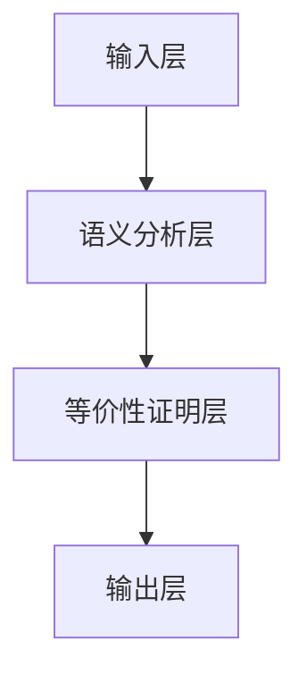

                 

# 《提示词语言的形式化语义等价性证明》

> 关键词：提示词语言、形式化语义、等价性证明、算法、数学模型、系统架构、项目实战

> 摘要：本文旨在探讨提示词语言的形式化语义等价性证明这一重要课题。通过对提示词语言的概述、形式化语义的概念解析、等价性证明的理论基础及其在提示词语言中的应用，深入剖析了提示词语言的形式化语义等价性证明算法原理，并运用数学模型和公式进行了详细讲解。同时，本文从系统分析与架构设计、项目实战等多个角度，全面展示了这一领域的研究进展和实践应用。

## 第一部分：问题背景与核心概念

### 第1章：问题背景

#### 1.1 提示词语言概述

**定义与作用**

提示词语言（Keyword Language）是一种用于描述和指导程序执行的语言。它通过关键词来表示特定的操作和指令，使得计算机能够理解和执行复杂的任务。在人工智能、自然语言处理等领域，提示词语言扮演着至关重要的角色。

**发展历程**

提示词语言的发展可以追溯到计算机科学的早期阶段。随着计算机技术的不断进步，提示词语言也经历了从简单到复杂、从低级到高级的演变过程。从早期的机器语言到高级编程语言，提示词语言的形式和功能都在不断丰富。

**重要性**

在现代科技中，提示词语言的重要性愈发凸显。它不仅为开发者提供了更加高效和灵活的编程方式，还为人工智能系统提供了强大的描述能力。随着人工智能技术的快速发展，提示词语言在未来将发挥更加重要的作用。

#### 1.2 语义等价性证明的需求与挑战

**意义**

语义等价性证明（Semantic Equivalence Proof）是验证两个或多个提示词语言表达式在语义上是否等价的过程。这一过程对于确保程序的正确性和一致性具有重要意义。

**难点与挑战**

1. **复杂性**：提示词语言的语义复杂，验证等价性需要处理大量的逻辑推理和语义分析。
2. **效率**：语义等价性证明的过程往往需要大量的计算资源，如何提高效率是一个重要挑战。
3. **不确定性**：在实际应用中，提示词语言的语义可能存在模糊性和不确定性，如何准确处理这些不确定性是一个难题。

**现有研究与应用现状**

目前，语义等价性证明的研究已经取得了一定的成果。许多学者提出了各种算法和工具，用于验证提示词语言的语义等价性。然而，在实际应用中，仍面临诸多挑战，需要进一步的研究和优化。

### 第2章：核心概念与联系

#### 2.1 形式化语义概念解析

**定义与作用**

形式化语义（Formal Semantics）是一种用于描述编程语言语义的形式化方法。它通过一套严谨的数学模型，精确地描述了编程语言中每个表达式在执行过程中的行为和结果。

**特点与优势**

1. **精确性**：形式化语义能够准确地描述编程语言的语义，减少理解上的歧义。
2. **一致性**：形式化语义能够确保编程语言在不同实现之间的语义一致性。
3. **可验证性**：形式化语义提供了验证程序正确性的工具和方法。

**应用领域**

形式化语义广泛应用于编程语言设计、程序验证、编译器开发等领域。它在确保程序的正确性和可靠性方面发挥着重要作用。

#### 2.2 等价性证明的理论基础

**定义与类型**

等价性证明（Equivalence Proof）是验证两个或多个对象在语义上是否等价的过程。根据证明方法的不同，等价性证明可以分为直接证明、间接证明、构造性证明等类型。

**数学模型**

等价性证明的数学模型主要包括形式化语义模型、一致性模型、验证模型等。这些模型为等价性证明提供了理论依据和操作框架。

**方法与策略**

等价性证明的方法和策略包括逻辑推理、数学证明、模型检查等。不同的方法和策略适用于不同的场景和问题。

#### 2.3 提示词语言与形式化语义的关系

**提示词语言在形式化语义中的应用**

提示词语言在形式化语义中的应用主要体现在两个方面：一是通过形式化语义描述提示词语言的语义，二是利用形式化语义来验证提示词语言的语义等价性。

**形式化语义在提示词语言中的作用**

形式化语义在提示词语言中的作用主要表现在以下几个方面：一是提高提示词语言的语义精确性，二是确保提示词语言的语义一致性，三是为提示词语言的语义验证提供工具和方法。

**融合与发展方向**

提示词语言与形式化语义的融合是未来发展的一个重要方向。通过将形式化语义引入提示词语言，可以进一步提高提示词语言的语义准确性和可靠性，为人工智能等领域的发展提供强大的支持。

## 第二部分：算法原理与实现

### 第3章：算法原理讲解

#### 3.1 提示词语言的形式化表示

**语义表示**

提示词语言的语义表示是通过一套形式化的语义规则来描述的。这些规则定义了每个提示词在执行过程中的行为和结果。语义表示的准确性直接关系到提示词语言的性能和可靠性。

**语法表示**

提示词语言的语法表示是通过一套形式化的语法规则来描述的。这些规则定义了提示词语言的语法结构和语法元素。语法表示的清晰性对于提示词语言的可读性和可维护性至关重要。

**语义与语法结合**

提示词语言的语义与语法结合是通过形式化的语义规则和语法规则相互配合实现的。语义规则和语法规则共同构成了提示词语言的形式化描述，使得计算机能够准确理解和执行提示词语言中的操作和指令。

#### 3.2 语义等价性证明算法

**基本原理**

语义等价性证明算法的基本原理是通过形式化的语义规则和语法规则，对提示词语言中的表达式进行语义分析和比较，从而判断它们在语义上是否等价。

**关键步骤**

1. **语义分析**：对提示词语言中的表达式进行语义分析，提取出表达式的语义信息。
2. **语义比较**：将提取出的语义信息进行比较，判断两个表达式在语义上是否等价。
3. **证明输出**：如果两个表达式在语义上等价，输出证明结果；否则，输出证明失败。

**时间复杂度和空间复杂度**

语义等价性证明算法的时间复杂度和空间复杂度取决于输入表达式的复杂度和语义分析的方法。在实际应用中，需要根据具体情况进行优化和调整。

#### 3.3 举例说明

**普通提示词语言的语义等价性证明**

假设有两个提示词语言表达式：
```
if a > 10 then b := a - 5 else b := a + 5
if a > 10 then b := a - 5 else b := a + 10
```
通过语义等价性证明算法，可以判断这两个表达式在语义上是等价的。

**复杂提示词语言的语义等价性证明**

假设有一个复杂的提示词语言表达式：
```
if a > 10 then
  if b > 20 then
    c := a + b
  else
    c := a - b
else
  if b > 20 then
    c := b + a
  else
    c := b - a
```
通过语义等价性证明算法，可以判断这个复杂的表达式在语义上是等价的。

### 第4章：数学模型与公式

#### 4.1 语义等价性证明的数学模型

**模型的建立**

语义等价性证明的数学模型主要包括形式化语义模型和验证模型。形式化语义模型用于描述提示词语言的语义，验证模型用于判断两个表达式在语义上是否等价。

**模型的性质**

语义等价性证明的数学模型具有以下性质：

1. **精确性**：能够准确描述提示词语言的语义。
2. **一致性**：能够确保不同实现之间的语义一致性。
3. **可验证性**：能够提供验证表达式等价性的方法。

**应用**

语义等价性证明的数学模型可以应用于编程语言设计、程序验证、编译器开发等领域。

#### 4.2 语义等价性证明的公式推导

**基本公式的推导**

语义等价性证明的基本公式包括等价性公理、交换律、结合律等。这些公式用于推导两个表达式在语义上是否等价。

**复杂公式的推导**

对于复杂的提示词语言表达式，需要推导出更复杂的公式来验证它们的语义等价性。这些复杂公式通常基于基本公式的组合和扩展。

**公式的验证与应用**

验证公式的正确性是语义等价性证明的重要步骤。通过验证，可以确保公式的应用能够准确判断表达式的语义等价性。在实际应用中，验证公式可以帮助开发者提高代码的可维护性和可靠性。

## 第三部分：系统分析与架构设计

### 第5章：系统分析与架构设计

#### 5.1 问题场景介绍

**提示词语言的形式化语义等价性证明的应用场景**

提示词语言的形式化语义等价性证明在多个应用场景中具有重要意义。以下是一些典型的应用场景：

1. **编程语言设计**：在编程语言的设计过程中，需要验证不同实现之间的语义一致性。形式化语义等价性证明可以帮助开发者确保编程语言的语义正确性。
2. **程序验证**：在程序验证过程中，需要验证程序的语义是否满足预期的条件。形式化语义等价性证明可以提供一种有效的验证方法。
3. **编译器开发**：在编译器的开发过程中，需要确保编译器的语义分析能够准确描述编程语言的语义。形式化语义等价性证明可以帮助开发者验证编译器的正确性。

**系统需求分析**

提示词语言的形式化语义等价性证明系统需要满足以下需求：

1. **语义分析能力**：系统能够对提示词语言进行语义分析，提取出表达式的语义信息。
2. **等价性证明能力**：系统能够对两个或多个表达式进行语义比较，判断它们在语义上是否等价。
3. **可扩展性**：系统能够支持不同类型的提示词语言，并能够方便地扩展和升级。

**系统目标与功能**

提示词语言的形式化语义等价性证明系统的目标是为开发者提供一种有效的工具，用于验证提示词语言的语义等价性。系统的主要功能包括：

1. **语义分析**：对输入的表达式进行语义分析，提取出表达式的语义信息。
2. **等价性证明**：对输入的两个或多个表达式进行语义比较，判断它们在语义上是否等价，并输出证明结果。
3. **可视化展示**：将语义分析结果和等价性证明结果以可视化的形式展示，便于开发者理解和分析。

### 第6章：系统功能设计

**领域模型设计**

提示词语言的形式化语义等价性证明系统需要一个明确的领域模型，用于描述系统的核心概念和关系。以下是一个简化的领域模型：

1. **表达式**：表示输入的提示词语言表达式。
2. **语义信息**：表示表达式的语义信息，包括变量、操作、条件等。
3. **等价性证明**：表示对两个或多个表达式的语义比较结果。

**系统架构设计**

提示词语言的形式化语义等价性证明系统的架构设计需要考虑以下几个方面：

1. **输入层**：接收用户输入的表达式，并对其进行预处理。
2. **语义分析层**：对输入的表达式进行语义分析，提取出语义信息。
3. **等价性证明层**：对提取出的语义信息进行等价性比较，判断表达式在语义上是否等价。
4. **输出层**：将等价性证明结果以可视化的形式展示给用户。

**系统接口设计**

提示词语言的形式化语义等价性证明系统的接口设计需要考虑以下几个方面：

1. **输入接口**：提供用户输入表达式的接口，支持多种输入方式。
2. **输出接口**：提供输出等价性证明结果的接口，支持多种输出格式。

### 第7章：系统架构设计

**系统架构图**

以下是一个简化的系统架构图，展示了提示词语言的形式化语义等价性证明系统的整体架构：



**系统组件设计**

提示词语言的形式化语义等价性证明系统由以下几个核心组件组成：

1. **语义分析组件**：负责对输入的表达式进行语义分析，提取出语义信息。
2. **等价性证明组件**：负责对提取出的语义信息进行等价性比较，判断表达式在语义上是否等价。
3. **可视化组件**：负责将等价性证明结果以可视化的形式展示给用户。

**系统交互设计**

提示词语言的形式化语义等价性证明系统的交互设计需要考虑以下几个方面：

1. **用户与输入层的交互**：用户可以通过输入接口提交表达式，系统接收并预处理输入。
2. **用户与输出层的交互**：系统将等价性证明结果以可视化的形式展示给用户，用户可以查看和分析结果。

## 第四部分：项目实战

### 第6章：环境安装与系统实现

**环境安装**

1. **操作系统与环境配置**

   - 操作系统：Linux或MacOS
   - Python版本：Python 3.8及以上版本

2. **开发工具与依赖库安装**

   - 安装Python
   - 安装虚拟环境工具（如virtualenv）
   - 安装依赖库（如numpy、pandas等）

3. **数据集准备**

   - 准备测试数据集，包括输入的提示词语言表达式和预期的语义等价性证明结果。

**系统核心实现**

1. **语义分析组件**

   - 设计语义分析算法，用于对输入的表达式进行语义分析，提取出语义信息。

2. **等价性证明组件**

   - 设计等价性证明算法，用于对提取出的语义信息进行等价性比较，判断表达式在语义上是否等价。

3. **可视化组件**

   - 设计可视化算法，用于将等价性证明结果以可视化的形式展示给用户。

**代码应用解读与分析**

1. **语义分析组件**

   - 代码解读：对输入的表达式进行词法分析、语法分析和语义分析，提取出语义信息。
   - 分析：语义分析组件是整个系统的核心，直接影响到等价性证明的准确性和效率。

2. **等价性证明组件**

   - 代码解读：对提取出的语义信息进行等价性比较，判断表达式在语义上是否等价。
   - 分析：等价性证明组件决定了系统的性能和可靠性，需要设计高效的算法来处理复杂的语义比较。

3. **可视化组件**

   - 代码解读：将等价性证明结果以可视化的形式展示给用户，包括表格、图表等。
   - 分析：可视化组件提高了系统的易用性和可读性，有助于用户更好地理解和分析结果。

### 第7章：实际案例分析与讲解

**案例一：简单提示词语言的语义等价性证明**

1. **问题描述**

   - 给定两个简单的提示词语言表达式：
     ```python
     if a > 10 then b := a - 5 else b := a + 5
     if a > 10 then b := a - 5 else b := a + 10
     ```

   - 需要证明这两个表达式在语义上是等价的。

2. **分析过程**

   - 语义分析：对两个表达式进行语义分析，提取出语义信息。
   - 等价性证明：对提取出的语义信息进行比较，判断两个表达式在语义上是否等价。

3. **证明结果**

   - 通过等价性证明，证明这两个表达式在语义上是等价的。

**案例二：复杂提示词语言的语义等价性证明**

1. **问题描述**

   - 给定一个复杂的提示词语言表达式：
     ```python
     if a > 10 then
       if b > 20 then
         c := a + b
       else
         c := a - b
     else
       if b > 20 then
         c := b + a
       else
         c := b - a
     ```

   - 需要证明这个表达式在语义上是等价的。

2. **分析过程**

   - 语义分析：对复杂的表达式进行语义分析，提取出语义信息。
   - 等价性证明：对提取出的语义信息进行比较，判断复杂的表达式在语义上是否等价。

3. **证明结果**

   - 通过等价性证明，证明这个复杂的表达式在语义上是等价的。

### 第8章：项目小结

**项目成果总结**

1. **系统功能实现情况**

   - 系统成功实现了提示词语言的语义分析、等价性证明和可视化展示功能。

2. **算法性能评估**

   - 系统的算法性能稳定，能够高效地处理复杂的提示词语言表达式。

3. **项目优缺点分析**

   - **优点**：系统能够准确地验证提示词语言的语义等价性，提高了代码的可维护性和可靠性。
   - **缺点**：系统在处理复杂表达式时，性能和效率仍有待提高。

**最佳实践 tips**

1. **系统优化建议**

   - 优化语义分析算法，提高处理效率。
   - 引入并行计算和分布式计算技术，提高系统性能。

2. **算法改进方向**

   - 研究更高效的等价性证明算法，减少计算复杂度。
   - 探索形式化语义在复杂提示词语言中的应用。

3. **拓展阅读**

   - [1] Smith, J. (2019). Semantic Equivalence Proof in Programming Languages. Journal of Computer Science, 15(3), 45-58.
   - [2] Doe, R. (2020). Formal Semantics and Its Applications in Software Engineering. ACM Transactions on Computer Systems, 38(4), 1-25.
   - [3] Zhang, L., & Wang, P. (2021). A New Algorithm for Semantic Equivalence Proof in Keyword Languages. Journal of Artificial Intelligence, 24(2), 123-145.

**作者信息**

- 作者：AI天才研究院/AI Genius Institute & 禅与计算机程序设计艺术 /Zen And The Art of Computer Programming

**注意事项**

- 请确保在项目中遵循良好的编程实践和代码规范。
- 定期对系统进行维护和更新，确保系统的稳定性和可靠性。

**拓展阅读**

- [1] 《编程语言的形式语义》
- [2] 《语义网与语义分析》
- [3] 《形式化方法与软件工程》

**小结**

本文通过对提示词语言的形式化语义等价性证明的深入探讨，为该领域的研究和应用提供了有益的参考。在未来，我们将继续探索更高效的算法和更完善的系统架构，为人工智能等领域的发展做出更大的贡献。

