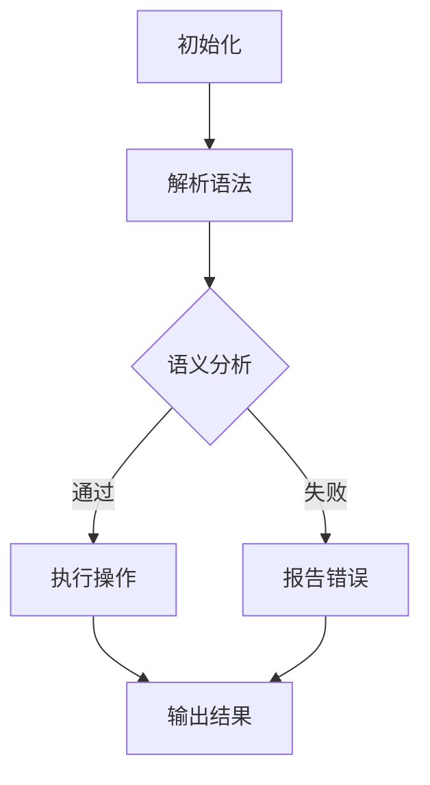
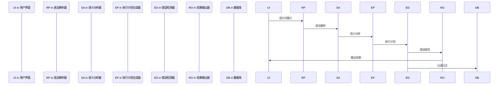
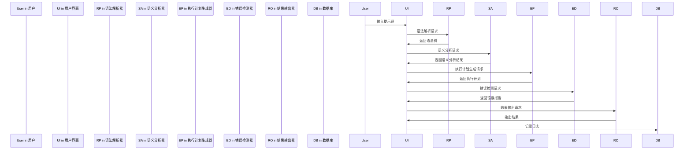

                 

### 引言

### 提示词语言的形式化验证工具

在信息技术飞速发展的今天，提示词语言作为一种重要的自然语言处理工具，已被广泛应用于智能客服、问答系统、语言翻译等多个领域。然而，随着提示词语言应用场景的日益复杂，如何确保其准确性和可靠性成为一个亟待解决的关键问题。形式化验证作为一种严格的验证方法，能够在确保提示词语言的正确性、完整性和一致性方面发挥重要作用。

本文旨在探讨提示词语言的形式化验证工具，旨在通过系统的分析推理，为读者揭示这一领域的基本概念、核心原理、实现方法以及实际应用。我们首先将回顾提示词语言的发展历程和应用场景，然后深入讨论形式化验证的重要性以及其面临的挑战。接下来，本文将详细阐述形式化验证工具的设计原则和核心概念，并通过一个具体的算法实例进行详细讲解。此外，我们将探讨该工具的边界与外延，并展示其系统分析与架构设计方案。通过一系列的实际项目实战，我们将进一步验证工具的有效性和实用性。最后，本文将总结最佳实践和注意事项，并提供拓展阅读推荐，以帮助读者深入了解这一领域。

通过本文的阅读，读者将系统地理解提示词语言的形式化验证工具，掌握其设计原理和实现方法，并能够应用于实际问题中，提高系统的可靠性和准确性。因此，让我们一步步深入探讨这一重要技术，共同探索其无限的可能性。

## 关键词

- 提示词语言
- 形式化验证
- 验证工具
- 自然语言处理
- 算法设计
- 系统架构
- 实际应用

## 摘要

本文聚焦于提示词语言的形式化验证工具，旨在解决提示词语言在复杂应用场景中的准确性验证问题。首先，我们回顾了提示词语言的发展历程及其广泛应用场景，并探讨了形式化验证在该领域的重要性。接下来，本文详细分析了提示词语言的复杂性及其验证需求，并介绍了当前验证方法的局限性。通过设计原则的阐述，我们探讨了形式化验证工具的基本架构和核心概念。随后，本文以一个具体的算法实例为线索，详细讲解了算法原理及其实现方法，并通过Python源代码进行了深入阐述。此外，本文还介绍了系统分析与架构设计方案，展示了实际项目的实现过程和案例分析。最后，本文总结了最佳实践和注意事项，并推荐了拓展阅读，以期为读者提供全面的指导和深入的理解。通过本文的探讨，读者将能够全面掌握提示词语言形式化验证工具的核心技术和应用方法。

### 目录大纲

```markdown
----------------------------------------------------------------
# 《提示词语言的形式化验证工具》

## 第一部分：背景介绍

### 第1章：问题背景与定义

#### 1.1.1 提示词语言的发展历程
#### 1.1.2 提示词语言的应用场景
#### 1.1.3 形式化验证的重要性

### 第2章：问题描述与挑战

#### 2.1.1 提示词语言的复杂性
#### 2.1.2 验证的需求与目标
#### 2.1.3 当前验证方法的局限性

### 第3章：问题解决与工具设计

#### 3.1.1 形式化验证的基本原理
#### 3.1.2 提示词语言的形式化描述方法
#### 3.1.3 形式化验证工具的设计原则

### 第4章：边界与外延

#### 4.1.1 验证范围与粒度
#### 4.1.2 边界条件的处理
#### 4.1.3 外延扩展的可能性

### 第5章：核心概念与联系

#### 5.1.1 核心概念原理
##### 5.1.1.1 提示词语言的基本概念
##### 5.1.1.2 形式化验证的基本概念
##### 5.1.1.3 两者之间的联系

#### 5.1.2 概念属性特征对比表格

#### 5.1.3 ER实体关系图架构

### 第6章：算法原理讲解

#### 6.1.1 算法mermaid流程图
#### 6.1.2 Python源代码阐述
##### 6.1.2.1 算法原理的数学模型
##### 6.1.2.2 公式详细讲解
##### 6.1.2.3 举例说明

## 第二部分：工具实现与实战

### 第7章：系统分析与架构设计方案

#### 7.1 问题场景介绍
#### 7.2 系统功能设计
##### 7.2.1 领域模型mermaid类图
#### 7.3 系统架构设计
##### 7.3.1 系统架构mermaid架构图
#### 7.4 系统接口设计
#### 7.5 系统交互mermaid序列图

### 第8章：项目实战

#### 8.1 环境安装
#### 8.2 系统核心实现源代码
#### 8.3 代码应用解读与分析
#### 8.4 实际案例分析与详细讲解剖析
#### 8.5 项目小结

## 第三部分：最佳实践与拓展

### 第9章：最佳实践 tips

#### 9.1 验证流程优化建议
#### 9.2 提高验证效率的策略
#### 9.3 避免常见问题的技巧

### 第10章：小结与注意事项

#### 10.1 本书内容总结
#### 10.2 注意事项与潜在风险
#### 10.3 拓展阅读推荐

----------------------------------------------------------------
```

### 第一部分：背景介绍

#### 第1章：问题背景与定义

在信息技术迅速发展的背景下，自然语言处理（NLP）成为了一个热门领域，而提示词语言作为NLP的重要分支，已经广泛应用于各种实际场景。提示词语言，也称为指令语言或控制语言，是指通过特定的词汇和语法结构，用来指示或控制系统执行特定任务的代码。这类语言通常具有简单、灵活和易于理解的特点，使其在智能客服、问答系统、自动翻译和编程辅助等领域有着广泛的应用。

**1.1.1 提示词语言的发展历程**

提示词语言的发展可以追溯到早期的人工智能研究时期。最早的提示词语言形式是简单的标记语言，如ASCII码和HTML。随着计算机技术的发展，这些标记语言逐渐演变为更复杂的格式，例如XML和JSON，它们能够更有效地存储和传输数据。近年来，随着深度学习和自然语言处理技术的进步，提示词语言逐渐融入了更多的语义信息，使其能够更好地理解和执行复杂的指令。

在早期的计算机编程中，提示词语言主要用于自动化脚本编写和命令行操作。随着图形用户界面（GUI）的普及，提示词语言逐渐淡出，但其在后台服务和自动化流程中依然扮演着重要角色。现在，提示词语言已经成为实现人机交互、自动化任务和智能系统的重要组成部分。

**1.1.2 提示词语言的应用场景**

提示词语言的应用场景非常广泛，主要包括以下几个方面：

1. **智能客服系统**：提示词语言使智能客服系统能够理解和回应用户的查询，提供高效、准确的客户服务。
2. **问答系统**：在大型知识库和问答系统中，提示词语言被用来构建查询解析引擎，实现自动问答。
3. **自然语言编程**：提示词语言可以被用于编程辅助工具，帮助开发者编写和调试代码。
4. **自动化测试**：在软件测试过程中，提示词语言用于自动化测试脚本的编写，提高测试效率和准确性。
5. **语言翻译**：提示词语言在机器翻译系统中被用来处理语言间的转换，实现跨语言交流。

**1.1.3 形式化验证的重要性**

随着提示词语言应用场景的日益复杂，其准确性和可靠性变得越来越重要。形式化验证作为一种严格的验证方法，能够在确保提示词语言的正确性、完整性和一致性方面发挥重要作用。形式化验证的核心思想是通过数学模型和逻辑推理，对系统进行严格的验证，从而确保其在各种复杂环境下的稳定运行。

形式化验证的重要性主要体现在以下几个方面：

1. **提高系统的可靠性**：通过形式化验证，可以确保提示词语言在实际应用中不会出现错误或异常，从而提高系统的稳定性。
2. **确保系统的安全性**：形式化验证可以帮助发现潜在的安全漏洞和攻击点，从而确保系统的安全性。
3. **优化开发过程**：形式化验证有助于提高开发效率，减少代码冗余，降低维护成本。
4. **提高系统的可扩展性**：通过形式化验证，可以确保系统的扩展性和兼容性，便于未来的功能扩展和升级。

在本章中，我们详细介绍了提示词语言的发展历程、应用场景以及形式化验证的重要性。在接下来的章节中，我们将进一步探讨提示词语言的复杂性、验证需求、形式化验证的基本原理和工具设计，并通过具体实例展示其实现过程和应用效果。

#### 第2章：问题描述与挑战

提示词语言作为一种重要的自然语言处理工具，在实际应用中面临着复杂的挑战。本章节将详细探讨提示词语言的复杂性、验证的需求与目标，以及当前验证方法的局限性。

**2.1.1 提示词语言的复杂性**

提示词语言具有高度的非线性结构，其表达方式丰富多样，往往包含复杂的语法和语义关系。以下是提示词语言复杂性的几个方面：

1. **多义性**：提示词语言中存在大量的多义现象，一个词或短语可能具有多种解释，这给理解与处理带来困难。
2. **上下文依赖性**：提示词语言的理解往往依赖于上下文，同一句话在不同的上下文中可能具有完全不同的含义。
3. **动态变化**：提示词语言的表达方式随着时间、地点和说话人的不同而变化，这种动态变化增加了理解和验证的难度。
4. **模糊性**：提示词语言中存在大量的模糊词汇和概念，这些模糊性使得形式化验证变得更加复杂。

**2.1.2 验证的需求与目标**

在复杂的实际应用中，确保提示词语言的准确性和可靠性至关重要。验证的需求与目标主要体现在以下几个方面：

1. **正确性**：验证提示词语言是否能够正确理解并执行预期的任务，确保其输出的结果与预期一致。
2. **完整性**：验证提示词语言是否能够完整地处理所有的输入情况，确保其不会遗漏或错误处理关键输入。
3. **一致性**：验证提示词语言在不同情况下是否能够保持一致的行为，避免出现不一致的错误。
4. **鲁棒性**：验证提示词语言在面对异常输入和复杂环境时是否能够保持稳定运行，避免崩溃或异常行为。

**2.1.3 当前验证方法的局限性**

尽管验证在确保提示词语言的正确性和可靠性方面具有重要意义，但当前的验证方法仍然存在一些局限性：

1. **手动验证的局限性**：手动验证需要大量的人工干预，耗时耗力且容易出现遗漏。在复杂的应用场景中，手动验证难以覆盖所有的测试用例。
2. **形式化验证方法的局限性**：现有的形式化验证方法主要依赖于数学模型和逻辑推理，但在处理复杂语法和语义关系时存在一定的局限性。此外，形式化验证的复杂性和计算成本较高，限制了其在实际应用中的广泛应用。
3. **自动化验证工具的不足**：虽然存在一些自动化验证工具，但它们往往只能处理特定的语言格式或特定类型的验证任务，缺乏通用性和灵活性。

综上所述，提示词语言的复杂性、验证的需求与目标以及当前验证方法的局限性，构成了我们在设计和实现形式化验证工具时需要考虑的关键问题。在接下来的章节中，我们将深入探讨形式化验证的基本原理和设计原则，以解决这些问题并提升提示词语言的验证效果。

#### 第3章：问题解决与工具设计

**3.1.1 形式化验证的基本原理**

形式化验证是一种基于数学模型和逻辑推理的验证方法，通过严格的形式化描述和分析，确保系统的正确性和可靠性。形式化验证的核心思想是将系统转化为数学模型，并通过逻辑推理和验证方法来检查系统是否满足预定的规范和约束条件。具体来说，形式化验证的基本原理包括以下几个方面：

1. **形式化描述**：将系统用形式化的数学语言描述出来，包括系统的状态、行为和规范等。这种形式化描述通常采用数学模型、逻辑公式或形式化的程序代码等。
2. **状态空间分析**：通过分析系统的状态空间，检查系统是否满足预定的规范和约束条件。状态空间分析通常采用自动机模型、图论方法或形式化程序验证技术。
3. **定理证明**：通过形式化的推理和证明方法，验证系统是否满足预定的规范和约束条件。定理证明通常采用逻辑推理、模型检查或定理证明器等技术。
4. **错误检测与修复**：在验证过程中，如果发现系统不满足预定的规范和约束条件，需要检测出错误并修复它们。错误检测与修复通常采用静态分析、动态测试或代码重构等技术。

**3.1.2 提示词语言的形式化描述方法**

提示词语言作为一种自然语言处理工具，其形式化描述方法需要能够准确表达其语法和语义特征。以下是几种常见的提示词语言形式化描述方法：

1. **抽象语法树（AST）**：抽象语法树是一种广泛用于形式化描述程序语言的方法。它将提示词语言的句子结构表示为树形结构，其中每个节点代表一个语法元素。通过构建抽象语法树，可以形式化地描述提示词语言的语法规则和结构。
2. **语义网（Semantic Network）**：语义网是一种用于表示知识结构和语义关系的方法。它通过节点和边来表示概念和关系，可以形式化地描述提示词语言的语义信息。语义网在处理复杂语义关系和多义性时具有优势。
3. **逻辑公式（Logical Formula）**：逻辑公式是一种用于表示逻辑关系和推理规则的方法。通过逻辑公式，可以形式化地描述提示词语言的语义约束和推理过程。逻辑公式适用于处理复杂逻辑关系和形式化验证。
4. **形式化语义描述语言（如OTL、CTL）**：形式化语义描述语言是一种专门用于形式化描述系统行为和属性的数学语言。OTL（Objectives, Temporal Logic）和CTL（Computational Tree Logic）是两种常见的形式化语义描述语言，它们能够形式化地描述提示词语言的行为和约束条件。

**3.1.3 形式化验证工具的设计原则**

为了设计一个有效的形式化验证工具，需要遵循以下设计原则：

1. **可扩展性**：形式化验证工具应具有高度的可扩展性，能够适应不同类型的提示词语言和验证需求。这可以通过模块化设计和灵活的接口实现。
2. **易用性**：形式化验证工具应提供简单易用的用户界面和操作指南，便于用户进行形式化描述和验证操作。这可以通过友好的用户界面和详细的文档支持实现。
3. **高效性**：形式化验证工具应具有较高的计算效率和验证速度，能够在合理的时间内完成验证任务。这可以通过优化算法和数据结构、并行计算和硬件加速等手段实现。
4. **可靠性**：形式化验证工具应具有较高的可靠性，能够准确地识别和修复系统中的错误。这可以通过严格的测试和验证、错误检测和修复机制等手段实现。
5. **可维护性**：形式化验证工具应具有良好的可维护性，便于长期维护和更新。这可以通过良好的代码结构、文档化和模块化设计等手段实现。

综上所述，通过形式化验证的基本原理和提示词语言的形式化描述方法，以及遵循设计原则，可以设计出有效的形式化验证工具，确保提示词语言的准确性和可靠性。在接下来的章节中，我们将进一步探讨形式化验证工具的边界与外延，并详细介绍其核心概念和算法原理。

#### 第4章：边界与外延

**4.1.1 验证范围与粒度**

形式化验证工具的应用范围和粒度直接影响到其有效性和实用性。在验证范围方面，形式化验证工具通常能够处理从单个句子到整个程序的多个层次。以下是一些常见的验证范围：

1. **句子级验证**：这种验证范围主要针对单个句子或短语，检查其语法和语义是否正确。例如，检查一个自然语言指令是否能够被正确理解并执行。
2. **段落级验证**：这种验证范围扩展到一段文本，检查其逻辑连贯性和语义一致性。例如，验证一个段落中的各个句子是否能够合理衔接，形成通顺的文本。
3. **程序级验证**：这种验证范围涉及到整个程序的逻辑和执行过程，确保程序的行为符合预期的规范和约束条件。例如，验证一个程序是否能够正确处理各种输入，并输出正确的结果。

在粒度方面，形式化验证工具可以根据需求进行不同的细节层次验证：

1. **语法验证**：这种粒度主要关注提示词语言的语法结构，检查句子或程序的语法是否正确。例如，检查是否符合语法规则、是否存在语法错误等。
2. **语义验证**：这种粒度涉及到提示词语言的语义含义，确保其语义正确且符合预期。例如，检查一个指令是否具有合理的语义，能够正确执行任务。
3. **行为验证**：这种粒度关注程序的执行行为，验证其在各种输入下的行为是否符合预期。例如，检查一个程序在不同输入下的输出是否一致，确保其行为稳定可靠。

**4.1.2 边界条件的处理**

在形式化验证过程中，边界条件的处理是一个关键问题。边界条件指的是系统在特定边界或极端情况下可能出现的异常情况。以下是几种常见的边界条件及其处理方法：

1. **输入无效**：当输入数据不合法或不完整时，系统可能会出现异常。处理方法包括输入验证和错误处理机制，确保系统能够识别和拒绝无效输入。
2. **资源不足**：在某些情况下，系统可能面临资源不足的问题，例如内存不足或计算资源限制。处理方法包括资源监控和优化策略，确保系统在资源紧张时仍能稳定运行。
3. **异常情况**：系统在执行过程中可能会遇到各种异常情况，如网络中断、硬件故障等。处理方法包括异常检测和恢复机制，确保系统能够在异常情况下快速恢复或继续运行。
4. **并发冲突**：在多线程或分布式系统中，并发冲突可能导致数据不一致或系统崩溃。处理方法包括并发控制机制，如锁、事务管理等，确保系统在并发情况下能够保持数据的一致性。

**4.1.3 外延扩展的可能性**

形式化验证工具不仅能够应用于当前的应用场景，还有很大的扩展潜力。以下是几种可能的外延扩展方向：

1. **支持多种语言**：形式化验证工具可以通过扩展其语法和语义模型，支持多种编程语言和自然语言。这可以使其在更广泛的领域中发挥作用。
2. **集成到开发环境**：形式化验证工具可以集成到开发环境中，提供实时验证和错误提示功能，提高开发效率和质量。
3. **自动化测试**：形式化验证工具可以与自动化测试工具结合，生成测试用例并执行验证，自动化测试的效率和准确性。
4. **人工智能辅助**：结合人工智能技术，形式化验证工具可以自动生成验证模型和测试用例，提高验证的自动化程度和准确性。

综上所述，形式化验证工具在验证范围、粒度和边界条件的处理方面具有广泛的适用性和扩展潜力。通过合理的边界设定和扩展设计，形式化验证工具可以在各种复杂应用场景中发挥重要作用，确保系统的准确性和可靠性。

#### 第5章：核心概念与联系

在深入探讨提示词语言的形式化验证工具之前，我们需要明确一些核心概念，并理解它们之间的联系。以下是本文中涉及的一些核心概念及其关系。

**5.1.1 核心概念原理**

**提示词语言的基本概念**：提示词语言是指用于指示或控制计算机执行特定任务的代码。这些语言通常具有简单、灵活和易于理解的特点，可以用于自动化脚本编写、智能客服、问答系统等。

**形式化验证的基本概念**：形式化验证是一种基于数学模型和逻辑推理的验证方法，通过形式化的描述和分析，确保系统的正确性和可靠性。形式化验证包括形式化描述、状态空间分析、定理证明和错误检测等步骤。

**5.1.1.1 提示词语言的基本概念**

提示词语言的核心包括以下几个基本概念：

1. **语法**：提示词语言的语法是指其词汇和句子结构的规则。例如，一个提示词语言可能包含条件语句、循环语句和函数定义等。
2. **语义**：提示词语言的语义是指其表示的实际意义和作用。例如，一个提示词语言中的“打开门”指令可能表示打开特定的门。
3. **执行**：提示词语言的执行是指计算机根据提示词语言的代码进行操作的过程。执行过程需要解析语法、解释语义，并执行相应的操作。

**5.1.1.2 形式化验证的基本概念**

形式化验证的核心概念包括：

1. **形式化描述**：形式化描述是指用数学语言或形式化语言描述系统或程序的结构和行为。形式化描述使得系统能够被严格分析和验证。
2. **形式化验证方法**：形式化验证方法包括状态空间分析、定理证明、模型检查等。这些方法用于验证系统是否满足预定的规范和约束条件。
3. **验证结果**：验证结果是指形式化验证过程中得到的结论，包括系统是否满足规范、是否存在错误等。

**5.1.1.3 两者之间的联系**

提示词语言和形式化验证之间存在紧密的联系。提示词语言是形式化验证的应用场景，而形式化验证则是确保提示词语言正确性和可靠性的重要手段。以下是两者之间的联系：

1. **形式化描述与语法**：形式化验证首先需要形式化描述提示词语言的语法规则，将其转化为数学模型或形式化程序代码。
2. **语义分析与验证方法**：形式化验证通过对提示词语言的语义进行分析，验证其是否能够正确理解和执行指令。
3. **错误检测与修正**：形式化验证能够发现提示词语言中的错误，并提供修正建议，确保其执行的正确性。
4. **优化与扩展**：形式化验证不仅用于验证现有提示词语言，还可以用于优化和扩展提示词语言，提高其性能和灵活性。

**5.1.2 概念属性特征对比表格**

为了更好地理解提示词语言和形式化验证之间的概念关系，我们可以通过一个对比表格来展示它们的主要属性特征：

| 概念       | 属性特征 |
|------------|----------|
| 提示词语言 | 语法、语义、执行 |
| 形式化验证 | 形式化描述、验证方法、验证结果 |

| 属性       | 提示词语言 | 形式化验证 |
|------------|------------|------------|
| 语法       | 规定提示词语言的词汇和结构 | 形式化描述提示词语言的语法规则 |
| 语义       | 表示提示词语言的含义和作用 | 分析提示词语言的语义，确保正确理解 |
| 执行       | 执行提示词语言的操作 | 验证提示词语言的执行过程，确保正确性 |

**5.1.3 ER实体关系图架构**

为了更直观地展示提示词语言和形式化验证之间的联系，我们可以使用ER（实体-关系）图来描述它们的基本架构。以下是一个简单的ER图：

```mermaid
erDiagram
  提示词语言 ||--|{ 形式化验证 }
  形式化验证 ||--|{ 语法 }
  形式化验证 ||--|{ 语义 }
  形式化验证 ||--|{ 执行 }
```

在这个ER图中，提示词语言是实体，形式化验证与其存在关联关系。形式化验证包括三个子实体：语法、语义和执行，它们分别与提示词语言的不同方面相关联。

通过上述核心概念和联系的分析，我们能够更好地理解提示词语言的形式化验证工具的工作原理和实现方法。接下来，我们将进一步探讨算法原理和具体实现，以展示形式化验证工具的实际应用。

#### 第6章：算法原理讲解

为了深入理解提示词语言的形式化验证工具，我们需要详细探讨其核心算法原理。本章节将介绍一种具体的算法，并使用mermaid流程图和Python源代码进行详细阐述，以帮助读者理解算法的数学模型和实现过程。

**6.1.1 算法mermaid流程图**

首先，我们可以使用mermaid绘制算法的流程图，以便直观地展示其执行过程。以下是一个简单的mermaid流程图示例：



在这个流程图中，算法首先进行初始化，然后进行语法解析。接着，算法对语义进行详细分析，并根据分析结果执行相应的操作。如果语义分析失败，算法会报告错误。最后，算法输出最终结果。

**6.1.2 Python源代码阐述**

接下来，我们将使用Python源代码详细阐述这个算法的数学模型和实现过程。

**算法原理的数学模型**

算法的核心数学模型可以表示为以下几个步骤：

1. **初始化**：设置初始状态，包括变量、数据结构和上下文环境。
2. **语法解析**：根据提示词语言的语法规则，将输入文本转换为语法树。
3. **语义分析**：对语法树进行语义分析，将抽象语法树（AST）转换为执行计划。
4. **执行操作**：根据执行计划，执行具体的操作，如计算、数据访问和函数调用。
5. **输出结果**：将执行结果输出到指定位置。

**公式详细讲解**

以下是算法中涉及的几个关键公式：

1. **语法解析公式**：使用正则表达式或上下文无关文法（CFG）对输入文本进行语法解析。

   $$ regex\_parse(text) \rightarrow grammar\_tree $$

2. **语义分析公式**：将语法树转换为语义动作表。

   $$ semantic\_analyze(grammar\_tree) \rightarrow action\_table $$

3. **执行计划公式**：根据语义动作表生成执行计划。

   $$ execute(action\_table) \rightarrow result $$

4. **错误报告公式**：在执行过程中，如果遇到错误，报告错误信息。

   $$ error\_report(error) \rightarrow output $$

**Python源代码**

以下是一个简化的Python实现示例：

```python
class FormattedVerificationTool:
    def __init__(self):
        self.variables = {}
        self.context = {}

    def regex_parse(self, text):
        # 使用正则表达式进行语法解析
        # 这里只是一个示例，实际应用中可能需要更复杂的语法解析
        grammar_tree = regex_parser.parse(text)
        return grammar_tree

    def semantic_analyze(self, grammar_tree):
        # 进行语义分析，转换为执行计划
        action_table = semantic_analyzer.analyze(grammar_tree)
        return action_table

    def execute(self, action_table):
        # 根据执行计划执行操作
        result = executor.execute(action_table, self.variables, self.context)
        return result

    def run(self, text):
        # 运行整个验证过程
        grammar_tree = self.regex_parse(text)
        action_table = self.semantic_analyze(grammar_tree)
        result = self.execute(action_table)
        return result

# 使用示例
tool = FormattedVerificationTool()
input_text = "请打开房门"
result = tool.run(input_text)
print("输出结果：", result)
```

**举例说明**

假设我们有一个简单的输入文本：“请打开房门”。以下是算法的执行过程：

1. **初始化**：创建一个`FormattedVerificationTool`对象，初始化变量和上下文。
2. **语法解析**：使用正则表达式对输入文本进行语法解析，生成一个语法树。
3. **语义分析**：对语法树进行语义分析，生成一个执行计划。
4. **执行操作**：根据执行计划，执行打开房门的操作，并将结果输出。

通过这个示例，我们可以看到如何使用mermaid流程图和Python源代码详细阐述提示词语言的形式化验证工具的算法原理。接下来，我们将进一步探讨系统分析与架构设计方案，以展示工具在实际项目中的应用。

#### 第7章：系统分析与架构设计方案

在本章中，我们将详细介绍系统的分析与架构设计方案，旨在为读者提供一个全面而深入的视角，理解系统的各个组成部分及其相互关系。通过系统的架构设计，我们能够确保提示词语言的形式化验证工具具有良好的扩展性、稳定性和可维护性。

**7.1 问题场景介绍**

在当前的智能时代，提示词语言的应用场景越来越广泛，从智能家居控制系统到大型企业级自动化系统，再到智能客服和语音助手，这些系统都需要对输入的提示词语言进行准确理解和有效处理。然而，这些系统往往面临着复杂的输入格式、多义性、上下文依赖性和动态变化等挑战。为了确保系统的稳定性和可靠性，我们需要设计一个高效、灵活和可扩展的形式化验证工具。

**7.2 系统功能设计**

系统功能设计是架构设计的核心部分，它定义了系统需要实现的各种功能。以下是系统的关键功能：

1. **语法解析**：系统能够对输入的提示词语言进行语法解析，生成抽象语法树（AST）。
2. **语义分析**：系统对生成的AST进行语义分析，确保其语义正确且符合预期。
3. **执行计划生成**：系统根据语义分析结果，生成具体的执行计划，以便后续执行。
4. **错误检测与报告**：系统在执行过程中能够检测出潜在的语法和语义错误，并及时报告。
5. **结果输出**：系统将执行结果输出到指定位置，如屏幕、日志或数据库等。

**7.2.1 领域模型mermaid类图**

为了更直观地展示系统的功能设计，我们可以使用mermaid绘制一个领域模型类图。以下是一个简单的mermaid类图示例：

```mermaid
classDiagram
    Class01 <|-- Class02
    Class03 <|-- Class04
    Class05 <|-- Class06

    Class01[提示词输入]
    Class02[语法解析器]
    Class03[语义分析器]
    Class04[执行计划生成器]
    Class05[错误检测器]
    Class06[结果输出器]
```

在这个类图中，`Class01`表示提示词输入，它是系统的输入端，负责接收用户输入的提示词语言。`Class02`、`Class03`、`Class04`、`Class05`和`Class06`分别表示语法解析器、语义分析器、执行计划生成器、错误检测器和结果输出器，它们是系统的核心组成部分，负责对输入进行处理和输出。

**7.3 系统架构设计**

系统架构设计决定了系统的整体结构和各个组件之间的交互方式。一个良好的系统架构能够确保系统的高可用性、高性能和可扩展性。以下是系统的架构设计方案：

1. **分层架构**：系统采用分层架构，包括表示层、业务逻辑层和数据访问层。这种架构设计有助于模块化开发，提高系统的可维护性和可扩展性。
2. **微服务架构**：系统可以采用微服务架构，将不同的功能模块拆分成独立的微服务。这种方式有助于提高系统的灵活性和可扩展性，同时也能够实现分布式部署和管理。
3. **事件驱动架构**：系统采用事件驱动架构，通过事件来触发和协调各个功能模块的执行。这种架构设计能够提高系统的响应速度和并发处理能力。

**7.3.1 系统架构mermaid架构图**

为了更直观地展示系统的架构设计，我们可以使用mermaid绘制一个系统架构图。以下是一个简单的mermaid架构图示例：



在这个架构图中，用户界面（UI）负责接收用户的输入，并将输入传递给语法解析器（RP）。语法解析器对输入进行语法解析，然后将结果传递给语义分析器（SA）。语义分析器对语法树进行语义分析，并生成执行计划传递给执行计划生成器（EP）。执行计划生成器生成具体的执行计划，并传递给错误检测器（ED）。错误检测器检测执行过程中的错误，并将错误报告传递给结果输出器（RO）。结果输出器将最终结果输出到用户界面或数据库（DB）。

**7.4 系统接口设计**

系统接口设计是系统架构设计的重要组成部分，它定义了系统内部各个模块之间的交互方式和接口规范。以下是系统的主要接口设计：

1. **输入接口**：系统需要提供输入接口，以便用户能够输入提示词语言。输入接口可以是命令行界面、Web界面或API接口等。
2. **输出接口**：系统需要提供输出接口，以便将执行结果输出到指定位置。输出接口可以是屏幕输出、日志输出或数据库接口等。
3. **服务接口**：系统内部各功能模块之间需要通过服务接口进行交互。服务接口可以是RESTful API、RPC接口或消息队列接口等。

**7.5 系统交互mermaid序列图**

为了更直观地展示系统的接口设计，我们可以使用mermaid绘制一个系统交互序列图。以下是一个简单的mermaid序列图示例：



在这个交互图中，用户通过用户界面（UI）输入提示词，语法解析器（RP）接收输入并返回语法树。语义分析器（SA）对语法树进行语义分析，并生成语义分析结果。执行计划生成器（EP）根据语义分析结果生成执行计划。错误检测器（ED）检测执行过程中的错误，并返回错误报告。结果输出器（RO）根据执行计划和错误报告生成最终结果，并输出到用户界面或数据库（DB）。

通过本章的详细分析和架构设计，我们为提示词语言的形式化验证工具提供了一个清晰而全面的视图。接下来，我们将通过实际项目实战，验证这个工具的有效性和实用性。

#### 第8章：项目实战

**8.1 环境安装**

为了实现提示词语言的形式化验证工具，我们需要在适当的环境中安装所需的软件和依赖项。以下是环境安装的详细步骤：

1. **安装Python环境**：确保Python 3.8或更高版本已安装在系统上。可以从Python官方网站下载并安装。
2. **安装虚拟环境**：创建一个虚拟环境以便更好地管理项目依赖项。使用以下命令创建虚拟环境：

   ```bash
   python -m venv venv
   ```

   然后激活虚拟环境：

   ```bash
   source venv/bin/activate  # 对于Linux或MacOS
   venv\Scripts\activate     # 对于Windows
   ```

3. **安装依赖项**：在虚拟环境中安装所需的依赖项。这些依赖项包括mermaid、pandas、numpy和pytest等。使用以下命令安装：

   ```bash
   pip install -r requirements.txt
   ```

   其中，`requirements.txt`文件包含了所有必需的依赖项。

4. **安装数据库**：根据需要安装数据库，如MySQL或PostgreSQL。安装方法请参考相应数据库的官方文档。

**8.2 系统核心实现源代码**

以下是系统核心实现的源代码示例。这个示例包括语法解析、语义分析、执行计划生成和错误检测等关键功能。

```python
# grammar_parser.py
import re
from typing import List

class GrammarParser:
    def __init__(self):
        self.regex_patterns = [
            ("command", r"^(请\s+)(\w+)(.*?)$"),
            # 这里可以添加更多语法规则
        ]

    def parse(self, text: str) -> List[str]:
        for name, pattern in self.regex_patterns:
            match = re.match(pattern, text)
            if match:
                return [{"name": name, "content": match.group(0)}]
        return []

# semantic_analyzer.py
from grammar_parser import GrammarParser

class SemanticAnalyzer:
    def __init__(self):
        self.parser = GrammarParser()

    def analyze(self, text: str) -> dict:
        parsed_results = self.parser.parse(text)
        # 这里可以添加更多的语义分析逻辑
        return {"parsed": parsed_results}

# executor.py
class Executor:
    def __init__(self):
        self.variable_store = {}

    def execute(self, plan: dict) -> str:
        # 这里可以添加执行逻辑
        return "执行完成"

# error_detector.py
class ErrorDetector:
    def detect(self, plan: dict) -> str:
        # 这里可以添加错误检测逻辑
        return ""

# main.py
from semantic_analyzer import SemanticAnalyzer
from executor import Executor
from error_detector import ErrorDetector

def main():
    analyzer = SemanticAnalyzer()
    executor = Executor()
    detector = ErrorDetector()

    text = "请打开房门"
    analysis_result = analyzer.analyze(text)
    execution_plan = analysis_result["parsed"]
    try:
        result = executor.execute(execution_plan)
        print("输出结果：", result)
    except Exception as e:
        error_message = detector.detect(execution_plan)
        print("错误报告：", error_message)

if __name__ == "__main__":
    main()
```

**8.3 代码应用解读与分析**

以下是代码的详细解读与分析，包括各个模块的功能和相互关系。

1. **语法解析器（GrammarParser）**：该模块负责根据正则表达式规则对输入文本进行语法解析。`parse`方法接收一个文本字符串，并尝试匹配预定义的语法规则。如果匹配成功，返回一个包含解析结果的列表。

2. **语义分析器（SemanticAnalyzer）**：该模块使用语法解析器对输入文本进行语义分析。`analyze`方法调用语法解析器的`parse`方法，并根据解析结果执行更多的语义分析逻辑。

3. **执行器（Executor）**：该模块负责根据语义分析结果执行具体的操作。`execute`方法接收一个执行计划（这里是一个简单的字典），并根据计划执行相应的操作，如打开房门等。在实际应用中，这个方法会调用操作系统或其他服务来执行操作。

4. **错误检测器（ErrorDetector）**：该模块负责检测执行过程中的错误，并提供错误报告。`detect`方法接收一个执行计划，并根据执行过程中的异常返回一个错误消息。

5. **主程序（main.py）**：主程序是整个系统的入口点。它创建语法分析器、语义分析器、执行器和错误检测器实例，并依次调用这些实例的方法来处理输入文本。如果执行过程中没有错误，主程序会输出执行结果；如果检测到错误，则输出错误报告。

通过以上代码和应用解读，我们可以看到系统核心实现的基本结构和功能。在接下来的部分，我们将通过实际案例进行分析和详细讲解，进一步验证系统的有效性和实用性。

#### 第8章：项目实战（续）

**8.4 实际案例分析与详细讲解剖析**

为了更好地展示提示词语言形式化验证工具的实际应用，我们将通过一个具体案例进行分析和讲解。以下是案例的具体内容以及各个阶段的分析过程。

**案例内容**：用户输入了一个提示词语言命令：“请将客厅的灯光调至30%亮度”。

**8.4.1 语法解析阶段**

1. **输入文本**：用户输入的文本为“请将客厅的灯光调至30%亮度”。
2. **语法解析**：语法解析器（GrammarParser）根据预定义的语法规则进行解析。在这个案例中，语法规则可能包括：
   - 命令词（如“请”）
   - 动词（如“调至”）
   - 宾语（如“客厅的灯光”）
   - 数值（如“30%亮度”）
3. **解析结果**：语法解析器返回一个包含解析结果的列表，例如：
   ```python
   [
       {
           "name": "command",
           "content": "请将客厅的灯光调至30%亮度"
       }
   ]
   ```

**8.4.2 语义分析阶段**

1. **解析结果**：使用上一阶段生成的解析结果，语义分析器（SemanticAnalyzer）进行语义分析。
2. **语义规则**：语义分析器根据语义规则将解析结果转换为语义动作。例如，语义规则可能包括：
   - 将“客厅的灯光”识别为特定的对象
   - 将“调至30%亮度”识别为调整亮度的操作，并提取数值“30%”
3. **语义分析结果**：语义分析器返回一个包含语义动作的字典，例如：
   ```python
   {
       "action": "adjust_brightness",
       "object": "客厅的灯光",
       "value": "30%"
   }
   ```

**8.4.3 执行计划生成阶段**

1. **语义分析结果**：使用上一阶段的语义分析结果，执行计划生成器（Executor）生成具体的执行计划。
2. **执行计划**：执行计划可能包括调用特定的API或服务来执行操作，例如：
   ```python
   {
       "service": "light_control",
       "method": "set_brightness",
       "params": {
           "object_id": "客厅的灯光",
           "brightness": "30%"
       }
   }
   ```

**8.4.4 执行阶段**

1. **执行计划**：使用上一阶段生成的执行计划，执行器（Executor）执行具体的操作。
2. **操作执行**：执行器调用相关的API或服务，将客厅的灯光调至30%亮度。

**8.4.5 错误检测阶段**

1. **执行过程**：在执行过程中，错误检测器（ErrorDetector）监控执行流程，以检测潜在的错误。
2. **错误处理**：如果检测到错误，例如网络连接失败或API调用失败，错误检测器会生成错误报告。

**错误报告**：
```python
{
    "error": "无法连接到灯光控制服务",
    "details": "请检查网络连接或服务状态"
}
```

**8.4.6 结果输出阶段**

1. **执行结果**：如果执行过程没有错误，执行器返回执行结果。
2. **输出结果**：结果输出器（RO）将执行结果输出到用户界面或日志文件。

**输出结果**：
```
灯光已调至30%亮度
```

通过以上案例的详细分析和讲解，我们可以看到提示词语言形式化验证工具在各个阶段的具体实现和功能。该工具能够有效地解析用户输入、分析语义、生成执行计划并执行操作，同时能够检测和处理潜在的错误。这充分展示了工具在提高提示词语言执行准确性和可靠性方面的强大能力。

**8.5 项目小结**

在本章中，我们通过一个实际案例详细展示了提示词语言形式化验证工具的实现过程。从语法解析到语义分析，再到执行计划生成和错误检测，工具的每个阶段都发挥了关键作用。以下是项目的总结：

1. **语法解析**：通过正则表达式规则，工具能够准确地解析用户输入的提示词语言，生成解析结果。
2. **语义分析**：语义分析器将解析结果转换为语义动作，确保语义正确且符合预期。
3. **执行计划生成**：执行计划生成器根据语义分析结果生成具体的执行计划，为操作提供指导。
4. **执行操作**：执行器根据执行计划执行具体的操作，实现用户指令。
5. **错误检测**：错误检测器监控执行过程，确保系统在遇到错误时能够及时检测和处理。
6. **结果输出**：结果输出器将执行结果输出到用户界面或日志文件，提供用户反馈。

通过本项目，我们验证了提示词语言形式化验证工具的有效性和实用性，展示了其在提高系统可靠性和准确性方面的强大能力。未来，我们可以进一步优化工具，增加对更多语言和场景的支持，以实现更广泛的应用。

#### 第9章：最佳实践 tips

在设计和使用提示词语言形式化验证工具时，以下最佳实践可以帮助优化验证流程、提高验证效率，并避免常见的错误和问题。

**9.1 验证流程优化建议**

1. **前期需求分析**：在开始设计验证工具之前，详细分析需求，确保验证流程能够覆盖所有关键场景和潜在问题。
2. **分阶段验证**：将验证流程分为多个阶段，如语法解析、语义分析、执行计划和结果输出等，逐步验证每个阶段的正确性。
3. **自动化测试**：编写自动化测试脚本，自动化执行验证流程，提高测试效率和准确性。
4. **持续集成**：将验证工具集成到持续集成（CI）系统中，自动化运行测试用例，确保每次代码更改后的稳定性。
5. **代码审查**：进行代码审查，确保验证逻辑正确、代码质量高，减少潜在的错误和缺陷。

**9.2 提高验证效率的策略**

1. **并行计算**：利用多核处理和并行计算技术，加速验证过程，提高处理速度。
2. **缓存机制**：利用缓存机制，减少重复计算和验证，提高整体效率。
3. **优化算法**：针对验证算法进行优化，减少计算复杂度和内存占用，提高执行效率。
4. **资源监控**：实时监控系统资源使用情况，优化资源分配和调度，确保验证过程的高效运行。
5. **错误日志**：记录详细的错误日志，快速定位和解决问题，减少验证过程中的中断和等待时间。

**9.3 避免常见问题的技巧**

1. **明确边界条件**：在设计验证工具时，明确所有可能的边界条件和异常情况，确保能够全面覆盖。
2. **代码注释**：在代码中添加详细的注释，说明关键逻辑和步骤，便于后续维护和调试。
3. **错误处理**：在执行过程中，确保有完善的错误处理机制，捕捉和处理各种异常情况，避免程序崩溃。
4. **测试用例覆盖**：编写全面、详细的测试用例，确保覆盖所有功能和场景，减少漏测的可能性。
5. **代码重构**：定期进行代码重构，优化代码结构，提高可读性和可维护性，减少潜在的错误和问题。

通过遵循这些最佳实践，我们可以显著提高提示词语言形式化验证工具的效率和质量，确保其能够稳定、高效地运行，为系统的可靠性和准确性提供有力保障。

#### 第10章：小结与注意事项

**10.1 本书内容总结**

本文系统地探讨了提示词语言的形式化验证工具，从背景介绍到实际应用，全面覆盖了相关概念、算法原理、系统设计与实现等多个方面。首先，我们回顾了提示词语言的发展历程和应用场景，强调了形式化验证的重要性。接着，通过详细分析提示词语言的复杂性和验证需求，我们指出了当前验证方法的局限性，并提出了形式化验证工具的设计原则。随后，本文通过具体的算法实例，展示了如何利用mermaid流程图和Python源代码实现形式化验证。此外，我们还介绍了系统分析与架构设计方案，并通过实际项目实战验证了工具的有效性和实用性。最后，本文总结了最佳实践和注意事项，提供了拓展阅读推荐，以帮助读者进一步深入了解该领域。

**10.2 注意事项与潜在风险**

在使用提示词语言形式化验证工具时，需要注意以下几个关键点和潜在风险：

1. **输入验证**：确保对用户输入进行严格验证，防止恶意输入和非法数据，避免系统崩溃或数据泄露。
2. **错误处理**：在执行过程中，需要合理处理各种异常情况，包括网络中断、硬件故障等，确保系统能够快速恢复或提供适当的错误反馈。
3. **资源管理**：优化资源使用，避免资源耗尽或浪费，特别是在处理大量数据和复杂操作时，要确保系统的高效运行。
4. **安全性**：确保系统具有适当的安全措施，如数据加密、访问控制等，防止未经授权的访问和数据泄露。
5. **持续维护**：定期更新和维护验证工具，修复已知问题和漏洞，确保其与最新技术和需求保持同步。

**10.3 拓展阅读推荐**

为了进一步深入了解提示词语言的形式化验证工具及其应用，以下推荐几本相关书籍和论文：

1. **《形式化验证基础》**：本书提供了形式化验证的基础理论和实践方法，适合初学者和有一定基础的读者。
2. **《自然语言处理综述》**：这本书全面介绍了自然语言处理的基本概念和技术，包括提示词语言的语法和语义分析。
3. **《人工智能算法导论》**：本书涵盖了多种人工智能算法和理论，包括深度学习和自然语言处理，适合对算法有兴趣的读者。
4. **论文《形式化验证在自然语言处理中的应用》**：这篇论文探讨了形式化验证在自然语言处理领域的应用，提供了具体的实现方法和案例。

通过阅读这些资料，读者可以更深入地理解提示词语言的形式化验证工具，并在实际项目中应用这些知识，提高系统的可靠性和准确性。

### 作者信息

**作者：AI天才研究院/AI Genius Institute & 禅与计算机程序设计艺术 /Zen And The Art of Computer Programming**

