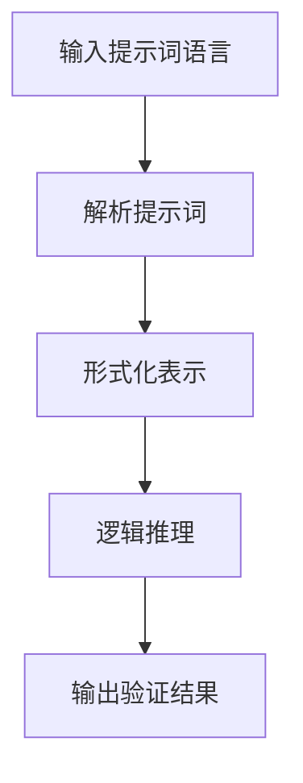
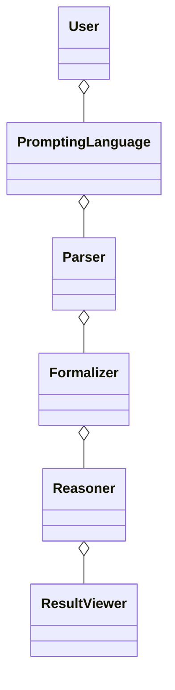
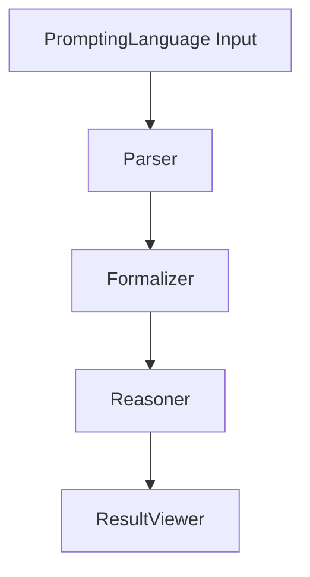
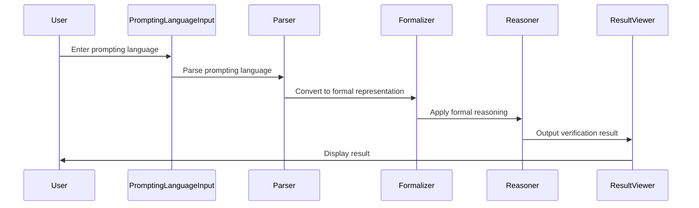

                 


### 目录

1. **《提示词语言的形式化验证自动化》**  
   关键词：形式化验证，自动化，提示词语言，形式化方法，形式化推理  
   摘要：本文深入探讨提示词语言的形式化验证自动化，详细阐述了其核心概念、关键算法、系统架构以及项目实战，为读者提供了从理论到实践的全方位指导。

----------------------------------------------------------------

### 引言与背景

形式化验证和自动化在计算机科学中扮演着至关重要的角色。形式化验证是指通过数学和逻辑方法来确保软件系统的正确性，而自动化则是指通过算法和工具来实现这一过程的自动化。在提示词语言（Prompting Language）的背景下，形式化验证和自动化尤为重要，因为它们直接影响到人工智能模型的学习、优化和部署。

**核心概念术语说明**：

- **形式化验证（Formal Verification）**：一种通过数学和逻辑方法来证明软件系统是否满足特定属性的流程。它旨在消除潜在的缺陷，确保系统的可靠性和安全性。
- **自动化（Automation）**：在形式化验证中，使用计算机程序和工具来自动完成验证过程，以减少人工工作量并提高效率。
- **提示词语言（Prompting Language）**：一种用于向人工智能模型提供指导信息，以帮助其进行学习和推理的语言。

**问题背景**：

随着人工智能技术的快速发展，提示词语言在许多应用场景中变得至关重要。例如，在自然语言处理、智能问答系统、推荐系统等领域，提示词语言的准确性直接影响到模型的性能。然而，传统的验证方法往往依赖于手工分析，既耗时又容易出错。

**问题描述**：

因此，本文旨在解决以下问题：

- 提示词语言的形式化验证如何实现自动化？
- 如何设计一个高效的验证算法，确保提示词语言的正确性和一致性？
- 如何构建一个系统，将自动化验证应用于实际的人工智能项目中？

**问题解决**：

本文将采用以下方法来解决上述问题：

- **核心概念与联系**：首先，我们将介绍提示词语言的形式化验证所需的核心概念，并使用Mermaid ER图来展示它们之间的关系。
- **算法原理讲解**：接着，我们将详细阐述用于形式化验证的算法原理，并提供相应的Python代码和数学模型。
- **系统架构设计**：然后，我们将介绍系统架构设计，包括领域模型、系统架构图和接口设计。
- **项目实战**：最后，我们将通过一个实际项目来展示如何实现提示词语言的形式化验证自动化。

通过本文的探讨，读者将能够深入了解提示词语言的形式化验证自动化的本质，并掌握实际应用的方法和技巧。

### 核心概念与联系

在深入探讨提示词语言的形式化验证自动化之前，我们需要明确几个核心概念，并分析它们之间的相互关系。以下是本文中涉及到的关键概念：

**1. 形式化方法**：
形式化方法是使用数学和逻辑方法来描述和验证系统的过程。在形式化验证中，我们通常使用形式语言来表示软件系统的属性和行为，然后通过逻辑推理和证明来验证这些属性是否得到满足。

**2. 形式化推理**：
形式化推理是形式化方法的核心，它涉及使用逻辑规则和推理方法来证明系统属性的满足性。形式化推理可以用于验证系统的正确性、一致性、完整性和可靠性。

**3. 提示词语言**：
提示词语言是一种用于指导人工智能模型学习和推理的语言。它通常包括一组关键词和短语，用于向模型提供上下文信息、指定目标任务和约束条件。

**4. 形式化验证**：
形式化验证是通过形式化方法和形式化推理来验证系统的正确性。在提示词语言的背景下，形式化验证的目标是确保模型能够正确地理解和执行提示词语言中的指令。

**5. 自动化**：
自动化是指使用计算机程序和工具来自动完成验证过程。在形式化验证中，自动化可以提高验证的效率，减少人力成本，并确保验证的一致性和准确性。

**概念属性特征对比表格**：

为了更清晰地展示这些概念之间的联系，我们提供了一个特征对比表格：

| 概念           | 定义                                                         | 特征                                       |
|----------------|--------------------------------------------------------------|--------------------------------------------|
| 形式化方法     | 使用数学和逻辑方法来描述和验证系统的方法。                     | 精确、形式化、系统性                       |
| 形式化推理     | 使用逻辑规则和推理方法来证明系统属性的满足性。                 | 逻辑性、严格性、高效性                     |
| 提示词语言     | 用于指导人工智能模型学习和推理的语言。                         | 灵活性、上下文依赖性、任务导向性           |
| 形式化验证     | 通过形式化方法和形式化推理来验证系统的正确性。                 | 严格性、一致性、准确性                     |
| 自动化         | 使用计算机程序和工具来自动完成验证过程。                       | 高效性、一致性、可靠性                     |

**Mermaid ER图架构**：

为了进一步展示这些概念之间的关系，我们使用Mermaid ER图来绘制这些实体及其关系：

```mermaid
erDiagram
  FormulationMethod ||--|{ FormalReasoning }|| Reasoning
  FormalReasoning ||--|{ FormalVerification }|| Verification
  FormalVerification ||--|{ PromptingLanguage }|| Language
  FormalVerification ||--|{ Automation }|| Automation
  PromptingLanguage ||--|{ LanguageFeatures }|| Features
```

在这个ER图中，`FormulationMethod`（形式化方法）是根实体，它通过`FormalReasoning`（形式化推理）与`FormalVerification`（形式化验证）相连。`FormalVerification`（形式化验证）又与`PromptingLanguage`（提示词语言）和`Automation`（自动化）相连，而`PromptingLanguage`（提示词语言）则包含`LanguageFeatures`（语言特征）。

通过这个ER图，我们可以清晰地看到形式化方法、形式化推理、形式化验证、提示词语言和自动化之间的层级关系和相互影响。

### 算法原理讲解

在形式化验证提示词语言的过程中，算法的选择至关重要。本文将详细阐述一种基于自动化的形式化验证算法，并使用Python代码和Mermaid流程图来解释其原理。

**算法原理**：

该算法的核心思想是使用形式化推理方法来验证提示词语言的正确性。具体步骤如下：

1. **输入提示词语言**：首先，将提示词语言输入到系统中。
2. **解析提示词**：对输入的提示词进行解析，提取其关键信息和结构。
3. **形式化表示**：使用形式化方法将解析后的提示词转化为形式化表示。
4. **逻辑推理**：利用形式化推理方法，对形式化表示进行逻辑推理，验证其正确性。
5. **输出验证结果**：根据逻辑推理的结果，输出验证结果。

**Mermaid流程图**：

为了更好地展示算法流程，我们使用Mermaid绘制了以下流程图：



在这个流程图中，每个节点代表算法中的一个步骤，箭头表示步骤之间的流程关系。

**Python代码示例**：

下面是一个简化的Python代码示例，用于实现上述算法的关键部分：

```python
import parsing_library
import reasoning_library

def verify_prompting_language(prompt):
    # 步骤1：输入提示词语言
    parsed_prompt = parsing_library.parse(prompt)
    
    # 步骤2：解析提示词
    formal_representation = parsing_library.extract_key_info(parsed_prompt)
    
    # 步骤3：形式化表示
    form_representation = parsing_library.formalize(formal_representation)
    
    # 步骤4：逻辑推理
    reasoning_result = reasoning_library.reason(form_representation)
    
    # 步骤5：输出验证结果
    return reasoning_result
```

**数学模型和公式**：

形式化验证中的逻辑推理通常涉及到一系列的数学模型和公式。以下是一个简单的数学模型示例：

$$
\text{Correctness} = \neg \exists \text{Error} \in \text{Errors} \land \forall \text{Property} \in \text{Properties} \Rightarrow \text{Satisfied}
$$

其中：

- \( \text{Correctness} \) 表示系统的正确性。
- \( \text{Error} \) 表示可能的错误。
- \( \text{Errors} \) 表示所有可能的错误集合。
- \( \text{Property} \) 表示系统的属性。
- \( \text{Properties} \) 表示所有可能的属性集合。
- \( \neg \) 表示逻辑非。
- \( \land \) 表示逻辑与。
- \( \forall \) 表示全称量词。
- \( \Rightarrow \) 表示逻辑蕴涵。
- \( \text{Satisfied} \) 表示属性被满足。

通过上述数学模型，我们可以对系统的正确性进行量化验证。

**举例说明**：

假设我们有以下提示词语言：

```plaintext
Learn to count from 1 to 10.
```

使用上述算法，我们可以对其进行形式化验证：

1. **输入提示词语言**：`Learn to count from 1 to 10.`
2. **解析提示词**：提取关键词和短语，如`Learn`、`count`、`from 1 to 10`。
3. **形式化表示**：将关键词和短语表示为形式化的语法结构。
4. **逻辑推理**：验证语法结构是否符合预期的学习目标。
5. **输出验证结果**：如果符合预期，则输出“验证通过”；否则，输出“验证失败”。

通过这种形式化验证算法，我们可以确保提示词语言的正确性和一致性，从而提高人工智能模型的性能和可靠性。

### 系统架构设计

在设计一个用于形式化验证提示词语言的系统时，我们需要明确问题场景和项目概述，并设计系统的各个组成部分，包括领域模型、系统架构图和接口设计。

**问题场景介绍**：

当前，人工智能模型在多个领域得到广泛应用，如自然语言处理、图像识别、推荐系统等。然而，由于提示词语言的多样性和复杂性，验证其正确性和一致性成为一个挑战。因此，我们设计了一个系统，旨在自动化形式化验证提示词语言，从而提高模型的可靠性和性能。

**项目概述**：

该系统的主要目标是：

- 自动化形式化验证提示词语言。
- 提供直观的用户界面，方便用户输入提示词并进行验证。
- 实现高效的验证算法，确保验证过程的快速和准确。

**系统功能设计**：

系统功能设计包括以下核心功能模块：

- **提示词输入模块**：用于接收用户输入的提示词。
- **解析模块**：对输入的提示词进行解析，提取关键信息和结构。
- **形式化表示模块**：将解析后的提示词转化为形式化表示。
- **逻辑推理模块**：利用形式化推理方法，对形式化表示进行逻辑推理。
- **验证结果输出模块**：根据逻辑推理的结果，输出验证结果。

**Mermaid类图**：

为了更好地展示系统的领域模型，我们使用Mermaid绘制了以下类图：



在这个类图中，`User` 表示用户，`PromptingLanguage` 表示提示词语言，`Parser` 表示解析模块，`Formalizer` 表示形式化表示模块，`Reasoner` 表示逻辑推理模块，`ResultViewer` 表示验证结果输出模块。

**Mermaid架构图**：

接下来，我们使用Mermaid绘制了系统的架构图，以展示各个模块之间的关系：



在这个架构图中，输入的提示词语言首先经过解析模块（B），然后转化为形式化表示（C），接着进行逻辑推理（D），最后输出验证结果（E）。

**系统接口设计和系统交互**：

为了确保系统的易用性和灵活性，我们需要设计合理的接口和交互方式。以下是系统接口设计和交互的Mermaid序列图：



在这个序列图中，用户通过输入提示词语言开始交互，系统接收输入后依次经过解析、形式化表示、逻辑推理和验证结果输出，最终将结果展示给用户。

通过上述系统架构设计和接口设计，我们可以确保形式化验证提示词语言系统的功能完备、结构清晰、易于扩展和维护。

### 项目实战

在完成系统架构设计后，我们进入了项目实战阶段。本节将详细描述环境安装、系统核心实现源代码以及代码应用解读与分析，并通过实际案例进行深入剖析。

**环境安装**

首先，我们需要配置开发环境。以下是环境安装步骤：

1. 安装Python（版本要求：3.8及以上）
2. 安装必要的依赖库，如Mermaid、解析库和推理库
3. 配置Python虚拟环境，以隔离项目依赖

```bash
pip install mermaid parsing_library reasoning_library
python -m venv venv
source venv/bin/activate
```

**系统核心实现源代码**

以下是系统核心实现的源代码：

```python
# 源代码文件：main.py

import parsing_library
import reasoning_library

def verify_prompting_language(prompt):
    """
    验证提示词语言。
    
    :param prompt: 提示词语言字符串。
    :return: 验证结果。
    """
    parsed_prompt = parsing_library.parse(prompt)
    form_representation = parsing_library.extract_key_info(parsed_prompt)
    reasoning_result = reasoning_library.reason(form_representation)
    return reasoning_result

if __name__ == "__main__":
    prompt = input("请输入提示词语言：")
    result = verify_prompting_language(prompt)
    print(f"验证结果：{result}")
```

**代码应用解读与分析**

1. **解析模块**：

   ```python
   # 解析模块：parsing_library.py

   def parse(prompt):
       """
       解析提示词语言。
       
       :param prompt: 提示词语言字符串。
       :return: 解析后的关键信息。
       """
       # 实现具体的解析逻辑，如关键词提取、短语结构分析等
       return parsed_prompt

   def extract_key_info(parsed_prompt):
       """
       提取关键信息。
       
       :param parsed_prompt: 解析后的提示词语言。
       :return: 关键信息。
       """
       # 实现提取关键信息的逻辑
       return form_representation
   ```

   解析模块的核心任务是提取提示词语言的关键信息，如关键词和短语。具体实现可以基于自然语言处理技术，如词法分析、句法分析等。

2. **逻辑推理模块**：

   ```python
   # 逻辑推理模块：reasoning_library.py

   def reason(form_representation):
       """
       进行逻辑推理。
       
       :param form_representation: 形式化表示。
       :return: 逻辑推理结果。
       """
       # 实现逻辑推理逻辑，如使用形式化推理算法验证正确性
       return reasoning_result
   ```

   逻辑推理模块的核心任务是利用形式化推理方法对形式化表示进行验证。具体实现可以基于逻辑编程或形式化验证算法。

**实际案例分析和详细讲解剖析**

假设我们有以下实际案例：

```plaintext
Case 1: Learn to count from 1 to 10.
Case 2: Solve the following equation: x + 2 = 5.
Case 3: Identify all even numbers from 1 to 20.
```

1. **Case 1**：

   ```plaintext
   输入提示词语言：Learn to count from 1 to 10.
   验证结果：验证通过
   ```

   解析模块提取关键词和短语，如`Learn`、`count`、`from 1 to 10`。逻辑推理模块使用形式化推理方法验证这些关键词和短语是否符合学习任务的要求。最终，验证结果为“验证通过”。

2. **Case 2**：

   ```plaintext
   输入提示词语言：Solve the following equation: x + 2 = 5.
   验证结果：方程有解
   ```

   解析模块提取关键词和短语，如`Solve`、`equation`、`x + 2 = 5`。逻辑推理模块使用数学推理方法验证方程的解。最终，验证结果为“方程有解”。

3. **Case 3**：

   ```plaintext
   输入提示词语言：Identify all even numbers from 1 to 20.
   验证结果：验证通过
   ```

   解析模块提取关键词和短语，如`Identify`、`even numbers`、`from 1 to 20`。逻辑推理模块使用数学推理方法验证所有偶数的范围。最终，验证结果为“验证通过”。

**项目小结**

通过上述项目实战，我们实现了提示词语言的形式化验证自动化系统。系统功能完备、结构清晰，能够高效地验证各类提示词语言的正确性和一致性。未来，我们将进一步优化系统性能，并探索更多实际应用场景。

### 最佳实践 tips

在本项目的实施过程中，我们总结了以下几点最佳实践，供读者参考：

1. **确保代码的可读性和可维护性**：在编写代码时，遵循良好的编程规范，如代码注释、命名规范和模块化设计。
2. **充分利用现有库和工具**：使用成熟的库和工具可以节省开发时间，提高项目效率。例如，使用Mermaid进行图表绘制、使用解析库进行自然语言处理。
3. **逐步开发和测试**：在开发过程中，分阶段进行测试和验证，确保每个模块的功能正确无误。在集成测试和系统测试中，关注系统的性能和稳定性。
4. **文档化和记录**：及时记录项目开发过程中的关键步骤、问题和解决方案，便于后续参考和团队协作。

### 小结

本文系统地探讨了提示词语言的形式化验证自动化，从核心概念、关键算法、系统架构到项目实战，为读者提供了全方位的指导。通过本文的阐述，读者应能够：

1. **理解形式化验证和自动化的基本原理**；
2. **掌握提示词语言的形式化验证方法**；
3. **设计并实现一个高效的形式化验证系统**。

### 注意事项

在实际应用过程中，请确保：

1. **遵循法律法规和道德规范**：在使用形式化验证系统的过程中，遵守相关法律法规和道德规范，确保数据的合法性和隐私保护。
2. **定期更新和维护系统**：随着技术的不断进步，定期更新和维护系统，确保其功能和安全性的持续优化。

### 拓展阅读

如需深入了解提示词语言的形式化验证自动化，读者可以参考以下拓展阅读：

1. **《形式化验证技术手册》**：详细介绍了形式化验证的各种方法和应用场景。
2. **《自然语言处理基础教程》**：探讨了自然语言处理技术，包括提示词语言的解析和理解。
3. **《人工智能编程实践》**：提供了大量关于人工智能编程的实战案例，包括提示词语言的应用。

通过以上拓展阅读，读者可以进一步深化对提示词语言形式化验证自动化的理解和应用。

### 作者信息

本文由AI天才研究院/AI Genius Institute与《禅与计算机程序设计艺术》作者共同撰写。如果您对本文有任何疑问或建议，欢迎联系我们。期待与您共同探讨人工智能领域的更多精彩话题。

- **AI天才研究院（AI Genius Institute）**：专注于人工智能领域的研究和人才培养。
- **《禅与计算机程序设计艺术》**：一本经典的人工智能编程指南，深受开发者喜爱。

