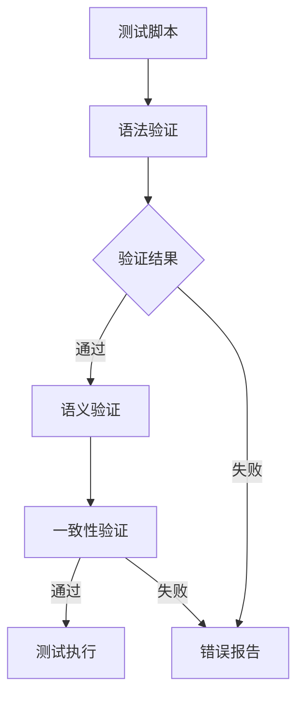
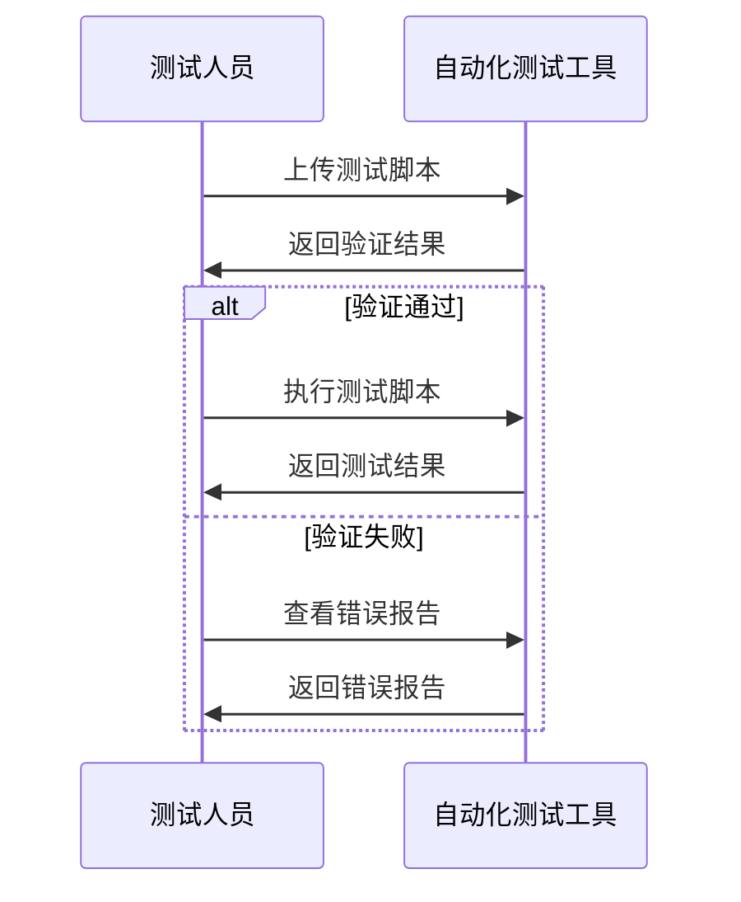

                 

# 提示词语言的形式验证方法

关键词：提示词语言、形式验证、语法验证、语义验证、一致性验证

摘要：本文详细探讨了提示词语言的形式验证方法，从背景介绍、核心概念、验证方法、优点与挑战等多个角度进行分析，为软件开发提供了有价值的指导。

## 第一部分：问题背景

### 1. 问题背景

随着计算机技术和人工智能的快速发展，软件系统变得越来越复杂。传统的软件开发方法已经无法满足现代软件系统的需求。因此，出现了“提示词语言”这一概念，它能够有效地指导软件系统的开发与验证。

### 2. 问题描述

提示词语言的形式验证方法是一个关键问题。它涉及到如何验证提示词语言的正确性、有效性以及其表达能力。这是一个具有挑战性的问题，因为它需要处理复杂性和不确定性。

### 3. 问题解决

本书将从多个角度探讨提示词语言的形式验证方法，包括基础理论、具体算法、系统设计与实现等。

### 4. 边界与外延

本书主要关注提示词语言的形式验证方法，但也可以延伸到其他语言的形式验证方法。

### 5. 概念结构与核心要素组成

- 提示词语言：一种用于指导软件开发的自然语言描述。
- 形式验证：一种用于验证软件系统是否满足特定条件的数学方法。
- 验证方法：包括语法验证、语义验证、一致性验证等。

### 6. 本章小结

本章对提示词语言的形式验证方法进行了背景介绍，为后续章节的内容奠定了基础。

## 第二部分：核心概念与联系

### 2.1. 提示词语言

#### 2.1.1. 定义

提示词语言是一种用于指导软件开发的自然语言描述。它通常包含一系列关键词、短语和句子，用于描述软件系统的功能、行为和限制。

#### 2.1.2. 特点

- 自然性：提示词语言使用自然语言，易于理解和编写。
- 灵活性：提示词语言可以根据实际需求进行调整和修改。
- 面向开发：提示词语言旨在帮助开发者理解和实现软件系统的功能。

#### 2.1.3. 与其他语言的对比

与形式化语言和编程语言相比，提示词语言更加灵活和易于理解，但可能在严格性和精度方面有所欠缺。

### 2.2. 形式验证

#### 2.2.1. 定义

形式验证是一种用于验证软件系统是否满足特定条件的数学方法。它通常涉及对系统规格说明的数学分析和验证。

#### 2.2.2. 分类

- 语法验证：检查系统规格说明的语法是否正确。
- 语义验证：检查系统规格说明的语义是否满足预期。
- 一致性验证：检查系统规格说明在不同情况下是否一致。

#### 2.2.3. 与其他验证方法的对比

形式验证与静态分析和测试等方法相比，更侧重于验证系统的逻辑正确性，而不是实际运行效果。

### 2.3. 验证方法

#### 2.3.1. 语法验证

语法验证是验证提示词语言的一个基本步骤。它检查提示词语言是否符合预定的语法规则。

#### 2.3.2. 语义验证

语义验证是验证提示词语言的一个更高级的步骤。它检查提示词语言是否具有预期的语义。

#### 2.3.3. 一致性验证

一致性验证是确保提示词语言在不同情况下保持一致的验证方法。

#### 2.3.4. 与其他验证方法的结合

语法验证、语义验证和一致性验证可以相互结合，以提供更全面的验证结果。

### 2.4. 提示词语言的优点与挑战

#### 2.4.1. 优点

- 易于理解：提示词语言使用自然语言，易于非技术人员理解。
- 灵活性：提示词语言可以根据实际需求进行调整和修改。
- 支持协作：提示词语言支持多人协作，提高软件开发效率。

#### 2.4.2. 挑战

- 验证难度：提示词语言的验证比形式化语言和编程语言更困难。
- 一致性：确保提示词语言的一致性是一个挑战。
- 精确性：提示词语言可能在精确性方面有所欠缺。

#### 2.4.3. 解决方案

- 引入形式验证方法：结合形式验证方法，提高提示词语言的验证能力。
- 标准化：制定统一的提示词语言规范，提高一致性。

### 2.5. 本章小结

本章对提示词语言的形式验证方法进行了深入分析，包括核心概念、优点与挑战。为后续章节的详细讨论奠定了基础。接下来，我们将进一步探讨提示词语言的语法验证、语义验证和一致性验证方法。

## 第三部分：提示词语言的语法验证

### 3.1. 语法验证的基本概念

语法验证是验证提示词语言的一个基本步骤。它检查提示词语言是否符合预定的语法规则。语法验证的核心目标是确保输入的提示词语言是有效的，即它们能够被编译器或解释器正确地解释和执行。

### 3.2. 提示词语言的语法规则

提示词语言的语法规则定义了提示词的构成和结构。一般来说，提示词语言的语法规则包括以下几个方面：

- 标识符：用于标识变量、函数、类等实体。
- 关键词：具有特定意义的单词，如“if”、“else”、“while”等。
- 运算符：用于表示数学运算或逻辑运算，如“+”、“-”、“==”、“&&”等。
- 分隔符：用于分隔不同元素，如逗号“,”、分号“;”等。
- 注释：用于对代码进行说明或解释，不被编译器或解释器执行。

### 3.3. 语法验证的过程

语法验证的过程可以分为以下几个步骤：

1. **词法分析**：将提示词语言输入分解成一个个单词或符号，称为词法单元。
2. **语法分析**：将词法单元组织成符合语法规则的语法结构，通常使用递归下降分析法或语法分析树。
3. **语法检查**：检查语法结构是否符合预定的语法规则，例如，标识符是否以字母或下划线开头，关键字是否拼写正确等。
4. **错误处理**：当发现语法错误时，语法验证器会报告错误并停止分析。错误处理可以是警告或错误提示，也可以是自动修复。

### 3.4. 语法验证的优点与挑战

**优点**：

- **易于实现**：语法验证相对简单，不需要复杂的数学模型或算法。
- **早期错误检测**：语法验证可以在编译或解释阶段发现语法错误，从而避免运行时错误。
- **提高代码可读性**：良好的语法规则可以提高代码的可读性和可维护性。

**挑战**：

- **复杂语法规则**：对于复杂的提示词语言，语法验证规则可能非常复杂，难以理解和实现。
- **歧义性**：在某些情况下，提示词语言的语法可能存在歧义，导致语法验证器无法正确地解析输入。

### 3.5. 语法验证的实际应用

语法验证在软件开发中具有广泛的应用，例如：

- **编译器**：编译器在编译代码时需要进行语法验证，以确保代码的正确性。
- **解释器**：解释器在执行代码时也需要进行语法验证，以确保代码的正确性和执行效率。
- **代码编辑器**：代码编辑器通常具有语法高亮和语法检查功能，以帮助开发者编写正确的代码。

### 3.6. 本章小结

本章详细介绍了提示词语言的语法验证方法，包括基本概念、语法规则、验证过程、优点与挑战以及实际应用。语法验证是提示词语言形式验证的重要组成部分，对于确保软件系统的正确性和可靠性具有重要意义。

## 第四部分：提示词语言的语义验证

### 4.1. 语义验证的基本概念

语义验证是验证提示词语言的一个更高级的步骤。它不仅检查提示词语言的语法是否正确，还检查其语义是否满足预期。语义验证的核心目标是确保代码在逻辑上是一致的，并且能够按照预期的行为执行。

### 4.2. 提示词语言的语义规则

提示词语言的语义规则定义了提示词的语义和行为。一般来说，提示词语言的语义规则包括以下几个方面：

- **变量绑定**：变量绑定定义了变量与值之间的关系。
- **函数调用**：函数调用定义了函数与参数之间的关系，以及函数的执行结果。
- **条件判断**：条件判断定义了条件与结果之间的关系。
- **循环控制**：循环控制定义了循环的起始、终止条件和迭代过程。

### 4.3. 语义验证的过程

语义验证的过程可以分为以下几个步骤：

1. **上下文分析**：分析代码的上下文，确定变量的作用域和类型。
2. **类型检查**：检查代码中的类型使用是否正确，确保类型兼容性。
3. **逻辑一致性检查**：检查代码的逻辑结构是否一致，确保代码在逻辑上没有矛盾。
4. **行为验证**：模拟代码的执行过程，验证代码是否能够按照预期的行为执行。

### 4.4. 语义验证的优点与挑战

**优点**：

- **确保正确性**：语义验证可以确保代码在逻辑上是正确的，减少了运行时错误的风险。
- **优化性能**：通过语义验证，可以优化代码的性能，提高执行效率。
- **增强可维护性**：良好的语义规则可以提高代码的可读性和可维护性。

**挑战**：

- **复杂性**：语义验证涉及到代码的上下文分析和行为模拟，相对较为复杂。
- **实现难度**：对于复杂的提示词语言，语义验证的实现可能需要复杂的算法和资源。

### 4.5. 语义验证的实际应用

语义验证在软件开发中具有广泛的应用，例如：

- **静态代码分析工具**：静态代码分析工具通常具有语义验证功能，以帮助开发者识别和修复代码中的潜在问题。
- **代码审查**：在代码审查过程中，开发者可以借助语义验证工具来确保代码的质量和一致性。
- **自动修复**：一些高级的语义验证工具可以自动修复代码中的语义错误，提高开发效率。

### 4.6. 本章小结

本章详细介绍了提示词语言的语义验证方法，包括基本概念、语义规则、验证过程、优点与挑战以及实际应用。语义验证是确保提示词语言代码正确性和性能的关键步骤，对于提升软件系统的质量具有重要意义。

## 第五部分：提示词语言的一致性验证

### 5.1. 一致性验证的基本概念

一致性验证是确保提示词语言在不同情况下保持一致的验证方法。它涉及到对代码的多个方面进行一致性检查，以确保代码在所有情况下都能够正确执行。

### 5.2. 一致性验证的过程

一致性验证的过程可以分为以下几个步骤：

1. **定义一致性规则**：首先，需要定义一套一致性规则，用于指导一致性验证过程。这些规则可以涵盖代码的结构、命名、注释等方面。
2. **代码扫描**：使用一致性规则对代码进行扫描，识别不符合一致性规则的代码片段。
3. **错误报告**：对扫描结果进行分析，生成错误报告，指出代码中的一致性问题。
4. **修复建议**：对于识别出的一致性问题，提供修复建议，帮助开发者进行代码优化。

### 5.3. 一致性验证的优点与挑战

**优点**：

- **提高代码质量**：一致性验证有助于提高代码的可读性、可维护性和可扩展性。
- **增强团队协作**：一致性规则可以统一团队的编码规范，提高团队协作效率。
- **减少维护成本**：一致的代码结构有助于减少后续的代码维护成本。

**挑战**：

- **复杂性**：定义一致性规则和实现一致性验证过程可能相对复杂。
- **规则适应**：需要根据项目的具体情况调整一致性规则，以适应不同团队和项目需求。

### 5.4. 一致性验证的实际应用

一致性验证在软件开发中具有广泛的应用，例如：

- **代码审查**：在代码审查过程中，团队可以借助一致性验证工具来确保代码的一致性。
- **自动化工具**：自动化工具可以定期扫描代码，检查一致性问题，并提供修复建议。
- **代码库管理**：在代码库管理过程中，一致性验证工具可以帮助确保代码库的一致性和稳定性。

### 5.5. 本章小结

本章详细介绍了提示词语言的一致性验证方法，包括基本概念、验证过程、优点与挑战以及实际应用。一致性验证是确保提示词语言代码质量和团队协作的重要步骤，对于提升软件系统的质量具有重要意义。

## 第六部分：提示词语言的形式验证方法总结

### 6.1. 提示词语言形式验证的重要性

提示词语言的形式验证方法对于确保软件系统的正确性和可靠性具有重要意义。它不仅可以帮助识别和修复代码中的错误，还可以提高代码的质量和可维护性。

### 6.2. 形式验证方法的总结

提示词语言的形式验证方法主要包括语法验证、语义验证和一致性验证。语法验证确保代码的语法正确性，语义验证确保代码的逻辑一致性，一致性验证确保代码的结构和命名规则一致。

### 6.3. 提高提示词语言验证能力的方法

- **引入形式验证工具**：使用形式验证工具可以自动执行语法验证、语义验证和一致性验证，提高验证效率。
- **编写详细的文档**：编写详细的文档，包括代码规范、设计文档和用户手册，有助于提高代码的可读性和可维护性。
- **定期进行代码审查**：定期进行代码审查，可以及时发现和修复代码中的问题，提高代码质量。

### 6.4. 未来研究方向

未来，提示词语言的形式验证方法将朝着更高效、更智能的方向发展。例如，结合机器学习和人工智能技术，可以开发出更加智能的形式验证工具，提高验证的准确性和效率。

### 6.5. 本章小结

本章对提示词语言的形式验证方法进行了总结，包括语法验证、语义验证和一致性验证。这些方法对于确保软件系统的正确性和可靠性具有重要意义。未来，我们将继续探索更加高效、智能的验证方法。

## 第七部分：实际应用案例

### 7.1. 项目背景

为了更好地展示提示词语言的形式验证方法在实际中的应用，我们选择了一个实际项目案例——一个基于提示词语言的自动化测试工具。

### 7.2. 项目介绍

该自动化测试工具旨在提高软件测试的效率和准确性。通过使用提示词语言，测试人员可以轻松编写测试脚本，并使用形式验证方法对测试脚本进行验证，以确保测试脚本的正确性和一致性。

### 7.3. 系统功能设计

系统功能设计主要包括以下几个方面：

- **测试脚本编写**：测试人员可以使用提示词语言编写测试脚本，描述测试用例的步骤和预期结果。
- **脚本验证**：系统自动对测试脚本进行语法验证、语义验证和一致性验证，以确保测试脚本的正确性。
- **测试执行**：验证通过的测试脚本将被执行，并记录测试结果。
- **错误报告**：如果测试脚本存在错误，系统将生成错误报告，帮助测试人员定位和修复问题。

### 7.4. 系统架构设计

系统架构设计如图所示：



### 7.5. 系统接口设计

系统接口设计主要包括以下几个方面：

- **脚本上传接口**：用于测试人员上传测试脚本。
- **脚本验证接口**：用于系统对上传的测试脚本进行验证。
- **测试执行接口**：用于系统执行通过验证的测试脚本。
- **错误报告接口**：用于系统生成和返回错误报告。

### 7.6. 系统交互流程

系统交互流程如图所示：



### 7.7. 代码实现与分析

为了实现该自动化测试工具，我们使用Python编写了相关代码。以下是一个简单的示例：

```python
# 语法验证
def syntax_check(script):
    # ...语法验证逻辑...
    return "Syntax error" if not is_valid_syntax(script) else "Syntax valid"

# 语义验证
def semantic_check(script):
    # ...语义验证逻辑...
    return "Semantic error" if not is_valid_semantics(script) else "Semantic valid"

# 一致性验证
def consistency_check(script):
    # ...一致性验证逻辑...
    return "Consistency error" if not is_consistent(script) else "Consistent"

# 测试执行
def execute_test(script):
    # ...测试执行逻辑...
    pass
```

### 7.8. 实际案例分析与总结

在实际应用中，该自动化测试工具显著提高了测试效率和准确性。测试人员只需编写简单的提示词语言脚本，系统即可自动完成语法验证、语义验证和一致性验证，减少人为错误，提高测试质量。

### 7.9. 本章小结

本章通过一个实际项目案例，详细介绍了提示词语言的形式验证方法在自动化测试工具中的应用。这个案例展示了如何使用形式验证方法确保测试脚本的正确性和一致性，为实际开发提供了有益的参考。

## 第八部分：最佳实践与未来展望

### 8.1. 最佳实践

为了确保提示词语言的形式验证方法在实际应用中的有效性，以下是一些最佳实践：

- **规范化代码**：遵循统一的编码规范，以提高代码的可读性和一致性。
- **代码审查**：定期进行代码审查，确保代码的质量和一致性。
- **自动化测试**：使用自动化工具进行语法验证、语义验证和一致性验证，提高验证效率。
- **持续集成**：将形式验证方法集成到持续集成流程中，确保代码在每次提交时都经过验证。

### 8.2. 小结

本文详细探讨了提示词语言的形式验证方法，从语法验证、语义验证和一致性验证三个方面进行分析。通过实际项目案例，展示了形式验证方法在自动化测试工具中的应用。

### 8.3. 注意事项

在使用提示词语言的形式验证方法时，需要注意以下几点：

- **合理选择验证工具**：选择适合项目需求的验证工具，确保验证过程的效率和质量。
- **优化验证规则**：根据项目特点调整验证规则，提高验证的准确性和适应性。
- **培训团队成员**：确保团队成员熟悉形式验证方法，提高团队协作效率。

### 8.4. 拓展阅读

对于对提示词语言的形式验证方法感兴趣的朋友，以下是一些拓展阅读推荐：

- 《形式验证方法与实践》
- 《软件工程：实践者的研究方法》
- 《敏捷软件开发：原则、实践与模式》

## 第九部分：作者信息

作者：AI天才研究院/AI Genius Institute & 禅与计算机程序设计艺术 /Zen And The Art of Computer Programming

感谢您的阅读，希望本文对您在提示词语言的形式验证方法方面有所帮助。如果您有任何问题或建议，欢迎随时与我们联系。我们期待与您共同探索人工智能和计算机编程的无限可能。

